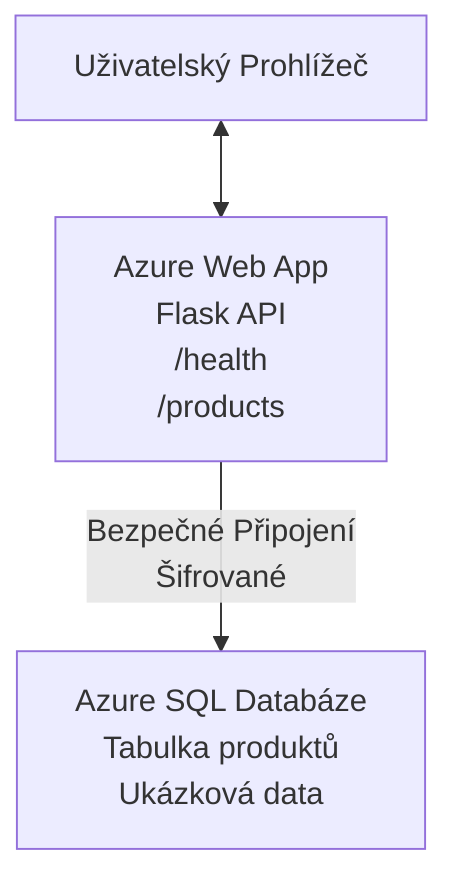

# Nasazení databáze Microsoft SQL a webové aplikace pomocí AZD

⏱️ **Odhadovaný čas**: 20-30 minut | 💰 **Odhadované náklady**: ~15-25 USD/měsíc | ⭐ **Složitost**: Středně pokročilá

Tento **úplný, funkční příklad** ukazuje, jak použít [Azure Developer CLI (azd)](https://learn.microsoft.com/azure/developer/azure-developer-cli/) k nasazení webové aplikace Python Flask s databází Microsoft SQL na Azure. Veškerý kód je zahrnut a otestován—není potřeba žádných externích závislostí.

## Co se naučíte

Po dokončení tohoto příkladu budete umět:
- Nasadit vícestupňovou aplikaci (webová aplikace + databáze) pomocí infrastruktury jako kódu
- Konfigurovat zabezpečené připojení k databázi bez tvrdě zakódovaných tajemství
- Monitorovat stav aplikace pomocí Application Insights
- Efektivně spravovat zdroje Azure s pomocí AZD CLI
- Dodržovat nejlepší postupy Azure pro zabezpečení, optimalizaci nákladů a sledovatelnost

## Přehled scénáře
- **Webová aplikace**: Python Flask REST API s připojením k databázi
- **Databáze**: Azure SQL Database s ukázkovými daty
- **Infrastruktura**: Provisionována pomocí Bicep (modulární, znovupoužitelné šablony)
- **Nasazení**: Plně automatizované pomocí příkazů `azd`
- **Monitorování**: Application Insights pro protokoly a telemetrii

## Požadavky

### Požadované nástroje

Před zahájením si ověřte, že máte tyto nástroje nainstalované:

1. **[Azure CLI](https://learn.microsoft.com/cli/azure/install-azure-cli)** (verze 2.50.0 nebo vyšší)
   ```sh
   az --version
   # Očekávaný výstup: azure-cli 2.50.0 nebo vyšší
   ```

2. **[Azure Developer CLI (azd)](https://learn.microsoft.com/azure/developer/azure-developer-cli/install-azd)** (verze 1.0.0 nebo vyšší)
   ```sh
   azd version
   # Očekávaný výstup: azd verze 1.0.0 nebo vyšší
   ```

3. **[Python 3.8+](https://www.python.org/downloads/)** (pro lokální vývoj)
   ```sh
   python --version
   # Očekávaný výstup: Python 3.8 nebo novější
   ```

4. **[Docker](https://www.docker.com/get-started)** (volitelně, pro lokální vývoj v kontejnerech)
   ```sh
   docker --version
   # Očekávaný výstup: Docker verze 20.10 nebo vyšší
   ```

### Požadavky Azure

- Aktivní **předplatné Azure** ([vytvořte si bezplatný účet](https://azure.microsoft.com/free/))
- Oprávnění k vytváření zdrojů ve vašem předplatném
- Role **Vlastník** nebo **Přispěvatel** na předplatném nebo skupině prostředků

### Předchozí znalosti

Toto je **středně pokročilý** příklad. Měli byste být obeznámeni s:
- Základními příkazovými řádky
- Základními cloudovými koncepty (zdroje, skupiny zdrojů)
- Základní znalostí webových aplikací a databází

**Jste noví v AZD?** Začněte nejprve s [průvodcem Začínáme](../../docs/chapter-01-foundation/azd-basics.md).

## Architektura

Tento příklad nasazuje dvouvrstvou architekturu s webovou aplikací a SQL databází:


**Nasazení zdrojů:**
- **Skupina prostředků**: Kontejner pro všechny zdroje
- **App Service plán**: Hostování na Linuxu (tier B1 pro úsporu nákladů)
- **Webová aplikace**: Runtime Python 3.11 s Flask aplikací
- **SQL server**: Spravovaný databázový server s minimem TLS 1.2
- **SQL databáze**: Basic tier (2GB, vhodné pro vývoj/testování)
- **Application Insights**: Monitorování a protokolování
- **Log Analytics Workspace**: Centralizované úložiště protokolů

**Analogie**: Představte si to jako restauraci (webová aplikace) s mrazničkou (databáze). Zákazníci objednávají z menu (API endpointy) a kuchyně (Flask aplikace) vyzvedává ingredience (data) z mrazničky. Manažer restaurace (Application Insights) sleduje vše, co se děje.

## Struktura složek

Všechny soubory jsou zahrnuty v tomto příkladu—není potřeba žádných externích závislostí:

```
examples/database-app/
│
├── README.md                    # This file
├── azure.yaml                   # AZD configuration file
├── .env.sample                  # Sample environment variables
├── .gitignore                   # Git ignore patterns
│
├── infra/                       # Infrastructure as Code (Bicep)
│   ├── main.bicep              # Main orchestration template
│   ├── abbreviations.json      # Azure naming conventions
│   └── resources/              # Modular resource templates
│       ├── sql-server.bicep    # SQL Server configuration
│       ├── sql-database.bicep  # Database configuration
│       ├── app-service-plan.bicep  # Hosting plan
│       ├── app-insights.bicep  # Monitoring setup
│       └── web-app.bicep       # Web application
│
└── src/
    └── web/                    # Application source code
        ├── app.py              # Flask REST API
        ├── requirements.txt    # Python dependencies
        └── Dockerfile          # Container definition
```

**Funkce jednotlivých souborů:**
- **azure.yaml**: Říká AZD, co a kam nasadit
- **infra/main.bicep**: Orchestrace všech zdrojů Azure
- **infra/resources/*.bicep**: Definice jednotlivých zdrojů (modulární pro opětovné použití)
- **src/web/app.py**: Flask aplikace s logikou databáze
- **requirements.txt**: Závislosti Python balíčků
- **Dockerfile**: Instrukce pro kontejnerizaci nasazení

## Rychlý start (krok za krokem)

### Krok 1: Klonujte repozitář a přejděte do něj

```sh
git clone https://github.com/microsoft/AZD-for-beginners.git
cd AZD-for-beginners/examples/database-app
```

**✓ Kontrola úspěchu**: Ověřte, že vidíte soubor `azure.yaml` a složku `infra/`:
```sh
ls
# Očekáváno: README.md, azure.yaml, infra/, src/
```

### Krok 2: Přihlaste se do Azure

```sh
azd auth login
```

Otevře se váš prohlížeč k přihlášení do Azure. Přihlaste se pomocí svých Azure přihlašovacích údajů.

**✓ Kontrola úspěchu**: Měli byste vidět:
```
Logged in to Azure.
```

### Krok 3: Inicializace prostředí

```sh
azd init
```

**Co se děje**: AZD vytvoří místní konfiguraci pro nasazení.

**Zobrazí se výzvy**:
- **Název prostředí**: Zadejte krátký název (např. `dev`, `myapp`)
- **Azure předplatné**: Vyberte předplatné ze seznamu
- **Azure lokalita**: Vyberte region (např. `eastus`, `westeurope`)

**✓ Kontrola úspěchu**: Měli byste vidět:
```
SUCCESS: New project initialized!
```

### Krok 4: Provisionování zdrojů Azure

```sh
azd provision
```

**Co se děje**: AZD nasazuje celou infrastrukturu (trvá 5-8 minut):
1. Vytvoří skupinu prostředků
2. Vytvoří SQL server a databázi
3. Vytvoří App Service plán
4. Vytvoří webovou aplikaci
5. Vytvoří Application Insights
6. Nastaví síťování a zabezpečení

**Budete dotázáni na**:
- **Uživatelské jméno správce SQL**: Zadejte uživatelské jméno (např. `sqladmin`)
- **Heslo správce SQL**: Zadejte silné heslo (uložte si ho!)

**✓ Kontrola úspěchu**: Měli byste vidět:
```
SUCCESS: Your application was provisioned in Azure in X minutes Y seconds.
You can view the resources created under the resource group rg-<env-name> in Azure Portal:
https://portal.azure.com/#@/resource/subscriptions/.../resourceGroups/rg-<env-name>
```

**⏱️ Čas**: 5-8 minut

### Krok 5: Nasazení aplikace

```sh
azd deploy
```

**Co se děje**: AZD sestaví a nasadí vaši Flask aplikaci:
1. Zabalí Python aplikaci
2. Vytvoří Docker kontejner
3. Pushne na Azure Web App
4. Inicializuje databázi ukázkovými daty
5. Spustí aplikaci

**✓ Kontrola úspěchu**: Měli byste vidět:
```
SUCCESS: Your application was deployed to Azure in X minutes Y seconds.
You can view the resources created under the resource group rg-<env-name> in Azure Portal:
https://portal.azure.com/#@/resource/subscriptions/.../resourceGroups/rg-<env-name>
```

**⏱️ Čas**: 3-5 minut

### Krok 6: Prohlédněte si aplikaci

```sh
azd browse
```

Tím se otevře vaše nasazená webová aplikace v prohlížeči na adrese `https://app-<unique-id>.azurewebsites.net`

**✓ Kontrola úspěchu**: Měli byste vidět JSON výstup:
```json
{
  "message": "Welcome to the Database App API",
  "endpoints": {
    "/": "This help message",
    "/health": "Health check endpoint",
    "/products": "List all products",
    "/products/<id>": "Get product by ID"
  }
}
```

### Krok 7: Otestujte API endpointy

**Kontrola stavu** (ověřte připojení k databázi):
```sh
curl https://app-<your-id>.azurewebsites.net/health
```

**Očekávaná odpověď**:
```json
{
  "status": "healthy",
  "database": "connected"
}
```

**Seznam produktů** (ukázková data):
```sh
curl https://app-<your-id>.azurewebsites.net/products
```

**Očekávaná odpověď**:
```json
[
  {
    "id": 1,
    "name": "Laptop",
    "description": "High-performance laptop",
    "price": 1299.99,
    "created_at": "2025-11-19T10:30:00"
  },
  ...
]
```

**Ziskání jednoho produktu**:
```sh
curl https://app-<your-id>.azurewebsites.net/products/1
```

**✓ Kontrola úspěchu**: Všechny endpointy vrátí JSON data bez chyb.

---

**🎉 Gratulujeme!** Úspěšně jste nasadili webovou aplikaci s databází na Azure pomocí AZD.

## Hloubková konfigurace

### Proměnné prostředí

Tajemství jsou bezpečně spravována pomocí konfigurace Azure App Service—**nikdy nejsou tvrdě zakódována ve zdrojovém kódu**.

**Automaticky konfigurováno AZD**:
- `SQL_CONNECTION_STRING`: Připojovací řetězec k databázi s šifrovanými přihlašovacími údaji
- `APPLICATIONINSIGHTS_CONNECTION_STRING`: Endpunkt telemetrie monitorování
- `SCM_DO_BUILD_DURING_DEPLOYMENT`: Povolení automatické instalace závislostí

**Kde jsou tajemství uložena**:
1. Při `azd provision` zadejte přihlašovací údaje SQL přes zabezpečené výzvy
2. AZD je uloží do lokálního souboru `.azure/<nazev-prostredi>/.env` (ignorovaný Gitem)
3. AZD je injektuje do konfigurace Azure App Service (šifrováno v klidu)
4. Aplikace je načte pomocí `os.getenv()` za běhu

### Lokální vývoj

Pro lokální testování vytvořte `.env` soubor z ukázkového:

```sh
cp .env.sample .env
# Upravte soubor .env podle připojení k vaší místní databázi
```

**Workflow lokálního vývoje**:
```sh
# Nainstalujte závislosti
cd src/web
pip install -r requirements.txt

# Nastavte proměnné prostředí
export SQL_CONNECTION_STRING="your-local-connection-string"

# Spusťte aplikaci
python app.py
```

**Lokální testování**:
```sh
curl http://localhost:8000/health
# Očekává se: {"status": "zdravý", "databáze": "připojena"}
```

### Infrastruktura jako kód

Všechny zdroje Azure jsou definovány v **Bicep šablonách** (složka `infra/`):

- **Modulární konstrukce**: Každý typ zdroje má svůj vlastní soubor pro opětovné použití
- **Parametrizované**: Upravitelné SKU, regiony, pojmenování
- **Nejlepší praktiky**: Dodržuje standardy pojmenování Azure a výchozí zabezpečení
- **Verzovaná správa**: Změny infrastruktury jsou sledovány v Gitu

**Příklad přizpůsobení**:
Chcete-li změnit tier databáze, upravte `infra/resources/sql-database.bicep`:
```bicep
sku: {
  name: 'Standard'  // Changed from 'Basic'
  tier: 'Standard'
  capacity: 10
}
```

## Nejlepší bezpečnostní postupy

Tento příklad dodržuje nejlepší bezpečnostní postupy Azure:

### 1. **Žádná tajemství v zdrojovém kódu**
- ✅ Přihlašovací údaje uložené v konfiguraci Azure App Service (zašifrované)
- ✅ `.env` soubory vyloučeny z Gitu přes `.gitignore`
- ✅ Tajemství předávána přes zabezpečené parametry během provisioningu

### 2. **Šifrovaná připojení**
- ✅ Minimálně TLS 1.2 pro SQL server
- ✅ Pouze HTTPS pro webovou aplikaci
- ✅ Databázová připojení používají šifrované kanály

### 3. **Síťové zabezpečení**
- ✅ Firewall SQL serveru konfigurán tak, aby povoloval pouze Azure služby
- ✅ Veřejný přístup omezen (další blokování pomocí soukromých koncových bodů)
- ✅ FTPS deaktivováno na Web App

### 4. **Autentizace a autorizace**
- ⚠️ **Současné nastavení**: SQL autentizace (uživatel/heslo)
- ✅ **Doporučení pro produkci**: Použijte Azure Managed Identity pro autentizaci bez hesla

**Pro upgrade na Managed Identity** (pro produkci):
1. Povolit managed identity na Web App
2. Přiřadit oprávnění identity v SQL
3. Aktualizovat připojovací řetězec na používání managed identity
4. Odstranit autentizaci na bázi hesla

### 5. **Audit a dodržování předpisů**
- ✅ Application Insights loguje všechny požadavky a chyby
- ✅ Zapnuto auditování SQL databáze (lze konfigurovat pro shodu s předpisy)
- ✅ Všechny zdroje označeny pro správu

**Kontrolní seznam bezpečnosti před produkcí**:
- [ ] Povolit Azure Defender pro SQL
- [ ] Nakonfigurovat soukromé koncové body pro SQL databázi
- [ ] Zapnout WAF (Web Application Firewall)
- [ ] Implementovat Azure Key Vault pro rotaci tajemství
- [ ] Nastavit Azure AD autentizaci
- [ ] Zapnout diagnostické protokolování pro všechny zdroje

## Optimalizace nákladů

**Odhadované měsíční náklady** (k listopadu 2025):

| Zdroj | SKU/Tier | Odhadované náklady |
|----------|----------|----------------|
| App Service plán | B1 (Základní) | ~13 USD/měsíc |
| SQL databáze | Basic (2GB) | ~5 USD/měsíc |
| Application Insights | Platíte podle využití | ~2 USD/měsíc (nízký provoz) |
| **Celkem** | | **~20 USD/měsíc** |

**💡 Tipy pro úsporu nákladů**:

1. **Použijte Free Tier pro učení**:
   - App Service: F1 tier (zdarma, omezené hodiny)
   - SQL databáze: Použijte Azure SQL Database serverless
   - Application Insights: 5GB/měsíc zdarma datového příjmu

2. **Zastavte zdroje, když nejsou použity**:
   ```sh
   # Zastavte webovou aplikaci (databáze stále účtuje)
   az webapp stop --name <app-name> --resource-group <rg-name>
   
   # Restartujte podle potřeby
   az webapp start --name <app-name> --resource-group <rg-name>
   ```

3. **Po testování vše smažte**:
   ```sh
   azd down
   ```
   Tím odstraníte VŠECHNY zdroje a zastavíte účtování.

4. **Vývojová vs Produkční SKU**:
   - **Vývoj**: Basic tier (použité v tomto příkladu)
   - **Produkce**: Standardní/Premium tier s redundancí

**Monitorování nákladů**:
- Sledujte náklady v [Azure Cost Management](https://portal.azure.com/#view/Microsoft_Azure_CostManagement)
- Nastavte si upozornění na náklady, aby vás nic nepřekvapilo
- Označte všechny zdroje tagem `azd-env-name` pro sledování

**Alternativa Free Tier**:
Pro účely učení můžete upravit `infra/resources/app-service-plan.bicep`:
```bicep
sku: {
  name: 'F1'  // Free tier
  tier: 'Free'
}
```
**Poznámka**: Free tier má omezení (60 min CPU denně, bez always-on).

## Monitorování a pozorovatelnost

### Integrace Application Insights

Tento příklad obsahuje **Application Insights** pro komplexní monitorování:

**Co se monitoruje**:
- ✅ HTTP požadavky (latence, status kódy, endpointy)
- ✅ Chyby a výjimky aplikace
- ✅ Vlastní logování z Flask aplikace
- ✅ Stav připojení k databázi
- ✅ Výkonové metriky (CPU, paměť)

**Přístup k Application Insights**:
1. Otevřete [Azure Portal](https://portal.azure.com)
2. Přejděte do své skupiny prostředků (`rg-<nazev-prostredi>`)
3. Klikněte na zdroj Application Insights (`appi-<unique-id>`)

**Užitečné dotazy** (Application Insights → Protokoly):

**Zobrazit všechny požadavky**:
```kusto
requests
| where timestamp > ago(1h)
| order by timestamp desc
| project timestamp, name, url, resultCode, duration
```

**Najít chyby**:
```kusto
exceptions
| where timestamp > ago(24h)
| order by timestamp desc
| project timestamp, type, outerMessage, operation_Name
```

**Zkontrolovat health endpoint**:
```kusto
requests
| where name contains "health"
| summarize count() by resultCode, bin(timestamp, 1h)
```

### Auditování SQL databáze

**Auditování SQL databáze je zapnuté** pro sledování:
- Přístup k databázi
- Neúspěšné pokusy o přihlášení
- Změny schématu
- Přístup k datům (pro dodržování předpisů)

**Přístup k auditním záznamům**:
1. Azure Portal → SQL databáze → Auditování
2. Prohlédněte si záznamy v Log Analytics workspace

### Monitorování v reálném čase

**Zobrazit live metriky**:
1. Application Insights → Live Metrics
2. Sledujte požadavky, chyby a výkon v reálném čase

**Nastavení upozornění**:
Vytvořte upozornění na kritické události:
- HTTP 500 chyby > 5 za 5 minut
- Selhání připojení k databázi
- Vysoké doby odezvy (>2 sekundy)

**Příklad vytvoření upozornění**:
```sh
az monitor metrics alert create \
  --name "High-Response-Time" \
  --resource-group <rg-name> \
  --scopes <app-insights-resource-id> \
  --condition "avg requests/duration > 2000" \
  --description "Alert when response time exceeds 2 seconds"
```

## Řešení problémů
### Běžné problémy a řešení

#### 1. `azd provision` selhává s chybou "Location not available"

**Příznak**:  
```
Error: The subscription is not registered for the resource type 'components' in the location 'centralus'.
```
  
**Řešení**:  
Vyberte jiný region Azure nebo zaregistrujte poskytovatele zdrojů:  
```sh
az provider register --namespace Microsoft.Insights
```
  
#### 2. Selhání připojení k SQL během nasazení

**Příznak**:  
```
pyodbc.OperationalError: ('08001', '[08001] [Microsoft][ODBC Driver 18 for SQL Server]TCP Provider...')
```
  
**Řešení**:  
- Ověřte, že firewall SQL Serveru umožňuje služby Azure (automaticky nastavováno)  
- Zkontrolujte, zda bylo správně zadáno administrátorské heslo SQL během `azd provision`  
- Ujistěte se, že SQL Server je plně zprovozněn (může trvat 2-3 minuty)  

**Ověření připojení**:  
```sh
# Z Azure Portálu přejděte na SQL databázi → Editor dotazů
# Zkuste se připojit se svými přihlašovacími údaji
```
  
#### 3. Webová aplikace zobrazuje "Application Error"

**Příznak**:  
Prohlížeč zobrazuje obecnou chybovou stránku.

**Řešení**:  
Zkontrolujte aplikační logy:  
```sh
# Zobrazit nedávné záznamy
az webapp log tail --name <app-name> --resource-group <rg-name>
```
  
**Běžné příčiny**:  
- Chybějící proměnné prostředí (zkontrolujte App Service → Konfigurace)  
- Neúspěšná instalace balíčků Pythonu (zkontrolujte nasazovací logy)  
- Chyba při inicializaci databáze (zkontrolujte konektivitu na SQL)  

#### 4. `azd deploy` selhává s "Build Error"

**Příznak**:  
```
Error: Failed to build project
```
  
**Řešení**:  
- Ujistěte se, že `requirements.txt` nemá syntaktické chyby  
- Zkontrolujte, zda je v `infra/resources/web-app.bicep` specifikován Python 3.11  
- Ověřte, že Dockerfile používá správný základní image  

**Ladění lokálně**:  
```sh
cd src/web
docker build -t test-app .
docker run -p 8000:8000 test-app
```
  
#### 5. "Unauthorized" při spuštění AZD příkazů

**Příznak**:  
```
ERROR: (Unauthorized) The client '<id>' with object id '<id>' does not have authorization
```
  
**Řešení**:  
Znovu se autentizujte do Azure:  
```sh
# Požadováno pro pracovní postupy AZD
azd auth login

# Volitelné, pokud také používáte příkazy Azure CLI přímo
az login
```
  
Ověřte, že máte správná oprávnění (role Přispěvatel) v rámci subscription.

#### 6. Vysoké náklady na databázi

**Příznak**:  
Neočekávaný účet za Azure.

**Řešení**:  
- Zkontrolujte, jestli jste nezapomněli spustit `azd down` po testování  
- Ověřte, že SQL databáze používá Basic tier (nikoliv Premium)  
- Prohlédněte náklady v Azure Cost Management  
- Nastavte si upozornění na náklady  

### Jak získat pomoc

**Zobrazit všechny AZD proměnné prostředí**:  
```sh
azd env get-values
```
  
**Zkontrolovat stav nasazení**:  
```sh
az webapp show --name <app-name> --resource-group <rg-name> --query state
```
  
**Přístup k aplikačním logům**:  
```sh
az webapp log download --name <app-name> --resource-group <rg-name> --log-file app-logs.zip
```
  
**Potřebujete další pomoc?**  
- [Průvodce řešením problémů s AZD](../../docs/chapter-07-troubleshooting/common-issues.md)  
- [Řešení problémů s Azure App Service](https://learn.microsoft.com/azure/app-service/troubleshoot-diagnostic-logs)  
- [Řešení problémů s Azure SQL](https://learn.microsoft.com/azure/azure-sql/database/troubleshoot-common-errors-issues)  

## Praktická cvičení

### Cvičení 1: Ověření nasazení (Začátečník)

**Cíl**: Potvrdit, že všechny zdroje jsou nasazeny a aplikace funguje.

**Kroky**:  
1. Vypsat všechny zdroje ve skupině zdrojů:  
   ```sh
   az resource list --resource-group rg-<env-name> --output table
   ```
   **Očekáváno**: 6-7 zdrojů (Web App, SQL Server, SQL Database, App Service Plan, Application Insights, Log Analytics)

2. Otestovat všechny API endpointy:  
   ```sh
   curl https://app-<your-id>.azurewebsites.net/
   curl https://app-<your-id>.azurewebsites.net/health
   curl https://app-<your-id>.azurewebsites.net/products
   curl https://app-<your-id>.azurewebsites.net/products/1
   ```
   **Očekáváno**: Všechny vrací platný JSON bez chyb

3. Zkontrolovat Application Insights:  
   - Přejděte do Application Insights v Azure Portal  
   - Otevřete "Live Metrics"  
   - Obnovte stránku ve webovém prohlížeči  
   **Očekáváno**: V reálném čase vidíte přicházející požadavky  

**Kritéria úspěchu**: Existuje všech 6-7 zdrojů, všechny endpointy vrací data, Live Metrics zobrazuje aktivitu.

---

### Cvičení 2: Přidání nového API endpointu (Středně pokročilý)

**Cíl**: Rozšířit Flask aplikaci o nový endpoint.

**Výchozí kód**: Aktuální endpointy v `src/web/app.py`

**Kroky**:  
1. Upravte `src/web/app.py` a přidejte nový endpoint za funkcí `get_product()`:  
   ```python
   @app.route('/products/search/<keyword>')
   def search_products(keyword):
       """Search products by name or description."""
       try:
           conn = get_db_connection()
           cursor = conn.cursor()
           cursor.execute(
               "SELECT id, name, description, price, created_at FROM products WHERE name LIKE ? OR description LIKE ?",
               (f'%{keyword}%', f'%{keyword}%')
           )
           
           products = []
           for row in cursor.fetchall():
               products.append({
                   'id': row[0],
                   'name': row[1],
                   'description': row[2],
                   'price': float(row[3]) if row[3] else None,
                   'created_at': row[4].isoformat() if row[4] else None
               })
           
           cursor.close()
           conn.close()
           
           logger.info(f"Search for '{keyword}' returned {len(products)} results")
           return jsonify(products), 200
           
       except Exception as e:
           logger.error(f"Error searching products: {str(e)}")
           return jsonify({'error': str(e)}), 500
   ```
  
2. Nasadit aktualizovanou aplikaci:  
   ```sh
   azd deploy
   ```
  
3. Otestovat nový endpoint:  
   ```sh
   curl https://app-<your-id>.azurewebsites.net/products/search/laptop
   ```
   **Očekáváno**: Vrací produkty odpovídající "laptop"

**Kritéria úspěchu**: Nový endpoint funguje, vrací filtrované výsledky, je zaznamenán v logech Application Insights.

---

### Cvičení 3: Přidání monitoringu a upozornění (Pokročilý)

**Cíl**: Nastavit proaktivní monitoring s upozorněními.

**Kroky**:  
1. Vytvořit upozornění na HTTP chyby 500:  
   ```sh
   # Získat ID zdroje Application Insights
   AI_ID=$(az monitor app-insights component show \
     --app appi-<your-id> \
     --resource-group rg-<env-name> \
     --query id -o tsv)
   
   # Vytvořit upozornění
   az monitor metrics alert create \
     --name "High-Error-Rate" \
     --resource-group rg-<env-name> \
     --scopes $AI_ID \
     --condition "count requests/failed > 5" \
     --window-size 5m \
     --evaluation-frequency 1m \
     --description "Alert when >5 failed requests in 5 minutes"
   ```
  
2. Vyvolat upozornění vyvoláním chyb:  
   ```sh
   # Požadavek na neexistující produkt
   for i in {1..10}; do curl https://app-<your-id>.azurewebsites.net/products/999; done
   ```
  
3. Ověřit, zda upozornění bylo spuštěno:  
   - Azure Portal → Alerts → Alert Rules  
   - Zkontrolujte svůj email (pokud je nakonfigurován)  

**Kritéria úspěchu**: Upozornění je vytvořeno, spustí se při chybách, notifikace jsou přijaty.

---

### Cvičení 4: Změny ve schématu databáze (Pokročilý)

**Cíl**: Přidat novou tabulku a upravit aplikaci pro její použití.

**Kroky**:  
1. Připojit se k SQL databázi přes Query Editor v Azure Portal

2. Vytvořit novou tabulku `categories`:  
   ```sql
   CREATE TABLE categories (
       id INT PRIMARY KEY IDENTITY(1,1),
       name NVARCHAR(50) NOT NULL,
       description NVARCHAR(200)
   );
   
   INSERT INTO categories (name, description) VALUES
   ('Electronics', 'Electronic devices and accessories'),
   ('Office Supplies', 'Office equipment and supplies');
   
   -- Add category to products table
   ALTER TABLE products ADD category_id INT;
   UPDATE products SET category_id = 1; -- Set all to Electronics
   ```
  
3. Aktualizovat `src/web/app.py` tak, aby odpovědi obsahovaly informace o kategoriích  

4. Nasadit a otestovat

**Kritéria úspěchu**: Nová tabulka existuje, produkty vykazují informace o kategoriích, aplikace nadále funguje.

---

### Cvičení 5: Implementace cache (Expert)

**Cíl**: Přidat Azure Redis Cache pro zlepšení výkonu.

**Kroky**:  
1. Přidat Redis Cache do `infra/main.bicep`  
2. Aktualizovat `src/web/app.py` pro cachování dotazů produktů  
3. Měřit zlepšení výkonu pomocí Application Insights  
4. Porovnat dobu odezvy před a po zavedení cache  

**Kritéria úspěchu**: Redis je nasazen, cachování funguje, doba odezvy se zlepšila o více než 50 %.

**Tip**: Začněte s [dokumentací Azure Cache for Redis](https://learn.microsoft.com/azure/azure-cache-for-redis/).

---

## Úklid

Pro zamezení trvalých poplatků smažte všechny zdroje po dokončení:

```sh
azd down
```
  
**Potvrzení**:  
```
? Total resources to delete: 7, are you sure you want to continue? (y/N)
```
  
Napište `y` pro potvrzení.

**✓ Kontrola úspěchu**:  
- Všechny zdroje jsou smazány v Azure Portal  
- Žádné další poplatky  
- Lokální složka `.azure/<env-name>` může být smazána  

**Alternativa** (ponechat infrastrukturu, odstranit data):  
```sh
# Odstraňte pouze skupinu prostředků (ponechte konfiguraci AZD)
az group delete --name rg-<env-name> --yes
```
## Další informace

### Související dokumentace
- [Dokumentace Azure Developer CLI](https://learn.microsoft.com/azure/developer/azure-developer-cli/)  
- [Dokumentace Azure SQL Database](https://learn.microsoft.com/azure/azure-sql/database/)  
- [Dokumentace Azure App Service](https://learn.microsoft.com/azure/app-service/)  
- [Dokumentace k Application Insights](https://learn.microsoft.com/azure/azure-monitor/app/app-insights-overview)  
- [Reference jazyka Bicep](https://learn.microsoft.com/azure/azure-resource-manager/bicep/)  

### Další kroky v tomto kurzu
- **[Příklad Container Apps](../../../../examples/container-app)**: Nasazení mikroslužeb s Azure Container Apps  
- **[Průvodce AI integrací](../../../../docs/ai-foundry)**: Přidání AI funkcí do aplikace  
- **[Best practices nasazení](../../docs/chapter-04-infrastructure/deployment-guide.md)**: Produkční nasazovací vzory  

### Pokročilé témata
- **Managed Identity**: Odstranění hesel a použití Azure AD autentizace  
- **Private Endpoints**: Zabezpečení připojení k databázi přes VN  
- **Integrace CI/CD**: Automatizace nasazení s GitHub Actions nebo Azure DevOps  
- **Více prostředí**: Nastavení vývojového, testovacího a produkčního prostředí  
- **Migrace databází**: Použití Alembic nebo Entity Framework pro verzování schématu  

### Porovnání s jinými přístupy

**AZD vs. ARM Templates**:  
- ✅ AZD: Vyšší úroveň abstrakce, jednodušší příkazy  
- ⚠️ ARM: Podrobnější, jemnější kontrola  

**AZD vs. Terraform**:  
- ✅ AZD: Nativní Azure, integrovaný s Azure službami  
- ⚠️ Terraform: Podpora multi-cloudu, rozsáhlejší ekosystém  

**AZD vs. Azure Portal**:  
- ✅ AZD: Opakovatelné, verzované, automatizovatelné  
- ⚠️ Portal: Manuální klikání, obtížná reprodukce  

**Přemýšlejte o AZD jako**: Docker Compose pro Azure – zjednodušená konfigurace pro složitá nasazení.

---

## Často kladené otázky

**Otázka: Mohu použít jiný programovací jazyk?**  
Odpověď: Ano! Nahraďte `src/web/` za Node.js, C#, Go nebo jakýkoliv jiný jazyk. Aktualizujte `azure.yaml` a Bicep podle potřeby.

**Otázka: Jak přidat více databází?**  
Odpověď: Přidejte další modul SQL databáze v `infra/main.bicep` nebo použijte PostgreSQL/MySQL z Azure databázových služeb.

**Otázka: Mohu to použít v produkci?**  
Odpověď: Toto je výchozí bod. Pro produkci přidejte: managed identity, private endpoints, redundanci, zálohování, WAF a rozšířený monitoring.

**Otázka: Co když chci používat kontejnery místo nasazení kódu?**  
Odpověď: Podívejte se na [Příklad Container Apps](../../../../examples/container-app), který využívá Docker kontejnery napříč celou aplikací.

**Otázka: Jak se připojím k databázi ze svého lokálního počítače?**  
Odpověď: Přidejte vaši IP adresu do firewallu SQL Serveru:  
```sh
az sql server firewall-rule create \
  --resource-group rg-<env-name> \
  --server sql-<unique-id> \
  --name AllowMyIP \
  --start-ip-address <your-ip> \
  --end-ip-address <your-ip>
```
  
**Otázka: Mohu použít existující databázi místo tvorby nové?**  
Odpověď: Ano, upravte `infra/main.bicep` tak, aby se odkazovalo na existující SQL Server a aktualizujte parametry připojení.

---

> **Poznámka:** Tento příklad demonstruje osvědčené postupy pro nasazení webové aplikace s databází pomocí AZD. Obsahuje funkční kód, komplexní dokumentaci a praktická cvičení pro lepší osvojení. Pro produkční nasazení zvažte bezpečnost, škálování, shodu a náklady specifické pro vaši organizaci.

**📚 Navigace v kurzu:**  
- ← Předchozí: [Příklad Container Apps](../../../../examples/container-app)  
- → Další: [Průvodce AI integrací](../../../../docs/ai-foundry)  
- 🏠 [Domů](../../README.md)

---

<!-- CO-OP TRANSLATOR DISCLAIMER START -->
**Prohlášení o vyloučení odpovědnosti**:
Tento dokument byl přeložen pomocí AI překladatelské služby [Co-op Translator](https://github.com/Azure/co-op-translator). I když usilujeme o přesnost, mějte prosím na paměti, že automatické překlady mohou obsahovat chyby nebo nepřesnosti. Původní dokument v jeho mateřském jazyce by měl být považován za autoritativní zdroj. Pro kritické informace se doporučuje profesionální lidský překlad. Nejsme odpovědní za jakékoliv nedorozumění nebo nesprávné výklady vyplývající z použití tohoto překladu.
<!-- CO-OP TRANSLATOR DISCLAIMER END -->