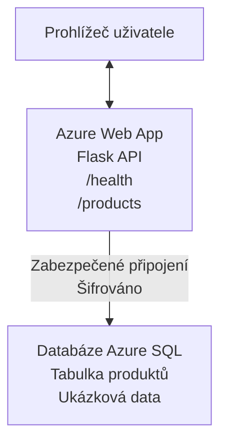

# Nasazení databáze Microsoft SQL a webové aplikace pomocí AZD

⏱️ **Odhadovaný čas**: 20-30 minut | 💰 **Odhadované náklady**: ~$15-25/month | ⭐ **Složitost**: Střední

Tento **kompletní, fungující příklad** ukazuje, jak použít [Azure Developer CLI (azd)](https://learn.microsoft.com/azure/developer/azure-developer-cli/) k nasazení Python Flask webové aplikace s databází Microsoft SQL do Azure. Všechen kód je zahrnut a otestován—nejsou potřeba žádné externí závislosti.

## Co se naučíte

Po dokončení tohoto příkladu budete:
- Nasazovat vícevrsovou aplikaci (web + databáze) pomocí infrastruktury jako kódu
- Konfigurovat zabezpečená připojení k databázi bez tvrdě zakódovaných tajemství
- Monitorovat stav aplikace pomocí Application Insights
- Efektivně spravovat prostředky Azure pomocí AZD CLI
- Dodržovat doporučené postupy Azure pro zabezpečení, optimalizaci nákladů a sledovatelnost

## Přehled scénáře
- **Web App**: Python Flask REST API s připojením k databázi
- **Database**: Azure SQL Database s ukázkovými daty
- **Infrastructure**: Nasazeno pomocí Bicep (modulární, znovupoužitelné šablony)
- **Deployment**: Plně automatizované pomocí příkazů `azd`
- **Monitoring**: Application Insights pro protokoly a telemetrii

## Požadavky

### Požadované nástroje

Než začnete, ověřte, že máte nainstalované následující nástroje:

1. **[Azure CLI](https://learn.microsoft.com/cli/azure/install-azure-cli)** (verze 2.50.0 nebo novější)
   ```sh
   az --version
   # Očekávaný výstup: azure-cli 2.50.0 nebo novější
   ```

2. **[Azure Developer CLI (azd)](https://learn.microsoft.com/azure/developer/azure-developer-cli/install-azd)** (verze 1.0.0 nebo novější)
   ```sh
   azd version
   # Očekávaný výstup: azd verze 1.0.0 nebo vyšší
   ```

3. **[Python 3.8+](https://www.python.org/downloads/)** (pro lokální vývoj)
   ```sh
   python --version
   # Očekávaný výstup: Python 3.8 nebo vyšší
   ```

4. **[Docker](https://www.docker.com/get-started)** (volitelně, pro lokální vývoj v kontejnerech)
   ```sh
   docker --version
   # Očekávaný výstup: Docker verze 20.10 nebo vyšší
   ```

### Požadavky Azure

- Aktivní **Azure subscription** ([vytvořte bezplatný účet](https://azure.microsoft.com/free/))
- Oprávnění k vytváření prostředků ve vašem předplatném
- **Owner** nebo **Contributor** role na předplatném nebo skupině prostředků

### Požadavky na znalosti

Toto je příklad úrovně **středně pokročilý**. Měli byste být obeznámeni s:
- Základními operacemi v příkazovém řádku
- Základními koncepty cloudu (prostředky, skupiny prostředků)
- Základním porozuměním webových aplikací a databází

**Nový v AZD?** Začněte nejprve s [Úvodním průvodcem](../../docs/chapter-01-foundation/azd-basics.md).

## Architektura

Tento příklad nasazuje dvouvrstvou architekturu s webovou aplikací a SQL databází:


**Nasazení prostředků:**
- **Resource Group**: Kontejner pro všechny prostředky
- **App Service Plan**: Hostování založené na Linuxu (úroveň B1 pro úsporu nákladů)
- **Web App**: Python 3.11 runtime s aplikací Flask
- **SQL Server**: Spravovaný databázový server s minimálním TLS 1.2
- **SQL Database**: Základní úroveň (2GB, vhodné pro vývoj/testování)
- **Application Insights**: Monitorování a protokolování
- **Log Analytics Workspace**: Centralizované úložiště protokolů

**Analogie**: Představte si to jako restauraci (web app) s mrazákem (databáze). Zákazníci si objednávají z menu (API koncové body) a kuchyň (Flask aplikace) bere suroviny (data) z mrazáku. Manažer restaurace (Application Insights) sleduje vše, co se děje.

## Struktura složek

Všechny soubory jsou zahrnuty v tomto příkladu— nejsou potřeba žádné externí závislosti:

```
examples/database-app/
│
├── README.md                    # This file
├── azure.yaml                   # AZD configuration file
├── .env.sample                  # Sample environment variables
├── .gitignore                   # Git ignore patterns
│
├── infra/                       # Infrastructure as Code (Bicep)
│   ├── main.bicep              # Main orchestration template
│   ├── abbreviations.json      # Azure naming conventions
│   └── resources/              # Modular resource templates
│       ├── sql-server.bicep    # SQL Server configuration
│       ├── sql-database.bicep  # Database configuration
│       ├── app-service-plan.bicep  # Hosting plan
│       ├── app-insights.bicep  # Monitoring setup
│       └── web-app.bicep       # Web application
│
└── src/
    └── web/                    # Application source code
        ├── app.py              # Flask REST API
        ├── requirements.txt    # Python dependencies
        └── Dockerfile          # Container definition
```

**Co každý soubor dělá:**
- **azure.yaml**: Řekne AZD, co nasadit a kam
- **infra/main.bicep**: Orchestrace všech prostředků Azure
- **infra/resources/*.bicep**: Jednotlivé definice prostředků (modulární pro opětovné použití)
- **src/web/app.py**: Flask aplikace s logikou databáze
- **requirements.txt**: Závislosti Python balíčků
- **Dockerfile**: Instrukce pro zapouzdření do kontejneru pro nasazení

## Rychlý start (krok za krokem)

### Krok 1: Naklonovat a přejít do složky

```sh
git clone https://github.com/microsoft/AZD-for-beginners.git
cd AZD-for-beginners/examples/database-app
```

**✓ Kontrola úspěchu**: Ověřte, že vidíte `azure.yaml` a složku `infra/`:
```sh
ls
# Očekáváno: README.md, azure.yaml, infra/, src/
```

### Krok 2: Autentizace v Azure

```sh
azd auth login
```

Tím se otevře váš prohlížeč pro přihlášení do Azure. Přihlaste se pomocí svých Azure přihlašovacích údajů.

**✓ Kontrola úspěchu**: Měli byste vidět:
```
Logged in to Azure.
```

### Krok 3: Inicializace prostředí

```sh
azd init
```

**Co se stane**: AZD vytvoří lokální konfiguraci pro vaše nasazení.

**Výzvy, které uvidíte**:
- **Název prostředí**: Zadejte krátký název (např. `dev`, `myapp`)
- **Předplatné Azure**: Vyberte své předplatné ze seznamu
- **Umístění Azure**: Zvolte region (např. `eastus`, `westeurope`)

**✓ Kontrola úspěchu**: Měli byste vidět:
```
SUCCESS: New project initialized!
```

### Krok 4: Vytvoření prostředků Azure

```sh
azd provision
```

**Co se stane**: AZD nasadí veškerou infrastrukturu (trvá 5-8 minut):
1. Vytvoří skupinu prostředků
2. Vytvoří SQL Server a databázi
3. Vytvoří App Service Plan
4. Vytvoří Web App
5. Vytvoří Application Insights
6. Nakonfiguruje síťování a bezpečnost

**Budete vyzváni k zadání**:
- **SQL admin username**: Zadejte uživatelské jméno (např. `sqladmin`)
- **SQL admin password**: Zadejte silné heslo (uložte si ho!)

**✓ Kontrola úspěchu**: Měli byste vidět:
```
SUCCESS: Your application was provisioned in Azure in X minutes Y seconds.
You can view the resources created under the resource group rg-<env-name> in Azure Portal:
https://portal.azure.com/#@/resource/subscriptions/.../resourceGroups/rg-<env-name>
```

**⏱️ Čas**: 5-8 minut

### Krok 5: Nasazení aplikace

```sh
azd deploy
```

**Co se stane**: AZD sestaví a nasadí vaši Flask aplikaci:
1. Zabalí Python aplikaci
2. Sestaví Docker kontejner
3. Pushne do Azure Web App
4. Inicializuje databázi ukázkovými daty
5. Spustí aplikaci

**✓ Kontrola úspěchu**: Měli byste vidět:
```
SUCCESS: Your application was deployed to Azure in X minutes Y seconds.
You can view the resources created under the resource group rg-<env-name> in Azure Portal:
https://portal.azure.com/#@/resource/subscriptions/.../resourceGroups/rg-<env-name>
```

**⏱️ Čas**: 3-5 minut

### Krok 6: Otevřít aplikaci v prohlížeči

```sh
azd browse
```

Tím se v prohlížeči otevře nasazená webová aplikace na adrese `https://app-<unique-id>.azurewebsites.net`

**✓ Kontrola úspěchu**: Měli byste vidět výstup JSON:
```json
{
  "message": "Welcome to the Database App API",
  "endpoints": {
    "/": "This help message",
    "/health": "Health check endpoint",
    "/products": "List all products",
    "/products/<id>": "Get product by ID"
  }
}
```

### Krok 7: Testování koncových bodů API

**Kontrola stavu** (ověřte připojení k databázi):
```sh
curl https://app-<your-id>.azurewebsites.net/health
```

**Očekávaná odpověď**:
```json
{
  "status": "healthy",
  "database": "connected"
}
```

**Seznam produktů** (ukázková data):
```sh
curl https://app-<your-id>.azurewebsites.net/products
```

**Očekávaná odpověď**:
```json
[
  {
    "id": 1,
    "name": "Laptop",
    "description": "High-performance laptop",
    "price": 1299.99,
    "created_at": "2025-11-19T10:30:00"
  },
  ...
]
```

**Získat jednotlivý produkt**:
```sh
curl https://app-<your-id>.azurewebsites.net/products/1
```

**✓ Kontrola úspěchu**: Všechny koncové body vrací JSON data bez chyb.

---

**🎉 Gratulujeme!** Úspěšně jste nasadili webovou aplikaci s databází do Azure pomocí AZD.

## Podrobná konfigurace

### Proměnné prostředí

Tajemství jsou spravována bezpečně prostřednictvím konfigurace Azure App Service—**nikdy je neukládejte tvrdě v kódu**.

**Konfigurováno automaticky pomocí AZD**:
- `SQL_CONNECTION_STRING`: Připojení k databázi s šifrovanými přihlašovacími údaji
- `APPLICATIONINSIGHTS_CONNECTION_STRING`: Telemetrický koncový bod pro monitorování
- `SCM_DO_BUILD_DURING_DEPLOYMENT`: Povolení automatické instalace závislostí během nasazení

**Kde jsou tajemství uložena**:
1. Během `azd provision` zadáte přihlašovací údaje pro SQL pomocí zabezpečených výzev
2. AZD je uloží do lokálního souboru `.azure/<env-name>/.env` (ignorovaného v Gitu)
3. AZD je vloží do konfigurace Azure App Service (šifrováno v klidu)
4. Aplikace je načítá přes `os.getenv()` za běhu

### Lokální vývoj

Pro lokální testování vytvořte soubor `.env` ze vzoru:

```sh
cp .env.sample .env
# Upravte soubor .env s připojením k vaší lokální databázi
```

**Pracovní postup pro lokální vývoj**:
```sh
# Nainstalovat závislosti
cd src/web
pip install -r requirements.txt

# Nastavit proměnné prostředí
export SQL_CONNECTION_STRING="your-local-connection-string"

# Spustit aplikaci
python app.py
```

**Testovat lokálně**:
```sh
curl http://localhost:8000/health
# Očekává se: {"status": "zdravý", "database": "připojeno"}
```

### Infrastruktura jako kód

Všechny prostředky Azure jsou definovány v **Bicep šablonách** (složka `infra/`):

- **Modulární návrh**: Každý typ prostředku má vlastní soubor pro znovupoužitelnost
- **Parametrizované**: Upravitelné SKU, regiony, konvence pojmenování
- **Nejlepší postupy**: Dodržuje standardy pojmenování a bezpečnostní výchozí hodnoty Azure
- **Verzované**: Změny infrastruktury jsou sledovány v Gitu

**Příklad přizpůsobení**:
Chcete-li změnit úroveň databáze, upravte `infra/resources/sql-database.bicep`:
```bicep
sku: {
  name: 'Standard'  // Changed from 'Basic'
  tier: 'Standard'
  capacity: 10
}
```

## Nejlepší bezpečnostní postupy

Tento příklad dodržuje nejlepší bezpečnostní postupy Azure:

### 1. **Žádná tajemství ve zdrojovém kódu**
- ✅ Přihlašovací údaje uložené v konfiguraci Azure App Service (šifrováno)
- ✅ `.env` soubory vyloučeny z Gitu pomocí `.gitignore`
- ✅ Tajemství předávaná pomocí zabezpečených parametrů během provisioning

### 2. **Šifrovaná připojení**
- ✅ Minimálně TLS 1.2 pro SQL Server
- ✅ Pouze HTTPS pro Web App
- ✅ Připojení k databázi používají šifrované kanály

### 3. **Síťová bezpečnost**
- ✅ Firewall SQL Serveru nakonfigurován tak, aby povoloval pouze služby Azure
- ✅ Veřejný přístup omezit (lze dále uzamknout pomocí Private Endpoints)
- ✅ FTPS zakázáno na Web App

### 4. **Autentizace a autorizace**
- ⚠️ **Aktuálně**: SQL autentizace (uživatelské jméno/heslo)
- ✅ **Doporučení pro produkci**: Použijte Azure Managed Identity pro autentizaci bez hesla

**Pro přechod na Managed Identity** (pro produkci):
1. Povolit managed identity na Web App
2. Udělit identitě oprávnění k SQL
3. Aktualizovat connection string pro použití managed identity
4. Odebrat autentizaci založenou na hesle

### 5. **Auditování a shoda**
- ✅ Application Insights loguje všechny požadavky a chyby
- ✅ Auditování SQL databáze povoleno (lze nakonfigurovat pro shodu)
- ✅ Všechny prostředky označeny pro řízení správy

**Kontrolní seznam bezpečnosti před nasazením do produkce**:
- [ ] Povolit Azure Defender pro SQL
- [ ] Nakonfigurovat Private Endpoints pro SQL Database
- [ ] Povolit Web Application Firewall (WAF)
- [ ] Implementovat Azure Key Vault pro rotaci tajemství
- [ ] Nakonfigurovat Azure AD autentizaci
- [ ] Povolit diagnostické protokolování pro všechny prostředky

## Optimalizace nákladů

**Odhadované měsíční náklady** (ke dni listopad 2025):

| Prostředek | SKU/Úroveň | Odhadované náklady |
|----------|----------|----------------|
| App Service Plan | B1 (Basic) | ~$13/month |
| SQL Database | Basic (2GB) | ~$5/month |
| Application Insights | Pay-as-you-go | ~$2/month (nízká zátěž) |
| **Celkem** | | **~$20/month** |

**💡 Tipy na úsporu nákladů**:

1. **Využijte bezplatnou úroveň pro učení**:
   - App Service: úroveň F1 (zdarma, omezené hodiny)
   - SQL Database: Použijte Azure SQL Database serverless
   - Application Insights: 5GB/měsíc volného příjmu

2. **Zastavte prostředky, když nejsou používány**:
   ```sh
   # Zastavte webovou aplikaci (za databázi se stále účtují poplatky)
   az webapp stop --name <app-name> --resource-group <rg-name>
   
   # Restartujte podle potřeby
   az webapp start --name <app-name> --resource-group <rg-name>
   ```

3. **Odstraňte vše po testování**:
   ```sh
   azd down
   ```
   Tím se odstraní VŠECHNY prostředky a zastaví se účtování.

4. **SKUs pro vývoj vs. produkci**:
   - **Vývoj**: Základní úroveň (použito v tomto příkladu)
   - **Produkce**: Standard/Premium úroveň s redundancí

**Sledování nákladů**:
- Zobrazte náklady v [Azure Cost Management](https://portal.azure.com/#view/Microsoft_Azure_CostManagement)
- Nastavte upozornění na náklady, abyste se vyhnuli nepříjemným překvapením
- Označte všechny prostředky s `azd-env-name` pro sledování

**Alternativa bezplatné úrovně**:
Pro účely učení můžete upravit `infra/resources/app-service-plan.bicep`:
```bicep
sku: {
  name: 'F1'  // Free tier
  tier: 'Free'
}
```
**Poznámka**: Bezplatná úroveň má omezení (60 min/den CPU, bez režimu always-on).

## Monitorování a pozorovatelnost

### Integrace Application Insights

Tento příklad zahrnuje **Application Insights** pro komplexní monitorování:

**Co se monitoruje**:
- ✅ HTTP požadavky (latence, stavové kódy, koncové body)
- ✅ Chyby a výjimky aplikace
- ✅ Vlastní logování z Flask aplikace
- ✅ Stav připojení k databázi
- ✅ Výkonové metriky (CPU, paměť)

**Přístup k Application Insights**:
1. Otevřete [Azure Portal](https://portal.azure.com)
2. Přejděte do své skupiny prostředků (`rg-<env-name>`)
3. Klikněte na zdroj Application Insights (`appi-<unique-id>`)

**Užitečné dotazy** (Application Insights → Logs):

**Zobrazit všechny požadavky**:
```kusto
requests
| where timestamp > ago(1h)
| order by timestamp desc
| project timestamp, name, url, resultCode, duration
```

**Najít chyby**:
```kusto
exceptions
| where timestamp > ago(24h)
| order by timestamp desc
| project timestamp, type, outerMessage, operation_Name
```

**Zkontrolovat health endpoint**:
```kusto
requests
| where name contains "health"
| summarize count() by resultCode, bin(timestamp, 1h)
```

### Auditování SQL databáze

**Auditování SQL databáze je povoleno** pro sledování:
- Vzory přístupu k databázi
- Neúspěšné pokusy o přihlášení
- Změny schématu
- Přístupy k datům (pro shodu)

**Přístup k auditním záznamům**:
1. Azure Portal → SQL Database → Auditing
2. Zobrazit záznamy v Log Analytics workspace

### Monitorování v reálném čase

**Zobrazit živé metriky**:
1. Application Insights → Live Metrics
2. Sledujte požadavky, chyby a výkon v reálném čase

**Nastavení upozornění**:
Vytvořte upozornění pro kritické události:
- HTTP 500 chyby > 5 za 5 minut
- Selhání připojení k databázi
- Vysoké doby odezvy (>2 sekundy)

**Příklad vytvoření upozornění**:
```sh
az monitor metrics alert create \
  --name "High-Response-Time" \
  --resource-group <rg-name> \
  --scopes <app-insights-resource-id> \
  --condition "avg requests/duration > 2000" \
  --description "Alert when response time exceeds 2 seconds"
```

## Řešení problémů
### Běžné problémy a řešení

#### 1. `azd provision` selže s chybou "Location not available"

**Příznak**:
```
Error: The subscription is not registered for the resource type 'components' in the location 'centralus'.
```

**Řešení**:
Vyberte jiný region Azure nebo zaregistrujte poskytovatele prostředků:
```sh
az provider register --namespace Microsoft.Insights
```

#### 2. Připojení k SQL selhává během nasazování

**Příznak**:
```
pyodbc.OperationalError: ('08001', '[08001] [Microsoft][ODBC Driver 18 for SQL Server]TCP Provider...')
```

**Řešení**:
- Ověřte, že firewall SQL Serveru umožňuje služby Azure (konfigurováno automaticky)
- Zkontrolujte, že během `azd provision` bylo správně zadáno heslo administrátora SQL
- Ujistěte se, že SQL Server je plně zprovisionovaný (může to trvat 2-3 minuty)

**Ověřit připojení**:
```sh
# V Azure portálu přejděte do SQL databáze → Editor dotazů
# Zkuste se připojit pomocí svých přihlašovacích údajů
```

#### 3. Webová aplikace zobrazuje "Application Error"

**Příznak**:
Prohlížeč zobrazuje obecnou chybovou stránku.

**Řešení**:
Zkontrolujte logy aplikace:
```sh
# Zobrazit nedávné záznamy
az webapp log tail --name <app-name> --resource-group <rg-name>
```

**Běžné příčiny**:
- Chybějící proměnné prostředí (zkontrolujte App Service → Konfigurace)
- Instalace Python balíčků selhala (zkontrolujte logy nasazení)
- Chyba při inicializaci databáze (zkontrolujte konektivitu k SQL)

#### 4. `azd deploy` selže s chybou "Build Error"

**Příznak**:
```
Error: Failed to build project
```

**Řešení**:
- Ujistěte se, že `requirements.txt` neobsahuje syntaktické chyby
- Zkontrolujte, že je v `infra/resources/web-app.bicep` specifikován Python 3.11
- Ověřte, že Dockerfile má správný základní image

**Ladění lokálně**:
```sh
cd src/web
docker build -t test-app .
docker run -p 8000:8000 test-app
```

#### 5. "Unauthorized" při spuštění AZD příkazů

**Příznak**:
```
ERROR: (Unauthorized) The client '<id>' with object id '<id>' does not have authorization
```

**Řešení**:
Znovu se přihlaste k Azure:
```sh
azd auth login
az login
```

Ověřte, že máte na předplatném správná oprávnění (role Contributor).

#### 6. Vysoké náklady na databázi

**Příznak**:
Neočekávaný účet za Azure.

**Řešení**:
- Zkontrolujte, zda jste po testování nezapomněli spustit `azd down`
- Ověřte, že SQL Database používá Basic tier (ne Premium)
- Prohlédněte si náklady v Azure Cost Management
- Nastavte upozornění na náklady

### Získání pomoci

**Zobrazit všechny proměnné prostředí AZD**:
```sh
azd env get-values
```

**Zkontrolovat stav nasazení**:
```sh
az webapp show --name <app-name> --resource-group <rg-name> --query state
```

**Přístup k logům aplikace**:
```sh
az webapp log download --name <app-name> --resource-group <rg-name> --log-file app-logs.zip
```

**Potřebujete další pomoc?**
- [Průvodce řešením problémů AZD](../../docs/chapter-07-troubleshooting/common-issues.md)
- [Řešení problémů Azure App Service](https://learn.microsoft.com/azure/app-service/troubleshoot-diagnostic-logs)
- [Řešení problémů Azure SQL](https://learn.microsoft.com/azure/azure-sql/database/troubleshoot-common-errors-issues)

## Praktická cvičení

### Cvičení 1: Ověřte své nasazení (Začátečník)

**Cíl**: Potvrďte, že jsou všechny prostředky nasazeny a aplikace funguje.

**Kroky**:
1. Vypsat všechny prostředky ve vaší skupině prostředků:
   ```sh
   az resource list --resource-group rg-<env-name> --output table
   ```
   **Očekáváno**: 6-7 prostředků (Web App, SQL Server, SQL Database, App Service Plan, Application Insights, Log Analytics)

2. Otestujte všechny koncové body API:
   ```sh
   curl https://app-<your-id>.azurewebsites.net/
   curl https://app-<your-id>.azurewebsites.net/health
   curl https://app-<your-id>.azurewebsites.net/products
   curl https://app-<your-id>.azurewebsites.net/products/1
   ```
   **Očekáváno**: Vše vrací platný JSON bez chyb

3. Zkontrolujte Application Insights:
   - Přejděte do Application Insights v Azure Portal
   - Přejděte na "Live Metrics"
   - Obnovte stránku webové aplikace
   **Očekáváno**: Požadavky se zobrazují v reálném čase

**Kritéria úspěchu**: Všech 6-7 prostředků existuje, všechny endpointy vrací data, Live Metrics zobrazuje aktivitu.

---

### Cvičení 2: Přidejte nový API endpoint (Středně pokročilý)

**Cíl**: Rozšířit Flask aplikaci o nový endpoint.

**Výchozí kód**: Aktuální endpointy v `src/web/app.py`

**Kroky**:
1. Upravte `src/web/app.py` a přidejte nový endpoint za funkcí `get_product()`:
   ```python
   @app.route('/products/search/<keyword>')
   def search_products(keyword):
       """Search products by name or description."""
       try:
           conn = get_db_connection()
           cursor = conn.cursor()
           cursor.execute(
               "SELECT id, name, description, price, created_at FROM products WHERE name LIKE ? OR description LIKE ?",
               (f'%{keyword}%', f'%{keyword}%')
           )
           
           products = []
           for row in cursor.fetchall():
               products.append({
                   'id': row[0],
                   'name': row[1],
                   'description': row[2],
                   'price': float(row[3]) if row[3] else None,
                   'created_at': row[4].isoformat() if row[4] else None
               })
           
           cursor.close()
           conn.close()
           
           logger.info(f"Search for '{keyword}' returned {len(products)} results")
           return jsonify(products), 200
           
       except Exception as e:
           logger.error(f"Error searching products: {str(e)}")
           return jsonify({'error': str(e)}), 500
   ```

2. Nasaďte aktualizovanou aplikaci:
   ```sh
   azd deploy
   ```

3. Otestujte nový endpoint:
   ```sh
   curl https://app-<your-id>.azurewebsites.net/products/search/laptop
   ```
  **Očekáváno**: Vrací produkty odpovídající "laptop"

**Kritéria úspěchu**: Nový endpoint funguje, vrací filtrované výsledky, zobrazuje se v logech Application Insights.

---

### Cvičení 3: Přidejte monitorování a upozornění (Pokročilé)

**Cíl**: Nastavit proaktivní monitorování s upozorněními.

**Kroky**:
1. Vytvořte upozornění pro chyby HTTP 500:
   ```sh
   # Získat ID prostředku Application Insights
   AI_ID=$(az monitor app-insights component show \
     --app appi-<your-id> \
     --resource-group rg-<env-name> \
     --query id -o tsv)
   
   # Vytvořit upozornění
   az monitor metrics alert create \
     --name "High-Error-Rate" \
     --resource-group rg-<env-name> \
     --scopes $AI_ID \
     --condition "count requests/failed > 5" \
     --window-size 5m \
     --evaluation-frequency 1m \
     --description "Alert when >5 failed requests in 5 minutes"
   ```

2. Vyvolejte upozornění způsobením chyb:
   ```sh
   # Požadavek na neexistující produkt
   for i in {1..10}; do curl https://app-<your-id>.azurewebsites.net/products/999; done
   ```

3. Zkontrolujte, zda se upozornění spustilo:
   - Azure Portal → Alerts → Alert Rules
   - Zkontrolujte svůj e-mail (pokud je nakonfigurován)

**Kritéria úspěchu**: Pravidlo upozornění je vytvořeno, spouští se při chybách, přijímáte oznámení.

---

### Cvičení 4: Změny schématu databáze (Pokročilé)

**Cíl**: Přidat novou tabulku a upravit aplikaci, aby ji používala.

**Kroky**:
1. Připojte se k SQL databázi pomocí Query Editoru v Azure Portal

2. Vytvořte novou tabulku `categories`:
   ```sql
   CREATE TABLE categories (
       id INT PRIMARY KEY IDENTITY(1,1),
       name NVARCHAR(50) NOT NULL,
       description NVARCHAR(200)
   );
   
   INSERT INTO categories (name, description) VALUES
   ('Electronics', 'Electronic devices and accessories'),
   ('Office Supplies', 'Office equipment and supplies');
   
   -- Add category to products table
   ALTER TABLE products ADD category_id INT;
   UPDATE products SET category_id = 1; -- Set all to Electronics
   ```

3. Aktualizujte `src/web/app.py`, aby odpovědi obsahovaly informace o kategoriích

4. Nasaďte a otestujte

**Kritéria úspěchu**: Nová tabulka existuje, produkty zobrazují informace o kategoriích, aplikace stále funguje.

---

### Cvičení 5: Implementace cache (Expert)

**Cíl**: Přidat Azure Redis Cache pro zlepšení výkonu.

**Kroky**:
1. Přidejte Redis Cache do `infra/main.bicep`
2. Aktualizujte `src/web/app.py` tak, aby kešoval dotazy na produkty
3. Změřte zlepšení výkonu pomocí Application Insights
4. Porovnejte doby odezvy před a po cachování

**Kritéria úspěchu**: Redis je nasazen, cachování funguje, doby odezvy se zlepší o více než 50%.

**Tip**: Začněte s [Dokumentace Azure Cache for Redis](https://learn.microsoft.com/azure/azure-cache-for-redis/).

---

## Úklid

Aby se zabránilo dalším poplatkům, odstraňte po dokončení všechny prostředky:

```sh
azd down
```

**Potvrzovací výzva**:
```
? Total resources to delete: 7, are you sure you want to continue? (y/N)
```

Zadejte `y` pro potvrzení.

**✓ Kontrola úspěchu**: 
- Všechny prostředky jsou smazány z Azure Portal
- Žádné další poplatky
- Lokální složka `.azure/<env-name>` může být smazána

**Alternativa** (ponechat infrastrukturu, smazat data):
```sh
# Odstranit pouze skupinu prostředků (ponechat konfiguraci AZD)
az group delete --name rg-<env-name> --yes
```
## Další informace

### Související dokumentace
- [Dokumentace Azure Developer CLI](https://learn.microsoft.com/azure/developer/azure-developer-cli/)
- [Dokumentace Azure SQL Database](https://learn.microsoft.com/azure/azure-sql/database/)
- [Dokumentace Azure App Service](https://learn.microsoft.com/azure/app-service/)
- [Dokumentace Application Insights](https://learn.microsoft.com/azure/azure-monitor/app/app-insights-overview)
- [Reference jazyka Bicep](https://learn.microsoft.com/azure/azure-resource-manager/bicep/)

### Další kroky v tomto kurzu
- **[Příklad Container Apps](../../../../examples/container-app)**: Nasadit mikroslužby pomocí Azure Container Apps
- **[Průvodce integrací AI](../../../../docs/ai-foundry)**: Přidat AI funkce do aplikace
- **[Nejlepší postupy nasazení](../../docs/chapter-04-infrastructure/deployment-guide.md)**: Vzory nasazení do produkce

### Pokročilá témata
- **Spravovaná identita**: Odstraňte hesla a používejte ověřování Azure AD
- **Privátní endpointy**: Zabezpečte připojení k databázi v rámci virtuální sítě
- **CI/CD integrace**: Automatizujte nasazení pomocí GitHub Actions nebo Azure DevOps
- **Více prostředí**: Nastavte dev, staging a produkční prostředí
- **Migrace databáze**: Použijte Alembic nebo Entity Framework pro verzování schématu

### Porovnání s jinými přístupy

**AZD vs. ARM šablony**:
- ✅ AZD: Abstrakce na vyšší úrovni, jednodušší příkazy
- ⚠️ ARM: Více verbózní, podrobnější kontrola

**AZD vs. Terraform**:
- ✅ AZD: Nativní pro Azure, integrované se službami Azure
- ⚠️ Terraform: Podpora více cloudů, větší ekosystém

**AZD vs. Azure Portal**:
- ✅ AZD: Opakovatelné, verzované, automatizovatelné
- ⚠️ Portal: Ruční klikání, obtížně reprodukovatelné

**Považujte AZD za**: Docker Compose pro Azure—zjednodušená konfigurace pro složitá nasazení.

---

## Často kladené otázky

**Q: Mohu použít jiný programovací jazyk?**  
A: Ano! Nahraďte `src/web/` Node.js, C#, Go nebo jakýmkoli jiným jazykem. Aktualizujte `azure.yaml` a Bicep podle potřeby.

**Q: Jak přidám více databází?**  
A: Přidejte další modul SQL Database do `infra/main.bicep` nebo použijte PostgreSQL/MySQL ze služeb Azure Database.

**Q: Mohu to použít v produkci?**  
A: Toto je výchozí bod. Pro produkci přidejte: spravovanou identitu, privátní endpointy, redundanci, zálohovací strategii, WAF a rozšířené monitorování.

**Q: Co když chci používat kontejnery místo nasazování kódu?**  
A: Podívejte se na [Příklad Container Apps](../../../../examples/container-app), který používá Docker kontejnery napříč.

**Q: Jak se připojím k databázi z mého lokálního stroje?**  
A: Přidejte svou IP do firewallu SQL Serveru:
```sh
az sql server firewall-rule create \
  --resource-group rg-<env-name> \
  --server sql-<unique-id> \
  --name AllowMyIP \
  --start-ip-address <your-ip> \
  --end-ip-address <your-ip>
```

**Q: Mohu použít existující databázi místo vytvoření nové?**  
A: Ano, upravte `infra/main.bicep`, aby odkazoval na existující SQL Server, a aktualizujte parametry řetězce připojení.

---

> **Poznámka:** Tento příklad ukazuje osvědčené postupy pro nasazení webové aplikace s databází pomocí AZD. Obsahuje funkční kód, obsáhlou dokumentaci a praktická cvičení pro upevnění znalostí. Pro produkční nasazení zkontrolujte bezpečnost, škálování, shodu a požadavky na náklady specifické pro vaši organizaci.

**📚 Navigace kurzem:**
- ← Předchozí: [Příklad Container Apps](../../../../examples/container-app)
- → Další: [Průvodce integrací AI](../../../../docs/ai-foundry)
- 🏠 [Domov kurzu](../../README.md)

---

<!-- CO-OP TRANSLATOR DISCLAIMER START -->
**Prohlášení**:
Tento dokument byl přeložen pomocí AI překladatelské služby [Co-op Translator](https://github.com/Azure/co-op-translator). Přestože usilujeme o přesnost, mějte prosím na paměti, že automatické překlady mohou obsahovat chyby nebo nepřesnosti. Původní dokument v jeho původním jazyce by měl být považován za autoritativní zdroj. Pro kritické informace se doporučuje profesionální lidský překlad. Za jakákoli nedorozumění nebo mylné výklady vzniklá použitím tohoto překladu neneseme odpovědnost.
<!-- CO-OP TRANSLATOR DISCLAIMER END -->