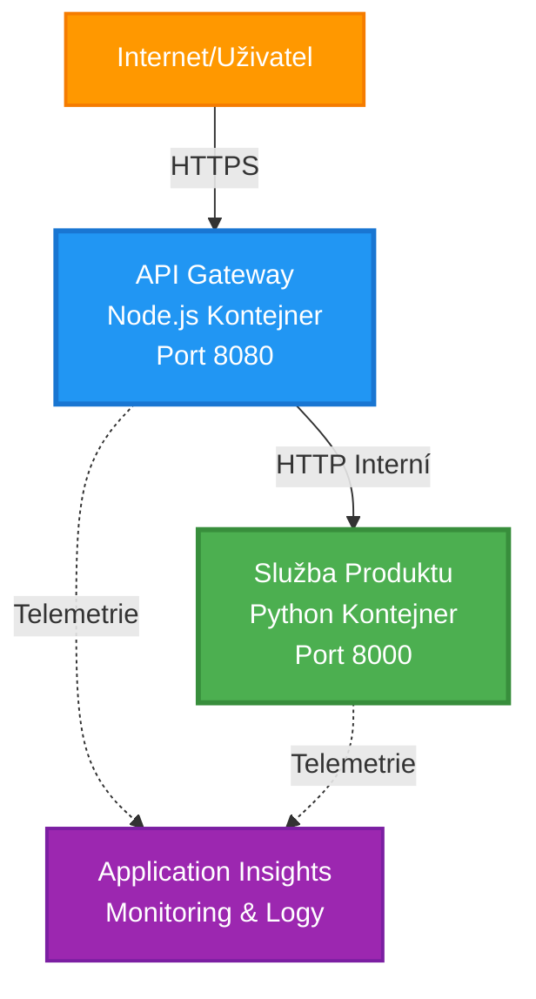
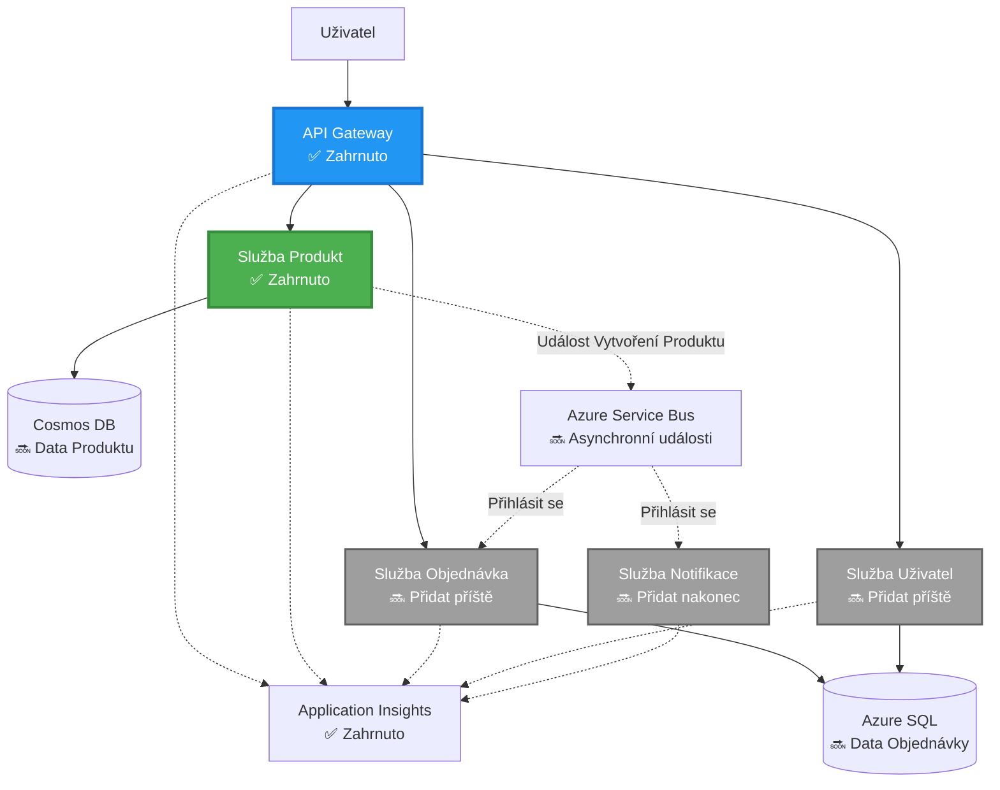
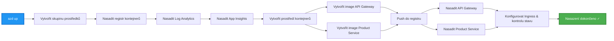
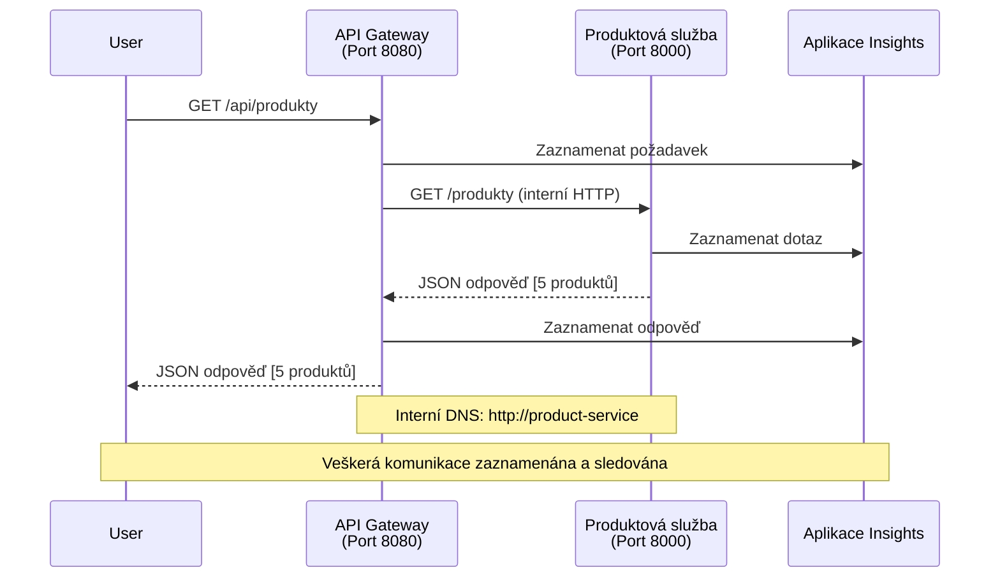

# Architektura mikroslužeb - Příklad aplikace v kontejnerech

⏱️ **Odhadovaný čas**: 25-35 minut | 💰 **Odhadované náklady**: ~$50-100/měsíc | ⭐ **Složitost**: Pokročilá

**📚 Vzdělávací cesta:**
- ← Předchozí: [Jednoduché Flask API](../../../../examples/container-app/simple-flask-api) - Základy jednoho kontejneru
- 🎯 **Zde se nacházíte**: Architektura mikroslužeb (základ se 2 službami)
- → Další: [Integrace AI](../../../../docs/ai-foundry) - Přidání inteligence do vašich služeb
- 🏠 [Domov kurzu](../../README.md)

---

**Zjednodušená, ale funkční** architektura mikroslužeb nasazená do Azure Container Apps pomocí AZD CLI. Tento příklad ukazuje komunikaci mezi službami, orchestraci kontejnerů a monitorování s praktickým nastavením dvou služeb.

> **📚 Vzdělávací přístup**: Tento příklad začíná s minimální architekturou dvou služeb (API Gateway + Backend Service), kterou můžete skutečně nasadit a učit se z ní. Po zvládnutí tohoto základu nabízíme pokyny pro rozšíření na plnohodnotný ekosystém mikroslužeb.

## Co se naučíte

Po dokončení tohoto příkladu budete schopni:
- Nasadit více kontejnerů do Azure Container Apps
- Implementovat komunikaci mezi službami pomocí interní sítě
- Konfigurovat škálování a zdravotní kontroly na základě prostředí
- Monitorovat distribuované aplikace pomocí Application Insights
- Pochopit vzory a osvědčené postupy pro nasazení mikroslužeb
- Naučit se postupné rozšiřování od jednoduchých k složitějším architekturám

## Architektura

### Fáze 1: Co budujeme (součástí tohoto příkladu)


**Detaily komponent:**

| Komponenta | Účel | Přístup | Zdroje |
|------------|------|---------|--------|
| **API Gateway** | Směruje externí požadavky na backendové služby | Veřejný (HTTPS) | 1 vCPU, 2GB RAM, 2-20 replik |
| **Product Service** | Spravuje katalog produktů s daty v paměti | Pouze interní | 0.5 vCPU, 1GB RAM, 1-10 replik |
| **Application Insights** | Centralizované logování a distribuované trasování | Azure Portal | 1-2 GB/měsíc příjem dat |

**Proč začít jednoduše?**
- ✅ Rychlé nasazení a pochopení (25-35 minut)
- ✅ Naučte se základní vzory mikroslužeb bez složitostí
- ✅ Funkční kód, který můžete upravovat a experimentovat s ním
- ✅ Nižší náklady na učení (~$50-100/měsíc oproti $300-1400/měsíc)
- ✅ Získejte jistotu před přidáním databází a front zpráv

**Přirovnání**: Je to jako učit se řídit. Začnete na prázdném parkovišti (2 služby), zvládnete základy a poté přejdete na městský provoz (5+ služeb s databázemi).

### Fáze 2: Budoucí rozšíření (referenční architektura)

Jakmile zvládnete architekturu se 2 službami, můžete ji rozšířit na:


Podívejte se na sekci "Průvodce rozšířením" na konci pro podrobné pokyny.

## Zahrnuté funkce

✅ **Objevování služeb**: Automatické DNS-based objevování mezi kontejnery  
✅ **Vyvažování zátěže**: Vestavěné vyvažování zátěže mezi replikami  
✅ **Automatické škálování**: Nezávislé škálování pro každou službu na základě HTTP požadavků  
✅ **Monitorování zdraví**: Kontroly živosti a připravenosti pro obě služby  
✅ **Distribuované logování**: Centralizované logování pomocí Application Insights  
✅ **Interní síťování**: Bezpečná komunikace mezi službami  
✅ **Orchestrace kontejnerů**: Automatické nasazení a škálování  
✅ **Aktualizace bez výpadků**: Postupné aktualizace s řízením revizí  

## Předpoklady

### Požadované nástroje

Před začátkem ověřte, že máte nainstalované tyto nástroje:

1. **[Azure Developer CLI (azd)](https://learn.microsoft.com/azure/developer/azure-developer-cli/install-azd)** (verze 1.0.0 nebo vyšší)
   ```bash
   azd version
   # Očekávaný výstup: verze azd 1.0.0 nebo vyšší
   ```

2. **[Azure CLI](https://learn.microsoft.com/cli/azure/install-azure-cli)** (verze 2.50.0 nebo vyšší)
   ```bash
   az --version
   # Očekávaný výstup: azure-cli 2.50.0 nebo vyšší
   ```

3. **[Docker](https://www.docker.com/get-started)** (pro lokální vývoj/testování - volitelné)
   ```bash
   docker --version
   # Očekávaný výstup: Docker verze 20.10 nebo vyšší
   ```

### Ověření nastavení

Spusťte tyto příkazy pro ověření, že jste připraveni:

```bash
# Zkontrolujte Azure Developer CLI
azd version
# ✅ Očekáváno: azd verze 1.0.0 nebo vyšší

# Zkontrolujte Azure CLI
az --version
# ✅ Očekáváno: azure-cli 2.50.0 nebo vyšší

# Zkontrolujte Docker (volitelné)
docker --version
# ✅ Očekáváno: Docker verze 20.10 nebo vyšší
```

**Kritéria úspěchu**: Všechny příkazy vrátí čísla verzí odpovídající minimálním požadavkům nebo vyšší.

### Požadavky Azure

- Aktivní **předplatné Azure** ([vytvořte si bezplatný účet](https://azure.microsoft.com/free/))
- Oprávnění k vytváření zdrojů ve vašem předplatném
- Role **Přispěvatel** v předplatném nebo skupině zdrojů

### Požadované znalosti

Toto je příklad na **pokročilé úrovni**. Měli byste mít:
- Dokončený příklad [Jednoduché Flask API](../../../../examples/container-app/simple-flask-api) 
- Základní pochopení architektury mikroslužeb
- Znalost REST API a HTTP
- Pochopení konceptů kontejnerů

**Nováček v Container Apps?** Začněte nejprve s příkladem [Jednoduché Flask API](../../../../examples/container-app/simple-flask-api), abyste se naučili základy.

## Rychlý start (krok za krokem)

### Krok 1: Klonování a navigace

```bash
git clone https://github.com/microsoft/AZD-for-beginners.git
cd AZD-for-beginners/examples/microservices
```

**✓ Kontrola úspěchu**: Ověřte, že vidíte `azure.yaml`:
```bash
ls
# Očekáváno: README.md, azure.yaml, infra/, src/
```

### Krok 2: Autentizace s Azure

```bash
azd auth login
```

Tím se otevře váš prohlížeč pro autentizaci v Azure. Přihlaste se pomocí svých přihlašovacích údajů k Azure.

**✓ Kontrola úspěchu**: Měli byste vidět:
```
Logged in to Azure.
```

### Krok 3: Inicializace prostředí

```bash
azd init
```

**Výzvy, které uvidíte**:
- **Název prostředí**: Zadejte krátký název (např. `microservices-dev`)
- **Předplatné Azure**: Vyberte své předplatné
- **Lokalita Azure**: Vyberte region (např. `eastus`, `westeurope`)

**✓ Kontrola úspěchu**: Měli byste vidět:
```
SUCCESS: New project initialized!
```

### Krok 4: Nasazení infrastruktury a služeb

```bash
azd up
```

**Co se stane** (trvá 8-12 minut):


**✓ Kontrola úspěchu**: Měli byste vidět:
```
SUCCESS: Your application was deployed to Azure in X minutes Y seconds.
Endpoint: https://api-gateway-<unique-id>.azurecontainerapps.io
```

**⏱️ Čas**: 8-12 minut

### Krok 5: Testování nasazení

```bash
# Získejte koncový bod brány
GATEWAY_URL=$(azd env get-values | grep API_GATEWAY_URL | cut -d '=' -f2 | tr -d '"')

# Otestujte zdraví API Gateway
curl $GATEWAY_URL/health
```

**✅ Očekávaný výstup:**
```json
{
  "status": "healthy",
  "service": "api-gateway",
  "timestamp": "2025-11-19T10:30:00Z"
}
```

**Testování služby produktů přes bránu:**
```bash
# Seznam produktů
curl $GATEWAY_URL/api/products
```

**✅ Očekávaný výstup:**
```json
[
  {"id":1,"name":"Laptop","price":999.99,"stock":50},
  {"id":2,"name":"Mouse","price":29.99,"stock":200},
  {"id":3,"name":"Keyboard","price":79.99,"stock":150}
]
```

**✓ Kontrola úspěchu**: Oba koncové body vrátí JSON data bez chyb.

---

**🎉 Gratulujeme!** Nasadili jste architekturu mikroslužeb do Azure!

## Struktura projektu

Všechny implementační soubory jsou zahrnuty—jedná se o kompletní, funkční příklad:

```
microservices/
│
├── README.md                         # This file
├── azure.yaml                        # AZD configuration
├── .gitignore                        # Git ignore patterns
│
├── infra/                           # Infrastructure as Code (Bicep)
│   ├── main.bicep                   # Main orchestration
│   ├── abbreviations.json           # Naming conventions
│   ├── core/                        # Shared infrastructure
│   │   ├── container-apps-environment.bicep  # Container environment + registry
│   │   └── monitor.bicep            # Application Insights + Log Analytics
│   └── app/                         # Service definitions
│       ├── api-gateway.bicep        # API Gateway container app
│       └── product-service.bicep    # Product Service container app
│
└── src/                             # Application source code
    ├── api-gateway/                 # Node.js API Gateway
    │   ├── app.js                   # Express server with routing
    │   ├── package.json             # Node dependencies
    │   └── Dockerfile               # Container definition
    └── product-service/             # Python Product Service
        ├── main.py                  # Flask API with product data
        ├── requirements.txt         # Python dependencies
        └── Dockerfile               # Container definition
```

**Co dělá každá komponenta:**

**Infrastruktura (infra/):**
- `main.bicep`: Orchestrace všech zdrojů Azure a jejich závislostí
- `core/container-apps-environment.bicep`: Vytváří prostředí Container Apps a Azure Container Registry
- `core/monitor.bicep`: Nastavuje Application Insights pro distribuované logování
- `app/*.bicep`: Definice jednotlivých kontejnerových aplikací se škálováním a zdravotními kontrolami

**API Gateway (src/api-gateway/):**
- Veřejně přístupná služba, která směruje požadavky na backendové služby
- Implementuje logování, zpracování chyb a přesměrování požadavků
- Ukazuje komunikaci mezi službami přes HTTP

**Product Service (src/product-service/):**
- Interní služba s katalogem produktů (pro jednoduchost v paměti)
- REST API se zdravotními kontrolami
- Příklad vzoru backendové mikroslužby

## Přehled služeb

### API Gateway (Node.js/Express)

**Port**: 8080  
**Přístup**: Veřejný (externí přístup)  
**Účel**: Směruje příchozí požadavky na příslušné backendové služby  

**Koncové body**:
- `GET /` - Informace o službě
- `GET /health` - Koncový bod pro kontrolu zdraví
- `GET /api/products` - Přesměrování na službu produktů (seznam všech)
- `GET /api/products/:id` - Přesměrování na službu produktů (získání podle ID)

**Klíčové funkce**:
- Směrování požadavků pomocí axios
- Centralizované logování
- Zpracování chyb a správa časových limitů
- Objevování služeb prostřednictvím proměnných prostředí
- Integrace s Application Insights

**Ukázka kódu** (`src/api-gateway/app.js`):
```javascript
// Interní komunikace služeb
app.get('/api/products', async (req, res) => {
  const response = await axios.get(`${PRODUCT_SERVICE_URL}/products`, {
    timeout: 5000
  });
  res.json(response.data);
});
```

### Product Service (Python/Flask)

**Port**: 8000  
**Přístup**: Pouze interní (žádný externí přístup)  
**Účel**: Spravuje katalog produktů s daty v paměti  

**Koncové body**:
- `GET /` - Informace o službě
- `GET /health` - Koncový bod pro kontrolu zdraví
- `GET /products` - Seznam všech produktů
- `GET /products/<id>` - Získání produktu podle ID

**Klíčové funkce**:
- RESTful API s Flask
- Katalog produktů v paměti (jednoduché, bez databáze)
- Monitorování zdraví pomocí sond
- Strukturované logování
- Integrace s Application Insights

**Datový model**:
```python
{
  "id": 1,
  "name": "Laptop",
  "description": "High-performance laptop",
  "price": 999.99,
  "stock": 50
}
```

**Proč pouze interní?**
Služba produktů není veřejně přístupná. Všechny požadavky musí procházet přes API Gateway, což zajišťuje:
- Bezpečnost: Kontrolovaný přístupový bod
- Flexibilitu: Možnost změny backendu bez vlivu na klienty
- Monitorování: Centralizované logování požadavků

## Pochopení komunikace mezi službami

### Jak spolu služby komunikují


V tomto příkladu API Gateway komunikuje se službou Product Service pomocí **interních HTTP volání**:

```javascript
// API Gateway (src/api-gateway/app.js)
const PRODUCT_SERVICE_URL = process.env.PRODUCT_SERVICE_URL;

// Proveďte interní HTTP požadavek
const response = await axios.get(`${PRODUCT_SERVICE_URL}/products`);
```

**Klíčové body**:

1. **DNS-Based Discovery**: Container Apps automaticky poskytuje DNS pro interní služby
   - FQDN služby produktů: `product-service.internal.<environment>.azurecontainerapps.io`
   - Zjednodušeno na: `http://product-service` (Container Apps to vyřeší)

2. **Žádná veřejná expozice**: Služba produktů má v Bicep `external: false`
   - Přístupná pouze v prostředí Container Apps
   - Nelze ji dosáhnout z internetu

3. **Proměnné prostředí**: URL služeb jsou injektovány při nasazení
   - Bicep předává interní FQDN do gateway
   - Žádné hardcodované URL v aplikačním kódu

**Přirovnání**: Představte si to jako kancelářské místnosti. API Gateway je recepce (veřejně přístupná) a Product Service je kancelář (pouze interní). Návštěvníci musí projít recepcí, aby se dostali do jakékoli kanceláře.

## Možnosti nasazení

### Plné nasazení (doporučeno)

```bash
# Nasadit infrastrukturu a obě služby
azd up
```

Toto nasadí:
1. Prostředí Container Apps
2. Application Insights
3. Container Registry
4. Kontejner API Gateway
5. Kontejner Product Service

**Čas**: 8-12 minut

### Nasazení jednotlivé služby

```bash
# Nasadit pouze jednu službu (po počátečním azd up)
azd deploy api-gateway

# Nebo nasadit službu produktu
azd deploy product-service
```

**Použití**: Když jste aktualizovali kód v jedné službě a chcete nasadit pouze tuto službu.

### Aktualizace konfigurace

```bash
# Změňte parametry škálování
azd env set GATEWAY_MAX_REPLICAS 30

# Znovu nasadit s novou konfigurací
azd up
```

## Konfigurace

### Konfigurace škálování

Obě služby jsou konfigurovány s HTTP-based autoscalingem ve svých Bicep souborech:

**API Gateway**:
- Min repliky: 2 (vždy alespoň 2 pro dostupnost)
- Max repliky: 20
- Spouštěč škálování: 50 současných požadavků na repliku

**Product Service**:
- Min repliky: 1 (může se škálovat na nulu, pokud je potřeba)
- Max repliky: 10
- Spouštěč škálování: 100 současných požadavků na repliku

**Přizpůsobení škálování** (v `infra/app/*.bicep`):
```bicep
scale: {
  minReplicas: 1
  maxReplicas: 10
  rules: [
    {
      name: 'http-scale-rule'
      http: {
        metadata: {
          concurrentRequests: '100'  // Adjust this
        }
      }
    }
  ]
}
```

### Alokace zdrojů

**API Gateway**:
- CPU: 1.0 vCPU
- Paměť: 2 GiB
- Důvod: Zpracovává veškerý externí provoz

**Product Service**:
- CPU: 0.5 vCPU
- Paměť: 1 GiB
- Důvod: Lehká operace v paměti

### Kontroly zdraví

Obě služby zahrnují sondy živosti a připravenosti:

```bicep
probes: [
  {
    type: 'Liveness'
    httpGet: {
      path: '/health'
      port: 8080
    }
    initialDelaySeconds: 10
    periodSeconds: 30
  }
  {
    type: 'Readiness'
    httpGet: {
      path: '/health'
      port: 8080
    }
    initialDelaySeconds: 5
    periodSeconds: 10
  }
]
```

**Co to znamená**:
- **Živost**: Pokud kontrola zdraví selže, Container Apps restartuje kontejner
- **Připravenost**: Pokud není připraven, Container Apps přestane směrovat provoz na tuto repliku

## Monitorování a sledování

### Zobrazení logů služby

```bash
# Streamujte logy z API Gateway
azd logs api-gateway --follow

# Zobrazte nedávné logy služby produktu
azd logs product-service --tail 100

# Zobrazte všechny logy z obou služeb
azd logs --follow
```

**Očekávaný výstup**:
```
[api-gateway] API Gateway listening on port 8080
[api-gateway] Product Service URL: http://product-service
[api-gateway] GET /api/products 200 - 45ms
[product-service] Retrieved 5 products
```

### Dotazy v Application Insights

Přistupte k Application Insights v Azure Portal a spusťte tyto dotazy:

**Najít pomalé požadavky**:
```kusto
requests
| where timestamp > ago(1h)
| where duration > 1000  // Requests taking >1 second
| summarize count() by name, cloud_RoleName
| order by count_ desc
```

**Sledovat volání mezi službami**:
```kusto
dependencies
| where timestamp > ago(1h)
| where type == "Http"
| project timestamp, name, target, duration, success
| order by timestamp desc
```

**Míra chyb podle služby**:
```kusto
exceptions
| where timestamp > ago(24h)
| summarize errorCount = count() by cloud_RoleName, type
| order by errorCount desc
```

**Objem požadavků v čase**:
```kusto
requests
| where timestamp > ago(1h)
| summarize requestCount = count() by bin(timestamp, 5m), cloud_RoleName
| render timechart
```

### Přístup k monitorovacímu panelu

```bash
# Získejte podrobnosti o Application Insights
azd env get-values | grep APPLICATIONINSIGHTS

# Otevřete monitorování Azure Portal
az monitor app-insights component show \
  --app $(azd env get-values | grep APPLICATIONINSIGHTS_CONNECTION_STRING | cut -d '=' -f2) \
  --resource-group $(azd env get-values | grep AZURE_RESOURCE_GROUP | cut -d '=' -f2) \
  --query "appId" -o tsv
```

### Živá metrika

1. Přejděte do Application Insights v Azure Portal
2. Klikněte na "Live Metrics"
3. Zobrazte si požadavky, chyby a výkon v reálném čase
4. Otestujte spuštěním: `curl $(azd env get-values | grep API_GATEWAY_URL | cut -d '=' -f2 | tr -d '"')/api/products`

## Praktická cvičení

### Cvičení 1: Přidání nového koncového bodu pro produkt ⭐ (Jednoduché)

**Cíl**: Přidat POST koncový bod pro vytvoření nových produktů

**Výchozí bod**: `src/product-service/main.py`

**Kroky**:

1. Přidejte tento koncový bod za funkci `get_product` v `main.py`:

```python
@app.route('/products', methods=['POST'])
def create_product():
    """Create a new product"""
    data = request.get_json()
    
    # Ověřte požadovaná pole
    if not data or 'name' not in data or 'price' not in data:
        return jsonify({'error': 'Missing required fields: name, price'}), 400
    
    new_id = max(p['id'] for p in products) + 1
    new_product = {
        'id': new_id,
        'name': data['name'],
        'description': data.get('description', ''),
        'price': float(data['price']),
        'stock': int(data.get('stock', 0))
    }
    products.append(new_product)
    logger.info(f"Created product {new_id}")
    return jsonify(new_product), 201
```

2. Přidejte POST trasu do API Gateway (`src/api-gateway/app.js`):

```javascript
// Přidejte toto za trasu GET /api/products
app.post('/api/products', async (req, res) => {
  try {
    console.log(`Forwarding POST request to ${PRODUCT_SERVICE_URL}/products`);
    const response = await axios.post(`${PRODUCT_SERVICE_URL}/products`, req.body, {
      timeout: 5000
    });
    res.status(201).json(response.data);
  } catch (error) {
    console.error('Error calling product service:', error.message);
    res.status(503).json({
      error: 'Product service unavailable',
      message: error.message
    });
  }
});
```

3. Znovu nasadit obě služby:

```bash
azd deploy product-service
azd deploy api-gateway
```

4. Otestovat nový endpoint:

```bash
GATEWAY_URL=$(azd env get-values | grep API_GATEWAY_URL | cut -d '=' -f2 | tr -d '"')

# Vytvořit nový produkt
curl -X POST $GATEWAY_URL/api/products \
  -H "Content-Type: application/json" \
  -d '{"name":"USB Cable","price":9.99,"stock":500}'
```

**✅ Očekávaný výstup:**
```json
{"id":6,"name":"USB Cable","description":"","price":9.99,"stock":500}
```

5. Ověřit, že se objeví v seznamu:

```bash
curl $GATEWAY_URL/api/products
# Mělo by nyní zobrazovat 6 produktů včetně nového USB kabelu
```

**Kritéria úspěchu**:
- ✅ POST požadavek vrací HTTP 201
- ✅ Nový produkt se objeví v seznamu GET /api/products
- ✅ Produkt má automaticky inkrementované ID

**Čas**: 10-15 minut

---

### Cvičení 2: Úprava pravidel autoscalingu ⭐⭐ (Střední)

**Cíl**: Upravit Product Service tak, aby se škáloval agresivněji

**Výchozí bod**: `infra/app/product-service.bicep`

**Kroky**:

1. Otevřít `infra/app/product-service.bicep` a najít blok `scale` (kolem řádku 95)

2. Změnit z:
```bicep
scale: {
  minReplicas: 1
  maxReplicas: 10
  rules: [
    {
      name: 'http-scale-rule'
      http: {
        metadata: {
          concurrentRequests: '100'  // OLD
        }
      }
    }
  ]
}
```

Na:
```bicep
scale: {
  minReplicas: 2  // Always have 2 running
  maxReplicas: 20  // Allow more scaling
  rules: [
    {
      name: 'http-scale-rule'
      http: {
        metadata: {
          concurrentRequests: '20'  // Scale at lower threshold
        }
      }
    }
  ]
}
```

3. Znovu nasadit infrastrukturu:

```bash
azd up
```

4. Ověřit novou konfiguraci škálování:

```bash
az containerapp show \
  --name $(azd env get-values | grep PRODUCT_SERVICE | head -1 | cut -d '/' -f5) \
  --resource-group $(azd env get-values | grep AZURE_RESOURCE_GROUP | cut -d '=' -f2 | tr -d '"') \
  --query "properties.template.scale" -o json
```

**✅ Očekávaný výstup:**
```json
{
  "minReplicas": 2,
  "maxReplicas": 20,
  "rules": [...]
}
```

5. Otestovat autoscaling při zátěži:

```bash
# Generujte souběžné požadavky
for i in {1..500}; do curl $GATEWAY_URL/api/products & done

# Sledujte, jak probíhá škálování
azd logs product-service --follow
# Hledejte: Události škálování aplikací v kontejnerech
```

**Kritéria úspěchu**:
- ✅ Product Service běží vždy minimálně na 2 replikách
- ✅ Při zátěži se škáluje na více než 2 repliky
- ✅ Azure Portal ukazuje nová pravidla škálování

**Čas**: 15-20 minut

---

### Cvičení 3: Přidání vlastního monitorovacího dotazu ⭐⭐ (Střední)

**Cíl**: Vytvořit vlastní dotaz v Application Insights pro sledování výkonu API produktů

**Kroky**:

1. Přejít do Application Insights v Azure Portalu:
   - Otevřít Azure Portal
   - Najít svou resource group (rg-microservices-*)
   - Kliknout na zdroj Application Insights

2. Kliknout na "Logs" v levém menu

3. Vytvořit tento dotaz:

```kusto
requests
| where timestamp > ago(1h)
| where name contains "products"
| summarize 
    RequestCount = count(),
    AvgDuration = avg(duration),
    P95Duration = percentile(duration, 95),
    SuccessRate = 100.0 * countif(success == true) / count()
  by bin(timestamp, 5m)
| render timechart
```

4. Kliknout na "Run" pro spuštění dotazu

5. Uložit dotaz:
   - Kliknout na "Save"
   - Název: "Product API Performance"
   - Kategorie: "Performance"

6. Generovat testovací provoz:

```bash
for i in {1..100}; do curl $GATEWAY_URL/api/products; sleep 1; done
```

7. Obnovit dotaz pro zobrazení dat

**✅ Očekávaný výstup:**
- Graf zobrazující počet požadavků v čase
- Průměrná doba trvání < 500 ms
- Úspěšnost = 100 %
- Časové intervaly po 5 minutách

**Kritéria úspěchu**:
- ✅ Dotaz ukazuje 100+ požadavků
- ✅ Úspěšnost je 100 %
- ✅ Průměrná doba trvání < 500 ms
- ✅ Graf zobrazuje 5minutové intervaly

**Výsledek učení**: Pochopení, jak monitorovat výkon služby pomocí vlastních dotazů

**Čas**: 10-15 minut

---

### Cvičení 4: Implementace logiky opakování požadavků ⭐⭐⭐ (Pokročilé)

**Cíl**: Přidat logiku opakování požadavků do API Gateway, když je Product Service dočasně nedostupný

**Výchozí bod**: `src/api-gateway/app.js`

**Kroky**:

1. Nainstalovat knihovnu pro opakování:

```bash
cd src/api-gateway
npm install axios-retry --save
cd ../..
```

2. Aktualizovat `src/api-gateway/app.js` (přidat po importu axios):

```javascript
const axiosRetry = require('axios-retry');

// Nakonfigurujte logiku opakování
axiosRetry(axios, {
  retries: 3,
  retryDelay: (retryCount) => {
    return retryCount * 1000; // 1s, 2s, 3s
  },
  retryCondition: (error) => {
    // Opakujte při chybách sítě nebo odpovědích 5xx
    return axiosRetry.isNetworkOrIdempotentRequestError(error) ||
           (error.response && error.response.status >= 500);
  }
});

console.log('Retry logic configured: 3 retries with exponential backoff');
```

3. Znovu nasadit API Gateway:

```bash
azd deploy api-gateway
```

4. Otestovat chování opakování simulací selhání služby:

```bash
# Změňte službu produktu na 0 (simulujte selhání)
az containerapp update \
  --name $(azd env get-values | grep PRODUCT_SERVICE | head -1 | cut -d '/' -f5) \
  --resource-group $(azd env get-values | grep AZURE_RESOURCE_GROUP | cut -d '=' -f2 | tr -d '"') \
  --min-replicas 0 \
  --max-replicas 0

# Pokuste se získat přístup k produktům (bude se opakovat 3krát)
time curl -v $GATEWAY_URL/api/products
# Pozorujte: Odezva trvá ~6 sekund (1s + 2s + 3s opakování)

# Obnovte službu produktu
az containerapp update \
  --name $(azd env get-values | grep PRODUCT_SERVICE | head -1 | cut -d '/' -f5) \
  --resource-group $(azd env get-values | grep AZURE_RESOURCE_GROUP | cut -d '=' -f2 | tr -d '"') \
  --min-replicas 1 \
  --max-replicas 10
```

5. Zobrazit logy opakování:

```bash
azd logs api-gateway --tail 50
# Hledejte: Zprávy o pokusech o opakování
```

**✅ Očekávané chování:**
- Požadavky se opakují 3krát před selháním
- Každé opakování čeká déle (1s, 2s, 3s)
- Úspěšné požadavky po restartu služby
- Logy ukazují pokusy o opakování

**Kritéria úspěchu**:
- ✅ Požadavky se opakují 3krát před selháním
- ✅ Každé opakování čeká déle (exponenciální zpoždění)
- ✅ Úspěšné požadavky po restartu služby
- ✅ Logy ukazují pokusy o opakování

**Výsledek učení**: Pochopení vzorců odolnosti v mikroslužbách (obvody, opakování, časové limity)

**Čas**: 20-25 minut

---

## Kontrolní bod znalostí

Po dokončení tohoto příkladu si ověřte své znalosti:

### 1. Komunikace mezi službami ✓

Ověřte své znalosti:
- [ ] Dokážete vysvětlit, jak API Gateway objevuje Product Service? (DNS-based service discovery)
- [ ] Co se stane, když je Product Service nedostupná? (Gateway vrátí chybu 503)
- [ ] Jak byste přidali třetí službu? (Vytvořit nový Bicep soubor, přidat do main.bicep, vytvořit složku src)

**Praktické ověření:**
```bash
# Simulovat selhání služby
az containerapp update --name <product-service-name> --min-replicas 0 --max-replicas 0
curl $GATEWAY_URL/api/products
# ✅ Očekáváno: 503 Služba nedostupná

# Obnovit službu
az containerapp update --name <product-service-name> --min-replicas 1 --max-replicas 10
```

### 2. Monitoring a pozorovatelnost ✓

Ověřte své znalosti:
- [ ] Kde vidíte distribuované logy? (Application Insights v Azure Portalu)
- [ ] Jak sledujete pomalé požadavky? (Kusto dotaz: `requests | where duration > 1000`)
- [ ] Dokážete identifikovat, která služba způsobila chybu? (Zkontrolujte pole `cloud_RoleName` v logech)

**Praktické ověření:**
```bash
# Vytvořte simulaci pomalého požadavku
curl "$GATEWAY_URL/api/products?delay=2000"

# Dotaz na Application Insights pro pomalé požadavky
# Přejděte na Azure Portal → Application Insights → Logs
# Spusťte: requests | where duration > 1000 | project timestamp, name, duration, cloud_RoleName
```

### 3. Škálování a výkon ✓

Ověřte své znalosti:
- [ ] Co spouští autoscaling? (Pravidla pro souběžné HTTP požadavky: 50 pro gateway, 100 pro produkt)
- [ ] Kolik replik aktuálně běží? (Zkontrolujte pomocí `az containerapp revision list`)
- [ ] Jak byste škálovali Product Service na 5 replik? (Aktualizovat minReplicas v Bicep)

**Praktické ověření:**
```bash
# Generovat zátěž pro testování automatického škálování
for i in {1..1000}; do curl $GATEWAY_URL/api/products & done

# Sledujte, jak se zvyšuje počet replik
azd logs api-gateway --follow
# ✅ Očekáváno: Vidět události škálování v logech
```

**Kritéria úspěchu**: Dokážete odpovědět na všechny otázky a ověřit pomocí praktických příkazů.

---

## Analýza nákladů

### Odhadované měsíční náklady (pro tento příklad se 2 službami)

| Zdroj | Konfigurace | Odhadované náklady |
|-------|-------------|--------------------|
| API Gateway | 2-20 replik, 1 vCPU, 2GB RAM | $30-150 |
| Product Service | 1-10 replik, 0.5 vCPU, 1GB RAM | $15-75 |
| Container Registry | Základní úroveň | $5 |
| Application Insights | 1-2 GB/měsíc | $5-10 |
| Log Analytics | 1 GB/měsíc | $3 |
| **Celkem** | | **$58-243/měsíc** |

### Rozdělení nákladů podle využití

**Nízký provoz** (testování/učení): ~60 $/měsíc
- API Gateway: 2 repliky × 24/7 = $30
- Product Service: 1 replika × 24/7 = $15
- Monitoring + Registry = $13

**Střední provoz** (malá produkce): ~120 $/měsíc
- API Gateway: 5 průměrných replik = $75
- Product Service: 3 průměrné repliky = $45
- Monitoring + Registry = $13

**Vysoký provoz** (rušné období): ~240 $/měsíc
- API Gateway: 15 průměrných replik = $225
- Product Service: 8 průměrných replik = $120
- Monitoring + Registry = $13

### Tipy pro optimalizaci nákladů

1. **Škálování na nulu pro vývoj**:
   ```bicep
   scale: {
     minReplicas: 0  // Save $30-40/month when not in use
     maxReplicas: 10
   }
   ```

2. **Použijte Consumption Plan pro Cosmos DB** (až ji přidáte):
   - Platíte pouze za to, co využijete
   - Žádné minimální poplatky

3. **Nastavte vzorkování v Application Insights**:
   ```javascript
   appInsights.defaultClient.config.samplingPercentage = 50; // Vzorek 50 % požadavků
   ```

4. **Vyčistěte, když není potřeba**:
   ```bash
   azd down --force --purge
   ```

### Možnosti bezplatného tarifu

Pro učení/testování zvažte:
- ✅ Využijte bezplatné kredity Azure ($200 na prvních 30 dní u nových účtů)
- ✅ Udržujte minimální počet replik (ušetříte ~50 % nákladů)
- ✅ Smažte po testování (žádné průběžné poplatky)
- ✅ Škálujte na nulu mezi učebními sezeními

**Příklad**: Provozování tohoto příkladu 2 hodiny/den × 30 dní = ~5 $/měsíc místo 60 $/měsíc

---

## Rychlý referenční průvodce pro řešení problémů

### Problém: `azd up` selže s "Subscription not found"

**Řešení**:
```bash
# Znovu se přihlaste s explicitním předplatným
az account set --subscription <your-subscription-id>
azd env set AZURE_SUBSCRIPTION_ID <your-subscription-id>
azd up
```

### Problém: API Gateway vrací 503 "Product service unavailable"

**Diagnostika**:
```bash
# Zkontrolujte protokoly služby produktu
azd logs product-service --tail 50

# Zkontrolujte stav služby produktu
az containerapp show \
  --name $(azd env get-values | grep PRODUCT_SERVICE | head -1 | cut -d '/' -f5) \
  --resource-group $(azd env get-values | grep AZURE_RESOURCE_GROUP | cut -d '=' -f2 | tr -d '"') \
  --query "properties.runningStatus"
```

**Běžné příčiny**:
1. Product service se nespustila (zkontrolujte logy na chyby v Pythonu)
2. Selhání kontroly stavu (ověřte, že endpoint `/health` funguje)
3. Selhání sestavení obrazu kontejneru (zkontrolujte registry pro obraz)

### Problém: Autoscaling nefunguje

**Diagnostika**:
```bash
# Zkontrolujte aktuální počet replik
az containerapp revision list \
  --name $(azd env get-values | grep API_GATEWAY | head -1 | cut -d '/' -f5) \
  --resource-group $(azd env get-values | grep AZURE_RESOURCE_GROUP | cut -d '=' -f2 | tr -d '"') \
  --query "[].properties.replicas"

# Vygenerujte zátěž pro testování
for i in {1..1000}; do curl $GATEWAY_URL/api/products & done

# Sledujte události škálování
azd logs api-gateway --follow | grep -i scale
```

**Běžné příčiny**:
1. Zátěž není dostatečně vysoká pro spuštění pravidla škálování (potřeba >50 souběžných požadavků)
2. Bylo dosaženo maximálního počtu replik (zkontrolujte konfiguraci Bicep)
3. Nesprávně nakonfigurované pravidlo škálování v Bicep (ověřte hodnotu concurrentRequests)

### Problém: Application Insights nezobrazuje logy

**Diagnostika**:
```bash
# Ověřte, zda je nastavena připojovací řetězec
azd env get-values | grep APPLICATIONINSIGHTS

# Zkontrolujte, zda služby odesílají telemetrii
az monitor app-insights component show \
  --app $(azd env get-values | grep APPLICATIONINSIGHTS_NAME | cut -d '=' -f2 | tr -d '"') \
  --resource-group $(azd env get-values | grep AZURE_RESOURCE_GROUP | cut -d '=' -f2 | tr -d '"') \
  --query "properties.InstrumentationKey"
```

**Běžné příčiny**:
1. Připojovací řetězec nebyl předán do kontejneru (zkontrolujte proměnné prostředí)
2. SDK Application Insights není nakonfigurováno (ověřte importy v kódu)
3. Firewall blokuje telemetrii (vzácné, zkontrolujte síťová pravidla)

### Problém: Docker build selže lokálně

**Diagnostika**:
```bash
# Otestujte sestavení API Gateway
cd src/api-gateway
docker build -t test-gateway .

# Otestujte sestavení služby Product
cd ../product-service
docker build -t test-product .
```

**Běžné příčiny**:
1. Chybějící závislosti v package.json/requirements.txt
2. Chyby syntaxe v Dockerfile
3. Problémy se sítí při stahování závislostí

**Stále máte problém?** Viz [Průvodce běžnými problémy](../../docs/troubleshooting/common-issues.md) nebo [Řešení problémů s Azure Container Apps](https://learn.microsoft.com/azure/container-apps/troubleshooting)

---

## Úklid

Abyste se vyhnuli průběžným poplatkům, smažte všechny zdroje:

```bash
azd down --force --purge
```

**Potvrzovací výzva**:
```
? Total resources to delete: 6, are you sure you want to continue? (y/N)
```

Zadejte `y` pro potvrzení.

**Co bude smazáno**:
- Prostředí Container Apps
- Obě Container Apps (gateway & product service)
- Container Registry
- Application Insights
- Log Analytics Workspace
- Resource Group

**✓ Ověření úklidu**:
```bash
az group list --query "[?starts_with(name,'rg-microservices')]" --output table
```

Mělo by vrátit prázdný výstup.

---

## Průvodce rozšířením: Od 2 ke 5+ službám

Jakmile zvládnete tuto architekturu se 2 službami, zde je postup, jak ji rozšířit:

### Fáze 1: Přidání perzistence databáze (další krok)

**Přidání Cosmos DB pro Product Service**:

1. Vytvořit `infra/core/cosmos.bicep`:
   ```bicep
   resource cosmosAccount 'Microsoft.DocumentDB/databaseAccounts@2023-04-15' = {
     name: name
     location: location
     kind: 'GlobalDocumentDB'
     properties: {
       databaseAccountOfferType: 'Standard'
       consistencyPolicy: { defaultConsistencyLevel: 'Session' }
       locations: [{ locationName: location, failoverPriority: 0 }]
     }
   }
   ```

2. Aktualizovat Product Service pro použití Azure Cosmos DB Python SDK místo in-memory dat

3. Odhadované dodatečné náklady: ~25 $/měsíc (serverless)

### Fáze 2: Přidání třetí služby (Order Management)

**Vytvoření Order Service**:

1. Nová složka: `src/order-service/` (Python/Node.js/C#)
2. Nový Bicep: `infra/app/order-service.bicep`
3. Aktualizovat API Gateway pro směrování `/api/orders`
4. Přidat Azure SQL Database pro perzistenci objednávek

**Architektura se stane**:
```
API Gateway → Product Service (Cosmos DB)
           → Order Service (Azure SQL)
```

### Fáze 3: Přidání asynchronní komunikace (Service Bus)

**Implementace event-driven architektury**:

1. Přidat Azure Service Bus: `infra/core/servicebus.bicep`
2. Product Service publikuje události "ProductCreated"
3. Order Service odebírá události produktů
4. Přidat Notification Service pro zpracování událostí

**Vzor**: Request/Response (HTTP) + Event-Driven (Service Bus)

### Fáze 4: Přidání autentizace uživatelů

**Implementace User Service**:

1. Vytvořit `src/user-service/` (Go/Node.js)
2. Přidat Azure AD B2C nebo vlastní JWT autentizaci
3. API Gateway ověřuje tokeny před směrováním
4. Služby kontrolují oprávnění uživatelů

### Fáze 5: Připravenost na produkci

**Přidat tyto komponenty**:
- ✅ Azure Front Door (globální vyvažování zátěže)
- ✅ Azure Key Vault (správa tajemství)
- ✅ Azure Monitor Workbooks (vlastní dashboardy)
- ✅ CI/CD Pipeline (GitHub Actions)
- ✅ Blue-Green nasazení
- ✅ Managed Identity pro všechny služby

**Náklady na plnou produkční architekturu**: ~300-1,400 $/měsíc

---

## Další informace

### Související dokumentace
- [Dokumentace Azure Container Apps](https://learn.microsoft.com/azure/container-apps/)
- [Průvodce architekturou mikroslužeb](https://learn.microsoft.com/azure/architecture/guide/architecture-styles/microservices)
- [Application Insights pro distribuované trasování](https://learn.microsoft.com/azure/azure-monitor/app/distributed-tracing)
- [Dokumentace Azure Developer CLI](https://learn.microsoft.com/azure/developer/azure-developer-cli/)

### Další kroky v tomto kurzu
- ← Předchozí: [Jednoduché Flask API](../../../../examples/container-app/simple-flask-api) - Začátečnický příklad s jedním kontejnerem
- → Další: [Průvodce integrací AI](../../../../docs/ai-foundry) - Přidání AI funkcí
- 🏠 [Hlavní stránka kurzu](../../README.md)

### Srovnání: Kdy použít co

| Funkce | Jediný kontejner | Mikroslužby (tento příklad) | Kubernetes (AKS) |
|--------|------------------|---------------------------|------------------|
| **Použití** | Jednoduché aplikace | Složité aplikace | Podnikové aplikace |
| **Škálovatelnost** | Jedna služba | Škálování na úrovni služby | Maximální flexibilita |
| **Složitost** | Nízká | Střední | Vysoká |
| **Velikost týmu** | 1-3 vývojáři | 3-10 vývojářů | 10+ vývojářů |
| **Náklady** | ~15-50 $/měsíc | ~60-250 $/měsíc | ~150-500 $/měsíc |
| **Čas nasazení** | 5-10 minut | 8-12 minut | 15-30 minut |
| **Nejvhodnější pro** | MVP, prototypy | Produkční aplikace | Multi-cloud, pokročilé sítě |

**Doporučení**: Začněte s Container Apps (tento příklad), přejděte na AKS pouze v případě, že potřebujete funkce specifické pro Kubernetes.

---

## Často kladené otázky

**Otázka: Proč jen 2 služby místo 5+?**  
Odpověď: Postupné vzdělávání. Nejprve zvládněte základy (komunikace mezi službami, monitorování, škálování) na jednoduchém příkladu, než přidáte složitost. Vzory, které se zde naučíte, platí i pro architektury se 100 službami.

**Otázka: Mohu přidat další služby sám?**  
Odpověď: Rozhodně! Postupujte podle průvodce rozšířením výše. Každá nová služba následuje stejný vzor: vytvořte složku src, vytvořte Bicep soubor, aktualizujte azure.yaml, nasazujte.

**Otázka: Je to připravené pro produkci?**  
Odpověď: Je to solidní základ. Pro produkci přidejte: spravovanou identitu, Key Vault, perzistentní databáze, CI/CD pipeline, monitorovací upozornění a strategii zálohování.

**Otázka: Proč nepoužít Dapr nebo jiný service mesh?**  
Odpověď: Udržujte to jednoduché pro učení. Jakmile pochopíte nativní síťování Container Apps, můžete přidat Dapr pro pokročilé scénáře (správa stavu, pub/sub, vazby).

**Otázka: Jak mohu ladit lokálně?**  
Odpověď: Spusťte služby lokálně pomocí Dockeru:  
```bash
cd src/api-gateway
docker build -t local-gateway .
docker run -p 8080:8080 -e PRODUCT_SERVICE_URL=http://localhost:8000 local-gateway
```
  
**Otázka: Mohu použít různé programovací jazyky?**  
Odpověď: Ano! Tento příklad ukazuje Node.js (gateway) + Python (produktová služba). Můžete kombinovat jakékoliv jazyky, které běží v kontejnerech: C#, Go, Java, Ruby, PHP atd.

**Otázka: Co když nemám Azure kredity?**  
Odpověď: Použijte bezplatnou verzi Azure (prvních 30 dní s novými účty získáte kredity ve výši 200 USD) nebo nasazujte na krátké testovací období a ihned smažte. Tento příklad stojí přibližně 2 USD/den.

**Otázka: Jak se to liší od Azure Kubernetes Service (AKS)?**  
Odpověď: Container Apps je jednodušší (nepotřebujete znalosti Kubernetes), ale méně flexibilní. AKS vám dává plnou kontrolu nad Kubernetes, ale vyžaduje více odbornosti. Začněte s Container Apps, přejděte na AKS, pokud to bude potřeba.

**Otázka: Mohu to použít s existujícími službami Azure?**  
Odpověď: Ano! Můžete se připojit k existujícím databázím, úložištím, Service Bus atd. Aktualizujte Bicep soubory, aby odkazovaly na existující zdroje místo vytváření nových.

---

> **🎓 Shrnutí vzdělávací cesty**: Naučili jste se nasadit architekturu s více službami s automatickým škálováním, interním síťováním, centralizovaným monitorováním a vzory připravenými pro produkci. Tento základ vás připraví na složité distribuované systémy a podnikové mikroservisní architektury.

**📚 Navigace kurzem:**
- ← Předchozí: [Jednoduché Flask API](../../../../examples/container-app/simple-flask-api)
- → Další: [Příklad integrace databáze](../../../../database-app)
- 🏠 [Domovská stránka kurzu](../../README.md)
- 📖 [Nejlepší postupy pro Container Apps](../../docs/deployment/deployment-guide.md)

---

**✨ Gratulujeme!** Dokončili jste příklad mikroservisů. Nyní rozumíte tomu, jak vytvářet, nasazovat a monitorovat distribuované aplikace na Azure Container Apps. Připraveni přidat AI funkce? Podívejte se na [Průvodce integrací AI](../../../../docs/ai-foundry)!

---

<!-- CO-OP TRANSLATOR DISCLAIMER START -->
**Prohlášení**:  
Tento dokument byl přeložen pomocí služby AI pro překlad [Co-op Translator](https://github.com/Azure/co-op-translator). I když se snažíme o přesnost, mějte prosím na paměti, že automatizované překlady mohou obsahovat chyby nebo nepřesnosti. Původní dokument v jeho původním jazyce by měl být považován za autoritativní zdroj. Pro důležité informace se doporučuje profesionální lidský překlad. Neodpovídáme za žádná nedorozumění nebo nesprávné interpretace vyplývající z použití tohoto překladu.
<!-- CO-OP TRANSLATOR DISCLAIMER END -->