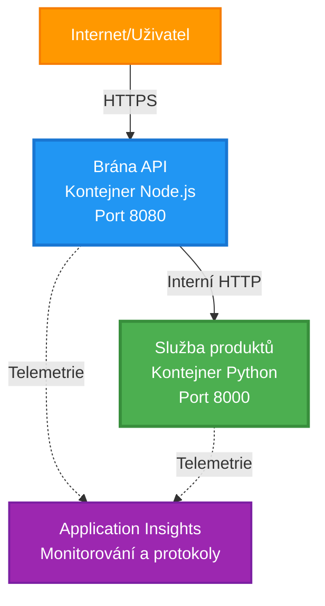
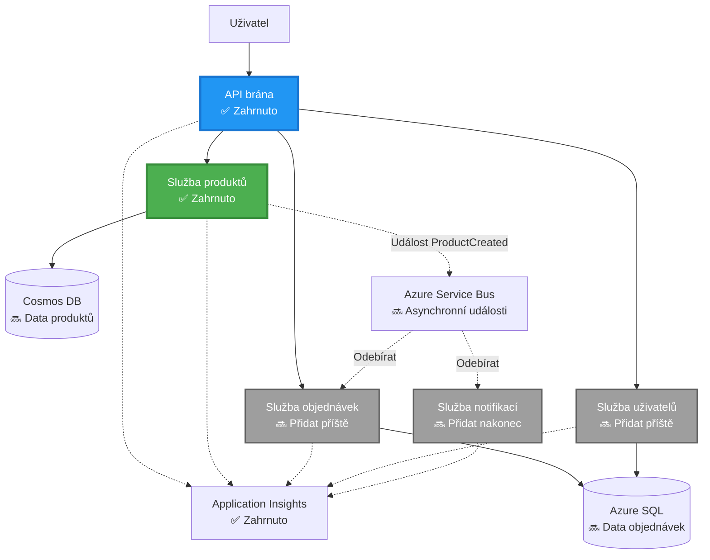
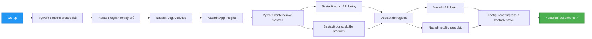
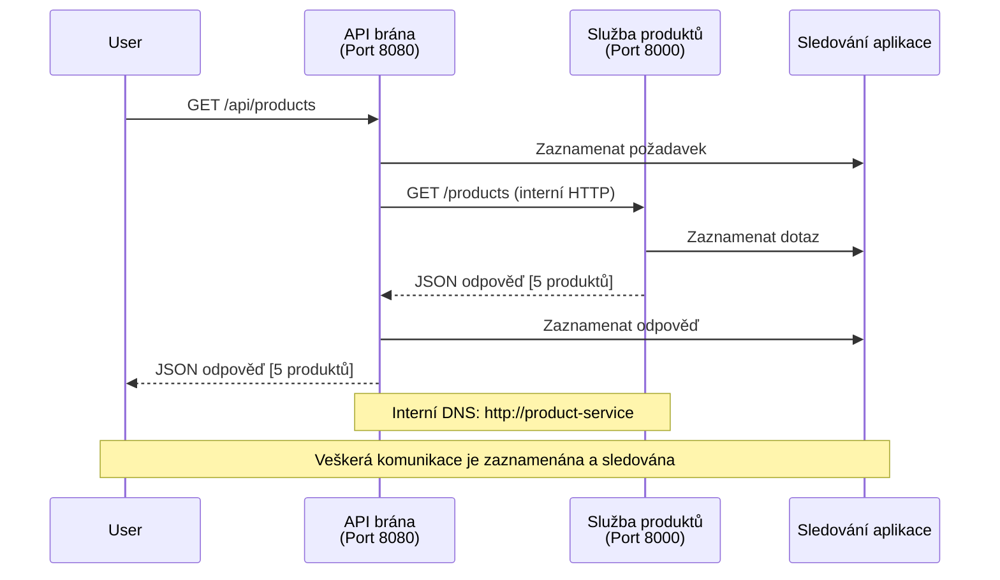

# Architektura mikroservisů - Příklad Container App

⏱️ **Odhadovaný čas**: 25-35 minut | 💰 **Odhadované náklady**: ~$50-100/month | ⭐ **Složitost**: Pokročilá

**📚 Učební cesta:**
- ← Předchozí: [Simple Flask API](../../../../examples/container-app/simple-flask-api) - Základy jednoho kontejneru
- 🎯 **Jste zde**: Architektura mikroservisů (základ se 2 službami)
- → Další: [AI Integration](../../../../docs/ai-foundry) - Přidat inteligenci do vašich služeb
- 🏠 [Domov kurzu](../../README.md)

---

Zjednodušená, ale funkční architektura mikroservisů nasazená do Azure Container Apps pomocí AZD CLI. Tento příklad demonstruje komunikaci mezi službami, orchestraci kontejnerů a monitorování na praktickém nastavení se 2 službami.

> **📚 Přístup k učení**: Tento příklad začíná s minimální architekturou se 2 službami (API brána + backend služba), kterou si můžete skutečně nasadit a z ní se učit. Po zvládnutí tohoto základu poskytneme pokyny pro rozšíření na plnohodnotný ekosystém mikroservisů.

## Co se naučíte

Po dokončení tohoto příkladu budete umět:
- Nasadit více kontejnerů do Azure Container Apps
- Implementovat komunikaci mezi službami s interním síťováním
- Konfigurovat škálování na základě prostředí a kontroly stavu
- Monitorovat distribuované aplikace pomocí Application Insights
- Pochopit vzory nasazení mikroservisů a osvědčené postupy
- Naučit se postupné rozšiřování od jednoduché k složité architektuře

## Architektura

### Fáze 1: Co stavíme (zahrnuto v tomto příkladu)


```mermaid
graph TB
    Internet[Internet/Uživatel]
    Gateway[Brána API<br/>Kontejner Node.js<br/>Port 8080]
    Product[Služba produktů<br/>Kontejner Python<br/>Port 8000]
    AppInsights[Application Insights<br/>Monitorování a protokoly]
    
    Internet -->|HTTPS| Gateway
    Gateway -->|Interní HTTP| Product
    Gateway -.->|Telemetrie| AppInsights
    Product -.->|Telemetrie| AppInsights
    
    style Gateway fill:#2196F3,stroke:#1976D2,stroke-width:3px,color:#fff
    style Product fill:#4CAF50,stroke:#388E3C,stroke-width:3px,color:#fff
    style Internet fill:#FF9800,stroke:#F57C00,stroke-width:2px,color:#fff
    style AppInsights fill:#9C27B0,stroke:#7B1FA2,stroke-width:2px,color:#fff
```
**Podrobnosti komponent:**

| Komponenta | Účel | Přístup | Zdroje |
|-----------|---------|--------|-----------|
| **API Gateway** | Směruje externí požadavky na backend služby | Veřejný (HTTPS) | 1 vCPU, 2GB RAM, 2-20 replik |
| **Product Service** | Spravuje katalog produktů s daty v paměti | Pouze interně | 0.5 vCPU, 1GB RAM, 1-10 replik |
| **Application Insights** | Centralizované logování a distribuované trasování | Azure Portal | 1-2 GB/měsíc příjem dat |

**Proč začít jednoduše?**
- ✅ Nasadit a rychle pochopit (25-35 minut)
- ✅ Naučit se hlavní vzory mikroservisů bez složitosti
- ✅ Funkční kód, který můžete upravovat a zkoumat
- ✅ Nižší náklady na učení (~$50-100/měsíc vs $300-1400/měsíc)
- ✅ Získat jistotu před přidáním databází a front zpráv

**Analogie**: Představte si to jako učení se řídit. Začnete s prázdným parkovištěm (2 služby), osvojíte si základy a pak přejdete na městský provoz (5+ služeb s databázemi).

### Fáze 2: Budoucí rozšíření (referenční architektura)

Jakmile zvládnete architekturu se 2 službami, můžete rozšířit na:


```mermaid
graph TB
    User[Uživatel]
    Gateway[API brána<br/>✅ Zahrnuto]
    Product[Služba produktů<br/>✅ Zahrnuto]
    Order[Služba objednávek<br/>🔜 Přidat příště]
    UserSvc[Služba uživatelů<br/>🔜 Přidat příště]
    Notify[Služba notifikací<br/>🔜 Přidat nakonec]
    
    CosmosDB[(Cosmos DB<br/>🔜 Data produktů)]
    AzureSQL[(Azure SQL<br/>🔜 Data objednávek)]
    ServiceBus[Azure Service Bus<br/>🔜 Asynchronní události]
    AppInsights[Application Insights<br/>✅ Zahrnuto]
    
    User --> Gateway
    Gateway --> Product
    Gateway --> Order
    Gateway --> UserSvc
    
    Product --> CosmosDB
    Order --> AzureSQL
    UserSvc --> AzureSQL
    
    Product -.->|Událost ProductCreated| ServiceBus
    ServiceBus -.->|Odebírat| Notify
    ServiceBus -.->|Odebírat| Order
    
    Gateway -.-> AppInsights
    Product -.-> AppInsights
    Order -.-> AppInsights
    UserSvc -.-> AppInsights
    Notify -.-> AppInsights
    
    style Product fill:#4CAF50,stroke:#388E3C,stroke-width:3px,color:#fff
    style Gateway fill:#2196F3,stroke:#1976D2,stroke-width:3px,color:#fff
    style Order fill:#9E9E9E,stroke:#616161,stroke-width:2px,color:#fff
    style UserSvc fill:#9E9E9E,stroke:#616161,stroke-width:2px,color:#fff
    style Notify fill:#9E9E9E,stroke:#616161,stroke-width:2px,color:#fff
```
Viz sekci „Průvodce rozšířením“ na konci pro pokyny krok za krokem.

## Zahrnuté funkce

✅ **Objevování služeb**: Automatické DNS-založené objevování mezi kontejnery  
✅ **Vyrovnávání zatížení**: Vestavěné vyrovnávání zatížení napříč replikami  
✅ **Automatické škálování**: Nezávislé škálování pro každou službu na základě HTTP požadavků  
✅ **Monitorování stavu**: Kontroly životaschopnosti (liveness) a připravenosti (readiness) pro obě služby  
✅ **Distribuované logování**: Centralizované logování s Application Insights  
✅ **Interní síťování**: Zabezpečená komunikace mezi službami  
✅ **Orchestrace kontejnerů**: Automatické nasazení a škálování  
✅ **Aktualizace bez výpadků**: Postupné aktualizace s řízením revizí  

## Požadavky

### Požadované nástroje

Než začnete, ověřte, že máte nainstalované tyto nástroje:

1. **[Azure Developer CLI (azd)](https://learn.microsoft.com/azure/developer/azure-developer-cli/install-azd)** (verze 1.0.0 nebo vyšší)
   ```bash
   azd version
   # Očekávaný výstup: azd verze 1.0.0 nebo vyšší
   ```

2. **[Azure CLI](https://learn.microsoft.com/cli/azure/install-azure-cli)** (verze 2.50.0 nebo vyšší)
   ```bash
   az --version
   # Očekávaný výstup: azure-cli 2.50.0 nebo vyšší
   ```

3. **[Docker](https://www.docker.com/get-started)** (pro lokální vývoj/testování - volitelné)
   ```bash
   docker --version
   # Očekávaný výstup: Docker verze 20.10 nebo vyšší
   ```

### Ověřte své nastavení

Spusťte tyto příkazy pro potvrzení, že jste připraveni:

```bash
# Zkontrolujte Azure Developer CLI
azd version
# ✅ Očekává se: azd verze 1.0.0 nebo vyšší

# Zkontrolujte Azure CLI
az --version
# ✅ Očekává se: azure-cli 2.50.0 nebo vyšší

# Zkontrolujte Docker (volitelné)
docker --version
# ✅ Očekává se: Docker verze 20.10 nebo vyšší
```

**Kritéria úspěchu**: Všechny příkazy vrátí čísla verzí odpovídající nebo převyšující minimální požadavky.

### Požadavky Azure

- Aktivní **Azure předplatné** ([vytvořit bezplatný účet](https://azure.microsoft.com/free/))
- Oprávnění k vytváření prostředků ve vašem předplatném
- Role **Contributor** na předplatném nebo skupině prostředků

### Požadavky na znalosti

Toto je příklad na **pokročilé úrovni**. Měli byste mít:
- Dokončený [Simple Flask API](../../../../examples/container-app/simple-flask-api) 
- Základní porozumění architektuře mikroservisů
- Znalost REST API a HTTP
- Pochopení konceptů kontejnerů

**Noví v Container Apps?** Začněte nejprve s příkladem [Simple Flask API](../../../../examples/container-app/simple-flask-api) pro naučení základů.

## Rychlý start (krok za krokem)

### Krok 1: Naklonujte a přejděte

```bash
git clone https://github.com/microsoft/AZD-for-beginners.git
cd AZD-for-beginners/examples/microservices
```

**✓ Kontrola úspěchu**: Ověřte, že vidíte `azure.yaml`:
```bash
ls
# Očekává se: README.md, azure.yaml, infra/, src/
```

### Krok 2: Autentizace do Azure

```bash
azd auth login
```

Tím se otevře váš prohlížeč pro autentizaci do Azure. Přihlaste se pomocí svých Azure přihlašovacích údajů.

**✓ Kontrola úspěchu**: Měli byste vidět:
```
Logged in to Azure.
```

### Krok 3: Inicializujte prostředí

```bash
azd init
```

**Výzvy, které uvidíte**:
- **Název prostředí**: Zadejte krátký název (např. `microservices-dev`)
- **Azure předplatné**: Vyberte své předplatné
- **Umístění Azure**: Zvolte region (např. `eastus`, `westeurope`)

**✓ Kontrola úspěchu**: Měli byste vidět:
```
SUCCESS: New project initialized!
```

### Krok 4: Nasazení infrastruktury a služeb

```bash
azd up
```

**Co se stane** (trvá 8–12 minut):


```mermaid
graph LR
    A[azd up] --> B[Vytvořit skupinu prostředků]
    B --> C[Nasadit registr kontejnerů]
    C --> D[Nasadit Log Analytics]
    D --> E[Nasadit App Insights]
    E --> F[Vytvořit kontejnerové prostředí]
    F --> G[Sestavit obraz API brány]
    F --> H[Sestavit obraz služby produktu]
    G --> I[Odeslat do registru]
    H --> I
    I --> J[Nasadit API bránu]
    I --> K[Nasadit službu produktu]
    J --> L[Konfigurovat Ingress a kontroly stavu]
    K --> L
    L --> M[Nasazení dokončeno ✓]
    
    style A fill:#2196F3,stroke:#1976D2,stroke-width:3px,color:#fff
    style M fill:#4CAF50,stroke:#388E3C,stroke-width:3px,color:#fff
```
**✓ Kontrola úspěchu**: Měli byste vidět:
```
SUCCESS: Your application was deployed to Azure in X minutes Y seconds.
Endpoint: https://api-gateway-<unique-id>.azurecontainerapps.io
```

**⏱️ Doba**: 8–12 minut

### Krok 5: Test nasazení

```bash
# Získat koncový bod brány
GATEWAY_URL=$(azd env get-values | grep API_GATEWAY_URL | cut -d '=' -f2 | tr -d '"')

# Otestovat stav API brány
curl $GATEWAY_URL/health
```

**✅ Očekávaný výstup:**
```json
{
  "status": "healthy",
  "service": "api-gateway",
  "timestamp": "2025-11-19T10:30:00Z"
}
```

**Otestujte službu produktů přes API bránu**:
```bash
# Seznam produktů
curl $GATEWAY_URL/api/products
```

**✅ Očekávaný výstup:**
```json
[
  {"id":1,"name":"Laptop","price":999.99,"stock":50},
  {"id":2,"name":"Mouse","price":29.99,"stock":200},
  {"id":3,"name":"Keyboard","price":79.99,"stock":150}
]
```

**✓ Kontrola úspěchu**: Obě koncové body vracejí JSON data bez chyb.

---

**🎉 Gratulujeme!** Nasadili jste architekturu mikroservisů do Azure!

## Struktura projektu

Všechny implementační soubory jsou zahrnuty—toto je kompletní, fungující příklad:

```
microservices/
│
├── README.md                         # This file
├── azure.yaml                        # AZD configuration
├── .gitignore                        # Git ignore patterns
│
├── infra/                           # Infrastructure as Code (Bicep)
│   ├── main.bicep                   # Main orchestration
│   ├── abbreviations.json           # Naming conventions
│   ├── core/                        # Shared infrastructure
│   │   ├── container-apps-environment.bicep  # Container environment + registry
│   │   └── monitor.bicep            # Application Insights + Log Analytics
│   └── app/                         # Service definitions
│       ├── api-gateway.bicep        # API Gateway container app
│       └── product-service.bicep    # Product Service container app
│
└── src/                             # Application source code
    ├── api-gateway/                 # Node.js API Gateway
    │   ├── app.js                   # Express server with routing
    │   ├── package.json             # Node dependencies
    │   └── Dockerfile               # Container definition
    └── product-service/             # Python Product Service
        ├── main.py                  # Flask API with product data
        ├── requirements.txt         # Python dependencies
        └── Dockerfile               # Container definition
```

**Co každá komponenta dělá:**

**Infrastruktura (infra/)**:
- `main.bicep`: Orchestrace všech Azure prostředků a jejich závislostí
- `core/container-apps-environment.bicep`: Vytváří prostředí Container Apps a Azure Container Registry
- `core/monitor.bicep`: Nastavuje Application Insights pro distribuované logování
- `app/*.bicep`: Jednotlivé definice container app s konfigurací škálování a kontrolami stavu

**API brána (src/api-gateway/)**:
- Veřejná služba, která směruje požadavky na backend služby
- Implementuje logování, zpracování chyb a přeposílání požadavků
- Demonstruje HTTP komunikaci mezi službami

**Služba produktů (src/product-service/)**:
- Interní služba s katalogem produktů (v paměti pro jednoduchost)
- REST API s kontrolami stavu
- Příklad vzoru backendové mikroslužby

## Přehled služeb

### API brána (Node.js/Express)

**Port**: 8080  
**Přístup**: Veřejný (externí ingress)  
**Účel**: Směruje příchozí požadavky na příslušné backendové služby  

**Koncové body**:
- `GET /` - Informace o službě
- `GET /health` - Endpoint kontroly stavu
- `GET /api/products` - Přeposlat na službu produktů (vypsat všechny)
- `GET /api/products/:id` - Přeposlat na službu produktů (získat podle ID)

**Hlavní rysy**:
- Směrování požadavků pomocí axios
- Centralizované logování
- Zpracování chyb a řízení časových limitů
- Objevování služeb pomocí proměnných prostředí
- Integrace s Application Insights

**Ukázka kódu** (`src/api-gateway/app.js`):
```javascript
// Interní komunikace služeb
app.get('/api/products', async (req, res) => {
  const response = await axios.get(`${PRODUCT_SERVICE_URL}/products`, {
    timeout: 5000
  });
  res.json(response.data);
});
```

### Služba produktů (Python/Flask)

**Port**: 8000  
**Přístup**: Pouze interní (žádný externí ingress)  
**Účel**: Spravuje katalog produktů s daty v paměti  

**Koncové body**:
- `GET /` - Informace o službě
- `GET /health` - Endpoint kontroly stavu
- `GET /products` - Vypsat všechny produkty
- `GET /products/<id>` - Získat produkt podle ID

**Hlavní rysy**:
- RESTful API ve Flasku
- Úložiště produktů v paměti (jednoduché, není potřeba databáze)
- Monitorování stavu pomocí sond
- Strukturované logování
- Integrace s Application Insights

**Datový model**:
```python
{
  "id": 1,
  "name": "Laptop",
  "description": "High-performance laptop",
  "price": 999.99,
  "stock": 50
}
```

**Proč pouze interní?**
Služba produktů není veřejně zpřístupněna. Všechny požadavky musí projít přes API bránu, která poskytuje:
- Zabezpečení: Řízený přístupový bod
- Flexibilita: Možnost měnit backend bez ovlivnění klientů
- Monitorování: Centralizované logování požadavků

## Porozumění komunikaci mezi službami

### Jak spolu služby komunikují


```mermaid
sequenceDiagram
    participant User
    participant Gateway as API brána<br/>(Port 8080)
    participant Product as Služba produktů<br/>(Port 8000)
    participant AI as Sledování aplikace
    
    User->>Gateway: GET /api/products
    Gateway->>AI: Zaznamenat požadavek
    Gateway->>Product: GET /products (interní HTTP)
    Product->>AI: Zaznamenat dotaz
    Product-->>Gateway: JSON odpověď [5 produktů]
    Gateway->>AI: Zaznamenat odpověď
    Gateway-->>User: JSON odpověď [5 produktů]
    
    Note over Gateway,Product: Interní DNS: http://product-service
    Note over User,AI: Veškerá komunikace je zaznamenána a sledována
```
V tomto příkladu API brána komunikuje se službou produktů pomocí **interních HTTP volání**:

```javascript
// API brána (src/api-gateway/app.js)
const PRODUCT_SERVICE_URL = process.env.PRODUCT_SERVICE_URL;

// Proveď interní HTTP požadavek
const response = await axios.get(`${PRODUCT_SERVICE_URL}/products`);
```

**Klíčové body**:

1. **Objevování založené na DNS**: Container Apps automaticky poskytuje DNS pro interní služby
   - FQDN služby Product Service: `product-service.internal.<environment>.azurecontainerapps.io`
   - Zjednodušeně jako: `http://product-service` (Container Apps to vyřeší)

2. **Bez veřejného vystavení**: Product Service má v Bicep `external: false`
   - Přístupná pouze v rámci prostředí Container Apps
   - Není dosažitelná z internetu

3. **Proměnné prostředí**: URL služeb jsou vkládány při nasazení
   - Bicep předává interní FQDN bráně
   - Žádné pevně zadané URL v aplikačním kódu

**Analogie**: Představte si to jako kancelářské místnosti. API brána je recepce (veřejně přístupná), a služba produktů je kancelář (pouze interní). Návštěvníci musí projít recepcí, aby se dostali do kanceláře.

## Možnosti nasazení

### Úplné nasazení (doporučeno)

```bash
# Nasadit infrastrukturu a obě služby
azd up
```

Toto nasadí:
1. Prostředí Container Apps
2. Application Insights
3. Container Registry
4. Kontejner API brány
5. Kontejner služby produktů

**Doba**: 8-12 minut

### Nasadit jednotlivou službu

```bash
# Nasadit pouze jednu službu (po počátečním příkazu azd up)
azd deploy api-gateway

# Nebo nasadit službu product
azd deploy product-service
```

**Použití**: Když jste aktualizovali kód v jedné službě a chcete znovu nasadit pouze tu službu.

### Aktualizovat konfiguraci

```bash
# Změnit parametry škálování
azd env set GATEWAY_MAX_REPLICAS 30

# Znovu nasadit s novou konfigurací
azd up
```

## Konfigurace

### Konfigurace škálování

Obě služby jsou nakonfigurovány s autoskalováním založeným na HTTP v jejich Bicep souborech:

**API brána**:
- Min. replik: 2 (vždy alespoň 2 pro dostupnost)
- Max. replik: 20
- Spouštěč škálování: 50 současných požadavků na repliku

**Služba produktů**:
- Min. replik: 1 (může se v případě potřeby škálovat na nulu)
- Max. replik: 10
- Spouštěč škálování: 100 současných požadavků na repliku

**Přizpůsobit škálování** (v `infra/app/*.bicep`):
```bicep
scale: {
  minReplicas: 1
  maxReplicas: 10
  rules: [
    {
      name: 'http-scale-rule'
      http: {
        metadata: {
          concurrentRequests: '100'  // Adjust this
        }
      }
    }
  ]
}
```

### Přidělení zdrojů

**API brána**:
- CPU: 1.0 vCPU
- Paměť: 2 GiB
- Důvod: Zpracovává veškerý externí provoz

**Služba produktů**:
- CPU: 0.5 vCPU
- Paměť: 1 GiB
- Důvod: Lehká operace v paměti

### Kontroly stavu

Obě služby obsahují liveness a readiness sondy:

```bicep
probes: [
  {
    type: 'Liveness'
    httpGet: {
      path: '/health'
      port: 8080
    }
    initialDelaySeconds: 10
    periodSeconds: 30
  }
  {
    type: 'Readiness'
    httpGet: {
      path: '/health'
      port: 8080
    }
    initialDelaySeconds: 5
    periodSeconds: 10
  }
]
```

**Co to znamená**:
- **Liveness**: Pokud kontrola stavu selže, Container Apps restartuje kontejner
- **Readiness**: Pokud není připravená, Container Apps přestane směrovat provoz na tu repliku

## Monitorování a observabilita

### Zobrazit logy služeb

```bash
# Zobrazit protokoly pomocí azd monitor
azd monitor --logs

# Nebo použijte Azure CLI pro konkrétní Container Apps:
# Přenášet protokoly z API Gateway
az containerapp logs show --name api-gateway --resource-group $RG_NAME --follow

# Zobrazit nedávné protokoly služby product service
az containerapp logs show --name product-service --resource-group $RG_NAME --tail 100
```

**Očekávaný výstup**:
```
[api-gateway] API Gateway listening on port 8080
[api-gateway] Product Service URL: http://product-service
[api-gateway] GET /api/products 200 - 45ms
[product-service] Retrieved 5 products
```

### Dotazy v Application Insights

Otevřete Application Insights v Azure Portalu, poté spusťte tyto dotazy:

**Najít pomalé požadavky**:
```kusto
requests
| where timestamp > ago(1h)
| where duration > 1000  // Requests taking >1 second
| summarize count() by name, cloud_RoleName
| order by count_ desc
```

**Sledovat volání mezi službami**:
```kusto
dependencies
| where timestamp > ago(1h)
| where type == "Http"
| project timestamp, name, target, duration, success
| order by timestamp desc
```

**Míra chyb podle služby**:
```kusto
exceptions
| where timestamp > ago(24h)
| summarize errorCount = count() by cloud_RoleName, type
| order by errorCount desc
```

**Objem požadavků v čase**:
```kusto
requests
| where timestamp > ago(1h)
| summarize requestCount = count() by bin(timestamp, 5m), cloud_RoleName
| render timechart
```

### Přístup k monitorovacímu panelu

```bash
# Získat podrobnosti o Application Insights
azd env get-values | grep APPLICATIONINSIGHTS

# Otevřít monitorování v Azure portálu
az monitor app-insights component show \
  --app $(azd env get-values | grep APPLICATIONINSIGHTS_CONNECTION_STRING | cut -d '=' -f2) \
  --resource-group $(azd env get-values | grep AZURE_RESOURCE_GROUP | cut -d '=' -f2) \
  --query "appId" -o tsv
```

### Živé metriky

1. Přejděte do Application Insights v Azure Portalu
2. Klikněte na "Live Metrics"
3. Zobrazí se požadavky v reálném čase, chyby a výkon
4. Otestujte spuštěním: `curl $(azd env get-values | grep API_GATEWAY_URL | cut -d '=' -f2 | tr -d '"')/api/products`

## Praktické cvičení

### Cvičení 1: Přidat nové endpoint pro produkt ⭐ (Snadné)

**Cíl**: Přidat POST endpoint pro vytvoření nových produktů

**Výchozí bod**: `src/product-service/main.py`

**Kroky**:

1. Přidejte tento endpoint za funkci `get_product` v `main.py`:

```python
@app.route('/products', methods=['POST'])
def create_product():
    """Create a new product"""
    data = request.get_json()
    
    # Ověřit povinná pole
    if not data or 'name' not in data or 'price' not in data:
        return jsonify({'error': 'Missing required fields: name, price'}), 400
    
    new_id = max(p['id'] for p in products) + 1
    new_product = {
        'id': new_id,
        'name': data['name'],
        'description': data.get('description', ''),
        'price': float(data['price']),
        'stock': int(data.get('stock', 0))
    }
    products.append(new_product)
    logger.info(f"Created product {new_id}")
    return jsonify(new_product), 201
```

2. Přidejte POST trasu do API brány (`src/api-gateway/app.js`):

```javascript
// Přidejte toto za trasu GET /api/products
app.post('/api/products', async (req, res) => {
  try {
    console.log(`Forwarding POST request to ${PRODUCT_SERVICE_URL}/products`);
    const response = await axios.post(`${PRODUCT_SERVICE_URL}/products`, req.body, {
      timeout: 5000
    });
    res.status(201).json(response.data);
  } catch (error) {
    console.error('Error calling product service:', error.message);
    res.status(503).json({
      error: 'Product service unavailable',
      message: error.message
    });
  }
});
```

3. Znovu nasadit obě služby:

```bash
azd deploy product-service
azd deploy api-gateway
```

4. Otestujte nové endpoint:

```bash
GATEWAY_URL=$(azd env get-values | grep API_GATEWAY_URL | cut -d '=' -f2 | tr -d '"')

# Vytvořit nový produkt
curl -X POST $GATEWAY_URL/api/products \
  -H "Content-Type: application/json" \
  -d '{"name":"USB Cable","price":9.99,"stock":500}'
```

**✅ Očekávaný výstup:**
```json
{"id":6,"name":"USB Cable","description":"","price":9.99,"stock":500}
```

5. Ověřte, že se zobrazuje v seznamu:

```bash
curl $GATEWAY_URL/api/products
# Mělo by nyní zobrazovat 6 produktů včetně nového USB kabelu.
```

**Kritéria úspěchu**:
- ✅ POST požadavek vrací HTTP 201
- ✅ Nový produkt se objeví v seznamu GET /api/products
- ✅ Produkt má automaticky inkrementované ID

**Čas**: 10-15 minut

---

### Cvičení 2: Změnit pravidla autoskalování ⭐⭐ (Střední)

**Cíl**: Změnit Product Service, aby škáloval agresivněji

**Výchozí bod**: `infra/app/product-service.bicep`

**Kroky**:

1. Otevřete `infra/app/product-service.bicep` a najděte blok `scale` (kolem řádku 95)

2. Změňte z:
```bicep
scale: {
  minReplicas: 1
  maxReplicas: 10
  rules: [
    {
      name: 'http-scale-rule'
      http: {
        metadata: {
          concurrentRequests: '100'  // OLD
        }
      }
    }
  ]
}
```

Na:
```bicep
scale: {
  minReplicas: 2  // Always have 2 running
  maxReplicas: 20  // Allow more scaling
  rules: [
    {
      name: 'http-scale-rule'
      http: {
        metadata: {
          concurrentRequests: '20'  // Scale at lower threshold
        }
      }
    }
  ]
}
```

3. Znovu nasaďte infrastrukturu:

```bash
azd up
```

4. Ověřte novou konfiguraci škálování:

```bash
az containerapp show \
  --name $(azd env get-values | grep PRODUCT_SERVICE | head -1 | cut -d '/' -f5) \
  --resource-group $(azd env get-values | grep AZURE_RESOURCE_GROUP | cut -d '=' -f2 | tr -d '"') \
  --query "properties.template.scale" -o json
```

**✅ Očekávaný výstup:**
```json
{
  "minReplicas": 2,
  "maxReplicas": 20,
  "rules": [...]
}
```

5. Otestujte autoskalování zatížením:

```bash
# Vygenerujte souběžné požadavky
for i in {1..500}; do curl $GATEWAY_URL/api/products & done

# Sledujte škálování pomocí Azure CLI
az containerapp logs show --name product-service --resource-group $RG_NAME --follow
# Hledejte: události škálování Container Apps
```

**Kritéria úspěchu**:
- ✅ Product Service vždy běží alespoň se 2 replikami
- ✅ Pod zatížením se škáluje na více než 2 repliky
- ✅ Azure Portal zobrazuje nová pravidla škálování

**Čas**: 15-20 minut

---

### Cvičení 3: Přidat vlastní monitorovací dotaz ⭐⭐ (Střední)

**Cíl**: Vytvořit vlastní dotaz v Application Insights pro sledování výkonu Product API

**Kroky**:

1. Přejděte do Application Insights v Azure Portal:
   - Přejděte do Azure Portal
   - Najděte svou resource group (rg-microservices-*)
   - Klikněte na Application Insights

2. Klikněte v levém menu na "Logs"

3. Vytvořte tento dotaz:

```kusto
requests
| where timestamp > ago(1h)
| where name contains "products"
| summarize 
    RequestCount = count(),
    AvgDuration = avg(duration),
    P95Duration = percentile(duration, 95),
    SuccessRate = 100.0 * countif(success == true) / count()
  by bin(timestamp, 5m)
| render timechart
```

4. Klikněte na "Run" pro spuštění dotazu

5. Uložte dotaz:
   - Klikněte na "Save"
   - Název: "Product API Performance"
   - Kategorie: "Performance"

6. Vygenerujte testovací provoz:

```bash
for i in {1..100}; do curl $GATEWAY_URL/api/products; sleep 1; done
```

7. Aktualizujte dotaz pro zobrazení dat

**✅ Očekávaný výstup:**
- Graf ukazující počty požadavků v čase
- Průměrná doba < 500 ms
- Míra úspěšnosti = 100%
- Časové intervaly po 5 minutách

**Kritéria úspěchu**:
- ✅ Dotaz ukazuje více než 100 požadavků
- ✅ Míra úspěšnosti je 100%
- ✅ Průměrná doba < 500 ms
- ✅ Graf zobrazuje 5minutové časové intervaly

**Výsledek učení**: Pochopit, jak sledovat výkon služby pomocí vlastních dotazů

**Čas**: 10-15 minut

---

### Cvičení 4: Implementovat logiku opakování (retry) ⭐⭐⭐ (Pokročilé)

**Cíl**: Přidat logiku opakování do API Gateway, když je Product Service dočasně nedostupný

**Výchozí bod**: `src/api-gateway/app.js`

**Kroky**:

1. Nainstalujte knihovnu pro retry:

```bash
cd src/api-gateway
npm install axios-retry --save
cd ../..
```

2. Aktualizujte `src/api-gateway/app.js` (přidejte za import axios):

```javascript
const axiosRetry = require('axios-retry');

// Nastavit logiku opakování
axiosRetry(axios, {
  retries: 3,
  retryDelay: (retryCount) => {
    return retryCount * 1000; // 1s, 2s, 3s
  },
  retryCondition: (error) => {
    // Opakovat při síťových chybách nebo odpovědích 5xx
    return axiosRetry.isNetworkOrIdempotentRequestError(error) ||
           (error.response && error.response.status >= 500);
  }
});

console.log('Retry logic configured: 3 retries with exponential backoff');
```

3. Znovu nasaďte API Gateway:

```bash
azd deploy api-gateway
```

4. Otestujte chování retry simulací selhání služby:

```bash
# Nastavit službu produktu na 0 (simulovat selhání)
az containerapp update \
  --name $(azd env get-values | grep PRODUCT_SERVICE | head -1 | cut -d '/' -f5) \
  --resource-group $(azd env get-values | grep AZURE_RESOURCE_GROUP | cut -d '=' -f2 | tr -d '"') \
  --min-replicas 0 \
  --max-replicas 0

# Zkusit přistoupit k produktům (bude opakovat 3krát)
time curl -v $GATEWAY_URL/api/products
# Pozor: Odezva trvá přibližně 6 sekund (1 s + 2 s + 3 s při opakování)

# Obnovit službu produktu
az containerapp update \
  --name $(azd env get-values | grep PRODUCT_SERVICE | head -1 | cut -d '/' -f5) \
  --resource-group $(azd env get-values | grep AZURE_RESOURCE_GROUP | cut -d '=' -f2 | tr -d '"') \
  --min-replicas 1 \
  --max-replicas 10
```

5. Zobrazte logy retry:

```bash
az containerapp logs show --name api-gateway --resource-group $RG_NAME --tail 50
# Hledejte: zprávy o opětovných pokusech
```

**✅ Očekávané chování:**
- Požadavky se opakují 3× před selháním
- Každé opakování čeká déle (1s, 2s, 3s)
- Úspěšné požadavky po restartu služby
- Logy ukazují pokusy o opakování

**Kritéria úspěchu**:
- ✅ Požadavky se opakují 3× před selháním
- ✅ Každé opakování čeká déle (exponenciální backoff)
- ✅ Úspěšné požadavky po restartu služby
- ✅ Logy ukazují pokusy o opakování

**Výsledek učení**: Pochopit vzory odolnosti v mikroservisách (circuit breakers, retries, timeouts)

**Čas**: 20-25 minut

---

## Kontrola znalostí

Po dokončení tohoto příkladu ověřte své porozumění:

### 1. Komunikace služeb ✓

Otestujte si znalosti:
- [ ] Dokážete vysvětlit, jak API Gateway objevuje Product Service? (objevování služeb na základě DNS)
- [ ] Co se stane, když Product Service není dostupný? (Gateway vrátí chybu 503)
- [ ] Jak byste přidali třetí službu? (Vytvořit nový Bicep soubor, přidat do main.bicep, vytvořit složku src)

**Praktické ověření:**
```bash
# Simulovat selhání služby
az containerapp update --name <product-service-name> --min-replicas 0 --max-replicas 0
curl $GATEWAY_URL/api/products
# ✅ Očekává se: 503 Služba nedostupná

# Obnovit službu
az containerapp update --name <product-service-name> --min-replicas 1 --max-replicas 10
```

### 2. Monitorování a pozorovatelnost ✓

Otestujte si znalosti:
- [ ] Kde vidíte distribuované logy? (Application Insights v Azure Portal)
- [ ] Jak sledujete pomalé požadavky? (Kusto dotaz: `requests | where duration > 1000`)
- [ ] Dokážete identifikovat, která služba způsobila chybu? (Zkontrolujte pole `cloud_RoleName` v logech)

**Praktické ověření:**
```bash
# Vygenerovat simulaci pomalého požadavku
curl "$GATEWAY_URL/api/products?delay=2000"

# Dotazovat Application Insights na pomalé požadavky
# Přejděte do Azure Portal → Application Insights → Logs
# Spusťte: requests | where duration > 1000 | project timestamp, name, duration, cloud_RoleName
```

### 3. Škálování a výkon ✓

Otestujte si znalosti:
- [ ] Co spouští autoskalování? (Pravidla pro současné HTTP požadavky: 50 pro gateway, 100 pro product)
- [ ] Kolik replik právě běží? (Zkontrolujte pomocí `az containerapp revision list`)
- [ ] Jak byste škálovali Product Service na 5 replik? (Aktualizujte minReplicas v Bicep)

**Praktické ověření:**
```bash
# Vygenerujte zátěž pro testování automatického škálování
for i in {1..1000}; do curl $GATEWAY_URL/api/products & done

# Sledujte zvyšování replik pomocí Azure CLI
az containerapp logs show --name api-gateway --resource-group $RG_NAME --follow
# ✅ Očekává se: Události škálování budou v protokolech
```

**Kritéria úspěchu**: Dokážete odpovědět na všechny otázky a ověřit je pomocí praktických příkazů.

---

## Analýza nákladů

### Odhadované měsíční náklady (pro tento příklad se 2 službami)

| Zdroj | Konfigurace | Odhadované náklady |
|----------|--------------|----------------|
| API Gateway | 2-20 replik, 1 vCPU, 2GB RAM | $30-150 |
| Product Service | 1-10 replik, 0.5 vCPU, 1GB RAM | $15-75 |
| Container Registry | základní úroveň | $5 |
| Application Insights | 1-2 GB/měsíc | $5-10 |
| Log Analytics | 1 GB/měsíc | $3 |
| **Celkem** | | **$58-243/měsíc** |

### Rozpis nákladů podle využití

**Nízká zátěž** (testování/učení): ~$60/měsíc
- API Gateway: 2 repliky × 24/7 = $30
- Product Service: 1 replika × 24/7 = $15
- Monitoring + Registry = $13

**Střední zátěž** (malá produkce): ~$120/měsíc
- API Gateway: v průměru 5 replik = $75
- Product Service: v průměru 3 repliky = $45
- Monitoring + Registry = $13

**Vysoká zátěž** (rušné období): ~$240/měsíc
- API Gateway: v průměru 15 replik = $225
- Product Service: v průměru 8 replik = $120
- Monitoring + Registry = $13

### Tipy na optimalizaci nákladů

1. **Škálovat na nulu pro vývoj**:
   ```bicep
   scale: {
     minReplicas: 0  // Save $30-40/month when not in use
     maxReplicas: 10
   }
   ```

2. **Použijte Consumption plán pro Cosmos DB** (až ho přidáte):
   - Plaťte pouze za to, co použijete
   - Žádný minimální poplatek

3. **Nastavte sampling v Application Insights**:
   ```javascript
   appInsights.defaultClient.config.samplingPercentage = 50; // Vzorkovat 50 % požadavků
   ```

4. **Vyčistěte po použití (smažte zdroje)**:
   ```bash
   azd down --force --purge
   ```

### Možnosti bezplatné úrovně

Pro učení/testování zvažte:
- ✅ Využijte Azure free kredity ($200 pro prvních 30 dní u nových účtů)
- ✅ Udržujte minimální počet replik (ušetří ~50 % nákladů)
- ✅ Smažte po testování (žádné průběžné poplatky)
- ✅ Škálujte na nulu mezi učebními sezeními

**Příklad**: Spuštění tohoto příkladu 2 hodiny/den × 30 dní = ~ $5/měsíc místo $60/měsíc

---

## Rychlý přehled řešení problémů

### Problém: `azd up` selže s "Subscription not found"

**Řešení**:
```bash
# Znovu se přihlaste s explicitním předplatným
az account set --subscription <your-subscription-id>
azd env set AZURE_SUBSCRIPTION_ID <your-subscription-id>
azd up
```

### Problém: API Gateway vrací 503 "Product service unavailable"

**Diagnóza**:
```bash
# Zkontrolujte protokoly produktové služby pomocí Azure CLI
az containerapp logs show --name product-service --resource-group $RG_NAME --tail 50

# Zkontrolujte stav produktové služby
az containerapp show \
  --name $(azd env get-values | grep PRODUCT_SERVICE | head -1 | cut -d '/' -f5) \
  --resource-group $(azd env get-values | grep AZURE_RESOURCE_GROUP | cut -d '=' -f2 | tr -d '"') \
  --query "properties.runningStatus"
```

**Běžné příčiny**:
1. Product service se nespustil (zkontrolujte logy na chyby v Pythonu)
2. Health check selhává (ověřte, že endpoint `/health` funguje)
3. Build kontejnerového obrazu selhal (zkontrolujte registry na přítomnost image)

### Problém: Autoskalování nefunguje

**Diagnóza**:
```bash
# Zkontrolovat aktuální počet replik
az containerapp revision list \
  --name $(azd env get-values | grep API_GATEWAY | head -1 | cut -d '/' -f5) \
  --resource-group $(azd env get-values | grep AZURE_RESOURCE_GROUP | cut -d '=' -f2 | tr -d '"') \
  --query "[].properties.replicas"

# Generovat zátěž pro test
for i in {1..1000}; do curl $GATEWAY_URL/api/products & done

# Sledovat škálovací události pomocí Azure CLI
az containerapp logs show --name api-gateway --resource-group $RG_NAME --follow | grep -i scale
```

**Běžné příčiny**:
1. Zatížení není dostatečné k aktivaci pravidla škálování (potřebujete >50 současných požadavků)
2. Maximální počet replik je již dosažen (zkontrolujte konfiguraci v Bicep)
3. Pravidlo škálování chybně nakonfigurováno v Bicep (ověřte hodnotu concurrentRequests)

### Problém: Application Insights nezobrazuje logy

**Diagnóza**:
```bash
# Ověřte, že je řetězec připojení nastaven
azd env get-values | grep APPLICATIONINSIGHTS

# Zkontrolujte, zda služby odesílají telemetrii
az monitor app-insights component show \
  --app $(azd env get-values | grep APPLICATIONINSIGHTS_NAME | cut -d '=' -f2 | tr -d '"') \
  --resource-group $(azd env get-values | grep AZURE_RESOURCE_GROUP | cut -d '=' -f2 | tr -d '"') \
  --query "properties.InstrumentationKey"
```

**Běžné příčiny**:
1. Connection string nebyl předán do kontejneru (zkontrolujte proměnné prostředí)
2. SDK Application Insights není nakonfigurované (ověřte importy v kódu)
3. Firewall blokuje telemetrii (vzácné, zkontrolujte síťová pravidla)

### Problém: Docker build selhává lokálně

**Diagnóza**:
```bash
# Test sestavení API brány
cd src/api-gateway
docker build -t test-gateway .

# Test sestavení služby produktů
cd ../product-service
docker build -t test-product .
```

**Běžné příčiny**:
1. Chybějící závislosti v package.json/requirements.txt
2. Chyby syntaxe v Dockerfile
3. Problémy sítě při stahování závislostí

**Stále máte problém?** Podívejte se na [Průvodce běžnými problémy](../../docs/chapter-07-troubleshooting/common-issues.md) nebo [Řešení problémů s Azure Container Apps](https://learn.microsoft.com/azure/container-apps/troubleshooting)

---

## Úklid

Aby nedocházelo k průběžným poplatkům, smažte všechny zdroje:

```bash
azd down --force --purge
```

**Potvrzení**:
```
? Total resources to delete: 6, are you sure you want to continue? (y/N)
```

Zadejte `y` pro potvrzení.

**Co bude smazáno**:
- Prostředí Container Apps
- Obě Container Apps (gateway & product service)
- Container Registry
- Application Insights
- Log Analytics Workspace
- Resource Group

**✓ Ověření vyčištění**:
```bash
az group list --query "[?starts_with(name,'rg-microservices')]" --output table
```

Mělo by vrátit prázdné.

---

## Průvodce rozšířením: ze 2 na 5+ služeb

Jakmile zvládnete tuto architekturu se 2 službami, zde je postup rozšíření:

### Fáze 1: Přidat perzistenci databáze (další krok)

**Přidat Cosmos DB pro Product Service**:

1. Vytvořte `infra/core/cosmos.bicep`:
   ```bicep
   resource cosmosAccount 'Microsoft.DocumentDB/databaseAccounts@2023-04-15' = {
     name: name
     location: location
     kind: 'GlobalDocumentDB'
     properties: {
       databaseAccountOfferType: 'Standard'
       consistencyPolicy: { defaultConsistencyLevel: 'Session' }
       locations: [{ locationName: location, failoverPriority: 0 }]
     }
   }
   ```

2. Aktualizujte product service tak, aby používal Azure Cosmos DB Python SDK místo dat v paměti

3. Odhadovaná dodatečná cena: ~ $25/měsíc (serverless)

### Fáze 2: Přidat třetí službu (správa objednávek)

**Vytvořit Order Service**:

1. Nová složka: `src/order-service/` (Python/Node.js/C#)
2. Nový Bicep: `infra/app/order-service.bicep`
3. Aktualizujte API Gateway, aby směrovala `/api/orders`
4. Přidejte Azure SQL Database pro perzistenci objednávek

**Architektura se stane**:
```
API Gateway → Product Service (Cosmos DB)
           → Order Service (Azure SQL)
```

### Fáze 3: Přidat asynchronní komunikaci (Service Bus)

**Implementovat událostně řízenou architekturu**:

1. Přidejte Azure Service Bus: `infra/core/servicebus.bicep`
2. Product Service publikuje události "ProductCreated"
3. Order Service se přihlašuje k událostem produktu
4. Přidejte Notification Service pro zpracování událostí

**Vzor**: Request/Response (HTTP) + Event-Driven (Service Bus)

### Fáze 4: Přidat autentizaci uživatelů

**Implementovat User Service**:

1. Vytvořte `src/user-service/` (Go/Node.js)
2. Přidejte Azure AD B2C nebo vlastní JWT autentizaci
3. API Gateway ověřuje tokeny před směrováním
4. Služby kontrolují oprávnění uživatele

### Fáze 5: Příprava na produkci

**Přidejte tyto komponenty**:
- ✅ Azure Front Door (globální vyvažování zátěže)
- ✅ Azure Key Vault (správa tajemství)
- ✅ Azure Monitor Workbooks (vlastní dashboardy)
- ✅ CI/CD pipeline (GitHub Actions)
- ✅ Blue-Green nasazení
- ✅ Managed Identity pro všechny služby

**Cena plné produkční architektury**: ~ $300-1,400/měsíc

---

## Další informace

### Související dokumentace
- [Dokumentace Azure Container Apps](https://learn.microsoft.com/azure/container-apps/)
- [Průvodce architekturou mikroservis](https://learn.microsoft.com/azure/architecture/guide/architecture-styles/microservices)
- [Application Insights pro distribuované trasování](https://learn.microsoft.com/azure/azure-monitor/app/distributed-tracing)
- [Dokumentace Azure Developer CLI](https://learn.microsoft.com/azure/developer/azure-developer-cli/)

### Další kroky v tomto kurzu
- ← Předchozí: [Simple Flask API](../../../../examples/container-app/simple-flask-api) - Příklad pro začátečníky s jedním kontejnerem
- → Další: [Průvodce integrací AI](../../../../docs/ai-foundry) - Přidat AI funkce
- 🏠 [Domov kurzu](../../README.md)

### Porovnání: Kdy použít co

| Vlastnost | Jediný kontejner | Mikroservisy (tento) | Kubernetes (AKS) |
|---------|-----------------|---------------------|------------------|
| **Použití** | Jednoduché aplikace | Složité aplikace | Podnikové aplikace |
| **Škálovatelnost** | Jedna služba | Škálování na úrovni služby | Maximální flexibilita |
| **Komplexita** | Nízká | Střední | Vysoká |
| **Velikost týmu** | 1-3 vývojáři | 3-10 vývojářů | 10+ vývojářů |
| **Náklady** | ~ $15-50/měsíc | ~ $60-250/měsíc | ~ $150-500/měsíc |
| **Doba nasazení** | 5-10 minut | 8-12 minut | 15-30 minut |
| **Vhodné pro** | MVPy, prototypy | Produkční aplikace | Multi-cloud, pokročilé síťování |

**Doporučení**: Začněte s Container Apps (tento příklad), přejděte na AKS pouze pokud potřebujete funkce specifické pro Kubernetes.

---

## Často kladené otázky

**Q: Proč jen 2 služby místo 5+?**  
A: Je to kvůli výukovému postupu. Ovládněte základy (komunikace mezi službami, monitorování, škálování) na jednoduchém příkladu, než přidáte složitost. Vzory, které se zde naučíte, platí pro architektury se 100 službami.

**Q: Mohu sám(a) přidat více služeb?**  
A: Rozhodně! Postupujte podle rozšiřovacího návodu výše. Každá nová služba dodržuje stejný vzor: vytvořte složku src, vytvořte Bicep soubor, aktualizujte azure.yaml, nasadit.

**Q: Je to připravené pro produkci?**  
A: Je to pevný základ. Pro produkci přidejte: spravovanou identitu, Key Vault, perzistentní databáze, CI/CD pipeline, notifikace monitoringu a strategii zálohování.

**Q: Proč nepoužít Dapr nebo jiný service mesh?**  
A: Nechte to jednoduché pro učení. Jakmile pochopíte nativní síťování Container Apps, můžete přidat Dapr pro pokročilé scénáře (správa stavu, pub/sub, bindingy).

**Q: Jak debugovat lokálně?**  
A: Spusťte služby lokálně pomocí Dockeru:  
```bash
cd src/api-gateway
docker build -t local-gateway .
docker run -p 8080:8080 -e PRODUCT_SERVICE_URL=http://localhost:8000 local-gateway
```

**Q: Mohu použít jiné programovací jazyky?**  
A: Ano! Tento příklad ukazuje Node.js (gateway) + Python (služba produktu). Můžete kombinovat jakékoli jazyky, které běží v kontejnerech: C#, Go, Java, Ruby, PHP, atd.

**Q: Co když nemám Azure kredity?**  
A: Použijte Azure free tier (prvních 30 dní nové účty získají $200 kreditů) nebo nasazujte jen na krátké testovací období a ihned smažte. Tento příklad stojí asi ~$2/den.

**Q: Jak se to liší od Azure Kubernetes Service (AKS)?**  
A: Container Apps je jednodušší (není potřeba znalost Kubernetes) ale méně flexibilní. AKS vám dává plnou kontrolu nad Kubernetes, ale vyžaduje více odbornosti. Začněte s Container Apps, přejděte na AKS, pokud to bude potřeba.

**Q: Mohu to použít se stávajícími Azure službami?**  
A: Ano! Můžete se připojit ke stávajícím databázím, storage účtům, Service Bus apod. Aktualizujte Bicep soubory tak, aby odkazovaly na existující zdroje místo vytváření nových.

---

> **🎓 Shrnutí učební cesty**: Naučili jste se nasadit architekturu s více službami s automatickým škálováním, interním síťováním, centralizovaným monitoringem a vzory připravenými pro produkci. Tento základ vás připraví na složité distribuované systémy a podnikové mikroservisní architektury.

**📚 Navigace kurzem:**
- ← Předchozí: [Jednoduché Flask API](../../../../examples/container-app/simple-flask-api)
- → Další: [Příklad integrace databáze](../../../../database-app)
- 🏠 [Domov kurzu](../../README.md)
- 📖 [Doporučené postupy pro Container Apps](../../docs/chapter-04-infrastructure/deployment-guide.md)

---

**✨ Gratulujeme!** Dokončili jste příklad mikroservis. Nyní rozumíte, jak stavět, nasazovat a monitorovat distribuované aplikace na Azure Container Apps. Připravení přidat AI schopnosti? Podívejte se na [Průvodce integrací AI](../../../../docs/ai-foundry)!

---

<!-- CO-OP TRANSLATOR DISCLAIMER START -->
Prohlášení o vyloučení odpovědnosti:
Tento dokument byl přeložen pomocí AI překladatelské služby Co-op Translator (https://github.com/Azure/co-op-translator). Ačkoliv usilujeme o přesnost, mějte prosím na paměti, že automatické překlady mohou obsahovat chyby nebo nepřesnosti. Originální dokument v jeho původním jazyce by měl být považován za autoritativní zdroj. Pro kritické informace se doporučuje profesionální lidský překlad. Nejsme odpovědní za jakákoliv nedorozumění nebo chybné výklady vyplývající z použití tohoto překladu.
<!-- CO-OP TRANSLATOR DISCLAIMER END -->