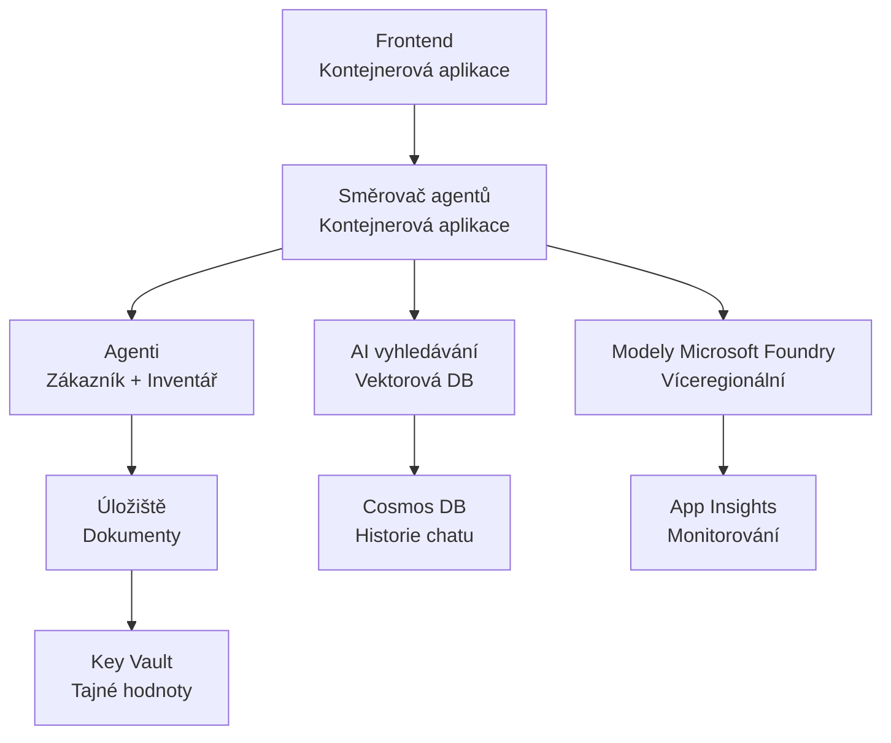

# Retail víceagentní řešení - šablona infrastruktury

**Kapitola 5: Balík nasazení do produkce**
- **📚 Domov kurzu**: [AZD For Beginners](../../README.md)
- **📖 Související kapitola**: [Kapitola 5: Víceagentní AI řešení](../../README.md#-chapter-5-multi-agent-ai-solutions-advanced)
- **📝 Průvodce scénářem**: [Kompletní architektura](../retail-scenario.md)
- **🎯 Rychlé nasazení**: [Jedním kliknutím](#-quick-deployment)

> **⚠️ POUZE ŠABLONA INFRASTRUKTURY**  
> Tato ARM šablona nasazuje **Azure zdroje** pro víceagentní systém.  
>  
> **Co se nasadí (15-25 minut):**
> - ✅ Microsoft Foundry Models (gpt-4.1, gpt-4.1-mini, embeddings ve 3 regionech)
> - ✅ Služba Azure AI Search (prázdná, připravená pro vytvoření indexu)
> - ✅ Container Apps (zástupné image, připravené pro váš kód)
> - ✅ Storage, Cosmos DB, Key Vault, Application Insights
>  
> **Co NENÍ zahrnuto (vyžaduje vývoj):**
> - ❌ Kód implementace agentů (Customer Agent, Inventory Agent)
> - ❌ Logika směrování a API endpointy
> - ❌ Frontend chat UI
> - ❌ Schémata vyhledávacích indexů a datové pipeline
> - ❌ **Odhadovaná doba vývoje: 80-120 hodin**
>  
> **Použijte tuto šablonu pokud:**
> - ✅ Chcete vytvořit Azure infrastrukturu pro víceagentní projekt
> - ✅ Plánujete vyvíjet implementaci agentů samostatně
> - ✅ Potřebujete základ infrastruktury připravený pro produkci
>  
> **Nepoužívejte pokud:**
> - ❌ Očekáváte okamžitě funkční víceagentní demo
> - ❌ Hledáte kompletní ukázky aplikačního kódu

## Přehled

Tento adresář obsahuje komplexní Azure Resource Manager (ARM) šablonu pro nasazení **základu infrastruktury** víceagentního zákaznického podpůrného systému. Šablona provisionuje všechny potřebné Azure služby, správně nakonfigurované a propojené, připravené pro vývoj vaší aplikace.

**Po nasazení budete mít:** Infrastrukturu Azure připravenou pro produkci  
**Pro dokončení systému potřebujete:** Kód agentů, frontend UI a konfiguraci dat (viz [Průvodce architekturou](../retail-scenario.md))

## 🎯 Co se nasadí

### Jádrová infrastruktura (stav po nasazení)

✅ **Služby Microsoft Foundry Models** (připravené pro volání API)
  - Primární region: nasazení gpt-4.1 (kapacita 20K TPM)
  - Sekundární region: nasazení gpt-4.1-mini (kapacita 10K TPM)
  - Terciární region: model pro textové embeddingy (kapacita 30K TPM)
  - Evaluační region: grader model gpt-4.1 (kapacita 15K TPM)
  - **Stav:** Plně funkční — lze okamžitě volat API

✅ **Azure AI Search** (prázdné - připraveno ke konfiguraci)
  - Vektorové vyhledávání povoleno
  - Standardní úroveň s 1 partition, 1 replikou
  - **Stav:** Služba běží, ale vyžaduje vytvoření indexu
  - **Nutná akce:** Vytvořit vyhledávací index se svým schématem

✅ **Azure Storage Account** (prázdný - připraven pro nahrávání)
  - Blob kontejnery: `documents`, `uploads`
  - Zabezpečené nastavení (pouze HTTPS, bez veřejného přístupu)
  - **Stav:** Připraven přijímat soubory
  - **Nutná akce:** Nahrajte svá produktová data a dokumenty

⚠️ **Prostředí Container Apps** (nasazeny zástupné image)
  - Aplikace routeru agentů (výchozí image nginx)
  - Frontend aplikace (výchozí image nginx)
  - Automatické škálování nakonfigurováno (0-10 instancí)
  - **Stav:** Běží zástupné kontejnery
  - **Nutná akce:** Sestavte a nasaďte své aplikace agentů

✅ **Azure Cosmos DB** (prázdné - připraveno pro data)
  - Databáze a kontejnery předkonfigurovány
  - Optimalizováno pro operace s nízkou latencí
  - TTL povoleno pro automatické čištění
  - **Stav:** Připraveno ukládat historii chatu

✅ **Azure Key Vault** (volitelné - připraveno pro ukládání tajemství)
  - Soft delete povoleno
  - RBAC nakonfigurováno pro spravované identity
  - **Stav:** Připraveno ukládat API klíče a connection stringy

✅ **Application Insights** (volitelné - monitoring aktivní)
  - Připojeno k Log Analytics pracovnímu prostoru
  - Vlastní metriky a upozornění nakonfigurovány
  - **Stav:** Připraveno přijímat telemetrii z vašich aplikací

✅ **Document Intelligence** (připraveno pro volání API)
  - S0 úroveň pro produkční zátěže
  - **Stav:** Připraveno zpracovávat nahrané dokumenty

✅ **Bing Search API** (připraveno pro volání API)
  - S1 úroveň pro vyhledávání v reálném čase
  - **Stav:** Připraveno pro webové dotazy

### Režimy nasazení

| Mode | OpenAI Capacity | Container Instances | Search Tier | Storage Redundancy | Best For |
|------|-----------------|---------------------|-------------|-------------------|----------|
| **Minimální** | 10K-20K TPM | 0-2 repliky | Základní | LRS (lokální) | Vývoj/test, učení, proof-of-concept |
| **Standardní** | 30K-60K TPM | 2-5 replik | Standardní | ZRS (zónové) | Produkce, střední provoz (<10K uživatelů) |
| **Prémiový** | 80K-150K TPM | 5-10 replik, zónově redundantní | Prémiový | GRS (geo) | Enterprise, vysoký provoz (>10K uživatelů), SLA 99,99% |

**Dopad na náklady:**
- **Minimální → Standardní:** ~4× nárůst nákladů ($100-370/mo → $420-1,450/mo)
- **Standardní → Prémiový:** ~3× nárůst nákladů ($420-1,450/mo → $1,150-3,500/mo)
- **Volba podle:** Očekávané zátěže, požadavků na SLA, rozpočtových omezení

**Plánování kapacity:**
- **TPM (tokens za minutu):** Celkově napříč všemi nasazeními modelů
- **Instance kontejnerů:** Rozsah automatického škálování (min-max replik)
- **Úroveň vyhledávání:** Ovlivňuje výkon dotazů a limity velikosti indexu

## 📋 Požadavky

### Požadované nástroje
1. **Azure CLI** (verze 2.50.0 nebo novější)
   ```bash
   az --version  # Zkontrolovat verzi
   az login      # Ověřit
   ```

2. **Aktivní Azure předplatné** s přístupem Owner nebo Contributor
   ```bash
   az account show  # Ověřit předplatné
   ```

### Požadované kvóty Azure

Před nasazením ověřte dostatečné kvóty ve vašich cílových regionech:

```bash
# Zkontrolujte dostupnost modelů Microsoft Foundry ve vašem regionu
az cognitiveservices account list-skus \
  --kind OpenAI \
  --location eastus2

# Ověřte kvótu OpenAI (příklad pro gpt-4.1)
az cognitiveservices usage list \
  --location eastus2 \
  --query "[?name.value=='OpenAI.Standard.gpt-4.1']"

# Zkontrolujte kvótu pro Container Apps
az provider show \
  --namespace Microsoft.App \
  --query "resourceTypes[?resourceType=='managedEnvironments'].locations"
```

**Minimální požadované kvóty:**
- **Microsoft Foundry Models:** 3–4 nasazení modelů napříč regiony
  - gpt-4.1: 20K TPM (tokens za minutu)
  - gpt-4.1-mini: 10K TPM
  - text-embedding-ada-002: 30K TPM
  - **Poznámka:** gpt-4.1 může mít v některých regionech čekací listinu - zkontrolujte [dostupnost modelů](https://learn.microsoft.com/azure/ai-services/openai/concepts/models)
- **Container Apps:** Spravované prostředí + 2-10 instancí kontejnerů
- **AI Search:** Standardní úroveň (Basic nestačí pro vektorové vyhledávání)
- **Cosmos DB:** Standardní přidělená propustnost

**Pokud kvóta není dostatečná:**
1. Přejděte do Azure Portal → Quotas → Request increase
2. Nebo použijte Azure CLI:
   ```bash
   az support tickets create \
     --ticket-name "OpenAI-Quota-Increase" \
     --severity "minimal" \
     --description "Request quota increase for Microsoft Foundry Models gpt-4.1 in eastus2"
   ```
3. Zvažte alternativní regiony s dostupností

## 🚀 Rychlé nasazení

### Možnost 1: Použití Azure CLI

```bash
# Naklonujte nebo stáhněte šablonové soubory
git clone <repository-url>
cd examples/retail-multiagent-arm-template

# Označte nasazovací skript jako spustitelný
chmod +x deploy.sh

# Nasadit s výchozím nastavením
./deploy.sh -g myResourceGroup

# Nasadit do produkce s prémiovými funkcemi
./deploy.sh -g myProdRG -e prod -m premium -l eastus2
```

### Možnost 2: Použití Azure Portal

[](https://portal.azure.com/#create/Microsoft.Template/uri/https%3A%2F%2Fraw.githubusercontent.com%2Fmicrosoft%2Fazd-for-beginners%2Fmain%2Fexamples%2Fretail-multiagent-arm-template%2Fazuredeploy.json)

### Možnost 3: Použití Azure CLI přímo

```bash
# Vytvořit skupinu prostředků
az group create --name myResourceGroup --location eastus2

# Nasadit šablonu
az deployment group create \
  --resource-group myResourceGroup \
  --template-file azuredeploy.json \
  --parameters azuredeploy.parameters.json
```

## ⏱️ Časová osa nasazení

### Co očekávat

| Phase | Duration | What Happens |
|-------|----------|--------------||
| **Validace šablony** | 30-60 sekund | Azure ověřuje syntaxi ARM šablony a parametry |
| **Vytvoření resource group** | 10-20 sekund | Vytvoří resource group (pokud je potřeba) |
| **Provisioning OpenAI** | 5-8 minut | Vytváří 3-4 OpenAI účty a nasazuje modely |
| **Container Apps** | 3-5 minut | Vytváří prostředí a nasazuje zástupné kontejnery |
| **Search & Storage** | 2-4 minuty | Provisionuje AI Search službu a storage účty |
| **Cosmos DB** | 2-3 minuty | Vytváří databázi a konfiguruje kontejnery |
| **Nastavení monitoringu** | 2-3 minuty | Zakládá Application Insights a Log Analytics |
| **RBAC konfigurace** | 1-2 minuty | Nakonfiguruje spravované identity a oprávnění |
| **Celkové nasazení** | **15-25 minut** | Kompletní infrastruktura připravena |

**Po nasazení:**
- ✅ **Infrastruktura připravena:** Všechny Azure služby provisionovány a běží
- ⏱️ **Vývoj aplikace:** 80-120 hodin (vaše odpovědnost)
- ⏱️ **Konfigurace indexu:** 15-30 minut (vyžaduje vaše schéma)
- ⏱️ **Nahrání dat:** Záleží na velikosti datasetu
- ⏱️ **Testování & validace:** 2-4 hodiny

---

## ✅ Ověření úspěšnosti nasazení

### Krok 1: Zkontrolujte provisioning zdrojů (2 minuty)

```bash
# Ověřte, že všechny prostředky byly úspěšně nasazeny.
az resource list \
  --resource-group myResourceGroup \
  --query "[?provisioningState!='Succeeded'].{Name:name, Status:provisioningState, Type:type}" \
  --output table
```

**Očekáváno:** Prázdná tabulka (všechny zdroje ukazují stav "Succeeded")

### Krok 2: Ověřte nasazení Microsoft Foundry Models (3 minuty)

```bash
# Vypsat všechny účty OpenAI
az cognitiveservices account list \
  --resource-group myResourceGroup \
  --query "[?kind=='OpenAI'].{Name:name, Location:location, Status:properties.provisioningState}" \
  --output table

# Zkontrolovat nasazení modelů pro primární region
OPENAI_NAME=$(az cognitiveservices account list \
  --resource-group myResourceGroup \
  --query "[?kind=='OpenAI'] | [0].name" -o tsv)

az cognitiveservices account deployment list \
  --name $OPENAI_NAME \
  --resource-group myResourceGroup \
  --output table
```

**Očekáváno:** 
- 3-4 OpenAI účty (primární, sekundární, terciární, evaluační regiony)
- 1-2 nasazení modelů na účet (gpt-4.1, gpt-4.1-mini, text-embedding-ada-002)

### Krok 3: Otestujte koncové body infrastruktury (5 minut)

```bash
# Získat URL adresy Container App
az containerapp list \
  --resource-group myResourceGroup \
  --query "[].{Name:name, URL:properties.configuration.ingress.fqdn, Status:properties.runningStatus}" \
  --output table

# Otestovat koncový bod routeru (odpoví zástupný obrázek)
ROUTER_URL=$(az containerapp show \
  --name retail-router \
  --resource-group myResourceGroup \
  --query "properties.configuration.ingress.fqdn" -o tsv)

echo "Testing: https://$ROUTER_URL"
curl -I https://$ROUTER_URL || echo "Container running (placeholder image - expected)"
```

**Očekáváno:** 
- Container Apps ukazují stav "Running"
- Zástupný nginx odpovídá s HTTP 200 nebo 404 (aplikační kód zatím není nasazen)

### Krok 4: Ověřte přístup k API Microsoft Foundry Models (3 minuty)

```bash
# Získat koncový bod a klíč OpenAI
OPENAI_ENDPOINT=$(az cognitiveservices account show \
  --name $OPENAI_NAME \
  --resource-group myResourceGroup \
  --query "properties.endpoint" -o tsv)

OPENAI_KEY=$(az cognitiveservices account keys list \
  --name $OPENAI_NAME \
  --resource-group myResourceGroup \
  --query "key1" -o tsv)

# Otestovat nasazení gpt-4.1
curl "${OPENAI_ENDPOINT}openai/deployments/gpt-4.1/chat/completions?api-version=2024-08-01-preview" \
  -H "Content-Type: application/json" \
  -H "api-key: $OPENAI_KEY" \
  -d '{
    "messages": [{"role": "user", "content": "Say hello"}],
    "max_tokens": 10
  }'
```

**Očekáváno:** JSON odpověď s dokončením chatu (potvrzuje funkčnost OpenAI)

### Co funguje vs. co nefunguje

**✅ Funguje po nasazení:**
- Modely Microsoft Foundry Models nasazeny a přijímají volání API
- Služba AI Search běží (prázdná, bez indexů)
- Container Apps běží (zástupné nginx image)
- Storage účty přístupné a připravené k nahrávání
- Cosmos DB připraveno pro operace s daty
- Application Insights sbírá telemetrii infrastruktury
- Key Vault připraven pro ukládání tajemství

**❌ Ještě nefunkční (vyžaduje vývoj):**
- Endpointy agentů (není nasazen aplikační kód)
- Funkčnost chatu (vyžaduje frontend + backend implementaci)
- Dotazy do vyhledávání (není vytvořen vyhledávací index)
- Pipeline zpracování dokumentů (data nejsou nahraná)
- Vlastní telemetrie (vyžaduje instrumentaci aplikace)

**Další kroky:** Viz [Post-Deployment Configuration](#-post-deployment-next-steps) pro vývoj a nasazení vaší aplikace

---

## ⚙️ Možnosti konfigurace

### Parametry šablony

| Parameter | Type | Default | Description |
|-----------|------|---------|-------------|
| `projectName` | string | "retail" | Prefix pro všechna jména zdrojů |
| `location` | string | Resource group location | Primární region nasazení |
| `secondaryLocation` | string | "westus2" | Sekundární region pro multi-region nasazení |
| `tertiaryLocation` | string | "francecentral" | Region pro embeddingy |
| `environmentName` | string | "dev" | Označení prostředí (dev/staging/prod) |
| `deploymentMode` | string | "standard" | Konfigurace nasazení (minimal/standard/premium) |
| `enableMultiRegion` | bool | true | Povolit multi-region nasazení |
| `enableMonitoring` | bool | true | Povolit Application Insights a logování |
| `enableSecurity` | bool | true | Povolit Key Vault a rozšířené zabezpečení |

### Přizpůsobení parametrů

Upravte `azuredeploy.parameters.json`:

```json
{
  "$schema": "https://schema.management.azure.com/schemas/2019-04-01/deploymentParameters.json#",
  "contentVersion": "1.0.0.0",
  "parameters": {
    "projectName": {
      "value": "mycompany"
    },
    "environmentName": {
      "value": "prod"
    },
    "deploymentMode": {
      "value": "premium"
    },
    "location": {
      "value": "eastus2"
    }
  }
}
```

## 🏗️ Přehled architektury


## 📖 Použití skriptu pro nasazení

Skript `deploy.sh` poskytuje interaktivní zážitek nasazení:

```bash
# Zobrazit nápovědu
./deploy.sh --help

# Základní nasazení
./deploy.sh -g myResourceGroup

# Pokročilé nasazení s vlastními nastaveními
./deploy.sh \
  -g myProductionRG \
  -p companyname \
  -e prod \
  -m premium \
  -l eastus2

# Vývojové nasazení bez více regionů
./deploy.sh \
  -g myDevRG \
  -e dev \
  -m minimal \
  --no-multi-region \
  --no-security
```

### Funkce skriptu

- ✅ **Validace předpokladů** (Azure CLI, stav přihlášení, soubory šablony)
- ✅ **Správa resource group** (vytvoří, pokud neexistuje)
- ✅ **Validace šablony** před nasazením
- ✅ **Sledování průběhu** s barevným výstupem
- ✅ **Výstupy nasazení** zobrazovány
- ✅ **Pokyny po nasazení**

## 📊 Sledování nasazení

### Zkontrolujte stav nasazení

```bash
# Seznam nasazení
az deployment group list --resource-group myResourceGroup --output table

# Zobrazit podrobnosti nasazení
az deployment group show \
  --resource-group myResourceGroup \
  --name retail-deployment-YYYYMMDD-HHMMSS

# Sledovat průběh nasazení
az deployment group create \
  --resource-group myResourceGroup \
  --template-file azuredeploy.json \
  --parameters azuredeploy.parameters.json \
  --verbose
```

### Výstupy nasazení

Po úspěšném nasazení jsou dostupné následující výstupy:

- **Frontend URL**: Veřejný endpoint pro webové rozhraní
- **Router URL**: API endpoint pro router agentů
- **OpenAI Endpoints**: Primární a sekundární koncové body služby OpenAI
- **Search Service**: Endpoint služby Azure AI Search
- **Storage Account**: Název storage účtu pro dokumenty
- **Key Vault**: Název Key Vault (pokud povoleno)
- **Application Insights**: Název monitorovací služby (pokud povoleno)

## 🔧 Po nasazení: Další kroky
> **📝 Důležité:** Infrastruktura je nasazena, ale musíte vyvinout a nasadit kód aplikace.

### Fáze 1: Vyvinout agentní aplikace (vaše odpovědnost)

Šablona ARM vytvoří **prázdné Container Apps** se zástupnými nginx obrazy. Musíte:

**Požadovaný vývoj:**
1. **Implementace agentů** (30-40 hodin)
   - Agent zákaznické podpory s integrací gpt-4.1
   - Agent správy zásob s integrací gpt-4.1-mini
   - Logika směrování agentů

2. **Vývoj frontendu** (20-30 hodin)
   - Uživatelské rozhraní chatu (React/Vue/Angular)
   - Funkce nahrávání souborů
   - Zpracování a formátování odpovědí

3. **Backend služby** (12-16 hodin)
   - FastAPI nebo Express router
   - Middleware pro ověřování
   - Integrace telemetrie

**Viz:** [Průvodce architekturou](../retail-scenario.md) pro podrobné implementační vzory a příklady kódu

### Fáze 2: Konfigurace AI vyhledávacího indexu (15-30 minut)

Vytvořte vyhledávací index odpovídající vašemu datovému modelu:

```bash
# Získejte informace o vyhledávací službě
SEARCH_NAME=$(az search service list \
  --resource-group myResourceGroup \
  --query "[0].name" -o tsv)

SEARCH_KEY=$(az search admin-key show \
  --service-name $SEARCH_NAME \
  --resource-group myResourceGroup \
  --query "primaryKey" -o tsv)

# Vytvořte index podle vašeho schématu (příklad)
curl -X POST "https://${SEARCH_NAME}.search.windows.net/indexes?api-version=2023-11-01" \
  -H "Content-Type: application/json" \
  -H "api-key: ${SEARCH_KEY}" \
  -d '{
    "name": "products",
    "fields": [
      {"name": "id", "type": "Edm.String", "key": true},
      {"name": "title", "type": "Edm.String", "searchable": true},
      {"name": "content", "type": "Edm.String", "searchable": true},
      {"name": "category", "type": "Edm.String", "filterable": true},
      {"name": "content_vector", "type": "Collection(Edm.Single)", 
       "searchable": true, "dimensions": 1536, "vectorSearchProfile": "default"}
    ],
    "vectorSearch": {
      "algorithms": [{"name": "default", "kind": "hnsw"}],
      "profiles": [{"name": "default", "algorithm": "default"}]
    }
  }'
```

**Zdroje:**
- [Návrh schématu AI vyhledávacího indexu](https://learn.microsoft.com/azure/search/search-what-is-an-index)
- [Konfigurace vyhledávání vektorů](https://learn.microsoft.com/azure/search/vector-search-how-to-create-index)

### Fáze 3: Nahrajte svá data (doba se liší)

Jakmile budete mít data o produktech a dokumenty:

```bash
# Získat podrobnosti o účtu úložiště
STORAGE_NAME=$(az storage account list \
  --resource-group myResourceGroup \
  --query "[0].name" -o tsv)

STORAGE_KEY=$(az storage account keys list \
  --account-name $STORAGE_NAME \
  --resource-group myResourceGroup \
  --query "[0].value" -o tsv)

# Nahrajte své dokumenty
az storage blob upload-batch \
  --destination documents \
  --source /path/to/your/product/docs \
  --account-name $STORAGE_NAME \
  --account-key $STORAGE_KEY

# Příklad: Nahrání jednoho souboru
az storage blob upload \
  --container-name documents \
  --name "product-manual.pdf" \
  --file /path/to/product-manual.pdf \
  --account-name $STORAGE_NAME \
  --account-key $STORAGE_KEY
```

### Fáze 4: Sestavte a nasadte své aplikace (8-12 hodin)

Jakmile vyvinete kód agentů:

```bash
# 1. Vytvořte Azure Container Registry (pokud je to potřeba)
az acr create \
  --name myregistry \
  --resource-group myResourceGroup \
  --sku Basic

# 2. Sestavte a nahrajte obraz směrovače agenta
docker build -t myregistry.azurecr.io/agent-router:v1 /path/to/your/router/code
az acr login --name myregistry
docker push myregistry.azurecr.io/agent-router:v1

# 3. Sestavte a nahrajte obraz frontendu
docker build -t myregistry.azurecr.io/frontend:v1 /path/to/your/frontend/code
docker push myregistry.azurecr.io/frontend:v1

# 4. Aktualizujte Container Apps pomocí vašich obrazů
az containerapp update \
  --name retail-router \
  --resource-group myResourceGroup \
  --image myregistry.azurecr.io/agent-router:v1

az containerapp update \
  --name retail-frontend \
  --resource-group myResourceGroup \
  --image myregistry.azurecr.io/frontend:v1

# 5. Nakonfigurujte proměnné prostředí
az containerapp update \
  --name retail-router \
  --resource-group myResourceGroup \
  --set-env-vars \
    OPENAI_ENDPOINT=secretref:openai-endpoint \
    OPENAI_KEY=secretref:openai-key \
    SEARCH_ENDPOINT=secretref:search-endpoint \
    SEARCH_KEY=secretref:search-key
```

### Fáze 5: Otestujte svou aplikaci (2-4 hodiny)

```bash
# Získejte adresu URL vaší aplikace
ROUTER_URL=$(az containerapp show \
  --name retail-router \
  --resource-group myResourceGroup \
  --query "properties.configuration.ingress.fqdn" -o tsv)

# Otestujte koncový bod agenta (jakmile bude váš kód nasazen)
curl -X POST "https://${ROUTER_URL}/chat" \
  -H "Content-Type: application/json" \
  -d '{
    "message": "Hello, I need help with my order",
    "agent": "customer"
  }'

# Zkontrolujte protokoly aplikace
az containerapp logs show \
  --name retail-router \
  --resource-group myResourceGroup \
  --follow
```

### Implementační zdroje

**Architektura a návrh:**
- 📖 [Kompletní průvodce architekturou](../retail-scenario.md) - Podrobné implementační vzory
- 📖 [Vzorové návrhy pro více agentů](https://learn.microsoft.com/azure/architecture/ai-ml/guide/multi-agent-systems)

**Příklady kódu:**
- 🔗 [Microsoft Foundry Models Chat Sample](https://github.com/Azure-Samples/azure-search-openai-demo) - RAG vzor
- 🔗 [Semantic Kernel](https://github.com/microsoft/semantic-kernel) - Agentní framework (C#)
- 🔗 [LangChain Azure](https://github.com/langchain-ai/langchain) - Orchestrace agentů (Python)
- 🔗 [AutoGen](https://github.com/microsoft/autogen) - Konverzace více agentů

**Odhadovaná celková náročnost:**
- Nasazení infrastruktury: 15-25 minut (✅ Dokončeno)
- Vývoj aplikace: 80-120 hodin (🔨 Vaše práce)
- Testování a optimalizace: 15-25 hodin (🔨 Vaše práce)

## 🛠️ Řešení problémů

### Běžné problémy

#### 1. Překročena kvóta Microsoft Foundry Models

```bash
# Zkontrolovat aktuální využití kvóty
az cognitiveservices usage list --location eastus2

# Požádat o zvýšení kvóty
az support tickets create \
  --ticket-name "OpenAI-Quota-Increase" \
  --severity "minimal" \
  --description "Request quota increase for Microsoft Foundry Models in region X"
```

#### 2. Nasazení Container Apps selhalo

```bash
# Zkontrolujte logy kontejnerové aplikace
az containerapp logs show \
  --name retail-router \
  --resource-group myResourceGroup \
  --follow

# Restartujte kontejnerovou aplikaci
az containerapp revision restart \
  --name retail-router \
  --resource-group myResourceGroup
```

#### 3. Inicializace služby Search

```bash
# Ověřit stav vyhledávací služby
az search service show \
  --name <search-service-name> \
  --resource-group myResourceGroup

# Ověřit připojení k vyhledávací službě
curl -X GET "https://<search-service-name>.search.windows.net/indexes?api-version=2023-11-01" \
  -H "api-key: <search-admin-key>"
```

### Validace nasazení

```bash
# Ověřit, že všechny zdroje byly vytvořeny
az resource list \
  --resource-group myResourceGroup \
  --output table

# Zkontrolovat stav zdroje
az resource list \
  --resource-group myResourceGroup \
  --query "[?provisioningState!='Succeeded'].{Name:name, Status:provisioningState, Type:type}" \
  --output table
```

## 🔐 Bezpečnostní aspekty

### Správa klíčů
- Všechna tajemství jsou uložena v Azure Key Vault (pokud je povoleno)
- Container apps používají spravovanou identitu pro ověřování
- Účty úložiště mají bezpečné výchozí nastavení (pouze HTTPS, bez veřejného přístupu k blobům)

### Síťová bezpečnost
- Container apps používají interní síťování, kde je to možné
- Služba Search nakonfigurována s možností privátních koncových bodů
- Cosmos DB nakonfigurováno s minimálními nezbytnými oprávněními

### Konfigurace RBAC
```bash
# Přiřaďte potřebné role spravované identitě
az role assignment create \
  --assignee <container-app-managed-identity> \
  --role "Cognitive Services OpenAI User" \
  --scope <openai-resource-id>
```

## 💰 Optimalizace nákladů

### Odhad nákladů (měsíčně, USD)

| Mode | OpenAI | Container Apps | Search | Storage | Total Est. |
|------|--------|----------------|--------|---------|------------|
| Minimizovaný | $50-200 | $20-50 | $25-100 | $5-20 | $100-370 |
| Standardní | $200-800 | $100-300 | $100-300 | $20-50 | $420-1450 |
| Prémiový | $500-2000 | $300-800 | $300-600 | $50-100 | $1150-3500 |

### Monitorování nákladů

```bash
# Nastavit upozornění na rozpočet
az consumption budget create \
  --account-name <subscription-id> \
  --budget-name "retail-budget" \
  --amount 500 \
  --time-grain Monthly \
  --start-date 2024-01-01 \
  --end-date 2024-12-31
```

## 🔄 Aktualizace a údržba

### Aktualizace šablon
- Verzujte soubory ARM šablon
- Nejdříve otestujte změny ve vývojovém prostředí
- Pro aktualizace používejte režim inkrementálního nasazení

### Aktualizace prostředků
```bash
# Aktualizujte s novými parametry
az deployment group create \
  --resource-group myResourceGroup \
  --template-file azuredeploy.json \
  --parameters azuredeploy.parameters.json \
  --mode Incremental
```

### Zálohování a obnova
- Automatické zálohování Cosmos DB je povoleno
- Funkce soft delete v Key Vault je povolena
- Revize container aplikací jsou uchovávány pro obnovení

## 📞 Podpora

- **Problémy se šablonou**: [GitHub Issues](https://github.com/microsoft/azd-for-beginners/issues)
- **Portál podpory Azure**: [Azure Support Portal](https://portal.azure.com/#blade/Microsoft_Azure_Support/HelpAndSupportBlade)
- **Komunita**: [Azure AI Discord](https://discord.gg/microsoft-azure)

---

**⚡ Připraveno nasadit vaše multiagentní řešení?**

Začněte s: `./deploy.sh -g myResourceGroup`

---

<!-- CO-OP TRANSLATOR DISCLAIMER START -->
**Prohlášení o vyloučení odpovědnosti**:
Tento dokument byl přeložen s využitím AI překladatelské služby [Co-op Translator](https://github.com/Azure/co-op-translator). I když usilujeme o přesnost, mějte prosím na paměti, že automatické překlady mohou obsahovat chyby nebo nepřesnosti. Původní dokument v jeho rodném jazyce by měl být považován za autoritativní zdroj. Pro kritické informace se doporučuje profesionální lidský překlad. Nejsme odpovědní za jakékoli nedorozumění nebo chybné interpretace vyplývající z použití tohoto překladu.
<!-- CO-OP TRANSLATOR DISCLAIMER END -->