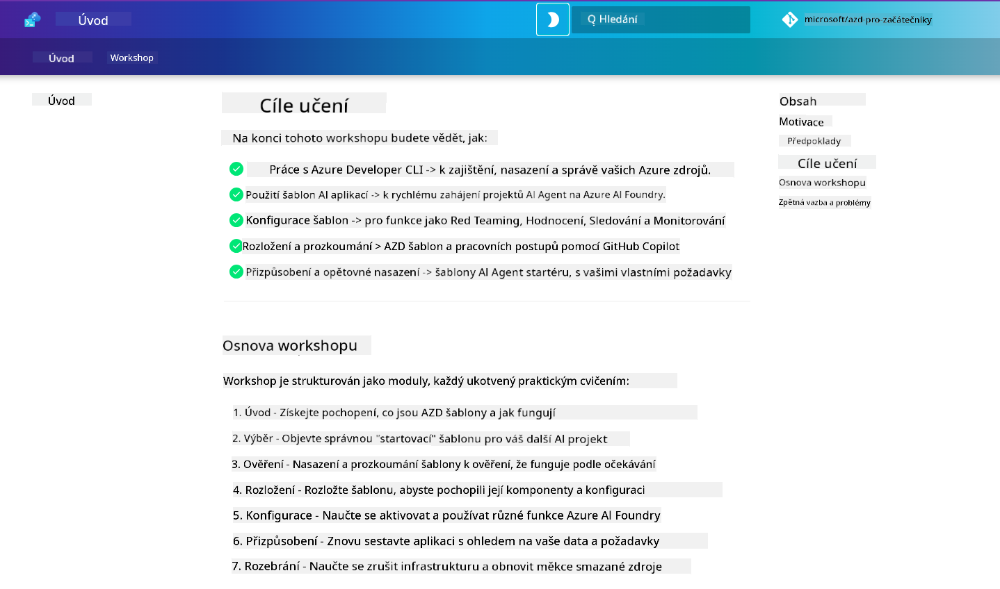

<!--
CO_OP_TRANSLATOR_METADATA:
{
  "original_hash": "9cc966416ab431c38b2ab863884b196c",
  "translation_date": "2025-09-25T00:55:32+00:00",
  "source_file": "workshop/README.md",
  "language_code": "cs"
}
-->
# AZD pro workshop vývojářů AI

Vítejte v praktickém workshopu zaměřeném na Azure Developer CLI (AZD) s důrazem na nasazení AI aplikací. Tento workshop vám pomůže získat praktické znalosti o šablonách AZD ve 3 krocích:

1. **Objevování** - najděte šablonu, která vám vyhovuje.
1. **Nasazení** - nasazení a ověření funkčnosti.
1. **Přizpůsobení** - upravte a iterujte, aby byla šablona vaše!

Během tohoto workshopu budete také seznámeni s klíčovými nástroji a pracovními postupy pro vývojáře, které vám pomohou zefektivnit celý proces vývoje.

<br/>

## Průvodce v prohlížeči

Lekce workshopu jsou napsány v Markdownu. Můžete je procházet přímo na GitHubu - nebo spustit náhled v prohlížeči, jak je ukázáno na obrázku níže.



Pro použití této možnosti - vytvořte si fork repozitáře do svého profilu a spusťte GitHub Codespaces. Jakmile bude terminál VS Code aktivní, zadejte tento příkaz:

```bash title="" linenums="0"
mkdocs serve > /dev/null 2>&1 &
```

Během několika sekund se zobrazí dialogové okno. Vyberte možnost `Otevřít v prohlížeči`. Průvodce v prohlížeči se nyní otevře v nové záložce prohlížeče. Některé výhody tohoto náhledu:

1. **Vestavěné vyhledávání** - rychle najděte klíčová slova nebo lekce.
1. **Ikona kopírování** - najeďte na bloky kódu a zobrazí se tato možnost.
1. **Přepínání motivů** - přepínejte mezi tmavým a světlým motivem.
1. **Získejte pomoc** - klikněte na ikonu Discordu v zápatí a připojte se!

<br/>

## Přehled workshopu

**Délka:** 3-4 hodiny  
**Úroveň:** Začátečník až středně pokročilý  
**Předpoklady:** Znalost Azure, konceptů AI, VS Code a nástrojů příkazového řádku.

Tento workshop je praktický, učíte se přímo při práci. Po dokončení cvičení doporučujeme projít si kurikulum AZD pro začátečníky, abyste pokračovali ve své vzdělávací cestě v oblasti bezpečnosti a produktivity.

| Čas | Modul  | Cíl |
|:---|:---|:---|
| 15 min | [Úvod](docs/instructions/0-Introduction.md) | Nastavení, pochopení cílů |
| 30 min | [Výběr AI šablony](docs/instructions/1-Select-AI-Template.md) | Prozkoumejte možnosti a vyberte startovací šablonu | 
| 30 min | [Ověření AI šablony](docs/instructions/2-Validate-AI-Template.md) | Nasazení výchozího řešení na Azure |
| 30 min | [Rozbor AI šablony](docs/instructions/3-Deconstruct-AI-Template.md) | Prozkoumejte strukturu a konfiguraci |
| 30 min | [Konfigurace AI šablony](docs/instructions/4-Configure-AI-Template.md) | Aktivujte a vyzkoušejte dostupné funkce |
| 30 min | [Přizpůsobení AI šablony](docs/instructions/5-Customize-AI-Template.md) | Přizpůsobte šablonu svým potřebám |
| 30 min | [Odstranění infrastruktury](docs/instructions/6-Teardown-Infrastructure.md) | Vyčištění a uvolnění zdrojů |
| 15 min | [Závěr a další kroky](docs/instructions/7-Wrap-up.md) | Zdroje pro učení, výzva workshopu |

<br/>

## Co se naučíte

Šablonu AZD si představte jako učební prostředí, kde můžete prozkoumat různé schopnosti a nástroje pro kompletní vývoj na Azure AI Foundry. Na konci workshopu byste měli mít intuitivní představu o různých nástrojích a konceptech v tomto kontextu.

| Koncept  | Cíl |
|:---|:---|
| **Azure Developer CLI** | Pochopte příkazy a pracovní postupy nástroje |
| **Šablony AZD**| Pochopte strukturu projektu a konfiguraci |
| **Azure AI Agent**| Zřizování a nasazení projektu Azure AI Foundry |
| **Azure AI Search**| Aktivace kontextového inženýrství s agenty |
| **Pozorovatelnost**| Prozkoumejte trasování, monitorování a hodnocení |
| **Red Teaming**| Prozkoumejte testování odolnosti a zmírňování rizik |

<br/>

## Struktura workshopu

Workshop je strukturován tak, aby vás provedl cestou od objevení šablony, přes nasazení, rozbor a přizpůsobení - s využitím oficiální startovací šablony [Getting Started with AI Agents](https://github.com/Azure-Samples/get-started-with-ai-agents).

### [Modul 1: Výběr AI šablony](docs/instructions/1-Select-AI-Template.md) (30 min)

- Co jsou AI šablony?
- Kde najdu AI šablony?
- Jak začít s budováním AI agentů?
- **Lab**: Rychlý start s GitHub Codespaces

### [Modul 2: Ověření AI šablony](docs/instructions/2-Validate-AI-Template.md) (30 min)

- Jaká je architektura AI šablony?
- Jaký je vývojový pracovní postup AZD?
- Jak získat pomoc s vývojem AZD?
- **Lab**: Nasazení a ověření šablony AI agentů

### [Modul 3: Rozbor AI šablony](docs/instructions/3-Deconstruct-AI-Template.md) (30 min)

- Prozkoumejte své prostředí v `.azure/` 
- Prozkoumejte nastavení zdrojů v `infra/` 
- Prozkoumejte konfiguraci AZD v `azure.yaml`
- **Lab**: Úprava proměnných prostředí a opětovné nasazení

### [Modul 4: Konfigurace AI šablony](docs/instructions/4-Configure-AI-Template.md) (30 min)
- Prozkoumejte: Retrieval Augmented Generation
- Prozkoumejte: Hodnocení agentů a Red Teaming
- Prozkoumejte: Trasování a monitorování
- **Lab**: Prozkoumejte AI agenta + pozorovatelnost 

### [Modul 5: Přizpůsobení AI šablony](docs/instructions/5-Customize-AI-Template.md) (30 min)
- Definujte: PRD se scénářovými požadavky
- Konfigurujte: Proměnné prostředí pro AZD
- Implementujte: Lifecycle Hooks pro další úkoly
- **Lab**: Přizpůsobení šablony pro můj scénář

### [Modul 6: Odstranění infrastruktury](docs/instructions/6-Teardown-Infrastructure.md) (30 min)
- Rekapitulace: Co jsou šablony AZD?
- Rekapitulace: Proč používat Azure Developer CLI?
- Další kroky: Vyzkoušejte jinou šablonu!
- **Lab**: Zrušení infrastruktury a vyčištění

<br/>

## Výzva workshopu

Chcete se sami vyzvat k dalšímu učení? Zde jsou některé návrhy projektů - nebo nám sdílejte své vlastní nápady!!

| Projekt | Popis |
|:---|:---|
|1. **Rozbor komplexní AI šablony** | Použijte pracovní postupy a nástroje, které jsme popsali, a zkuste nasadit, ověřit a přizpůsobit jinou šablonu AI řešení. _Co jste se naučili?_|
|2. **Přizpůsobení podle vašeho scénáře**  | Zkuste napsat PRD (Product Requirements Document) pro jiný scénář. Poté použijte GitHub Copilot ve svém repozitáři šablony v Agent Model - a požádejte ho, aby vám vygeneroval pracovní postup přizpůsobení. _Co jste se naučili? Jak byste mohli tyto návrhy zlepšit?_|
| | |

## Máte zpětnou vazbu?

1. Vytvořte issue v tomto repozitáři - označte ho `Workshop` pro snadné vyhledání.
1. Připojte se na Discord Azure AI Foundry - spojte se se svými kolegy!

| | | 
|:---|:---|
| **📚 Domov kurzu**| [AZD pro začátečníky](../README.md)|
| **📖 Dokumentace** | [Začínáme s AI šablonami](https://learn.microsoft.com/en-us/azure/ai-foundry/how-to/develop/ai-template-get-started)|
| **🛠️AI šablony** | [Šablony Azure AI Foundry](https://ai.azure.com/templates) |
|**🚀 Další kroky** | [Přijměte výzvu](../../../workshop) |
| | |

<br/>

---

**Předchozí:** [Průvodce řešením problémů AI](../docs/troubleshooting/ai-troubleshooting.md) | **Další:** Začněte s [Lab 1: Základy AZD](../../../workshop/lab-1-azd-basics)

**Připraveni začít budovat AI aplikace s AZD?**

[Začněte Lab 1: Základy AZD →](./lab-1-azd-basics/README.md)

---

