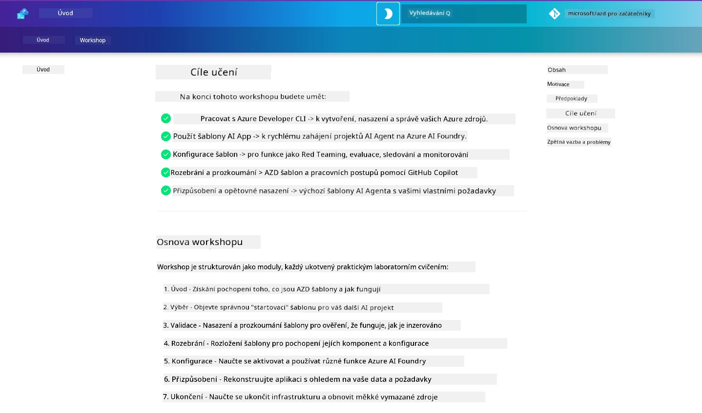

<div align="center">
  <div style="background: linear-gradient(135deg, #0078d4, #106ebe); border-radius: 10px; padding: 20px; margin: 20px 0; box-shadow: 0 4px 15px rgba(0, 120, 212, 0.3); border: 2px solid #005a9e;">
    <h2 style="color: white; margin: 0; font-size: 24px; text-shadow: 1px 1px 2px rgba(0,0,0,0.3);">
      🎯 Workshop AZD pro vývojáře AI
    </h2>
    <p style="color: white; margin: 10px 0 0 0; font-size: 16px; text-shadow: 1px 1px 2px rgba(0,0,0,0.3);">
      <strong>Praktický workshop pro vytváření AI aplikací pomocí Azure Developer CLI.</strong><br>
      Projděte 7 modulů a zvládněte šablony AZD a pracovní postupy nasazení AI.
    </p>
    <div style="margin-top: 15px;">
      <span style="background: rgba(255,255,255,0.2); padding: 5px 10px; border-radius: 15px; color: white; font-size: 14px;">
        📅 Poslední aktualizace: únor 2026
      </span>
    </div>
  </div>
</div>

# Workshop AZD pro vývojáře AI

Vítejte v praktickém workshopu zaměřeném na výuku Azure Developer CLI (AZD) s důrazem na nasazení AI aplikací. Tento workshop vám pomůže získat praktické pochopení šablon AZD ve 3 krocích:

1. **Objevování** - najděte šablonu, která vám vyhovuje.
1. **Nasazení** - nasadit a ověřit, že funguje
1. **Přizpůsobení** - upravujte a iterujte, aby byla podle vás!

Během tohoto workshopu se také seznámíte se základními nástroji a pracovními postupy pro vývojáře, které vám pomohou zefektivnit váš end-to-end vývojový proces.

<br/>

## Průvodce v prohlížeči

Lekce workshopu jsou v Markdownu. Můžete je procházet přímo na GitHubu - nebo spustit náhled v prohlížeči, jak je ukázáno na snímku obrazovky níže.



Chcete-li tuto možnost použít - forknete repozitář do svého profilu a spusťte GitHub Codespaces. Jakmile bude terminál VS Code aktivní, zadejte tento příkaz:

```bash title="" linenums="0"
mkdocs serve > /dev/null 2>&1 &
```

Za pár sekund se zobrazí vyskakovací dialog. Vyberte možnost `Open in browser`. Webový průvodce se nyní otevře v nové záložce prohlížeče. Některé výhody tohoto náhledu:

1. **Vestavěné vyhledávání** - rychle najděte klíčová slova nebo lekce.
1. **Ikona kopírování** - přesuňte kurzor nad bloky kódu, abyste tuto možnost viděli
1. **Přepínač tématu** - přepínejte mezi tmavým a světlým motivem
1. **Získejte pomoc** - klikněte na ikonu Discordu v patičce pro připojení!

<br/>

## Přehled workshopu

**Doba trvání:** 3–4 hodiny  
**Úroveň:** Začátečník až středně pokročilý  
**Předpoklady:** Znalost Azure, konceptů AI, VS Code a nástrojů příkazového řádku.

Toto je praktický workshop, kde se učíte přímo při práci. Po dokončení cvičení doporučujeme projít si kurz AZD For Beginners, abyste pokračovali ve vzdělávání v oblasti bezpečnosti a osvědčených postupů produktivity.

| Čas| Modul  | Cíl |
|:---|:---|:---|
| 15 mins | [Úvod](docs/instructions/0-Introduction.md) | Nastavit scénu, pochopit cíle |
| 30 mins | [Vybrat AI šablonu](docs/instructions/1-Select-AI-Template.md) | Prozkoumejte možnosti a vyberte startovací šablonu | 
| 30 mins | [Ověřit AI šablonu](docs/instructions/2-Validate-AI-Template.md) | Nasadit výchozí řešení do Azure |
| 30 mins | [Rozebrat AI šablonu](docs/instructions/3-Deconstruct-AI-Template.md) | Prozkoumat strukturu a konfiguraci |
| 30 mins | [Konfigurovat AI šablonu](docs/instructions/4-Configure-AI-Template.md) | Aktivovat a vyzkoušet dostupné funkce |
| 30 mins | [Přizpůsobit AI šablonu](docs/instructions/5-Customize-AI-Template.md) | Přizpůsobit šablonu vašim potřebám |
| 30 mins | [Odstranit infrastrukturu](docs/instructions/6-Teardown-Infrastructure.md) | Uklidit a uvolnit prostředky |
| 15 mins | [Závěr & další kroky](docs/instructions/7-Wrap-up.md) | Učební materiály, výzva workshopu |

<br/>

## Co se naučíte

Považujte šablonu AZD za učební sandbox pro prozkoumání různých schopností a nástrojů pro end-to-end vývoj na Microsoft Foundry. Na konci tohoto workshopu byste měli mít intuitivní povědomí o různých nástrojích a konceptech v tomto kontextu.

| Koncept  | Cíl |
|:---|:---|
| **Azure Developer CLI** | Pochopit příkazy a pracovní postupy nástroje|
| **AZD Templates**| Pochopit strukturu projektu a konfiguraci|
| **Azure AI Agent**| Zprovisionovat a nasadit projekt Microsoft Foundry  |
| **Azure AI Search**| Umožnit kontextové inženýrství s agenty |
| **Observability**| Prozkoumat trasování, monitorování a vyhodnocování |
| **Red Teaming**| Prozkoumat adversariální testování a protiopatření |

<br/>

## Struktura workshopu

Workshop je strukturován tak, aby vás provedl od objevení šablony přes nasazení, rozebrání a přizpůsobení - s použitím oficiální výchozí šablony [Getting Started with AI Agents](https://github.com/Azure-Samples/get-started-with-ai-agents) jako základu.

### [Modul 1: Vybrat AI šablonu](docs/instructions/1-Select-AI-Template.md) (30 mins)

- Co jsou AI šablony?
- Kde mohu najít AI šablony?
- Jak mohu začít vytvářet AI agenty?
- **Cvičení**: Rychlý start s GitHub Codespaces

### [Modul 2: Ověřit AI šablonu](docs/instructions/2-Validate-AI-Template.md) (30 mins)

- Co je architektura AI šablony?
- Co je vývojový pracovní postup AZD?
- Jak mohu získat pomoc s vývojem AZD?
- **Cvičení**: Nasadit a ověřit šablonu AI Agentů

### [Modul 3: Rozebrat AI šablonu](docs/instructions/3-Deconstruct-AI-Template.md) (30 mins)

- Prozkoumejte své prostředí v `.azure/` 
- Prozkoumejte nastavení zdrojů v `infra/` 
- Prozkoumejte svou AZD konfiguraci v `azure.yaml`s
- **Cvičení**: Upravit proměnné prostředí a znovu nasadit

### [Modul 4: Konfigurovat AI šablonu](docs/instructions/4-Configure-AI-Template.md) (30 mins)
- Prozkoumat: Retrieval Augmented Generation
- Prozkoumat: Hodnocení agentů a red teaming
- Prozkoumat: Trasování a monitorování
- **Cvičení**: Prozkoumat AI agenta + observabilitu 

### [Modul 5: Přizpůsobit AI šablonu](docs/instructions/5-Customize-AI-Template.md) (30 mins)
- Definovat: PRD se scénářovými požadavky
- Konfigurovat: Proměnné prostředí pro AZD
- Implementovat: Lifecycle Hooks pro přidané úkoly
- **Cvičení**: Přizpůsobit šablonu pro můj scénář

### [Modul 6: Odstranit infrastrukturu](docs/instructions/6-Teardown-Infrastructure.md) (30 mins)
- Rekapitulace: Co jsou AZD šablony?
- Rekapitulace: Proč používat Azure Developer CLI?
- Další kroky: Vyzkoušejte jinou šablonu!
- **Cvičení**: Odprovisionovat infrastrukturu a uklidit

<br/>

## Výzva workshopu

Chcete se více vyzvat? Zde jsou některé návrhy projektů - nebo s námi sdílejte své nápady!!

| Projekt | Popis |
|:---|:---|
|1. **Rozebrat složitou AI šablonu** | Použijte pracovní postup a nástroje, které jsme nastínili, a zjistěte, zda dokážete nasadit, ověřit a přizpůsobit jinou šablonu AI řešení. _Co jste se naučili?_|
|2. **Přizpůsobit pro váš scénář**  | Zkuste napsat PRD (Product Requirements Document) pro jiný scénář. Poté použijte GitHub Copilot ve svém repozitáři šablony v Agent Model - a požádejte ho, aby pro vás vygeneroval pracovní postup přizpůsobení. _Co jste se naučili? Jak byste mohli tyto návrhy zlepšit?_|
| | |

## Máte zpětnou vazbu?

1. Založte issue v tomto repozitáři - označte jej pro přehlednost tagem `Workshop`.
1. Připojte se na Microsoft Foundry Discord - spojte se se svými kolegy!


| | | 
|:---|:---|
| **📚 Domov kurzu**| [AZD pro začátečníky](../README.md)|
| **📖 Dokumentace** | [Začínáme se šablonami AI](https://learn.microsoft.com/en-us/azure/ai-foundry/how-to/develop/ai-template-get-started)|
| **🛠️AI šablony** | [Šablony Microsoft Foundry](https://ai.azure.com/templates) |
|**🚀 Další kroky** | [Začněte workshop](../../../workshop) |
| | |

<br/>

---

**Navigace:** [Hlavní kurz](../README.md) | [Úvod](docs/instructions/0-Introduction.md) | [Modul 1: Vybrat šablonu](docs/instructions/1-Select-AI-Template.md)

**Připraveni začít vytvářet AI aplikace s AZD?**

[Začněte workshop: Úvod →](docs/instructions/0-Introduction.md)

---

<!-- CO-OP TRANSLATOR DISCLAIMER START -->
**Prohlášení o vyloučení odpovědnosti**:
Tento dokument byl přeložen pomocí AI překladatelské služby [Co-op Translator](https://github.com/Azure/co-op-translator). I když usilujeme o přesnost, mějte prosím na paměti, že automatické překlady mohou obsahovat chyby nebo nepřesnosti. Původní dokument v jeho originálním jazyce by měl být považován za autoritativní zdroj. Pro kritické informace se doporučuje profesionální lidský překlad. Nejsme odpovědní za jakákoli nedorozumění nebo chybné výklady vyplývající z použití tohoto překladu.
<!-- CO-OP TRANSLATOR DISCLAIMER END -->