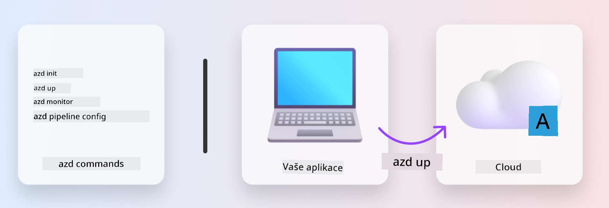
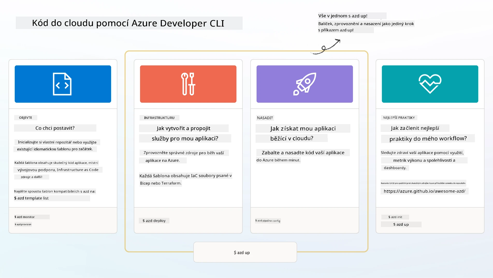

# 1. Vyberte šablonu

!!! tip "NA KONCI TOHOTO MODULU BUDETE SCHOPNI"

    - [ ] Popište, co jsou šablony AZD
    - [ ] Najděte a použijte šablony AZD pro AI
    - [ ] Začněte se šablonou AI Agents
    - [ ] **Lab 1:** Rychlý start AZD s GitHub Codespaces

---

## 1. Analogie stavitele

Vytvoření moderní AI aplikace připravené pro podnikové nasazení _od nuly_ může být skličující. Je to trochu jako stavět si nový dům sám, cihlu po cihle. Ano, jde to! Ale není to nejefektivnější způsob, jak dosáhnout požadovaného výsledku! 

Místo toho často začínáme s existujícím _návrhovým plánem_ a spolupracujeme s architektem na jeho přizpůsobení našim požadavkům. A právě to je přístup, který byste měli zvolit při vytváření inteligentních aplikací. Nejprve najděte dobrý návrhový vzor, který odpovídá vašemu problému. Poté spolupracujte s architektem řešení na přizpůsobení a vývoji řešení pro váš konkrétní scénář.

Ale kde můžeme najít tyto návrhové plány? A jak najdeme architekta, který je ochotný nám ukázat, jak tyto plány přizpůsobit a nasadit sami? V tomto workshopu na tyto otázky odpovíme představením tří technologií:

1. [Azure Developer CLI](https://aka.ms/azd) - open-source nástroj, který zrychluje cestu vývojáře od lokálního vývoje (build) k nasazení do cloudu (ship).
1. [Microsoft Foundry Templates](https://ai.azure.com/templates) - standardizované open-source repozitáře obsahující ukázkový kód, infrastrukturu a konfigurační soubory pro nasazení architektury AI řešení.
1. [GitHub Copilot Agent Mode](https://code.visualstudio.com/docs/copilot/chat/chat-agent-mode) - programovací agent založený na znalostech Azure, který nás může provést navigací v kódu a prováděním změn pomocí přirozeného jazyka.

S těmito nástroji v ruce můžeme nyní _objevit_ správnou šablonu, _nasadit_ ji, abychom ověřili, že funguje, a _přizpůsobit_ ji tak, aby vyhovovala našim konkrétním scénářům. Pojďme se do toho ponořit a naučit se, jak fungují.

---

## 2. Azure Developer CLI

The [Azure Developer CLI](https://learn.microsoft.com/en-us/azure/developer/azure-developer-cli/) (or `azd`) je open-source příkazový nástroj, který může urychlit vaši cestu od kódu k cloudu pomocí sady příkazů přívětivých pro vývojáře, které fungují konzistentně napříč vaším IDE (vývoj) a CI/CD (devops) prostředím.

S `azd` může být vaše cesta nasazení tak jednoduchá jako:

- `azd init` - Inicializuje nový AI projekt z existující šablony AZD.
- `azd up` - Zprovozní infrastrukturu a nasadí vaši aplikaci v jednom kroku.
- `azd monitor` - Získejte monitorování v reálném čase a diagnostiku pro vaši nasazenou aplikaci.
- `azd pipeline config` - Nastavte CI/CD pipeline pro automatizaci nasazení do Azure.

**🎯 | EXERCISE**: <br/> Prozkoumejte příkazový nástroj `azd` nyní ve svém prostředí GitHub Codespaces. Začněte zadáním tohoto příkazu a uvidíte, co nástroj umí:

```bash title="" linenums="0"
azd help
```



---

## 3. Šablona AZD

Aby `azd` toho dosáhl, potřebuje vědět, jakou infrastrukturu má zprovoznit, jaká konfigurační nastavení prosadit a kterou aplikaci nasadit. Zde přicházejí na scénu [AZD templates](https://learn.microsoft.com/en-us/azure/developer/azure-developer-cli/azd-templates?tabs=csharp). 

Šablony AZD jsou open-source repozitáře, které kombinují ukázkový kód s infrastrukturou a konfiguračními soubory potřebnými pro nasazení architektury řešení.
Použitím přístupu _Infrastructure-as-Code_ (IaC) umožňují, aby definice zdrojů šablony a konfigurační nastavení byly verzovány (stejně jako zdrojový kód aplikace) - čímž vznikají znovupoužitelné a konzistentní pracovní postupy napříč uživateli projektu.

Při vytváření nebo znovupoužití šablony AZD pro _váš_ scénář zvažte tyto otázky:

1. Co stavíte? → Existuje šablona, která má startovací kód pro tento scénář?
1. Jak je vaše řešení navrženo? → Existuje šablona, která obsahuje potřebné zdroje?
1. Jak se vaše řešení nasazuje? → Zvažte `azd deploy` s pre/post zpracovatelskými hooky!
1. Jak jej můžete dále optimalizovat? → Zvažte vestavěné monitorování a automatizační pipeline!

**🎯 | EXERCISE**: <br/> 
Navštivte galerii [Awesome AZD](https://azure.github.io/awesome-azd/) a použijte filtry k prozkoumání více než 250 šablon, které jsou momentálně dostupné. Podívejte se, zda najdete takovou, která odpovídá požadavkům _vašeho_ scénáře.



---

## 4. Šablony AI aplikací

Pro AI aplikace poskytuje Microsoft specializované šablony obsahující **Microsoft Foundry** a **Foundry Agents**. Tyto šablony urychlují cestu k vytváření inteligentních, do produkce připravených aplikací.

### Šablony Microsoft Foundry & Foundry Agents

Vyberte níže šablonu k nasazení. Každá šablona je dostupná na [Awesome AZD](https://azure.github.io/awesome-azd/) a může být inicializována jediným příkazem.

| Template | Description | Deploy Command |
|----------|-------------|----------------|
| **[AI Chat with RAG](https://azure.github.io/awesome-azd/?tags=ai&tags=rag)** | Chatovací aplikace s Retrieval Augmented Generation využívající Microsoft Foundry | `azd init -t azure-samples/azure-search-openai-demo` |
| **[Foundry Agent Service Starter](https://azure.github.io/awesome-azd/?tags=ai&tags=agents)** | Vytvořte AI agenty s Foundry Agents pro autonomní vykonávání úloh | `azd init -t azure-samples/foundry-agent-service-starter` |
| **[Multi-Agent Orchestration](https://azure.github.io/awesome-azd/?tags=ai&tags=agents)** | Koordinace více Foundry Agents pro složité pracovní toky | `azd init -t azure-samples/multi-agent-orchestration` |
| **[AI Document Intelligence](https://azure.github.io/awesome-azd/?tags=ai&tags=document)** | Extrahujte a analyzujte dokumenty s modely Microsoft Foundry | `azd init -t azure-samples/ai-document-processing` |
| **[Conversational AI Bot](https://azure.github.io/awesome-azd/?tags=ai&tags=bot)** | Vytvořte inteligentní chatboty s integrací Microsoft Foundry | `azd init -t azure-samples/ai-chat-protocol` |
| **[AI Image Generation](https://azure.github.io/awesome-azd/?tags=ai&tags=dalle)** | Generujte obrázky pomocí DALL-E přes Microsoft Foundry | `azd init -t azure-samples/ai-image-generation` |
| **[Semantic Kernel Agent](https://azure.github.io/awesome-azd/?tags=ai&tags=semantic-kernel)** | AI agenti používající Semantic Kernel s Foundry Agents | `azd init -t azure-samples/semantic-kernel-agent` |
| **[AutoGen Multi-Agent](https://azure.github.io/awesome-azd/?tags=ai&tags=autogen)** | Systémy s více agenty využívající framework AutoGen | `azd init -t azure-samples/autogen-multi-agent` |

### Rychlý start

1. **Prohlédněte si šablony**: Navštivte [https://azure.github.io/awesome-azd/] a použijte filtry `AI`, `Agents`, nebo `Microsoft Foundry`
2. **Vyberte šablonu**: Zvolte tu, která odpovídá vašemu použití
3. **Inicializujte**: Spusťte příkaz `azd init` pro vybranou šablonu
4. **Nasazení**: Spusťte `azd up` k zprovoznění a nasazení

**🎯 | EXERCISE**: <br/>
Vyberte jednu z výše uvedených šablon podle vašeho scénáře:

- **Stavíte chatbota?** → Začněte s **AI Chat with RAG** nebo **Conversational AI Bot**
- **Potřebujete autonomní agenty?** → Vyzkoušejte **Foundry Agent Service Starter** nebo **Multi-Agent Orchestration**
- **Zpracováváte dokumenty?** → Použijte **AI Document Intelligence**
- **Chcete asistenci při psaní kódu pomocí AI?** → Prozkoumejte **Semantic Kernel Agent** nebo **AutoGen Multi-Agent**

```bash title="Example: Deploy the AI Chat with RAG template" linenums="0"
azd init -t azure-samples/azure-search-openai-demo
azd up
```

!!! info "Prozkoumejte více šablon"
    Galerie [Awesome AZD](https://azure.github.io/awesome-azd/) obsahuje více než 250 šablon. Použijte filtry k nalezení šablon odpovídajících vašim konkrétním požadavkům na jazyk, framework a Azure služby.

---

<!-- CO-OP TRANSLATOR DISCLAIMER START -->
Prohlášení o vyloučení odpovědnosti:
Tento dokument byl přeložen pomocí AI překladatelské služby [Co-op Translator](https://github.com/Azure/co-op-translator). I když se snažíme o přesnost, mějte prosím na paměti, že automatické překlady mohou obsahovat chyby nebo nepřesnosti. Původní dokument ve zdrojovém jazyce by měl být považován za závazný. Pro důležité informace doporučujeme využít profesionální lidský překlad. Nezodpovídáme za případná nedorozumění nebo nesprávné interpretace vyplývající z použití tohoto překladu.
<!-- CO-OP TRANSLATOR DISCLAIMER END -->