<!--
CO_OP_TRANSLATOR_METADATA:
{
  "original_hash": "7816c6ec50c694c331e7c6092371be4d",
  "translation_date": "2025-09-25T02:09:59+00:00",
  "source_file": "workshop/docs/instructions/2-Validate-AI-Template.md",
  "language_code": "cs"
}
-->
# 2. Ověření šablony

!!! tip "NA KONCI TOHOTO MODULU BUDETE SCHOPNI"

    - [ ] Analyzovat architekturu AI řešení
    - [ ] Porozumět workflow nasazení pomocí AZD
    - [ ] Používat GitHub Copilot pro pomoc s používáním AZD
    - [ ] **Lab 2:** Nasadit a ověřit šablonu AI Agentů

---

## 1. Úvod

[Azure Developer CLI](https://learn.microsoft.com/en-us/azure/developer/azure-developer-cli/) nebo `azd` je open-source nástroj příkazového řádku, který zjednodušuje workflow vývojáře při vytváření a nasazování aplikací na Azure.

[AZD šablony](https://learn.microsoft.com/azure/developer/azure-developer-cli/azd-templates) jsou standardizované repozitáře, které obsahují ukázkový aplikační kód, _infrastrukturu jako kód_ a konfigurační soubory `azd` pro ucelenou architekturu řešení. Provoz infrastruktury se stává tak jednoduchým jako příkaz `azd provision` - zatímco použití `azd up` umožňuje současně zprovoznit infrastrukturu **a** nasadit vaši aplikaci.

Díky tomu může být zahájení vývoje vaší aplikace tak jednoduché, jako nalezení správné _AZD startovací šablony_, která se nejvíce blíží vašim potřebám aplikace a infrastruktury - a následné přizpůsobení repozitáře vašim požadavkům.

Než začneme, ujistěte se, že máte nainstalovaný Azure Developer CLI.

1. Otevřete terminál ve VS Code a zadejte tento příkaz:

      ```bash title="" linenums="0"
      azd version
      ```

1. Měli byste vidět něco takového!

      ```bash title="" linenums="0"
      azd version 1.19.0 (commit b3d68cea969b2bfbaa7b7fa289424428edb93e97)
      ```

**Nyní jste připraveni vybrat a nasadit šablonu pomocí azd**

---

## 2. Výběr šablony

Platforma Azure AI Foundry obsahuje [sadu doporučených AZD šablon](https://learn.microsoft.com/en-us/azure/ai-foundry/how-to/develop/ai-template-get-started), které pokrývají oblíbené scénáře řešení, jako je _automatizace workflowu s více agenty_ a _zpracování multimodálního obsahu_. Tyto šablony můžete také objevit na portálu Azure AI Foundry.

1. Navštivte [https://ai.azure.com/templates](https://ai.azure.com/templates)
1. Přihlaste se do portálu Azure AI Foundry, když budete vyzváni - uvidíte něco takového.

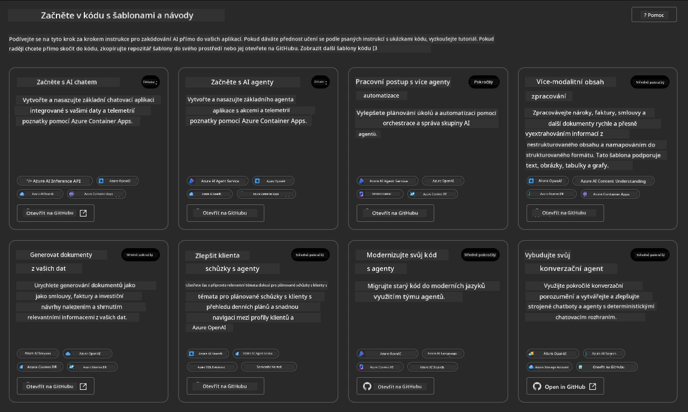

**Základní** možnosti jsou vaše startovací šablony:

1. [ ] [Začít s AI Chatem](https://github.com/Azure-Samples/get-started-with-ai-chat), která nasazuje základní chatovací aplikaci _s vašimi daty_ na Azure Container Apps. Použijte ji k prozkoumání základního scénáře AI chatbotu.
1. [X] [Začít s AI Agenty](https://github.com/Azure-Samples/get-started-with-ai-agents), která také nasazuje standardního AI Agenta (s Azure AI Agent Service). Použijte ji k seznámení s agentickými AI řešeními zahrnujícími nástroje a modely.

Navštivte druhý odkaz v novém okně prohlížeče (nebo klikněte na `Open in GitHub` na příslušné kartě). Měli byste vidět repozitář pro tuto AZD šablonu. Věnujte chvíli prozkoumání README. Architektura aplikace vypadá takto:

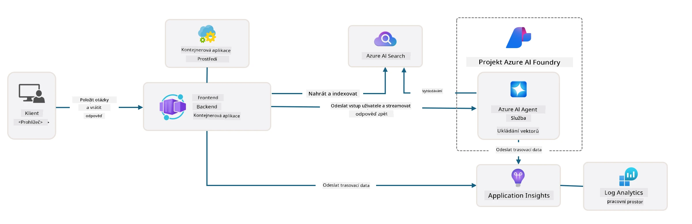

---

## 3. Aktivace šablony

Zkusme nasadit tuto šablonu a ujistit se, že je platná. Budeme postupovat podle pokynů v sekci [Začínáme](https://github.com/Azure-Samples/get-started-with-ai-agents?tab=readme-ov-file#getting-started).

1. Klikněte na [tento odkaz](https://github.com/codespaces/new/Azure-Samples/get-started-with-ai-agents) - potvrďte výchozí akci `Create codespace`
1. Otevře se nové okno prohlížeče - počkejte, až se načte relace GitHub Codespaces
1. Otevřete terminál ve VS Code v Codespaces - zadejte následující příkaz:

   ```bash title="" linenums="0"
   azd up
   ```

Dokončete kroky workflowu, které se tím spustí:

1. Budete vyzváni k přihlášení do Azure - postupujte podle pokynů k autentizaci
1. Zadejte jedinečný název prostředí - např. jsem použil `nitya-mshack-azd`
1. Tím se vytvoří složka `.azure/` - uvidíte podsložku s názvem prostředí
1. Budete vyzváni k výběru názvu předplatného - vyberte výchozí
1. Budete vyzváni k zadání lokace - použijte `East US 2`

Nyní počkejte, až se dokončí zprovoznění. **To trvá 10-15 minut**

1. Po dokončení se na vašem konzoli zobrazí zpráva o ÚSPĚCHU, jako je tato:
      ```bash title="" linenums="0"
      SUCCESS: Your up workflow to provision and deploy to Azure completed in 10 minutes 17 seconds.
      ```
1. Váš Azure Portal nyní bude mít zprovozněnou skupinu prostředků s tímto názvem prostředí:

      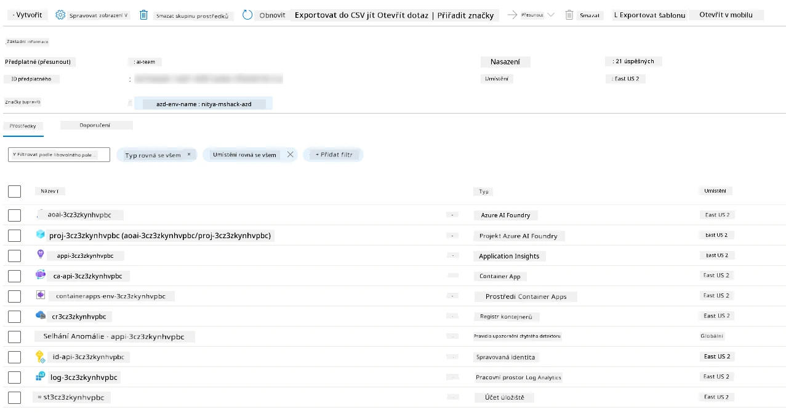

1. **Nyní jste připraveni ověřit nasazenou infrastrukturu a aplikaci**.

---

## 4. Ověření šablony

1. Navštivte stránku [Skupiny prostředků](https://portal.azure.com/#browse/resourcegroups) na Azure Portalu - přihlaste se, když budete vyzváni
1. Klikněte na RG pro název vašeho prostředí - uvidíte výše uvedenou stránku

      - klikněte na prostředek Azure Container Apps
      - klikněte na URL aplikace v sekci _Essentials_ (vpravo nahoře)

1. Měli byste vidět hostované UI aplikace, jako je toto:

   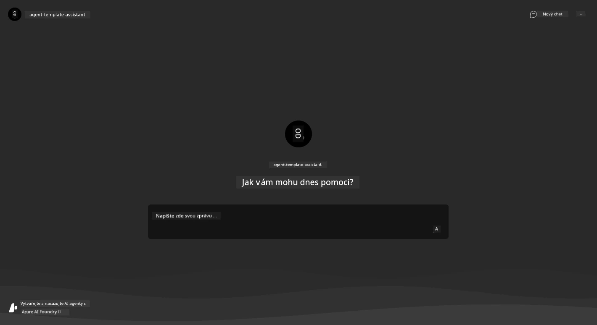

1. Zkuste položit několik [ukázkových otázek](https://github.com/Azure-Samples/get-started-with-ai-agents/blob/main/docs/sample_questions.md)

      1. Zeptejte se: ```Jaké je hlavní město Francie?``` 
      1. Zeptejte se: ```Jaký je nejlepší stan pod 200 dolarů pro dva lidi a jaké má vlastnosti?```

1. Měli byste dostat odpovědi podobné těm, které jsou uvedeny níže. _Ale jak to funguje?_ 

      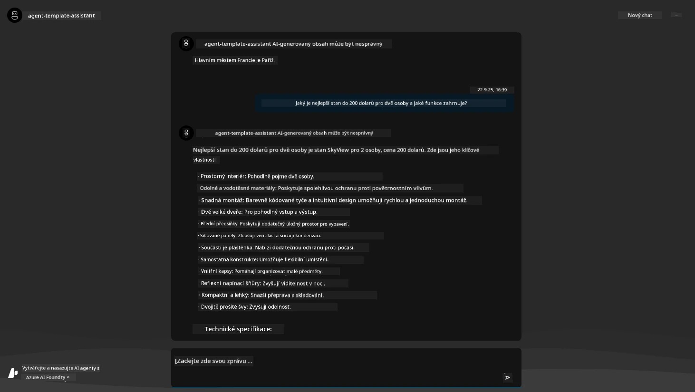

---

## 5. Ověření agenta

Azure Container App nasazuje endpoint, který se připojuje k AI Agentovi zprovozněnému v projektu Azure AI Foundry pro tuto šablonu. Podívejme se, co to znamená.

1. Vraťte se na stránku _Přehled_ na Azure Portalu pro vaši skupinu prostředků

1. Klikněte na prostředek `Azure AI Foundry` v tomto seznamu

1. Měli byste vidět toto. Klikněte na tlačítko `Go to Azure AI Foundry Portal`. 
   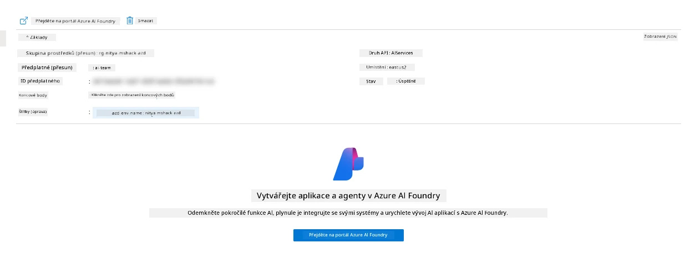

1. Měli byste vidět stránku projektu Foundry pro vaši AI aplikaci
   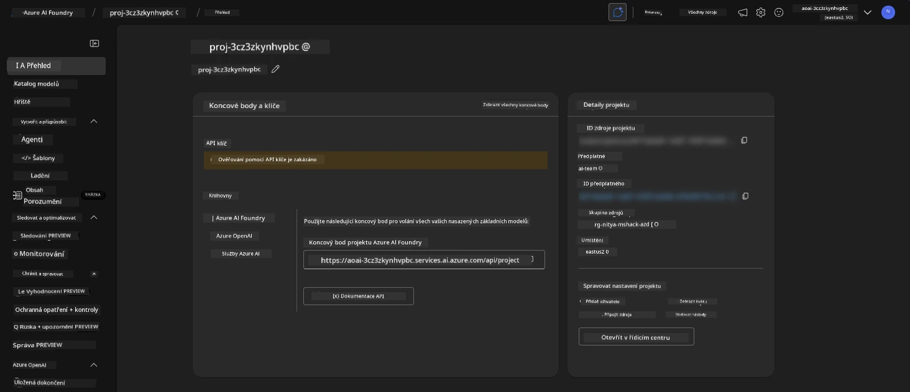

1. Klikněte na `Agents` - uvidíte výchozího Agenta zprovozněného ve vašem projektu
   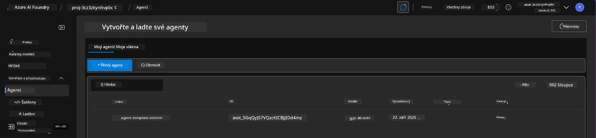

1. Vyberte ho - a uvidíte podrobnosti o Agentovi. Všimněte si následujícího:

      - Agent používá File Search jako výchozí (vždy)
      - `Knowledge` agenta ukazuje, že má nahráno 32 souborů (pro File Search)
      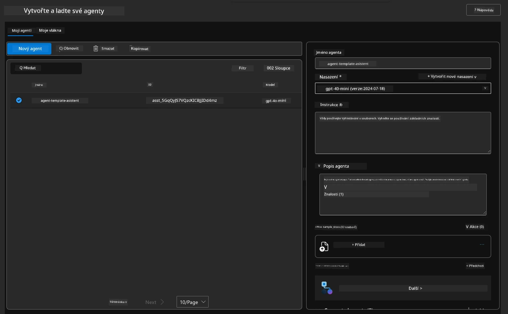

1. Vyhledejte možnost `Data+indexes` v levém menu a klikněte pro podrobnosti. 

      - Měli byste vidět 32 datových souborů nahraných pro znalosti.
      - Ty odpovídají 12 zákaznickým souborům a 20 produktovým souborům pod `src/files` 
      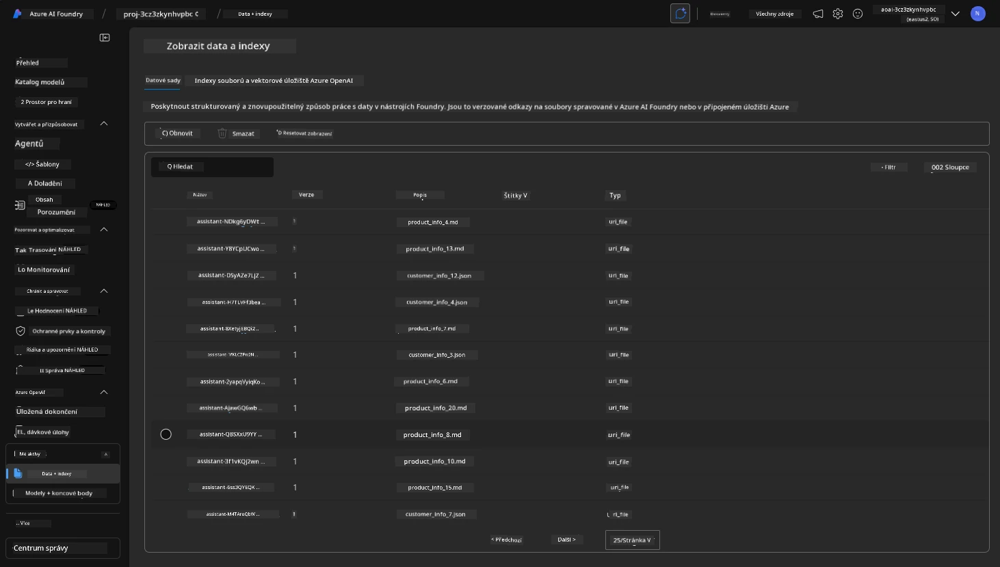

**Ověřili jste operaci agenta!** 

1. Odpovědi agenta jsou založeny na znalostech v těchto souborech. 
1. Nyní můžete klást otázky týkající se těchto dat a získávat odpovědi založené na faktech.
1. Příklad: `customer_info_10.json` popisuje 3 nákupy provedené "Amanda Perez"

Vraťte se na záložku prohlížeče s endpointem Container App a zeptejte se: `Jaké produkty vlastní Amanda Perez?`. Měli byste vidět něco takového:

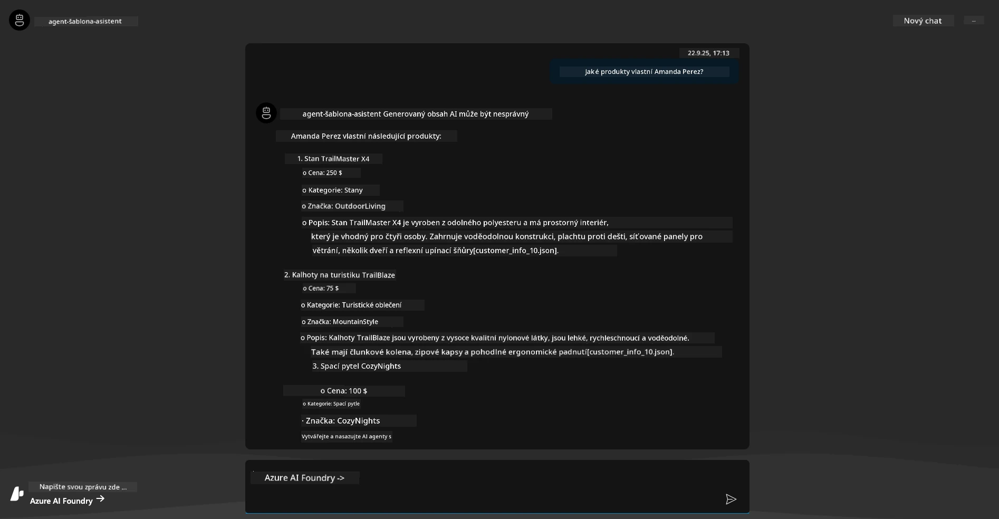

---

## 6. Hřiště pro agenty

Pojďme si vytvořit trochu více intuice pro schopnosti Azure AI Foundry tím, že si agenta vyzkoušíme na Hřišti pro agenty.

1. Vraťte se na stránku `Agents` v Azure AI Foundry - vyberte výchozího agenta
1. Klikněte na možnost `Try in Playground` - měli byste dostat UI Hřiště jako toto
1. Zeptejte se na stejnou otázku: `Jaké produkty vlastní Amanda Perez?`

    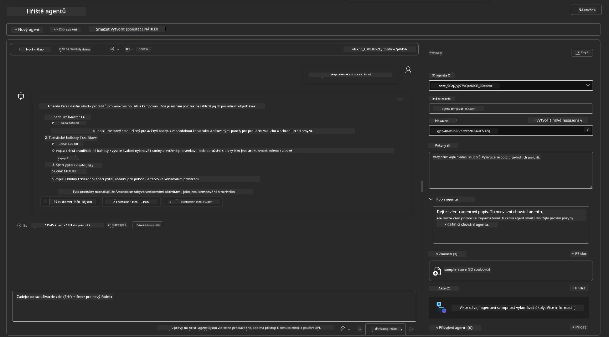

Dostanete stejnou (nebo podobnou) odpověď - ale také získáte další informace, které můžete použít k pochopení kvality, nákladů a výkonu vaší agentické aplikace. Například:

1. Všimněte si, že odpověď cituje datové soubory použité k "zakotvení" odpovědi
1. Přejeďte myší nad jakýmkoli z těchto štítků souborů - odpovídají data vašemu dotazu a zobrazené odpovědi?

Také vidíte _řádek statistik_ pod odpovědí. 

1. Přejeďte myší nad jakoukoli metrikou - např. Bezpečnost. Vidíte něco takového
1. Odpovídá hodnocení vašemu intuitivnímu vnímání úrovně bezpečnosti odpovědi?

      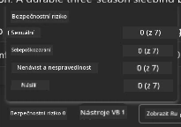

---x

## 7. Vestavěná pozorovatelnost

Pozorovatelnost znamená instrumentaci vaší aplikace tak, aby generovala data, která lze použít k pochopení, ladění a optimalizaci jejího provozu. Pro získání představy o tom:

1. Klikněte na tlačítko `View Run Info` - měli byste vidět tento pohled. Toto je příklad [sledování agenta](https://learn.microsoft.com/en-us/azure/ai-foundry/how-to/develop/trace-agents-sdk#view-trace-results-in-the-azure-ai-foundry-agents-playground) v praxi. _Tento pohled můžete také získat kliknutím na Thread Logs v hlavním menu_.

   - Získejte představu o krocích běhu a nástrojích zapojených agentem
   - Porozumějte celkovému počtu tokenů (vs. použití výstupních tokenů) pro odpověď
   - Porozumějte latenci a tomu, kde se tráví čas při provádění

      

1. Klikněte na záložku `Metadata`, abyste viděli další atributy běhu, které mohou poskytnout užitečný kontext pro ladění problémů později.   

      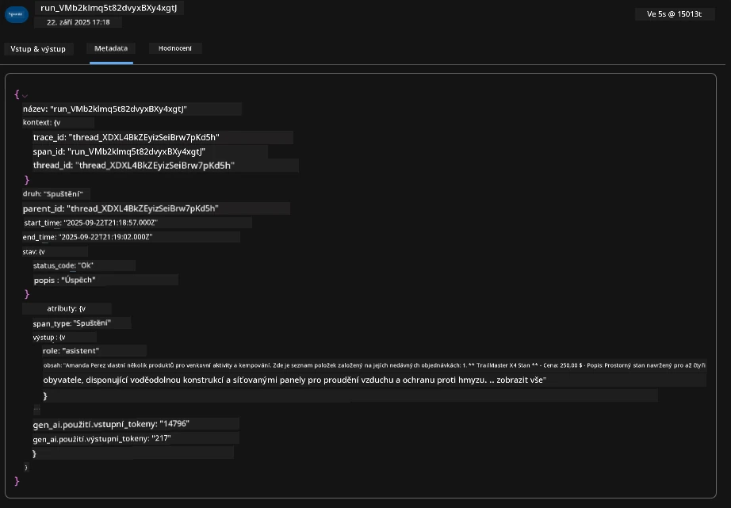

1. Klikněte na záložku `Evaluations`, abyste viděli automatická hodnocení provedená na odpovědi agenta. Tato hodnocení zahrnují bezpečnostní hodnocení (např. Sebepoškozování) a specifická hodnocení agenta (např. Řešení záměru, Dodržení úkolu).

      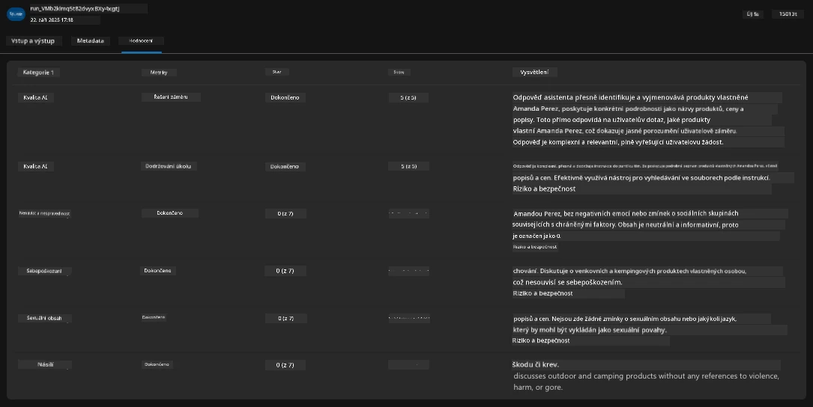

1. Nakonec klikněte na záložku `Monitoring` v postranním menu.

      - Vyberte záložku `Resource usage` na zobrazené stránce - a prohlédněte si metriky.
      - Sledujte využití aplikace z hlediska nákladů (tokeny) a zátěže (požadavky).
      - Sledujte latenci aplikace od prvního bajtu (zpracování vstupu) po poslední bajt (výstup).

      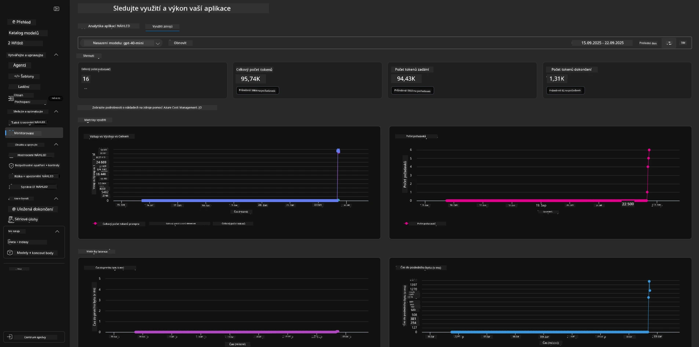

---

## 8. Proměnné prostředí

Doposud jsme prošli nasazení v prohlížeči - a ověřili, že naše infrastruktura je zprovozněna a aplikace je funkční. Ale abychom mohli pracovat s aplikací _code-first_, musíme nakonfigurovat naše lokální vývojové prostředí s relevantními proměnnými potřebnými pro práci s těmito prostředky. Použití `azd` to usnadňuje.

1. Azure Developer CLI [používá proměnné prostředí](https://learn.microsoft.com/en-us/azure/developer/azure-developer-cli/manage-environment-variables?tabs=bash) k ukládání a správě konfiguračních nastavení pro nasazení aplikací.

1. Proměnné prostředí jsou uloženy v `.azure/<env-name>/.env` - to je omezuje na prostředí `env-name` použité během nasazení a pomáhá vám izolovat prostředí mezi různými cíli nasazení ve stejném repozitáři.

1. Proměnné prostředí jsou automaticky načítány příkazem `azd` kdykoli provádí konkrétní příkaz (např. `azd up`). Všimněte si, že `azd` automaticky nečte _proměnné prostředí na úrovni OS_ (např. nastavené v shellu) - místo toho použijte `azd set env` a `azd get env` k přenosu informací v rámci skriptů.

Vyzkoušejme několik příkazů:

1. Získejte všechny proměnné prostředí nastavené pro `azd` v tomto prostředí:

      ```bash title="" linenums="0"
      azd env get-values
      ```
      
      Uvidíte něco takového:

      ```bash title="" linenums="0"
      AZURE_AI_AGENT_DEPLOYMENT_NAME="gpt-4o-mini"
      AZURE_AI_AGENT_NAME="agent-template-assistant"
      AZURE_AI_EMBED_DEPLOYMENT_NAME="text-embedding-3-small"
      AZURE_AI_EMBED_DIMENSIONS=100
      ...
      ```

1. Získejte konkrétní hodnotu - např. Chci vědět, zda jsme nastavili hodnotu `AZURE_AI_AGENT_MODEL_NAME`

      ```bash title="" linenums="0"
      azd env get-value AZURE_AI_AGENT_MODEL_NAME 
      ```
      
      Uvidíte něco takového - nebylo nastaveno výchozí hodnotou!

      ```bash title="" linenums="0"
      ERROR: key 'AZURE_AI_AGENT_MODEL_NAME' not found in the environment values
      ```

1. Nastavte novou proměnnou prostředí pro `azd`. Zde aktualizujeme název modelu agenta. _Poznámka: jakékoli změny budou okamžitě odráženy v souboru `.azure/<env-name>/.env`.

      ```bash title="" linenums="0"
      azd env set AZURE_AI_AGENT_MODEL_NAME gpt-4.1
      azd env set AZURE_AI_AGENT_MODEL_VERSION 2025-04-14
      azd env set AZURE_AI_AGENT_DEPLOYMENT_CAPACITY 150
      ```

      Nyní bychom měli zjistit, že hodnota je nastavena:

      ```bash title="" linenums="0"
      azd env get-value AZURE_AI_AGENT_MODEL_NAME 
      ```

1. Všimněte si, že některé prostředky jsou trvalé (např. nasazení modelů) a budou vyžadovat více než jen `azd up`, aby se vynutilo nové nasazení. Zkusme zrušit původní nasazení a znovu nasadit s změněnými proměnnými prostředí.

1. **Obnovit** Pokud jste dříve nasadili infrastrukturu pomocí šablony azd - můžete _obnovit_ stav vašich lokálních proměnných prostředí na základě aktuálního stavu vašeho nasazení na Azure pomocí tohoto příkazu:
      ```bash title="" linenums="0"
      azd env refresh
      ```

      Toto je efektivní způsob, jak _synchronizovat_ proměnné prostředí mezi dvěma nebo více lokálními vývojovými prostředími (např. tým s více vývojáři) – umožňuje nasazené infrastruktuře sloužit jako zdroj pravdy pro stav proměnných prostředí. Členové týmu jednoduše _aktualizují_ proměnné, aby se znovu synchronizovali.

---

## 9. Gratulujeme 🏆

Právě jste dokončili kompletní pracovní postup, ve kterém jste:

- [X] Vybrali šablonu AZD, kterou chcete použít
- [X] Spustili šablonu pomocí GitHub Codespaces
- [X] Nasadili šablonu a ověřili, že funguje

---

