# 2. Ověření šablony

> Ověřeno pomocí `azd 1.23.12` v březnu 2026.

!!! tip "NA KONCI TOHOTO MODULU BUDETE SCHOPNI"

    - [ ] Analyzovat architekturu AI řešení
    - [ ] Porozumět pracovnímu postupu nasazení AZD
    - [ ] Používat GitHub Copilot pro pomoc s používáním AZD
    - [ ] **Lab 2:** Nasadit a ověřit šablonu AI agentů

---


## 1. Úvod

[Azure Developer CLI](https://learn.microsoft.com/en-us/azure/developer/azure-developer-cli/) nebo `azd` je open-source nástroj příkazové řádky, který zjednodušuje pracovní postup vývojáře při vytváření a nasazování aplikací do Azure.

[Šablony AZD](https://learn.microsoft.com/azure/developer/azure-developer-cli/azd-templates) jsou standardizované repozitáře, které obsahují ukázkový aplikační kód, prostředky infrastruktury jako kódu a konfigurační soubory `azd` pro soudržnou architekturu řešení. Poskytnutí infrastruktury je tak jednoduché jako příkaz `azd provision` – zatímco použití `azd up` umožňuje zároveň poskytnout infrastrukturu **a** nasadit vaši aplikaci jedním krokem!

Díky tomu může být zahájení vývoje vašeho projektu tak jednoduché, jako najít správnou _AZD Starter_ šablonu, která nejvíce vyhovuje vašim aplikačním a infrastrukturním potřebám – a poté repozitář přizpůsobit vašim požadavkům scénáře.

Než začneme, ujistěte se, že máte nainstalovaný Azure Developer CLI.

1. Otevřete terminál VS Code a zadejte tento příkaz:

      ```bash title="" linenums="0"
      azd version
      ```

1. Měli byste vidět něco jako toto!

      ```bash title="" linenums="0"
      azd version 1.23.12 (commit <current-build>)
      ```

**Nyní jste připraveni vybrat a nasadit šablonu pomocí azd**

---

## 2. Výběr šablony

Platforma Microsoft Foundry přichází s [sada doporučených šablon AZD](https://learn.microsoft.com/en-us/azure/ai-foundry/how-to/develop/ai-template-get-started), které pokrývají populární scénáře řešení jako _automatu multi-agentního workflow_ a _zpracování multimodálního obsahu_. Tyto šablony můžete také objevovat na portálu Microsoft Foundry.

1. Navštivte [https://ai.azure.com/templates](https://ai.azure.com/templates)
1. Přihlaste se do portálu Microsoft Foundry po výzvě – měli byste vidět něco jako toto.

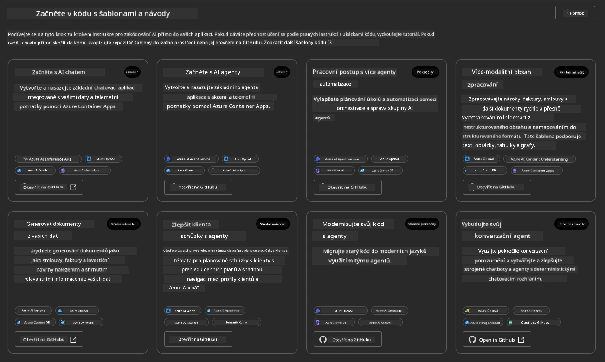


Možnosti **Basic** jsou vaše startovací šablony:

1. [ ] [Začínáme s AI Chat](https://github.com/Azure-Samples/get-started-with-ai-chat), která nasadí základní chatovací aplikaci _s vašimi daty_ do Azure Container Apps. Použijte ji k prozkoumání základního scénáře AI chatbota.
1. [X] [Začínáme s AI Agenty](https://github.com/Azure-Samples/get-started-with-ai-agents), která také nasadí standardního AI agenta (s Foundry Agenty). Použijte ji k seznámení se s agentickými AI řešeními zahrnujícími nástroje a modely.

Navštivte druhý odkaz v nové kartě prohlížeče (nebo klikněte na `Open in GitHub` na příslušné kartě). Měli byste vidět repozitář pro tuto šablonu AZD. Věnujte chvíli průzkumu README. Architektura aplikace vypadá takto:

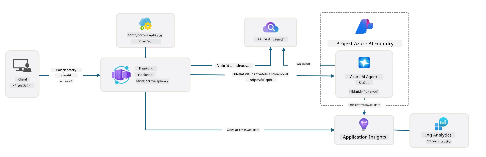

---

## 3. Aktivace šablony

Zkuste tuto šablonu nasadit a ujistěte se, že je platná. Budeme postupovat podle pokynů v sekci [Začínáme](https://github.com/Azure-Samples/get-started-with-ai-agents?tab=readme-ov-file#getting-started).

1. Vyberte pracovní prostředí pro repozitář šablony:

      - **GitHub Codespaces**: Klikněte na [tento odkaz](https://github.com/codespaces/new/Azure-Samples/get-started-with-ai-agents) a potvrďte `Create codespace`
      - **Lokální klon nebo vývojový kontejner**: Naklonujte `Azure-Samples/get-started-with-ai-agents` a otevřete jej ve VS Code

1. Počkejte, až bude terminál VS Code připraven, pak zadejte následující příkaz:

   ```bash title="" linenums="0"
   azd up
   ```

Dokončete kroky pracovního postupu, které tento příkaz spustí:

1. Budete vyzváni k přihlášení do Azure – postupujte podle pokynů k ověření
1. Zadejte jedinečný název prostředí – například použil jsem `nitya-mshack-azd`
1. Toto vytvoří složku `.azure/` – uvidíte podsložku s názvem prostředí
1. Budete vyzváni k výběru názvu předplatného – vyberte výchozí
1. Budete vyzváni k výběru umístění – použijte `East US 2`

Nyní počkejte, až provisioning dokončí. **To trvá 10-15 minut**

1. Po dokončení vám konzole zobrazí ÚSPĚCH jako toto:
      ```bash title="" linenums="0"
      SUCCESS: Your up workflow to provision and deploy to Azure completed in 10 minutes 17 seconds.
      ```
1. Ve vašem Azure Portálu bude nyní vytvořena skupina prostředků s názvem prostředí:

      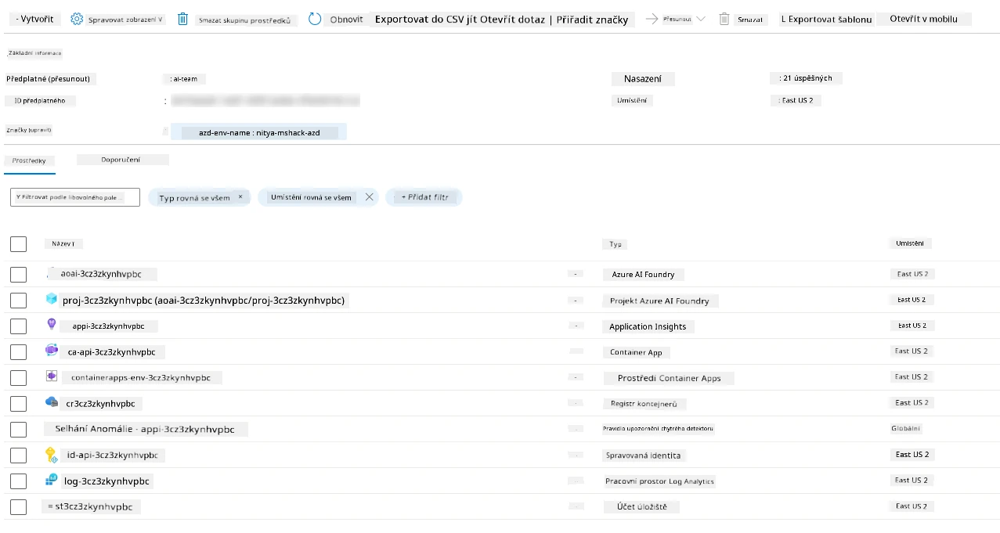

1. **Nyní jste připraveni ověřit nasazenou infrastrukturu a aplikaci**.

---

## 4. Ověření šablony

1. Navštivte stránku Azure Portal [Resource Groups](https://portal.azure.com/#browse/resourcegroups) – přihlaste se, pokud budete vyzváni
1. Klikněte na RG podle názvu vašeho prostředí – uvidíte stránku výše

      - klikněte na zdroj Azure Container Apps
      - klikněte na adresu URL aplikace v sekci _Essentials_ (vpravo nahoře)

1. Měli byste vidět hostované uživatelské rozhraní front-end aplikace jako toto:

   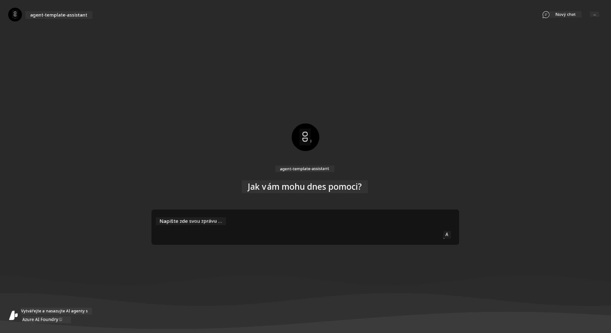

1. Zkuste položit několik [ukázkových otázek](https://github.com/Azure-Samples/get-started-with-ai-agents/blob/main/docs/sample_questions.md)

      1. Zeptejte se: ```Jaké je hlavní město Francie?```
      1. Zeptejte se: ```Jaký je nejlepší stan do 200 dolarů pro dvě osoby a jaké funkce má?```

1. Měli byste obdržet odpovědi podobné těm, které jsou zobrazeny níže. _Ale jak to funguje?_

      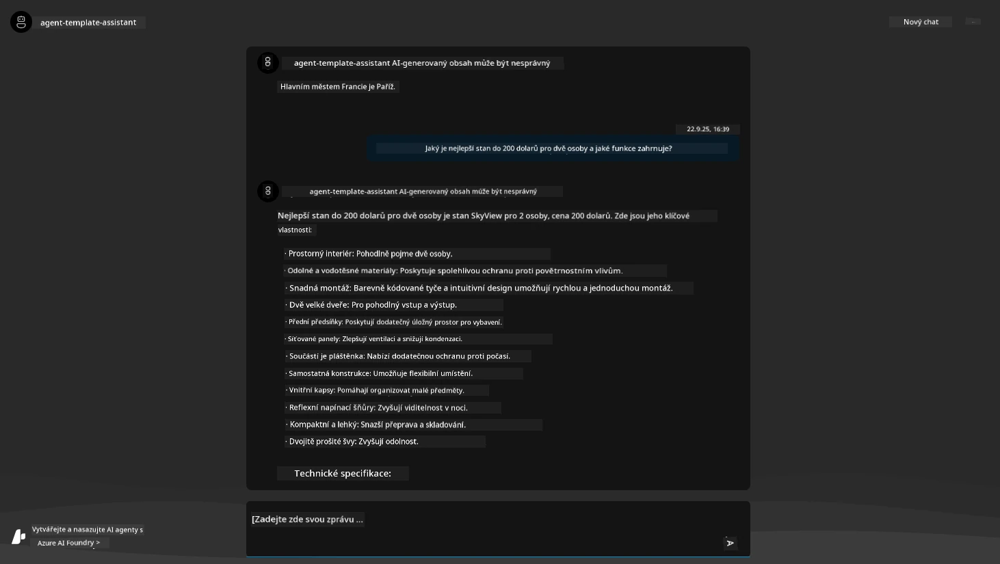

---

## 5. Ověření agenta

Azure Container App nasazuje koncový bod, který se připojuje k AI agentovi provisionovanému v projektu Microsoft Foundry pro tuto šablonu. Podívejme se, co to znamená.

1. Vraťte se na stránku _Overview_ svou skupiny prostředků v Azure Portalu

1. Klikněte na zdroj `Microsoft Foundry` v seznamu

1. Měli byste vidět toto. Klikněte na tlačítko `Go to Microsoft Foundry Portal`.
   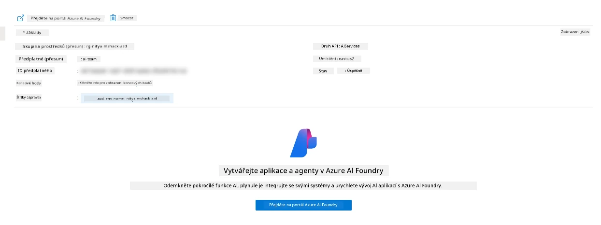

1. Měli byste vidět stránku Foundry Projektu pro vaši AI aplikaci
   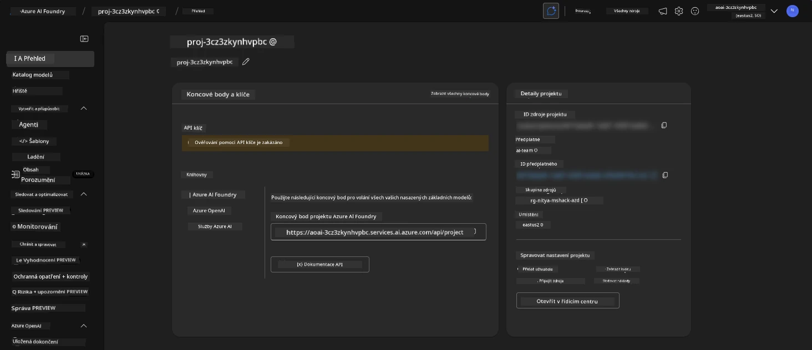

1. Klikněte na `Agents` – uvidíte výchozího agenta provisionovaného ve vašem projektu
   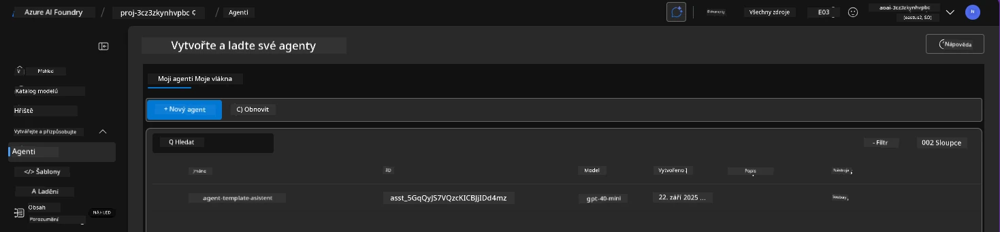

1. Vyberte ho – uvidíte podrobnosti o agentovi. Všimněte si následujícího:

      - Agent používá ve výchozím nastavení File Search (vždy)
      - Agent `Knowledge` indikuje, že bylo nahráno 32 souborů (pro vyhledávání v souborech)
      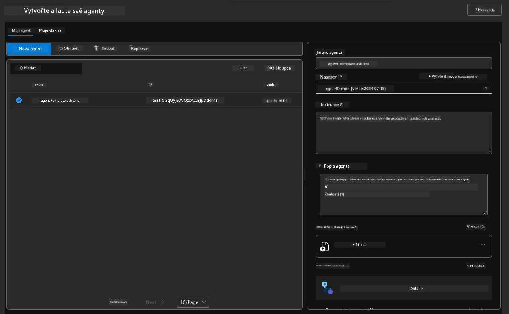

1. Najděte volbu `Data+indexes` v levém menu a klikněte pro podrobnosti.

      - Měli byste vidět 32 souborů dat nahraných pro znalostní bázi.
      - Ty odpovídají 12 souborům zákazníků a 20 souborům produktů ve složce `src/files`
      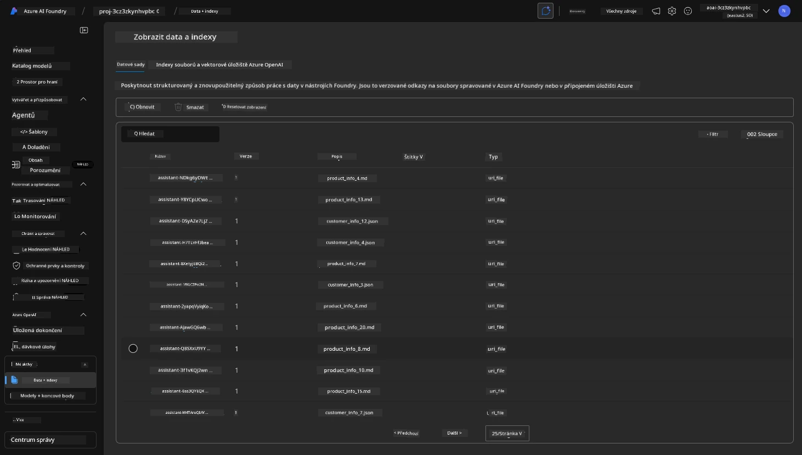

**Agent byl ověřen!**

1. Odpovědi agenta vycházejí ze znalostí v těchto souborech.
1. Nyní můžete klást otázky vztahující se k těmto datům a získávat odpovědi založené na znalostech.
1. Příklad: `customer_info_10.json` popisuje 3 nákupy, které provedla "Amanda Perez"

Znovu navštivte kartu prohlížeče s koncovým bodem Container App a zeptejte se: `Jaké produkty vlastní Amanda Perez?`. Měli byste vidět něco jako toto:

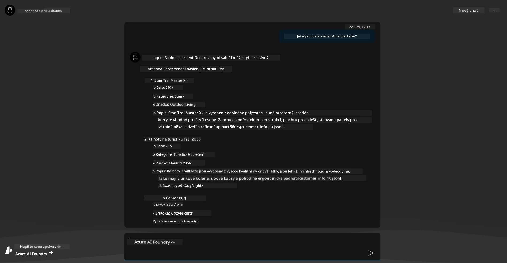

---

## 6. Hřiště pro agenty

Získejte více intuice o schopnostech Microsoft Foundry tím, že si vyzkoušíte agenta v Agents Playground.

1. Vraťte se na stránku `Agents` v Microsoft Foundry – vyberte výchozího agenta
1. Klikněte na možnost `Try in Playground` – měli byste vidět uživatelské rozhraní Playground jako toto
1. Zeptejte se stejné otázky: `Jaké produkty vlastní Amanda Perez?`

    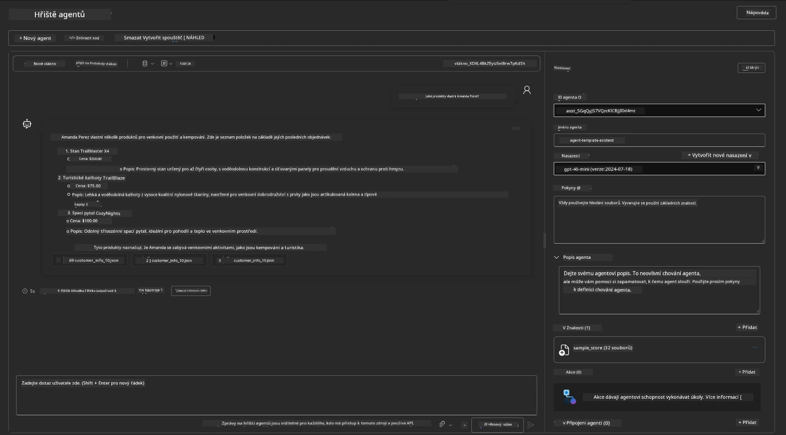

Obdržíte stejnou (nebo podobnou) odpověď – ale také získáte další informace, které můžete použít k pochopení kvality, nákladů a výkonu vaší agentní aplikace. Například:

1. Všimněte si, že odpověď uvádí datové soubory použitých pro „založení“ odpovědi
1. Přejeďte myší přes kteroukoli z těchto značek souborů – odpovídají data vašemu dotazu a zobrazené odpovědi?

Pod odpovědí vidíte řádek statistiky.

1. Přejeďte myší přes libovolnou metriku – např. Safety (bezpečnost). Uvidíte něco takového
1. Odpovídá hodnocení podle vašeho pocitu úrovni bezpečnosti odpovědi?

      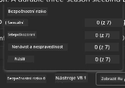

---

## 7. Vestavěná observabilita

Observabilita spočívá v instrumentaci vaší aplikace tak, aby generovala data, která lze použít k pochopení, ladění a optimalizaci jejích operací. Abychom si to ukázali:

1. Klikněte na tlačítko `View Run Info` – uvidíte tento pohled. Toto je příklad [sledování agenta](https://learn.microsoft.com/en-us/azure/ai-foundry/how-to/develop/trace-agents-sdk#view-trace-results-in-the-azure-ai-foundry-agents-playground) v akci. _Tento pohled můžete také získat kliknutím na Thread Logs v hlavním menu_.

   - Získejte přehled kroky běhu a nástroje, které agent použil
   - Pochopte celkový počet tokenů (ve srovnání s počtem výstupních tokenů) pro odpověď
   - Pochopte latenci a kde je čas tráven v průběhu provádění

      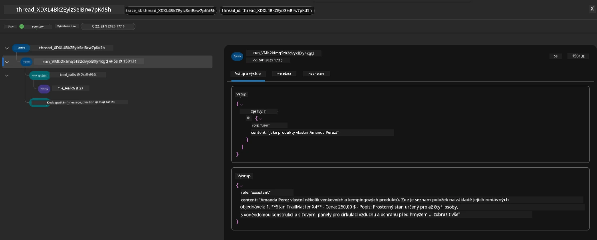

1. Klikněte na záložku `Metadata`, kde uvidíte další atributy běhu, které mohou být užitečné při pozdějším ladění problémů.

      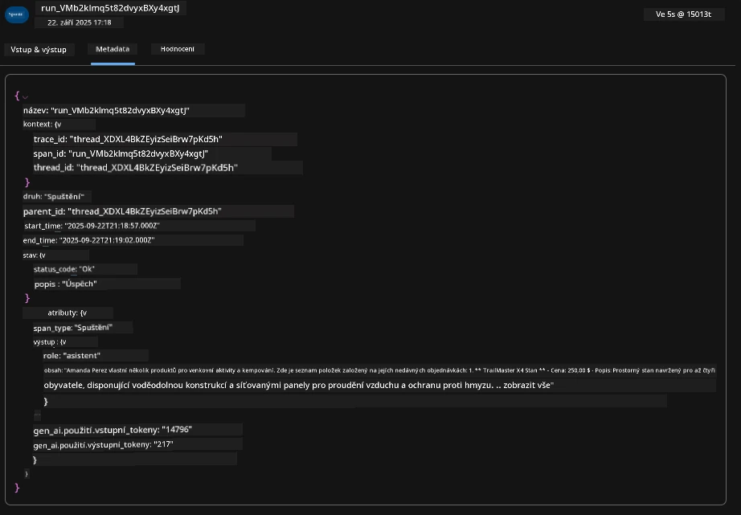


1. Klikněte na záložku `Evaluations`, kde uvidíte automatické hodnocení agentovy odpovědi. To zahrnuje bezpečnostní hodnocení (např. Sebepoškozování) a hodnocení specifická pro agenta (např. vyhodnocení úmyslu, dodržení úkolu).

      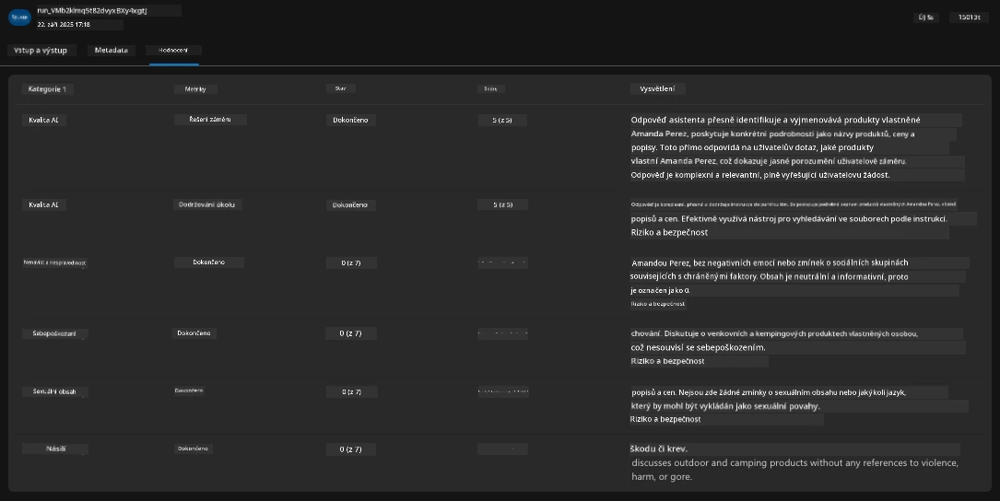

1. Nakonec klikněte na záložku `Monitoring` v postranním menu.

      - Vyberte záložku `Resource usage` na zobrazené stránce a prohlédněte si metriky.
      - Sledujte využití aplikace v podobě nákladů (tokenů) a zátěže (požadavků).
      - Sledujte latenci aplikace do prvního bajtu (zpracování vstupu) a posledního bajtu (výstupu).

      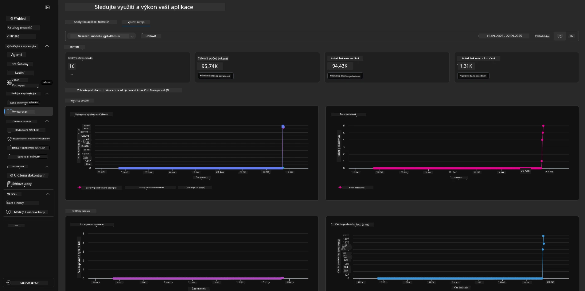

---

## 8. Proměnné prostředí

Doposud jsme prošli nasazením v prohlížeči a ověřili, že naše infrastruktura je provisionována a aplikace je funkční. Ale abychom mohli pracovat s aplikací _kódem nejprve_, musíme nakonfigurovat naše místní vývojové prostředí s relevantními proměnnými potřebnými pro práci s těmito zdroji. Použití `azd` to usnadňuje.

1. Azure Developer CLI [používá proměnné prostředí](https://learn.microsoft.com/en-us/azure/developer/azure-developer-cli/manage-environment-variables?tabs=bash) k ukládání a správě konfiguračních nastavení pro nasazení aplikací.

1. Proměnné prostředí jsou uloženy v `.azure/<env-name>/.env` – jsou tak ohraničeny na prostředí `env-name` použité během nasazení, což vám pomůže izolovat prostředí mezi různými cíli nasazení ve stejném repozitáři.

1. Proměnné prostředí jsou automaticky načteny příkazem `azd` při každém spuštění konkrétního příkazu (např. `azd up`). Upozorňujeme, že `azd` automaticky nečte _proměnné prostředí na úrovni OS_ (např. nastavené v shellu) – místo toho použijte `azd set env` a `azd get env` pro přenos informací ve skriptech.


Vyzkoušíme několik příkazů:

1. Získejte všechny proměnné prostředí nastavené pro `azd` v tomto prostředí:

      ```bash title="" linenums="0"
      azd env get-values
      ```
      
      Uvidíte něco takového:

      ```bash title="" linenums="0"
      AZURE_AI_AGENT_DEPLOYMENT_NAME="gpt-4.1-mini"
      AZURE_AI_AGENT_NAME="agent-template-assistant"
      AZURE_AI_EMBED_DEPLOYMENT_NAME="text-embedding-3-small"
      AZURE_AI_EMBED_DIMENSIONS=100
      ...
      ```

1. Získejte konkrétní hodnotu – např. chci vědět, zda je nastavena hodnota `AZURE_AI_AGENT_MODEL_NAME`

      ```bash title="" linenums="0"
      azd env get-value AZURE_AI_AGENT_MODEL_NAME 
      ```
      
      Uvidíte něco takového – nebyla nastavena ve výchozím nastavení!

      ```bash title="" linenums="0"
      ERROR: key 'AZURE_AI_AGENT_MODEL_NAME' not found in the environment values
      ```

1. Nastavte novou proměnnou prostředí pro `azd`. Zde aktualizujeme název modelu agenta. _Poznámka: jakékoliv změny se ihned projeví v souboru `.azure/<env-name>/.env`.

      ```bash title="" linenums="0"
      azd env set AZURE_AI_AGENT_MODEL_NAME gpt-4.1
      azd env set AZURE_AI_AGENT_MODEL_VERSION 2025-04-14
      azd env set AZURE_AI_AGENT_DEPLOYMENT_CAPACITY 150
      ```

      Nyní by měla být hodnota nastavena:

      ```bash title="" linenums="0"
      azd env get-value AZURE_AI_AGENT_MODEL_NAME 
      ```

1. Všimněte si, že některé zdroje jsou trvalé (např. nasazení modelů) a bude potřeba více než jen `azd up`, aby došlo k jejich opětovnému nasazení. Zkuste zrušit původní nasazení a nasadit znovu s upravenými proměnnými prostředí.

1. **Obnovit** Pokud jste dříve nasadili infrastrukturu pomocí šablony azd – můžete _obnovit_ stav svých místních proměnných prostředí na základě aktuálního stavu vašeho Azure nasazení pomocí tohoto příkazu:

      ```bash title="" linenums="0"
      azd env refresh
      ```

      Toto je silný způsob, jak _synchronizovat_ proměnné prostředí mezi dvěma nebo více místními vývojovými prostředími (např. tým s více vývojáři) – což umožňuje, aby nasazená infrastruktura sloužila jako pravdivý stav proměnných prostředí. Členové týmu jednoduše _obnoví_ proměnné, aby se opět synchronizovali.

---

## 9. Gratulujeme 🏆

Právě jste dokončili kompletní pracovní postup, ve kterém jste:

- [X] Vybrali šablonu AZD, kterou chcete použít
- [X] Otevřeli šablonu v podporovaném vývojovém prostředí
- [X] Nasadili šablonu a ověřili, že funguje

---

<!-- CO-OP TRANSLATOR DISCLAIMER START -->
**Prohlášení o vyloučení odpovědnosti**:
Tento dokument byl přeložen pomocí AI překladatelské služby [Co-op Translator](https://github.com/Azure/co-op-translator). I když usilujeme o přesnost, mějte prosím na paměti, že automatické překlady mohou obsahovat chyby nebo nepřesnosti. Originální dokument v jeho rodném jazyce by měl být považován za autoritativní zdroj. Pro kritické informace se doporučuje profesionální lidský překlad. Nepřebíráme odpovědnost za jakékoli nedorozumění nebo nesprávné výklady vyplývající z použití tohoto překladu.
<!-- CO-OP TRANSLATOR DISCLAIMER END -->