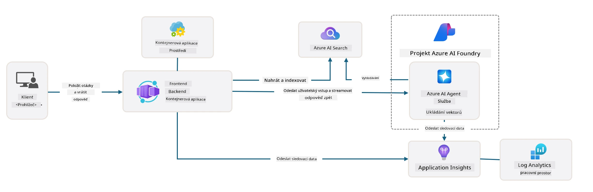

# 3. Rozložení šablony

!!! tip "NA KONCI TOHOTO MODULU BUDETE SCHOPNI"

    - [ ] Položka
    - [ ] Položka
    - [ ] Položka
    - [ ] **Lab 3:** 

---

Díky šablonám AZD a Azure Developer CLI (`azd`) můžeme rychle zahájit naši cestu vývoje AI pomocí standardizovaných repozitářů, které poskytují ukázkový kód, infrastrukturu a konfigurační soubory - ve formě připraveného _startovacího_ projektu.

**Ale nyní potřebujeme pochopit strukturu projektu a kódovou základnu - a být schopni přizpůsobit šablonu AZD - bez jakýchkoliv předchozích zkušeností nebo znalostí AZD!**

---

## 1. Aktivace GitHub Copilot

### 1.1 Instalace GitHub Copilot Chat

Je čas prozkoumat [GitHub Copilot s Agent Mode](https://code.visualstudio.com/docs/copilot/chat/chat-agent-mode). Nyní můžeme použít přirozený jazyk k popisu našeho úkolu na vysoké úrovni a získat pomoc při jeho provádění. Pro tento lab použijeme [Copilot Free plan](https://github.com/github-copilot/signup), který má měsíční limit na dokončení a interakce v chatu.

Rozšíření lze nainstalovat z marketplace, ale mělo by být již dostupné ve vašem prostředí Codespaces. _Klikněte na `Open Chat` z rozbalovací nabídky ikony Copilot - a zadejte výzvu jako `What can you do?`_ - může být vyžadováno přihlášení. **GitHub Copilot Chat je připraven**.

### 1.2 Instalace MCP serverů

Aby byl Agent Mode efektivní, potřebuje přístup ke správným nástrojům, které mu pomohou získat znalosti nebo provádět akce. Zde přicházejí na řadu MCP servery. Konfigurujeme následující servery:

1. [Azure MCP Server](../../../../../workshop/docs/instructions)
1. [Microsoft Docs MCP Server](../../../../../workshop/docs/instructions)

Pro jejich aktivaci:

1. Vytvořte soubor `.vscode/mcp.json`, pokud neexistuje
1. Zkopírujte následující do tohoto souboru - a spusťte servery!
   ```json title=".vscode/mcp.json"
   {
      "servers": {
         "Azure MCP Server": {
            "command": "npx",
            "args": [
            "-y",
            "@azure/mcp@latest",
            "server",
            "start"
            ]
         },
         "microsoft.docs.mcp": {
            "type": "http",
            "url": "https://learn.microsoft.com/api/mcp"
         }
      }
   }
   ```

??? warning "Může se objevit chyba, že `npx` není nainstalován (klikněte pro rozbalení a opravu)"

      Pro opravu otevřete soubor `.devcontainer/devcontainer.json` a přidejte tento řádek do sekce features. Poté znovu sestavte kontejner. Nyní by měl být `npx` nainstalován.

      ```title="" linenums="0"
         "features": {
            "ghcr.io/devcontainers/features/node:1": {},
            ...
         },
      ```

---

### 1.3 Testování GitHub Copilot Chat

**Nejprve použijte `az login` k autentizaci s Azure z příkazového řádku VS Code.**

Nyní byste měli být schopni dotazovat se na stav vašeho Azure předplatného a klást otázky ohledně nasazených zdrojů nebo konfigurace. Vyzkoušejte tyto výzvy:

1. `List my Azure resource groups`
1. `#foundry list my current deployments`

Můžete také klást otázky ohledně dokumentace Azure a získat odpovědi založené na serveru Microsoft Docs MCP. Vyzkoušejte tyto výzvy:

1. `#microsoft_docs_search What is Azure Developer CLI?`
1. `#microsoft_docs_search Show me a Python tutorial to chat with deployed model`

Nebo můžete požádat o ukázky kódu pro dokončení úkolu. Vyzkoušejte tuto výzvu:

1. `Give me a Python code example that uses AAD for an interactive chat client`

V režimu `Ask` vám bude poskytnut kód, který můžete zkopírovat a vyzkoušet. V režimu `Agent` může jít o krok dále a vytvořit relevantní zdroje pro vás - včetně instalačních skriptů a dokumentace - aby vám pomohl úkol provést.

**Nyní jste připraveni začít prozkoumávat repozitář šablon**

---

## 2. Rozložení architektury

??? prompt "ASK: Vysvětlete architekturu aplikace v docs/images/architecture.png v 1 odstavci"

      Tato aplikace je chatovací aplikace poháněná AI, postavená na Azure, která demonstruje moderní architekturu založenou na agentech. Řešení se soustředí na Azure Container App, která hostí hlavní aplikační kód, zpracovává uživatelské vstupy a generuje inteligentní odpovědi prostřednictvím AI agenta. 
      
      Architektura využívá Azure AI Foundry Project jako základ pro AI schopnosti, připojuje se k Azure AI Services, které poskytují základní jazykové modely (například GPT-4o-mini) a funkce agenta. Uživatelské interakce procházejí frontendem založeným na Reactu do backendu FastAPI, který komunikuje se službou AI agenta pro generování kontextových odpovědí. 
      
      Systém zahrnuje schopnosti získávání znalostí prostřednictvím buď vyhledávání souborů nebo služby Azure AI Search, což umožňuje agentovi přistupovat k informacím z nahraných dokumentů a citovat je. Pro operační dokonalost architektura zahrnuje komplexní monitorování prostřednictvím Application Insights a Log Analytics Workspace pro sledování, logování a optimalizaci výkonu. 
      
      Azure Storage poskytuje blob storage pro aplikační data a nahrané soubory, zatímco Managed Identity zajišťuje bezpečný přístup mezi Azure zdroji bez ukládání přihlašovacích údajů. Celé řešení je navrženo pro škálovatelnost a udržovatelnost, s kontejnerizovanou aplikací automaticky škálující se podle poptávky a poskytující vestavěnou bezpečnost, monitorování a CI/CD schopnosti prostřednictvím ekosystému spravovaných služeb Azure.



---

## 3. Struktura repozitáře

!!! prompt "ASK: Vysvětlete strukturu složek šablony. Začněte vizuálním hierarchickým diagramem."

??? info "ODPOVĚĎ: Vizuální hierarchický diagram"

      ```bash title="" 
      get-started-with-ai-agents/
      ├── 📋 Konfigurace a nastavení
      │   ├── azure.yaml                    # Konfigurace Azure Developer CLI
      │   ├── docker-compose.yaml           # Lokální vývojové kontejnery
      │   ├── pyproject.toml                # Konfigurace Python projektu
      │   ├── requirements-dev.txt          # Vývojové závislosti
      │   └── .devcontainer/                # Nastavení dev kontejneru VS Code
      │
      ├── 🏗️ Infrastruktura (infra/)
      │   ├── main.bicep                    # Hlavní šablona infrastruktury
      │   ├── api.bicep                     # Zdroje specifické pro API
      │   ├── main.parameters.json          # Parametry infrastruktury
      │   └── core/                         # Modulární komponenty infrastruktury
      │       ├── ai/                       # Konfigurace AI služeb
      │       ├── host/                     # Hostingová infrastruktura
      │       ├── monitor/                  # Monitorování a logování
      │       ├── search/                   # Nastavení Azure AI Search
      │       ├── security/                 # Bezpečnost a identita
      │       └── storage/                  # Konfigurace úložiště
      │
      ├── 💻 Zdroj aplikace (src/)
      │   ├── api/                          # Backend API
      │   │   ├── main.py                   # Vstupní bod aplikace FastAPI
      │   │   ├── routes.py                 # Definice API tras
      │   │   ├── search_index_manager.py   # Funkce vyhledávání
      │   │   ├── data/                     # Zpracování dat API
      │   │   ├── static/                   # Statické webové zdroje
      │   │   └── templates/                # HTML šablony
      │   ├── frontend/                     # Frontend React/TypeScript
      │   │   ├── package.json              # Závislosti Node.js
      │   │   ├── vite.config.ts            # Konfigurace sestavení Vite
      │   │   └── src/                      # Zdrojový kód frontendu
      │   ├── data/                         # Ukázkové datové soubory
      │   │   └── embeddings.csv            # Předpočítané vektory
      │   ├── files/                        # Soubory znalostní báze
      │   │   ├── customer_info_*.json      # Ukázková data zákazníků
      │   │   └── product_info_*.md         # Dokumentace produktů
      │   ├── Dockerfile                    # Konfigurace kontejneru
      │   └── requirements.txt              # Závislosti Pythonu
      │
      ├── 🔧 Automatizace a skripty (scripts/)
      │   ├── postdeploy.sh/.ps1           # Nastavení po nasazení
      │   ├── setup_credential.sh/.ps1     # Konfigurace přihlašovacích údajů
      │   ├── validate_env_vars.sh/.ps1    # Validace prostředí
      │   └── resolve_model_quota.sh/.ps1  # Správa kvót modelu
      │
      ├── 🧪 Testování a hodnocení
      │   ├── tests/                        # Jednotkové a integrační testy
      │   │   └── test_search_index_manager.py
      │   ├── evals/                        # Rámec hodnocení agenta
      │   │   ├── evaluate.py               # Spouštěč hodnocení
      │   │   ├── eval-queries.json         # Testovací dotazy
      │   │   └── eval-action-data-path.json
      │   ├── sandbox/                      # Vývojové hřiště
      │   │   ├── 1-quickstart.py           # Ukázky pro začátek
      │   │   └── aad-interactive-chat.py   # Ukázky autentizace
      │   └── airedteaming/                 # Hodnocení bezpečnosti AI
      │       └── ai_redteaming.py          # Testování red teamu
      │
      ├── 📚 Dokumentace (docs/)
      │   ├── deployment.md                 # Průvodce nasazením
      │   ├── local_development.md          # Pokyny pro lokální nastavení
      │   ├── troubleshooting.md            # Běžné problémy a opravy
      │   ├── azure_account_setup.md        # Předpoklady Azure
      │   └── images/                       # Dokumentační zdroje
      │
      └── 📄 Metadata projektu
         ├── README.md                     # Přehled projektu
         ├── CODE_OF_CONDUCT.md           # Pokyny pro komunitu
         ├── CONTRIBUTING.md              # Průvodce přispěním
         ├── LICENSE                      # Licenční podmínky
         └── next-steps.md                # Pokyny po nasazení
      ```

### 3.1. Architektura hlavní aplikace

Tato šablona následuje vzor **full-stack webové aplikace** s:

- **Backend**: Python FastAPI s integrací Azure AI
- **Frontend**: TypeScript/React s build systémem Vite
- **Infrastruktura**: Azure Bicep šablony pro cloudové zdroje
- **Kontejnerizace**: Docker pro konzistentní nasazení

### 3.2 Infrastruktura jako kód (bicep)

Vrstva infrastruktury používá **Azure Bicep** šablony organizované modulárně:

   - **`main.bicep`**: Orchestrace všech Azure zdrojů
   - **`core/` moduly**: Znovupoužitelné komponenty pro různé služby
      - AI služby (Azure OpenAI, AI Search)
      - Hosting kontejnerů (Azure Container Apps)
      - Monitorování (Application Insights, Log Analytics)
      - Bezpečnost (Key Vault, Managed Identity)

### 3.3 Zdroj aplikace (`src/`)

**Backend API (`src/api/`)**:

- REST API založené na FastAPI
- Integrace služby Azure AI Agent
- Správa indexu vyhledávání pro získávání znalostí
- Funkce nahrávání a zpracování souborů

**Frontend (`src/frontend/`)**:

- Moderní SPA React/TypeScript
- Vite pro rychlý vývoj a optimalizované sestavení
- Chatovací rozhraní pro interakce s agentem

**Znalostní báze (`src/files/`)**:

- Ukázková data zákazníků a produktů
- Demonstruje získávání znalostí na základě souborů
- Ukázky ve formátu JSON a Markdown

### 3.4 DevOps a automatizace

**Skripty (`scripts/`)**:

- Skripty pro PowerShell a Bash napříč platformami
- Validace a nastavení prostředí
- Konfigurace po nasazení
- Správa kvót modelu

**Integrace Azure Developer CLI**:

- Konfigurace `azure.yaml` pro workflow `azd`
- Automatizované zajištění a nasazení
- Správa proměnných prostředí

### 3.5 Testování a zajištění kvality

**Rámec hodnocení (`evals/`)**:

- Hodnocení výkonu agenta
- Testování kvality dotazů a odpovědí
- Automatizovaný hodnotící pipeline

**Bezpečnost AI (`airedteaming/`)**:

- Testování red teamu pro bezpečnost AI
- Skenování zranitelností
- Praktiky odpovědné AI

---

## 4. Gratulujeme 🏆

Úspěšně jste použili GitHub Copilot Chat s MCP servery k prozkoumání repozitáře.

- [X] Aktivovali GitHub Copilot pro Azure
- [X] Porozuměli architektuře aplikace
- [X] Prozkoumali strukturu šablony AZD

To vám poskytuje přehled o _infrastruktuře jako kódu_ pro tuto šablonu. Dále se podíváme na konfigurační soubor pro AZD.

---

