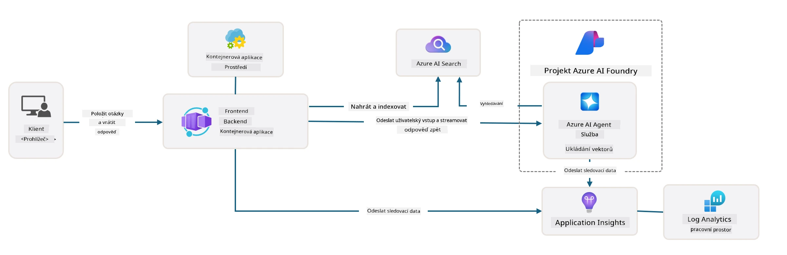

# 3. Rozebrat šablonu

!!! tip "NA KONCI TOHOTO MODULU BUDETE SCHOPNI"

    - [ ] Aktivovat GitHub Copilot s MCP servery pro pomoc s Azure
    - [ ] Pochopit strukturu složek a komponent šablony AZD
    - [ ] Prozkoumat vzory organizace infrastruktury jako kódu (Bicep)
    - [ ] **Cvičení 3:** Použít GitHub Copilot k průzkumu a porozumění architektuře repozitáře 

---


S šablonami AZD a Azure Developer CLI (`azd`) můžeme rychle nastartovat náš vývoj AI pomocí standardizovaných repozitářů, které poskytují ukázkový kód, infrastrukturu a konfigurační soubory - ve formě připraveného k nasazení _startovacího_ projektu.

**Ale teď musíme rozumět struktuře projektu a kódu - a být schopni přizpůsobit šablonu AZD - bez jakýchkoliv předchozích zkušeností nebo znalostí AZD!**

---

## 1. Aktivovat GitHub Copilot

### 1.1 Nainstalovat GitHub Copilot Chat

Je čas prozkoumat [GitHub Copilot with Agent Mode](https://code.visualstudio.com/docs/copilot/chat/chat-agent-mode). Nyní můžeme používat přirozený jazyk k popsání našeho úkolu na vysoké úrovni a získat pomoc při jeho vykonání. Pro toto cvičení použijeme [Copilot Free plan](https://github.com/github-copilot/signup), který má měsíční limit pro dokončení a interakce v chatu.

Rozšíření lze nainstalovat z marketplace, ale mělo by být již dostupné ve vašem prostředí Codespaces. _Klikněte na `Open Chat` v rozevíracím seznamu ikony Copilot - a napište prompt jako `What can you do?`_ - můžete být vyzváni k přihlášení. **GitHub Copilot Chat je připraven**.

### 1.2. Nainstalovat MCP servery

Aby byl režim Agent efektivní, potřebuje přístup k správným nástrojům, které mu pomohou získávat znalosti nebo provádět akce. Zde mohou pomoci MCP servery. Nakonfigurujeme následující servery:

1. [Azure MCP Server](../../../../../workshop/docs/instructions)
1. [Microsoft Docs MCP Server](../../../../../workshop/docs/instructions)

Chcete-li je aktivovat:

1. Vytvořte soubor s názvem `.vscode/mcp.json`, pokud neexistuje
1. Zkopírujte následující do toho souboru - a spusťte servery!
   ```json title=".vscode/mcp.json"
   {
      "servers": {
         "Azure MCP Server": {
            "command": "npx",
            "args": [
            "-y",
            "@azure/mcp@latest",
            "server",
            "start"
            ]
         },
         "microsoft.docs.mcp": {
            "type": "http",
            "url": "https://learn.microsoft.com/api/mcp"
         }
      }
   }
   ```

??? warning "Může se objevit chyba, že `npx` není nainstalován (klikněte pro rozbalení opravy)"

      Chcete-li to opravit, otevřete soubor `.devcontainer/devcontainer.json` a přidejte tento řádek do sekce features. Poté znovu sestavte kontejner. Nyní byste měli mít nainstalovaný `npx`.

      ```title="" linenums="0"
         "features": {
            "ghcr.io/devcontainers/features/node:1": {},
            ...
         },
      ```

---

### 1.3. Otestovat GitHub Copilot Chat

**Nejprve použijte `az login` pro autentizaci do Azure z příkazové řádky VS Code.**

Nyní byste měli být schopni dotazovat se na stav vaší Azure subscription a klást otázky ohledně nasazených zdrojů nebo konfigurace. Zkuste tyto promptů:

1. `List my Azure resource groups`
1. `#foundry list my current deployments`

Můžete také klást otázky k dokumentaci Azure a získat odpovědi podložené Microsoft Docs MCP serverem. Zkuste tyto promptů:

1. `#microsoft_docs_search What is Azure Developer CLI?`
1. `#microsoft_docs_search Show me a Python tutorial to chat with deployed model`

Nebo můžete požádat o ukázky kódu pro dokončení úkolu. Zkuste tento prompt.

1. `Give me a Python code example that uses AAD for an interactive chat client`

V režimu `Ask` to poskytne kód, který můžete zkopírovat a vyzkoušet. V režimu `Agent` to může zajít o krok dál a vytvořit relevantní zdroje pro vás - včetně skriptů pro nastavení a dokumentace - aby vám pomohlo tento úkol vykonat.

**Nyní jste vybaveni pro zahájení průzkumu šablony repozitáře**

---

## 2. Rozebrat architekturu

??? prompt "POŽADAVEK: Vysvětlete architekturu aplikace v docs/images/architecture.png v 1 odstavci"

      Tato aplikace je chatovací aplikace poháněná AI postavená na Azure, která demonstruje moderní architekturu založenou na agentech. Řešení se soustředí kolem Azure Container App, která hostuje hlavní aplikační kód, jenž zpracovává vstupy uživatele a generuje inteligentní odpovědi prostřednictvím AI agenta. 
      
      Architektura využívá Microsoft Foundry Project jako základ pro AI schopnosti a připojuje se k Azure AI Services, které poskytují podkladové jazykové modely (např. GPT-4o-mini) a funkcionalitu agentů. Interakce uživatelů proudí přes frontend založený na Reactu do FastAPI backendu, který komunikuje se službou AI agenta pro generování kontextuálních odpovědí. 
      
      Systém zahrnuje schopnosti získávání znalostí prostřednictvím buď vyhledávání v souborech nebo služby Azure AI Search, což umožňuje agentovi přistupovat k nahraným dokumentům a citovat z nich informace. Pro provozní excelenci architektura obsahuje komplexní monitorování pomocí Application Insights a Log Analytics Workspace pro trasování, logování a optimalizaci výkonu. 
      
      Azure Storage poskytuje blob storage pro aplikační data a nahrávání souborů, zatímco Managed Identity zajišťuje bezpečný přístup mezi Azure zdroji bez ukládání přihlašovacích údajů. Celé řešení je navrženo pro škálovatelnost a udržovatelnost, přičemž kontejnerizovaná aplikace se automaticky škáluje podle poptávky a poskytuje vestavěné zabezpečení, monitorování a CI/CD schopnosti prostřednictvím ekosystému spravovaných služeb Azure.



---

## 3. Struktura repozitáře

!!! prompt "POŽADAVEK: Vysvětlete strukturu složek šablony. Začněte vizuálním hierarchickým diagramem."

??? info "ODPOVĚĎ: Vizuální hierarchický diagram"

      ```bash title="" 
      get-started-with-ai-agents/
      ├── 📋 Konfigurace a nastavení
      │   ├── azure.yaml                    # Konfigurace Azure Developer CLI
      │   ├── docker-compose.yaml           # Lokální vývojové kontejnery
      │   ├── pyproject.toml                # Konfigurace Python projektu
      │   ├── requirements-dev.txt          # Vývojové závislosti
      │   └── .devcontainer/                # Nastavení vývojového kontejneru VS Code
      │
      ├── 🏗️ Infrastruktura (infra/)
      │   ├── main.bicep                    # Hlavní šablona infrastruktury
      │   ├── api.bicep                     # Zdroje specifické pro API
      │   ├── main.parameters.json          # Parametry infrastruktury
      │   └── core/                         # Modulární komponenty infrastruktury
      │       ├── ai/                       # Konfigurace AI služeb
      │       ├── host/                     # Hostingová infrastruktura
      │       ├── monitor/                  # Monitorování a logování
      │       ├── search/                   # Nastavení Azure AI Search
      │       ├── security/                 # Zabezpečení a identita
      │       └── storage/                  # Konfigurace storage účtu
      │
      ├── 💻 Zdroj aplikace (src/)
      │   ├── api/                          # Backend API
      │   │   ├── main.py                   # Vstupní bod aplikace FastAPI
      │   │   ├── routes.py                 # Definice tras API
      │   │   ├── search_index_manager.py   # Funkcionalita vyhledávání
      │   │   ├── data/                     # Zpracování dat API
      │   │   ├── static/                   # Statické webové zdroje
      │   │   └── templates/                # HTML šablony
      │   ├── frontend/                     # Frontend React/TypeScript
      │   │   ├── package.json              # Node.js závislosti
      │   │   ├── vite.config.ts            # Konfigurace buildu Vite
      │   │   └── src/                      # Zdrojový kód frontendu
      │   ├── data/                         # Ukázkové datové soubory
      │   │   └── embeddings.csv            # Předpočítané embeddingy
      │   ├── files/                        # Soubory znalostní báze
      │   │   ├── customer_info_*.json      # Ukázky zákaznických dat
      │   │   └── product_info_*.md         # Dokumentace produktů
      │   ├── Dockerfile                    # Konfigurace kontejneru
      │   └── requirements.txt              # Python závislosti
      │
      ├── 🔧 Automatizace a skripty (scripts/)
      │   ├── postdeploy.sh/.ps1           # Nastavení po nasazení
      │   ├── setup_credential.sh/.ps1     # Konfigurace přihlašovacích údajů
      │   ├── validate_env_vars.sh/.ps1    # Ověření proměnných prostředí
      │   │   └── resolve_model_quota.sh/.ps1  # Správa kvóty modelu
      │
      ├── 🧪 Testování a vyhodnocení
      │   ├── tests/                        # Jednotkové a integrační testy
      │   │   └── test_search_index_manager.py
      │   ├── evals/                        # Rámec pro hodnocení agentů
      │   │   ├── evaluate.py               # Spouštěč hodnocení
      │   │   ├── eval-queries.json         # Testovací dotazy
      │   │   └── eval-action-data-path.json
      │   ├── sandbox/                      # Vývojové pískoviště
      │   │   ├── 1-quickstart.py           # Příklady pro začátek
      │   │   └── aad-interactive-chat.py   # Příklady autentizace
      │   └── airedteaming/                 # Hodnocení bezpečnosti AI
      │       └── ai_redteaming.py          # Red team testování
      │
      ├── 📚 Dokumentace (docs/)
      │   ├── deployment.md                 # Průvodce nasazením
      │   │   ├── local_development.md          # Instrukce pro lokální nastavení
      │   ├── troubleshooting.md            # Běžné problémy a opravy
      │   ├── azure_account_setup.md        # Požadavky pro Azure účet
      │   └── images/                       # Assety dokumentace
      │
      └── 📄 Metadata projektu
         ├── README.md                     # Přehled projektu
         ├── CODE_OF_CONDUCT.md           # Pravidla komunity
         ├── CONTRIBUTING.md              # Průvodce přispíváním
         ├── LICENSE                      # Podmínky licence
         └── next-steps.md                # Doporučené další kroky po nasazení
      ```

### 3.1. Jádro architektury aplikace

Tato šablona následuje vzor **full-stack webové aplikace** s:

- **Backend**: Python FastAPI s integrací Azure AI
- **Frontend**: TypeScript/React s Vite build systémem
- **Infrastruktura**: Šablony Azure Bicep pro cloudové zdroje
- **Kontejnerizace**: Docker pro konzistentní nasazení

### 3.2 Infrastruktura jako kód (Bicep)

Vrstva infrastruktury používá **Azure Bicep** šablony organizované modulárně:

   - **`main.bicep`**: Orchestrace všech Azure zdrojů
   - **`core/` moduly**: Znovupoužitelné komponenty pro různé služby
      - AI služby (Azure OpenAI, AI Search)
      - Hostování kontejnerů (Azure Container Apps)
      - Monitorování (Application Insights, Log Analytics)
      - Zabezpečení (Key Vault, Managed Identity)

### 3.3 Zdroj aplikace (`src/`)

**Backend API (`src/api/`)**:

- REST API založené na FastAPI
- Integrace Foundry Agents
- Správa indexu vyhledávání pro získávání znalostí
- Možnosti nahrávání a zpracování souborů

**Frontend (`src/frontend/`)**:

- Moderní SPA v React/TypeScript
- Vite pro rychlý vývoj a optimalizovaná sestavení
- Chatovací rozhraní pro interakce s agentem

**Databáze znalostí (`src/files/`)**:

- Ukázková data zákazníků a produktů
- Ukazuje získávání znalostí ze souborů
- Příklady ve formátu JSON a Markdown


### 3.4 DevOps a automatizace

**Skripty (`scripts/`)**:

- Skripty pro PowerShell a Bash napříč platformami
- Ověření a nastavení prostředí
- Konfigurace po nasazení
- Správa kvóty modelu

**Integrace Azure Developer CLI**:

- `azure.yaml` konfigurace pro `azd` pracovní postupy
- Automatizované provisionování a nasazení
- Správa proměnných prostředí

### 3.5 Testování a zajištění kvality

**Rámec hodnocení (`evals/`)**:

- Hodnocení výkonu agentů
- Testování kvality dotaz-odpověď
- Automatizovaný pipeline pro hodnocení

**Bezpečnost AI (`airedteaming/`)**:

- Red team testování bezpečnosti AI
- Skenování bezpečnostních zranitelností
- Praktiky odpovědného AI

---

## 4. Gratulujeme 🏆

Úspěšně jste použili GitHub Copilot Chat s MCP servery k průzkumu repozitáře.

- [X] Aktivovali GitHub Copilot pro Azure
- [X] Pochopili architekturu aplikace
- [X] Prozkoumali strukturu šablony AZD

To vám dává představu o aktivech _infrastruktura jako kód_ pro tuto šablonu. Dále se podíváme na konfigurační soubor pro AZD.

---

<!-- CO-OP TRANSLATOR DISCLAIMER START -->
**Prohlášení o vyloučení odpovědnosti**:
Tento dokument byl přeložen pomocí služby pro překlad využívající umělou inteligenci [Co-op Translator](https://github.com/Azure/co-op-translator). I když usilujeme o přesnost, mějte prosím na paměti, že automatické překlady mohou obsahovat chyby nebo nepřesnosti. Původní dokument v jeho mateřském jazyce by měl být považován za závazný zdroj. Pro zásadní informace doporučujeme profesionální lidský překlad. Nejsme odpovědní za jakékoliv nedorozumění nebo chybné výklady vyplývající z použití tohoto překladu.
<!-- CO-OP TRANSLATOR DISCLAIMER END -->