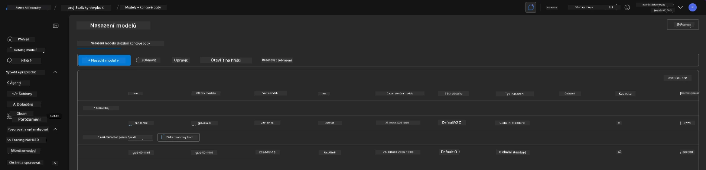
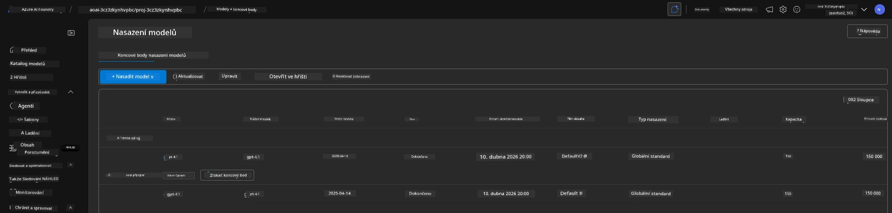

# 6. Odstranění infrastruktury

!!! tip "NA KONCI TOHOTO MODULU BUDETE SCHOPNI"

    - [ ] Pochopit důležitost úklidu zdrojů a řízení nákladů
    - [ ] Použít `azd down` k bezpečnému zrušení infrastruktury
    - [ ] Obnovit dočasně odstraněné zdroje Cognitive Services, pokud bude potřeba
    - [ ] **Lab 6:** Vyčistit zdroje Azure a ověřit jejich odstranění

---

## Bonusová cvičení

Než projekt odstraníme, věnujte pár minut otevřenému prozkoumávání.

!!! info "Vyzkoušejte tyto průzkumné podněty"

    **Experimentujte s GitHub Copilotem:**
    
    1. Zeptejte se: `What other AZD templates could I try for multi-agent scenarios?`
    2. Zeptejte se: `How can I customize the agent instructions for a healthcare use case?`
    3. Zeptejte se: `What environment variables control cost optimization?`
    
    **Prozkoumejte Azure Portal:**
    
    1. Zkontrolujte metriky Application Insights pro vaše nasazení
    2. Zkontrolujte analýzu nákladů pro nasazené zdroje
    3. Ještě jednou prozkoumejte sekci 'agent playground' v portálu Microsoft Foundry

---

## Zrušení infrastruktury

1. Odstranění infrastruktury je tak jednoduché:
      
      ```bash title="" linenums="0"
      azd down --purge
      ```
1. Příznak `--purge` zajistí, že také vymaže dočasně odstraněné zdroje Cognitive Services, čímž uvolní kvótu drženou těmito zdroji. Po dokončení uvidíte něco takového:
      
      ```bash title="" linenums="0"
      ? Total resources to delete: 11, are you sure you want to continue? Yes
      Deleting your resources can take some time.
      (✓) Done: Deleted resource group rg-nitya-mshack-azd
      (✓) Done: Purging Cognitive Account: aoai-3cz3zkynhvpbc

      SUCCESS: Your application was removed from Azure in 11 minutes 4 seconds.
      ```

1. (Volitelné) Pokud nyní znovu spustíte `azd up`, všimnete si, že je nasazen model gpt-4.1, protože proměnná prostředí byla změněna (a uložena) v lokální složce `.azure`. 

      Zde jsou nasazení modelů **před**:

      

      A zde je **po**:
      

---

<!-- CO-OP TRANSLATOR DISCLAIMER START -->
**Vyloučení odpovědnosti**:
Tento dokument byl přeložen pomocí služby AI pro překlad [Co-op Translator](https://github.com/Azure/co-op-translator). Přestože usilujeme o přesnost, uvědomte si prosím, že automatizované překlady mohou obsahovat chyby nebo nepřesnosti. Původní dokument v jeho mateřském jazyce by měl být považován za autoritativní zdroj. Pro zásadní informace se doporučuje profesionální lidský překlad. Nejsme odpovědní za žádná nedorozumění nebo chybné interpretace vyplývající z použití tohoto překladu.
<!-- CO-OP TRANSLATOR DISCLAIMER END -->