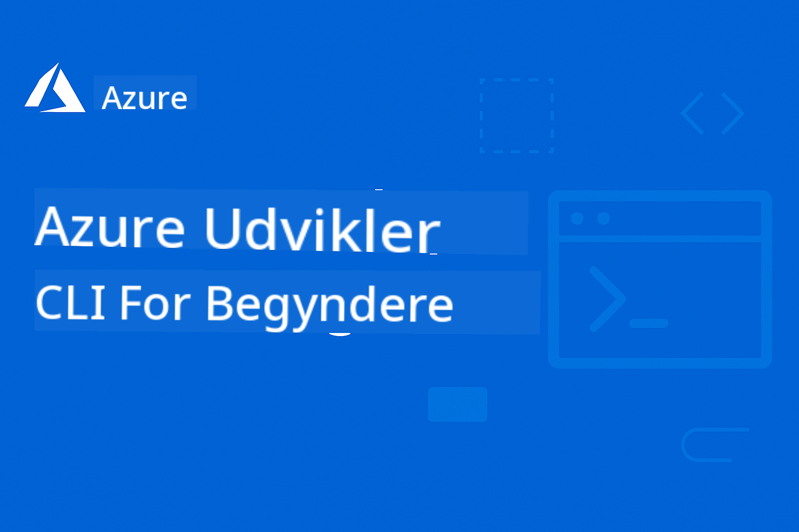

<!--
CO_OP_TRANSLATOR_METADATA:
{
  "original_hash": "c0984265b7a9357388f864c19606c80d",
  "translation_date": "2025-09-11T10:04:24+00:00",
  "source_file": "README.md",
  "language_code": "da"
}
-->
# AZD For Begyndere

 

[](https://GitHub.com/microsoft/azd-for-beginners/watchers/?WT.mc_id=academic-105485-koreyst)
[](https://GitHub.com/microsoft/azd-for-beginners/network/?WT.mc_id=academic-105485-koreyst)
[](https://GitHub.com/microsoft/azd-for-beginners/stargazers/?WT.mc_id=academic-105485-koreyst)

[](https://discord.gg/microsoft-azure)

[](https://discord.gg/kzRShWzttr)

Følg disse trin for at komme i gang med at bruge disse ressourcer:
1. **Fork repositoryet**: Klik [](https://GitHub.com/microsoft/azd-for-beginners/fork)
2. **Klon repositoryet**:   `git clone https://github.com/microsoft/azd-for-beginners.git`
3. [**Deltag i Azure Discord-fællesskaberne og mød eksperter og andre udviklere**](https://discord.com/invite/ByRwuEEgH4)

### 🌐 Flersproget support

#### Understøttet via GitHub Action (Automatisk & Altid opdateret)

[French](../fr/README.md) | [Spanish](../es/README.md) | [German](../de/README.md) | [Russian](../ru/README.md) | [Arabic](../ar/README.md) | [Persian (Farsi)](../fa/README.md) | [Urdu](../ur/README.md) | [Chinese (Simplified)](../zh/README.md) | [Chinese (Traditional, Macau)](../mo/README.md) | [Chinese (Traditional, Hong Kong)](../hk/README.md) | [Chinese (Traditional, Taiwan)](../tw/README.md) | [Japanese](../ja/README.md) | [Korean](../ko/README.md) | [Hindi](../hi/README.md) | [Bengali](../bn/README.md) | [Marathi](../mr/README.md) | [Nepali](../ne/README.md) | [Punjabi (Gurmukhi)](../pa/README.md) | [Portuguese (Portugal)](../pt/README.md) | [Portuguese (Brazil)](../br/README.md) | [Italian](../it/README.md) | [Polish](../pl/README.md) | [Turkish](../tr/README.md) | [Greek](../el/README.md) | [Thai](../th/README.md) | [Swedish](../sv/README.md) | [Danish](./README.md) | [Norwegian](../no/README.md) | [Finnish](../fi/README.md) | [Dutch](../nl/README.md) | [Hebrew](../he/README.md) | [Vietnamese](../vi/README.md) | [Indonesian](../id/README.md) | [Malay](../ms/README.md) | [Tagalog (Filipino)](../tl/README.md) | [Swahili](../sw/README.md) | [Hungarian](../hu/README.md) | [Czech](../cs/README.md) | [Slovak](../sk/README.md) | [Romanian](../ro/README.md) | [Bulgarian](../bg/README.md) | [Serbian (Cyrillic)](../sr/README.md) | [Croatian](../hr/README.md) | [Slovenian](../sl/README.md) | [Ukrainian](../uk/README.md) | [Burmese (Myanmar)](../my/README.md)

**Hvis du ønsker yderligere oversættelser, er understøttede sprog listet [her](https://github.com/Azure/co-op-translator/blob/main/getting_started/supported-languages.md)**

## Introduktion

Velkommen til den omfattende guide til Azure Developer CLI (azd). Dette repository er designet til at hjælpe udviklere på alle niveauer, fra studerende til professionelle udviklere, med at lære og mestre Azure Developer CLI for effektive cloud-implementeringer. Denne strukturerede læringsressource giver praktisk erfaring med Azure cloud-implementeringer, fejlfinding af almindelige problemer og implementering af bedste praksis for succesfulde AZD-template-implementeringer.

## Læringsmål

Ved at arbejde gennem dette repository vil du:
- Mestre Azure Developer CLI grundlæggende og kernekoncepter
- Lære at implementere og provisionere Azure-ressourcer ved hjælp af Infrastructure as Code
- Udvikle færdigheder til fejlfinding af almindelige AZD-implementeringsproblemer
- Forstå præ-implementeringsvalidering og kapacitetsplanlægning
- Implementere sikkerhedsbedste praksis og strategier for omkostningsoptimering
- Opbygge selvtillid i at implementere produktionsklare applikationer til Azure

## Læringsresultater

Efter at have gennemført dette kursus vil du være i stand til at:
- Installere, konfigurere og bruge Azure Developer CLI med succes
- Oprette og implementere applikationer ved hjælp af AZD-templates
- Fejlsøge autentificering, infrastruktur og implementeringsproblemer
- Udføre præ-implementeringskontroller, herunder kapacitetsplanlægning og SKU-valg
- Implementere overvågning, sikkerhed og omkostningsstyringsbedste praksis
- Integrere AZD-workflows i CI/CD-pipelines

## Indholdsfortegnelse

- [Hvad er Azure Developer CLI?](../..)
- [Kom godt i gang](../..)
- [Dokumentation](../..)
- [Eksempler & Templates](../..)
- [Ressourcer](../..)
- [Bidrag](../..)

## Hvad er Azure Developer CLI?

Azure Developer CLI (azd) er en udviklercentreret kommandolinjegrænseflade, der accelererer processen med at bygge og implementere applikationer til Azure. Den tilbyder:

- **Template-baserede implementeringer** - Brug forudbyggede templates til almindelige applikationsmønstre
- **Infrastructure as Code** - Administrer Azure-ressourcer ved hjælp af Bicep eller Terraform
- **Integrerede workflows** - Problemfrit provisionere, implementere og overvåge applikationer
- **Udviklervenlig** - Optimeret for udviklerproduktivitet og oplevelse

## Kom godt i gang

### Forudsætninger
- Azure-abonnement
- Azure CLI installeret
- Git (til kloning af templates)

### Installation
```bash
# Windows (PowerShell)
powershell -ex AllSigned -c "Invoke-RestMethod 'https://aka.ms/install-azd.ps1' | Invoke-Expression"

# macOS/Linux
curl -fsSL https://aka.ms/install-azd.sh | bash
```

### Din første implementering
```bash
# Initialize a new project
azd init --template todo-nodejs-mongo

# Provision Azure resources and deploy
azd up
```

## Dokumentation

### Kom godt i gang
- [**AZD Grundlæggende**](docs/getting-started/azd-basics.md) - Kernekoncepter og terminologi
- [**Installation & Opsætning**](docs/getting-started/installation.md) - Platform-specifikke installationsvejledninger
- [**Konfiguration**](docs/getting-started/configuration.md) - Miljøopsætning og autentificering
- [**Dit første projekt**](docs/getting-started/first-project.md) - Trin-for-trin tutorial

### Implementering & Provisionering
- [**Implementeringsguide**](docs/deployment/deployment-guide.md) - Komplette implementeringsworkflows
- [**Provisionering af ressourcer**](docs/deployment/provisioning.md) - Azure-ressourceadministration

### Præ-implementeringskontroller
- [**Kapacitetsplanlægning**](docs/pre-deployment/capacity-planning.md) - Validering af Azure-ressourcekapacitet
- [**SKU-valg**](docs/pre-deployment/sku-selection.md) - Valg af de rigtige Azure-SKUs
- [**Pre-flight Checks**](docs/pre-deployment/preflight-checks.md) - Automatiserede valideringsscripts

### Fejlfinding
- [**Almindelige problemer**](docs/troubleshooting/common-issues.md) - Ofte forekommende problemer og løsninger
- [**Fejlfindingsguide**](docs/troubleshooting/debugging.md) - Trin-for-trin fejlfindingsstrategier

## Eksempler & Templates
- [**Eksempler**]([examples/README.md) - Praktiske eksempler, templates og virkelige scenarier, der hjælper dig med at lære Azure Developer CLI gennem praktisk øvelse. Hvert eksempel indeholder komplet fungerende kode, infrastrukturtemplates og detaljerede instruktioner for forskellige applikationsarkitekturer og implementeringsmønstre.

### Hands On Lab/Workshop
- [**AZD For Begyndere**](workshop/README.md) - Denne workshop fokuserer på Get Started with AI Agents AZD-template og giver praktisk bedste praksis for implementering af Azure AI-tjenester ved hjælp af AZD

## Ressourcer

### Hurtige referencer
- [**Kommandosnydeark**](resources/cheat-sheet.md) - Vigtige azd-kommandoer
- [**Ordliste**](resources/glossary.md) - Azure- og azd-terminologi
- [**FAQ**](resources/faq.md) - Ofte stillede spørgsmål
- [**Studieguide**](resources/study-guide.md) - Omfattende læringsmål og øvelser

### Eksterne ressourcer
- [Azure Developer CLI Dokumentation](https://learn.microsoft.com/en-us/azure/developer/azure-developer-cli/)
- [Azure Architecture Center](https://learn.microsoft.com/en-us/azure/architecture/)
- [Azure Pricing Calculator](https://azure.microsoft.com/pricing/calculator/)
- [Azure Status](https://status.azure.com/)

## Læringssti

### For studerende & begyndere
1. Start med [AZD Grundlæggende](docs/getting-started/azd-basics.md)
2. Følg [Installationsguiden](docs/getting-started/installation.md)
3. Fuldfør [Dit første projekt](docs/getting-started/first-project.md)
4. Øv dig med [Simple Web App Eksempel](../../examples/simple-web-app)

### For udviklere
1. Gennemgå [Konfigurationsguiden](docs/getting-started/configuration.md)
2. Studér [Implementeringsguiden](docs/deployment/deployment-guide.md)
3. Arbejd med [Database App Eksempel](../../examples/database-app)
4. Udforsk [Container App Eksempel](../../examples/container-app)

### For DevOps-ingeniører
1. Mestre [Provisionering af ressourcer](docs/deployment/provisioning.md)
2. Implementér [Pre-flight Checks](docs/pre-deployment/preflight-checks.md)
3. Øv dig i [Kapacitetsplanlægning](docs/pre-deployment/capacity-planning.md)
4. Avanceret [Microservices Eksempel](../../examples/microservices)

## Bidrag

Vi byder bidrag velkommen! Læs venligst vores [Bidragsguide](CONTRIBUTING.md) for detaljer om:
- Hvordan man indsender problemer og funktionsanmodninger
- Retningslinjer for kodebidrag
- Forbedringer af dokumentation
- Fællesskabsstandarder

## Support

- **Problemer**: [Rapportér fejl og anmod om funktioner](https://github.com/microsoft/azd-for-beginners/issues)
- **Diskussioner**: [Microsoft Azure Discord Community Q&A og diskussioner](https://discord.gg/microsoft-azure)
- **Email**: For private forespørgsler
- **Microsoft Learn**: [Officiel Azure Developer CLI dokumentation](https://learn.microsoft.com/en-us/azure/developer/azure-developer-cli/)

## Licens

Dette projekt er licenseret under MIT-licensen - se [LICENSE](../../LICENSE) filen for detaljer.

## 🎒 Andre kurser

Vores team producerer andre kurser! Tjek:

- [**NY** Model Context Protocol (MCP) For Begyndere](https://github.com/microsoft/mcp-for-beginners?WT.mc_id=academic-105485-koreyst)
- [AI Agents for Begyndere](https://github.com/microsoft/ai-agents-for-beginners?WT.mc_id=academic-105485-koreyst)
- [Generative AI for Begyndere med .NET](https://github.com/microsoft/Generative-AI-for-beginners-dotnet?WT.mc_id=academic-105485-koreyst)
- [Generative AI for Begyndere](https://github.com/microsoft/generative-ai-for-beginners?WT.mc_id=academic-105485-koreyst)
- [Generative AI for Begyndere med Java](https://github.com/microsoft/generative-ai-for-beginners-java?WT.mc_id=academic-105485-koreyst)
- [ML for Begyndere](https://aka.ms/ml-beginners?WT.mc_id=academic-105485-koreyst)
- [Data Science for Begyndere](https://aka.ms/datascience-beginners?WT.mc_id=academic-105485-koreyst)
- [AI for Begyndere](https://aka.ms/ai-beginners?WT.mc_id=academic-105485-koreyst)
- [Cybersecurity for Begyndere](https://github.com/microsoft/Security-101??WT.mc_id=academic-96948-sayoung)
- [Web Dev for Begyndere](https://aka.ms/webdev-beginners?WT.mc_id=academic-105485-koreyst)
- [IoT for begyndere](https://aka.ms/iot-beginners?WT.mc_id=academic-105485-koreyst)
- [XR-udvikling for begyndere](https://github.com/microsoft/xr-development-for-beginners?WT.mc_id=academic-105485-koreyst)
- [Mestre GitHub Copilot til AI-parprogrammering](https://aka.ms/GitHubCopilotAI?WT.mc_id=academic-105485-koreyst)
- [Mestre GitHub Copilot til C#/.NET-udviklere](https://github.com/microsoft/mastering-github-copilot-for-dotnet-csharp-developers?WT.mc_id=academic-105485-koreyst)
- [Vælg din egen Copilot-eventyr](https://github.com/microsoft/CopilotAdventures?WT.mc_id=academic-105485-koreyst)

---

**Navigation**
- **Næste lektion**: [AZD-grundlæggende](docs/getting-started/azd-basics.md)

---

**Ansvarsfraskrivelse**:  
Dette dokument er blevet oversat ved hjælp af AI-oversættelsestjenesten [Co-op Translator](https://github.com/Azure/co-op-translator). Selvom vi bestræber os på at sikre nøjagtighed, skal det bemærkes, at automatiserede oversættelser kan indeholde fejl eller unøjagtigheder. Det originale dokument på dets oprindelige sprog bør betragtes som den autoritative kilde. For kritisk information anbefales professionel menneskelig oversættelse. Vi påtager os ikke ansvar for eventuelle misforståelser eller fejltolkninger, der måtte opstå som følge af brugen af denne oversættelse.