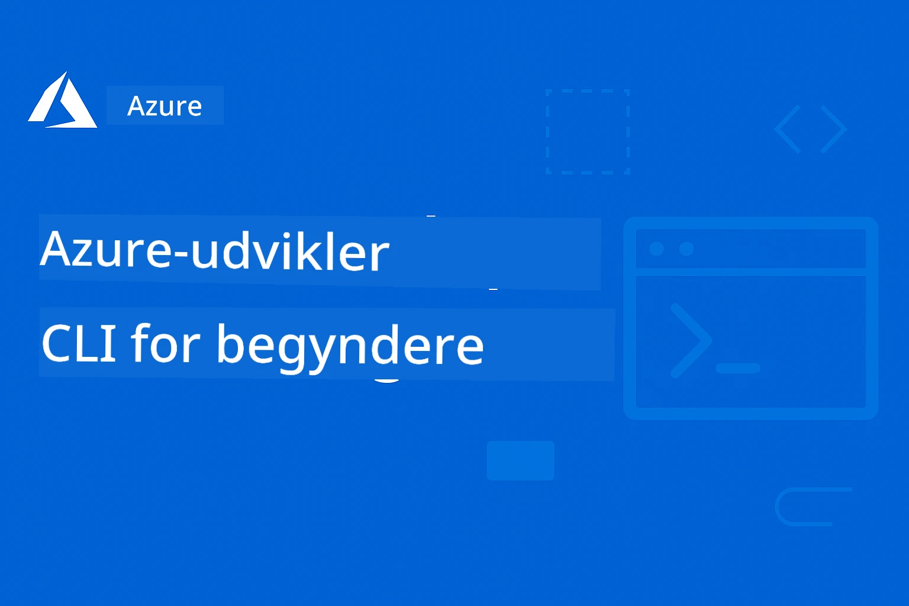

<!--
CO_OP_TRANSLATOR_METADATA:
{
  "original_hash": "068c87cc2641a81ca353ad7064ff326a",
  "translation_date": "2026-01-01T16:22:10+00:00",
  "source_file": "README.md",
  "language_code": "da"
}
-->
# AZD For Beginners: A Structured Learning Journey

 

[](https://GitHub.com/microsoft/azd-for-beginners/watchers/)
[](https://GitHub.com/microsoft/azd-for-beginners/network/)
[](https://GitHub.com/microsoft/azd-for-beginners/stargazers/)

[](https://discord.gg/microsoft-azure)
[](https://discord.gg/nTYy5BXMWG)

## Kom godt i gang med dette kursus

Følg disse trin for at begynde din AZD-læringsrejse:

1. **Lav en fork af repositoryet**: Click [](https://GitHub.com/microsoft/azd-for-beginners/fork)
2. **Klon repositoryet**: `git clone https://github.com/microsoft/azd-for-beginners.git`
3. **Deltag i fællesskabet**: [Azure Discord-fællesskaber](https://discord.com/invite/ByRwuEEgH4) for ekspertstøtte
4. **Vælg din læringsvej**: Vælg et kapitel nedenfor, der matcher dit erfaringsniveau

### Understøttelse af flere sprog

#### Automatiske oversættelser (altid opdaterede)

<!-- CO-OP TRANSLATOR LANGUAGES TABLE START -->
[Arabisk](../ar/README.md) | [Bengali](../bn/README.md) | [Bulgarsk](../bg/README.md) | [Burmesisk (Myanmar)](../my/README.md) | [Kinesisk (forenklet)](../zh/README.md) | [Kinesisk (traditionel, Hongkong)](../hk/README.md) | [Kinesisk (traditionel, Macao)](../mo/README.md) | [Kinesisk (traditionel, Taiwan)](../tw/README.md) | [Kroatisk](../hr/README.md) | [Tjekkisk](../cs/README.md) | [Dansk](./README.md) | [Hollandsk](../nl/README.md) | [Estisk](../et/README.md) | [Finsk](../fi/README.md) | [Fransk](../fr/README.md) | [Tysk](../de/README.md) | [Græsk](../el/README.md) | [Hebraisk](../he/README.md) | [Hindi](../hi/README.md) | [Ungarsk](../hu/README.md) | [Indonesisk](../id/README.md) | [Italiensk](../it/README.md) | [Japansk](../ja/README.md) | [Kannada](../kn/README.md) | [Koreansk](../ko/README.md) | [Litauisk](../lt/README.md) | [Malaysisk](../ms/README.md) | [Malayalam](../ml/README.md) | [Marathi](../mr/README.md) | [Nepali](../ne/README.md) | [Nigerian Pidgin](../pcm/README.md) | [Norsk](../no/README.md) | [Persisk (Farsi)](../fa/README.md) | [Polsk](../pl/README.md) | [Portugisisk (Brasilien)](../br/README.md) | [Portugisisk (Portugal)](../pt/README.md) | [Punjabi (Gurmukhi)](../pa/README.md) | [Rumænsk](../ro/README.md) | [Russisk](../ru/README.md) | [Serbisk (kyrillisk)](../sr/README.md) | [Slovakisk](../sk/README.md) | [Slovensk](../sl/README.md) | [Spansk](../es/README.md) | [Swahili](../sw/README.md) | [Svensk](../sv/README.md) | [Tagalog (filippinsk)](../tl/README.md) | [Tamil](../ta/README.md) | [Telugu](../te/README.md) | [Thai](../th/README.md) | [Tyrkisk](../tr/README.md) | [Ukrainsk](../uk/README.md) | [Urdu](../ur/README.md) | [Vietnamesisk](../vi/README.md)
<!-- CO-OP TRANSLATOR LANGUAGES TABLE END -->

## Kursusoversigt

Bliv ekspert i Azure Developer CLI (azd) gennem strukturerede kapitler designet til progressiv læring. **Særlig fokus på implementering af AI-applikationer med Microsoft Foundry-integration.**

### Hvorfor dette kursus er vigtigt for moderne udviklere

Baseret på indsigter fra Microsoft Foundry Discord-fællesskabet, **ønsker 45% af udviklerne at bruge AZD til AI-workloads**, men støder på udfordringer med:
- Komplekse multi-service AI-arkitekturer
- Bedste praksis for AI-udrulning i produktion  
- Integration og konfiguration af Azure AI-tjenester
- Omkostningsoptimering for AI-workloads
- Fejlfinding af AI-specifikke implementeringsproblemer

### Læringsmål

Ved at gennemføre dette strukturerede kursus vil du:
- **Beherske AZD-grundprincipper**: Kernekoncepter, installation og konfiguration
- **Implementere AI-applikationer**: Brug AZD med Microsoft Foundry-tjenester
- **Implementere Infrastruktur som kode**: Administrer Azure-ressourcer med Bicep-skabeloner
- **Fejlfinding af implementeringer**: Løs almindelige problemer og debug
- **Optimere til produktion**: Sikkerhed, skalering, overvågning og omkostningsstyring
- **Bygge multi-agent-løsninger**: Implementer komplekse AI-arkitekturer

## 📚 Læringskapitler

*Vælg din læringsvej baseret på erfaringsniveau og mål*

### 🚀 Kapitel 1: Grundlæggende & Hurtig start
**Forudsætninger**: Azure-abonnement, grundlæggende kendskab til kommandolinjen  
**Varighed**: 30-45 minutter  
**Kompleksitet**: ⭐

#### Hvad du vil lære
- Forstå Azure Developer CLI-grundprincipper
- Installere AZD på din platform
- Din første succesfulde implementering

#### Læringsressourcer
- **🎯 Start her**: [Hvad er Azure Developer CLI?](../..)
- **📖 Teori**: [AZD Grundlæggende](docs/getting-started/azd-basics.md) - Kernekoncepter og terminologi
- **⚙️ Opsætning**: [Installation & Opsætning](docs/getting-started/installation.md) - Platformsspecifikke guides
- **🛠️ Praktisk**: [Dit første projekt](docs/getting-started/first-project.md) - Trin-for-trin vejledning
- **📋 Hurtig reference**: [Kommando snydeark](resources/cheat-sheet.md)

#### Praktiske øvelser
```bash
# Hurtig installationskontrol
azd version

# Udrul din første applikation
azd init --template todo-nodejs-mongo
azd up
```

**💡 Kapitelresultat**: Implementer en simpel webapplikation til Azure ved hjælp af AZD

**✅ Succesvalidering:**
```bash
# Efter at have gennemført kapitel 1 bør du kunne:
azd version              # Viser den installerede version
azd init --template todo-nodejs-mongo  # Initialiserer projektet
azd up                  # Udruller til Azure
azd show                # Viser URL'en til den kørende app
# Applikationen åbner i browseren og fungerer
azd down --force --purge  # Rydder op i ressourcerne
```

**📊 Tidsinvestering:** 30-45 minutter  
**📈 Færdighedsniveau efter:** Kan implementere grundlæggende applikationer selvstændigt

**✅ Succesvalidering:**
```bash
# Efter at have gennemført Kapitel 1 bør du kunne:
azd version              # Viser den installerede version
azd init --template todo-nodejs-mongo  # Initialiserer projektet
azd up                  # Udruller til Azure
azd show                # Viser URL'en for den kørende app
# Applikationen åbner i browseren og fungerer
azd down --force --purge  # Rydder op i ressourcerne
```

**📊 Tidsinvestering:** 30-45 minutter  
**📈 Færdighedsniveau efter:** Kan implementere grundlæggende applikationer selvstændigt

---

### 🤖 Kapitel 2: AI-først udvikling (Anbefales til AI-udviklere)
**Forudsætninger**: Kapitel 1 gennemført  
**Varighed**: 1-2 timer  
**Kompleksitet**: ⭐⭐

#### Hvad du vil lære
- Microsoft Foundry-integration med AZD
- Implementering af AI-drevne applikationer
- Forståelse af AI-servicekonfigurationer

#### Læringsressourcer
- **🎯 Start her**: [Microsoft Foundry-integration](docs/microsoft-foundry/microsoft-foundry-integration.md)
- **📖 Mønstre**: [AI-modelimplementering](docs/microsoft-foundry/ai-model-deployment.md) - Implementer og administrer AI-modeller
- **🛠️ Workshop**: [AI Workshop Lab](docs/microsoft-foundry/ai-workshop-lab.md) - Gør dine AI-løsninger AZD-klar
- **🎥 Interaktiv guide**: [Workshopmaterialer](workshop/README.md) - Browser-baseret læring med MkDocs * DevContainer-miljø
- **📋 Skabeloner**: [Microsoft Foundry-skabeloner](../..)
- **📝 Eksempler**: [AZD-implementeringseksempler](examples/README.md)

#### Praktiske øvelser
```bash
# Udrul din første AI-applikation
azd init --template azure-search-openai-demo
azd up

# Prøv flere AI-skabeloner
azd init --template openai-chat-app-quickstart
azd init --template agent-openai-python-prompty
```

**💡 Kapitelresultat**: Implementer og konfigurer en AI-drevet chatapplikation med RAG-funktioner

**✅ Succesvalidering:**
```bash
# Efter kapitel 2 bør du kunne:
azd init --template azure-search-openai-demo
azd up
# Teste AI-chatgrænsefladen
# Stille spørgsmål og få AI-drevne svar med kilder
# Bekræft, at søgeintegrationen virker
azd monitor  # Kontroller, at Application Insights viser telemetri
azd down --force --purge
```

**📊 Tidsinvestering:** 1-2 timer  
**📈 Færdighedsniveau efter:** Kan implementere og konfigurere produktionsklare AI-applikationer  
**💰 Bevidsthed om omkostninger:** Forstå udviklingsomkostninger på $80-150/måned, produktionsomkostninger $300-3500/måned

#### 💰 Omkostningsovervejelser for AI-implementeringer

**Udviklingsmiljø (anslået $80-150/måned):**
- Azure OpenAI (Betal efter forbrug): $0-50/måned (baseret på tokenforbrug)
- AI Search (grundniveau): $75/måned
- Container Apps (forbrug): $0-20/måned
- Lagring (Standard): $1-5/måned

**Produktionsmiljø (anslået $300-3,500+/måned):**
- Azure OpenAI (PTU for konsistent ydeevne): $3,000+/måned ELLER Betal efter forbrug ved høj volumen
- AI Search (standardniveau): $250/måned
- Container Apps (dedikeret): $50-100/måned
- Application Insights: $5-50/måned
- Lagring (Premium): $10-50/måned

**💡 Tips til omkostningsoptimering:**
- Brug **Gratislaget** af Azure OpenAI til læring (50.000 tokens/måned inkluderet)
- Kør `azd down` for at frakoble ressourcer, når du ikke aktivt udvikler
- Start med forbrugsbaseret fakturering, opgrader til PTU kun til produktion
- Brug `azd provision --preview` til at estimere omkostninger før implementering
- Aktiver autoskalering: betal kun for faktisk forbrug

**Omkostningsovervågning:**
```bash
# Kontroller anslåede månedlige omkostninger
azd provision --preview

# Overvåg faktiske omkostninger i Azure-portalen
az consumption budget list --resource-group <your-rg>
```

---

### ⚙️ Kapitel 3: Konfiguration & Autentificering
**Forudsætninger**: Kapitel 1 gennemført  
**Varighed**: 45-60 minutter  
**Kompleksitet**: ⭐⭐

#### Hvad du vil lære
- Miljøkonfiguration og -administration
- Autentificering og bedste sikkerhedspraksis
- Ressourcenavne og organisering

#### Læringsressourcer
- **📖 Konfiguration**: [Konfigurationsguide](docs/getting-started/configuration.md) - Miljøopsætning
- **🔐 Sikkerhed**: [Autentificeringsmønstre og administreret identitet](docs/getting-started/authsecurity.md) - Autentificeringsmønstre
- **📝 Eksempler**: [Databaseapp-eksempel](examples/database-app/README.md) - AZD Database-eksempler

#### Praktiske øvelser
- Konfigurer flere miljøer (dev, staging, prod)
- Opsæt autentificering med administreret identitet
- Implementer miljøspecifikke konfigurationer

**💡 Kapitelresultat**: Administrer flere miljøer med korrekt autentificering og sikkerhed

---

### 🏗️ Kapitel 4: Infrastruktur som kode & Udrulning
**Forudsætninger**: Kapitel 1-3 gennemført  
**Varighed**: 1-1.5 timer  
**Kompleksitet**: ⭐⭐⭐

#### Hvad du vil lære
- Avancerede udrulningsmønstre
- Infrastruktur som kode med Bicep
- Strategier for ressourceprovisionering

#### Læringsressourcer
- **📖 Udrulning**: [Udrulningsguide](docs/deployment/deployment-guide.md) - Komplette workflows
- **🏗️ Provisionering**: [Provisionering af ressourcer](docs/deployment/provisioning.md) - Azure-ressourcestyring
- **📝 Eksempler**: [Container-app-eksempel](../../examples/container-app) - Containeriserede udrulninger

#### Praktiske øvelser
- Opret tilpassede Bicep-skabeloner
- Udrul multi-service-applikationer
- Implementer blue-green udrulningsstrategier

**💡 Kapitelresultat**: Udrul komplekse multi-service-applikationer ved hjælp af tilpassede infrastruktur-skabeloner

---

### 🎯 Kapitel 5: Multi-agent AI-løsninger (Avanceret)
**Forudsætninger**: Kapitel 1-2 gennemført  
**Varighed**: 2-3 timer  
**Kompleksitet**: ⭐⭐⭐⭐

#### Hvad du vil lære
- Multi-agent-arkitekturmønstre
- Agentorkestrering og koordinering
- Produktionsklare AI-udrulninger

#### Læringsressourcer
- **🤖 Fremhævet projekt**: [Retail Multi-Agent Solution](examples/retail-scenario.md) - Kompletn implementering
- **🛠️ ARM-skabeloner**: [ARM-skabelonpakke](../../examples/retail-multiagent-arm-template) - Én-klik-implementering
- **📖 Arkitektur**: [Koordineringsmønstre for multi-agent](/docs/pre-deployment/coordination-patterns.md) - Mønstre

#### Praktiske Øvelser
```bash
# Udrul den komplette multiagentløsning til detailhandel
cd examples/retail-multiagent-arm-template
./deploy.sh

# Udforsk agentkonfigurationer
az deployment group show --resource-group <rg-name> --name <deployment-name>
```

**💡 Kapitelresultat**: Udrul og administrer en produktionsklar multi-agent AI-løsning med kunde- og lageragenter

---

### 🔍 Kapitel 6: Forud-udrulningsvalidering og planlægning
**Forudsætninger**: Kapitel 4 gennemført  
**Varighed**: 1 time  
**Kompleksitet**: ⭐⭐

#### Hvad du lærer
- Kapacitetsplanlægning og ressourcevalidering
- Strategier for SKU-udvælgelse
- Forudgående kontrol og automatisering

#### Læringsressourcer
- **📊 Planlægning**: [Kapacitetsplanlægning](docs/pre-deployment/capacity-planning.md) - Ressourcevalidering
- **💰 Udvælgelse**: [SKU-udvælgelse](docs/pre-deployment/sku-selection.md) - Omkostningseffektive valg
- **✅ Validering**: [Pre-flight-kontroller](docs/pre-deployment/preflight-checks.md) - Automatiserede scripts

#### Praktiske Øvelser
- Kør scripts til kapacitetsvalidering
- Optimer SKU-udvælgelse med fokus på omkostninger
- Implementér automatiserede forud-udrulningskontroller

**💡 Kapitelresultat**: Validér og optimér udrulninger før gennemførelse

---

### 🚨 Kapitel 7: Fejlfinding & Fejlsøgning
**Forudsætninger**: Et hvilket som helst udrulningskapitel gennemført  
**Varighed**: 1-1,5 timer  
**Kompleksitet**: ⭐⭐

#### Hvad du lærer
- Systematiske fejlsøgningsmetoder
- Almindelige problemer og løsninger
- AI-specifik fejlfinding

#### Læringsressourcer
- **🔧 Almindelige problemer**: [Almindelige problemer](docs/troubleshooting/common-issues.md) - FAQ og løsninger
- **🕵️ Fejlsøgning**: [Fejlsøgningsguide](docs/troubleshooting/debugging.md) - Trin-for-trin-strategier
- **🤖 AI-problemer**: [AI-specifik fejlfinding](docs/troubleshooting/ai-troubleshooting.md) - Problemstillinger med AI-tjenester

#### Praktiske Øvelser
- Diagnostiser udrulningsfejl
- Løs autentificeringsproblemer
- Fejlsøg forbindelsesproblemer til AI-tjenester

**💡 Kapitelresultat**: Diagnostiser og løs almindelige udrulningsproblemer selvstændigt

---

### 🏢 Kapitel 8: Produktions- og virksomhedsmønstre
**Forudsætninger**: Kapitel 1-4 gennemført  
**Varighed**: 2-3 timer  
**Kompleksitet**: ⭐⭐⭐⭐

#### Hvad du lærer
- Strategier for produktionsudrulning
- Sikkerhedsmønstre for virksomheder
- Overvågning og omkostningsoptimering

#### Læringsressourcer
- **🏭 Produktion**: [Bedste praksis for produktions-AI](docs/microsoft-foundry/production-ai-practices.md) - Virksomhedsmønstre
- **📝 Eksempler**: [Microservices-eksempel](../../examples/microservices) - Komplekse arkitekturer
- **📊 Overvågning**: [Application Insights integration](docs/pre-deployment/application-insights.md) - Overvågning

#### Praktiske Øvelser
- Implementér virksomheds-sikkerhedsmønstre
- Opsæt omfattende overvågning
- Udrul til produktion med korrekt styring

**💡 Kapitelresultat**: Udrul virksomhedsklare applikationer med fulde produktionsfunktioner

---

## 🎓 Workshopoversigt: Praktisk læringserfaring

> **⚠️ WORKSHOP STATUS: Under aktiv udvikling**  
> Workshopmaterialerne er i øjeblikket under udvikling og finpudsning. Kernemodulerne fungerer, men nogle avancerede sektioner er ufuldstændige. Vi arbejder aktivt på at færdiggøre alt indhold. [Følg fremskridt →](workshop/README.md)

### Interaktive workshopmaterialer
**Omfattende hands-on læring med browser-baserede værktøjer og guidede øvelser**

Vores workshopmaterialer tilbyder en struktureret, interaktiv læringsoplevelse, der supplerer det kapitelbaserede pensum ovenfor. Workshoppen er designet både til selvstyret læring og til instruktørledede sessioner.

#### 🛠️ Workshopfunktioner
- **Browser-baseret grænseflade**: Fuldt MkDocs-drevet workshop med søge-, kopi- og tema-funktioner
- **GitHub Codespaces-integration**: Én-klik opsætning af udviklingsmiljø
- **Struktureret læringssti**: 7-trins guidede øvelser (3,5 timer i alt)
- **Opdagelse → Udrulning → Tilpasning**: Progressiv metodologi
- **Interaktiv DevContainer-miljø**: Forudkonfigurerede værktøjer og afhængigheder

#### 📚 Workshopstruktur
Workshoppen følger en **Opdagelse → Udrulning → Tilpasning**-metodologi:

1. **Opdagelsesfase** (45 min)
   - Udforsk Microsoft Foundry-skabeloner og -tjenester
   - Forstå multi-agent arkitekturmønstre
   - Gennemgå udrulningskrav og forudsætninger

2. **Udrulningsfase** (2 timer)
   - Praktisk udrulning af AI-applikationer med AZD
   - Konfigurér Azure AI-tjenester og endpoints
   - Implementér sikkerheds- og autentificeringsmønstre

3. **Tilpasningsfase** (45 min)
   - Tilpas applikationer til specifikke anvendelsestilfælde
   - Optimér til produktionsudrulning
   - Implementér overvågning og omkostningsstyring

#### 🚀 Kom godt i gang med workshoppen
```bash
# Mulighed 1: GitHub Codespaces (Anbefalet)
# Klik på "Code" → "Create codespace on main" i repositoryet

# Mulighed 2: Lokal udvikling
git clone https://github.com/microsoft/azd-for-beginners.git
cd azd-for-beginners/workshop
# Følg opsætningsvejledningen i workshop/README.md
```

#### 🎯 Læringsmål for workshoppen
Ved at gennemføre workshoppen vil deltagerne:
- **Udrul produktions-AI-applikationer**: Brug AZD med Microsoft Foundry-tjenester
- **Behersk multi-agent-arkitekturer**: Implementér koordinerede AI-agentløsninger
- **Implementér bedste sikkerhedspraksis**: Konfigurér autentificering og adgangskontrol
- **Optimér til skala**: Design omkostningseffektive, højtydende udrulninger
- **Fejlfinding af udrulninger**: Løs almindelige problemer selvstændigt

#### 📖 Workshopressourcer
- **🎥 Interaktiv vejledning**: [Workshopmaterialer](workshop/README.md) - Browser-baseret læringsmiljø
- **📋 Trin-for-trin instruktioner**: [Guidede øvelser](../../workshop/docs/instructions) - Detaljerede gennemgange
- **🛠️ AI Workshop Lab**: [AI Workshop Lab](docs/microsoft-foundry/ai-workshop-lab.md) - AI-fokuserede øvelser
- **💡 Kom godt i gang**: [Workshop Setup Guide](workshop/README.md#quick-start) - Miljøkonfiguration

**Perfekt til**: Virksomhedstræning, universitetskurser, selvstyret læring og udvikler-bootcamps.

---

## 📖 Hvad er Azure Developer CLI?

Azure Developer CLI (azd) er en udviklercentreret kommandolinjegrænseflade, der fremskynder processen med at bygge og udrulle applikationer til Azure. Den tilbyder:

- **Skabelonbaserede udrulninger** - Brug forudbyggede skabeloner til almindelige applikationsmønstre
- **Infrastruktur som kode** - Administrer Azure-ressourcer ved hjælp af Bicep eller Terraform  
- **Integrerede arbejdsgange** - Provisér, udrul og overvåg applikationer problemfrit
- **Udviklervenlig** - Optimeret til udviklerproduktivitet og -oplevelse

### **AZD + Microsoft Foundry: Perfekt til AI-udrulninger**

**Hvorfor AZD til AI-løsninger?** AZD tackler de største udfordringer, som AI-udviklere står overfor:

- **AI-klare skabeloner** - Forudkonfigurerede skabeloner til Azure OpenAI, Cognitive Services og ML-workloads
- **Sikre AI-udrulninger** - Indbyggede sikkerhedsmønstre for AI-tjenester, API-nøgler og modelendpoints  
- **Produktions-AI-mønstre** - Bedste praksis for skalerbare, omkostningseffektive AI-applikationsudrulninger
- **End-to-end AI-arbejdsgange** - Fra modeludvikling til produktionsudrulning med korrekt overvågning
- **Omkostningsoptimering** - Smart ressourceallokering og skaleringstrategier for AI-workloads
- **Microsoft Foundry-integration** - Problemfri forbindelse til Microsoft Foundry-modelkataloget og endpoints

---

## 🎯 Skabelon- & eksempelsbibliotek

### Fremhævet: Microsoft Foundry-skabeloner
**Start her, hvis du udruller AI-applikationer!**

> **Bemærk:** Disse skabeloner demonstrerer forskellige AI-mønstre. Nogle er eksterne Azure Samples, andre er lokale implementeringer.

| Skabelon | Kapitel | Kompleksitet | Tjenester | Type |
|----------|---------|------------|----------|------|
| [**Kom godt i gang med AI-chat**](https://github.com/Azure-Samples/get-started-with-ai-chat) | Kapitel 2 | ⭐⭐ | AzureOpenAI + Azure AI Model Inference API + Azure AI Search + Azure Container Apps + Application Insights | Ekstern |
| [**Kom godt i gang med AI-agenter**](https://github.com/Azure-Samples/get-started-with-ai-agents) | Kapitel 2 | ⭐⭐ | Azure AI Agent Service + AzureOpenAI + Azure AI Search + Azure Container Apps + Application Insights| Ekstern |
| [**Azure Search + OpenAI-demo**](https://github.com/Azure-Samples/azure-search-openai-demo) | Kapitel 2 | ⭐⭐ | AzureOpenAI + Azure AI Search + App Service + Storage | Ekstern |
| [**Quickstart til OpenAI Chat App**](https://github.com/Azure-Samples/openai-chat-app-quickstart) | Kapitel 2 | ⭐ | AzureOpenAI + Container Apps + Application Insights | Ekstern |
| [**Agent OpenAI Python Prompty**](https://github.com/Azure-Samples/agent-openai-python-prompty) | Kapitel 5 | ⭐⭐⭐ | AzureOpenAI + Azure Functions + Prompty | Ekstern |
| [**Contoso Chat RAG**](https://github.com/Azure-Samples/contoso-chat) | Kapitel 8 | ⭐⭐⭐⭐ | AzureOpenAI + AI Search + Cosmos DB + Container Apps | Ekstern |
| [**Retail Multi-Agent-løsning**](examples/retail-scenario.md) | Kapitel 5 | ⭐⭐⭐⭐ | AzureOpenAI + AI Search + Storage + Container Apps + Cosmos DB | **Lokal** |

### Fremhævet: Fulde læringsscenarier
**Produktionsklare applikationsskabeloner kortlagt til læringskapitler**

| Skabelon | Læringskapitel | Kompleksitet | Nøglelæring |
|----------|------------------|------------|--------------|
| [**openai-chat-app-quickstart**](https://github.com/Azure-Samples/openai-chat-app-quickstart) | Kapitel 2 | ⭐ | Grundlæggende AI-udrulningsmønstre |
| [**azure-search-openai-demo**](https://github.com/Azure-Samples/azure-search-openai-demo) | Kapitel 2 | ⭐⭐ | RAG-implementering med Azure AI Search |
| [**ai-document-processing**](https://github.com/Azure-Samples/ai-document-processing) | Kapitel 4 | ⭐⭐ | Integration af Document Intelligence |
| [**agent-openai-python-prompty**](https://github.com/Azure-Samples/agent-openai-python-prompty) | Kapitel 5 | ⭐⭐⭐ | Agentframework og function calling |
| [**contoso-chat**](https://github.com/Azure-Samples/contoso-chat) | Kapitel 8 | ⭐⭐⭐ | Enterprise AI-orkestrering |
| [**retail-multi-agent-solution**](examples/retail-scenario.md) | Kapitel 5 | ⭐⭐⭐⭐ | Multi-agent-arkitektur med kunde- og lageragenter |

### Læring efter eksempeltype

> **📌 Lokale vs. eksterne eksempler:**  
> **Lokale eksempler** (i dette repo) = Klar til brug med det samme  
> **Eksterne eksempler** (Azure Samples) = Klon fra de linkede repositories

#### Lokale eksempler (Klar til brug)
- [**Retail Multi-Agent-løsning**](examples/retail-scenario.md) - Færdig produktionsklar implementering med ARM-skabeloner
  - Multi-agent arkitektur (kunde- og lageragenter)
  - Omfattende overvågning og evaluering
  - Én-klik-udrulning via ARM-skabelon

#### Lokale eksempler - Container-applikationer (Kapitler 2-5)
**Omfattende containerimplementeringseksempler i dette repository:**
- [**Container-app-eksempler**](examples/container-app/README.md) - Komplet guide til containeriserede udrulninger
  - [Simpel Flask-API](../../examples/container-app/simple-flask-api) - Basisk REST-API med scale-to-zero
  - [Microservices-arkitektur](../../examples/container-app/microservices) - Produktionsklar multi-service-udrulning
  - Quick Start, Produktion og Avancerede udrulningsmønstre
  - Vejledning i overvågning, sikkerhed og omkostningsoptimering

#### Eksterne eksempler - Simple applikationer (Kapitler 1-2)
**Klon disse Azure Samples repositories for at komme i gang:**
- [Simple Web App - Node.js + MongoDB](https://github.com/Azure-Samples/todo-nodejs-mongo) - Grundlæggende udrulningsmønstre
- [Static Website - React SPA](https://github.com/Azure-Samples/todo-csharp-sql-swa-func) - Statisk indholdsudrulning
- [Container App - Python Flask](https://github.com/Azure-Samples/container-apps-store-api-microservice) - REST API-udrulning

#### Eksterne eksempler - Databaseintegration (Kapitler 3-4)  
- [Database App - C# + SQL](https://github.com/Azure-Samples/todo-csharp-sql) - Databaseforbindelsesmønstre
- [Functions + Cosmos DB](https://github.com/Azure-Samples/todo-python-mongo-swa-func) - Serverless data-arbejdsgang

#### Eksterne eksempler - Avancerede mønstre (Kapitler 4-8)
- [Java Microservices](https://github.com/Azure-Samples/java-microservices-aca-lab) - Multi-service-arkitekturer
- [Container Apps Jobs](https://github.com/Azure-Samples/container-apps-jobs) - Baggrundsbehandling  
- [Enterprise ML Pipeline](https://github.com/Azure-Samples/mlops-v2) - Produktionsklare ML-mønstre

### Eksterne skabelonkollektioner
- [**Officiel AZD Skabelongalleri**](https://azure.github.io/awesome-azd/) - Kurateret samling af officielle og community-skabeloner
- [**Azure Developer CLI-skabeloner**](https://learn.microsoft.com/en-us/azure/developer/azure-developer-cli/azd-templates) - Microsoft Learn skabelondokumentation
- [**Eksempelkatalog**](examples/README.md) - Lokale læringseksempler med detaljerede forklaringer

---

## 📚 Læringsressourcer & Referencer

### Hurtige reference
- [**Command Cheat Sheet**](resources/cheat-sheet.md) - Væsentlige azd-kommandoer organiseret efter kapitel
- [**Glossary**](resources/glossary.md) - Azure og azd-terminologi  
- [**FAQ**](resources/faq.md) - Almindelige spørgsmål organiseret efter læringskapitel
- [**Study Guide**](resources/study-guide.md) - Omfattende øvelser

### Praktiske workshops
- [**AI Workshop Lab**](docs/microsoft-foundry/ai-workshop-lab.md) - Gør dine AI-løsninger deployérbare med AZD (2-3 timer)
- [**Interactive Workshop Guide**](workshop/README.md) - Browser-baseret workshop med MkDocs og DevContainer-miljø
- [**Structured Learning Path**](../../workshop/docs/instructions) -7-trins guidede øvelser (Discovery → Deployment → Customization)
- [**AZD For Beginners Workshop**](workshop/README.md) - Komplette praktiske workshopmaterialer med GitHub Codespaces-integration

### Eksterne læringsressourcer
- [Azure Developer CLI Documentation](https://learn.microsoft.com/en-us/azure/developer/azure-developer-cli/)
- [Azure Architecture Center](https://learn.microsoft.com/en-us/azure/architecture/)
- [Azure Pricing Calculator](https://azure.microsoft.com/pricing/calculator/)
- [Azure Status](https://status.azure.com/)

---

## 🔧 Hurtig fejlfinding

**Almindelige problemer, som begyndere møder, og hurtige løsninger:**

### ❌ "azd: command not found"

```bash
# Installer AZD først
# Windows (PowerShell):
winget install microsoft.azd

# macOS:
brew tap azure/azd && brew install azd

# Linux:
curl -fsSL https://aka.ms/install-azd.sh | bash

# Bekræft installationen
azd version
```

### ❌ "No subscription found" or "Subscription not set"

```bash
# Vis tilgængelige abonnementer
az account list --output table

# Indstil standardabonnement
az account set --subscription "<subscription-id-or-name>"

# Indstil for AZD-miljø
azd env set AZURE_SUBSCRIPTION_ID "<subscription-id>"

# Bekræft
az account show
```

### ❌ "InsufficientQuota" or "Quota exceeded"

```bash
# Prøv en anden Azure-region
azd env set AZURE_LOCATION "westus2"
azd up

# Eller brug mindre SKU'er i udvikling
# Rediger infra/main.parameters.json:
{
  "sku": "B1"  // Instead of "P1V2"
}
```

### ❌ "azd up" fails halfway through

```bash
# Mulighed 1: Rens og prøv igen
azd down --force --purge
azd up

# Mulighed 2: Bare reparer infrastrukturen
azd provision

# Mulighed 3: Tjek detaljerede logfiler
azd show
azd logs
```

### ❌ "Authentication failed" or "Token expired"

```bash
# Autentificer igen
az logout
az login

azd auth logout
azd auth login

# Bekræft autentificering
az account show
```

### ❌ "Resource already exists" or naming conflicts

```bash
# AZD genererer unikke navne, men hvis der opstår konflikt:
azd down --force --purge

# Prøv derefter igen med et nyt miljø
azd env new dev-v2
azd up
```

### ❌ Template deployment taking too long

**Normale ventetider:**
- Simple web app: 5-10 minutter
- App with database: 10-15 minutter
- AI applications: 15-25 minutter (OpenAI provisioning is slow)

```bash
# Tjek fremskridt
azd show

# Hvis fastlåst >30 minutter, tjek Azure-portalen:
azd monitor
# Se efter mislykkede udrulninger
```

### ❌ "Permission denied" or "Forbidden"

```bash
# Kontroller din Azure-rolle
az role assignment list --assignee $(az account show --query user.name -o tsv)

# Du skal som minimum have rollen "Contributor"
# Bed din Azure-administrator om at tildele:
# - Contributor (til ressourcer)
# - User Access Administrator (til tildeling af roller)
```

### ❌ Can't find deployed application URL

```bash
# Vis alle tjenesteendepunkter
azd show

# Eller åbn Azure-portalen
azd monitor

# Kontroller en specifik tjeneste
azd env get-values
# Søg efter *_URL-variabler
```

### 📚 Komplette fejlfindingressourcer

- **Guide til almindelige problemer:** [Detaljerede løsninger](docs/troubleshooting/common-issues.md)
- **AI-specifikke problemer:** [AI-fejlfinding](docs/troubleshooting/ai-troubleshooting.md)
- **Fejlsøgningsguide:** [Fejlsøgning trin for trin](docs/troubleshooting/debugging.md)
- **Få hjælp:** [Azure Discord](https://discord.gg/microsoft-azure) #azure-developer-cli

---

## 🔧 Hurtig fejlfinding

**Almindelige problemer, som begyndere møder, og hurtige løsninger:**

<details>
<summary><strong>❌ "azd: command not found"</strong></summary>

```bash
# Installer AZD først
# Windows (PowerShell):
winget install microsoft.azd

# macOS:
brew tap azure/azd && brew install azd

# Linux:
curl -fsSL https://aka.ms/install-azd.sh | bash

# Bekræft installationen
azd version
```
</details>

<details>
<summary><strong>❌ "No subscription found" or "Subscription not set"</strong></summary>

```bash
# Vis tilgængelige abonnementer
az account list --output table

# Indstil standardabonnement
az account set --subscription "<subscription-id-or-name>"

# Indstil til AZD-miljø
azd env set AZURE_SUBSCRIPTION_ID "<subscription-id>"

# Bekræft
az account show
```
</details>

<details>
<summary><strong>❌ "InsufficientQuota" or "Quota exceeded"</strong></summary>

```bash
# Prøv en anden Azure-region
azd env set AZURE_LOCATION "westus2"
azd up

# Eller brug mindre SKU'er i udvikling
# Rediger infra/main.parameters.json:
{
  "sku": "B1"  // Instead of "P1V2"
}
```
</details>

<details>
<summary><strong>❌ "azd up" fails halfway through</strong></summary>

```bash
# Mulighed 1: Rens og prøv igen
azd down --force --purge
azd up

# Mulighed 2: Bare ret infrastrukturen
azd provision

# Mulighed 3: Tjek detaljerede logfiler
azd show
azd logs
```
</details>

<details>
<summary><strong>❌ "Authentication failed" or "Token expired"</strong></summary>

```bash
# Genautentificer
az logout
az login

azd auth logout
azd auth login

# Bekræft autentificering
az account show
```
</details>

<details>
<summary><strong>❌ "Resource already exists" or naming conflicts</strong></summary>

```bash
# AZD genererer unikke navne, men hvis der opstår konflikt:
azd down --force --purge

# Prøv derefter igen med et nyt miljø
azd env new dev-v2
azd up
```
</details>

<details>
<summary><strong>❌ Template deployment taking too long</strong></summary>

**Normale ventetider:**
- Simple web app: 5-10 minutter
- App with database: 10-15 minutter
- AI applications: 15-25 minutter (OpenAI provisioning is slow)

```bash
# Tjek fremskridt
azd show

# Hvis du sidder fast i mere end 30 minutter, tjek Azure-portalen:
azd monitor
# Se efter mislykkede udrulninger
```
</details>

<details>
<summary><strong>❌ "Permission denied" or "Forbidden"</strong></summary>

```bash
# Kontroller din Azure-rolle
az role assignment list --assignee $(az account show --query user.name -o tsv)

# Du skal som minimum have rollen "Contributor"
# Bed din Azure-administrator om at tildele:
# - Contributor (for ressourcer)
# - User Access Administrator (for tildeling af roller)
```
</details>

<details>
<summary><strong>❌ Can't find deployed application URL</strong></summary>

```bash
# Vis alle serviceendepunkter
azd show

# Eller åbn Azure-portalen
azd monitor

# Kontroller en specifik tjeneste
azd env get-values
# Søg efter *_URL-variabler
```
</details>

### 📚 Komplette fejlfindingressourcer

- **Guide til almindelige problemer:** [Detaljerede løsninger](docs/troubleshooting/common-issues.md)
- **AI-specifikke problemer:** [AI-fejlfinding](docs/troubleshooting/ai-troubleshooting.md)
- **Fejlsøgningsguide:** [Fejlsøgning trin for trin](docs/troubleshooting/debugging.md)
- **Få hjælp:** [Azure Discord](https://discord.gg/microsoft-azure) #azure-developer-cli

---

## 🎓 Kursusafslutning og certificering

### Sporing af fremskridt
Spor dine læringsfremskridt gennem hvert kapitel:

- [ ] **Kapitel 1**: Fundament & Hurtig start ✅
- [ ] **Kapitel 2**: AI-First Development ✅  
- [ ] **Kapitel 3**: Konfiguration & Autentificering ✅
- [ ] **Kapitel 4**: Infrastruktur som kode & Udrulning ✅
- [ ] **Kapitel 5**: Multi-Agent AI Solutions ✅
- [ ] **Kapitel 6**: For-udrulningsvalidering & Planlægning ✅
- [ ] **Kapitel 7**: Fejlfinding & Fejlsøgning ✅
- [ ] **Kapitel 8**: Produktion & Enterprise Patterns ✅

### Bekræftelse af læring
Efter at have gennemført hvert kapitel, verificer din viden ved at:
1. **Praktisk øvelse**: Fuldfør kapitlets praktiske udrulning
2. **Videnstjek**: Gennemgå FAQ-sektionen for dit kapitel
3. **Fællesskabsdiskussion**: Del din oplevelse i Azure Discord
4. **Næste kapitel**: Gå videre til næste kompleksitetsniveau

### Fordele ved kursusafslutning
Efter at have gennemført alle kapitler vil du have:
- **Produktionserfaring**: Udrullet reelle AI-applikationer til Azure
- **Professionelle færdigheder**: Udrulningskompetencer klar til virksomhedsmiljøer  
- **Fællesskabsgenkendelse**: Aktivt medlem af Azure-udviklerfællesskabet
- **Karrierefremme**: Eftertragtet AZD- og AI-udrulningsekspertise

---

## 🤝 Fællesskab & support

### Få hjælp & support
- **Tekniske problemer**: [Rapportér fejl og anmod om funktioner](https://github.com/microsoft/azd-for-beginners/issues)
- **Spørgsmål om læring**: [Microsoft Azure Discord-fællesskab](https://discord.gg/microsoft-azure) and [](https://discord.gg/nTYy5BXMWG)
- **AI-specifik hjælp**: Join the [](https://discord.gg/nTYy5BXMWG)
- **Dokumentation**: [Officiel Azure Developer CLI documentation](https://learn.microsoft.com/en-us/azure/developer/azure-developer-cli/)

### Fællesskabsindsigt fra Microsoft Foundry Discord

**Seneste afstemningsresultater fra #Azure-kanalen:**
- **45%** af udviklere ønsker at bruge AZD til AI-workloads
- **Topudfordringer**: Udrulning af flere tjenester, håndtering af legitimationsoplysninger, produktionsparathed  
- **Mest efterspurgte**: AI-specifikke skabeloner, fejlfindingvejledninger, bedste praksis

**Deltag i vores fællesskab for at:**
- Del dine AZD + AI-oplevelser og få hjælp
- Få adgang til tidlige previews af nye AI-skabeloner
- Bidrag til bedste praksis for AI-udrulning
- Påvirk fremtidig udvikling af AI + AZD-funktioner

### Bidrag til kurset
Vi byder bidrag velkomne! Læs venligst vores [Contributing Guide](CONTRIBUTING.md) for detaljer om:
- **Forbedring af indhold**: Forbedr eksisterende kapitler og eksempler
- **Nye eksempler**: Tilføj virkelige scenarier og skabeloner  
- **Oversættelse**: Hjælp med at vedligeholde flersproget support
- **Fejlrapporter**: Forbedr nøjagtighed og klarhed
- **Fællesskabsstandarder**: Følg vores inclusive retningslinjer

---

## 📄 Kursusinformation

### Licens
Dette projekt er licenseret under MIT-licensen - se filen [LICENSE](../../LICENSE) for detaljer.

### Relaterede Microsoft-læringsressourcer

Vores team producerer andre omfattende læringskurser:

<!-- CO-OP TRANSLATOR OTHER COURSES START -->
### LangChain
[](https://aka.ms/langchain4j-for-beginners)
[](https://aka.ms/langchainjs-for-beginners?WT.mc_id=m365-94501-dwahlin)

---

### Azure / Edge / MCP / Agents
[](https://github.com/microsoft/AZD-for-beginners?WT.mc_id=academic-105485-koreyst)
[](https://github.com/microsoft/edgeai-for-beginners?WT.mc_id=academic-105485-koreyst)
[](https://github.com/microsoft/mcp-for-beginners?WT.mc_id=academic-105485-koreyst)
[](https://github.com/microsoft/ai-agents-for-beginners?WT.mc_id=academic-105485-koreyst)

---
 
### Generative AI Series
[](https://github.com/microsoft/generative-ai-for-beginners?WT.mc_id=academic-105485-koreyst)
[-9333EA?style=for-the-badge&labelColor=E5E7EB&color=9333EA)](https://github.com/microsoft/Generative-AI-for-beginners-dotnet?WT.mc_id=academic-105485-koreyst)
[-C084FC?style=for-the-badge&labelColor=E5E7EB&color=C084FC)](https://github.com/microsoft/generative-ai-for-beginners-java?WT.mc_id=academic-105485-koreyst)
[-E879F9?style=for-the-badge&labelColor=E5E7EB&color=E879F9)](https://github.com/microsoft/generative-ai-with-javascript?WT.mc_id=academic-105485-koreyst)

---
 
### Core Learning
[](https://aka.ms/ml-beginners?WT.mc_id=academic-105485-koreyst)
[](https://aka.ms/datascience-beginners?WT.mc_id=academic-105485-koreyst)
[](https://aka.ms/ai-beginners?WT.mc_id=academic-105485-koreyst)
[](https://github.com/microsoft/Security-101?WT.mc_id=academic-96948-sayoung)
[](https://aka.ms/webdev-beginners?WT.mc_id=academic-105485-koreyst)
[](https://aka.ms/iot-beginners?WT.mc_id=academic-105485-koreyst)
[](https://github.com/microsoft/xr-development-for-beginners?WT.mc_id=academic-105485-koreyst)

---
 
### Copilot-serien
[](https://aka.ms/GitHubCopilotAI?WT.mc_id=academic-105485-koreyst)
[](https://github.com/microsoft/mastering-github-copilot-for-dotnet-csharp-developers?WT.mc_id=academic-105485-koreyst)
[](https://github.com/microsoft/CopilotAdventures?WT.mc_id=academic-105485-koreyst)
<!-- CO-OP TRANSLATOR OTHER COURSES END -->

---

## 🗺️ Kursusnavigation

**🚀 Klar til at begynde at lære?**

**Begyndere**: Start med [Kapitel 1: Grundlag & Hurtig start](../..)  
**AI-udviklere**: Gå til [Kapitel 2: AI-først udvikling](../..)  
**Erfarne udviklere**: Begynd med [Kapitel 3: Konfiguration & Autentificering](../..)

**Næste skridt**: [Begynd Kapitel 1 - AZD-grundlæggende](docs/getting-started/azd-basics.md) →

---

<!-- CO-OP TRANSLATOR DISCLAIMER START -->
Ansvarsfraskrivelse:
Dette dokument er blevet oversat ved hjælp af AI-oversættelsestjenesten Co-op Translator (https://github.com/Azure/co-op-translator). Selvom vi bestræber os på nøjagtighed, bedes du være opmærksom på, at automatiske oversættelser kan indeholde fejl eller unøjagtigheder. Det oprindelige dokument på sit oprindelige sprog bør betragtes som den autoritative kilde. For kritisk information anbefales en professionel menneskelig oversættelse. Vi kan ikke drages til ansvar for eventuelle misforståelser eller fejltolkninger som følge af brugen af denne oversættelse.
<!-- CO-OP TRANSLATOR DISCLAIMER END -->