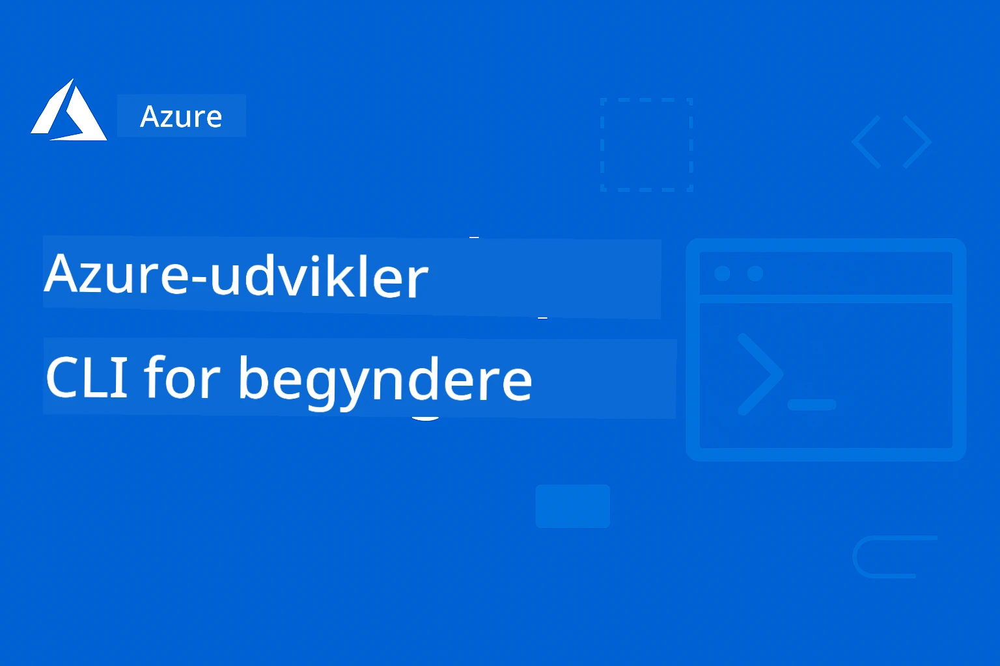

# AZD for begyndere: En struktureret læringsrejse

 

[](https://GitHub.com/microsoft/azd-for-beginners/watchers/)
[](https://GitHub.com/microsoft/azd-for-beginners/network/)
[](https://GitHub.com/microsoft/azd-for-beginners/stargazers/)

[](https://discord.gg/microsoft-azure)
[](https://discord.gg/nTYy5BXMWG)

---

### Automatiske oversættelser (Altid opdateret)

<!-- CO-OP TRANSLATOR LANGUAGES TABLE START -->
[Arabisk](../ar/README.md) | [Bengali](../bn/README.md) | [Bulgarsk](../bg/README.md) | [Burmesisk (Myanmar)](../my/README.md) | [Kinesisk (Forenklet)](../zh-CN/README.md) | [Kinesisk (Traditionelt, Hongkong)](../zh-HK/README.md) | [Kinesisk (Traditionelt, Macau)](../zh-MO/README.md) | [Kinesisk (Traditionelt, Taiwan)](../zh-TW/README.md) | [Kroatisk](../hr/README.md) | [Tjekkisk](../cs/README.md) | [Dansk](./README.md) | [Hollandsk](../nl/README.md) | [Estisk](../et/README.md) | [Finsk](../fi/README.md) | [Fransk](../fr/README.md) | [Tysk](../de/README.md) | [Græsk](../el/README.md) | [Hebraisk](../he/README.md) | [Hindi](../hi/README.md) | [Ungarsk](../hu/README.md) | [Indonesisk](../id/README.md) | [Italiensk](../it/README.md) | [Japansk](../ja/README.md) | [Kannada](../kn/README.md) | [Koreansk](../ko/README.md) | [Litauisk](../lt/README.md) | [Malayisk](../ms/README.md) | [Malayalam](../ml/README.md) | [Marathi](../mr/README.md) | [Nepali](../ne/README.md) | [Nigeriansk Pidgin](../pcm/README.md) | [Norsk](../no/README.md) | [Persisk (Farsi)](../fa/README.md) | [Polsk](../pl/README.md) | [Portugisisk (Brasilien)](../pt-BR/README.md) | [Portugisisk (Portugal)](../pt-PT/README.md) | [Punjabi (Gurmukhi)](../pa/README.md) | [Rumænsk](../ro/README.md) | [Russisk](../ru/README.md) | [Serbisk (Cyrillic)](../sr/README.md) | [Slovakisk](../sk/README.md) | [Slovensk](../sl/README.md) | [Spansk](../es/README.md) | [Swahili](../sw/README.md) | [Svensk](../sv/README.md) | [Tagalog (Filipino)](../tl/README.md) | [Tamil](../ta/README.md) | [Telugu](../te/README.md) | [Thai](../th/README.md) | [Tyrkisk](../tr/README.md) | [Ukrainsk](../uk/README.md) | [Urdu](../ur/README.md) | [Vietnamesisk](../vi/README.md)

> **Foretrækker du at klone lokalt?**
>
> Dette repository indeholder 50+ sprogoversættelser, hvilket øger downloadstørrelsen væsentligt. For at klone uden oversættelser, brug sparse checkout:
>
> **Bash / macOS / Linux:**
> ```bash
> git clone --filter=blob:none --sparse https://github.com/microsoft/AZD-for-beginners.git
> cd AZD-for-beginners
> git sparse-checkout set --no-cone '/*' '!translations' '!translated_images'
> ```
>
> **CMD (Windows):**
> ```cmd
> git clone --filter=blob:none --sparse https://github.com/microsoft/AZD-for-beginners.git
> cd AZD-for-beginners
> git sparse-checkout set --no-cone "/*" "!translations" "!translated_images"
> ```
>
> Dette giver dig alt, hvad du behøver for at gennemføre kurset med en meget hurtigere download.
<!-- CO-OP TRANSLATOR LANGUAGES TABLE END -->

## 🆕 Hvad er nyt i azd i dag

Azure Developer CLI har udviklet sig ud over traditionelle webapps og API'er. I dag er azd det eneste værktøj til at udrulle enhver applikation til Azure — inklusive AI-drevne applikationer og intelligente agenter.

Det betyder følgende for dig:

- **AI-agenter er nu first-class azd-workloads.** Du kan initialisere, udrulle og administrere AI-agentprojekter ved hjælp af den samme `azd init` → `azd up` arbejdsgang, du allerede kender.
- **Microsoft Foundry-integration** bringer modeludrulning, agent-hosting og AI-tjenestekonfiguration direkte ind i azd-skabelonøkosystemet.
- **Kernearbejdsgangen er ikke ændret.** Uanset om du udruller en todo-app, en microservice eller en multi-agent AI-løsning, er kommandoerne de samme.

Hvis du har brugt azd før, er AI-support en naturlig forlængelse — ikke et separat værktøj eller et avanceret spor. Hvis du starter fra bunden, lærer du én arbejdsgang, der fungerer for alting.

---

## 🚀 Hvad er Azure Developer CLI (azd)?

**Azure Developer CLI (azd)** er et udviklervenligt kommandolinjeværktøj, der gør det enkelt at udrulle applikationer til Azure. I stedet for manuelt at oprette og forbinde dusinvis af Azure-ressourcer, kan du udrulle hele applikationer med en enkelt kommando.

### Magien ved `azd up`

```bash
# Denne enkeltkommando gør alt:
# ✅ Opretter alle Azure-ressourcer
# ✅ Konfigurerer netværk og sikkerhed
# ✅ Bygger din applikationskode
# ✅ Udruller til Azure
# ✅ Giver dig en fungerende URL
azd up
```

**Så enkelt er det!** Ingen klik i Azure-portalen, ingen komplekse ARM-skabeloner at lære først, ingen manuel konfiguration - bare fungerende applikationer på Azure.

---

## ❓ Azure Developer CLI vs Azure CLI: Hvad er forskellen?

Dette er det mest almindelige spørgsmål, begyndere stiller. Her er det enkle svar:

| Feature | **Azure CLI (`az`)** | **Azure Developer CLI (`azd`)** |
|---------|---------------------|--------------------------------|
| **Purpose** | Administrere individuelle Azure-ressourcer | Udrulle komplette applikationer |
| **Mindset** | Infrastrukturfokuseret | Applikationsfokuseret |
| **Example** | `az webapp create --name myapp...` | `azd up` |
| **Learning Curve** | Kræver kendskab til Azure-tjenester | Kend bare din app |
| **Best For** | DevOps, Infrastruktur | Udviklere, Prototyping |

### Simpel analogi

- **Azure CLI** er som at have alle værktøjerne til at bygge et hus - hamre, save, søm. Du kan bygge hvad som helst, men du skal kende byggeri.
- **Azure Developer CLI** er som at hyre en entreprenør - du beskriver, hvad du vil have, og de håndterer byggeriet.

### Hvornår man bruger hver

| Scenario | Use This |
|----------|----------|
| "I want to deploy my web app quickly" | `azd up` |
| "I need to create just a storage account" | `az storage account create` |
| "I'm building a full AI application" | `azd init --template azure-search-openai-demo` |
| "I need to debug a specific Azure resource" | `az resource show` |
| "I want production-ready deployment in minutes" | `azd up --environment production` |

### De fungerer sammen!

AZD bruger Azure CLI under motorhjelmen. Du kan bruge begge:
```bash
# Udrul din app med AZD
azd up

# Finjuster derefter specifikke ressourcer med Azure CLI
az webapp config set --name myapp --always-on true
```

---

## 🌟 Find skabeloner i Awesome AZD

Start ikke fra bunden! **Awesome AZD** er fællesskabets samling af klar-til-udrulning-skabeloner:

| Ressource | Beskrivelse |
|----------|-------------|
| 🔗 [**Awesome AZD Gallery**](https://azure.github.io/awesome-azd/) | Gennemse 200+ skabeloner og udrul med ét klik |
| 🔗 [**Indsend en skabelon**](https://github.com/Azure/awesome-azd/issues) | Bidrag med din egen skabelon til fællesskabet |
| 🔗 [**GitHub Repository**](https://github.com/Azure/awesome-azd) | Giv en stjerne og udforsk koden |

### Populære AI-skabeloner fra Awesome AZD

```bash
# RAG-chat med Microsoft Foundry-modeller + AI-søgning
azd init --template azure-search-openai-demo

# Hurtig AI-chat-applikation
azd init --template openai-chat-app-quickstart

# AI-agenter med Foundry-agenter
azd init --template get-started-with-ai-agents
```

---

## 🎯 Kom godt i gang på 3 trin

### Trin 1: Installer AZD (2 minutter)

**Windows:**
```powershell
winget install microsoft.azd
```

**macOS:**
```bash
brew tap azure/azd && brew install azd
```

**Linux:**
```bash
curl -fsSL https://aka.ms/install-azd.sh | bash
```

### Trin 2: Log ind på Azure

```bash
azd auth login
```

### Trin 3: Udrul din første app

```bash
# Initialiser fra en skabelon
azd init --template todo-nodejs-mongo

# Udrul til Azure (opretter alt!)
azd up
```

**🎉 Det var det!** Din app er nu live på Azure.

### Ryd op (Glem ikke!)

```bash
# Remove all resources when done experimenting
azd down --force --purge
```

---

## 📚 Sådan bruger du dette kursus

Dette kursus er designet til **progressiv læring** - start hvor du er tryg, og arbejd dig op:

| Din erfaring | Start her |
|-----------------|------------|
| **Helt ny i Azure** | [Kapitel 1: Grundlag](#-chapter-1-foundation--quick-start) |
| **Kender Azure, ny til AZD** | [Kapitel 1: Grundlag](#-chapter-1-foundation--quick-start) |
| **Vil udrulle AI-apps** | [Kapitel 2: AI-først udvikling](#-chapter-2-ai-first-development-recommended-for-ai-developers) |
| **Vil have praktisk øvelse** | [🎓 Interaktiv workshop](workshop/README.md) - 3-4 timers guidet lab |
| **Har brug for produktionsmønstre** | [Kapitel 8: Produktion & Enterprise](#-chapter-8-production--enterprise-patterns) |

### Hurtig opsætning

1. **Lav en fork af dette repository**: [](https://GitHub.com/microsoft/azd-for-beginners/fork)
2. **Klon det**: `git clone https://github.com/YOUR-USERNAME/azd-for-beginners.git`
3. **Få hjælp**: [Azure Discord-fællesskabet](https://discord.com/invite/ByRwuEEgH4)

> **Foretrækker du at klone lokalt?**
>
> Dette repository indeholder 50+ sprogoversættelser, hvilket øger downloadstørrelsen væsentligt. For at klone uden oversættelser, brug sparse checkout:
> ```bash
> git clone --filter=blob:none --sparse https://github.com/microsoft/AZD-for-beginners.git
> cd AZD-for-beginners
> git sparse-checkout set --no-cone '/*' '!translations' '!translated_images'
> ```
> Dette giver dig alt, hvad du behøver for at gennemføre kurset med en meget hurtigere download.


## Kursusoversigt

Mestre Azure Developer CLI (azd) gennem strukturerede kapitler designet til progressiv læring. **Særligt fokus på udrulning af AI-applikationer med Microsoft Foundry-integration.**

### Hvorfor dette kursus er vigtigt for moderne udviklere

Baseret på indsigter fra Microsoft Foundry Discord-fællesskabet ønsker **45% af udviklerne at bruge AZD til AI-workloads**, men møder udfordringer med:
- Komplekse multi-service AI-arkitekturer
- Bedste praksis for AI-udrulning i produktion  
- Integration og konfiguration af Azure AI-tjenester
- Omkostningsoptimering for AI-workloads
- Fejlfinding af AI-specifikke udrulningsproblemer

### Læringsmål

Ved at gennemføre dette strukturerede kursus vil du:
- **Mestre AZD's grundprincipper**: Kernekoncepter, installation og konfiguration
- **Udrulle AI-applikationer**: Brug AZD med Microsoft Foundry-tjenester
- **Implementere Infrastructure as Code**: Administrer Azure-ressourcer med Bicep-skabeloner
- **Fejlsøge udrulninger**: Løse almindelige problemer og fejlrette
- **Optimere til produktion**: Sikkerhed, skalering, overvågning og omkostningsstyring
- **Bygge multi-agent løsninger**: Udrulle komplekse AI-arkitekturer

## 🗺️ Kursuskort: Hurtig navigation efter kapitel

Hvert kapitel har en dedikeret README med læringsmål, hurtigstart og øvelser:

| Kapitel | Emne | Lektioner | Varighed | Kompleksitet |
|---------|-------|---------|----------|------------|
| **[Kapitel 1: Grundlag](docs/chapter-01-foundation/README.md)** | Kom godt i gang | [AZD-grundlæggende](docs/chapter-01-foundation/azd-basics.md) &#124; [Installation](docs/chapter-01-foundation/installation.md) &#124; [Første projekt](docs/chapter-01-foundation/first-project.md) | 30-45 min | ⭐ |
| **[Kap. 2: AI-udvikling](docs/chapter-02-ai-development/README.md)** | AI-første apps | [Foundry Integration](docs/chapter-02-ai-development/microsoft-foundry-integration.md) &#124; [AI Agents](docs/chapter-02-ai-development/agents.md) &#124; [Model Deployment](docs/chapter-02-ai-development/ai-model-deployment.md) &#124; [Workshop](docs/chapter-02-ai-development/ai-workshop-lab.md) | 1-2 hrs | ⭐⭐ |
| **[Kap. 3: Konfiguration](docs/chapter-03-configuration/README.md)** | Autentificering & sikkerhed | [Configuration](docs/chapter-03-configuration/configuration.md) &#124; [Auth & Security](docs/chapter-03-configuration/authsecurity.md) | 45-60 min | ⭐⭐ |
| **[Kap. 4: Infrastruktur](docs/chapter-04-infrastructure/README.md)** | IaC & Udrulning | [Deployment Guide](docs/chapter-04-infrastructure/deployment-guide.md) &#124; [Provisioning](docs/chapter-04-infrastructure/provisioning.md) | 1-1.5 hrs | ⭐⭐⭐ |
| **[Kap. 5: Multi-Agent](docs/chapter-05-multi-agent/README.md)** | AI Agent Løsninger | [Retail Scenario](examples/retail-scenario.md) &#124; [Coordination Patterns](docs/chapter-06-pre-deployment/coordination-patterns.md) | 2-3 hrs | ⭐⭐⭐⭐ |
| **[Kap. 6: Forud-udrulning](docs/chapter-06-pre-deployment/README.md)** | Planlægning & Validering | [Preflight Checks](docs/chapter-06-pre-deployment/preflight-checks.md) &#124; [Capacity Planning](docs/chapter-06-pre-deployment/capacity-planning.md) &#124; [SKU Selection](docs/chapter-06-pre-deployment/sku-selection.md) &#124; [App Insights](docs/chapter-06-pre-deployment/application-insights.md) | 1 hr | ⭐⭐ |
| **[Kap. 7: Fejlfinding](docs/chapter-07-troubleshooting/README.md)** | Debug & Løs | [Common Issues](docs/chapter-07-troubleshooting/common-issues.md) &#124; [Debugging](docs/chapter-07-troubleshooting/debugging.md) &#124; [AI Issues](docs/chapter-07-troubleshooting/ai-troubleshooting.md) | 1-1.5 hrs | ⭐⭐ |
| **[Kap. 8: Produktion](docs/chapter-08-production/README.md)** | Enterprise Mønstre | [Production Practices](docs/chapter-08-production/production-ai-practices.md) | 2-3 hrs | ⭐⭐⭐⭐ |
| **[🎓 Workshop](workshop/README.md)** | Hands-On Lab | [Introduction](workshop/docs/instructions/0-Introduction.md) &#124; [Selection](workshop/docs/instructions/1-Select-AI-Template.md) &#124; [Validation](workshop/docs/instructions/2-Validate-AI-Template.md) &#124; [Deconstruction](workshop/docs/instructions/3-Deconstruct-AI-Template.md) &#124; [Configuration](workshop/docs/instructions/4-Configure-AI-Template.md) &#124; [Customization](workshop/docs/instructions/5-Customize-AI-Template.md) &#124; [Teardown](workshop/docs/instructions/6-Teardown-Infrastructure.md) &#124; [Wrap-up](workshop/docs/instructions/7-Wrap-up.md) | 3-4 hrs | ⭐⭐ |

**Samlet kursusvarighed:** ~10-14 timer | **Kompetenceudvikling:** Beginner → Production-Ready

---

## 📚 Læringskapitler

*Vælg din læringssti baseret på erfaringsniveau og mål*

### 🚀 Kapitel 1: Grundlag & Hurtigstart
**Forudsætninger**: Azure-abonnement, grundlæggende kendskab til kommandolinjen  
**Varighed**: 30-45 minutter  
**Kompleksitet**: ⭐

#### Hvad du vil lære
- Forstå grundlæggende Azure Developer CLI
- Installere AZD på din platform
- Din første succesfulde udrulning

#### Læringsressourcer
- **🎯 Start her**: [What is Azure Developer CLI?](#what-is-azure-developer-cli)
- **📖 Teori**: [AZD Basics](docs/chapter-01-foundation/azd-basics.md) - Kernekoncepter og terminologi
- **⚙️ Opsætning**: [Installation & Setup](docs/chapter-01-foundation/installation.md) - Platform-specifikke vejledninger
- **🛠️ Praktisk**: [Your First Project](docs/chapter-01-foundation/first-project.md) - Trin-for-trin vejledning
- **📋 Hurtig reference**: [Command Cheat Sheet](resources/cheat-sheet.md)

#### Praktiske øvelser
```bash
# Hurtig installationskontrol
azd version

# Udrul din første applikation
azd init --template todo-nodejs-mongo
azd up
```

**💡 Kapitelresultat**: Udrul en simpel webapplikation til Azure ved hjælp af AZD

**✅ Validering af succes:**
```bash
# Efter at have gennemført Kapitel 1 bør du kunne:
azd version              # Viser den installerede version
azd init --template todo-nodejs-mongo  # Initialiserer projektet
azd up                  # Udruller til Azure
azd show                # Viser URL'en til den kørende app
# Applikationen åbner i browseren og fungerer
azd down --force --purge  # Rydder op i ressourcerne
```

**📊 Tidsforbrug:** 30-45 minutter  
**📈 Færdighedsniveau efter:** Kan selvstændigt udrulle grundlæggende applikationer
**📈 Færdighedsniveau efter:** Kan selvstændigt udrulle grundlæggende applikationer

---

### 🤖 Kapitel 2: AI-først udvikling (Anbefalet for AI-udviklere)
**Forudsætninger**: Kapitel 1 gennemført  
**Varighed**: 1-2 timer  
**Kompleksitet**: ⭐⭐

#### Hvad du vil lære
- Microsoft Foundry-integration med AZD
- Udrulning af AI-drevne applikationer
- Forståelse af AI-tjenestekonfigurationer

#### Læringsressourcer
- **🎯 Start her**: [Microsoft Foundry Integration](docs/chapter-02-ai-development/microsoft-foundry-integration.md)
- **🤖 AI-agenter**: [AI Agents Guide](docs/chapter-02-ai-development/agents.md) - Udrul intelligente agenter med AZD
- **📖 Mønstre**: [AI Model Deployment](docs/chapter-02-ai-development/ai-model-deployment.md) - Udrul og administrer AI-modeller
- **🛠️ Workshop**: [AI Workshop Lab](docs/chapter-02-ai-development/ai-workshop-lab.md) - Gør dine AI-løsninger klar til AZD
- **🎥 Interaktiv guide**: [Workshop Materials](workshop/README.md) - Browserbaseret læring med MkDocs * DevContainer Environment
- **📋 Skabeloner**: [Microsoft Foundry Templates](#dybdegående-azd-funktioner)
- **📝 Eksempler**: [AZD Deployment Examples](examples/README.md)

#### Praktiske øvelser
```bash
# Udrul din første AI-applikation
azd init --template azure-search-openai-demo
azd up

# Prøv flere AI-skabeloner
azd init --template openai-chat-app-quickstart
azd init --template agent-openai-python-prompty
```

**💡 Kapitelresultat**: Udrul og konfigurer en AI-drevet chatapplikation med RAG-funktioner

**✅ Validering af succes:**
```bash
# Efter kapitel 2 skal du kunne:
azd init --template azure-search-openai-demo
azd up
# Teste AI-chatgrænsefladen
# Stil spørgsmål og få AI-drevne svar med kilder
# Bekræft, at søgeintegrationen fungerer
azd monitor  # Kontroller, at Application Insights viser telemetri
azd down --force --purge
```

**📊 Tidsforbrug:** 1-2 timer  
**📈 Færdighedsniveau efter:** Kan udrulle og konfigurere produktionsklare AI-applikationer  
**💰 Omkostningsbevidsthed:** Forstå udviklingsomkostninger på $80-150 pr. måned, produktionsomkostninger på $300-3500 pr. måned

#### 💰 Omkostningsovervejelser for AI-udrulninger

**Udviklingsmiljø (estimeret $80-150 pr. måned):**
- Microsoft Foundry Models (Pay-as-you-go): $0-50 pr. måned (afhænger af tokenforbrug)
- AI Search (Basic tier): $75 pr. måned
- Container Apps (Consumption): $0-20 pr. måned
- Storage (Standard): $1-5 pr. måned

**Produktionsmiljø (estimeret $300-3.500+/pr. måned):**
- Microsoft Foundry Models (PTU for consistent performance): $3.000+/pr. måned ELLER Pay-as-you-go ved højt forbrug
- AI Search (Standard tier): $250 pr. måned
- Container Apps (Dedicated): $50-100 pr. måned
- Application Insights: $5-50 pr. måned
- Storage (Premium): $10-50 pr. måned

**💡 Tips til omkostningsoptimering:**
- Brug **Free Tier** Microsoft Foundry Models til læring (Azure OpenAI 50.000 tokens pr. måned inkluderet)
- Kør `azd down` for at frigøre ressourcer, når du ikke aktivt udvikler
- Start med forbrugbaseret fakturering, opgrader til PTU kun til produktion
- Brug `azd provision --preview` til at estimere omkostninger før udrulning
- Aktivér autoskalering: betal kun for faktisk brug

**Omkostningsovervågning:**
```bash
# Kontroller anslåede månedlige omkostninger
azd provision --preview

# Overvåg de faktiske omkostninger i Azure-portalen
az consumption budget list --resource-group <your-rg>
```

---

### ⚙️ Kapitel 3: Konfiguration & autentificering
**Forudsætninger**: Kapitel 1 gennemført  
**Varighed**: 45-60 minutter  
**Kompleksitet**: ⭐⭐

#### Hvad du vil lære
- Miljøkonfiguration og -styring
- Autentificering og sikkerhedsbedste praksis
- Navngivning og organisering af ressourcer

#### Læringsressourcer
- **📖 Konfiguration**: [Configuration Guide](docs/chapter-03-configuration/configuration.md) - Miljøopsætning
- **🔐 Sikkerhed**: [Authentication patterns and managed identity](docs/chapter-03-configuration/authsecurity.md) - Autentificeringsmønstre
- **📝 Eksempler**: [Database App Example](examples/database-app/README.md) - AZD databaseeksempler

#### Praktiske øvelser
- Konfigurer flere miljøer (dev, staging, prod)
- Opsæt managed identity-autentificering
- Implementér miljøspecifikke konfigurationer

**💡 Kapitelresultat**: Administrer flere miljøer med korrekt autentificering og sikkerhed

---

### 🏗️ Kapitel 4: Infrastruktur som kode & udrulning
**Forudsætninger**: Kapitel 1-3 gennemført  
**Varighed**: 1-1,5 timer  
**Kompleksitet**: ⭐⭐⭐

#### Hvad du vil lære
- Avancerede udrulningsmønstre
- Infrastruktur som kode med Bicep
- Strategier for ressourceprovisionering

#### Læringsressourcer
- **📖 Udrulning**: [Deployment Guide](docs/chapter-04-infrastructure/deployment-guide.md) - Fuldstændige arbejdsstrømme
- **🏗️ Provisionering**: [Provisioning Resources](docs/chapter-04-infrastructure/provisioning.md) - Azure resourcestyring
- **📝 Eksempler**: [Container App Example](../../examples/container-app) - Containeriserede udrulninger

#### Praktiske øvelser
- Opret tilpassede Bicep-skabeloner
- Udrul multi-service-applikationer
- Implementér blue-green udrulningsstrategier

**💡 Kapitelresultat**: Udrul komplekse multi-service-applikationer ved hjælp af tilpassede infrastrukturskabeloner

---

### 🎯 Kapitel 5: Multi-agent AI-løsninger (Avanceret)
**Forudsætninger**: Kapitel 1-2 gennemført  
**Varighed**: 2-3 timer  
**Kompleksitet**: ⭐⭐⭐⭐

#### Hvad du vil lære
- Mønstre for multi-agent-arkitektur
- Agentorkestrering og koordinering
- Produktionsklare AI-udrulninger

#### Læringsressourcer
- **🤖 Fremhævet projekt**: [Retail Multi-Agent Solution](examples/retail-scenario.md) - Fuld implementering
- **🛠️ ARM-skabeloner**: [ARM Template Package](../../examples/retail-multiagent-arm-template) - Én-klik-udrulning
- **📖 Arkitektur**: [Multi-agent coordination patterns](docs/chapter-06-pre-deployment/coordination-patterns.md) - Mønstre

#### Praktiske øvelser
```bash
# Udrul den komplette multiagent-løsning til detailhandel
cd examples/retail-multiagent-arm-template
./deploy.sh

# Udforsk agentkonfigurationer
az deployment group show --resource-group <rg-name> --name <deployment-name>
```

**💡 Kapitelresultat**: Udrul og administrer en produktionsklar multi-agent AI-løsning med Customer- og Inventory-agenter

---

### 🔍 Kapitel 6: Forudgående validering & planlægning
**Forudsætninger**: Kapitel 4 gennemført  
**Varighed**: 1 time  
**Kompleksitet**: ⭐⭐

#### Hvad du vil lære
- Kapacitetsplanlægning og ressourcevalidering
- SKU-valgsstrategier
- Forudkørselskontroller og automatisering

#### Læringsressourcer
- **📊 Planlægning**: [Capacity Planning](docs/chapter-06-pre-deployment/capacity-planning.md) - Ressourcevalidering
- **💰 Valg**: [SKU Selection](docs/chapter-06-pre-deployment/sku-selection.md) - Omkostningseffektive valg
- **✅ Validering**: [Pre-flight Checks](docs/chapter-06-pre-deployment/preflight-checks.md) - Automatiske scripts

#### Praktiske øvelser
- Kør kapacitetsvalideringsscripts
- Optimer SKU-valg med henblik på omkostninger
- Implementér automatiserede forudkørselskontroller

**💡 Kapitelresultat**: Valider og optimer udrulninger før eksekvering

---

### 🚨 Kapitel 7: Fejlfinding & debugging
**Forudsætninger**: Ethvert udrulningskapitel gennemført  
**Varighed**: 1-1,5 timer  
**Kompleksitet**: ⭐⭐

#### Hvad du vil lære
- Systematiske fejlfindingstilgange
- Almindelige problemer og løsninger
- AI-specifik fejlfinding

#### Læringsressourcer
- **🔧 Almindelige problemer**: [Common Issues](docs/chapter-07-troubleshooting/common-issues.md) - FAQ og løsninger
- **🕵️ Debugging**: [Debugging Guide](docs/chapter-07-troubleshooting/debugging.md) - Trin-for-trin strategier
- **🤖 AI-problemer**: [AI-Specific Troubleshooting](docs/chapter-07-troubleshooting/ai-troubleshooting.md) - AI-tjenesteproblemer

#### Praktiske øvelser
- Diagnosticér udrulningsfejl
- Løs autentificeringsproblemer
- Debug forbindelsesproblemer til AI-tjenester

**💡 Kapitelresultat**: Selvstændigt diagnosticere og løse almindelige udrulningsproblemer

---

### 🏢 Kapitel 8: Produktion & virksomhedsarkitektur
**Forudsætninger**: Kapitel 1-4 gennemført  
**Varighed**: 2-3 timer  
**Kompleksitet**: ⭐⭐⭐⭐

#### Læringsressourcer
- **🏭 Produktion**: [Production AI Best Practices](docs/chapter-08-production/production-ai-practices.md) - Virksomhedsmønstre
- **📝 Eksempler**: [Microservices Example](../../examples/microservices) - Komplekse arkitekturer
- **📊 Overvågning**: [Application Insights integration](docs/chapter-06-pre-deployment/application-insights.md) - Overvågning

#### Praktiske Øvelser
- Implementer virksomhedssikkerhedsmønstre
- Opsæt omfattende overvågning
- Udrul til produktion med passende styring

**💡 Kapitelresultat**: Udrul virksomhedsklare applikationer med fuld produktionsfunktionalitet

---

## 🎓 Workshopoversigt: Praktisk læringsoplevelse

> **⚠️ WORKSHOP STATUS: Aktiv udvikling**  
> Workshoppens materialer er i øjeblikket under udvikling og forfinelse. Kerne-modulerne er funktionelle, men nogle avancerede sektioner er ufuldstændige. Vi arbejder aktivt på at færdiggøre alt indhold. [Følg fremdriften →](workshop/README.md)

### Interaktive workshopmaterialer
**Omfattende praktisk læring med browserbaserede værktøjer og vejledte øvelser**

Vores workshopmaterialer giver en struktureret, interaktiv læringsoplevelse, der supplerer det kapitelbaserede pensum ovenfor. Workshoppen er designet til både selvstyret læring og instruktørledede sessioner.

#### 🛠️ Workshopfunktioner
- **Browser-Baseret Interface**: Komplet MkDocs-drevet workshop med søgning, kopiering og tema-funktioner
- **GitHub Codespaces Integration**: Opsæt udviklingsmiljø med ét klik
- **Struktureret læringssti**: 8-moduls vejledte øvelser (3-4 timer i alt)
- **Progressiv metodologi**: Introduktion → Valg → Validering → Nedbrydning → Konfiguration → Tilpasning → Nedlukning → Opsummering
- **Interaktivt DevContainer-miljø**: Forudkonfigurerede værktøjer og afhængigheder

#### 📚 Struktur for workshopmoduler
Workshoppen følger en **8-moduls progressiv metodologi**, der tager dig fra opdagelse til mestring af udrulning:

| Modul | Emne | Hvad du vil gøre | Varighed |
|--------|-------|----------------|----------|
| **0. Introduction** | Workshop Overview | Forstå læringsmål, forudsætninger, og workshopstruktur | 15 min |
| **1. Selection** | Template Discovery | Gennemse AZD-skabeloner og vælg den rigtige AI-skabelon til dit scenarie | 20 min |
| **2. Validation** | Deploy & Verify | Udrul skabelonen med `azd up` og bekræft, at infrastrukturen fungerer | 30 min |
| **3. Deconstruction** | Understand Structure | Brug GitHub Copilot til at udforske skabelonens arkitektur, Bicep-filer, og kodeorganisation | 30 min |
| **4. Configuration** | azure.yaml Deep Dive | Detaljeret gennemgang af `azure.yaml`-konfiguration, livscyklus-hooks, og miljøvariabler | 30 min |
| **5. Customization** | Make It Yours | Aktivér AI Search, tracing, evaluering, og tilpas til dit scenarie | 45 min |
| **6. Teardown** | Clean Up | Fjern ressourcer sikkert med `azd down --purge` | 15 min |
| **7. Wrap-up** | Next Steps | Gennemgå resultater, nøglebegreber, og fortsæt din læringsrejse | 15 min |

**Workshopflow:**
```
Introduction → Selection → Validation → Deconstruction → Configuration → Customization → Teardown → Wrap-up
     ↓            ↓           ↓              ↓               ↓              ↓            ↓           ↓
  Overview    Find the     Deploy &      Explore        Master         Customize     Clean up    Review &
             right        verify        code &        azure.yaml      for your      resources   next steps
             template                   structure                     scenario
```

#### 🚀 Kom i gang med workshoppen
```bash
# Mulighed 1: GitHub Codespaces (Anbefalet)
# Klik på "Code" → "Create codespace on main" i repositoryet

# Mulighed 2: Lokal udvikling
git clone https://github.com/microsoft/azd-for-beginners.git
cd azd-for-beginners/workshop
# Følg opsætningsinstruktionerne i workshop/README.md
```

#### 🎯 Læringsresultater fra workshoppen
Ved at gennemføre workshoppen vil deltagerne:
- **Udrul produktionsklare AI-applikationer**: Brug AZD med Microsoft Foundry-tjenesterne
- **Mestre multi-agent-arkitekturer**: Implementer koordinerede AI-agentløsninger
- **Implementer sikkerhedspraksis**: Konfigurer autentificering og adgangskontrol
- **Optimer til skala**: Design omkostningseffektive, højtydende udrulninger
- **Fejlfind udrulninger**: Løs almindelige problemer selvstændigt

#### 📖 Workshopressourcer
- **🎥 Interaktiv vejledning**: [Workshop Materials](workshop/README.md) - Browserbaseret læringsmiljø
- **📋 Modul-for-modul instruktioner**:
  - [0. Introduktion](workshop/docs/instructions/0-Introduction.md) - Workshopoversigt og mål
  - [1. Valg](workshop/docs/instructions/1-Select-AI-Template.md) - Find og vælg AI-skabeloner
  - [2. Validering](workshop/docs/instructions/2-Validate-AI-Template.md) - Udrul og verificer skabelonerne
  - [3. Nedbrydning](workshop/docs/instructions/3-Deconstruct-AI-Template.md) - Udforsk skabelonarkitekturen
  - [4. Konfiguration](workshop/docs/instructions/4-Configure-AI-Template.md) - Mestre azure.yaml
  - [5. Tilpasning](workshop/docs/instructions/5-Customize-AI-Template.md) - Tilpas til dit scenarie
  - [6. Nedlukning](workshop/docs/instructions/6-Teardown-Infrastructure.md) - Ryd op i ressourcer
  - [7. Opsummering](workshop/docs/instructions/7-Wrap-up.md) - Gennemgang og næste skridt
- **🛠️ AI Workshop Lab**: [AI Workshop Lab](docs/chapter-02-ai-development/ai-workshop-lab.md) - AI-fokuserede øvelser
- **💡 Hurtig start**: [Workshop Setup Guide](workshop/README.md#quick-start) - Miljøkonfiguration

**Perfekt til**: Virksomhedstræning, universitetskurser, selvstyret læring, og udvikler-bootcamps.

---

## 📖 Dybdegående: AZD-funktioner

Ud over det grundlæggende tilbyder AZD kraftfulde funktioner til produktionsudrulninger:

- **Skabelonbaserede udrulninger** - Brug forudbyggede skabeloner til almindelige applikationsmønstre
- **Infrastruktur som kode** - Administrer Azure-ressourcer ved hjælp af Bicep eller Terraform  
- **Integrerede arbejdsgange** - Nem provisionering, udrulning, og overvågning af applikationer
- **Udviklervenlig** - Optimeret til udviklerproduktivitet og udvikleroplevelse

### **AZD + Microsoft Foundry: Perfekt til AI-udrulninger**

**Hvorfor AZD til AI-løsninger?** AZD tager fat på de største udfordringer, AI-udviklere står overfor:

- **AI-klare skabeloner** - Forudkonfigurerede skabeloner til Microsoft Foundry Models, Cognitive Services og ML-workloads
- **Sikre AI-udrulninger** - Indbyggede sikkerhedsmønstre til AI-tjenester, API-nøgler, og modelendepunkter  
- **Produktions-AI-mønstre** - Bedste praksis for skalerbare, omkostningseffektive AI-applikationsudrulninger
- **End-to-end AI-arbejdsgange** - Fra modeludvikling til produktionsudrulning med korrekt overvågning
- **Omkostningsoptimering** - Smart tildeling af ressourcer og skaleringsstrategier for AI-workloads
- **Microsoft Foundry-integration** - Problemfri forbindelse til Microsoft Foundry-modelkataloget og endepunkter

---

## 🎯 Skabelon- og eksempelsamling

### Udvalgt: Microsoft Foundry-skabeloner
**Start her, hvis du udruller AI-applikationer!**

> **Bemærk:** Disse skabeloner demonstrerer forskellige AI-mønstre. Nogle er eksterne Azure Samples, andre er lokale implementeringer.

| Skabelon | Kapitel | Kompleksitet | Tjenester | Type |
|----------|---------|------------|----------|------|
| [**Get started with AI chat**](https://github.com/Azure-Samples/get-started-with-ai-chat) | Kapitel 2 | ⭐⭐ | AzureOpenAI + Azure AI Model Inference API + Azure AI Search + Azure Container Apps + Application Insights | Ekstern |
| [**Get started with AI agents**](https://github.com/Azure-Samples/get-started-with-ai-agents) | Kapitel 2 | ⭐⭐ | Foundry Agents + AzureOpenAI + Azure AI Search + Azure Container Apps + Application Insights| Ekstern |
| [**Azure Search + OpenAI Demo**](https://github.com/Azure-Samples/azure-search-openai-demo) | Kapitel 2 | ⭐⭐ | AzureOpenAI + Azure AI Search + App Service + Storage | Ekstern |
| [**OpenAI Chat App Quickstart**](https://github.com/Azure-Samples/openai-chat-app-quickstart) | Kapitel 2 | ⭐ | AzureOpenAI + Container Apps + Application Insights | Ekstern |
| [**Agent OpenAI Python Prompty**](https://github.com/Azure-Samples/agent-openai-python-prompty) | Kapitel 5 | ⭐⭐⭐ | AzureOpenAI + Azure Functions + Prompty | Ekstern |
| [**Contoso Chat RAG**](https://github.com/Azure-Samples/contoso-chat) | Kapitel 8 | ⭐⭐⭐⭐ | AzureOpenAI + AI Search + Cosmos DB + Container Apps | Ekstern |
| [**Retail Multi-Agent Solution**](examples/retail-scenario.md) | Kapitel 5 | ⭐⭐⭐⭐ | AzureOpenAI + AI Search + Storage + Container Apps + Cosmos DB | **Lokal** |

### Udvalgt: Fuldstændige læringsscenarier
**Produktionsklare applikationsskabeloner knyttet til læringskapitler**

| Skabelon | Læringskapitel | Kompleksitet | Nøglelæring |
|----------|------------------|------------|--------------|
| [**openai-chat-app-quickstart**](https://github.com/Azure-Samples/openai-chat-app-quickstart) | Kapitel 2 | ⭐ | Grundlæggende AI-udrulningsmønstre |
| [**azure-search-openai-demo**](https://github.com/Azure-Samples/azure-search-openai-demo) | Kapitel 2 | ⭐⭐ | RAG-implementering med Azure AI Search |
| [**ai-document-processing**](https://github.com/Azure-Samples/ai-document-processing) | Kapitel 4 | ⭐⭐ | Integration af Document Intelligence |
| [**agent-openai-python-prompty**](https://github.com/Azure-Samples/agent-openai-python-prompty) | Kapitel 5 | ⭐⭐⭐ | Agentframework og funktionskald |
| [**contoso-chat**](https://github.com/Azure-Samples/contoso-chat) | Kapitel 8 | ⭐⭐⭐ | Virksomheds-AI-orkestrering |
| [**retail-multi-agent-solution**](examples/retail-scenario.md) | Kapitel 5 | ⭐⭐⭐⭐ | Multi-agent-arkitektur med Kunde- og Lager-agenter |

### Læring efter eksempeltype

> **📌 Lokale vs. eksterne eksempler:**  
> **Lokale eksempler** (i dette repo) = Klar til brug med det samme  
> **Eksterne eksempler** (Azure Samples) = Klon fra de linkede repositories

#### Lokale eksempler (Klar til brug)
- [**Retail Multi-Agent Solution**](examples/retail-scenario.md) - Komplet produktionsklar implementering med ARM-skabeloner
  - Multi-agent-arkitektur (Kunde + Lager-agenter)
  - Omfattende overvågning og evaluering
  - Én-klik udrulning via ARM-skabelon

#### Lokale eksempler - Containerapplikationer (Kapitler 2-5)
**Omfattende eksempler på containerudrulning i dette repository:**
- [**Container App Examples**](examples/container-app/README.md) - Komplet guide til containeriserede udrulninger
  - [Simple Flask API](../../examples/container-app/simple-flask-api) - Basalt REST-API med scale-to-zero
  - [Microservices Architecture](../../examples/container-app/microservices) - Produktionsklar multi-service udrulning
  - Quick Start, Production, and Advanced deployment patterns
  - Vejledning i overvågning, sikkerhed, og omkostningsoptimering

#### Eksterne eksempler - Simple applikationer (Kapitler 1-2)
**Klon disse Azure Samples-repositorier for at komme i gang:**
- [Simple Web App - Node.js + MongoDB](https://github.com/Azure-Samples/todo-nodejs-mongo) - Grundlæggende udrulningsmønstre
- [Static Website - React SPA](https://github.com/Azure-Samples/todo-csharp-sql-swa-func) - Udrulning af statisk indhold
- [Container App - Python Flask](https://github.com/Azure-Samples/container-apps-store-api-microservice) - REST API-udrulning

#### Eksterne eksempler - Databaseintegration (Kapitler 3-4)  
- [Database App - C# + SQL](https://github.com/Azure-Samples/todo-csharp-sql) - Mønstre for databaseforbindelse
- [Functions + Cosmos DB](https://github.com/Azure-Samples/todo-python-mongo-swa-func) - Serverløs dataworkflow

#### Eksterne eksempler - Avancerede mønstre (Kapitler 4-8)
- [Java Microservices](https://github.com/Azure-Samples/java-microservices-aca-lab) - Multi-service arkitekturer
- [Container Apps Jobs](https://github.com/Azure-Samples/container-apps-jobs) - Baggrundsbehandling  
- [Enterprise ML Pipeline](https://github.com/Azure-Samples/mlops-v2) - Produktionsklare ML-mønstre

### Eksterne skabelonsamlinger
- [**Official AZD Template Gallery**](https://azure.github.io/awesome-azd/) - Kurateret samling af officielle og community-skabeloner
- [**Azure Developer CLI Templates**](https://learn.microsoft.com/en-us/azure/developer/azure-developer-cli/azd-templates) - Microsoft Learn skabelondokumentation
- [**Examples Directory**](examples/README.md) - Lokale læringseksempler med detaljerede forklaringer

---

## 📚 Læringsressourcer og referencer

### Hurtige referencer
- [**Command Cheat Sheet**](resources/cheat-sheet.md) - Væsentlige azd-kommandoer organiseret efter kapitel
- [**Glossary**](resources/glossary.md) - Azure- og azd-terminologi  
- [**FAQ**](resources/faq.md) - Almindelige spørgsmål organiseret efter læringskapitel
- [**Study Guide**](resources/study-guide.md) - Omfattende praktiske øvelser

### Praktiske workshops
- [**AI Workshop Lab**](docs/chapter-02-ai-development/ai-workshop-lab.md) - Gør dine AI-løsninger klar til udrulning med AZD (2-3 timer)
- [**Interactive Workshop**](workshop/README.md) - 8-moduls vejledte øvelser med MkDocs og GitHub Codespaces
  - Følger: Introduktion → Valg → Validering → Nedbrydning → Konfiguration → Tilpasning → Nedlukning → Opsummering

### Eksterne læringsressourcer
- [Azure Developer CLI-dokumentation](https://learn.microsoft.com/en-us/azure/developer/azure-developer-cli/)
- [Azure Arkitekturcenter](https://learn.microsoft.com/en-us/azure/architecture/)
- [Azure Prisberegner](https://azure.microsoft.com/pricing/calculator/)
- [Azure-status](https://status.azure.com/)

### AI-agentfærdigheder til din editor
- [**Microsoft Azure-færdigheder på skills.sh**](https://skills.sh/microsoft/github-copilot-for-azure) - 37 åbne agentfærdigheder for Azure AI, Foundry, udrulning, diagnostik, omkostningsoptimering og mere. Installer dem i GitHub Copilot, Cursor, Claude Code eller enhver understøttet agent:
  ```bash
  npx skills add microsoft/github-copilot-for-azure
  ```

---

## 🔧 Hurtig fejlfinding

**Almindelige problemer begyndere møder og øjeblikkelige løsninger:**

<details>
<summary><strong>❌ "azd: kommando ikke fundet"</strong></summary>

```bash
# Installer AZD først
# Windows (PowerShell):
winget install microsoft.azd

# macOS:
brew tap azure/azd && brew install azd

# Linux:
curl -fsSL https://aka.ms/install-azd.sh | bash

# Bekræft installationen
azd version
```
</details>

<details>
<summary><strong>❌ "Ingen abonnement fundet" eller "Abonnement ikke indstillet"</strong></summary>

```bash
# Vis tilgængelige abonnementer
az account list --output table

# Angiv standardabonnement
az account set --subscription "<subscription-id-or-name>"

# Indstil for AZD-miljø
azd env set AZURE_SUBSCRIPTION_ID "<subscription-id>"

# Bekræft
az account show
```
</details>

<details>
<summary><strong>❌ "InsufficientQuota" eller "Kvoter overskredet"</strong></summary>

```bash
# Prøv en anden Azure-region
azd env set AZURE_LOCATION "westus2"
azd up

# Eller brug mindre SKU'er i udvikling
# Rediger infra/main.parameters.json:
{
  "sku": "B1"  // Instead of "P1V2"
}
```
</details>

<details>
<summary><strong>❌ "'azd up' mislykkes halvvejs igennem"</strong></summary>

```bash
# Mulighed 1: Rens og prøv igen
azd down --force --purge
azd up

# Mulighed 2: Ret kun infrastrukturen
azd provision

# Mulighed 3: Tjek detaljeret status
azd show

# Mulighed 4: Tjek logfiler i Azure Monitor
azd monitor --logs
```
</details>

<details>
<summary><strong>❌ "Godkendelse mislykkedes" eller "Token udløbet"</strong></summary>

```bash
# Autentificer igen
az logout
az login

azd auth logout
azd auth login

# Bekræft autentificering
az account show
```
</details>

<details>
<summary><strong>❌ "Ressource findes allerede" eller navnekonflikter</strong></summary>

```bash
# AZD genererer unikke navne, men hvis der opstår konflikt:
azd down --force --purge

# Så prøv igen med et nyt miljø
azd env new dev-v2
azd up
```
</details>

<details>
<summary><strong>❌ Skabelonudrulning tager for lang tid</strong></summary>

**Normale ventetider:**
- Enkelt webapp: 5-10 minutter
- App med database: 10-15 minutter
- AI-applikationer: 15-25 minutter (OpenAI-provisionering er langsom)

```bash
# Tjek fremdrift
azd show

# Hvis fastlåst i mere end 30 minutter, tjek Azure-portalen:
azd monitor
# Se efter mislykkede implementeringer
```
</details>

<details>
<summary><strong>❌ "Adgang nægtet" eller "Forbudt"</strong></summary>

```bash
# Kontroller din Azure-rolle
az role assignment list --assignee $(az account show --query user.name -o tsv)

# Du skal mindst have rollen "Contributor"
# Bed din Azure-administrator om at tildele:
# - Contributor (til ressourcer)
# - User Access Administrator (til tildeling af roller)
```
</details>

<details>
<summary><strong>❌ Kan ikke finde URL til udrullet applikation</strong></summary>

```bash
# Vis alle serviceendepunkter
azd show

# Eller åbn Azure-portalen
azd monitor

# Kontroller en specifik tjeneste
azd env get-values
# Søg efter *_URL-variabler
```
</details>

### 📚 Fulde fejlfindingressourcer

- **Guide til almindelige problemer:** [Detaljerede løsninger](docs/chapter-07-troubleshooting/common-issues.md)
- **AI-specifikke problemer:** [AI-fejlfinding](docs/chapter-07-troubleshooting/ai-troubleshooting.md)
- **Fejlfindingsvejledning:** [Trin-for-trin fejlfinding](docs/chapter-07-troubleshooting/debugging.md)
- **Få hjælp:** [Azure Discord](https://discord.gg/microsoft-azure) #azure-developer-cli

---

## 🎓 Kursusafslutning & Certificering

### Fremdriftssporing
Følg din læringsfremdrift gennem hvert kapitel:

- [ ] **Kapitel 1**: Grundlag & Hurtig start ✅
- [ ] **Kapitel 2**: AI-først udvikling ✅  
- [ ] **Kapitel 3**: Konfiguration & Autentificering ✅
- [ ] **Kapitel 4**: Infrastruktur som kode & Udrulning ✅
- [ ] **Kapitel 5**: Multi-agent AI-løsninger ✅
- [ ] **Kapitel 6**: Validering & planlægning før udrulning ✅
- [ ] **Kapitel 7**: Fejlfinding & Fejlretning ✅
- [ ] **Kapitel 8**: Produktion & virksomhedsmønstre ✅

### Verificering af læring
Efter at have gennemført hvert kapitel, bekræft din viden ved at:
1. **Praktisk øvelse**: Udfør kapitlets praktiske udrulning
2. **Videnskontrol**: Gennemgå FAQ-sektionen for dit kapitel
3. **Fællesskabsdiskussion**: Del din erfaring i Azure Discord
4. **Næste kapitel**: Gå videre til næste kompleksitetsniveau

### Fordele ved at gennemføre kurset
Når du har gennemført alle kapitler, vil du have:
- **Erfaring med produktion**: Udrullet rigtige AI-applikationer til Azure
- **Professionelle færdigheder**: Udrulningsevner klar til virksomhedsbrug  
- **Fællesskabsanerkendelse**: Aktivt medlem af Azure-udviklerfællesskabet
- **Karrierefremme**: Efterspurgte AZD- og AI-udrulningskompetencer

---

## 🤝 Fællesskab & Support

### Få hjælp & support
- **Tekniske problemer**: [Rapporter fejl og anmod om funktioner](https://github.com/microsoft/azd-for-beginners/issues)
- **Spørgsmål om læring**: [Microsoft Azure Discord Community](https://discord.gg/microsoft-azure) and [](https://discord.gg/nTYy5BXMWG)
- **AI-specifik hjælp**: Deltag i [](https://discord.gg/nTYy5BXMWG)
- **Dokumentation**: [Officiel Azure Developer CLI-dokumentation](https://learn.microsoft.com/en-us/azure/developer/azure-developer-cli/)

### Fællesskabsindsigter fra Microsoft Foundry Discord

**Seneste meningsmåleresultater fra #Azure-kanalen:**
- **45%** af udviklere ønsker at bruge AZD til AI-arbejdsbelastninger
- **Topudfordringer**: Udrulninger med flere tjenester, legitimationsstyring, produktionsparathed  
- **Mest efterspurgte**: AI-specifikke skabeloner, fejlfindingvejledninger, bedste praksis

**Deltag i vores fællesskab for at:**
- Del dine AZD + AI-oplevelser og få hjælp
- Få adgang til tidlige prøver af nye AI-skabeloner
- Bidrag til bedste praksis for AI-udrulning
- Påvirk fremtidig udvikling af AI + AZD-funktioner

### Bidrage til kurset
Vi tager imod bidrag! Læs venligst vores [Bidragsvejledning](CONTRIBUTING.md) for detaljer om:
- **Indholdsforbedringer**: Forbedr eksisterende kapitler og eksempler
- **Nye eksempler**: Tilføj virkelige scenarier og skabeloner  
- **Oversættelse**: Hjælp med at vedligeholde flersproget support
- **Fejlrapporter**: Forbedr nøjagtighed og klarhed
- **Fællesskabsstandarder**: Følg vores inkluderende fællesskabsretningslinjer

---

## 📄 Kursusinformation

### Licens
Dette projekt er udgivet under MIT-licensen - se filen [LICENSE](../../LICENSE) for detaljer.

### Relaterede Microsoft-læringsressourcer

Vores team producerer andre omfattende læringskurser:

<!-- CO-OP TRANSLATOR OTHER COURSES START -->
### LangChain
[](https://aka.ms/langchain4j-for-beginners)
[](https://aka.ms/langchainjs-for-beginners?WT.mc_id=m365-94501-dwahlin)
[](https://github.com/microsoft/langchain-for-beginners?WT.mc_id=m365-94501-dwahlin)
---

### Azure / Edge / MCP / Agenter
[](https://github.com/microsoft/AZD-for-beginners?WT.mc_id=academic-105485-koreyst)
[](https://github.com/microsoft/edgeai-for-beginners?WT.mc_id=academic-105485-koreyst)
[](https://github.com/microsoft/mcp-for-beginners?WT.mc_id=academic-105485-koreyst)
[](https://github.com/microsoft/ai-agents-for-beginners?WT.mc_id=academic-105485-koreyst)

---
 
### Generativ AI-serie
[](https://github.com/microsoft/generative-ai-for-beginners?WT.mc_id=academic-105485-koreyst)
[-9333EA?style=for-the-badge&labelColor=E5E7EB&color=9333EA)](https://github.com/microsoft/Generative-AI-for-beginners-dotnet?WT.mc_id=academic-105485-koreyst)
[-C084FC?style=for-the-badge&labelColor=E5E7EB&color=C084FC)](https://github.com/microsoft/generative-ai-for-beginners-java?WT.mc_id=academic-105485-koreyst)
[-E879F9?style=for-the-badge&labelColor=E5E7EB&color=E879F9)](https://github.com/microsoft/generative-ai-with-javascript?WT.mc_id=academic-105485-koreyst)

---
 
### Kerneundervisning
[](https://aka.ms/ml-beginners?WT.mc_id=academic-105485-koreyst)
[](https://aka.ms/datascience-beginners?WT.mc_id=academic-105485-koreyst)
[](https://aka.ms/ai-beginners?WT.mc_id=academic-105485-koreyst)
[](https://github.com/microsoft/Security-101?WT.mc_id=academic-96948-sayoung)
[](https://aka.ms/webdev-beginners?WT.mc_id=academic-105485-koreyst)
[](https://aka.ms/iot-beginners?WT.mc_id=academic-105485-koreyst)
[](https://github.com/microsoft/xr-development-for-beginners?WT.mc_id=academic-105485-koreyst)

---
 
### Copilot-serien
[](https://aka.ms/GitHubCopilotAI?WT.mc_id=academic-105485-koreyst)
[](https://github.com/microsoft/mastering-github-copilot-for-dotnet-csharp-developers?WT.mc_id=academic-105485-koreyst)
[](https://github.com/microsoft/CopilotAdventures?WT.mc_id=academic-105485-koreyst)
<!-- CO-OP TRANSLATOR OTHER COURSES END -->

---

## 🗺️ Kursusnavigation

**🚀 Klar til at begynde at lære?**

**Begyndere**: Start med [Kapitel 1: Grundlag & Hurtigstart](#-chapter-1-foundation--quick-start)  
**AI-udviklere**: Spring til [Kapitel 2: AI-først udvikling](#-chapter-2-ai-first-development-recommended-for-ai-developers)  
**Erfarne udviklere**: Begynd med [Kapitel 3: Konfiguration & Autentificering](#️-chapter-3-configuration--authentication)

**Næste skridt**: [Start Kapitel 1 - AZD-grundlæggende](docs/chapter-01-foundation/azd-basics.md) →

---

<!-- CO-OP TRANSLATOR DISCLAIMER START -->
**Ansvarsfraskrivelse**:
Dette dokument er blevet oversat ved hjælp af AI-oversættelsestjenesten [Co-op Translator](https://github.com/Azure/co-op-translator). Selvom vi bestræber os på nøjagtighed, skal du være opmærksom på, at automatiserede oversættelser kan indeholde fejl eller unøjagtigheder. Det oprindelige dokument i sit oprindelige sprog bør betragtes som den autoritative kilde. For kritiske oplysninger anbefales en professionel menneskelig oversættelse. Vi er ikke ansvarlige for eventuelle misforståelser eller forkerte fortolkninger, der opstår som følge af brugen af denne oversættelse.
<!-- CO-OP TRANSLATOR DISCLAIMER END -->