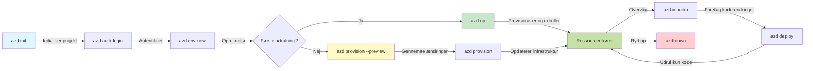
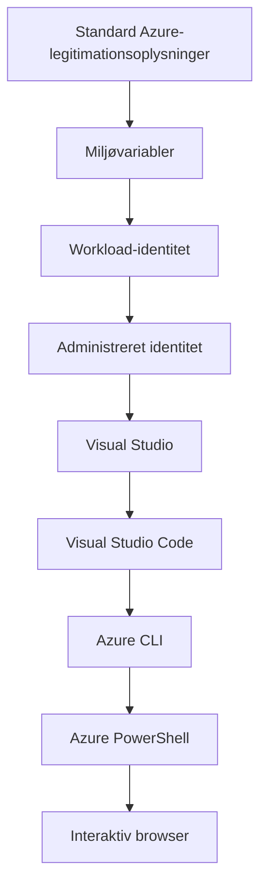

# AZD Basics - Understanding Azure Developer CLI

# AZD Basics - Core Concepts and Fundamentals

**Chapter Navigation:**
- **📚 Course Home**: [AZD For Begyndere](../../README.md)
- **📖 Current Chapter**: Kapitel 1 - Fundament & Hurtig Start
- **⬅️ Previous**: [Kursusoversigt](../../README.md#-chapter-1-foundation--quick-start)
- **➡️ Next**: [Installation & Opsætning](installation.md)
- **🚀 Next Chapter**: [Kapitel 2: AI-først udvikling](../chapter-02-ai-development/microsoft-foundry-integration.md)

## Introduction

Denne lektion introducerer dig til Azure Developer CLI (azd), et kraftfuldt kommandolinjeværktøj, der accelererer din rejse fra lokal udvikling til udrulning i Azure. Du lærer de fundamentale begreber, kernefunktioner og forstår, hvordan azd forenkler udrulning af cloud-native applikationer.

## Learning Goals

Ved slutningen af denne lektion vil du:
- Forstå hvad Azure Developer CLI er og dets primære formål
- Lære kernekoncepterne omkring skabeloner, miljøer og tjenester
- Udforske nøglefunktioner inklusive skabelondrevet udvikling og Infrastruktur som kode
- Forstå azd-projektstrukturen og arbejdsflowet
- Være forberedt på at installere og konfigurere azd til dit udviklingsmiljø

## Learning Outcomes

Efter at have gennemført denne lektion vil du kunne:
- Forklare azds rolle i moderne cloud-udviklingsarbejdsgange
- Identificere komponenterne i en azd-projektstruktur
- Beskrive hvordan skabeloner, miljøer og tjenester arbejder sammen
- Forstå fordelene ved Infrastruktur som kode med azd
- Genkende forskellige azd-kommandoer og deres formål

## What is Azure Developer CLI (azd)?

Azure Developer CLI (azd) er et kommandolinjeværktøj designet til at accelerere din rejse fra lokal udvikling til udrulning i Azure. Det forenkler processen med at bygge, udrulle og administrere cloud-native applikationer på Azure.

### What Can You Deploy with azd?

azd understøtter et bredt udvalg af arbejdsbelastninger—og listen vokser hele tiden. I dag kan du bruge azd til at udrulle:

| Workload-type | Eksempler | Samme workflow? |
|---------------|----------|----------------|
| **Traditionelle applikationer** | Webapps, REST-API'er, statiske websteder | ✅ `azd up` |
| **Tjenester og mikrotjenester** | Container Apps, Function Apps, multi-service backends | ✅ `azd up` |
| **AI-drevne applikationer** | Chatapps med Microsoft Foundry Models, RAG-løsninger med AI Search | ✅ `azd up` |
| **Intelligente agenter** | Agenter hostet af Foundry, multi-agent orkestreringer | ✅ `azd up` |

Den centrale indsigt er, at **azd-livscyklussen forbliver den samme uanset hvad du udruller**. Du initialiserer et projekt, provisionerer infrastruktur, udruller din kode, overvåger din app og rydder op—uanset om det er et simpelt website eller en sofistikeret AI-agent.

Denne kontinuitet er designet med vilje. azd behandler AI-funktioner som en anden type tjeneste, som din applikation kan bruge, ikke som noget fundamentalt forskelligt. Et chat-endpoint understøttet af Microsoft Foundry Models er, fra azds perspektiv, bare en anden tjeneste, der skal konfigureres og udrulles.

### 🎯 Why Use AZD? A Real-World Comparison

Lad os sammenligne udrulning af en simpel webapp med database:

#### ❌ WITHOUT AZD: Manual Azure Deployment (30+ minutes)

```bash
# Trin 1: Opret ressourcegruppe
az group create --name myapp-rg --location eastus

# Trin 2: Opret App Service-plan
az appservice plan create --name myapp-plan \
  --resource-group myapp-rg \
  --sku B1 --is-linux

# Trin 3: Opret Webapp
az webapp create --name myapp-web-unique123 \
  --resource-group myapp-rg \
  --plan myapp-plan \
  --runtime "NODE:18-lts"

# Trin 4: Opret Cosmos DB-konto (10-15 minutter)
az cosmosdb create --name myapp-cosmos-unique123 \
  --resource-group myapp-rg \
  --kind MongoDB

# Trin 5: Opret database
az cosmosdb mongodb database create \
  --account-name myapp-cosmos-unique123 \
  --resource-group myapp-rg \
  --name tododb

# Trin 6: Opret kollektion
az cosmosdb mongodb collection create \
  --account-name myapp-cosmos-unique123 \
  --resource-group myapp-rg \
  --database-name tododb \
  --name todos

# Trin 7: Hent forbindelsesstreng
CONN_STR=$(az cosmosdb keys list \
  --name myapp-cosmos-unique123 \
  --resource-group myapp-rg \
  --type connection-strings \
  --query "connectionStrings[0].connectionString" -o tsv)

# Trin 8: Konfigurer appindstillinger
az webapp config appsettings set \
  --name myapp-web-unique123 \
  --resource-group myapp-rg \
  --settings MONGODB_URI="$CONN_STR"

# Trin 9: Aktivér logning
az webapp log config --name myapp-web-unique123 \
  --resource-group myapp-rg \
  --application-logging filesystem \
  --detailed-error-messages true

# Trin 10: Opsæt Application Insights
az monitor app-insights component create \
  --app myapp-insights \
  --location eastus \
  --resource-group myapp-rg

# Trin 11: Forbind Application Insights til Webapp
INSTRUMENTATION_KEY=$(az monitor app-insights component show \
  --app myapp-insights \
  --resource-group myapp-rg \
  --query "instrumentationKey" -o tsv)

az webapp config appsettings set \
  --name myapp-web-unique123 \
  --resource-group myapp-rg \
  --settings APPINSIGHTS_INSTRUMENTATIONKEY="$INSTRUMENTATION_KEY"

# Trin 12: Byg applikationen lokalt
npm install
npm run build

# Trin 13: Opret deploymentspakke
zip -r app.zip . -x "*.git*" "node_modules/*"

# Trin 14: Udrul applikationen
az webapp deployment source config-zip \
  --resource-group myapp-rg \
  --name myapp-web-unique123 \
  --src app.zip

# Trin 15: Vent og kryds fingre for, at det virker 🙏
# (Ingen automatisk validering, manuel test kræves)
```

**Problems:**
- ❌ 15+ kommandoer at huske og køre i rækkefølge
- ❌ 30-45 minutters manuelt arbejde
- ❌ Let at lave fejl (tastefejl, forkerte parametre)
- ❌ Connection strings eksponeret i terminalhistorik
- ❌ Ingen automatisk rollback hvis noget fejler
- ❌ Svært at replikere for teammedlemmer
- ❌ Forskelligt hver gang (ikke reproducerbart)

#### ✅ WITH AZD: Automated Deployment (5 commands, 10-15 minutes)

```bash
# Trin 1: Initialiser fra skabelon
azd init --template todo-nodejs-mongo

# Trin 2: Autentificer
azd auth login

# Trin 3: Opret miljø
azd env new dev

# Trin 4: Forhåndsvis ændringer (valgfrit, men anbefales)
azd provision --preview

# Trin 5: Udrul alt
azd up

# ✨ Færdig! Alt er udrullet, konfigureret og overvåget
```

**Benefits:**
- ✅ **5 kommandoer** vs. 15+ manuelle trin
- ✅ **10-15 minutter** samlet tid (for det meste ventetid i Azure)
- ✅ **Ingen fejl** - automatiseret og testet
- ✅ **Hemmeligheder håndteres sikkert** via Key Vault
- ✅ **Automatisk tilbagerulning** ved fejl
- ✅ **Fuldstændig reproducerbart** - samme resultat hver gang
- ✅ **Klar til teambrug** - alle kan udrulle med de samme kommandoer
- ✅ **Infrastruktur som kode** - versionsstyrede Bicep-skabeloner
- ✅ **Indbygget overvågning** - Application Insights konfigureret automatisk

### 📊 Time & Error Reduction

| Metric | Manual Deployment | AZD Deployment | Improvement |
|:-------|:------------------|:---------------|:------------|
| **Commands** | 15+ | 5 | 67% færre |
| **Time** | 30-45 min | 10-15 min | 60% hurtigere |
| **Error Rate** | ~40% | <5% | 88% reduktion |
| **Consistency** | Lav (manuelt) | 100% (automatiseret) | Perfekt |
| **Team Onboarding** | 2-4 timer | 30 minutter | 75% hurtigere |
| **Rollback Time** | 30+ min (manuelt) | 2 min (automatiseret) | 93% hurtigere |

## Core Concepts

### Templates
Skabeloner er fundamentet for azd. De indeholder:
- **Applikationskode** - Din kildekode og afhængigheder
- **Infrastrukturbeskrivelser** - Azure-ressourcer defineret i Bicep eller Terraform
- **Konfigurationsfiler** - Indstillinger og miljøvariabler
- **Udrulningsscripts** - Automatiserede udrulningsarbejdsgange

### Environments
Miljøer repræsenterer forskellige udrulningsmål:
- **Development** - Til test og udvikling
- **Staging** - Forproduktionsmiljø
- **Production** - Live produktionsmiljø

Hvert miljø opretholder sit eget:
- Azure-ressourcegruppe
- Konfigurationsindstillinger
- Udrulningstilstand

### Services
Tjenester er byggestenene i din applikation:
- **Frontend** - Webapplikationer, SPAs
- **Backend** - API'er, mikrotjenester
- **Database** - Datastoringsløsninger
- **Storage** - Fil- og blob-lagring

## Key Features

### 1. Template-Driven Development
```bash
# Gennemse tilgængelige skabeloner
azd template list

# Initialiser fra en skabelon
azd init --template <template-name>
```

### 2. Infrastructure as Code
- **Bicep** - Azures domænespecifikke sprog
- **Terraform** - Multicloud-infrastrukturværktøj
- **ARM Templates** - Azure Resource Manager-skabeloner

### 3. Integrated Workflows
```bash
# Fuldstændig udrulningsarbejdsgang
azd up            # Provision + Deploy — dette kræver ingen manuel indgriben ved første opsætning

# 🧪 NYT: Forhåndsvis ændringer i infrastrukturen før udrulning (SIKKER)
azd provision --preview    # Simuler udrulning af infrastrukturen uden at foretage ændringer

azd provision     # Opret Azure-ressourcer; brug dette, hvis du opdaterer infrastrukturen
azd deploy        # Udrul applikationskode eller genudrul applikationskoden efter en opdatering
azd down          # Ryd op i ressourcer
```

#### 🛡️ Safe Infrastructure Planning with Preview
Kommandoen `azd provision --preview` er en game-changer for sikre udrulninger:
- **Dry-run-analyse** - Viser hvad der vil blive oprettet, ændret eller slettet
- **Nul risiko** - Ingen faktiske ændringer foretages i dit Azure-miljø
- **Team-samarbejde** - Del preview-resultater før udrulning
- **Omkostningsestimering** - Forstå ressourcedekostninger før forpligtelse

```bash
# Eksempel på forhåndsvisningsarbejdsgang
azd provision --preview           # Se, hvad der vil ændre sig
# Gennemgå outputtet, diskuter med teamet
azd provision                     # Anvend ændringerne med tillid
```

### 📊 Visual: AZD Development Workflow


**Workflow Explanation:**
1. **Init** - Start med en skabelon eller nyt projekt
2. **Auth** - Godkend med Azure
3. **Environment** - Opret isoleret udrulningsmiljø
4. **Preview** - 🆕 Forhåndsvis altid infrastrukturændringer først (sikker praksis)
5. **Provision** - Opret/opdater Azure-ressourcer
6. **Deploy** - Skub din applikationskode
7. **Monitor** - Observer applikationsydelse
8. **Iterate** - Foretag ændringer og udrul koden igen
9. **Cleanup** - Fjern ressourcer når du er færdig

### 4. Environment Management
```bash
# Opret og administrer miljøer
azd env new <environment-name>
azd env select <environment-name>
azd env list
```

### 5. Extensions and AI Commands

azd bruger et udvidelsessystem til at tilføje funktionalitet ud over kerne-CLI'en. Dette er især nyttigt for AI-arbejdsbelastninger:

```bash
# Vis tilgængelige udvidelser
azd extension list

# Installer Foundry agents-udvidelsen
azd extension install azure.ai.agents

# Initialiser et AI-agentprojekt ud fra et manifest
azd ai agent init -m agent-manifest.yaml

# Start MCP-serveren for AI-assisteret udvikling (Alpha)
azd mcp start
```

> Udvidelser gennemgås i detaljer i [Kapitel 2: AI-først udvikling](../chapter-02-ai-development/agents.md) og referencen [AZD AI CLI-kommandoer](../chapter-08-production/production-ai-practices.md#azd-ai-cli-commands-and-extensions).

## 📁 Project Structure

En typisk azd projektstruktur:
```
my-app/
├── .azd/                    # azd configuration
│   └── config.json
├── .azure/                  # Azure deployment artifacts
├── .devcontainer/          # Development container config
├── .github/workflows/      # GitHub Actions
├── .vscode/               # VS Code settings
├── infra/                 # Infrastructure code
│   ├── main.bicep        # Main infrastructure template
│   ├── main.parameters.json
│   └── modules/          # Reusable modules
├── src/                  # Application source code
│   ├── api/             # Backend services
│   └── web/             # Frontend application
├── azure.yaml           # azd project configuration
└── README.md
```

## 🔧 Configuration Files

### azure.yaml
Hovedprojektets konfigurationsfil:
```yaml
name: my-awesome-app
metadata:
  template: my-template@1.0.0

services:
  web:
    project: ./src/web
    language: js
    host: appservice
  api:
    project: ./src/api
    language: js
    host: appservice

hooks:
  preprovision:
    shell: pwsh
    run: echo "Preparing to provision..."
```

### .azure/config.json
Miljøspecifik konfiguration:
```json
{
  "version": 1,
  "defaultEnvironment": "dev",
  "environments": {
    "dev": {
      "subscriptionId": "your-subscription-id",
      "location": "eastus"
    }
  }
}
```

## 🎪 Common Workflows with Hands-On Exercises

> **💡 Learning Tip:** Følg disse øvelser i rækkefølge for at opbygge dine AZD-færdigheder gradvist.

### 🎯 Exercise 1: Initialize Your First Project

**Goal:** Create an AZD project and explore its structure

**Steps:**
```bash
# Brug en gennemprøvet skabelon
azd init --template todo-nodejs-mongo

# Gennemse de genererede filer
ls -la  # Vis alle filer, inklusive skjulte

# Vigtige filer oprettet:
# - azure.yaml (hovedkonfiguration)
# - infra/ (infrastrukturkode)
# - src/ (applikationskode)
```

**✅ Succes:** Du har azure.yaml, infra/ og src/ mapper

---

### 🎯 Exercise 2: Deploy to Azure

**Goal:** Complete end-to-end deployment

**Steps:**
```bash
# 1. Autentificer
az login && azd auth login

# 2. Opret miljø
azd env new dev
azd env set AZURE_LOCATION eastus

# 3. Forhåndsvis ændringer (ANBEFALET)
azd provision --preview

# 4. Udrul alt
azd up

# 5. Bekræft udrulning
azd show    # Se URL'en til din app
```

**Forventet tid:** 10-15 minutter  
**✅ Succes:** Applikationens URL åbnes i browseren

---

### 🎯 Exercise 3: Multiple Environments

**Goal:** Deploy to dev and staging

**Steps:**
```bash
# Har allerede dev, opret staging
azd env new staging
azd env set AZURE_LOCATION westus2
azd up

# Skift mellem dem
azd env list
azd env select dev
```

**✅ Succes:** To separate ressourcegrupper i Azure-portalen

---

### 🛡️ Ren start: `azd down --force --purge`

Når du har brug for at nulstille fuldstændigt:

```bash
azd down --force --purge
```

**Hvad det gør:**
- `--force`: Ingen bekræftelsesprompter
- `--purge`: Sletter al lokal tilstand og Azure-ressourcer

**Brug når:**
- Udrulningen fejlede midt i processen
- Skifter projekter
- Brug for en frisk start

---

## 🎪 Original Workflow Reference

### Starting a New Project
```bash
# Metode 1: Brug eksisterende skabelon
azd init --template todo-nodejs-mongo

# Metode 2: Start fra bunden
azd init

# Metode 3: Brug den aktuelle mappe
azd init .
```

### Development Cycle
```bash
# Opsæt udviklingsmiljø
azd auth login
azd env new dev
azd env select dev

# Udrul alt
azd up

# Foretag ændringer og udrul igen
azd deploy

# Ryd op, når du er færdig
azd down --force --purge # kommandoen i Azure Developer CLI er en **hård nulstilling** for dit miljø — især nyttig, når du fejlsøger mislykkede udrulninger, rydder op i forældreløse ressourcer eller forbereder en frisk genudrulning
```

## Understanding `azd down --force --purge`
Kommandoen `azd down --force --purge` er en kraftfuld måde at rive dit azd-miljø og alle tilknyttede ressourcer helt ned. Her er en gennemgang af hvad hver flag gør:
```
--force
```
- Hopper over bekræftelsesprompter.
- Nyttig til automatisering eller scripting, hvor manuel input ikke er mulig.
- Sikrer, at nedtagningen fortsætter uden afbrydelse, selv hvis CLI'en opdager inkonsistenser.

```
--purge
```
Sletter **alle tilknyttede metadata**, herunder:
Environment state
Lokal `.azure`-mappe
Cachede udrulningsoplysninger
Forhindrer azd i at "huske" tidligere udrulninger, hvilket kan forårsage problemer som mismatchende ressourcegrupper eller forældede registry-referencer.


### Hvorfor bruge begge?
Når du er kørt fast med `azd up` på grund af vedvarende tilstand eller delvise udrulninger, sikrer denne kombination en **ren start**.

Det er især nyttigt efter manuelle ressourcer er slettet i Azure-portalen eller når du skifter skabeloner, miljøer eller navnekonventioner for ressourcegrupper.


### Managing Multiple Environments
```bash
# Opret staging-miljø
azd env new staging
azd env select staging
azd up

# Skift tilbage til dev
azd env select dev

# Sammenlign miljøer
azd env list
```

## 🔐 Authentication and Credentials

Forståelse af autentificering er afgørende for succesfulde azd-udrulninger. Azure bruger flere autentificeringsmetoder, og azd udnytter den samme legitimationskæde som andre Azure-værktøjer.

### Azure CLI Authentication (`az login`)

Før du bruger azd, skal du godkende med Azure. Den mest almindelige metode er at bruge Azure CLI:

```bash
# Interaktiv log ind (åbner browseren)
az login

# Log ind med en specifik tenant
az login --tenant <tenant-id>

# Log ind med en tjenesteprincipal
az login --service-principal -u <app-id> -p <password> --tenant <tenant-id>

# Kontroller nuværende loginstatus
az account show

# Vis tilgængelige abonnementer
az account list --output table

# Indstil standardabonnement
az account set --subscription <subscription-id>
```

### Authentication Flow
1. **Interaktiv login**: Åbner din standardbrowser for godkendelse
2. **Device Code Flow**: Til miljøer uden browseradgang
3. **Service Principal**: Til automatisering og CI/CD-scenarier
4. **Managed Identity**: Til Azure-hostede applikationer

### DefaultAzureCredential Chain

`DefaultAzureCredential` er en legitimations-type, der giver en forenklet autentificeringsoplevelse ved automatisk at forsøge flere legitimationskilder i en bestemt rækkefølge:

#### Credential Chain Order

#### 1. Environment Variables
```bash
# Sæt miljøvariabler for service-principal
export AZURE_CLIENT_ID="<app-id>"
export AZURE_CLIENT_SECRET="<password>"
export AZURE_TENANT_ID="<tenant-id>"
```

#### 2. Workload Identity (Kubernetes/GitHub Actions)
Bruges automatisk i:
- Azure Kubernetes Service (AKS) med Workload Identity
- GitHub Actions med OIDC-føderation
- Andre fødererede identitetsscenarier

#### 3. Managed Identity
For Azure-ressourcer som:
- Virtuelle maskiner
- App Service
- Azure Functions
- Container Instances

```bash
# Kontroller, om det kører på en Azure-ressource med administreret identitet
az account show --query "user.type" --output tsv
# Returnerer: "servicePrincipal" hvis der bruges administreret identitet
```

#### 4. Developer Tools Integration
- **Visual Studio**: Bruger automatisk den tilmeldte konto
- **VS Code**: Bruger legitimationsoplysninger fra Azure Account-udvidelsen
- **Azure CLI**: Bruger `az login`-legitimationsoplysninger (mest almindeligt for lokal udvikling)

### AZD Authentication Setup

```bash
# Metode 1: Brug Azure CLI (Anbefales til udvikling)
az login
azd auth login  # Bruger eksisterende Azure CLI-legitimationsoplysninger

# Metode 2: Direkte azd-autentificering
azd auth login --use-device-code  # Til headless-miljøer

# Metode 3: Kontroller godkendelsesstatus
azd auth login --check-status

# Metode 4: Log ud og log ind igen
azd auth logout
azd auth login
```

### Authentication Best Practices

#### For Local Development
```bash
# 1. Log ind med Azure CLI
az login

# 2. Bekræft korrekt abonnement
az account show
az account set --subscription "Your Subscription Name"

# 3. Brug azd med eksisterende legitimationsoplysninger
azd auth login
```

#### For CI/CD Pipelines
```yaml
# GitHub Actions example
- name: Azure Login
  uses: azure/login@v1
  with:
    creds: ${{ secrets.AZURE_CREDENTIALS }}

- name: Deploy with azd
  run: |
    azd auth login --client-id ${{ secrets.AZURE_CLIENT_ID }} \
                    --client-secret ${{ secrets.AZURE_CLIENT_SECRET }} \
                    --tenant-id ${{ secrets.AZURE_TENANT_ID }}
    azd up --no-prompt
```

#### For Production Environments
- Brug **Managed Identity** når det kører på Azure-ressourcer
- Brug **Service Principal** til automatiseringsscenarier
- Undgå at gemme legitimationsoplysninger i kode eller konfigurationsfiler
- Brug **Azure Key Vault** til følsom konfiguration

### Common Authentication Issues and Solutions

#### Issue: "No subscription found"
```bash
# Løsning: Indstil standardabonnement
az account list --output table
az account set --subscription "<subscription-id>"
azd env set AZURE_SUBSCRIPTION_ID "<subscription-id>"
```

#### Issue: "Insufficient permissions"
```bash
# Løsning: Kontroller og tildel de nødvendige roller
az role assignment list --assignee $(az account show --query user.name --output tsv)

# Ofte krævede roller:
# - Contributor (til administration af ressourcer)
# - User Access Administrator (til tildeling af roller)
```

#### Issue: "Token expired"
```bash
# Løsning: Autentificer igen
az logout
az login
azd auth logout
azd auth login
```

### Authentication in Different Scenarios

#### Local Development
```bash
# Personlig udviklingskonto
az login
azd auth login
```

#### Team Development
```bash
# Brug en specifik tenant til organisationen
az login --tenant contoso.onmicrosoft.com
azd auth login
```

#### Multi-tenant Scenarios
```bash
# Skift mellem lejere
az login --tenant tenant1.onmicrosoft.com
# Udrul til lejer 1
azd up

az login --tenant tenant2.onmicrosoft.com  
# Udrul til lejer 2
azd up
```

### Security Considerations
1. **Opbevaring af legitimationsoplysninger**: Gem aldrig legitimationsoplysninger i kildekoden
2. **Begrænsning af tilladelser**: Brug mindst-privilegium-princippet for serviceprincipaler
3. **Token-rotation**: Roter regelmæssigt serviceprincipalhemmeligheder
4. **Revisionsspor**: Overvåg autentificering og udrulningsaktiviteter
5. **Netværkssikkerhed**: Brug private endepunkter når det er muligt

### Fejlfinding af autentificering

```bash
# Fejlfind autentificeringsproblemer
azd auth login --check-status
az account show
az account get-access-token

# Almindelige diagnostiske kommandoer
whoami                          # Aktuel brugerkontekst
az ad signed-in-user show      # Azure AD-brugerdetaljer
az group list                  # Test ressourceadgang
```

## Forstå `azd down --force --purge`

### Opdagelse
```bash
azd template list              # Gennemse skabeloner
azd template show <template>   # Skabelondetaljer
azd init --help               # Initialiseringsindstillinger
```

### Projektstyring
```bash
azd show                     # Projektoversigt
azd env show                 # Nuværende miljø
azd config list             # Konfigurationsindstillinger
```

### Overvågning
```bash
azd monitor                  # Åbn overvågning i Azure-portalen
azd monitor --logs           # Vis applikationslogfiler
azd monitor --live           # Se live-metrikker
azd pipeline config          # Opsæt CI/CD
```

## Bedste praksis

### 1. Brug meningsfulde navne
```bash
# God
azd env new production-east
azd init --template web-app-secure

# Undgå
azd env new env1
azd init --template template1
```

### 2. Brug skabeloner
- Start med eksisterende skabeloner
- Tilpas til dine behov
- Opret genbrugelige skabeloner til din organisation

### 3. Miljøadskillelse
- Brug separate miljøer til dev/staging/prod
- Udrul aldrig direkte til produktion fra din lokale maskine
- Brug CI/CD-pipelines til produktionens udrulninger

### 4. Konfigurationsstyring
- Brug miljøvariabler til følsomme data
- Hold konfiguration i versionskontrol
- Dokumenter miljøspecifikke indstillinger

## Læringsforløb

### Begynder (Uge 1-2)
1. Installer azd og autentificer
2. Udrul en simpel skabelon
3. Forstå projektstruktur
4. Lær grundlæggende kommandoer (up, down, deploy)

### Mellem (Uge 3-4)
1. Tilpas skabeloner
2. Administrer flere miljøer
3. Forstå infrastrukturkode
4. Opsæt CI/CD-pipelines

### Avanceret (Uge 5+)
1. Opret brugerdefinerede skabeloner
2. Avancerede infrastrukturmønstre
3. Udrulninger i flere regioner
4. Konfigurationer på virksomhedsniveau

## Næste skridt

**📖 Fortsæt læringen i Kapitel 1:**
- [Installation og opsætning](installation.md) - Få azd installeret og konfigureret
- [Dit første projekt](first-project.md) - Fuldfør praktisk vejledning
- [Konfigurationsguide](configuration.md) - Avancerede konfigurationsmuligheder

**🎯 Klar til næste kapitel?**
- [Kapitel 2: AI-først udvikling](../chapter-02-ai-development/microsoft-foundry-integration.md) - Begynd at bygge AI-applikationer

## Yderligere ressourcer

- [Oversigt over Azure Developer CLI](https://learn.microsoft.com/en-us/azure/developer/azure-developer-cli/)
- [Skabelongalleri](https://azure.github.io/awesome-azd/)
- [Fællesskabseksempler](https://github.com/Azure-Samples)

---

## 🙋 Ofte stillede spørgsmål

### Generelle spørgsmål

**Q: Hvad er forskellen mellem AZD og Azure CLI?**

A: Azure CLI (`az`) bruges til at administrere individuelle Azure-ressourcer. AZD (`azd`) bruges til at administrere hele applikationer:

```bash
# Azure CLI - Lavniveau ressourcestyring
az webapp create --name myapp --resource-group rg
az sql server create --name myserver --resource-group rg
# ...mange flere kommandoer er nødvendige

# AZD - Styring på applikationsniveau
azd up  # Udruller hele appen med alle ressourcer
```

**Tænk på det på denne måde:**
- `az` = Arbejde med individuelle Lego-klodser
- `azd` = Arbejde med komplette Lego-sæt

---

**Q: Skal jeg kende Bicep eller Terraform for at bruge AZD?**

A: Nej! Start med skabeloner:
```bash
# Brug eksisterende skabelon - ingen IaC-viden nødvendig
azd init --template todo-nodejs-mongo
azd up
```

Du kan lære Bicep senere for at tilpasse infrastrukturen. Skabeloner giver fungerende eksempler at lære af.

---

**Q: Hvad koster det at køre AZD-skabeloner?**

A: Omkostningerne varierer efter skabelon. De fleste udviklingsskabeloner koster $50-150 pr. måned:

```bash
# Forhåndsvis omkostninger før udrulning
azd provision --preview

# Ryd altid op, når det ikke er i brug
azd down --force --purge  # Fjerner alle ressourcer
```

**Pro-tip:** Brug gratis niveauer hvor det er muligt:
- App Service: F1 (Gratis) niveau
- Microsoft Foundry Models: Azure OpenAI 50.000 tokens/måned gratis
- Cosmos DB: 1000 RU/s gratis niveau

---

**Q: Kan jeg bruge AZD med eksisterende Azure-ressourcer?**

A: Ja, men det er nemmere at starte fra bunden. AZD fungerer bedst, når det styrer hele livscyklussen. For eksisterende ressourcer:

```bash
# Mulighed 1: Importer eksisterende ressourcer (avanceret)
azd init
# Ændr derefter infra/ for at referere til eksisterende ressourcer

# Mulighed 2: Start forfra (anbefalet)
azd init --template matching-your-stack
azd up  # Opretter et nyt miljø
```

---

**Q: Hvordan deler jeg mit projekt med teammedlemmer?**

A: Commit AZD-projektet til Git (men IKKE .azure-mappen):

```bash
# Allerede i .gitignore som standard
.azure/        # Indeholder hemmeligheder og miljødata
*.env          # Miljøvariabler

# Teammedlemmer derefter:
git clone <your-repo>
azd auth login
azd env new <their-name>-dev
azd up
```

Alle får identisk infrastruktur fra de samme skabeloner.

---

### Fejlfinding

**Q: "azd up" fejlede halvvejs. Hvad gør jeg?**

A: Tjek fejlen, ret den, og prøv igen:

```bash
# Vis detaljerede logfiler
azd show

# Almindelige rettelser:

# 1. Hvis kvoten er overskredet:
azd env set AZURE_LOCATION "westus2"  # Prøv en anden region

# 2. Hvis der er konflikt med ressourcens navn:
azd down --force --purge  # Start forfra
azd up  # Prøv igen

# 3. Hvis godkendelsen er udløbet:
az login
azd auth login
azd up
```

**Mest almindelige problem:** Forkert Azure-abonnement valgt
```bash
az account list --output table
az account set --subscription "<correct-subscription>"
```

---

**Q: Hvordan deployer jeg kun kodeændringer uden genprovisionering?**

A: Brug `azd deploy` i stedet for `azd up`:

```bash
azd up          # Første gang: provisionering + udrulning (langsomt)

# Foretag kodeændringer...

azd deploy      # Efterfølgende gange: kun udrulning (hurtigt)
```

Hastighedssammenligning:
- `azd up`: 10-15 minutter (provisionerer infrastruktur)
- `azd deploy`: 2-5 minutter (kun kode)

---

**Q: Kan jeg tilpasse infrastruktur-skabelonerne?**

A: Ja! Rediger Bicep-filerne i `infra/`:

```bash
# Efter azd init
cd infra/
code main.bicep  # Rediger i VS Code

# Forhåndsvis ændringer
azd provision --preview

# Anvend ændringer
azd provision
```

**Tip:** Start småt - ændr SKUs først:
```bicep
// infra/main.bicep
sku: {
  name: 'B1'  // Change to 'P1V2' for production
}
```

---

**Q: Hvordan sletter jeg alt, AZD har oprettet?**

A: Én kommando fjerner alle ressourcer:

```bash
azd down --force --purge

# Dette sletter:
# - Alle Azure-ressourcer
# - Ressourcegruppe
# - Lokal miljøtilstand
# - Cachede udrulningsdata
```

**Kør altid dette når:**
- Færdig med at teste en skabelon
- Skifter til et andet projekt
- Vil starte forfra

**Omkostningsbesparelser:** Sletning af ubrugte ressourcer = $0 i omkostninger

---

**Q: Hvad hvis jeg ved et uheld slettede ressourcer i Azure-portalen?**

A: AZD-tilstanden kan komme ud af sync. Tilgang med en ren start:

```bash
# 1. Fjern lokal tilstand
azd down --force --purge

# 2. Start forfra
azd up

# Alternativ: Lad AZD opdage og rette
azd provision  # Vil oprette manglende ressourcer
```

---

### Avancerede spørgsmål

**Q: Kan jeg bruge AZD i CI/CD-pipelines?**

A: Ja! GitHub Actions-eksempel:

```yaml
# .github/workflows/deploy.yml
name: Deploy with AZD

on:
  push:
    branches: [main]

jobs:
  deploy:
    runs-on: ubuntu-latest
    steps:
      - uses: actions/checkout@v2
      
      - name: Install azd
        run: curl -fsSL https://aka.ms/install-azd.sh | bash
      
      - name: Azure Login
        run: |
          azd auth login \
            --client-id ${{ secrets.AZURE_CLIENT_ID }} \
            --client-secret ${{ secrets.AZURE_CLIENT_SECRET }} \
            --tenant-id ${{ secrets.AZURE_TENANT_ID }}
      
      - name: Deploy
        run: azd up --no-prompt
```

---

**Q: Hvordan håndterer jeg hemmeligheder og følsomme data?**

A: AZD integreres automatisk med Azure Key Vault:

```bash
# Hemmeligheder gemmes i Key Vault, ikke i koden
azd env set DATABASE_PASSWORD "$(openssl rand -base64 32)"

# AZD gør følgende automatisk:
# 1. Opretter Key Vault
# 2. Gemmer en hemmelighed
# 3. Giver app adgang via administreret identitet
# 4. Injicerer ved kørselstid
```

**Commit aldrig:**
- `.azure/`-mappen (indeholder miljødata)
- `.env`-filer (lokale hemmeligheder)
- Forbindelsesstrenge

---

**Q: Kan jeg udrulle til flere regioner?**

A: Ja, opret et miljø per region:

```bash
# Miljø i det østlige USA
azd env new prod-eastus
azd env set AZURE_LOCATION eastus
azd up

# Miljø i det vestlige Europa
azd env new prod-westeurope
azd env set AZURE_LOCATION westeurope
azd up

# Hvert miljø er uafhængigt
azd env list
```

For ægte multi-region apps, tilpas Bicep-skabeloner for at udrulle til flere regioner samtidig.

---

**Q: Hvor kan jeg få hjælp, hvis jeg sidder fast?**

1. **AZD-dokumentation:** https://learn.microsoft.com/azure/developer/azure-developer-cli/
2. **GitHub Issues:** https://github.com/Azure/azure-dev/issues
3. **Discord:** [Azure Discord](https://discord.gg/microsoft-azure) - #azure-developer-cli kanal
4. **Stack Overflow:** Tag `azure-developer-cli`
5. **Dette kursus:** [Fejlfindingsguide](../chapter-07-troubleshooting/common-issues.md)

**Pro-tip:** Før du spørger, kør:
```bash
azd show       # Viser den aktuelle tilstand
azd version    # Viser din version
```
Medtag disse oplysninger i dit spørgsmål for hurtigere hjælp.

---

## 🎓 Hvad nu?

Du forstår nu AZD's grundprincipper. Vælg din vej:

### 🎯 For begyndere:
1. **Næste:** [Installation og opsætning](installation.md) - Installer AZD på din maskine
2. **Derefter:** [Dit første projekt](first-project.md) - Udrul din første app
3. **Øv dig:** Gennemfør alle 3 øvelser i denne lektion

### 🚀 For AI-udviklere:
1. **Spring til:** [Kapitel 2: AI-først udvikling](../chapter-02-ai-development/microsoft-foundry-integration.md)
2. **Udrul:** Start med `azd init --template get-started-with-ai-chat`
3. **Lær:** Byg mens du udruller

### 🏗️ For erfarne udviklere:
1. **Gennemgå:** [Konfigurationsguide](configuration.md) - Avancerede indstillinger
2. **Udforsk:** [Infrastructure as Code](../chapter-04-infrastructure/provisioning.md) - Dybdegående gennemgang af Bicep
3. **Byg:** Opret brugerdefinerede skabeloner til din stack

---

**Kapitelnavigation:**
- **📚 Kursusforside**: [AZD for begyndere](../../README.md)
- **📖 Nuværende kapitel**: Kapitel 1 - Fundament & Hurtigstart  
- **⬅️ Forrige**: [Kursusoversigt](../../README.md#-chapter-1-foundation--quick-start)
- **➡️ Næste**: [Installation og opsætning](installation.md)
- **🚀 Næste kapitel**: [Kapitel 2: AI-først udvikling](../chapter-02-ai-development/microsoft-foundry-integration.md)

---

<!-- CO-OP TRANSLATOR DISCLAIMER START -->
**Ansvarsfraskrivelse**:
Dette dokument er blevet oversat ved hjælp af AI-oversættelsestjenesten [Co-op Translator](https://github.com/Azure/co-op-translator). Selvom vi bestræber os på nøjagtighed, bedes du være opmærksom på, at automatiske oversættelser kan indeholde fejl eller unøjagtigheder. Det oprindelige dokument på dets oprindelige sprog bør betragtes som den autoritative kilde. For kritisk information anbefales professionel menneskelig oversættelse. Vi er ikke ansvarlige for misforståelser eller fejltolkninger, der opstår som følge af brugen af denne oversættelse.
<!-- CO-OP TRANSLATOR DISCLAIMER END -->