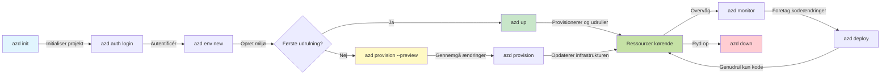
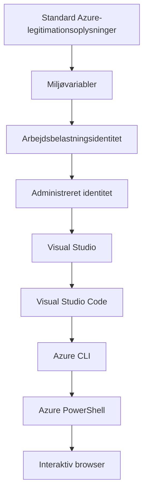

# AZD Basics - Forstå Azure Developer CLI

# AZD Basics - Kernekoncepter og grundlæggende elementer

**Kapitelnavigation:**
- **📚 Kursusforside**: [AZD For Beginners](../../README.md)
- **📖 Nuværende kapitel**: Kapitel 1 - Grundlag & Hurtigstart
- **⬅️ Forrige**: [Kursusoversigt](../../README.md#-chapter-1-foundation--quick-start)
- **➡️ Næste**: [Installation & Opsætning](installation.md)
- **🚀 Næste kapitel**: [Kapitel 2: AI-først udvikling](../chapter-02-ai-development/microsoft-foundry-integration.md)

## Introduktion

Denne lektion introducerer dig til Azure Developer CLI (azd), et kraftfuldt kommandolinjeværktøj, der accelererer din rejse fra lokal udvikling til Azure-udrulning. Du vil lære de grundlæggende koncepter, kernefunktioner og forstå, hvordan azd forenkler udrulning af cloud-native applikationer.

## Læringsmål

Når du er færdig med denne lektion, vil du:
- Forstå hvad Azure Developer CLI er og dets primære formål
- Lære kernekoncepter omkring skabeloner, miljøer og tjenester
- Udforske nøglefunktioner inklusive skabelonstyret udvikling og Infrastruktur som kode
- Forstå azd-projektstrukturen og arbejdsgangen
- Være forberedt på at installere og konfigurere azd til dit udviklingsmiljø

## Læringsudbytte

Efter at have gennemført denne lektion vil du kunne:
- Forklare azd's rolle i moderne cloud-udviklingsarbejdsgange
- Identificere komponenterne i en azd-projektstruktur
- Beskrive hvordan skabeloner, miljøer og tjenester arbejder sammen
- Forstå fordelene ved Infrastruktur som kode med azd
- Genkende forskellige azd-kommandoer og deres formål

## Hvad er Azure Developer CLI (azd)?

Azure Developer CLI (azd) er et kommandolinjeværktøj designet til at accelerere din rejse fra lokal udvikling til Azure-udrulning. Det forenkler processen med at bygge, udrulle og administrere cloud-native applikationer på Azure.

### Hvad kan du udrulle med azd?

azd understøtter en bred vifte af workloads — og listen vokser hele tiden. I dag kan du bruge azd til at udrulle:

| Arbejdstype | Eksempler | Samme arbejdsgang? |
|---------------|----------|----------------|
| **Traditionelle applikationer** | Webapps, REST-API'er, statiske sider | ✅ `azd up` |
| **Services og mikrotjenester** | Container Apps, Function Apps, backends med flere services | ✅ `azd up` |
| **AI-drevne applikationer** | Chatapps med Microsoft Foundry Models, RAG-løsninger med AI Search | ✅ `azd up` |
| **Intelligente agenter** | Foundry-hostede agenter, multi-agent-orkestreringer | ✅ `azd up` |

Den vigtigste indsigt er, at **azd-livscyklussen forbliver den samme uanset hvad du udruller**. Du initialiserer et projekt, provisionerer infrastruktur, udruller din kode, overvåger din app og rydder op — uanset om det er en simpel hjemmeside eller en sofistikeret AI-agent.

Denne kontinuitet er designet sådan. azd behandler AI-funktioner som en anden slags service, din applikation kan bruge, ikke som noget grundlæggende anderledes. Et chat-endpoint understøttet af Microsoft Foundry Models er, fra azd’s perspektiv, bare en anden service, der skal konfigureres og udrulles.

### 🎯 Hvorfor bruge AZD? En virkelighedsnær sammenligning

Lad os sammenligne udrulning af en simpel webapp med database:

#### ❌ UDEN AZD: Manuel Azure-udrulning (30+ minutter)

```bash
# Trin 1: Opret ressourcegruppe
az group create --name myapp-rg --location eastus

# Trin 2: Opret App Service-plan
az appservice plan create --name myapp-plan \
  --resource-group myapp-rg \
  --sku B1 --is-linux

# Trin 3: Opret Web App
az webapp create --name myapp-web-unique123 \
  --resource-group myapp-rg \
  --plan myapp-plan \
  --runtime "NODE:18-lts"

# Trin 4: Opret Cosmos DB-konto (10-15 minutter)
az cosmosdb create --name myapp-cosmos-unique123 \
  --resource-group myapp-rg \
  --kind MongoDB

# Trin 5: Opret database
az cosmosdb mongodb database create \
  --account-name myapp-cosmos-unique123 \
  --resource-group myapp-rg \
  --name tododb

# Trin 6: Opret samling
az cosmosdb mongodb collection create \
  --account-name myapp-cosmos-unique123 \
  --resource-group myapp-rg \
  --database-name tododb \
  --name todos

# Trin 7: Hent forbindelsesstreng
CONN_STR=$(az cosmosdb keys list \
  --name myapp-cosmos-unique123 \
  --resource-group myapp-rg \
  --type connection-strings \
  --query "connectionStrings[0].connectionString" -o tsv)

# Trin 8: Konfigurer appindstillinger
az webapp config appsettings set \
  --name myapp-web-unique123 \
  --resource-group myapp-rg \
  --settings MONGODB_URI="$CONN_STR"

# Trin 9: Aktiver logning
az webapp log config --name myapp-web-unique123 \
  --resource-group myapp-rg \
  --application-logging filesystem \
  --detailed-error-messages true

# Trin 10: Konfigurer Application Insights
az monitor app-insights component create \
  --app myapp-insights \
  --location eastus \
  --resource-group myapp-rg

# Trin 11: Forbind App Insights med Web App
INSTRUMENTATION_KEY=$(az monitor app-insights component show \
  --app myapp-insights \
  --resource-group myapp-rg \
  --query "instrumentationKey" -o tsv)

az webapp config appsettings set \
  --name myapp-web-unique123 \
  --resource-group myapp-rg \
  --settings APPINSIGHTS_INSTRUMENTATIONKEY="$INSTRUMENTATION_KEY"

# Trin 12: Byg applikationen lokalt
npm install
npm run build

# Trin 13: Opret implementeringspakke
zip -r app.zip . -x "*.git*" "node_modules/*"

# Trin 14: Udrul applikationen
az webapp deployment source config-zip \
  --resource-group myapp-rg \
  --name myapp-web-unique123 \
  --src app.zip

# Trin 15: Vent og bed på, at det virker 🙏
# (Ingen automatiseret validering, manuel test kræves)
```

**Problemer:**
- ❌ 15+ kommandoer at huske og udføre i rækkefølge
- ❌ 30-45 minutters manuelt arbejde
- ❌ Let at lave fejl (tastefejl, forkerte parametre)
- ❌ Forbindelsestrenge eksponeret i terminalhistorik
- ❌ Ingen automatisk rollback hvis noget fejler
- ❌ Svært at reproducere for teammedlemmer
- ❌ Forskelligt hver gang (ikke reproducerbart)

#### ✅ MED AZD: Automatiseret udrulning (5 kommandoer, 10-15 minutter)

```bash
# Trin 1: Initialiser fra skabelon
azd init --template todo-nodejs-mongo

# Trin 2: Autentificer
azd auth login

# Trin 3: Opret miljø
azd env new dev

# Trin 4: Forhåndsvis ændringer (valgfrit, men anbefalet)
azd provision --preview

# Trin 5: Udrul alt
azd up

# ✨ Færdig! Alt er udrullet, konfigureret og overvåget
```

**Fordele:**
- ✅ **5 kommandoer** vs. 15+ manuelle trin
- ✅ **10-15 minutter** samlet tid (mest ventetid mod Azure)
- ✅ **Færre manuelle fejl** - konsekvent, skabelonstyret arbejdsgang
- ✅ **Sikker håndtering af secrets** - mange skabeloner bruger Azure-administreret secret-lagring
- ✅ **Gentagelige udrulninger** - samme arbejdsgang hver gang
- ✅ **Fuldt reproducerbart** - samme resultat hver gang
- ✅ **Klar til teambrug** - alle kan udrulle med samme kommandoer
- ✅ **Infrastruktur som kode** - versionsstyrede Bicep-skabeloner
- ✅ **Indbygget overvågning** - Application Insights konfigureret automatisk

### 📊 Tid og fejlreduktion

| Metrik | Manuel udrulning | AZD-udrulning | Forbedring |
|:-------|:------------------|:---------------|:------------|
| **Kommandoer** | 15+ | 5 | 67% færre |
| **Tid** | 30-45 min | 10-15 min | 60% hurtigere |
| **Fejlrate** | ~40% | <5% | 88% reduktion |
| **Konsistens** | Lav (manuel) | 100% (automatiseret) | Perfekt |
| **Team-onboarding** | 2-4 timer | 30 minutter | 75% hurtigere |
| **Rollback-tid** | 30+ min (manuel) | 2 min (automatiseret) | 93% hurtigere |

## Kernekoncepter

### Skabeloner
Skabeloner er grundlaget for azd. De indeholder:
- **Applikationskode** - Din kildekode og afhængigheder
- **Infrastrukturbeskrivelser** - Azure-ressourcer defineret i Bicep eller Terraform
- **Konfigurationsfiler** - Indstillinger og miljøvariabler
- **Udrulningsscripts** - Automatiserede udrulningsarbejdsgange

### Miljøer
Miljøer repræsenterer forskellige udrulningsmål:
- **Udvikling** - Til test og udvikling
- **Staging** - Pre-produktionsmiljø
- **Produktion** - Live produktionsmiljø

Hvert miljø vedligeholder sit eget:
- Azure-ressourcegruppe
- Konfigurationsindstillinger
- Udrulningstilstand

### Tjenester
Tjenester er byggestenene i din applikation:
- **Frontend** - Webapplikationer, SPAs
- **Backend** - API'er, mikrotjenester
- **Database** - Datastoringsløsninger
- **Storage** - Fil- og blob-lagring

## Nøglefunktioner

### 1. Skabelonstyret udvikling
```bash
# Gennemse tilgængelige skabeloner
azd template list

# Initialiser fra en skabelon
azd init --template <template-name>
```

### 2. Infrastruktur som kode
- **Bicep** - Azures domænespecifikke sprog
- **Terraform** - Multi-cloud infrastrukturværktøj
- **ARM Templates** - Azure Resource Manager-skabeloner

### 3. Integrerede arbejdsgange
```bash
# Fuldstændig udrulningsworkflow
azd up            # Provisionering + udrulning, dette er uden manuel indgriben ved første opsætning

# 🧪 NYT: Forhåndsvis ændringer i infrastrukturen før udrulning (SIKKER)
azd provision --preview    # Simuler infrastrukturudrulning uden at foretage ændringer

azd provision     # Opret Azure-ressourcer; hvis du opdaterer infrastrukturen, brug dette
azd deploy        # Udrul applikationskode eller genudrul den efter opdatering
azd down          # Ryd op i ressourcerne
```

#### 🛡️ Sikker infrastrukturplanlægning med preview
Kommandoen `azd provision --preview` er en game-changer for sikre udrulninger:
- **Dry-run-analyse** - Viser hvad der vil blive oprettet, ændret eller slettet
- **Ingen risiko** - Der foretages ingen faktiske ændringer i dit Azure-miljø
- **Teamsamarbejde** - Del preview-resultater før udrulning
- **Omkostningsestimering** - Forstå ressourceomkostninger før forpligtelse

```bash
# Eksempel på forhåndsvisning af arbejdsgang
azd provision --preview           # Se hvad der vil ændre sig
# Gennemgå outputtet, diskuter med teamet
azd provision                     # Anvend ændringerne med sikkerhed
```

### 📊 Visualisering: AZD-udviklingsarbejdsgang



**Forklaring af arbejdsgangen:**
1. **Init** - Start med skabelon eller nyt projekt
2. **Auth** - Godkend mod Azure
3. **Environment** - Opret isoleret udrulningsmiljø
4. **Preview** - 🆕 Forhåndsvis altid infrastrukturændringer først (sikker praksis)
5. **Provision** - Opret/opdater Azure-ressourcer
6. **Deploy** - Push din applikationskode
7. **Monitor** - Observer applikationsydelse
8. **Iterate** - Foretag ændringer og genudrul kode
9. **Cleanup** - Fjern ressourcer når du er færdig

### 4. Miljøstyring
```bash
# Opret og administrer miljøer
azd env new <environment-name>
azd env select <environment-name>
azd env list
```

### 5. Udvidelser og AI-kommandoer

azd bruger et udvidelsessystem til at tilføje funktioner ud over den grundlæggende CLI. Dette er især nyttigt for AI-workloads:

```bash
# Vis tilgængelige udvidelser
azd extension list

# Installer Foundry-agentudvidelsen
azd extension install azure.ai.agents

# Initialiser et AI-agentprojekt ud fra et manifest
azd ai agent init -m agent-manifest.yaml

# Test en implementeret agent (viser latenstid og tid til første byte)
azd ai agent invoke

# Start MCP-serveren for AI-assisteret udvikling (Alpha)
azd mcp start
```

**Agentens livscyklus fra start til slut.** Når du har installeret `azure.ai.agents`, tager en enkelt arbejdsgang dig fra idé til en kørende, overvåget agent. Du behøver ikke alle disse fra dag ét — bare vid, at de findes:

| Trin | Kommando | Hvad den gør |
|-------|---------|--------------|
| **Scaffold** | `azd ai agent init -m <manifest>` | Generer et agentprojekt fra et manifest |
| **Test** | `azd ai agent invoke` | Kald agenten og se responstider |
| **Mål** | `azd ai agent eval generate` | Opret et evalueringsdatasæt for agenten |
| **Forbedre** | `azd ai agent optimize` | Optimer agentinstruktioner baseret på dine data |
| **Undersøg** | `azd ai agent endpoint show` | Vis den live endpoint-konfiguration |
| **Ryd op** | `azd ai agent delete` | Slet en hostet agent og alle dens versioner |

> Udvidelser gennemgås i detaljer i [Kapitel 2: AI-først udvikling](../chapter-02-ai-development/agents.md) og referencen [AZD AI CLI-kommandoer](../chapter-08-production/production-ai-practices.md#azd-ai-cli-commands-and-extensions).

## 📁 Projektstruktur

En typisk azd-projektstruktur:
```
my-app/
├── .azd/                    # azd configuration
│   └── config.json
├── .azure/                  # Azure deployment artifacts
├── .devcontainer/          # Development container config
├── .github/workflows/      # GitHub Actions
├── .vscode/               # VS Code settings
├── infra/                 # Infrastructure code
│   ├── main.bicep        # Main infrastructure template
│   ├── main.parameters.json
│   └── modules/          # Reusable modules
├── src/                  # Application source code
│   ├── api/             # Backend services
│   └── web/             # Frontend application
├── azure.yaml           # azd project configuration
└── README.md
```

## 🔧 Konfigurationsfiler

### azure.yaml
Hovedprojektets konfigurationsfil:
```yaml
name: my-awesome-app
metadata:
  template: my-template@1.0.0

services:
  web:
    project: ./src/web
    language: js
    host: appservice
  api:
    project: ./src/api
    language: js
    host: appservice

hooks:
  preprovision:
    shell: pwsh
    run: echo "Preparing to provision..."
```

### .azure/config.json
Miljøspecifik konfiguration:
```json
{
  "version": 1,
  "defaultEnvironment": "dev",
  "environments": {
    "dev": {
      "subscriptionId": "your-subscription-id",
      "location": "eastus"
    }
  }
}
```

## 🎪 Almindelige arbejdsgange med praktiske øvelser

> **💡 Læringstip:** Følg disse øvelser i rækkefølge for gradvist at opbygge dine AZD-kompetencer.

### 🎯 Øvelse 1: Initialiser dit første projekt

**Mål:** Opret et AZD-projekt og udforsk dets struktur

**Trin:**
```bash
# Brug en gennemprøvet skabelon
azd init --template todo-nodejs-mongo

# Gennemse de genererede filer
ls -la  # Vis alle filer, inklusive skjulte

# Vigtige filer oprettet:
# - azure.yaml (hovedkonfiguration)
# - infra/ (infrastrukturkode)
# - src/ (applikationskode)
```

**✅ Succes:** Du har azure.yaml, infra/ og src/ mapper

---

### 🎯 Øvelse 2: Udrul til Azure

**Mål:** Gennemfør ende-til-ende udrulning

**Trin:**
```bash
# 1. Autentificer
az login && azd auth login

# 2. Opret miljø
azd env new dev
azd env set AZURE_LOCATION eastus

# 3. Forhåndsvis ændringer (ANBEFALET)
azd provision --preview

# 4. Udrul alt
azd up

# 5. Bekræft udrulning
azd show    # Se din app-URL
```

**Forventet tid:** 10-15 minutter  
**✅ Succes:** Applikations-URL åbner i browseren

---

### 🎯 Øvelse 3: Flere miljøer

**Mål:** Udrul til dev og staging

**Trin:**
```bash
# Har allerede dev, opret staging
azd env new staging
azd env set AZURE_LOCATION westus2
azd up

# Skift mellem dem
azd env list
azd env select dev
```

**✅ Succes:** To separate ressourcegrupper i Azure-portalen

---

### 🛡️ Fuld nulstilling: `azd down --force --purge`

Når du har brug for at nulstille helt:

```bash
azd down --force --purge
```

**Hvad den gør:**
- `--force`: Ingen bekræftelsesprompter
- `--purge`: Sletter al lokal tilstand og Azure-ressourcer

**Brug når:**
- Udrulning fejlede midt i processen
- Skifter projekter
- Behøver en frisk start

---

## 🎪 Oprindelig arbejdsgangsreference

### Start af et nyt projekt
```bash
# Metode 1: Brug eksisterende skabelon
azd init --template todo-nodejs-mongo

# Metode 2: Start fra bunden
azd init

# Metode 3: Brug den nuværende mappe
azd init .
```

### Udviklingscyklus
```bash
# Opsæt udviklingsmiljø
azd auth login
azd env new dev
azd env select dev

# Udrul alt
azd up

# Foretag ændringer og udrul igen
azd deploy

# Ryd op, når du er færdig
azd down --force --purge # kommandoen i Azure Developer CLI er en **hård nulstilling** af dit miljø—især nyttig, når du fejlfinder mislykkede udrulninger, rydder op i forældreløse ressourcer eller forbereder en frisk genudrulning.
```

## Forståelse af `azd down --force --purge`
Kommandoen `azd down --force --purge` er en kraftfuld måde til fuldstændigt at nedlægge dit azd-miljø og alle tilknyttede ressourcer. Her er en gennemgang af, hvad hver flag gør:
```
--force
```
- Springer bekræftelsesprompter over.
- Nyttig til automatisering eller scripting, hvor manuel input ikke er mulig.
- Sikrer at nedrivningen fortsætter uden afbrydelser, selvom CLI'en opdager uoverensstemmelser.

```
--purge
```
Sletter **al tilknyttet metadata**, inklusive:
Miljøtilstand
Lokal `.azure`-mappe
Cachet udrulningsinfo
Forhindrer azd i at "huske" tidligere udrulninger, hvilket kan forårsage problemer som ikke-matchede ressourcegrupper eller forældede registreringsreferencer.


### Hvorfor bruge begge?
Når du støder på problemer med `azd up` på grund af resterende tilstand eller delvise udrulninger, sikrer denne kombination en **ren start**.

Det er især nyttigt efter manuelle ressource-sletninger i Azure-portalen eller når du skifter skabeloner, miljøer eller navngivningskonventioner for ressourcegrupper.


### Håndtering af flere miljøer
```bash
# Opret staging-miljø
azd env new staging
azd env select staging
azd up

# Skift tilbage til dev
azd env select dev

# Sammenlign miljøer
azd env list
```

## 🔐 Godkendelse og legitimationsoplysninger

Forståelse af godkendelse er afgørende for vellykkede azd-udrulninger. Azure bruger flere godkendelsesmetoder, og azd udnytter den samme legitimationskæde som andre Azure-værktøjer.

### Azure CLI-godkendelse (`az login`)

Før du bruger azd, skal du godkende mod Azure. Den mest almindelige metode er at bruge Azure CLI:

```bash
# Interaktiv login (åbner browseren)
az login

# Log ind med en specifik lejer
az login --tenant <tenant-id>

# Log ind med tjenesteprincipal
az login --service-principal -u <app-id> -p <password> --tenant <tenant-id>

# Kontroller den aktuelle loginstatus
az account show

# Vis tilgængelige abonnementer
az account list --output table

# Angiv standardabonnement
az account set --subscription <subscription-id>
```

### Godkendelsesflow
1. **Interaktiv login**: Åbner din standardbrowser for godkendelse
2. **Device Code Flow**: Til miljøer uden browseradgang
3. **Service Principal**: Til automatisering og CI/CD-scenarier
4. **Managed Identity**: Til Azure-hostede applikationer

### DefaultAzureCredential-kæde

`DefaultAzureCredential` er en legitimations-type, der giver en forenklet godkendelsesoplevelse ved automatisk at prøve flere legitimationskilder i en bestemt rækkefølge:

#### Rækkefølge i legitimationskæden


#### 1. Miljøvariabler
```bash
# Indstil miljøvariabler for service-principal
export AZURE_CLIENT_ID="<app-id>"
export AZURE_CLIENT_SECRET="<password>"
export AZURE_TENANT_ID="<tenant-id>"
```

#### 2. Workload Identity (Kubernetes/GitHub Actions)
Bruges automatisk i:
- Azure Kubernetes Service (AKS) med Workload Identity
- GitHub Actions med OIDC-føderation
- Andre scenarier med fødereret identitet

#### 3. Managed Identity
For Azure-ressourcer som:
- Virtuelle maskiner
- App Service
- Azure Functions
- Container Instances

```bash
# Kontrollerer, om der køres på en Azure-ressource med administreret identitet
az account show --query "user.type" --output tsv
# Returnerer: "servicePrincipal", hvis der bruges administreret identitet
```

#### 4. Integration med udviklingsværktøjer
- **Visual Studio**: Bruger automatisk den indloggede konto
- **VS Code**: Bruger legitimationsoplysninger fra Azure Account-udvidelsen
- **Azure CLI**: Bruger `az login` legitimationsoplysninger (mest almindeligt til lokal udvikling)

### AZD-godkendelsesopsætning

```bash
# Metode 1: Brug Azure CLI (Anbefalet til udvikling)
az login
azd auth login  # Bruger eksisterende Azure CLI-legitimationsoplysninger

# Metode 2: Direkte azd-autentificering
azd auth login --use-device-code  # Til headless-miljøer

# Metode 3: Kontroller autentificeringsstatus
azd auth login --check-status

# Metode 4: Log ud og autentificer igen
azd auth logout
azd auth login
```

### Bedste praksis for godkendelse

#### Til lokal udvikling
```bash
# 1. Log ind med Azure CLI
az login

# 2. Bekræft korrekt abonnement
az account show
az account set --subscription "Your Subscription Name"

# 3. Brug azd med eksisterende legitimationsoplysninger
azd auth login
```

#### Til CI/CD-pipelines
```yaml
# GitHub Actions example
- name: Azure Login
  uses: azure/login@v1
  with:
    creds: ${{ secrets.AZURE_CREDENTIALS }}

- name: Deploy with azd
  run: |
    azd auth login --client-id ${{ secrets.AZURE_CLIENT_ID }} \
                    --client-secret ${{ secrets.AZURE_CLIENT_SECRET }} \
                    --tenant-id ${{ secrets.AZURE_TENANT_ID }}
    azd up --no-prompt
```

#### Til produktionsmiljøer
- Brug **Managed Identity** når du kører på Azure-ressourcer
- Brug **Service Principal** til automatiseringsscenarier
- Undgå at gemme legitimationsoplysninger i kode eller konfigurationsfiler
- Brug **Azure Key Vault** til følsomme konfigurationer

### Almindelige autentificeringsproblemer og løsninger

#### Problem: "No subscription found"
```bash
# Løsning: Indstil standardabonnement
az account list --output table
az account set --subscription "<subscription-id>"
azd env set AZURE_SUBSCRIPTION_ID "<subscription-id>"
```

#### Problem: "Insufficient permissions"
```bash
# Løsning: Kontroller og tildel nødvendige roller
az role assignment list --assignee $(az account show --query user.name --output tsv)

# Ofte krævede roller:
# - Contributor (til ressourcestyring)
# - User Access Administrator (til tildeling af roller)
```

#### Problem: "Token expired"
```bash
# Løsning: Log ind igen
az logout
az login
azd auth logout
azd auth login
```

### Autentificering i forskellige scenarier

#### Lokal udvikling
```bash
# Personlig udviklingskonto
az login
azd auth login
```

#### Teamudvikling
```bash
# Brug en specifik lejer for organisationen
az login --tenant contoso.onmicrosoft.com
azd auth login
```

#### Multi-tenant-scenarier
```bash
# Skift mellem lejere
az login --tenant tenant1.onmicrosoft.com
# Udrul til lejer 1
azd up

az login --tenant tenant2.onmicrosoft.com  
# Udrul til lejer 2
azd up
```

### Sikkerhedsovervejelser

1. **Lagring af legitimationsoplysninger**: Opbevar aldrig legitimationsoplysninger i kildekoden
2. **Omfangsbegrænsning**: Brug princippet om mindst privilegium for service principals
3. **Tokenrotation**: Roter regelmæssigt service principal-hemmeligheder
4. **Revisionsspor**: Overvåg autentificerings- og implementeringsaktiviteter
5. **Netværkssikkerhed**: Brug private endpoints når det er muligt

### Fejlfinding af autentificering

```bash
# Fejlsøg autentificeringsproblemer
azd auth login --check-status
az account show
az account get-access-token

# Almindelige diagnostiske kommandoer
whoami                          # Aktuel brugerkontekst
az ad signed-in-user show      # Microsoft Entra ID-brugeroplysninger
az group list                  # Test adgang til ressourcer
```

## Forstå `azd down --force --purge`

### Opdagelse
```bash
azd template list              # Gennemse skabeloner
azd template show <template>   # Skabelondetaljer
azd init --help               # Initialiseringsindstillinger
```

### Projektstyring
```bash
azd show                     # Projektoversigt
azd env list                # Tilgængelige miljøer og valgt standard
azd config show            # Konfigurationsindstillinger
```

### Overvågning
```bash
azd monitor                  # Åbn overvågning i Azure-portalen
azd monitor --logs           # Vis applikationslogfiler
azd monitor --live           # Vis live-metrikker
azd pipeline config          # Opsæt CI/CD
```

## Bedste praksis

### 1. Brug meningsfulde navne
```bash
# God
azd env new production-east
azd init --template web-app-secure

# Undgå
azd env new env1
azd init --template template1
```

### 2. Udnyt skabeloner
- Start med eksisterende skabeloner
- Tilpas efter dine behov
- Opret genanvendelige skabeloner til din organisation

### 3. Miljøisolation
- Brug separate miljøer til dev/staging/prod
- Udrul aldrig direkte til produktion fra din lokale maskine
- Brug CI/CD-pipelines til produktionsudrulninger

### 4. Konfigurationsstyring
- Brug miljøvariabler til følsomme data
- Hold konfiguration i versionsstyring
- Dokumentér miljøspecifikke indstillinger

## Læringsforløb

### Begynder (Uge 1-2)
1. Installer azd og autentificer
2. Udrul en simpel skabelon
3. Forstå projektstrukturen
4. Lær grundlæggende kommandoer (up, down, deploy)

### Mellem (Uge 3-4)
1. Tilpas skabeloner
2. Administrer flere miljøer
3. Forstå infrastrukturkode
4. Opsæt CI/CD-pipelines

### Avanceret (Uge 5+)
1. Opret brugerdefinerede skabeloner
2. Avancerede infrastrukturmønstre
3. Udrulninger i flere regioner
4. Enterprise-niveau konfigurationer

## Næste skridt

**📖 Fortsæt læringen i kapitel 1:**
- [Installation & Opsætning](installation.md) - Få azd installeret og konfigureret
- [Dit første projekt](first-project.md) - Gennemfør den praktiske vejledning
- [Konfigurationsvejledning](configuration.md) - Avancerede konfigurationsmuligheder

**🎯 Klar til næste kapitel?**
- [Kapitel 2: AI-først udvikling](../chapter-02-ai-development/microsoft-foundry-integration.md) - Begynd at bygge AI-applikationer

## Yderligere ressourcer

- [Oversigt over Azure Developer CLI](https://learn.microsoft.com/en-us/azure/developer/azure-developer-cli/)
- [Skabelongalleri](https://azure.github.io/awesome-azd/)
- [Community-eksempler](https://github.com/Azure-Samples)

---

## 🙋 Ofte stillede spørgsmål

### Generelle spørgsmål

**Q: Hvad er forskellen mellem AZD og Azure CLI?**

A: Azure CLI (`az`) bruges til at administrere individuelle Azure-ressourcer. AZD (`azd`) bruges til at administrere komplette applikationer:

```bash
# Azure CLI - Lavniveau ressourcestyring
az webapp create --name myapp --resource-group rg
az sql server create --name myserver --resource-group rg
# ...mange flere kommandoer er nødvendige

# AZD - Styring på applikationsniveau
azd up  # Udruller hele applikationen med alle ressourcer
```

**Tænk på det på denne måde:**
- `az` = Arbejde med individuelle Lego-klodser
- `azd` = Arbejde med komplette Lego-sæt

---

**Q: Skal jeg kende Bicep eller Terraform for at bruge AZD?**

A: Nej! Start med skabeloner:
```bash
# Brug eksisterende skabelon - ingen IaC-viden nødvendig
azd init --template todo-nodejs-mongo
azd up
```

Du kan lære Bicep senere for at tilpasse infrastrukturen. Skabeloner giver fungerende eksempler at lære af.

---

**Q: Hvor meget koster det at køre AZD-skabeloner?**

A: Omkostninger varierer efter skabelon. De fleste udviklingsskabeloner koster $50-150/month:

```bash
# Forhåndsvis omkostninger før udrulning
azd provision --preview

# Ryd altid op, når det ikke er i brug
azd down --force --purge  # Fjerner alle ressourcer
```

**Pro-tip:** Brug gratis niveauer hvor muligt:
- App Service: F1 (Free) niveau
- Microsoft Foundry Models: Azure OpenAI 50,000 tokens/måned gratis
- Cosmos DB: 1000 RU/s gratisniveau

---

**Q: Kan jeg bruge AZD med eksisterende Azure-ressourcer?**

A: Ja, men det er nemmere at starte forfra. AZD fungerer bedst, når det administrerer hele livscyklussen. For eksisterende ressourcer:

```bash
# Mulighed 1: Importer eksisterende ressourcer (avanceret)
azd init
# Rediger derefter infra/ for at referere til eksisterende ressourcer

# Mulighed 2: Start forfra (anbefales)
azd init --template matching-your-stack
azd up  # Opretter nyt miljø
```

---

**Q: Hvordan deler jeg mit projekt med teammedlemmer?**

A: Commit AZD-projektet til Git (men IKKE .azure-mappen):

```bash
# Allerede i .gitignore som standard
.azure/        # Indeholder hemmeligheder og miljødata
*.env          # Miljøvariabler

# Holdmedlemmer derefter:
git clone <your-repo>
azd auth login
azd env new <their-name>-dev
azd up
```

Alle får identisk infrastruktur fra de samme skabeloner.

---

### Fejlfinding spørgsmål

**Q: "azd up" mislykkedes halvvejs. Hvad gør jeg?**

A: Tjek fejlen, ret den, og prøv igen:

```bash
# Vis detaljerede logfiler
azd show

# Almindelige løsninger:

# 1. Hvis kvoten er overskredet:
azd env set AZURE_LOCATION "westus2"  # Prøv en anden region

# 2. Hvis ressource-navn er i konflikt:
azd down --force --purge  # Start forfra
azd up  # Prøv igen

# 3. Hvis godkendelsen er udløbet:
az login
azd auth login
azd up
```

**Mest almindelige problem:** Forkert Azure-abonnement valgt
```bash
az account list --output table
az account set --subscription "<correct-subscription>"
```

---

**Q: Hvordan udruller jeg kun kodeændringer uden at reprovisionere?**

A: Brug `azd deploy` i stedet for `azd up`:

```bash
azd up          # Første gang: provisionering + udrulning (langsomt)

# Foretag kodeændringer...

azd deploy      # Efterfølgende gange: kun udrulning (hurtigt)
```

Hastighedssammenligning:
- `azd up`: 10-15 minutter (provisionerer infrastruktur)
- `azd deploy`: 2-5 minutter (kun kode)

---

**Q: Kan jeg tilpasse infrastruktursskabelonerne?**

A: Ja! Rediger Bicep-filerne i `infra/`:

```bash
# Efter azd init
cd infra/
code main.bicep  # Rediger i VS Code

# Forhåndsvis ændringer
azd provision --preview

# Anvend ændringer
azd provision
```

**Tip:** Start småt - ændr SKUs først:
```bicep
// infra/main.bicep
sku: {
  name: 'B1'  // Change to 'P1V2' for production
}
```

---

**Q: Hvordan sletter jeg alt, AZD har oprettet?**

A: En kommando fjerner alle ressourcer:

```bash
azd down --force --purge

# Dette sletter:
# - Alle Azure-ressourcer
# - Ressourcegruppe
# - Lokal miljøtilstand
# - Cachelagrede udrulningsdata
```

**Kør altid dette når:**
- Er færdig med at teste en skabelon
- Skifter til et andet projekt
- Ønsker at starte forfra

**Besparelser:** Sletning af ubrugte ressourcer = $0 omkostninger

---

**Q: Hvad hvis jeg ved et uheld slettede ressourcer i Azure-portalen?**

A: AZD-tilstanden kan komme ud af sync. Tilgang med frisk start:

```bash
# 1. Fjern lokal tilstand
azd down --force --purge

# 2. Start forfra
azd up

# Alternativ: Lad AZD opdage og rette
azd provision  # Vil oprette manglende ressourcer
```

---

### Avancerede spørgsmål

**Q: Kan jeg bruge AZD i CI/CD-pipelines?**

A: Ja! GitHub Actions-eksempel:

```yaml
# .github/workflows/deploy.yml
name: Deploy with AZD

on:
  push:
    branches: [main]

jobs:
  deploy:
    runs-on: ubuntu-latest
    steps:
      - uses: actions/checkout@v2
      
      - name: Install azd
        run: curl -fsSL https://aka.ms/install-azd.sh | bash
      
      - name: Azure Login
        run: |
          azd auth login \
            --client-id ${{ secrets.AZURE_CLIENT_ID }} \
            --client-secret ${{ secrets.AZURE_CLIENT_SECRET }} \
            --tenant-id ${{ secrets.AZURE_TENANT_ID }}
      
      - name: Deploy
        run: azd up --no-prompt
```

---

**Q: Hvordan håndterer jeg hemmeligheder og følsomme data?**

A: AZD integrerer automatisk med Azure Key Vault:

```bash
# Hemmelige oplysninger gemmes i Key Vault, ikke i koden
azd env set DATABASE_PASSWORD "$(openssl rand -base64 32)"

# AZD gør automatisk:
# 1. Opretter Key Vault
# 2. Gemmer en hemmelighed
# 3. Giver appen adgang via en administreret identitet
# 4. Injicerer ved kørselstid
```

**Commit aldrig:**
- `.azure/`-mappen (indeholder miljødata)
- `.env`-filer (lokale hemmeligheder)
- Forbindelsesstrenge

---

**Q: Kan jeg udrulle til flere regioner?**

A: Ja, opret et miljø per region:

```bash
# Østlige USA-miljø
azd env new prod-eastus
azd env set AZURE_LOCATION eastus
azd up

# Vesteuropa-miljø
azd env new prod-westeurope
azd env set AZURE_LOCATION westeurope
azd up

# Hvert miljø er uafhængigt
azd env list
```

For ægte multi-region-apps, tilpas Bicep-skabelonerne for at udrulle til flere regioner samtidigt.

---

**Q: Hvor kan jeg få hjælp, hvis jeg sidder fast?**

1. **AZD-dokumentation:** https://learn.microsoft.com/azure/developer/azure-developer-cli/
2. **GitHub Issues:** https://github.com/Azure/azure-dev/issues
3. **Discord:** [Azure Discord](https://discord.gg/microsoft-azure) - #azure-developer-cli kanal
4. **Stack Overflow:** Tag `azure-developer-cli`
5. **Dette kursus:** [Fejlfindingguide](../chapter-07-troubleshooting/common-issues.md)

**Pro-tip:** Før du spørger, kør:
```bash
azd show       # Viser den aktuelle tilstand
azd version    # Viser din version
```
Inkluder disse oplysninger i dit spørgsmål for hurtigere hjælp.

---

## 🎓 Hvad er næste skridt?

Du forstår nu AZD-fundamenterne. Vælg din vej:

### 🎯 For begyndere:
1. **Næste:** [Installation & Opsætning](installation.md) - Installer AZD på din maskine
2. **Derefter:** [Dit første projekt](first-project.md) - Udrul din første app
3. **Øv:** Fuldfør alle 3 øvelser i denne lektion

### 🚀 For AI-udviklere:
1. **Spring til:** [Kapitel 2: AI-først udvikling](../chapter-02-ai-development/microsoft-foundry-integration.md)
2. **Udrul:** Start med `azd init --template get-started-with-ai-chat`
3. **Lær:** Byg mens du udruller

### 🏗️ For erfarne udviklere:
1. **Gennemgå:** [Konfigurationsvejledning](configuration.md) - Avancerede indstillinger
2. **Undersøg:** [Infrastructure as Code](../chapter-04-infrastructure/provisioning.md) - Bicep dybdegående
3. **Byg:** Opret brugerdefinerede skabeloner til din stack

---

**Kapitelnavigation:**
- **📚 Kursus Hjem**: [AZD for begyndere](../../README.md)
- **📖 Nuværende kapitel**: Kapitel 1 - Fundament & Hurtigstart  
- **⬅️ Forrige**: [Kursusoversigt](../../README.md#-chapter-1-foundation--quick-start)
- **➡️ Næste**: [Installation & Opsætning](installation.md)
- **🚀 Næste kapitel**: [Kapitel 2: AI-først udvikling](../chapter-02-ai-development/microsoft-foundry-integration.md)

---

<!-- CO-OP TRANSLATOR DISCLAIMER START -->
**Ansvarsfraskrivelse**:
Dette dokument er blevet oversat ved hjælp af AI-oversættelsestjenesten [Co-op Translator](https://github.com/Azure/co-op-translator). Selvom vi bestræber os på nøjagtighed, skal du være opmærksom på, at automatiserede oversættelser kan indeholde fejl eller unøjagtigheder. Det originale dokument på dets oprindelige sprog bør betragtes som den autoritative kilde. For kritisk information anbefales professionel menneskelig oversættelse. Vi påtager os intet ansvar for misforståelser eller fejltolkninger, der opstår som følge af brugen af denne oversættelse.
<!-- CO-OP TRANSLATOR DISCLAIMER END -->