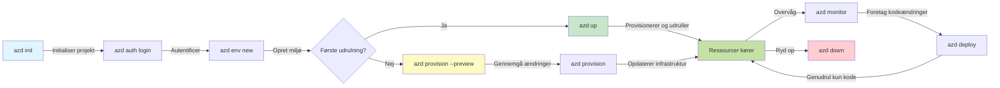

# AZD Basics - Forståelse af Azure Developer CLI

# AZD Basics - Kernebegreber og Fundament

**Chapter Navigation:**
- **📚 Kursusforside**: [AZD for begyndere](../../README.md)
- **📖 Aktuelt kapitel**: Kapitel 1 - Grundlag & Hurtigstart
- **⬅️ Forrige**: [Kursusoversigt](../../README.md#-chapter-1-foundation--quick-start)
- **➡️ Næste**: [Installation og opsætning](installation.md)
- **🚀 Næste kapitel**: [Kapitel 2: AI-først udvikling](../chapter-02-ai-development/microsoft-foundry-integration.md)

## Introduktion

Denne lektion introducerer dig til Azure Developer CLI (azd), et kraftfuldt kommandolinjeværktøj, der fremskynder din rejse fra lokal udvikling til Azure-udrulning. Du vil lære de grundlæggende begreber, kernefunktioner og forstå, hvordan azd forenkler udrulning af cloud-native applikationer.

## Læringsmål

Ved slutningen af denne lektion vil du:
- Forstå hvad Azure Developer CLI er og dets primære formål
- Lære kernebegreberne om skabeloner, miljøer og services
- Udforske nøglefunktioner inklusiv skabelonstyret udvikling og Infrastruktur som kode
- Forstå azd-projektstruktur og workflow
- Være forberedt på at installere og konfigurere azd til dit udviklingsmiljø

## Læringsudbytte

Efter at have gennemført denne lektion vil du kunne:
- Forklare azd’s rolle i moderne cloud-udviklingsworkflows
- Identificere komponenterne i en azd-projektstruktur
- Beskrive hvordan skabeloner, miljøer og services arbejder sammen
- Forstå fordelene ved Infrastruktur som kode med azd
- Genkende forskellige azd-kommandoer og deres formål

## Hvad er Azure Developer CLI (azd)?

Azure Developer CLI (azd) er et kommandolinjeværktøj designet til at fremskynde din rejse fra lokal udvikling til Azure-udrulning. Det forenkler processen med at bygge, udrulle og administrere cloud-native applikationer på Azure.

### 🎯 Hvorfor bruge AZD? En realistisk sammenligning

Lad os sammenligne udrulning af en simpel webapp med database:

#### ❌ UDEN AZD: Manuel Azure-udrulning (30+ minutter)

```bash
# Trin 1: Opret ressourcegruppe
az group create --name myapp-rg --location eastus

# Trin 2: Opret App Service-plan
az appservice plan create --name myapp-plan \
  --resource-group myapp-rg \
  --sku B1 --is-linux

# Trin 3: Opret Web-app
az webapp create --name myapp-web-unique123 \
  --resource-group myapp-rg \
  --plan myapp-plan \
  --runtime "NODE:18-lts"

# Trin 4: Opret Cosmos DB-konto (10-15 minutter)
az cosmosdb create --name myapp-cosmos-unique123 \
  --resource-group myapp-rg \
  --kind MongoDB

# Trin 5: Opret database
az cosmosdb mongodb database create \
  --account-name myapp-cosmos-unique123 \
  --resource-group myapp-rg \
  --name tododb

# Trin 6: Opret kollektion
az cosmosdb mongodb collection create \
  --account-name myapp-cosmos-unique123 \
  --resource-group myapp-rg \
  --database-name tododb \
  --name todos

# Trin 7: Hent forbindelsesstreng
CONN_STR=$(az cosmosdb keys list \
  --name myapp-cosmos-unique123 \
  --resource-group myapp-rg \
  --type connection-strings \
  --query "connectionStrings[0].connectionString" -o tsv)

# Trin 8: Konfigurer appindstillinger
az webapp config appsettings set \
  --name myapp-web-unique123 \
  --resource-group myapp-rg \
  --settings MONGODB_URI="$CONN_STR"

# Trin 9: Aktivér logning
az webapp log config --name myapp-web-unique123 \
  --resource-group myapp-rg \
  --application-logging filesystem \
  --detailed-error-messages true

# Trin 10: Opsæt Application Insights
az monitor app-insights component create \
  --app myapp-insights \
  --location eastus \
  --resource-group myapp-rg

# Trin 11: Forbind App Insights med Web App
INSTRUMENTATION_KEY=$(az monitor app-insights component show \
  --app myapp-insights \
  --resource-group myapp-rg \
  --query "instrumentationKey" -o tsv)

az webapp config appsettings set \
  --name myapp-web-unique123 \
  --resource-group myapp-rg \
  --settings APPINSIGHTS_INSTRUMENTATIONKEY="$INSTRUMENTATION_KEY"

# Trin 12: Byg applikationen lokalt
npm install
npm run build

# Trin 13: Opret udrulningspakke
zip -r app.zip . -x "*.git*" "node_modules/*"

# Trin 14: Udrul applikationen
az webapp deployment source config-zip \
  --resource-group myapp-rg \
  --name myapp-web-unique123 \
  --src app.zip

# Trin 15: Vent og bed om, at det virker 🙏
# (Ingen automatisk validering, manuel test kræves)
```

**Problemer:**
- ❌ 15+ kommandoer at huske og køre i rækkefølge
- ❌ 30-45 minutters manuelt arbejde
- ❌ Nem at lave fejl (tastefejl, forkerte parametre)
- ❌ Connection strings eksponeret i terminalhistorikken
- ❌ Ingen automatisk rollback hvis noget fejler
- ❌ Svært at reproducere for teammedlemmer
- ❌ Forskelligt hver gang (ikke reproducerbart)

#### ✅ MED AZD: Automatiseret udrulning (5 kommandoer, 10-15 minutter)

```bash
# Trin 1: Initialiser fra skabelon
azd init --template todo-nodejs-mongo

# Trin 2: Autentificer
azd auth login

# Trin 3: Opret miljø
azd env new dev

# Trin 4: Forhåndsvis ændringer (valgfrit, men anbefales)
azd provision --preview

# Trin 5: Udrul alt
azd up

# ✨ Færdig! Alt er udrullet, konfigureret og overvåget
```

**Fordele:**
- ✅ **5 kommandoer** vs. 15+ manuelle trin
- ✅ **10-15 minutter** i alt (for det meste ventetid mod Azure)
- ✅ **Ingen fejl** - automatiseret og testet
- ✅ **Hemmelige værdier håndteres sikkert** via Key Vault
- ✅ **Automatisk rollback** ved fejl
- ✅ **Fuldstændig reproducerbar** - samme resultat hver gang
- ✅ **Klar til teamet** - alle kan udrulle med samme kommandoer
- ✅ **Infrastruktur som kode** - versionsstyrede Bicep-skabeloner
- ✅ **Indbygget overvågning** - Application Insights konfigureret automatisk

### 📊 Tids- og fejlreduktion

| Metric | Manuel Deployment | AZD Deployment | Improvement |
|:-------|:------------------|:---------------|:------------|
| **Commands** | 15+ | 5 | 67% færre |
| **Time** | 30-45 min | 10-15 min | 60% hurtigere |
| **Error Rate** | ~40% | <5% | 88% reduktion |
| **Consistency** | Low (manual) | 100% (automated) | Perfekt |
| **Team Onboarding** | 2-4 hours | 30 minutes | 75% hurtigere |
| **Rollback Time** | 30+ min (manual) | 2 min (automated) | 93% hurtigere |

## Kernebegreber

### Skabeloner
Skabeloner er fundamentet for azd. De indeholder:
- **Applikationskode** - Din kildekode og afhængigheder
- **Infrastrukturdefinitioner** - Azure-ressourcer defineret i Bicep eller Terraform
- **Konfigurationsfiler** - Indstillinger og miljøvariabler
- **Udrulningsscripts** - Automatiserede udrulningsworkflows

### Miljøer
Miljøer repræsenterer forskellige udrulningsmål:
- **Development** - Til test og udvikling
- **Staging** - Forproduktionsmiljø
- **Production** - Live produktionsmiljø

Hvert miljø opretholder sit eget:
- Azure resource group
- Konfigurationsindstillinger
- Udrulningstilstand

### Services
Services er byggestenene i din applikation:
- **Frontend** - Webapplikationer, SPA’er
- **Backend** - API’er, microservices
- **Database** - Datastyringsløsninger
- **Storage** - Fil- og blob-lagring

## Nøglefunktioner

### 1. Skabelonstyret udvikling
```bash
# Gennemse tilgængelige skabeloner
azd template list

# Initialiser fra en skabelon
azd init --template <template-name>
```

### 2. Infrastruktur som kode
- **Bicep** - Azures domænespecifikke sprog
- **Terraform** - Multi-cloud infrastrukturværktøj
- **ARM Templates** - Azure Resource Manager-skabeloner

### 3. Integrerede arbejdsgange
```bash
# Komplet udrulningsarbejdsgang
azd up            # Provision + Deploy, dette kræver ingen manuel indgriben til første opsætning

# 🧪 NYT: Forhåndsvis infrastrukturændringer før udrulning (SIKKER)
azd provision --preview    # Simuler udrulning af infrastruktur uden at foretage ændringer

azd provision     # Opret Azure-ressourcer, brug dette, hvis du opdaterer infrastrukturen
azd deploy        # Udrul applikationskode eller genudrul koden efter en opdatering
azd down          # Ryd op i ressourcerne
```

#### 🛡️ Sikker infrastrukturplanlægning med Preview
Kommandoen `azd provision --preview` er en game-changer til sikre udrulninger:
- **Tørkørselsanalyse** - Viser hvad der vil blive oprettet, ændret eller slettet
- **Null risiko** - Ingen faktiske ændringer foretages i dit Azure-miljø
- **Team-samarbejde** - Del preview-resultater før udrulning
- **Omkostningsestimering** - Forstå ressourceomkostninger før forpligtelse

```bash
# Eksempel på workflow til forhåndsvisning
azd provision --preview           # Se, hvad der vil ændre sig
# Gennemgå outputtet, diskuter med teamet
azd provision                     # Anvend ændringerne med tillid
```

### 📊 Visuel: AZD udviklingsworkflow


**Workflow Explanation:**
1. **Init** - Start med skabelon eller nyt projekt
2. **Auth** - Autentificer med Azure
3. **Environment** - Opret isoleret udrulningsmiljø
4. **Preview** - 🆕 Forhåndsvis altid infrastrukturændringer først (sikker praksis)
5. **Provision** - Opret/opdater Azure-ressourcer
6. **Deploy** - Push din applikationskode
7. **Monitor** - Observer applikationsydelse
8. **Iterate** - Foretag ændringer og genudrul kode
9. **Cleanup** - Fjern ressourcer når du er færdig

### 4. Miljøstyring
```bash
# Opret og administrer miljøer
azd env new <environment-name>
azd env select <environment-name>
azd env list
```

## 📁 Projektstruktur

En typisk azd-projektstruktur:
```
my-app/
├── .azd/                    # azd configuration
│   └── config.json
├── .azure/                  # Azure deployment artifacts
├── .devcontainer/          # Development container config
├── .github/workflows/      # GitHub Actions
├── .vscode/               # VS Code settings
├── infra/                 # Infrastructure code
│   ├── main.bicep        # Main infrastructure template
│   ├── main.parameters.json
│   └── modules/          # Reusable modules
├── src/                  # Application source code
│   ├── api/             # Backend services
│   └── web/             # Frontend application
├── azure.yaml           # azd project configuration
└── README.md
```

## 🔧 Konfigurationsfiler

### azure.yaml
Hovedprojektets konfigurationsfil:
```yaml
name: my-awesome-app
metadata:
  template: my-template@1.0.0

services:
  web:
    project: ./src/web
    language: js
    host: appservice
  api:
    project: ./src/api
    language: js
    host: appservice

hooks:
  preprovision:
    shell: pwsh
    run: echo "Preparing to provision..."
```

### .azure/config.json
Miljøspecifik konfiguration:
```json
{
  "version": 1,
  "defaultEnvironment": "dev",
  "environments": {
    "dev": {
      "subscriptionId": "your-subscription-id",
      "location": "eastus"
    }
  }
}
```

## 🎪 Almindelige arbejdsgange med hands-on øvelser

> **💡 Læringstip:** Følg disse øvelser i rækkefølge for at opbygge dine AZD-færdigheder gradvist.

### 🎯 Øvelse 1: Initialiser dit første projekt

**Mål:** Opret et AZD-projekt og udforsk dets struktur

**Trin:**
```bash
# Brug en gennemprøvet skabelon
azd init --template todo-nodejs-mongo

# Gennemse de genererede filer
ls -la  # Vis alle filer, inklusive skjulte

# Vigtige filer oprettet:
# - azure.yaml (hovedkonfiguration)
# - infra/ (infrastrukturkode)
# - src/ (applikationskode)
```

**✅ Succes:** Du har azure.yaml, infra/ og src/ mapper

---

### 🎯 Øvelse 2: Udrul til Azure

**Mål:** Færdiggør end-to-end udrulning

**Trin:**
```bash
# 1. Autentificer
az login && azd auth login

# 2. Opret miljø
azd env new dev
azd env set AZURE_LOCATION eastus

# 3. Forhåndsvis ændringer (ANBEFALES)
azd provision --preview

# 4. Udrul alt
azd up

# 5. Bekræft udrulning
azd show    # 6. Se din app-URL
```

**Forventet tid:** 10-15 minutter  
**✅ Succes:** Applikations-URL åbner i browseren

---

### 🎯 Øvelse 3: Flere miljøer

**Mål:** Udrul til dev og staging

**Trin:**
```bash
# Har allerede dev, opret staging
azd env new staging
azd env set AZURE_LOCATION westus2
azd up

# Skift mellem dem
azd env list
azd env select dev
```

**✅ Succes:** To separate resource groups i Azure Portal

---

### 🛡️ Clean Slate: `azd down --force --purge`

Når du har brug for fuldstændigt at nulstille:

```bash
azd down --force --purge
```

**Hvad den gør:**
- `--force`: Ingen bekræftelsesprompt
- `--purge`: Sletter alt lokalt state og Azure-ressourcer

**Brug når:**
- Udrulning fejlede undervejs
- Skifter projekter
- Har brug for en frisk start

---

## 🎪 Originalt workflow-reference

### Starte et nyt projekt
```bash
# Metode 1: Brug eksisterende skabelon
azd init --template todo-nodejs-mongo

# Metode 2: Start fra bunden
azd init

# Metode 3: Brug den aktuelle mappe
azd init .
```

### Udviklingscyklus
```bash
# Opsæt udviklingsmiljø
azd auth login
azd env new dev
azd env select dev

# Udrul alt
azd up

# Foretag ændringer og udrul igen
azd deploy

# Ryd op, når du er færdig
azd down --force --purge # kommandoen i Azure Developer CLI er en **hård nulstilling** for dit miljø—især nyttig, når du fejlsøger mislykkede udrulninger, rydder op i forældreløse ressourcer eller forbereder en frisk genudrulning
```

## Forstå `azd down --force --purge`
Kommandoen `azd down --force --purge` er en kraftfuld måde at fuldstændigt nedtage dit azd-miljø og alle tilknyttede ressourcer. Her er en opdeling af hvad hver flag gør:
```
--force
```
- Springer bekræftelsesprompter over.
- Nyttigt til automatisering eller scripting hvor manuel input ikke er muligt.
- Sikrer at nedtagningen fortsætter uden afbrydelser, selv hvis CLI’en opdager inkonsistenser.

```
--purge
```
Sletter **al tilknyttet metadata**, inklusive:
Miljøtilstand
Lokal `.azure`-mappe
Cachet udrulningsinformation
Forhindrer azd i at "huske" tidligere udrulninger, hvilket kan forårsage problemer som uoverensstemmende ressourcegrupper eller forældede registry-referencer.


### Hvorfor bruge begge?
Når du er kørt fast med `azd up` på grund af tilbageværende state eller delvise udrulninger, sikrer denne kombination en **ren start**.

Det er især nyttigt efter manuelle sletninger af ressourcer i Azure-portalen eller når du skifter skabeloner, miljøer eller navngivningskonventioner for resource groups.


### Håndtering af flere miljøer
```bash
# Opret staging-miljø
azd env new staging
azd env select staging
azd up

# Skift tilbage til dev
azd env select dev

# Sammenlign miljøer
azd env list
```

## 🔐 Autentificering og legitimationsoplysninger

Forståelse af autentificering er afgørende for succesfulde azd-udrulninger. Azure bruger flere autentificeringsmetoder, og azd udnytter den samme credential chain som andre Azure-værktøjer.

### Azure CLI-autentificering (`az login`)

Før du bruger azd, skal du autentificere med Azure. Den mest almindelige metode er at bruge Azure CLI:

```bash
# Interaktiv login (åbner browseren)
az login

# Log ind med specifik lejer
az login --tenant <tenant-id>

# Log ind med serviceprincipal
az login --service-principal -u <app-id> -p <password> --tenant <tenant-id>

# Kontroller nuværende loginstatus
az account show

# Vis tilgængelige abonnementer
az account list --output table

# Indstil standardabonnement
az account set --subscription <subscription-id>
```

### Autentificeringsflow
1. **Interaktiv login**: Åbner din standardbrowser til autentificering
2. **Device Code Flow**: Til miljøer uden browseradgang
3. **Service Principal**: Til automatisering og CI/CD-scenarier
4. **Managed Identity**: Til Azure-hostede applikationer

### DefaultAzureCredential-kæden

`DefaultAzureCredential` er en credential-type, der giver en forenklet autentificeringsoplevelse ved automatisk at prøve flere credential-kilder i en bestemt rækkefølge:

#### Credential Chain Order

#### 1. Environment Variables
```bash
# Indstil miljøvariabler for tjenesteprincipal
export AZURE_CLIENT_ID="<app-id>"
export AZURE_CLIENT_SECRET="<password>"
export AZURE_TENANT_ID="<tenant-id>"
```

#### 2. Workload Identity (Kubernetes/GitHub Actions)
Bruges automatisk i:
- Azure Kubernetes Service (AKS) med Workload Identity
- GitHub Actions med OIDC-føderation
- Andre fødererede identitetsscenarier

#### 3. Managed Identity
For Azure-ressourcer som:
- Virtual Machines
- App Service
- Azure Functions
- Container Instances

```bash
# Kontroller, om der kører på en Azure-ressource med administreret identitet
az account show --query "user.type" --output tsv
# Returnerer: "servicePrincipal" hvis der bruges administreret identitet
```

#### 4. Developer Tools Integration
- **Visual Studio**: Bruger automatisk den indloggede konto
- **VS Code**: Bruger Azure Account-udvidelsens legitimationsoplysninger
- **Azure CLI**: Bruger `az login`-legitimationsoplysninger (mest almindelig til lokal udvikling)

### AZD Authentication Setup

```bash
# Metode 1: Brug Azure CLI (Anbefalet til udvikling)
az login
azd auth login  # Bruger eksisterende Azure CLI-legitimationsoplysninger

# Metode 2: Direkte azd-godkendelse
azd auth login --use-device-code  # Til headless-miljøer

# Metode 3: Kontroller godkendelsesstatus
azd auth login --check-status

# Metode 4: Log ud og log ind igen
azd auth logout
azd auth login
```

### Autentificerings bedste praksis

#### Til lokal udvikling
```bash
# 1. Log ind med Azure CLI
az login

# 2. Bekræft korrekt abonnement
az account show
az account set --subscription "Your Subscription Name"

# 3. Brug azd med eksisterende legitimationsoplysninger
azd auth login
```

#### Til CI/CD-pipelines
```yaml
# GitHub Actions example
- name: Azure Login
  uses: azure/login@v1
  with:
    creds: ${{ secrets.AZURE_CREDENTIALS }}

- name: Deploy with azd
  run: |
    azd auth login --client-id ${{ secrets.AZURE_CLIENT_ID }} \
                    --client-secret ${{ secrets.AZURE_CLIENT_SECRET }} \
                    --tenant-id ${{ secrets.AZURE_TENANT_ID }}
    azd up --no-prompt
```

#### Til produktionsmiljøer
- Brug **Managed Identity** når du kører på Azure-ressourcer
- Brug **Service Principal** til automatiseringsscenarier
- Undgå at gemme legitimationsoplysninger i kode eller konfigurationsfiler
- Brug **Azure Key Vault** til følsom konfiguration

### Almindelige autentificeringsproblemer og løsninger

#### Problem: "No subscription found"
```bash
# Løsning: Angiv standardabonnement
az account list --output table
az account set --subscription "<subscription-id>"
azd env set AZURE_SUBSCRIPTION_ID "<subscription-id>"
```

#### Problem: "Insufficient permissions"
```bash
# Løsning: Kontroller og tildel nødvendige roller
az role assignment list --assignee $(az account show --query user.name --output tsv)

# Almindelige krævede roller:
# - Contributor (til ressourcestyring)
# - User Access Administrator (til tildeling af roller)
```

#### Problem: "Token expired"
```bash
# Løsning: Autentificer igen
az logout
az login
azd auth logout
azd auth login
```

### Autentificering i forskellige scenarier

#### Lokal udvikling
```bash
# Personlig udviklingskonto
az login
azd auth login
```

#### Team-udvikling
```bash
# Brug en specifik tenant til organisationen
az login --tenant contoso.onmicrosoft.com
azd auth login
```

#### Multi-tenant scenarier
```bash
# Skift mellem lejere
az login --tenant tenant1.onmicrosoft.com
# Udrul til lejer 1
azd up

az login --tenant tenant2.onmicrosoft.com  
# Udrul til lejer 2
azd up
```

### Sikkerhedsovervejelser

1. **Opbevaring af legitimationsoplysninger**: Gem aldrig legitimationsoplysninger i kildekode
2. **Begrænsning af scope**: Brug mindst-privilegium princippet for service principals
3. **Token-rotation**: Rotér regelmæssigt service principal-secrets
4. **Audit trail**: Overvåg autentificerings- og udrulningsaktiviteter
5. **Netværkssikkerhed**: Brug private endpoints når muligt

### Fejlfinding af autentificering

```bash
# Fejlfind autentificeringsproblemer
azd auth login --check-status
az account show
az account get-access-token

# Almindelige diagnostiske kommandoer
whoami                          # Nuværende brugerkontekst
az ad signed-in-user show      # Azure AD-brugerdetaljer
az group list                  # Test adgang til ressourcer
```

## Forstå `azd down --force --purge`

### Opdagelse
```bash
azd template list              # Gennemse skabeloner
azd template show <template>   # Skabelondetaljer
azd init --help               # Initialiseringsindstillinger
```

### Projektstyring
```bash
azd show                     # Projektoversigt
azd env show                 # Nuværende miljø
azd config list             # Konfigurationsindstillinger
```

### Overvågning
```bash
azd monitor                  # Åbn overvågning i Azure-portalen
azd monitor --logs           # Vis applikationslogfiler
azd monitor --live           # Vis live-metrikker
azd pipeline config          # Opsæt CI/CD
```

## Bedste praksis

### 1. Brug meningsfulde navne
```bash
# God
azd env new production-east
azd init --template web-app-secure

# Undgå
azd env new env1
azd init --template template1
```

### 2. Udnyt skabeloner
- Start med eksisterende skabeloner
- Tilpas til dine behov
- Opret genanvendelige skabeloner for din organisation

### 3. Miljøisolation
- Brug separate miljøer til dev/staging/prod
- Udrul aldrig direkte til produktion fra en lokal maskine
- Brug CI/CD-pipelines til produktionsudrulninger

### 4. Konfigurationsstyring
- Brug miljøvariabler til følsomme data
- Hold konfiguration i versionsstyring
- Dokumentér miljøspecifikke indstillinger

## Læringsprogression

### Begynder (Uge 1-2)
1. Installer azd og autentificer
2. Udrul en simpel skabelon
3. Forstå projektstruktur
4. Lær grundlæggende kommandoer (up, down, deploy)

### Mellem (Uge 3-4)
1. Tilpas skabeloner
2. Håndter flere miljøer
3. Forstå infrastrukturkode
4. Opsæt CI/CD-pipelines

### Avanceret (Uge 5+)
1. Opret brugerdefinerede skabeloner
2. Avancerede infrastrukturmønstre
3. Multi-region udrulninger
4. Enterprise-grade konfigurationer

## Næste skridt

**📖 Fortsæt kapitel 1:**
- [Installation & Setup](installation.md) - Få azd installeret og konfigureret
- [Your First Project](first-project.md) - Komplet, praktisk vejledning
- [Configuration Guide](configuration.md) - Avancerede konfigurationsmuligheder

**🎯 Klar til næste kapitel?**
- [Chapter 2: AI-First Development](../chapter-02-ai-development/microsoft-foundry-integration.md) - Begynd at bygge AI-applikationer

## Yderligere ressourcer

- [Azure Developer CLI Overview](https://learn.microsoft.com/en-us/azure/developer/azure-developer-cli/)
- [Template Gallery](https://azure.github.io/awesome-azd/)
- [Community Samples](https://github.com/Azure-Samples)

---

## 🙋 Ofte stillede spørgsmål

### Generelle spørgsmål

**Q: Hvad er forskellen mellem AZD og Azure CLI?**

A: Azure CLI (`az`) bruges til at administrere enkelte Azure-ressourcer. AZD (`azd`) bruges til at administrere hele applikationer:

```bash
# Azure CLI - Lavniveau ressourcestyring
az webapp create --name myapp --resource-group rg
az sql server create --name myserver --resource-group rg
# ...mange flere kommandoer er nødvendige

# AZD - Administration på applikationsniveau
azd up  # Udruller hele appen med alle ressourcer
```

**Se det på denne måde:**
- `az` = Arbejde med enkelte Lego-klodser
- `azd` = Arbejde med komplette Lego-sæt

---

**Q: Skal jeg kende Bicep eller Terraform for at bruge AZD?**

A: Nej! Start med skabeloner:
```bash
# Brug eksisterende skabelon - ingen IaC-viden nødvendig
azd init --template todo-nodejs-mongo
azd up
```

Du kan lære Bicep senere for at tilpasse infrastrukturen. Skabeloner giver fungerende eksempler, som du kan lære af.

---

**Q: Hvad koster det at køre AZD-skabeloner?**

A: Omkostningerne varierer efter skabelon. De fleste udviklingsskabeloner koster $50-150/pr. måned:

```bash
# Forhåndsvis omkostninger før udrulning
azd provision --preview

# Ryd altid op, når det ikke er i brug
azd down --force --purge  # Fjerner alle ressourcer
```

**Pro tip:** Brug gratis niveauer hvor det er muligt:
- App Service: F1 (Free) tier
- Azure OpenAI: 50,000 tokens/month free
- Cosmos DB: 1000 RU/s free tier

---

**Q: Kan jeg bruge AZD med eksisterende Azure-ressourcer?**

A: Ja, men det er nemmere at starte forfra. AZD fungerer bedst, når det styrer hele livscyklussen. For eksisterende ressourcer:

```bash
# Mulighed 1: Importer eksisterende ressourcer (avanceret)
azd init
# Ændr derefter infra/ for at pege på eksisterende ressourcer

# Mulighed 2: Start forfra (anbefales)
azd init --template matching-your-stack
azd up  # Opretter nyt miljø
```

---

**Q: Hvordan deler jeg mit projekt med teammedlemmer?**

A: Commit AZD-projektet til Git (men IKKE .azure-mappen):

```bash
# Allerede i .gitignore som standard
.azure/        # Indeholder hemmeligheder og miljødata
*.env          # Miljøvariabler

# Teammedlemmer derefter:
git clone <your-repo>
azd auth login
azd env new <their-name>-dev
azd up
```

Alle får identisk infrastruktur fra de samme skabeloner.

---

### Fejlfinding

**Q: "azd up" mislykkedes halvvejs. Hvad gør jeg?**

A: Tjek fejlen, ret den, og prøv igen:

```bash
# Vis detaljerede logfiler
azd show

# Almindelige rettelser:

# 1. Hvis kvoten er overskredet:
azd env set AZURE_LOCATION "westus2"  # Prøv en anden region

# 2. Hvis der er konflikt om ressourcenavnet:
azd down --force --purge  # Start forfra
azd up  # Prøv igen

# 3. Hvis godkendelsen er udløbet:
az login
azd auth login
azd up
```

**Det mest almindelige problem:** Forkert Azure-abonnement valgt
```bash
az account list --output table
az account set --subscription "<correct-subscription>"
```

---

**Q: Hvordan udruller jeg kun kodeændringer uden at reprovisionere?**

A: Brug `azd deploy` i stedet for `azd up`:

```bash
azd up          # Første gang: opsætning + udrulning (langsom)

# Lav kodeændringer...

azd deploy      # Efterfølgende gange: kun udrulning (hurtigt)
```

Hastighedssammenligning:
- `azd up`: 10-15 minutter (provisionerer infrastruktur)
- `azd deploy`: 2-5 minutter (kun kode)

---

**Q: Kan jeg tilpasse infrastruktur-skabelonerne?**

A: Ja! Rediger Bicep-filerne i `infra/`:

```bash
# Efter azd init
cd infra/
code main.bicep  # Rediger i VS Code

# Forhåndsvis ændringer
azd provision --preview

# Anvend ændringer
azd provision
```

**Tip:** Start småt - skift SKUs først:
```bicep
// infra/main.bicep
sku: {
  name: 'B1'  // Change to 'P1V2' for production
}
```

---

**Q: Hvordan sletter jeg alt, som AZD har oprettet?**

A: Én kommando fjerner alle ressourcer:

```bash
azd down --force --purge

# Dette sletter:
# - Alle Azure-ressourcer
# - Ressourcegruppe
# - Lokal miljøtilstand
# - Cachede udrulningsdata
```

**Kør altid dette når:**
- Færdig med at teste en skabelon
- Skifter til et andet projekt
- Vil starte forfra

**Spar penge:** Sletning af ubenyttede ressourcer = $0 omkostninger

---

**Q: Hvad hvis jeg ved et uheld slettede ressourcer i Azure-portalen?**

A: AZD-tilstanden kan komme ud af synk. Fremgangsmåde for ren start:
```bash
# 1. Fjern lokal tilstand
azd down --force --purge

# 2. Start forfra
azd up

# Alternativ: Lad AZD opdage og rette
azd provision  # Vil oprette manglende ressourcer
```

---

### Avancerede spørgsmål

**Q: Kan jeg bruge AZD i CI/CD-pipelines?**

A: Ja! GitHub Actions-eksempel:

```yaml
# .github/workflows/deploy.yml
name: Deploy with AZD

on:
  push:
    branches: [main]

jobs:
  deploy:
    runs-on: ubuntu-latest
    steps:
      - uses: actions/checkout@v2
      
      - name: Install azd
        run: curl -fsSL https://aka.ms/install-azd.sh | bash
      
      - name: Azure Login
        run: |
          azd auth login \
            --client-id ${{ secrets.AZURE_CLIENT_ID }} \
            --client-secret ${{ secrets.AZURE_CLIENT_SECRET }} \
            --tenant-id ${{ secrets.AZURE_TENANT_ID }}
      
      - name: Deploy
        run: azd up --no-prompt
```

---

**Q: Hvordan håndterer jeg hemmeligheder og følsomme data?**

A: AZD integreres automatisk med Azure Key Vault:

```bash
# Hemmeligheder gemmes i Key Vault, ikke i koden
azd env set DATABASE_PASSWORD "$(openssl rand -base64 32)"

# AZD gør automatisk:
# 1. Opretter Key Vault
# 2. Gemmer en hemmelighed
# 3. Tildeler app adgang via Managed Identity
# 4. Injicerer ved kørselstid
```

**Commit aldrig:**
- `.azure/` mappen (indeholder miljødata)
- `.env` filer (lokale hemmeligheder)
- Connection strings

---

**Q: Kan jeg udrulle til flere regioner?**

A: Ja, opret et miljø pr. region:

```bash
# Miljø i det østlige USA
azd env new prod-eastus
azd env set AZURE_LOCATION eastus
azd up

# Miljø i det vestlige Europa
azd env new prod-westeurope
azd env set AZURE_LOCATION westeurope
azd up

# Hvert miljø er uafhængigt
azd env list
```

For ægte multi-region-apps, tilpas Bicep-skabelonerne til at udrulle til flere regioner samtidigt.

---

**Q: Hvor kan jeg få hjælp, hvis jeg sidder fast?**

1. **AZD-dokumentation:** https://learn.microsoft.com/azure/developer/azure-developer-cli/
2. **GitHub Issues:** https://github.com/Azure/azure-dev/issues
3. **Discord:** [Azure Discord](https://discord.gg/microsoft-azure) - #azure-developer-cli-kanal
4. **Stack Overflow:** Brug tagget `azure-developer-cli`
5. **Dette kursus:** [Troubleshooting Guide](../chapter-07-troubleshooting/common-issues.md)

**Pro tip:** Før du spørger, kør:
```bash
azd show       # Viser den aktuelle tilstand
azd version    # Viser din version
```
Inkluder disse oplysninger i dit spørgsmål for hurtigere hjælp.

---

## 🎓 Hvad er næste skridt?

Du forstår nu AZD-grundprincipperne. Vælg din vej:

### 🎯 For begyndere:
1. **Næste:** [Installation & Setup](installation.md) - Installer AZD på din maskine
2. **Derefter:** [Your First Project](first-project.md) - Udrul din første app
3. **Øv:** Fuldfør alle 3 øvelser i denne lektion

### 🚀 For AI-udviklere:
1. **Spring til:** [Chapter 2: AI-First Development](../chapter-02-ai-development/microsoft-foundry-integration.md)
2. **Udrul:** Start med `azd init --template get-started-with-ai-chat`
3. **Lær:** Byg mens du udruller

### 🏗️ For erfarne udviklere:
1. **Gennemgå:** [Configuration Guide](configuration.md) - Avancerede indstillinger
2. **Udforsk:** [Infrastructure as Code](../chapter-04-infrastructure/provisioning.md) - Bicep-dybdegående gennemgang
3. **Byg:** Opret brugerdefinerede skabeloner til din stak

---

**Kapitelnavigation:**
- **📚 Kursusforside**: [AZD for begyndere](../../README.md)
- **📖 Nuværende kapitel**: Kapitel 1 - Fundament & Hurtig Start  
- **⬅️ Forrige**: [Course Overview](../../README.md#-chapter-1-foundation--quick-start)
- **➡️ Næste**: [Installation & Setup](installation.md)
- **🚀 Næste kapitel**: [Chapter 2: AI-First Development](../chapter-02-ai-development/microsoft-foundry-integration.md)

---

<!-- CO-OP TRANSLATOR DISCLAIMER START -->
Ansvarsfraskrivelse:
Dette dokument er blevet oversat ved hjælp af AI-oversættelsestjenesten [Co-op Translator](https://github.com/Azure/co-op-translator). Selvom vi bestræber os på nøjagtighed, skal du være opmærksom på, at automatiserede oversættelser kan indeholde fejl eller unøjagtigheder. Originaldokumentet på dets oprindelige sprog bør betragtes som den autoritative kilde. For kritiske oplysninger anbefales professionel menneskelig oversættelse. Vi kan ikke holdes ansvarlige for eventuelle misforståelser eller fejltolkninger som følge af brugen af denne oversættelse.
<!-- CO-OP TRANSLATOR DISCLAIMER END -->