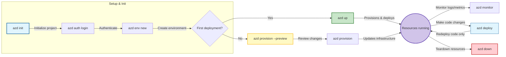
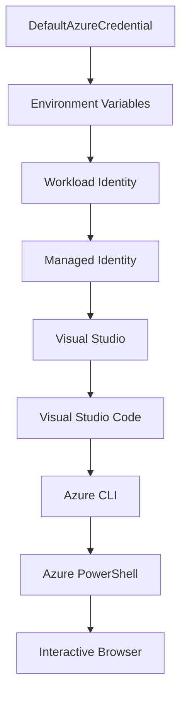

# AZD Grundlæggende - Kernebegreber og Fundament

**Kapitelnavigation:**
- **📚 Kursus Hjem**: [AZD For Begyndere](../../README.md)
- **📖 Aktuelt Kapitel**: Kapitel 1 - Grundlag og Hurtig Start
- **⬅️ Forrige**: [Kursus Oversigt](../../README.md#-chapter-1-foundation--quick-start)
- **➡️ Næste**: [Installation & Opsætning](installation.md)
- **🚀 Næste Kapitel**: [Kapitel 2: AI-Første Udvikling](../chapter-02-ai-development/microsoft-foundry-integration.md)

## Introduktion

> Gennemgået mod `azd 1.37.2` (November 2026). Bash-kommandoer bruger citerede pladsholdere, som du skal erstatte. Skabelon-arbejdsgange bruger `.` til at initialisere den aktuelle mappe; uden et mappeargument opretter skabeloninitialisering en undermappe og ændrer ikke skallen arbejdsmappe. Avancerede uddrag er illustrerende, ikke komplette projekter.

Denne lektion introducerer dig til Azure Developer CLI (azd), et kraftfuldt kommandolinjeværktøj, der fremskynder din rejse fra lokal udvikling til Azure-udrulning. Du vil lære de grundlæggende begreber, kernefunktioner og forstå, hvordan azd forenkler cloud-native applikationsudrulning.

## Læringsmål

Ved slutningen af denne lektion vil du:
- Forstå, hvad Azure Developer CLI er, og dets primære formål
- Lære kernebegreberne om skabeloner, miljøer og tjenester
- Udforske nøglefunktioner inklusive skabelondrevet udvikling og Infrastructure as Code
- Forstå azd projektstruktur og arbejdsgang
- Være forberedt på at installere og konfigurere azd til dit udviklingsmiljø

## Læringsresultater

Efter at have gennemført denne lektion, vil du kunne:
- Forklare azd's rolle i moderne cloud-udviklingsarbejdsgange
- Identificere komponenterne i en azd projektstruktur
- Beskrive, hvordan skabeloner, miljøer og tjenester arbejder sammen
- Forstå fordelene ved Infrastructure as Code med azd
- Genkende forskellige azd kommandoer og deres formål

## Hvad er Azure Developer CLI (azd)?

Azure Developer CLI (azd) er et kommandolinjeværktøj designet til at fremskynde din rejse fra lokal udvikling til Azure-udrulning. Det forenkler processen med at bygge, udrulle og administrere cloud-native applikationer på Azure.

### Hvad kan du udrulle med azd?

azd understøtter en bred vifte af arbejdsbelastninger — og listen vokser stadig. I dag kan du bruge azd til at udrulle:

| Arbejdsbelastningstype | Eksempler | Samme arbejdsgang? |
|----------------------|----------|------------------|
| **Traditionelle applikationer** | Webapps, REST API'er, statiske sider | ✅ `azd up` |
| **Tjenester og mikroservices** | Container Apps, Function Apps, multi-service backend | ✅ `azd up` |
| **AI-drevne applikationer** | Chat apps med Microsoft Foundry Models, RAG-løsninger med AI Search | ✅ `azd up` |
| **Intelligente agenter** | Foundry-hostede agenter, multi-agent orkestration | ✅ `azd up` |

Den vigtige indsigt er, at **azd's livscyklus forbliver den samme uanset, hvad du udruller**. Du initialiserer et projekt, provisionerer infrastruktur, udruller din kode, overvåger din app og rydder op — uanset om det er et simpelt websted eller en sofistikeret AI-agent.

Denne kontinuitet er designet. azd betragter AI-funktioner som en anden slags tjeneste, din applikation kan bruge, ikke som noget fundamentalt anderledes. En chat-endpoint bakket op af Microsoft Foundry Models er, fra azds perspektiv, blot en anden tjeneste at konfigurere og udrulle.

### 🎯 Hvorfor bruge AZD? En virkelighedsnær sammenligning

Lad os sammenligne udrulning af en simpel webapp med database:

#### ❌ UDEN AZD: Manuel Azure Udrulning (30+ minutter)

**Illustrativ Bash-sammenligning, ikke en kørbar applikationsstarter.** Dette antager eksisterende applikationskode, unikke ressourcename, Azure CLI-godkendelse og nødvendige CLI-udvidelser. Brug skabelonøvelsen nedenfor for den understøttede end-to-end vej.

```bash
# Step 1: Create resource group
az group create --name myapp-rg --location eastus

# Step 2: Create App Service Plan
az appservice plan create --name myapp-plan \
  --resource-group myapp-rg \
  --sku B1 --is-linux

# Step 3: Create Web App
az webapp create --name myapp-web-unique123 \
  --resource-group myapp-rg \
  --plan myapp-plan \
  --runtime "NODE:22-lts"

# Step 4: Create Cosmos DB account (10-15 minutes)
az cosmosdb create --name myapp-cosmos-unique123 \
  --resource-group myapp-rg \
  --kind MongoDB

# Step 5: Create database
az cosmosdb mongodb database create \
  --account-name myapp-cosmos-unique123 \
  --resource-group myapp-rg \
  --name tododb

# Step 6: Create collection
az cosmosdb mongodb collection create \
  --account-name myapp-cosmos-unique123 \
  --resource-group myapp-rg \
  --database-name tododb \
  --name todos

# Step 7: Get connection string
CONN_STR=$(az cosmosdb keys list \
  --name myapp-cosmos-unique123 \
  --resource-group myapp-rg \
  --type connection-strings \
  --query "connectionStrings[0].connectionString" -o tsv)

# Step 8: Configure app settings
az webapp config appsettings set \
  --name myapp-web-unique123 \
  --resource-group myapp-rg \
  --settings MONGODB_URI="$CONN_STR"

# Step 9: Enable logging
az webapp log config --name myapp-web-unique123 \
  --resource-group myapp-rg \
  --application-logging filesystem \
  --detailed-error-messages true

# Step 10: Set up Application Insights
az monitor app-insights component create \
  --app myapp-insights \
  --location eastus \
  --resource-group myapp-rg

# Step 11: Link App Insights to Web App
INSTRUMENTATION_KEY=$(az monitor app-insights component show \
  --app myapp-insights \
  --resource-group myapp-rg \
  --query "instrumentationKey" -o tsv)

az webapp config appsettings set \
  --name myapp-web-unique123 \
  --resource-group myapp-rg \
  --settings APPINSIGHTS_INSTRUMENTATIONKEY="$INSTRUMENTATION_KEY"

# Step 12: Build application locally
npm install
npm run build

# Step 13: Create deployment package
zip -r app.zip . -x "*.git*" "node_modules/*"

# Step 14: Deploy application
az webapp deployment source config-zip \
  --resource-group myapp-rg \
  --name myapp-web-unique123 \
  --src app.zip

# Step 15: Wait and pray it works 🙏
# (No automated validation, manual testing required)
```

**Problemer:**
- ❌ 15+ kommandoer at huske og gennemføre i rækkefølge
- ❌ 30-45 minutter manuelt arbejde
- ❌ Let at lave fejl (tastefejl, forkerte parametre)
- ❌ Legitimationer kræver eksplicit håndtering; debug logs og shell-tracing kan afsløre dem
- ❌ Ingen automatiseret rollback ved fejl
- ❌ Svært at gentage for teammedlemmer
- ❌ Forskellig hver gang (ikke reproducerbar)

#### ✅ MED AZD: Automatiseret Udrulning (5 kommandoer, 10-15 minutter)

```bash
# Step 1: Initialize from template
azd init --template todo-nodejs-mongo .

# Step 2: Authenticate
azd auth login

# Step 3: Select the environment created during init
azd env select dev

# Step 4: Preview changes (optional but recommended)
azd provision --preview

# Step 5: Deploy everything
azd up

# ✨ Done! Everything is deployed, configured, and monitored
```

**Fordele:**
- ✅ **5 kommandoer** vs. 15+ manuelle trin
- ✅ **10-15 minutter** samlet tid (mest ventetid på Azure)
- ✅ **Færre manuelle fejl** - konsekvent, skabelondrevet arbejdsgang
- ✅ **Sikker hemmelighedshåndtering** - mange skabeloner bruger Azure-administreret hemmelighedslagring
- ✅ **Gentagelige udrulninger** - samme arbejdsgang hver gang
- ✅ **Gentagelige infrastrukturoversigter** - underlagt kvoter, regions tilgængelighed og skabelonversioner
- ✅ **Team-klar** - alle kan udrulle med samme kommandoer
- ✅ **Infrastructure as Code** - versionsstyrede Bicep-skabeloner
- ✅ **Skabelondefineret overvågning** - Application Insights, når inkluderet i skabelonen

### Tid og pålidelighed

Tiderne ovenfor er estimater, ikke benchmarks. azd reducerer de kommandoer, du skal koordinere, men garanterer ikke udrulningstid, eliminerer ikke fejl, eller giver automatisk rollback af applikation/database. Hold fungerende versioner i source control og test recovery procedurer.

## Kernebegreber

### Skabeloner
Skabeloner er grundlaget for azd. De indeholder:
- **Applikationskode** - Din kildekode og afhængigheder
- **Infrastrukturopstillinger** - Azure ressourcer defineret i Bicep eller Terraform
- **Konfigurationsfiler** - Indstillinger og miljøvariabler
- **Udrulningsscripts** - Automatiserede udrulningsarbejdsgange

### Miljøer
Miljøer repræsenterer forskellige udrulningsmål:
- **Udvikling** - Til test og udvikling
- **Staging** - Forproduktionsmiljø
- **Produktion** - Live produktionsmiljø

Hvert miljø opretholder sin egen:
- Miljønavn og værdier; ressourceisolation afhænger af infrastrukturskabelonen
- Konfigurationsindstillinger
- Udrulningstilstand

### Tjenester
Tjenester i `azure.yaml` beskriver deployable applikationskomponenter:
- **Frontend** - Webapplikationer, SPAs
- **Backend** - API'er, mikroservices

Databaser og lagring provisioneres normalt som infrastrukturrressourcer, ikke opfundne tjenesteværter såsom `host: postgres`.

## Nøglefunktioner

### 1. Skabelondrevet Udvikling
```bash
# Browse available templates
azd template list

# Initialize from a template
azd init --template "<template-name>" .
```

### 2. Infrastructure as Code
- **Bicep** - Azures domænespecifikke sprog
- **Terraform** - Multicloud infrastruktursværktøj
- Bicep kompileres til ARM-skabeloner; rå ARM JSON er ikke en separat indbygget `infra.provider`.

### 3. Integrerede Arbejdsgange
```bash
# Complete deployment workflow
azd up            # Provision + Deploy this is hands off for first time setup

# 🧪 NEW: Preview infrastructure changes before deployment (SAFE)
azd provision --preview    # Simulate infrastructure deployment without making changes

azd provision     # Create Azure resources if you update the infrastructure use this
azd deploy        # Deploy application code or redeploy application code once update
azd down          # Clean up resources
```

#### 🛡️ Sikker Infrastrukturplanlægning med Preview
Kommandoen `azd provision --preview` er en game-changer for sikre udrulninger:
- **Dry-run analyse** - Viser hvad der vil blive oprettet, ændret eller slettet
- **Ingen infrastrukturændring** - Gennemgår udbyderændringer; inspicer projekt hooks først, da hooks kan køre kommandoer med bivirkninger
- **Teamsamarbejde** - Del preview-resultater før udrulning
- **Indput til omkostningsplanlægning** - Inspicer foreslåede SKU'er, og priser dem med Azure Price Calculator; preview beregner ikke priser

```bash
# Example preview workflow
azd provision --preview           # See what will change
# Review the output, discuss with team
azd provision                     # Apply changes with confidence
```

### 📊 Visualisering: AZD Udviklingsarbejdsgang


```mermaid
graph LR
    %% Initialization Phase
    subgraph Setup & Init
        A[azd init] -->|Initialize project| B[azd auth login]
        B -->|Authenticate| C[azd env new]
        C -->|Create environment| D{First deployment?}
    end

    %% Deployment Phase
    D -->|Yes| E[azd up]
    D -->|No| F[azd provision --preview]
    
    F -->|Review changes| G[azd provision]
    
    %% Operational Phase
    E -->|Provisions & deploys| H((Resources running))
    G -->|Updates infrastructure| H
    
    H -->|Monitor logs/metrics| I[azd monitor]
    
    %% Daily Dev Loop
    J[azd deploy] -->|Redeploy code only| H
    H -->|Make code changes| J
    
    %% Cleanup
    H -->|Teardown resources| K[azd down]

    %% Styling
    style A fill:#e1f5fe,stroke:#01579b,stroke-width:2px
    style E fill:#c8e6c9,stroke:#2e7d32,stroke-width:2px
    style F fill:#fff9c4,stroke:#fbc02d,stroke-width:2px
    style H fill:#d1c4e9,stroke:#512da8,stroke-width:2px
    style J fill:#e1f5fe,stroke:#01579b,stroke-width:1px
    style K fill:#ffcdd2,stroke:#c62828,stroke-width:2px
```

**Arbejdsgang Forklaring:**
1. **Init** - Start med skabelon eller nyt projekt
2. **Auth** - Autentificer med Azure
3. **Environment** - Opret isoleret udrulningsmiljø
4. **Preview** - 🆕 Preview altid infrastrukturændringer først (sikker praksis)
5. **Provision** - Opret/opdater Azure ressourcer
6. **Deploy** - Skub din applikationskode
7. **Monitor** - Overvåg applikationsydelse
8. **Iterate** - Lav ændringer og udrul igen
9. **Cleanup** - Fjern ressourcer når færdig

### 4. Miljøstyring
```bash
# Create and manage environments
azd env new "<environment-name>"
azd env select "<environment-name>"
azd env list
```

### 5. Udvidelser og AI-kommandoer

azd bruger et udvidelsessystem for at tilføje funktioner ud over den grundlæggende CLI. Dette er især nyttigt til AI-arbejdsbelastninger:

```bash
# List available extensions
azd extension list

# Install the Foundry agents extension
azd extension install azure.ai.agents

# Initialize an AI agent project interactively
azd ai agent init

# Test a deployed agent (shows latency and time-to-first-byte)
azd ai agent invoke

# Start the MCP server for AI-assisted development (Alpha)
azd mcp start
```

**Agentens livscyklus, fra start til slut.** Brug `azure.ai.agents` til agent livscyklus operationer og installer `azure.ai.evaluations` separat til evaluering. Brug `azd >= 1.37.0` til den kombinerede arbejdsgang. Du behøver ikke alle på dag ét:

| Fase | Kommando | Hvad den gør |
|-------|---------|--------------|
| **Skabelon** | `azd ai agent init --template <path-to-azure.yaml>` | Adopter en aktuel agentprojekt skabelon |
| **Test** | `azd ai agent invoke` | Kald agenten og se responstid |
| **Mål** | `azd ai eval init`, `generate`, `run start` | Konfigurer, udrul, og kør evalueringer ved hjælp af den separate extension |
| **Forbedr** | `azd ai agent optimize --eval <evaluation-name> --optimize-model <optimizer-deployment>` | Genbrug en kompatibel evaluering til at optimere agenten |
| **Inspicer** | `azd ai agent endpoint show` | Se live endpoint konfiguration |
| **Ryd op** | `azd ai agent delete` | Slet en hostet agent og alle dens versioner |

> Udvidelser dækkes detaljeret i [Kapitel 2: AI-Første Udvikling](../chapter-02-ai-development/agents.md) og [AZD AI CLI Kommandoer](../chapter-08-production/production-ai-practices.md#azd-ai-cli-commands-and-extensions) reference.

## 📁 Projektstruktur

En typisk azd projektstruktur:
```
my-app/
├── .azure/                  # Local environments and selected-environment config
│   ├── config.json
│   └── dev/.env
├── .devcontainer/          # Development container config
├── .github/workflows/      # GitHub Actions
├── .vscode/               # VS Code settings
├── infra/                 # Infrastructure code
│   ├── main.bicep        # Main infrastructure template
│   ├── main.parameters.json
│   └── modules/          # Reusable modules
├── src/                  # Application source code
│   ├── api/             # Backend services
│   └── web/             # Frontend application
├── azure.yaml           # azd project configuration
└── README.md
```

## 🔧 Konfigurationsfiler

### azure.yaml
Hovedprojektets konfigurationsfil:
```yaml
name: my-awesome-app
metadata:
  template: my-template@1.0.0

services:
  web:
    project: ./src/web
    language: js
    host: appservice
  api:
    project: ./src/api
    language: js
    host: appservice

hooks:
  preprovision:
    shell: pwsh
    run: echo "Preparing to provision..."
```

### .azure/config.json
Projekt-lokal valg af standardmiljø (illustrerende; styret af azd):
```json
{
  "defaultEnvironment": "dev"
}
```

## 🎪 Almindelige arbejdsgange med praktiske øvelser

> **💡 Læringstip:** Følg disse øvelser i rækkefølge for gradvist at opbygge dine AZD-færdigheder.

### 🎯 Øvelse 1: Initialiser dit første projekt

**Mål:** Opret et AZD-projekt og udforsk dets struktur

**Trin:**
```bash
# Use a proven template
mkdir azd-basics-practice
cd azd-basics-practice
# Choose "dev" for the environment name when prompted
azd init --template todo-nodejs-mongo .

# Explore the generated files
ls -la  # View all files including hidden ones

# Key files created:
# - azure.yaml (main config)
# - infra/ (infrastructure code)
# - src/ (application code)
```

**✅ Succes:** Du har azure.yaml, infra/, og src/ mapper

---

### 🎯 Øvelse 2: Udrul til Azure

**Mål:** Fuldfør end-to-end udrulning

**Trin:**
```bash
# 1. Authenticate
azd auth login

# 2. Select the dev environment created in Exercise 1
azd env select dev
azd env set AZURE_LOCATION eastus

# 3. Preview changes (RECOMMENDED)
azd provision --preview

# 4. Deploy everything
azd up

# 5. Verify deployment
azd show    # View your app URL
```

**Forventet tid:** 10-15 minutter  
**✅ Succes:** Applikations-URL åbnes i browser

---

### 🎯 Øvelse 3: Flere miljøer

**Mål:** Udrul til dev og staging

**Trin:**
```bash
# Already have dev, create staging
azd env new staging
azd env set AZURE_LOCATION westus2
azd up

# Switch between them
azd env list
azd env select dev
```

**✅ Succes:** To separate ressourcegrupper i Azure Portal

**Ryd op:** Øvelse 3 skaber en anden fakturerbar udrulning. Slet begge når færdig:

```bash
azd down --environment dev
azd down --environment staging
```

---

### 🛡️ Destruktiv oprydning: `azd down --force --purge`

Når du med vilje ønsker at slette det valgte miljøs Azure-ressourcer:

```bash
azd down --force --purge
```

**Hvad den gør:**
- `--force`: Ingen bekræftelsesprompt
- `--purge`: Sletter også permanent understøttede blødt-slettede ressourcer (f.eks. Key Vaults), hvor purge protection tillader det. Den sletter ikke den lokale `.azure/` mappe.

**Brug når:** du er færdig med et engangsmiljø. Betragt ikke destruktiv oprydning som den første løsning på en autentificerings-, kvote- eller konfigurationsfejl.

---

## 🎪 Original Arbejdsgangsreference

### Start af Nyt Projekt
```bash
# Method 1: Use existing template
azd init --template todo-nodejs-mongo .

# Method 2: Start from scratch
azd init

# Method 3: Use current directory
azd init .
```

### Udviklingscyklus
```bash
# Set up development environment
azd auth login
azd env new dev
azd env select dev

# Deploy everything
azd up

# Make changes and redeploy
azd deploy

# Clean up when done
azd down --force --purge # Deletes this environment's discovered Azure resources; review before forcing deletion.
```

## Forstå `azd down --force --purge`
Kommandoen `azd down --force --purge` er en kraftfuld måde at helt nedbryde dit azd-miljø og alle tilknyttede ressourcer. Her er en oversigt over hvad hver flag gør:
```
--force
```
- Springer bekræftelsesprompt over.
- Nyttig for automatisering eller scripting, hvor manuel input ikke er muligt.
- Omgår ikke rettigheder, purge protection eller slettefejl.

```
--purge
```
Sletter permanent understøttede blødt-slettede Azure-ressourcer uden yderligere bekræftelse. Purge protection og rettigheder gælder stadig. Det fjerner **ikke** lokale miljøer eller `.azure/` mappen.


### Hvorfor bruge begge?
Brug begge kun, når du har til hensigt at slette det valgte miljøs Azure-ressourcer og rense genoprettelige ressourcer. Dette er destruktiv oprydning, ikke en generel reparation eller nulstilling af lokal tilstand.

Det er særligt nyttigt efter manuelle ressource-sletninger i Azure portalen eller ved skift af skabeloner, miljøer eller navngivningskonventioner for ressourcegrupper.


### Styring af flere miljøer
```bash
# Create staging environment
azd env new staging
azd env select staging
azd up

# Switch back to dev
azd env select dev

# Compare environments
azd env list
```

## 🔐 Autentificering og legitimationsoplysninger

Skel mellem udrulningsautentificering (`azd auth login`) og applikations SDK-autentificering (`DefaultAzureCredential`). De er adskilte. azd bruger ikke Azure CLI-legitimationsoplysninger som standard.

### Azure CLI Autentificering (`az login`)

Kør `azd auth login` for azd. Følgende Azure CLI kommandoer er valgfri og autentificerer `az` kommandoer separat:

```bash
# Interactive login (opens browser)
az login

# Login with specific tenant
az login --tenant "<tenant-id>"

# Login with service principal
az login --service-principal -u "<app-id>" -p "<password>" --tenant "<tenant-id>"

# Check current login status
az account show

# List available subscriptions
az account list --output table

# Set default subscription
az account set --subscription "<subscription-id>"
```

### Autentificeringsflow
1. **Interaktiv Login**: Åbner din standard browser for autentificering
2. **Device Code Flow**: For miljøer uden browseradgang
3. **Service Principal**: Til automatisering og CI/CD scenarier
4. **Managed Identity**: Til Azure-hostede applikationer

### DefaultAzureCredential Kæde

`DefaultAzureCredential` er en legitimations-type, der giver en forenklet autentificeringsoplevelse ved automatisk at forsøge flere legitimationskilder i en bestemt rækkefølge:

#### Applikations SDK legitimation-kæde

Den præcise kæde afhænger af Azure Identity SDK-sprog, version, installerede plugins og indstillinger. Dette diagram er konceptuelt, ikke en fast azd-godkendelsessekvens; nyere SDK’er kan også inkludere Azure Developer CLI-legitimationsoplysninger.

```mermaid
graph TD
    A[DefaultAzureCredential] --> B[Environment Variables]
    B --> C[Workload Identity]
    C --> D[Managed Identity]
    D --> E[Visual Studio]
    E --> F[Visual Studio Code]
    F --> G[Azure CLI]
    G --> H[Azure PowerShell]
    H --> I[Interactive Browser]
```

#### 1. Miljøvariabler
```bash
# Set environment variables for service principal
export AZURE_CLIENT_ID="<app-id>"
export AZURE_CLIENT_SECRET="<password>"
export AZURE_TENANT_ID="<tenant-id>"
```

#### 2. Workload Identity (Kubernetes/GitHub Actions)
Bruges automatisk i:
- Azure Kubernetes Service (AKS) med Workload Identity
- GitHub Actions med OIDC-føderation
- Andre fødererede identitetsscenarier

#### 3. Managed Identity
For Azure-ressourcer som:
- Virtuelle maskiner
- App Service
- Azure Functions
- Container Instances

```bash
# Inspect a deployed Container App's configured identity (requires az login)
az containerapp show --name "<app-name>" --resource-group "<rg-name>" --query identity
```

#### 4. Udviklerværktøjsintegration
- **Visual Studio**: Bruger automatisk den loggede konto
- **VS Code**: Support afhænger af SDK og dets understøttede broker/plugin-opsætning
- **Azure CLI**: Bruger `az login` legitimationsoplysninger (mest almindeligt til lokal udvikling)

### AZD-godkendelsesopsætning

```bash
# Method 1: Direct azd authentication (recommended)
azd auth login

# Method 2: Direct azd authentication
azd auth login --use-device-code  # For headless environments

# Method 3: Check authentication status
azd auth login --check-status

# Method 4: Logout and re-authenticate
azd auth logout
azd auth login
```

### Bedste praksis for godkendelse

#### Til lokal udvikling
```bash
# 1. Log in to azd
azd auth login

# 2. Select the subscription for this initialized environment
azd env set AZURE_SUBSCRIPTION_ID "<subscription-id>"

# 3. Check azd sign-in details (read the status message)
azd auth login --check-status
```

#### Til CI/CD-pipelines
```yaml
# Partial GitHub Actions steps: assumes checkout, azd installation,
# required AZURE_* environment values, and pipeline secret configuration.
- name: Deploy with azd
  run: |
    azd auth login --client-id ${{ secrets.AZURE_CLIENT_ID }} \
                    --client-secret ${{ secrets.AZURE_CLIENT_SECRET }} \
                    --tenant-id ${{ secrets.AZURE_TENANT_ID }}
    azd up --no-prompt
```

#### Til produktionsmiljøer
- Brug **Managed Identity**, når du kører på Azure-ressourcer
- Brug **Service Principal** til automatiseringsscenarier
- Undgå at gemme legitimationsoplysninger i kode eller konfigurationsfiler
- Brug **Azure Key Vault** til følsom konfiguration

### Almindelige godkendelsesproblemer og løsninger

#### Problem: "Ingen abonnement fundet"
```bash
# Solution: Set default subscription
az account list --output table
az account set --subscription "<subscription-id>"
azd env set AZURE_SUBSCRIPTION_ID "<subscription-id>"
```

#### Problem: "Utilstrækkelige tilladelser"
```bash
# Solution: Check and assign required roles
az role assignment list --assignee $(az account show --query user.name --output tsv)

# Common required roles:
# - Contributor (for resource management)
# - User Access Administrator (for role assignments)
```

#### Problem: "Token udløbet"
```bash
# Solution: Re-authenticate
az logout
az login
azd auth logout
azd auth login
```

### Godkendelse i forskellige scenarier

#### Lokal udvikling
```bash
# Personal development account
az login
azd auth login
```

#### Teamudvikling
```bash
# Use specific tenant for organization
az login --tenant contoso.onmicrosoft.com
azd auth login --tenant-id "<tenant-id>"
```

#### Multi-tenant scenarier
```bash
# Switch between tenants
az login --tenant tenant1.onmicrosoft.com
azd auth login --tenant-id "<tenant-1-id>"
# Select an environment configured with tenant 1's subscription
azd env select tenant1-dev
# Deploy to tenant 1
azd up

az login --tenant tenant2.onmicrosoft.com  
azd auth login --tenant-id "<tenant-2-id>"
azd env select tenant2-dev
# Deploy to tenant 2
azd up
```

### Sikkerhedsovervejelser

1. **Opbevaring af legitimationsoplysninger**: Gem aldrig legitimationsoplysninger i kildekoden
2. **Scopes Begrænsning**: Brug mindst privilegium-princippet for service principals
3. **Token Rotation**: Roter regelmæssigt service principal-sekreter
4. **Revisionsspor**: Overvåg godkendelses- og udrulningsaktiviteter
5. **Netværkssikkerhed**: Brug private endepunkter, når det er muligt

### Fejlfinding af godkendelse

```bash
# Debug authentication issues
azd auth login --check-status
az account show
az account get-access-token

# Common diagnostic commands
whoami                          # Current user context
az ad signed-in-user show      # Microsoft Entra ID user details
az group list                  # Test resource access
```

## Kommandoopdagelse

### Opdagelse
```bash
azd template list              # Browse templates
azd template list --help       # Template discovery options
azd init --help               # Initialization options
```

### Projektstyring
```bash
azd show                     # Project overview
azd env list                # Available environments and selected default
azd config show            # Configuration settings
```

### Overvågning
```bash
azd monitor                  # Open Azure portal monitoring
azd monitor --logs           # View application logs
azd monitor --live           # View live metrics
azd pipeline config          # Set up CI/CD
```

## Bedste praksis

### 1. Brug meningsfulde navne
```bash
# Good
azd env new production-east
azd init --template todo-nodejs-mongo .

# Avoid
azd env new env1
azd init --template template1 .
```

### 2. Udnyt skabeloner
- Start med eksisterende skabeloner
- Tilpas til dine behov
- Opret genanvendelige skabeloner til din organisation

### 3. Miljøisolation
- Brug separate miljøer til dev/staging/prod
- Udrul aldrig direkte til produktion fra lokal maskine
- Brug CI/CD-pipelines til produktionsudrulninger

### 4. Konfigurationsstyring
- Brug managed identity og Key Vault til hemmeligheder; almindelige `azd env set` værdier er lokal almindelig tekst
- Hold konfiguration i versionskontrol
- Dokumentér miljøspecifikke indstillinger

## Læringsprogression

### Begynder (Uge 1-2)
1. Installer azd og godkend
2. Udrul en simpel skabelon
3. Forstå projektstruktur
4. Lær grundlæggende kommandoer (up, down, deploy)

### Mellem (Uge 3-4)
1. Tilpas skabeloner
2. Administrer flere miljøer
3. Forstå infrastrukturskode
4. Opsæt CI/CD-pipelines

### Avanceret (Uge 5+)
1. Opret tilpassede skabeloner
2. Avancerede infrastrukturmønstre
3. Multi-region udrulninger
4. Konfigurationer i enterprise-kvalitet

## Næste skridt

**📖 Fortsæt Kapitel 1 Læring:**
- [Installation & Opsætning](installation.md) - Få azd installeret og konfigureret
- [Dit Første Projekt](first-project.md) - Fuldfør praktisk tutorial
- [Konfigurationsguide](../chapter-03-configuration/configuration.md) - Avancerede konfigurationsmuligheder

**🎯 Klar til næste kapitel?**
- [Kapitel 2: AI-Første Udvikling](../chapter-02-ai-development/microsoft-foundry-integration.md) - Begynd at bygge AI-applikationer

## Yderligere ressourcer

- [Azure Developer CLI Oversigt](https://learn.microsoft.com/en-us/azure/developer/azure-developer-cli/)
- [Skabelon Galleri](https://azure.github.io/awesome-azd/)
- [Fællesskabseksempler](https://github.com/Azure-Samples)

---

## 🙋 Ofte stillede spørgsmål

### Generelle spørgsmål

**Q: Hvad er forskellen på AZD og Azure CLI?**

A: Azure CLI (`az`) bruges til at administrere individuelle Azure-ressourcer. AZD (`azd`) bruges til at administrere hele applikationer:

```bash
# Azure CLI - Low-level resource management
az webapp create --name myapp --resource-group rg
az sql server create --name myserver --resource-group rg
# ...many more commands needed

# AZD - Application-level management
azd up  # Deploys entire app with all resources
```

**Tænk på det sådan her:**
- `az` = Arbejde med individuelle Lego-klodser
- `azd` = Arbejde med komplette Lego-sæt

---

**Q: Skal jeg kunne Bicep eller Terraform for at bruge AZD?**

A: Nej! Start med skabeloner:
```bash
# Use existing template - no IaC knowledge needed
azd init --template todo-nodejs-mongo .
azd up
```

Du kan lære Bicep senere for at tilpasse infrastrukturen. Skabeloner giver fungerende eksempler at lære fra.

---

**Q: Hvor meget koster det at køre AZD-skabeloner?**

A: Omkostninger varierer efter region, SKU, oppetid, databaseniveau og modelbrug. Et udviklingsmiljø kan pådrage sig betydelige månedlige udgifter, selv når det er inaktivt; antag ikke et universelt $50-150 interval:

```bash
# Preview resource changes (not prices)
azd provision --preview

# Always cleanup when not using
azd down --force --purge  # Removes all resources
```

**Pro tip:** Brug gratis lag, hvor det er tilgængeligt:
- App Service: F1 (Gratis) niveau
- Azure OpenAI: ingen generel garanteret månedlig gratis token-bevilling; tjek pris på nuværende model og tilbud
- Cosmos DB: berettigede provisionerede throughput-konti kan tilmelde sig gratis niveau; serverløse skabeloner kvalificerer ikke automatisk

---

**Q: Kan jeg bruge AZD med eksisterende Azure-ressourcer?**

A: Ja, men det er nemmere at starte forfra. AZD fungerer bedst, når det administrerer hele livscyklussen. For eksisterende ressourcer:

```bash
# Option 1: Import existing resources (advanced)
azd init
# Then modify infra/ to reference existing resources

# Option 2: Start fresh (recommended)
azd init --template "<verified-template-name>" .
azd up  # Creates new environment
```

---

**Q: Hvordan deler jeg mit projekt med teammedlemmer?**

A: Commit AZD-projektet til Git (men IKKE .azure-mappen):

```bash
# Already in .gitignore by default
.azure/        # Contains secrets and environment data
*.env          # Environment variables

# Team members then:
git clone "<your-repo>"
# Change into the cloned repository before running the remaining commands.
azd auth login
azd env new "<their-name>-dev"
azd up
```

Alle får identisk infrastruktur fra de samme skabeloner.

---

### Fejlsøgningsspørgsmål

**Q: "azd up" mislykkedes halvvejs. Hvad gør jeg?**

A: Tjek fejlen, ret den, og prøv igen:

```bash
# Capture detailed diagnostics (redact sensitive values before sharing)
azd up --debug

# Common fixes:

# 1. If quota exceeded:
azd env set AZURE_LOCATION "westus2"  # Try different region

# 2. If resource name conflict:
azd down --force --purge  # Clean slate
azd up  # Retry

# 3. If auth expired:
az login
azd auth login
azd up
```

**Mest almindeligt problem:** Forkert Azure-abonnement valgt
```bash
az account list --output table
az account set --subscription "<correct-subscription>"
azd env set AZURE_SUBSCRIPTION_ID "<correct-subscription-id>"
```

---

**Q: Hvordan udruller jeg kun kodeændringer uden reprovisionering?**

A: Brug `azd deploy` i stedet for `azd up`:

```bash
azd up          # First time: provision + deploy (slow)

# Make code changes...

azd deploy      # Subsequent times: deploy only (fast)
```

Hastighedssammenligning:
- `azd up`: 10-15 minutter (provisionerer infrastruktur)
- `azd deploy`: 2-5 minutter (kun kode)

---

**Q: Kan jeg tilpasse infrastruktur-skabeloner?**

A: Ja! Rediger Bicep-filerne i `infra/`:

```bash
# After azd init
cd infra/
code main.bicep  # Edit in VS Code

# Preview changes
azd provision --preview

# Apply changes
azd provision
```

**Tip:** Start småt – ændr SKU’er først:
```bicep
// infra/main.bicep
sku: {
  name: 'B1'  // Change to 'P1V2' for production
}
```

---

**Q: Hvordan sletter jeg alt, AZD har oprettet?**

A: Én kommando fjerner alle ressourcer:

```bash
azd down --force --purge

# This deletes:
# - Azure resources/resource groups discovered for the selected environment
# - Supported soft-deleted resources, if purge protection allows
# Local .azure files remain; shared/external resources may remain too.
```

**Kør altid dette, når:**
- Færdig med at teste en skabelon
- Skifter til et andet projekt
- Vil starte forfra

**Omkostningstjek:** Bekræft sletning i Azure og tjek for tilbageholdte/delte ressourcer. Tidligere påløbne omkostninger gælder stadig.

---

**Q: Hvad hvis jeg ved et uheld slettede ressourcer i Azure-portalen?**

A: AZD-tilstand kan komme ud af synk. Ren start-tilgang:

```bash
# 1. Delete remaining resources only if that is your intent
azd down --force --purge

# 2. Start fresh
azd up

# Alternative: Let AZD detect and fix
azd provision  # Will create missing resources
```

---

### Avancerede spørgsmål

**Q: Kan jeg bruge AZD i CI/CD-pipelines?**

A: Ja! GitHub Actions-eksempel:

```yaml
# .github/workflows/deploy.yml
name: Deploy with AZD

on:
  push:
    branches: [main]

jobs:
  deploy:
    runs-on: ubuntu-latest
    steps:
      - uses: actions/checkout@v4
      
      - name: Install azd
        run: curl -fsSL https://aka.ms/install-azd.sh | bash
      
      - name: Azure Login
        run: |
          azd auth login \
            --client-id ${{ secrets.AZURE_CLIENT_ID }} \
            --client-secret ${{ secrets.AZURE_CLIENT_SECRET }} \
            --tenant-id ${{ secrets.AZURE_TENANT_ID }}
      
      - name: Deploy
        env:
          AZURE_ENV_NAME: dev
          AZURE_LOCATION: ${{ vars.AZURE_LOCATION }}
          AZURE_SUBSCRIPTION_ID: ${{ vars.AZURE_SUBSCRIPTION_ID }}
        run: azd up --no-prompt
```

---

**Q: Hvordan håndterer jeg hemmeligheder og følsomme data?**

A: Brug Key Vault eksplicit. `azd env set` skriver almindelige værdier til den lokale miljøfil; den opretter ikke automatisk en vault, tildeler roller eller injicerer hemmeligheder i din applikation.

```bash
# Interactive: create/select a Key Vault secret and save its reference
azd env set-secret DATABASE_PASSWORD
```

Du skal have passende vault-tilladelser. Din infrastruktur/applikation skal stadig forbinde hemmeligheden til dens forbruger og give runtime-identity adgang. Udskriv ikke opløste hemmelige værdier i logs.

**Commit aldrig:**
- `.azure/` mappen (indeholder miljødata)
- `.env` filer (lokale hemmeligheder)
- Forbindelsesstrenge

---

**Q: Kan jeg udrulle til flere regioner?**

A: Ja, opret miljø per region:

```bash
# East US environment
azd env new prod-eastus
azd env set AZURE_LOCATION eastus
azd up

# West Europe environment
azd env new prod-westeurope
azd env set AZURE_LOCATION westeurope
azd up

# Each environment is independent
azd env list
```

Til ægte multi-region apps, tilpas Bicep-skabeloner til samtidig udrulning til flere regioner.

---

**Q: Hvor kan jeg få hjælp, hvis jeg går i stå?**

1. **AZD Dokumentation:** https://learn.microsoft.com/azure/developer/azure-developer-cli/
2. **GitHub Issues:** https://github.com/Azure/azure-dev/issues
3. **Discord:** [Azure Discord](https://discord.gg/microsoft-azure) - #azure-developer-cli kanal
4. **Stack Overflow:** Tag `azure-developer-cli`
5. **Dette kursus:** [Fejlfinding guide](../chapter-07-troubleshooting/common-issues.md)

**Pro tip:** Før du spørger, kør:
```bash
azd show       # Shows current state
azd version    # Shows your version
```
Inkluder denne info i dit spørgsmål for hurtigere hjælp.

---

## 🎓 Hvad er næste skridt?

Du forstår nu AZD grundlæggende. Vælg din vej:

### 🎯 For begyndere:
1. **Næste:** [Installation & Opsætning](installation.md) - Installer AZD på din maskine
2. **Derefter:** [Dit første projekt](first-project.md) - Udrul din første app
3. **Øv:** Fuldfør alle 3 øvelser i denne lektion

### 🚀 For AI-udviklere:
1. **Spring til:** [Kapitel 2: AI-første udvikling](../chapter-02-ai-development/microsoft-foundry-integration.md)
2. **Udrul:** I en tom projektmappe, start med `azd init --template get-started-with-ai-chat .`
3. **Lær:** Byg mens du udruller

### 🏗️ For erfarne udviklere:
1. **Gennemgå:** [Konfigurationsguide](../chapter-03-configuration/configuration.md) - Avancerede indstillinger
2. **Udforsk:** [Infrastructure as Code](../chapter-04-infrastructure/provisioning.md) - Bicep dybdegående
3. **Byg:** Opret tilpassede skabeloner til dit stack

---

**Kapitelnavigation:**
- **📚 Kursushjem**: [AZD For Beginners](../../README.md)
- **📖 Aktuelt kapitel**: Kapitel 1 - Fundament & Hurtig start  
- **⬅️ Forrige**: [Kursusoversigt](../../README.md#-chapter-1-foundation--quick-start)
- **➡️ Næste**: [Installation & Opsætning](installation.md)
- **🚀 Næste kapitel**: [Kapitel 2: AI-første udvikling](../chapter-02-ai-development/microsoft-foundry-integration.md)

---

<!-- CO-OP TRANSLATOR DISCLAIMER START -->
**Ansvarsfraskrivelse**:
Dette dokument er blevet oversat ved hjælp af AI-oversættelsestjenesten [Co-op Translator](https://github.com/Azure/co-op-translator). Selvom vi bestræber os på nøjagtighed, skal du være opmærksom på, at automatiserede oversættelser kan indeholde fejl eller unøjagtigheder. Det originale dokument på dets oprindelige sprog bør betragtes som den autoritative kilde. For kritisk information anbefales professionel menneskelig oversættelse. Vi påtager os intet ansvar for misforståelser eller fejltolkninger, der opstår som følge af brugen af denne oversættelse.
<!-- CO-OP TRANSLATOR DISCLAIMER END -->