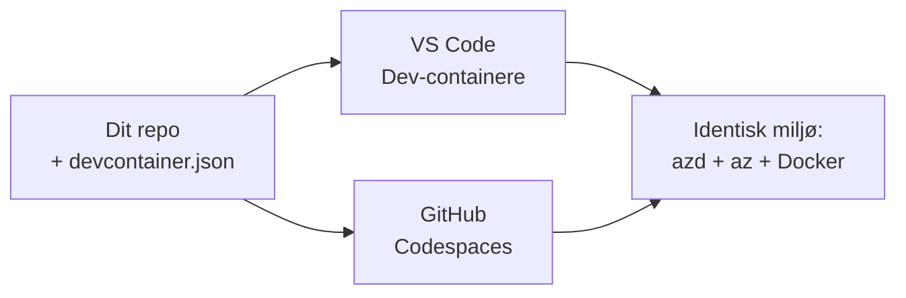

# Dev Containers & GitHub Codespaces til azd

**Chapter Navigation:**
- **📚 Kursusforside**: [AZD For Beginners](../../README.md)
- **📖 Aktuelt kapitel**: Kapitel 1 - Grundlag & Hurtig start
- **⬅️ Forrige**: [Bring Your Own App](bring-your-own-app.md)
- **🚀 Næste kapitel**: [Chapter 2: AI-First Development](../chapter-02-ai-development/README.md)

> Valideret mod `azd 1.25.6` i juni 2026.

## Introduktion

At installere azd, den rette sprog-runtime, Docker og Azure CLI på alle maskiner er besværligt — og det er den primære årsag til, at en vejledning, der "virker på min maskine", fejler for en anden. En **dev container** løser dette ved at beskrive hele din værktøjskæde i en fil. Alle, der åbner projektet i VS Code eller GitHub Codespaces, får præcis det samme miljø, med azd allerede installeret. Denne lektion viser, hvordan du tilføjer en.

## Læringsmål

Ved slutningen af denne lektion vil du:
- Forstå hvad en dev container er, og hvorfor den hjælper med azd
- Tilføje en minimal `.devcontainer/devcontainer.json` til et projekt
- Inkludér azd, Azure CLI og Docker via Dev Container *features*
- Åbn projektet i GitHub Codespaces eller VS Code

## Læringsudbytte

Efter at have gennemført denne lektion vil du kunne:
- Oprette en `devcontainer.json` til et azd-projekt
- Tilføje azd og Azure-værktøjer uden manuelle installationer
- Køre `azd up` inde i en container eller Codespace

---

## Hvad er en dev container?

En dev container er et Docker-baseret udviklingsmiljø defineret af en `.devcontainer/devcontainer.json`-fil i dit repository. Når du åbner projektet:

- **VS Code** (med Dev Containers-udvidelsen) bygger containeren og tilslutter sig den.
- **GitHub Codespaces** bygger den samme container i skyen og giver dig en browser-baseret editor.

På den måde får alle bidragydere identiske værktøjer — ingen fejlsøgning som "har du installeret azd?".



---

## Trin 1: Opret devcontainer-filen

Opret `.devcontainer/devcontainer.json` i rodmappen af dit projekt:

```json
{
  "name": "azd-project",
  "image": "mcr.microsoft.com/devcontainers/base:bookworm",
  "features": {
    "ghcr.io/devcontainers/features/azure-cli:1": {},
    "ghcr.io/azure/azure-dev/azd:latest": {},
    "ghcr.io/devcontainers/features/docker-in-docker:2": {},
    "ghcr.io/devcontainers/features/node:1": {}
  },
  "customizations": {
    "vscode": {
      "extensions": [
        "ms-azuretools.azure-dev",
        "ms-azuretools.vscode-bicep"
      ]
    }
  },
  "forwardPorts": [3000],
  "postCreateCommand": "azd version"
}
```

Hvad hver del gør:

| Nøgle | Formål |
|-----|---------|
| `image` | Det grundlæggende OS for containeren |
| `features` | Forudbyggede installationsværktøjer—her: Azure CLI, **azd**, Docker og Node.js |
| `customizations.vscode.extensions` | Installerer automatisk azd- og Bicep-udvidelserne til VS Code |
| `forwardPorts` | Eksponerer din apps port til din browser |
| `postCreateCommand` | Kører én gang efter containeren er bygget (her, et sundhedstjek) |

> Funktionen `ghcr.io/azure/azure-dev/azd:latest` er den officielle måde at få azd i en container på. Fastlås en specifik version (for eksempel `azd:1.25.6`) hvis du har brug for reproducerbarhed.

---

## Trin 2: Match feature til din apps sprog

Skift `node`-feature'en ud med det, din app bruger:

```jsonc
// Python project
"ghcr.io/devcontainers/features/python:1": {},

// .NET project
"ghcr.io/devcontainers/features/dotnet:2": {},

// Java project
"ghcr.io/devcontainers/features/java:1": {},

// Go project
"ghcr.io/devcontainers/features/go:1": {}
```

Bevar `docker-in-docker`, hvis din `host` er `containerapp`, `aks` eller noget, der bygger et containerbillede—azd har brug for Docker for at bygge og pushe billeder.

---

## Trin 3: Åbn det

**I VS Code:**
1. Installer **Dev Containers**-udvidelsen.
2. Åbn projektmappen.
3. Klik **Reopen in Container** når du bliver bedt om det (eller kør *Dev Containers: Reopen in Container*).

**I GitHub Codespaces:**
1. Push repoet til GitHub.
2. Klik **Code → Codespaces → Create codespace on main**.
3. Vent på, at containeren bliver bygget—azd er klar i terminalen.

---

## Trin 4: Udrul fra inde i containeren

Containeren har azd forudinstalleret, så den normale arbejdsgang fungerer bare:

```bash
azd auth login --use-device-code   # enhedskode er praktisk i Codespaces
azd up
```

> **Hvorfor `--use-device-code`?** I en fjern container eller Codespace er der ingen lokal browser at omdirigere til, så device-code-login er den pålidelige vej. Du indsætter en kode i en browserfane for at fuldføre login.

---

## Almindelige faldgruber

| Faldgrube | Løsning |
|---------|-----|
| `azd up` can't build an image | Tilføj `docker-in-docker`-feature'en |
| Browser login hangs in Codespaces | Brug `azd auth login --use-device-code` |
| Tools differ between teammates | Fastlås feature-versioner (fx `azd:1.25.6`) |
| App not reachable in browser | Tilføj porten til `forwardPorts` |

---

## Opsummering

- En dev container gør din azd-værktøjskæde reproducerbar for alle.
- Tilføj azd, Azure CLI og Docker gennem Dev Container *funktioner*.
- Match sprogfeature til din app, og behold `docker-in-docker` for containerhosts.
- Brug device-code-login, når du kører inde i Codespaces.

---

## 🔗 Navigation

| Retning | Ressource |
|-----------|----------|
| **Forrige** | [Bring Your Own App](bring-your-own-app.md) |
| **Kapitelforside** | [Chapter 1: Foundation & Quick Start](README.md) |
| **Næste kapitel** | [Chapter 2: AI-First Development](../chapter-02-ai-development/README.md) |

## 📖 Relaterede ressourcer

- [Installation & Opsætning](installation.md)
- [Kommandooversigt](../../resources/cheat-sheet.md)
- [Officiel Dev Containers-specifikation](https://containers.dev/)
- [azd Dev Container-feature](https://github.com/Azure/azure-dev/tree/main/ext/devcontainer)

---

<!-- CO-OP TRANSLATOR DISCLAIMER START -->
**Ansvarsfraskrivelse**:
Dette dokument er blevet oversat ved hjælp af AI-oversættelsestjenesten [Co-op Translator](https://github.com/Azure/co-op-translator). Selvom vi bestræber os på nøjagtighed, skal du være opmærksom på, at automatiserede oversættelser kan indeholde fejl eller unøjagtigheder. Det originale dokument på dets oprindelige sprog bør betragtes som den autoritative kilde. For kritisk information anbefales professionel menneskelig oversættelse. Vi påtager os intet ansvar for misforståelser eller fejltolkninger, der opstår som følge af brugen af denne oversættelse.
<!-- CO-OP TRANSLATOR DISCLAIMER END -->