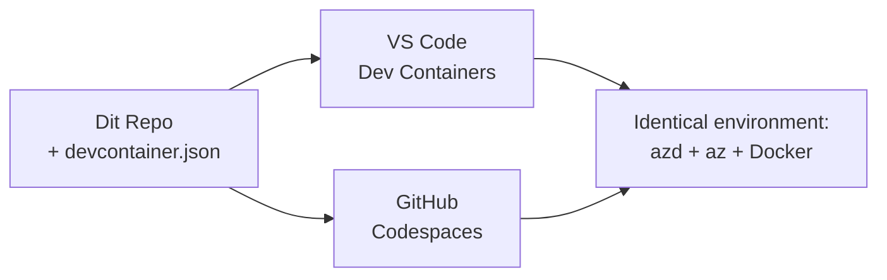

# Dev Containers & GitHub Codespaces for azd

**Kapitelnavigation:**
- **📚 Kursusforside**: [AZD For Beginners](../../README.md)
- **📖 Nuværende kapitel**: Kapitel 1 - Grundlag & Hurtig start
- **⬅️ Forrige**: [Bring Your Own App](bring-your-own-app.md)
- **🚀 Næste kapitel**: [Kapitel 2: AI-First Development](../chapter-02-ai-development/README.md)

> Bekræftet mod `azd 1.27.1` i juli 2026.

## Introduktion

At installere azd, det rette sprog-runtime, Docker og Azure CLI på hver maskine er en opgave – og det er den vigtigste grund til, at en tutorial, der "virker på min maskine", fejler for nogen andre. En **dev container** løser dette ved at beskrive hele din værktøjskæde i en fil. Enhver, der åbner projektet i VS Code eller GitHub Codespaces, får nøjagtigt det samme miljø med azd allerede installeret. Denne lektion viser dig, hvordan du tilføjer en.

## Læringsmål

Når du er færdig med denne lektion, vil du:
- Forstå hvad en dev container er, og hvorfor den hjælper med azd
- Tilføje en minimal `.devcontainer/devcontainer.json` til et projekt
- Inkludere azd, Azure CLI og Docker via Dev Container *features*
- Åbne projektet i GitHub Codespaces eller VS Code

## Læringsudbytte

Efter at have gennemført denne lektion, vil du kunne:
- Skrive en `devcontainer.json` til et azd-projekt
- Tilføje azd og Azure-værktøjer uden manuelle installationer
- Køre `azd up` inde i en container eller Codespace

---

## Hvad er en Dev Container?

En dev container er et Docker-baseret udviklingsmiljø defineret af en `.devcontainer/devcontainer.json` fil i dit repository. Når du åbner projektet:

- **VS Code** (med Dev Containers-udvidelsen) bygger containeren og tilkobler til den.
- **GitHub Codespaces** bygger den samme container i skyen og giver dig en browserbaseret editor.

Uanset hvilken metode, får hver bidragyder identiske værktøjer – ingen "har du installeret azd?" fejlsøgning.



---

## Trin 1: Opret devcontainer-filen

Opret `.devcontainer/devcontainer.json` i rodmappen af dit projekt:

```json
{
  "name": "azd-project",
  "image": "mcr.microsoft.com/devcontainers/base:bookworm",
  "features": {
    "ghcr.io/devcontainers/features/azure-cli:1": {},
    "ghcr.io/azure/azure-dev/azd:latest": {},
    "ghcr.io/devcontainers/features/docker-in-docker:2": {},
    "ghcr.io/devcontainers/features/node:1": {}
  },
  "customizations": {
    "vscode": {
      "extensions": [
        "ms-azuretools.azure-dev",
        "ms-azuretools.vscode-bicep"
      ]
    }
  },
  "forwardPorts": [3000],
  "postCreateCommand": "azd version"
}
```

Hvad hver del gør:

| Nøgle | Formål |
|-----|---------|
| `image` | Basal OS til containeren |
| `features` | Forudbyggede installatører – her: Azure CLI, **azd**, Docker og Node.js |
| `customizations.vscode.extensions` | Automatisk installation af azd og Bicep VS Code-udvidelser |
| `forwardPorts` | Eksponerer din apps port til din browser |
| `postCreateCommand` | Kører én gang efter containeren er bygget (her en sundhedskontrol) |

> `ghcr.io/azure/azure-dev/azd:latest`-funtionen er den officielle måde at få azd i en container på. Fastlås en specifik version (for eksempel `azd:1.27.1`), hvis du har brug for reproducerbarhed.

---

## Trin 2: Match funktionen til dit appsprog

Udskift `node`-funktionen med det, din app bruger:

```jsonc
// Python project
"ghcr.io/devcontainers/features/python:1": {},

// .NET project
"ghcr.io/devcontainers/features/dotnet:2": {},

// Java project
"ghcr.io/devcontainers/features/java:1": {},

// Go project
"ghcr.io/devcontainers/features/go:1": {}
```

Behold `docker-in-docker`, hvis din `host` er `containerapp`, `aks` eller noget, der bygger et container-image – azd har brug for Docker til at bygge og pushe images.

---

## Trin 3: Åbn det

**I VS Code:**
1. Installer **Dev Containers**-udvidelsen.
2. Åbn projektmappen.
3. Klik på **Reopen in Container**, når du bliver bedt om det (eller kør *Dev Containers: Reopen in Container*).

**I GitHub Codespaces:**
1. Push repoet til GitHub.
2. Klik **Code → Codespaces → Create codespace on main**.
3. Vent på at containeren bygges – azd er klar i terminalen.

---

## Trin 4: Deploy indefra containeren

Containeren har azd forudinstalleret, så den normale arbejdsgang virker bare:

```bash
azd auth login --use-device-code   # enhedskode er praktisk inden for Codespaces
azd up
```

> **Hvorfor `--use-device-code`?** I en fjerncontainer eller Codespace findes der ingen lokal browser til at omdirigere til, så device-code login er den pålidelige metode. Du indsætter en kode i en browsertab for at fuldføre login.

---

## Almindelige faldgruber

| Faldgrube | Løsning |
|---------|---------|
| `azd up` kan ikke bygge et image | Tilføj `docker-in-docker`-funktionen |
| Browser-login hænger i Codespaces | Brug `azd auth login --use-device-code` |
| Værktøjer er forskellige mellem teammedlemmer | Fastlås funktionsversioner (f.eks. `azd:1.27.1`) |
| Appen er ikke tilgængelig i browseren | Tilføj porten til `forwardPorts` |

---

## Opsummering

- En dev container gør din azd værktøjskæde reproducerbar for alle.
- Tilføj azd, Azure CLI og Docker via Dev Container *features*.
- Match sprogfunktionen til din app og behold `docker-in-docker` til containerhosts.
- Brug device-code login, når du kører inde i Codespaces.

---

## 🔗 Navigation

| Retning | Ressource |
|---------|----------|
| **Forrige** | [Bring Your Own App](bring-your-own-app.md) |
| **Kapitel Forside** | [Kapitel 1: Grundlag & Hurtig start](README.md) |
| **Næste Kapitel** | [Kapitel 2: AI-First Development](../chapter-02-ai-development/README.md) |

## 📖 Relaterede ressourcer

- [Installation & Setup](installation.md)
- [Kommando Oversigt](../../resources/cheat-sheet.md)
- [Officiel Dev Containers specifikation](https://containers.dev/)
- [azd Dev Container feature](https://github.com/Azure/azure-dev/tree/main/ext/devcontainer)

---

<!-- CO-OP TRANSLATOR DISCLAIMER START -->
**Ansvarsfraskrivelse**:
Dette dokument er blevet oversat ved hjælp af AI-oversættelsestjenesten [Co-op Translator](https://github.com/Azure/co-op-translator). Selvom vi bestræber os på nøjagtighed, skal du være opmærksom på, at automatiserede oversættelser kan indeholde fejl eller unøjagtigheder. Det originale dokument på dets oprindelige sprog bør betragtes som den autoritative kilde. For kritisk information anbefales professionel menneskelig oversættelse. Vi påtager os intet ansvar for misforståelser eller fejltolkninger, der opstår som følge af brugen af denne oversættelse.
<!-- CO-OP TRANSLATOR DISCLAIMER END -->