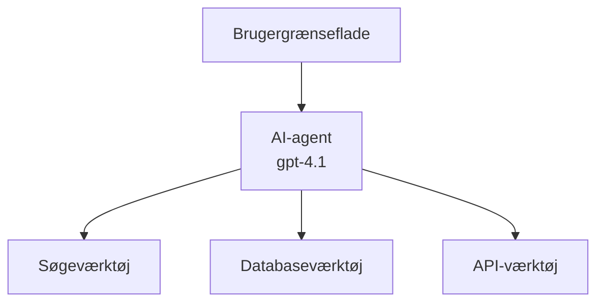
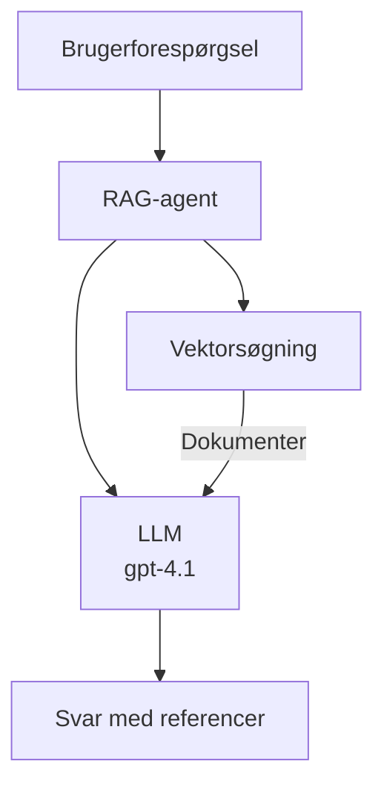
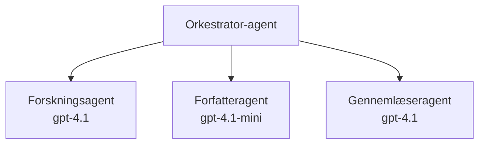

# AI-agenter med Azure Developer CLI

**Kapitelnavigation:**
- **📚 Kursusforside**: [AZD for begyndere](../../README.md)
- **📖 Aktuelt kapitel**: Kapitel 2 - AI-først udvikling
- **⬅️ Forrige**: [Microsoft Foundry-integration](microsoft-foundry-integration.md)
- **➡️ Næste**: [AI-modelimplementering](ai-model-deployment.md)
- **🚀 Avanceret**: [Multi-agent-løsninger](../../examples/retail-scenario.md)

---

## Introduktion

AI-agenter er autonome programmer, der kan opfatte deres miljø, træffe beslutninger og udføre handlinger for at nå specifikke mål. I modsætning til simple chatbots, der svarer på prompts, kan agenter:

- **Brug værktøjer** - Kalde API'er, søge i databaser, udføre kode
- **Planlægge og ræsonnere** - Bryde komplekse opgaver ned i trin
- **Lære fra kontekst** - Opretholde hukommelse og tilpasse adfærd
- **Samarbejde** - Arbejde med andre agenter (multi-agent systemer)

Denne guide viser, hvordan du implementerer AI-agenter til Azure ved hjælp af Azure Developer CLI (azd).

> **Valideringsnote (2026-03-25):** Denne guide blev gennemgået imod `azd` `1.23.12` og `azure.ai.agents` `0.1.18-preview`. `azd ai`-oplevelsen er stadig preview-drevet, så tjek udvidelsens hjælp, hvis dine installerede flag adskiller sig.

## Læringsmål

Ved at gennemføre denne guide vil du:
- Forstå hvad AI-agenter er, og hvordan de adskiller sig fra chatbots
- Implementere forbyggede AI-agent-skabeloner ved hjælp af AZD
- Konfigurere Foundry Agents for brugerdefinerede agenter
- Implementere grundlæggende agentmønstre (brug af værktøjer, RAG, multi-agent)
- Overvåge og fejlfinde implementerede agenter

## Læringsudbytte

Efter gennemførelse vil du kunne:
- Implementere AI-agentapplikationer til Azure med en enkelt kommando
- Konfigurere agentværktøjer og -funktioner
- Implementere retrieval-augmented generation (RAG) med agenter
- Designe multi-agent-arkitekturer til komplekse arbejdsgange
- Fejlsøge almindelige problemer ved agentimplementering

---

## 🤖 Hvad gør en agent forskellig fra en chatbot?

| Feature | Chatbot | AI Agent |
|---------|---------|----------|
| **Behavior** | Responds to prompts | Takes autonomous actions |
| **Tools** | None | Can call APIs, search, execute code |
| **Memory** | Session-based only | Persistent memory across sessions |
| **Planning** | Single response | Multi-step reasoning |
| **Collaboration** | Single entity | Can work with other agents |

### Simpel analogi

- **Chatbot** = En hjælpsom person, der svarer på spørgsmål ved et informationsskrivebord
- **AI Agent** = En personlig assistent, der kan foretage opkald, booke aftaler og fuldføre opgaver for dig

---

## 🚀 Hurtig start: Implementer din første agent

### Mulighed 1: Foundry Agents-skabelon (Anbefalet)

```bash
# Initialiser skabelonen til AI-agenter
azd init --template get-started-with-ai-agents

# Udrul til Azure
azd up
```

**Hvad der implementeres:**
- ✅ Foundry Agents
- ✅ Microsoft Foundry Models (gpt-4.1)
- ✅ Azure AI Search (til RAG)
- ✅ Azure Container Apps (webgrænseflade)
- ✅ Application Insights (overvågning)

**Tid:** ~15-20 minutter
**Omkostning:** ~$100-150/måned (udvikling)

### Mulighed 2: OpenAI-agent med Prompty

```bash
# Initialiser Prompty-baseret agent-skabelon
azd init --template agent-openai-python-prompty

# Udrul til Azure
azd up
```

**Hvad der implementeres:**
- ✅ Azure Functions (serverløs agentkørsel)
- ✅ Microsoft Foundry Models
- ✅ Prompty-konfigurationsfiler
- ✅ Eksempelsagent-implementering

**Tid:** ~10-15 minutter
**Omkostning:** ~$50-100/måned (udvikling)

### Mulighed 3: RAG-chatagent

```bash
# Initialiser RAG-chat-skabelon
azd init --template azure-search-openai-demo

# Udrul til Azure
azd up
```

**Hvad der implementeres:**
- ✅ Microsoft Foundry Models
- ✅ Azure AI Search med eksempeldata
- ✅ Dokumentbehandlingspipeline
- ✅ Chatgrænseflade med kildehenvisninger

**Tid:** ~15-25 minutter
**Omkostning:** ~$80-150/måned (udvikling)

### Mulighed 4: AZD AI Agent Init (Manifest- eller skabelonbaseret preview)

Hvis du har en agent-manifestfil, kan du bruge `azd ai`-kommandoen til at scaffolde et Foundry Agent Service-projekt direkte. Nye preview-udgivelser har også tilføjet skabelonbaseret initialiseringsstøtte, så den præcise promptflow kan variere lidt afhængigt af din installerede udvidelsesversion.

```bash
# Installer udvidelsen til AI-agenter
azd extension install azure.ai.agents

# Valgfrit: bekræft den installerede forhåndsvisningsversion
azd extension show azure.ai.agents

# Initialiser fra et agentmanifest
azd ai agent init -m agent-manifest.yaml

# Udrul til Azure
azd up

# Test den udrullede agent (viser latenstid og tid til første byte)
azd ai agent invoke
```

**Hvornår du skal bruge `azd ai agent init` vs `azd init --template`:**

| Approach | Best For | How It Works |
|----------|----------|------|
| `azd init --template` | Starting from a working sample app | Clones a full template repo with code + infra |
| `azd ai agent init -m` | Building from your own agent manifest | Scaffolds project structure from your agent definition |

> **Tip:** Brug `azd init --template` når du lærer (Muligheder 1-3 ovenfor). Brug `azd ai agent init` når du bygger produktionsagenter med dine egne manifests.

Efter `azd up` fører den samme udvidelse dig gennem resten af agentlivscyklussen: `azd ai agent invoke` til test, `azd ai agent eval generate` og `azd ai agent optimize` til at måle og forbedre kvaliteten, og `azd ai agent delete` til oprydning. Se [AZD AI CLI-kommandoer](../chapter-08-production/production-ai-practices.md#azd-ai-cli-commands-and-extensions) for fuld reference.

---

## 🏗️ Agent-arkitekturmønstre

### Mønster 1: Enkel agent med værktøjer

Det simpleste agentmønster - én agent, der kan bruge flere værktøjer.



**Bedst til:**
- Kundesupport-bots
- Forskningsassistenter
- Dataanalyseagenter

**AZD-skabelon:** `azure-search-openai-demo`

### Mønster 2: RAG-agent (Retrieval-Augmented Generation)

En agent, der henter relevante dokumenter, før den genererer svar.



**Bedst til:**
- Virksomheders vidensdatabaser
- Dokument Q&A-systemer
- Compliance og juridisk research

**AZD-skabelon:** `azure-search-openai-demo`

### Mønster 3: Multi-agent-system

Flere specialiserede agenter, der arbejder sammen om komplekse opgaver.



**Bedst til:**
- Kompleks indholdsgenerering
- Multi-trins arbejdsgange
- Opgaver, der kræver forskellig ekspertise

**Lær mere:** [Koordineringsmønstre for multi-agenter](../chapter-06-pre-deployment/coordination-patterns.md)

---

## ⚙️ Konfigurering af agentværktøjer

Agenter bliver kraftfulde, når de kan bruge værktøjer. Sådan konfigurerer du almindelige værktøjer:

### Værktøjskonfiguration i Foundry Agents

```python
# agent_config.py
from azure.ai.projects import AIProjectClient
from azure.ai.projects.models import FunctionTool, CodeInterpreterTool

# Definer brugerdefinerede værktøjer
search_tool = FunctionTool(
    name="search_knowledge_base",
    description="Search the company knowledge base for relevant documents",
    parameters={
        "type": "object",
        "properties": {
            "query": {
                "type": "string",
                "description": "The search query"
            }
        },
        "required": ["query"]
    }
)

# Opret agent med værktøjer
agent = project_client.agents.create_agent(
    model="gpt-4.1",
    name="Support Agent",
    instructions="You are a helpful support agent. Use the search tool to find relevant information.",
    tools=[search_tool, CodeInterpreterTool()]
)
```

### Miljøkonfiguration

```bash
# Opsæt agent-specifikke miljøvariabler
azd env set AZURE_OPENAI_MODEL "gpt-4.1"
azd env set AGENT_INSTRUCTIONS "You are a helpful assistant..."
azd env set ENABLE_CODE_INTERPRETER "true"
azd env set ENABLE_FILE_SEARCH "true"

# Udrul med opdateret konfiguration
azd deploy
```

---

## 📊 Overvågning af agenter

### Integration med Application Insights

Alle AZD-agent-skabeloner inkluderer Application Insights til overvågning:

```bash
# Åbn overvågningsdashboardet
azd monitor --overview

# Vis logfiler i realtid
azd monitor --logs

# Vis målinger i realtid
azd monitor --live
```

### Nøglemetrikker at følge

| Metric | Description | Target |
|--------|-------------|--------|
| Response Latency | Time to generate response | < 5 seconds |
| Token Usage | Tokens per request | Monitor for cost |
| Tool Call Success Rate | % of successful tool executions | > 95% |
| Error Rate | Failed agent requests | < 1% |
| User Satisfaction | Feedback scores | > 4.0/5.0 |

### Tilpasset logning for agenter

```python
import os
from azure.monitor.opentelemetry import configure_azure_monitor
from opentelemetry import trace

# Konfigurer Azure Monitor med OpenTelemetry
configure_azure_monitor(
    connection_string=os.environ["APPLICATIONINSIGHTS_CONNECTION_STRING"]
)

tracer = trace.get_tracer(__name__)

def log_agent_interaction(user_query, agent_response, tools_used, latency_ms):
    with tracer.start_as_current_span("agent_interaction") as span:
        span.set_attributes({
            "user_query": user_query,
            "response_length": len(agent_response),
            "tools_used": tools_used,
            "latency_ms": latency_ms
        })
```

> **Bemærk:** Installer de nødvendige pakker: `pip install azure-monitor-opentelemetry opentelemetry`

---

## 💰 Omkostningsovervejelser

### Anslåede månedlige omkostninger efter mønster

| Pattern | Dev Environment | Production |
|---------|-----------------|------------|
| Single Agent | $50-100 | $200-500 |
| RAG Agent | $80-150 | $300-800 |
| Multi-Agent (2-3 agents) | $150-300 | $500-1,500 |
| Enterprise Multi-Agent | $300-500 | $1,500-5,000+ |

### Tips til omkostningsoptimering

1. **Brug gpt-4.1-mini til simple opgaver**
   ```bash
   azd env set AZURE_OPENAI_MODEL "gpt-4.1-mini"
   ```

2. **Implementer caching for gentagne forespørgsler**
   ```python
   from functools import lru_cache
   
   @lru_cache(maxsize=1000)
   def get_cached_response(query_hash):
       return agent.run(query_hash)
   ```

3. **Sæt tokenbegrænsninger per kørsel**
   ```python
   # Angiv max_completion_tokens, når agenten køres, ikke under oprettelsen
   run = project_client.agents.create_run(
       thread_id=thread.id,
       agent_id=agent.id,
       max_completion_tokens=1000  # Begræns svarlængden
   )
   ```

4. **Skalér til nul, når det ikke er i brug**
   ```bash
   # Container Apps skalerer automatisk ned til nul
   azd env set MIN_REPLICAS "0"
   ```

---

## 🔧 Fejlfinding af agenter

### Almindelige problemer og løsninger

<details>
<summary><strong>❌ Agent svarer ikke på værktøjskald</strong></summary>

```bash
# Kontroller, om værktøjerne er korrekt registreret
azd show

# Bekræft OpenAI-udrulningen
az cognitiveservices account deployment list \
  --name $AZURE_OPENAI_NAME \
  --resource-group $RG_NAME

# Kontroller agentlogfilerne
azd monitor --logs
```

**Almindelige årsager:**
- Funktionens signatur for værktøjet stemmer ikke overens
- Manglende krævede tilladelser
- API-endpoint ikke tilgængeligt
</details>

<details>
<summary><strong>❌ Høj latenstid i agentens svar</strong></summary>

```bash
# Tjek Application Insights for flaskehalse
azd monitor --live

# Overvej at bruge en hurtigere model
azd env set AZURE_OPENAI_MODEL "gpt-4.1-mini"
azd deploy
```

**Optimeringstips:**
- Brug streaming-svar
- Implementer responscaching
- Reducer kontekstvinduets størrelse
</details>

<details>
<summary><strong>❌ Agent returnerer ukorrekt eller hallucineret information</strong></summary>

```python
# Forbedr med bedre systemprompter
instructions = """
You are a helpful assistant. IMPORTANT:
- Only answer based on provided context
- If you don't know, say "I don't know"
- Always cite your sources
- Never make up information
"""

# Tilføj hentning til forankring
agent = project_client.agents.create_agent(
    model="gpt-4.1",
    instructions=instructions,
    tools=[FileSearchTool()]  # Forankr svar i dokumenter
)
```
</details>

<details>
<summary><strong>❌ Token-grænse overskredet</strong></summary>

```python
# Implementer styring af kontekstvindue
def truncate_context(messages, max_tokens=8000, model="gpt-4.1"):
    """Keep only recent messages within token limit."""
    import tiktoken
    encoding = tiktoken.encoding_for_model(model)
    total_tokens = 0
    truncated = []
    
    for msg in reversed(messages):
        msg_tokens = len(encoding.encode(msg.content))
        if total_tokens + msg_tokens > max_tokens:
            break
        truncated.insert(0, msg)
        total_tokens += msg_tokens
    
    return truncated
```
</details>

---

## 🎓 Praktiske øvelser

### Øvelse 1: Implementer en grundlæggende agent (20 minutter)

**Mål:** Implementer din første AI-agent ved hjælp af AZD

```bash
# Trin 1: Initialiser skabelon
azd init --template get-started-with-ai-agents

# Trin 2: Log ind på Azure
azd auth login
# Hvis du arbejder på tværs af lejere, tilføj --tenant-id <tenant-id>

# Trin 3: Udrul
azd up

# Trin 4: Test agenten
# Forventet output efter udrulning:
#   Udrulning fuldført!
#   Endepunkt: https://<app-name>.<region>.azurecontainerapps.io
# Åbn URL'en vist i outputtet og prøv at stille et spørgsmål

# Trin 5: Se overvågning
azd monitor --overview

# Trin 6: Ryd op
azd down --force --purge
```

**Succeskriterier:**
- [ ] Agent svarer på spørgsmål
- [ ] Kan få adgang til overvågningsdashboard via `azd monitor`
- [ ] Ressourcer ryddes op korrekt

### Øvelse 2: Tilføj et brugerdefineret værktøj (30 minutter)

**Mål:** Udvid en agent med et brugerdefineret værktøj

1. Implementer agent-skabelonen:
   ```bash
   azd init --template get-started-with-ai-agents
   azd up
   ```
2. Opret en ny værktøjsfunktion i din agentkode:
   ```python
   def get_weather(location: str) -> str:
       """Get current weather for a location."""
       # API-opkald til vejrtjeneste
       return f"Weather in {location}: Sunny, 72°F"
   ```
3. Registrer værktøjet hos agenten:
   ```python
   from azure.ai.projects.models import FunctionTool

   weather_tool = FunctionTool(
       name="get_weather",
       description="Get current weather for a location",
       parameters={
           "type": "object",
           "properties": {
               "location": {"type": "string", "description": "City name"}
           },
           "required": ["location"]
       }
   )

   agent = project_client.agents.create_agent(
       model="gpt-4.1",
       name="Weather Agent",
       tools=[weather_tool]
   )
   ```
4. Implementer igen og test:
   ```bash
   azd deploy
   # Spørg: "Hvordan er vejret i Seattle?"
   # Forventet: Agenten kalder get_weather("Seattle") og returnerer vejroplysninger
   ```

**Succeskriterier:**
- [ ] Agent genkender vejrudsigtsrelaterede forespørgsler
- [ ] Værktøjet kaldes korrekt
- [ ] Svaret inkluderer vejrinformation

### Øvelse 3: Byg en RAG-agent (45 minutter)

**Mål:** Opret en agent, der besvarer spørgsmål ud fra dine dokumenter

```bash
# Trin 1: Udrul RAG-skabelon
azd init --template azure-search-openai-demo
azd up

# Trin 2: Upload dine dokumenter
# Placer PDF/TXT-filer i data/-mappen, og kør derefter:
python scripts/prepdocs.py

# Trin 3: Test med domænespecifikke spørgsmål
# Åbn webapp-URL'en fra azd up-outputtet
# Stil spørgsmål om dine uploadede dokumenter
# Svarene bør indeholde kildehenvisninger som [doc.pdf]
```

**Succeskriterier:**
- [ ] Agent svarer ud fra uploadede dokumenter
- [ ] Svar inkluderer kildehenvisninger
- [ ] Ingen hallucinationer ved spørgsmål uden for omfang

---

## 📚 Næste skridt

Nu hvor du forstår AI-agenter, kan du udforske disse avancerede emner:

| Topic | Description | Link |
|-------|-------------|------|
| **Multi-agent-systemer** | Byg systemer med flere samarbejdende agenter | [Retail Multi-Agent Example](../../examples/retail-scenario.md) |
| **Koordineringsmønstre** | Lær orkestrerings- og kommunikationsmønstre | [Coordination Patterns](../chapter-06-pre-deployment/coordination-patterns.md) |
| **Produktionsimplementering** | Agentimplementering klar til virksomhed | [Production AI Practices](../chapter-08-production/production-ai-practices.md) |
| **Agent-evaluering** | Test og evaluer agentens ydelse | [AI Troubleshooting](../chapter-07-troubleshooting/ai-troubleshooting.md) |
| **AI Workshop Lab** | Hands-on: Gør din AI-løsning AZD-klar | [AI Workshop Lab](ai-workshop-lab.md) |

---

## 📖 Yderligere ressourcer

### Officiel dokumentation
- [Microsoft Foundry Agent Service](https://learn.microsoft.com/azure/ai-services/agents/)
- [Microsoft Foundry Agent Service Quickstart](https://learn.microsoft.com/azure/ai-services/agents/quickstart)
- [Semantic Kernel Agent Framework](https://learn.microsoft.com/semantic-kernel/)

### AZD-skabeloner til agenter
- [Kom i gang med AI-agenter](https://github.com/Azure-Samples/get-started-with-ai-agents)
- [Agent OpenAI Python Prompty](https://github.com/Azure-Samples/agent-openai-python-prompty)
- [Azure Search OpenAI Demo](https://github.com/Azure-Samples/azure-search-openai-demo)

### Fællesskabsressourcer
- [Awesome AZD - Agent Templates](https://azure.github.io/awesome-azd/?tags=ai-agents)
- [Azure AI Discord](https://discord.gg/microsoft-azure)
- [Microsoft Foundry Discord](https://discord.gg/nTYy5BXMWG)

### Agentfærdigheder til din editor
- [**Microsoft Azure Agent Skills**](https://skills.sh/microsoft/github-copilot-for-azure) - Installer genanvendelige AI-agent-færdigheder til Azure-udvikling i GitHub Copilot, Cursor eller enhver understøttet agent. Indeholder færdigheder til [Azure AI](https://skills.sh/microsoft/github-copilot-for-azure/azure-ai), [Microsoft Foundry](https://skills.sh/microsoft/github-copilot-for-azure/microsoft-foundry), [deployment](https://skills.sh/microsoft/github-copilot-for-azure/azure-deploy), og [diagnostics](https://skills.sh/microsoft/github-copilot-for-azure/azure-diagnostics):
  ```bash
  npx skills add microsoft/github-copilot-for-azure
  ```

---

**Navigation**
- **Forrige lektion**: [Microsoft Foundry-integration](microsoft-foundry-integration.md)
- **Næste lektion**: [AI-modelimplementering](ai-model-deployment.md)

---

<!-- CO-OP TRANSLATOR DISCLAIMER START -->
**Ansvarsfraskrivelse**:
Dette dokument er blevet oversat ved hjælp af AI-oversættelsestjenesten [Co-op Translator](https://github.com/Azure/co-op-translator). Selvom vi bestræber os på nøjagtighed, skal du være opmærksom på, at automatiserede oversættelser kan indeholde fejl eller unøjagtigheder. Det originale dokument på dets oprindelige sprog bør betragtes som den autoritative kilde. For kritisk information anbefales professionel menneskelig oversættelse. Vi påtager os intet ansvar for misforståelser eller fejltolkninger, der opstår som følge af brugen af denne oversættelse.
<!-- CO-OP TRANSLATOR DISCLAIMER END -->