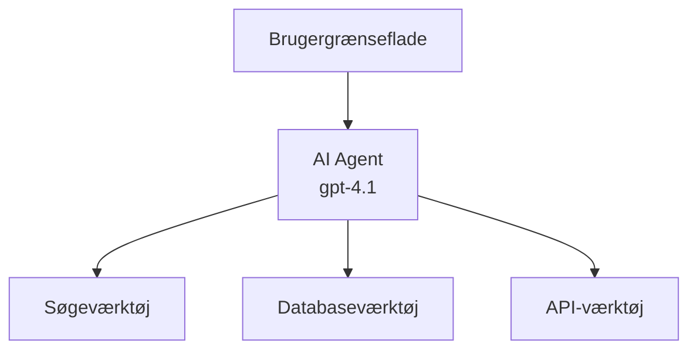
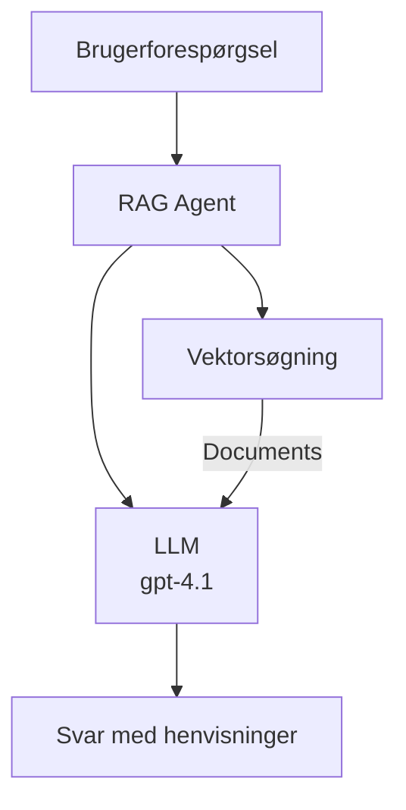
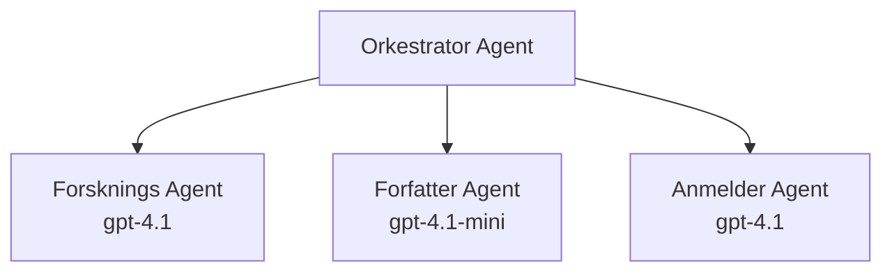

# AI-agenter med Azure Developer CLI

**Kapitelnavigation:**
- **📚 Kursushjemmeside**: [AZD For Beginners](../../README.md)
- **📖 Nuværende kapitel**: Kapitel 2 - AI-Første Udvikling
- **⬅️ Forrige**: [Microsoft Foundry Integration](microsoft-foundry-integration.md)
- **➡️ Næste**: [AI Model Deployment](ai-model-deployment.md)
- **🚀 Avanceret**: [Multi-Agent Solutions](../../examples/retail-scenario.md)

---

## Introduktion

AI-agenter er autonome programmer, der kan opfatte deres miljø, træffe beslutninger og handle for at opnå specifikke mål. I modsætning til simple chatbots, der svarer på forespørgsler, kan agenter:

- **Bruge værktøjer** - Kalde API'er, søge i databaser, udføre kode
- **Planlægge og ræsonnere** - Opdele komplekse opgaver i trin
- **Lære fra kontekst** - Bevare hukommelse og tilpasse adfærd
- **Samarbejde** - Arbejde med andre agenter (multi-agent systemer)

Denne vejledning viser dig, hvordan du implementerer AI-agenter til Azure ved hjælp af Azure Developer CLI (azd).

> **Valideringsnote (2026-07-13):** Denne vejledning er gennemgået med `azd` `1.27.1` og `azure.ai.agents` `1.0.0-beta.5`. `azd ai`-oplevelsen er stadig preview-baseret, så tjek udvidelseshjælpen, hvis dine installerede flag adskiller sig.

## Læringsmål

Ved at gennemføre denne vejledning vil du:
- Forstå, hvad AI-agenter er, og hvordan de adskiller sig fra chatbots
- Implementere færdigbyggede AI-agent-templates med AZD
- Konfigurere Foundry-agenter for tilpassede agenter
- Implementere grundlæggende agentmønstre (værktøjsbrug, RAG, multi-agent)
- Overvåge og fejlfinde implementerede agenter

## Læringsresultater

Efter afslutning vil du kunne:
- Implementere AI-agentapplikationer til Azure med en enkelt kommando
- Konfigurere agentværktøjer og kapaciteter
- Implementere retrieval-augmented generation (RAG) med agenter
- Designe multi-agent arkitekturer til komplekse arbejdsgange
- Fejlsøge almindelige problemer med agentimplementering

---

## 🤖 Hvad gør en agent forskellig fra en chatbot?

| Funktion | Chatbot | AI Agent |
|---------|---------|----------|
| **Adfærd** | Svarer på forespørgsler | Tager autonome handlinger |
| **Værktøjer** | Ingen | Kan kalde API'er, søge, udføre kode |
| **Hukommelse** | Kun baseret på session | Vedvarende hukommelse på tværs af sessioner |
| **Planlægning** | Enkel respons | Flerskridts ræsonnement |
| **Samarbejde** | Enkelt entitet | Kan arbejde med andre agenter |

### Enkel analogi

- **Chatbot** = En hjælpsom person, der svarer på spørgsmål ved et informationsbord
- **AI Agent** = En personlig assistent, der kan ringe op, booke aftaler og udføre opgaver for dig

---

## 🚀 Kom hurtigt i gang: Udrul din første agent

### Mulighed 1: Foundry Agents-skabelon (anbefalet)

```bash
# Initialiser AI-agenter skabelonen
azd init --template get-started-with-ai-agents

# Udrul til Azure
azd up
```

**Hvad der implementeres:**
- ✅ Foundry Agents
- ✅ Microsoft Foundry Modeller (gpt-4.1)
- ✅ Azure AI Search (til RAG)
- ✅ Azure Container Apps (webgrænseflade)
- ✅ Application Insights (overvågning)

**Tid:** ~15-20 minutter
**Omkostning:** ~$100-150/måned (udvikling)

### Mulighed 2: OpenAI-agent med Prompty

```bash
# Initialiser Prompty-baseret agent skabelon
azd init --template agent-openai-python-prompty

# Udrul til Azure
azd up
```

**Hvad der implementeres:**
- ✅ Azure Functions (serverløs agenteksekvering)
- ✅ Microsoft Foundry Modeller
- ✅ Prompty konfigurationsfiler
- ✅ Eksempel på agentimplementering

**Tid:** ~10-15 minutter
**Omkostning:** ~$50-100/måned (udvikling)

### Mulighed 3: RAG Chat Agent

```bash
# Initialiser RAG chat-skabelon
azd init --template azure-search-openai-demo

# Deploy til Azure
azd up
```

**Hvad der implementeres:**
- ✅ Microsoft Foundry Modeller
- ✅ Azure AI Search med eksempeldata
- ✅ Dokumentbehandlingspipeline
- ✅ Chatgrænseflade med henvisninger

**Tid:** ~15-25 minutter
**Omkostning:** ~$80-150/måned (udvikling)

### Mulighed 4: AZD AI Agent Init (Manifest- eller Template-baseret preview)

Hvis du har en agent-manifestfil, kan du bruge `azd ai`-kommandoen til direkte at skabe et Foundry Agent Service-projekt. Seneste preview-udgivelser har også tilføjet understøttelse for template-baseret initialisering, så den præcise prompt-flow kan variere lidt afhængigt af din installerede udgave.

```bash
# Installer AI-agentudvidelsen
azd extension install azure.ai.agents

# Valgfrit: verificer den installerede preview-version
azd extension show azure.ai.agents

# Initialiser fra en agentmanifest
azd ai agent init -m agent-manifest.yaml

# Udrul til Azure
azd up

# Test den udrullede agent (viser latenstid + tid-til-første-byte)
azd ai agent invoke
```

**Hvornår man bruger `azd ai agent init` vs `azd init --template`:**

| Tilgang | Bedst til | Sådan fungerer det |
|----------|----------|------|
| `azd init --template` | Starte ud fra en fungerende eksempelapp | Kloner et komplet skabelonrepository med kode + infrastruktur |
| `azd ai agent init -m` | Bygge fra dit eget agentmanifest | Skaber projektstruktur ud fra din agentdefinition |

> **Tip:** Brug `azd init --template`, når du lærer (mulighederne 1-3 ovenfor). Brug `azd ai agent init`, når du bygger produktionsagenter med dine egne manifests.

Efter `azd up` guider samme udvidelse dig igennem resten af agentens livscyklus: `azd ai agent invoke` til test, `azd ai agent eval generate` og `azd ai agent optimize` til at måle og forbedre kvalitet, og `azd ai agent delete` til oprydning. Se [AZD AI CLI Commands](../chapter-08-production/production-ai-practices.md#azd-ai-cli-commands-and-extensions) for fuld reference.

---

## 🏗️ Agentarkitektur-mønstre

### Mønster 1: Enkel agent med værktøjer

Det simpleste agentmønster - én agent, der kan bruge flere værktøjer.



**Bedst til:**
- Kundesupport-bots
- Forskningsassistenter
- Dataanalyseagenter

**AZD-skabelon:** `azure-search-openai-demo`

### Mønster 2: RAG Agent (Retrieval-Augmented Generation)

En agent, der henter relevante dokumenter, før den genererer svar.



**Bedst til:**
- Enterprise vidensbaser
- Dokument-spørgsmål & svar-systemer
- Overholdelse og juridisk forskning

**AZD-skabelon:** `azure-search-openai-demo`

### Mønster 3: Multi-Agent System

Flere specialiserede agenter arbejder sammen på komplekse opgaver.



**Bedst til:**
- Kompleks indholdsgenerering
- Flerskridts arbejdsgange
- Opgaver der kræver forskellig ekspertise

**Lær mere:** [Multi-Agent Coordination Patterns](../chapter-06-pre-deployment/coordination-patterns.md)

---

## ⚙️ Konfigurering af agentværktøjer

Agenter bliver stærke, når de kan bruge værktøjer. Sådan konfigureres almindelige værktøjer:

### Værktøjskonfiguration i Foundry Agents

```python
# agent_config.py
from azure.ai.projects import AIProjectClient
from azure.ai.projects.models import FunctionTool, CodeInterpreterTool

# Definer brugerdefinerede værktøjer
search_tool = FunctionTool(
    name="search_knowledge_base",
    description="Search the company knowledge base for relevant documents",
    parameters={
        "type": "object",
        "properties": {
            "query": {
                "type": "string",
                "description": "The search query"
            }
        },
        "required": ["query"]
    }
)

# Opret agent med værktøjer
agent = project_client.agents.create_agent(
    model="gpt-4.1",
    name="Support Agent",
    instructions="You are a helpful support agent. Use the search tool to find relevant information.",
    tools=[search_tool, CodeInterpreterTool()]
)
```

### Miljøkonfiguration

```bash
# Opsæt agent-specifikke miljøvariabler
azd env set AZURE_OPENAI_MODEL "gpt-4.1"
azd env set AGENT_INSTRUCTIONS "You are a helpful assistant..."
azd env set ENABLE_CODE_INTERPRETER "true"
azd env set ENABLE_FILE_SEARCH "true"

# Udrul med opdateret konfiguration
azd deploy
```

---

## 📊 Overvågning af agenter

### Integration med Application Insights

Alle AZD-agent-skabeloner inkluderer Application Insights til overvågning:

```bash
# Åbn overvågningsdashboard
azd monitor --overview

# Se live-logs
azd monitor --logs

# Se live-målinger
azd monitor --live
```

### Centrale målepunkter at følge

| Målepunkt | Beskrivelse | Mål |
|--------|-------------|--------|
| Responstid | Tid til generering af svar | < 5 sekunder |
| Tokenforbrug | Tokens pr. forespørgsel | Overvåg for omkostninger |
| Succesrate af værktøjskald | % af succesfulde værktøjskald | > 95% |
| Fejlrater | Mislykkede agentforespørgsler | < 1% |
| Brugertilfredshed | Feedback-score | > 4.0/5.0 |

### Tilpasset logning for agenter

```python
import os
from azure.monitor.opentelemetry import configure_azure_monitor
from opentelemetry import trace

# Konfigurer Azure Monitor med OpenTelemetry
configure_azure_monitor(
    connection_string=os.environ["APPLICATIONINSIGHTS_CONNECTION_STRING"]
)

tracer = trace.get_tracer(__name__)

def log_agent_interaction(user_query, agent_response, tools_used, latency_ms):
    with tracer.start_as_current_span("agent_interaction") as span:
        span.set_attributes({
            "user_query": user_query,
            "response_length": len(agent_response),
            "tools_used": tools_used,
            "latency_ms": latency_ms
        })
```

> **Note:** Installer de nødvendige pakker: `pip install azure-monitor-opentelemetry opentelemetry`

---

## 💰 Omkostningsbetragtninger

### Estimerede månedlige omkostninger efter mønster

| Mønster | Udviklingsmiljø | Produktion |
|---------|-----------------|------------|
| Enkel agent | $50-100 | $200-500 |
| RAG agent | $80-150 | $300-800 |
| Multi-agent (2-3 agenter) | $150-300 | $500-1.500 |
| Enterprise multi-agent | $300-500 | $1.500-5.000+ |

### Tips til omkostningsoptimering

1. **Brug gpt-4.1-mini til simple opgaver**
   ```bash
   azd env set AZURE_OPENAI_MODEL "gpt-4.1-mini"
   ```

2. **Implementer caching ved gentagne forespørgsler**
   ```python
   from functools import lru_cache
   
   @lru_cache(maxsize=1000)
   def get_cached_response(query_hash):
       return agent.run(query_hash)
   ```

3. **Sæt tokenbegrænsninger pr. kørsel**
   ```python
   # Indstil max_completion_tokens ved kørsel af agenten, ikke under oprettelsen
   run = project_client.agents.create_run(
       thread_id=thread.id,
       agent_id=agent.id,
       max_completion_tokens=1000  # Begræns svarets længde
   )
   ```

4. **Skaler til nul, når ikke i brug**
   ```bash
   # Container Apps skalerer automatisk til nul
   azd env set MIN_REPLICAS "0"
   ```

---

## 🔧 Fejlfinding af agenter

### Almindelige problemer og løsninger

<details>
<summary><strong>❌ Agent reagerer ikke på værktøjskald</strong></summary>

```bash
# Kontroller, om værktøjer er korrekt registreret
azd show

# Bekræft OpenAI-udrulning
az cognitiveservices account deployment list \
  --name $AZURE_OPENAI_NAME \
  --resource-group $RG_NAME

# Tjek agentlogs
azd monitor --logs
```

**Almindelige årsager:**
- Uoverensstemmelse i værktøjsfunktionssignatur
- Manglende nødvendige tilladelser
- API-endpoint ikke tilgængeligt
</details>

<details>
<summary><strong>❌ Høj latenstid i agent-svar</strong></summary>

```bash
# Tjek Application Insights for flaskehalse
azd monitor --live

# Overvej at bruge en hurtigere model
azd env set AZURE_OPENAI_MODEL "gpt-4.1-mini"
azd deploy
```

**Optimeringstips:**
- Brug streaming svar
- Implementer responscaching
- Reducer kontekstvinduesstørrelsen
</details>

<details>
<summary><strong>❌ Agent returnerer ukorrekte eller hallucinerede oplysninger</strong></summary>

```python
# Forbedr med bedre system-prompt
instructions = """
You are a helpful assistant. IMPORTANT:
- Only answer based on provided context
- If you don't know, say "I don't know"
- Always cite your sources
- Never make up information
"""

# Tilføj opslag for grundlag
agent = project_client.agents.create_agent(
    model="gpt-4.1",
    instructions=instructions,
    tools=[FileSearchTool()]  # Grund svar i dokumenter
)
```
</details>

<details>
<summary><strong>❌ Fejl om overskredet token-grænse</strong></summary>

```python
# Implementer kontekstvinduesstyring
def truncate_context(messages, max_tokens=8000, model="gpt-4.1"):
    """Keep only recent messages within token limit."""
    import tiktoken
    encoding = tiktoken.encoding_for_model(model)
    total_tokens = 0
    truncated = []
    
    for msg in reversed(messages):
        msg_tokens = len(encoding.encode(msg.content))
        if total_tokens + msg_tokens > max_tokens:
            break
        truncated.insert(0, msg)
        total_tokens += msg_tokens
    
    return truncated
```
</details>

---

## 🎓 Praktiske øvelser

### Øvelse 1: Udrul en basal agent (20 minutter)

**Mål:** Udrul din første AI-agent med AZD

```bash
# Trin 1: Initialiser skabelon
azd init --template get-started-with-ai-agents

# Trin 2: Log ind på Azure
azd auth login
# Hvis du arbejder på tværs af lejere, tilføj --tenant-id <tenant-id>

# Trin 3: Udrul
azd up

# Trin 4: Test agenten
# Forventet output efter udrulning:
#   Udrulning fuldført!
#   Endepunkt: https://<app-name>.<region>.azurecontainerapps.io
# Åbn URL’en vist i outputtet og prøv at stille et spørgsmål

# Trin 5: Se overvågning
azd monitor --overview

# Trin 6: Ryd op
azd down --force --purge
```

**Succes-kriterier:**
- [ ] Agent svarer på spørgsmål
- [ ] Kan tilgå overvågningsdashboard via `azd monitor`
- [ ] Ressourcer ryddet op succesfuldt

### Øvelse 2: Tilføj et tilpasset værktøj (30 minutter)

**Mål:** Udvid en agent med et tilpasset værktøj

1. Udrul agent-skabelonen:
   ```bash
   azd init --template get-started-with-ai-agents
   azd up
   ```
2. Opret en ny værktøjsfunktion i din agentkode:
   ```python
   def get_weather(location: str) -> str:
       """Get current weather for a location."""
       # API-opkald til vejrservice
       return f"Weather in {location}: Sunny, 72°F"
   ```
3. Registrer værktøjet hos agenten:
   ```python
   from azure.ai.projects.models import FunctionTool

   weather_tool = FunctionTool(
       name="get_weather",
       description="Get current weather for a location",
       parameters={
           "type": "object",
           "properties": {
               "location": {"type": "string", "description": "City name"}
           },
           "required": ["location"]
       }
   )

   agent = project_client.agents.create_agent(
       model="gpt-4.1",
       name="Weather Agent",
       tools=[weather_tool]
   )
   ```
4. Udrul igen og test:
   ```bash
   azd deploy
   # Spørg: "Hvordan er vejret i Seattle?"
   # Forventet: Agenten kalder get_weather("Seattle") og returnerer vejrinfo
   ```

**Succes-kriterier:**
- [ ] Agent genkender vejrrelaterede forespørgsler
- [ ] Værktøjet kaldes korrekt
- [ ] Svaret inkluderer vejrinformation

### Øvelse 3: Byg en RAG-agent (45 minutter)

**Mål:** Skab en agent, der svarer på spørgsmål fra dine dokumenter

```bash
# Trin 1: Implementer RAG-skabelon
azd init --template azure-search-openai-demo
azd up

# Trin 2: Upload dine dokumenter
# Placer PDF/TXT-filer i mappen data/, og kør derefter:
python scripts/prepdocs.py

# Trin 3: Test med domænespecifikke spørgsmål
# Åbn webapp-URL'en fra azd up-output
# Stil spørgsmål om dine uploadede dokumenter
# Svar bør inkludere kildehenvisninger som [doc.pdf]
```

**Succes-kriterier:**
- [ ] Agent svarer ud fra uploadede dokumenter
- [ ] Svar indeholder henvisninger
- [ ] Ingen hallucination på spørgsmål uden for omfang

---

## 📚 Næste skridt

Nu hvor du forstår AI-agenter, så udforsk disse avancerede emner:

| Emne | Beskrivelse | Link |
|-------|-------------|------|
| **Multi-Agent Systemer** | Byg systemer med flere samarbejdende agenter | [Retail Multi-Agent Example](../../examples/retail-scenario.md) |
| **Koordinationsmønstre** | Lær orkestrerings- og kommunikationsmønstre | [Coordination Patterns](../chapter-06-pre-deployment/coordination-patterns.md) |
| **Produktionimplementering** | Agentimplementering klar til enterprise | [Production AI Practices](../chapter-08-production/production-ai-practices.md) |
| **Agent Evaluering** | Test og evaluér agentpræstation | [AI Troubleshooting](../chapter-07-troubleshooting/ai-troubleshooting.md) |
| **AI Workshop Lab** | Praktisk: Gør din AI-løsning AZD-klar | [AI Workshop Lab](ai-workshop-lab.md) |

---

## 📖 Yderligere ressourcer

### Officiel dokumentation
- [Microsoft Foundry Agent Service](https://learn.microsoft.com/azure/ai-services/agents/)
- [Microsoft Foundry Agent Service Quickstart](https://learn.microsoft.com/azure/ai-services/agents/quickstart)
- [Semantic Kernel Agent Framework](https://learn.microsoft.com/semantic-kernel/)

### AZD-skabeloner til agenter
- [Kom godt i gang med AI-agenter](https://github.com/Azure-Samples/get-started-with-ai-agents)
- [Agent OpenAI Python Prompty](https://github.com/Azure-Samples/agent-openai-python-prompty)
- [Azure Search OpenAI Demo](https://github.com/Azure-Samples/azure-search-openai-demo)

### Community-ressourcer
- [Awesome AZD - Agent-skabeloner](https://azure.github.io/awesome-azd/?tags=ai-agents)
- [Azure AI Discord](https://discord.gg/microsoft-azure)
- [Microsoft Foundry Discord](https://discord.gg/nTYy5BXMWG)

### Agentkompetencer til din editor
- [**Microsoft Azure Agent Skills**](https://skills.sh/microsoft/github-copilot-for-azure) - Installer genanvendelige AI-agentfærdigheder til Azure-udvikling i GitHub Copilot, Cursor eller enhver understøttet agent. Indeholder færdigheder til [Azure AI](https://skills.sh/microsoft/github-copilot-for-azure/azure-ai), [Microsoft Foundry](https://skills.sh/microsoft/github-copilot-for-azure/microsoft-foundry), [implementering](https://skills.sh/microsoft/github-copilot-for-azure/azure-deploy) og [diagnostik](https://skills.sh/microsoft/github-copilot-for-azure/azure-diagnostics):
  ```bash
  npx skills add microsoft/github-copilot-for-azure
  ```

---

**Navigation**
- **Forrige lektion**: [Microsoft Foundry Integration](microsoft-foundry-integration.md)
- **Næste lektion**: [AI Model Deployment](ai-model-deployment.md)

---

<!-- CO-OP TRANSLATOR DISCLAIMER START -->
**Ansvarsfraskrivelse**:
Dette dokument er blevet oversat ved hjælp af AI-oversættelsestjenesten [Co-op Translator](https://github.com/Azure/co-op-translator). Selvom vi bestræber os på nøjagtighed, skal du være opmærksom på, at automatiserede oversættelser kan indeholde fejl eller unøjagtigheder. Det originale dokument på dets oprindelige sprog bør betragtes som den autoritative kilde. For kritisk information anbefales professionel menneskelig oversættelse. Vi påtager os intet ansvar for misforståelser eller fejltolkninger, der opstår som følge af brugen af denne oversættelse.
<!-- CO-OP TRANSLATOR DISCLAIMER END -->