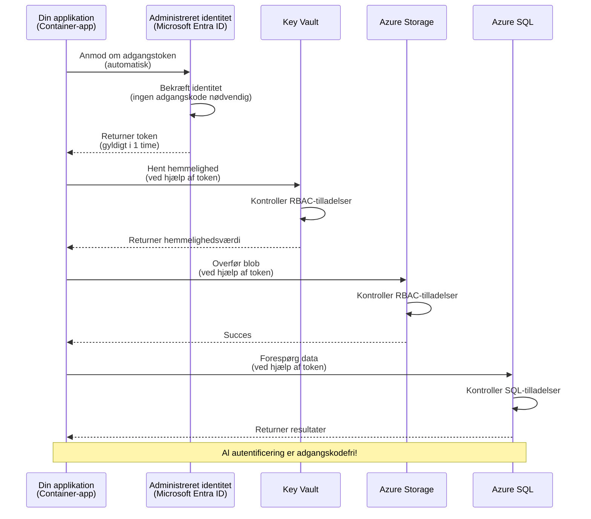
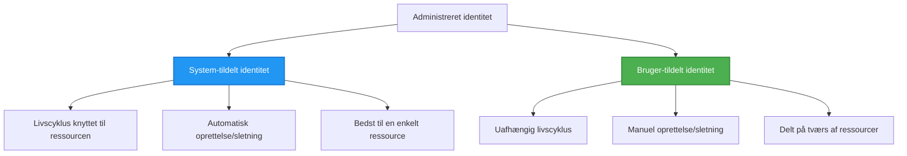

# Autentificeringsmønstre og administreret identitet

⏱️ **Anslået tid**: 45-60 minutter | 💰 **Omkostningspåvirkning**: Gratis (ingen yderligere omkostninger) | ⭐ **Kompleksitet**: Mellem

**📚 Læringssti:**
- ← Forrige: [Konfigurationsstyring](configuration.md) - Håndtering af miljøvariabler og hemmeligheder
- 🎯 **Du er her**: Autentificering & sikkerhed (Administreret identitet, Key Vault, sikre mønstre)
- → Næste: [Første projekt](first-project.md) - Byg din første AZD-applikation
- 🏠 [Kursusforside](../../README.md)

---

## Hvad du vil lære

Ved at gennemføre denne lektion vil du:
- Forstå Azures autentificeringsmønstre (nøgler, forbindelsesstrenge, administreret identitet)
- Implementere **Administreret identitet** for adgang uden adgangskode
- Sikre hemmeligheder med **Azure Key Vault**-integration
- Konfigurer **rollebaseret adgangskontrol (RBAC)** for AZD-udrulninger
- Anvende sikkerhedsbest practices i Container Apps og Azure-tjenester
- Migrere fra nøglebaseret til identitetsbaseret godkendelse

## Hvorfor administreret identitet er vigtigt

### Problemet: Traditionel autentificering

**Før administreret identitet:**
```javascript
// ❌ SIKKERHEDSRISIKO: Hårdkodede hemmeligheder i koden
const connectionString = "Server=mydb.database.windows.net;User=admin;Password=P@ssw0rd123";
const storageKey = "xK7mN9pQ2wR5tY8uI0oP3aS6dF1gH4jK...";
const cosmosKey = "C2x7B9n4M1p8Q5w3E6r0T2y5U8i1O4p7...";
```

**Problemer:**
- 🔴 **Udsatte hemmeligheder** i kode, konfigurationsfiler, miljøvariabler
- 🔴 **Rotation af legitimationsoplysninger** kræver kodeændringer og genudrulning
- 🔴 **Revisionsmareridt** - hvem tilgik hvad, hvornår?
- 🔴 **Spredning** - hemmeligheder spredt på tværs af flere systemer
- 🔴 **Overholdelsesrisici** - fejler sikkerhedsrevisioner

### Løsningen: Administreret identitet

**Efter administreret identitet:**
```javascript
// ✅ SIKKERT: Ingen hemmeligheder i koden
const credential = new DefaultAzureCredential();
const client = new BlobServiceClient(
  "https://mystorageaccount.blob.core.windows.net",
  credential  // Azure håndterer automatisk godkendelse
);
```

**Fordele:**
- ✅ **Ingen hemmeligheder** i kode eller konfiguration
- ✅ **Automatisk rotation** - Azure håndterer det
- ✅ **Fuld revisionsspor** i Microsoft Entra ID-logfilerne
- ✅ **Centraliseret sikkerhed** - administrer i Azure-portalen
- ✅ **Klar til overholdelse** - opfylder sikkerhedsstandarder

**Analogi**: Traditionel autentificering er som at bære flere fysiske nøgler til forskellige døre. Administreret identitet er som at have et sikkerhedsbadge, der automatisk giver adgang baseret på, hvem du er—ingen nøgler at miste, kopiere eller rotere.

---

## Arkitekturoversigt

### Autentificeringsflow med administreret identitet



### Typer af administrerede identiteter



| Funktion | System-tilknyttet | Bruger-tilknyttet |
|---------|----------------|---------------|
| **Livscyklus** | Bundet til ressourcen | Uafhængig |
| **Oprettelse** | Automatisk med ressourcen | Manuel oprettelse |
| **Sletning** | Slettes med ressourcen | Bevares efter ressourcens sletning |
| **Deling** | Kun én ressource | Flere ressourcer |
| **Anvendelsestilfælde** | Enkle scenarier | Komplekse scenarier med flere ressourcer |
| **AZD-standard** | ✅ Anbefalet | Valgfri |

---

## Forudsætninger

### Påkrævede værktøjer

Du bør allerede have disse installeret fra tidligere lektioner:

```bash
# Bekræft Azure Developer CLI
azd version
# ✅ Forventet: azd version 1.0.0 eller nyere

# Bekræft Azure CLI
az --version
# ✅ Forventet: azure-cli 2.50.0 eller nyere
```

### Azure-krav

- Aktivt Azure-abonnement
- Tilladelser til:
  - Oprette administrerede identiteter
  - Tildele RBAC-roller
  - Oprette Key Vault-ressourcer
  - Udrulle Container Apps

### Forudgående viden

Du bør have gennemført:
- [Installationsvejledning](installation.md) - AZD-opsætning
- [AZD-grundprincipper](azd-basics.md) - Kernebegreber
- [Konfigurationsstyring](configuration.md) - Miljøvariabler

---

## Lektion 1: Forstå autentificeringsmønstre

### Mønster 1: Connection Strings (Ældre - Undgå)

**Hvordan det virker:**
```bash
# Forbindelsesstreng indeholder legitimationsoplysninger
STORAGE_CONNECTION_STRING="DefaultEndpointsProtocol=https;AccountName=myaccount;AccountKey=xK7mN9pQ2wR5..."
COSMOS_CONNECTION_STRING="AccountEndpoint=https://myaccount.documents.azure.com:443/;AccountKey=C2x7..."
SQL_CONNECTION_STRING="Server=myserver.database.windows.net;User=admin;Password=P@ssw0rd..."
```

**Problemer:**
- ❌ Hemmeligheder synlige i miljøvariabler
- ❌ Logget i udrulningssystemer
- ❌ Svært at rotere
- ❌ Ingen revisionsspor for adgang

**Hvornår det skal bruges:** Kun til lokal udvikling, aldrig i produktion.

---

### Mønster 2: Key Vault-referencer (Bedre)

**Hvordan det virker:**
```bicep
// Store secret in Key Vault
resource keyVault 'Microsoft.KeyVault/vaults@2023-02-01' = {
  name: 'mykv'
  properties: {
    enableRbacAuthorization: true
  }
}

// Reference in Container App
env: [
  {
    name: 'STORAGE_KEY'
    secretRef: 'storage-key'  // References Key Vault
  }
]
```

**Fordele:**
- ✅ Hemmeligheder gemt sikkert i Key Vault
- ✅ Centraliseret hemmelighedsstyring
- ✅ Rotation uden kodeændringer

**Begrænsninger:**
- ⚠️ Bruger stadig nøgler/adgangskoder
- ⚠️ Kræver håndtering af adgang til Key Vault

**Hvornår det skal bruges:** Overgangstrin fra connection strings til administreret identitet.

---

### Mønster 3: Administreret identitet (Bedste praksis)

**Hvordan det virker:**
```bicep
// Enable managed identity
resource containerApp 'Microsoft.App/containerApps@2023-05-01' = {
  name: 'myapp'
  identity: {
    type: 'SystemAssigned'  // Automatically creates identity
  }
}

// Grant permissions
resource roleAssignment 'Microsoft.Authorization/roleAssignments@2022-04-01' = {
  scope: storageAccount
  properties: {
    roleDefinitionId: storageBlobDataContributorRole
    principalId: containerApp.identity.principalId
  }
}
```

**Applikationskode:**
```javascript
// Ingen hemmeligheder er nødvendige!
const { DefaultAzureCredential } = require('@azure/identity');
const { BlobServiceClient } = require('@azure/storage-blob');

const credential = new DefaultAzureCredential();
const blobServiceClient = new BlobServiceClient(
  'https://mystorageaccount.blob.core.windows.net',
  credential
);
```

**Fordele:**
- ✅ Ingen hemmeligheder i kode/konfiguration
- ✅ Automatisk rotation af legitimationsoplysninger
- ✅ Fuld revisionsspor
- ✅ RBAC-baserede tilladelser
- ✅ Klar til overholdelse

**Hvornår det skal bruges:** Altid, for produktionsapplikationer.

---

### Mønster 4: Service Principals (CI/CD & Automation)

Administreret identitet er guldstandarden *for ressourcer, der kører inden for Azure*. Men hvad med ting, der kører **uden for** Azure—som en CI/CD-pipeline på en build-agent, eller et script på din laptop, der ikke kan bruge din interaktive login? Her kommer en **service principal** ind: en ikke-menneskelig identitet med sine egne legitimationsoplysninger, som en automatiseret proces kan logge ind med.

**Hvordan det virker:**

Opret en service principal med scope til en ressourcegruppe (mindste privilegium):

```bash
az ad sp create-for-rbac \
  --name "myapp-cicd" \
  --role contributor \
  --scopes /subscriptions/<sub-id>/resourceGroups/<rg-name>
```

Dette udskriver en client ID, client secret og tenant ID. azd kan logge ind med dem ikke-interaktivt:

```bash
azd auth login \
  --client-id "<appId>" \
  --client-secret "<password>" \
  --tenant-id "<tenant>"
```

**Foretræk federerede legitimationsoplysninger (OIDC) frem for hemmeligheder.** I stedet for en langlivet client secret, konfigurer en federeret legitimationsoplysning, så pipelinen udveksler et kortlivet token—ingen hemmelighed at lække eller rotere:

```bash
azd auth login \
  --client-id "<appId>" \
  --federated-credential-provider "github" \
  --tenant-id "<tenant>"
```

> `azd pipeline config` opsætter dette for dig automatisk. Se CI/CD-gennemgangene i [Kapitel 8](../chapter-08-production/production-ai-practices.md).

**Fordele:**
- ✅ Virker uden for Azure (build-agenter, on-premises, andre clouds)
- ✅ Kan tilknyttes en enkelt ressourcegruppe med én rolle
- ✅ Federeret (OIDC) variant bruger ingen gemt hemmelighed

**Afvejninger:**
- ⚠️ Hemmelighedsbaseret variant kræver omhyggelig opbevaring og rotation
- ⚠️ En lækket hemmelighed giver de rettigheder, som SP'en har—hold scope snævert

**Hvornår det skal bruges:** CI/CD-pipelines og automatisering, der ikke kan bruge administreret identitet. Foretræk altid den **federerede/OIDC** variant frem for en client secret, og foretræk administreret identitet, når arbejdsbyrden kører inden for Azure.

**Sikker opbevaring af legitimationsoplysninger:**
- Aldrig commit hemmeligheder—brug din pipelines hemmelighedslager (GitHub Actions secrets, Azure DevOps variable groups / Key Vault).
- Tildel SP'en den mindste rolle og den mindste ressourcegruppe, den behøver.
- Sæt en udløbsdato og roter, eller fjern hemmeligheden helt med OIDC.

---

## Lektion 2: Implementering af administreret identitet med AZD

### Trinvis implementering

Lad os bygge en sikker Container App, der bruger administreret identitet til at få adgang til Azure Storage og Key Vault.

### Projektstruktur

```
secure-app/
├── azure.yaml                 # AZD configuration
├── infra/
│   ├── main.bicep            # Main infrastructure
│   ├── core/
│   │   ├── identity.bicep    # Managed identity setup
│   │   ├── keyvault.bicep    # Key Vault configuration
│   │   └── storage.bicep     # Storage with RBAC
│   └── app/
│       └── container-app.bicep
└── src/
    ├── app.js                # Application code
    ├── package.json
    └── Dockerfile
```

### 1. Konfigurer AZD (azure.yaml)

```yaml
name: secure-app
metadata:
  template: secure-app@1.0.0

services:
  api:
    project: ./src
    language: js
    host: containerapp

# Enable managed identity (AZD handles this automatically)
```

### 2. Infrastruktur: Aktivér administreret identitet

**Fil: `infra/main.bicep`**

```bicep
targetScope = 'subscription'

param environmentName string
param location string = 'eastus'

var tags = { 'azd-env-name': environmentName }

// Resource group
resource rg 'Microsoft.Resources/resourceGroups@2021-04-01' = {
  name: 'rg-${environmentName}'
  location: location
  tags: tags
}

// Storage Account
module storage './core/storage.bicep' = {
  name: 'storage'
  scope: rg
  params: {
    name: 'st${uniqueString(rg.id)}'
    location: location
    tags: tags
  }
}

// Key Vault
module keyVault './core/keyvault.bicep' = {
  name: 'keyvault'
  scope: rg
  params: {
    name: 'kv-${uniqueString(rg.id)}'
    location: location
    tags: tags
  }
}

// Container App with Managed Identity
module containerApp './app/container-app.bicep' = {
  name: 'container-app'
  scope: rg
  params: {
    name: 'ca-${environmentName}'
    location: location
    tags: tags
    storageAccountName: storage.outputs.name
    keyVaultName: keyVault.outputs.name
  }
}

// Grant Container App access to Storage
module storageRoleAssignment './core/role-assignment.bicep' = {
  name: 'storage-role'
  scope: rg
  params: {
    principalId: containerApp.outputs.identityPrincipalId
    roleDefinitionId: 'ba92f5b4-2d11-453d-a403-e96b0029c9fe'  // Storage Blob Data Contributor
    targetResourceId: storage.outputs.id
  }
}

// Grant Container App access to Key Vault
module kvRoleAssignment './core/role-assignment.bicep' = {
  name: 'kv-role'
  scope: rg
  params: {
    principalId: containerApp.outputs.identityPrincipalId
    roleDefinitionId: '4633458b-17de-408a-b874-0445c86b69e6'  // Key Vault Secrets User
    targetResourceId: keyVault.outputs.id
  }
}

// Outputs
output AZURE_STORAGE_ACCOUNT_NAME string = storage.outputs.name
output AZURE_KEY_VAULT_NAME string = keyVault.outputs.name
output APP_URL string = containerApp.outputs.url
```

### 3. Container App med system-tilknyttet identitet

**Fil: `infra/app/container-app.bicep`**

```bicep
param name string
param location string
param tags object = {}
param storageAccountName string
param keyVaultName string

resource containerApp 'Microsoft.App/containerApps@2023-05-01' = {
  name: name
  location: location
  tags: tags
  identity: {
    type: 'SystemAssigned'  // 🔑 Enable managed identity
  }
  properties: {
    configuration: {
      ingress: {
        external: true
        targetPort: 3000
      }
    }
    template: {
      containers: [
        {
          name: 'api'
          image: 'myregistry.azurecr.io/api:latest'
          resources: {
            cpu: json('0.5')
            memory: '1Gi'
          }
          env: [
            {
              name: 'AZURE_STORAGE_ACCOUNT_NAME'
              value: storageAccountName
            }
            {
              name: 'AZURE_KEY_VAULT_NAME'
              value: keyVaultName
            }
            // 🔑 No secrets - managed identity handles authentication!
          ]
        }
      ]
    }
  }
}

// Output the identity for RBAC assignments
output identityPrincipalId string = containerApp.identity.principalId
output id string = containerApp.id
output url string = 'https://${containerApp.properties.configuration.ingress.fqdn}'
```

### 4. RBAC-rolle-tilordningsmodul

**Fil: `infra/core/role-assignment.bicep`**

```bicep
param principalId string
param roleDefinitionId string  // Azure built-in role ID
param targetResourceId string

resource roleAssignment 'Microsoft.Authorization/roleAssignments@2022-04-01' = {
  name: guid(principalId, roleDefinitionId, targetResourceId)
  scope: resourceId('Microsoft.Resources/resourceGroups', resourceGroup().name)
  properties: {
    roleDefinitionId: subscriptionResourceId('Microsoft.Authorization/roleDefinitions', roleDefinitionId)
    principalId: principalId
    principalType: 'ServicePrincipal'
  }
}

output id string = roleAssignment.id
```

### 5. Applikationskode med administreret identitet

**Fil: `src/app.js`**

```javascript
const express = require('express');
const { DefaultAzureCredential } = require('@azure/identity');
const { BlobServiceClient } = require('@azure/storage-blob');
const { SecretClient } = require('@azure/keyvault-secrets');

const app = express();
const PORT = process.env.PORT || 3000;

// 🔑 Initialiser legitimationsoplysninger (virker automatisk med administreret identitet)
const credential = new DefaultAzureCredential();

// Azure Storage-opsætning
const storageAccountName = process.env.AZURE_STORAGE_ACCOUNT_NAME;
const blobServiceClient = new BlobServiceClient(
  `https://${storageAccountName}.blob.core.windows.net`,
  credential  // Ingen nøgler nødvendige!
);

// Key Vault-opsætning
const keyVaultName = process.env.AZURE_KEY_VAULT_NAME;
const secretClient = new SecretClient(
  `https://${keyVaultName}.vault.azure.net`,
  credential  // Ingen nøgler nødvendige!
);

// Sundhedstjek
app.get('/health', (req, res) => {
  res.json({ status: 'healthy', authentication: 'managed-identity' });
});

// Upload fil til blob-lagring
app.post('/upload', async (req, res) => {
  try {
    const containerClient = blobServiceClient.getContainerClient('uploads');
    await containerClient.createIfNotExists();
    
    const blobName = `file-${Date.now()}.txt`;
    const blockBlobClient = containerClient.getBlockBlobClient(blobName);
    
    await blockBlobClient.upload('Hello from managed identity!', 30);
    
    res.json({
      success: true,
      blobName: blobName,
      message: 'File uploaded using managed identity!'
    });
  } catch (error) {
    console.error('Upload error:', error);
    res.status(500).json({ error: error.message });
  }
});

// Hent hemmelighed fra Key Vault
app.get('/secret/:name', async (req, res) => {
  try {
    const secretName = req.params.name;
    const secret = await secretClient.getSecret(secretName);
    
    res.json({
      name: secretName,
      value: secret.value,
      message: 'Secret retrieved using managed identity!'
    });
  } catch (error) {
    console.error('Secret error:', error);
    res.status(500).json({ error: error.message });
  }
});

// List blob-containere (demonstrerer læseadgang)
app.get('/containers', async (req, res) => {
  try {
    const containers = [];
    for await (const container of blobServiceClient.listContainers()) {
      containers.push(container.name);
    }
    
    res.json({
      containers: containers,
      count: containers.length,
      message: 'Containers listed using managed identity!'
    });
  } catch (error) {
    console.error('List error:', error);
    res.status(500).json({ error: error.message });
  }
});

app.listen(PORT, () => {
  console.log(`Secure API listening on port ${PORT}`);
  console.log('Authentication: Managed Identity (passwordless)');
});
```

**Fil: `src/package.json`**

```json
{
  "name": "secure-app",
  "version": "1.0.0",
  "dependencies": {
    "express": "^4.18.2",
    "@azure/identity": "^4.0.0",
    "@azure/storage-blob": "^12.17.0",
    "@azure/keyvault-secrets": "^4.7.0"
  },
  "scripts": {
    "start": "node app.js"
  }
}
```

### 6. Udrul og test

```bash
# Initialiser AZD-miljø
azd init

# Udrul infrastruktur og applikation
azd up

# Hent app-URL'en
APP_URL=$(azd env get-values | grep APP_URL | cut -d '=' -f2 | tr -d '"')

# Test sundhedstjek
curl $APP_URL/health
```

**✅ Forventet output:**
```json
{
  "status": "healthy",
  "authentication": "managed-identity"
}
```

**Test blob-upload:**
```bash
curl -X POST $APP_URL/upload
```

**✅ Forventet output:**
```json
{
  "success": true,
  "blobName": "file-1700404800000.txt",
  "message": "File uploaded using managed identity!"
}
```

**Test container-listing:**
```bash
curl $APP_URL/containers
```

**✅ Forventet output:**
```json
{
  "containers": ["uploads"],
  "count": 1,
  "message": "Containers listed using managed identity!"
}
```

---

## Almindelige Azure RBAC-roller

### Indbyggede rolle-ID'er for administreret identitet

| Service | Rollens navn | Rolle-ID | Tilladelser |
|---------|-----------|---------|-------------|
| **Storage** | Storage Blob Data Reader | `2a2b9908-6b94-4a3d-8e5a-a7d8f8cc8a12` | Læs blobs og containere |
| **Storage** | Storage Blob Data Contributor | `ba92f5b4-2d11-453d-a403-e96b0029c9fe` | Læs, skriv, slet blobs |
| **Storage** | Storage Queue Data Contributor | `974c5e8b-45b9-4653-ba55-5f855dd0fb88` | Læs, skriv, slet kø-meddelelser |
| **Key Vault** | Key Vault Secrets User | `4633458b-17de-408a-b874-0445c86b69e6` | Læs hemmeligheder |
| **Key Vault** | Key Vault Secrets Officer | `b86a8fe4-44ce-4948-aee5-eccb2c155cd7` | Læs, skriv, slet hemmeligheder |
| **Cosmos DB** | Cosmos DB Built-in Data Reader | `00000000-0000-0000-0000-000000000001` | Læs Cosmos DB-data |
| **Cosmos DB** | Cosmos DB Built-in Data Contributor | `00000000-0000-0000-0000-000000000002` | Læs, skriv Cosmos DB-data |
| **SQL Database** | SQL DB Contributor | `9b7fa17d-e63e-47b0-bb0a-15c516ac86ec` | Administrer SQL-databaser |
| **Service Bus** | Azure Service Bus Data Owner | `090c5cfd-751d-490a-894a-3ce6f1109419` | Send, modtag, administrer beskeder |

### Hvordan man finder rolle-ID'er

```bash
# Vis alle indbyggede roller
az role definition list --query "[].{Name:roleName, ID:name}" --output table

# Søg efter en specifik rolle
az role definition list --query "[?contains(roleName, 'Storage Blob')].{Name:roleName, ID:name}" --output table

# Hent oplysninger om rollen
az role definition list --name "Storage Blob Data Contributor"
```

---

## Praktiske øvelser

### Øvelse 1: Aktivér administreret identitet for eksisterende app ⭐⭐ (Mellem)

**Mål**: Tilføj administreret identitet til en eksisterende Container App-udrulning

**Scenarie**: Du har en Container App, der bruger connection strings. Konvertér den til administreret identitet.

**Udgangspunkt**: Container App med denne konfiguration:

```bicep
// ❌ Current: Using connection string
env: [
  {
    name: 'STORAGE_CONNECTION_STRING'
    secretRef: 'storage-connection'
  }
]
```

**Trin**:

1. **Aktivér administreret identitet i Bicep:**

```bicep
resource containerApp 'Microsoft.App/containerApps@2023-05-01' = {
  name: 'myapp'
  identity: {
    type: 'SystemAssigned'  // Add this
  }
  // ... rest of configuration
}
```

2. **Tildel Storage-adgang:**

```bicep
// Get storage account reference
resource storageAccount 'Microsoft.Storage/storageAccounts@2023-01-01' existing = {
  name: storageAccountName
}

// Assign role
resource roleAssignment 'Microsoft.Authorization/roleAssignments@2022-04-01' = {
  name: guid(containerApp.id, 'ba92f5b4-2d11-453d-a403-e96b0029c9fe', storageAccount.id)
  scope: storageAccount
  properties: {
    roleDefinitionId: subscriptionResourceId('Microsoft.Authorization/roleDefinitions', 'ba92f5b4-2d11-453d-a403-e96b0029c9fe')
    principalId: containerApp.identity.principalId
    principalType: 'ServicePrincipal'
  }
}
```

3. **Opdater applikationskode:**

**Før (connection string):**
```javascript
const { BlobServiceClient } = require('@azure/storage-blob');

const blobServiceClient = BlobServiceClient.fromConnectionString(
  process.env.STORAGE_CONNECTION_STRING
);
```

**Efter (administreret identitet):**
```javascript
const { DefaultAzureCredential } = require('@azure/identity');
const { BlobServiceClient } = require('@azure/storage-blob');

const credential = new DefaultAzureCredential();
const blobServiceClient = new BlobServiceClient(
  `https://${process.env.STORAGE_ACCOUNT_NAME}.blob.core.windows.net`,
  credential
);
```

4. **Opdater miljøvariabler:**

```bicep
env: [
  {
    name: 'STORAGE_ACCOUNT_NAME'
    value: storageAccountName  // Just the name, no secrets!
  }
  // Remove STORAGE_CONNECTION_STRING
]
```

5. **Udrul og test:**

```bash
# Genudrul
azd up

# Test at det stadig virker
curl https://myapp.azurecontainerapps.io/upload
```

**✅ Succeskriterier:**
- ✅ Applikationen udrulles uden fejl
- ✅ Storage-operationer fungerer (upload, list, download)
- ✅ Ingen connection strings i miljøvariabler
- ✅ Identitet synlig i Azure-portalen under "Identity" fanen

**Verifikation:**

```bash
# Kontroller, at den administrerede identitet er aktiveret
az containerapp show \
  --name myapp \
  --resource-group rg-myapp \
  --query "identity.type"
# ✅ Forventet: "SystemAssigned"

# Kontroller rolle tildelingen
az role assignment list \
  --assignee $(az containerapp show --name myapp --resource-group rg-myapp --query "identity.principalId" -o tsv) \
  --scope /subscriptions/{sub-id}/resourceGroups/rg-myapp/providers/Microsoft.Storage/storageAccounts/mystorageaccount
# ✅ Forventet: Viser rollen "Storage Blob Data Contributor"
```

**Tid**: 20-30 minutter

---

### Øvelse 2: Multi-tjenesteadgang med bruger-tilknyttet identitet ⭐⭐⭐ (Avanceret)

**Mål**: Opret en bruger-tilknyttet identitet delt på tværs af flere Container Apps

**Scenarie**: Du har 3 mikroservices, som alle har brug for adgang til den samme Storage-konto og Key Vault.

**Trin**:

1. **Opret bruger-tilknyttet identitet:**

**Fil: `infra/core/identity.bicep`**

```bicep
param name string
param location string
param tags object = {}

resource userAssignedIdentity 'Microsoft.ManagedIdentity/userAssignedIdentities@2023-01-31' = {
  name: name
  location: location
  tags: tags
}

output id string = userAssignedIdentity.id
output principalId string = userAssignedIdentity.properties.principalId
output clientId string = userAssignedIdentity.properties.clientId
```

2. **Tildel roller til den bruger-tilknyttede identitet:**

```bicep
// In main.bicep
module userIdentity './core/identity.bicep' = {
  name: 'user-identity'
  scope: rg
  params: {
    name: 'id-${environmentName}'
    location: location
    tags: tags
  }
}

// Grant Storage access
resource storageRoleAssignment 'Microsoft.Authorization/roleAssignments@2022-04-01' = {
  name: guid(userIdentity.outputs.principalId, 'storage-contributor')
  scope: storageAccount
  properties: {
    roleDefinitionId: subscriptionResourceId('Microsoft.Authorization/roleDefinitions', 'ba92f5b4-2d11-453d-a403-e96b0029c9fe')
    principalId: userIdentity.outputs.principalId
    principalType: 'ServicePrincipal'
  }
}

// Grant Key Vault access
resource kvRoleAssignment 'Microsoft.Authorization/roleAssignments@2022-04-01' = {
  name: guid(userIdentity.outputs.principalId, 'kv-secrets-user')
  scope: keyVault
  properties: {
    roleDefinitionId: subscriptionResourceId('Microsoft.Authorization/roleDefinitions', '4633458b-17de-408a-b874-0445c86b69e6')
    principalId: userIdentity.outputs.principalId
    principalType: 'ServicePrincipal'
  }
}
```

3. **Tildel identitet til flere Container Apps:**

```bicep
resource apiGateway 'Microsoft.App/containerApps@2023-05-01' = {
  name: 'api-gateway'
  identity: {
    type: 'UserAssigned'
    userAssignedIdentities: {
      '${userIdentity.outputs.id}': {}
    }
  }
  // ... rest of config
}

resource productService 'Microsoft.App/containerApps@2023-05-01' = {
  name: 'product-service'
  identity: {
    type: 'UserAssigned'
    userAssignedIdentities: {
      '${userIdentity.outputs.id}': {}
    }
  }
  // ... rest of config
}

resource orderService 'Microsoft.App/containerApps@2023-05-01' = {
  name: 'order-service'
  identity: {
    type: 'UserAssigned'
    userAssignedIdentities: {
      '${userIdentity.outputs.id}': {}
    }
  }
  // ... rest of config
}
```

4. **Applikationskode (alle services bruger samme mønster):**

```javascript
const { DefaultAzureCredential, ManagedIdentityCredential } = require('@azure/identity');

// For bruger-tilknyttet identitet, angiv klient-id
const credential = new ManagedIdentityCredential(
  process.env.AZURE_CLIENT_ID  // Klient-id for bruger-tilknyttet identitet
);

// Eller brug DefaultAzureCredential (finder automatisk)
const credential = new DefaultAzureCredential();

const blobServiceClient = new BlobServiceClient(
  `https://${process.env.STORAGE_ACCOUNT_NAME}.blob.core.windows.net`,
  credential
);
```

5. **Udrul og verificer:**

```bash
azd up

# Test, at alle tjenester kan få adgang til lageret
curl https://api-gateway.azurecontainerapps.io/upload
curl https://product-service.azurecontainerapps.io/upload
curl https://order-service.azurecontainerapps.io/upload
```

**✅ Succeskriterier:**
- ✅ Én identitet delt på tværs af 3 services
- ✅ Alle services kan få adgang til Storage og Key Vault
- ✅ Identiteten bevares, hvis du sletter en service
- ✅ Centraliseret tilladelsesstyring

**Fordele ved bruger-tilknyttet identitet:**
- Én identitet at administrere
- Konsistente tilladelser på tværs af services
- Overlever servicesletning
- Bedre til komplekse arkitekturer

**Tid**: 30-40 minutter

---

### Øvelse 3: Implementér Key Vault-hemmelighedsrotation ⭐⭐⭐ (Avanceret)

**Mål**: Gem tredjeparts API-nøgler i Key Vault og få adgang til dem med administreret identitet

**Scenarie**: Din app skal kalde et eksternt API (OpenAI, Stripe, SendGrid), som kræver API-nøgler.

**Trin**:

1. **Opret Key Vault med RBAC:**

**Fil: `infra/core/keyvault.bicep`**

```bicep
param name string
param location string
param tags object = {}

resource keyVault 'Microsoft.KeyVault/vaults@2023-02-01' = {
  name: name
  location: location
  tags: tags
  properties: {
    enableRbacAuthorization: true  // Use RBAC instead of access policies
    sku: {
      family: 'A'
      name: 'standard'
    }
    tenantId: subscription().tenantId
    enableSoftDelete: true
    softDeleteRetentionInDays: 90
  }
}

// Allow Container App to read secrets
output id string = keyVault.id
output name string = keyVault.name
output uri string = keyVault.properties.vaultUri
```

2. **Gem hemmeligheder i Key Vault:**

```bash
# Hent Key Vault-navnet
KV_NAME=$(azd env get-values | grep AZURE_KEY_VAULT_NAME | cut -d '=' -f2 | tr -d '"')

# Gem tredjeparts-API-nøgler
az keyvault secret set \
  --vault-name $KV_NAME \
  --name "OpenAI-ApiKey" \
  --value "sk-proj-xxxxxxxxxxxxx"

az keyvault secret set \
  --vault-name $KV_NAME \
  --name "Stripe-ApiKey" \
  --value "sk_live_xxxxxxxxxxxxx"

az keyvault secret set \
  --vault-name $KV_NAME \
  --name "SendGrid-ApiKey" \
  --value "SG.xxxxxxxxxxxxx"
```

3. **Applikationskode til at hente hemmeligheder:**

**Fil: `src/config.js`**

```javascript
const { DefaultAzureCredential } = require('@azure/identity');
const { SecretClient } = require('@azure/keyvault-secrets');

class Config {
  constructor() {
    this.credential = new DefaultAzureCredential();
    this.secretClient = new SecretClient(
      `https://${process.env.AZURE_KEY_VAULT_NAME}.vault.azure.net`,
      this.credential
    );
    this.cache = {};
  }

  async getSecret(secretName) {
    // Tjek cachen først
    if (this.cache[secretName]) {
      return this.cache[secretName];
    }

    try {
      const secret = await this.secretClient.getSecret(secretName);
      this.cache[secretName] = secret.value;
      console.log(`✅ Retrieved secret: ${secretName}`);
      return secret.value;
    } catch (error) {
      console.error(`❌ Failed to get secret ${secretName}:`, error.message);
      throw error;
    }
  }

  async getOpenAIKey() {
    return this.getSecret('OpenAI-ApiKey');
  }

  async getStripeKey() {
    return this.getSecret('Stripe-ApiKey');
  }

  async getSendGridKey() {
    return this.getSecret('SendGrid-ApiKey');
  }
}

module.exports = new Config();
```

4. **Brug hemmeligheder i applikationen:**

**Fil: `src/app.js`**

```javascript
const express = require('express');
const config = require('./config');
const { OpenAI } = require('openai');

const app = express();

// Initialiser OpenAI med nøgle fra Key Vault
let openaiClient;

async function initializeServices() {
  const openaiKey = await config.getOpenAIKey();
  openaiClient = new OpenAI({ apiKey: openaiKey });
  console.log('✅ Services initialized with secrets from Key Vault');
}

// Kald ved opstart
initializeServices().catch(console.error);

app.post('/chat', async (req, res) => {
  try {
    const completion = await openaiClient.chat.completions.create({
      model: 'gpt-4.1',
      messages: [{ role: 'user', content: 'Hello!' }]
    });
    
    res.json({
      response: completion.choices[0].message.content,
      authentication: 'Key from Key Vault via Managed Identity'
    });
  } catch (error) {
    res.status(500).json({ error: error.message });
  }
});

app.listen(3000, () => {
  console.log('Secure API with Key Vault integration running');
});
```

5. **Udrul og test:**

```bash
azd up

# Test, at API-nøgler fungerer
curl -X POST https://myapp.azurecontainerapps.io/chat \
  -H "Content-Type: application/json" \
  -d '{"message":"Hello AI"}'
```

**✅ Succeskriterier:**
- ✅ Ingen API-nøgler i kode eller miljøvariabler
- ✅ Applikationen henter nøgler fra Key Vault
- ✅ Tredjeparts-API'er fungerer korrekt
- ✅ Kan rotere nøgler uden kodeændringer

**Roter en hemmelighed:**

```bash
# Opdater hemmelighed i Key Vault
az keyvault secret set \
  --vault-name $KV_NAME \
  --name "OpenAI-ApiKey" \
  --value "sk-proj-NEW_KEY_HERE"

# Genstart appen for at anvende den nye nøgle
az containerapp revision restart \
  --name myapp \
  --resource-group rg-myapp
```

**Tid**: 25-35 minutter

---

## Videncheckpoint

### 1. Autentificeringsmønstre ✓

Test din forståelse:

- [ ] **Q1**: Hvad er de tre hovedmønstre for autentificering? 
  - **A**: Connection strings (legacy), Key Vault-referencer (transition), Managed Identity (bedst)

- [ ] **Q2**: Hvorfor er Managed Identity bedre end connection strings?
  - **A**: Ingen hemmeligheder i koden, automatisk rotation, komplet revisionsspor, RBAC-tilladelser

- [ ] **Q3**: Hvornår vil du bruge user-assigned identity i stedet for system-assigned?
  - **A**: Når identiteten deles på tværs af flere ressourcer eller når identitetens livscyklus er uafhængig af ressource-livscyklussen

**Praktisk verifikation:**
```bash
# Kontroller, hvilken type identitet din app bruger
az containerapp show \
  --name myapp \
  --resource-group rg-myapp \
  --query "identity.type"

# Vis alle rolletildelinger for identiteten
az role assignment list \
  --assignee $(az containerapp show --name myapp --resource-group rg-myapp --query "identity.principalId" -o tsv)
```

---

### 2. RBAC og tilladelser ✓

Test din forståelse:

- [ ] **Q1**: Hvad er role ID for "Storage Blob Data Contributor"?
  - **A**: `ba92f5b4-2d11-453d-a403-e96b0029c9fe`

- [ ] **Q2**: Hvilke tilladelser giver "Key Vault Secrets User"?
  - **A**: Skrivebeskyttet adgang til secrets (kan ikke oprette, opdatere eller slette)

- [ ] **Q3**: Hvordan giver du en Container App adgang til Azure SQL?
  - **A**: Tildel "SQL DB Contributor" rollen eller konfigurer Microsoft Entra ID-autentificering for SQL

**Praktisk verifikation:**
```bash
# Find en specifik rolle
az role definition list --name "Storage Blob Data Contributor"

# Kontroller, hvilke roller der er tildelt din identitet
PRINCIPAL_ID=$(az containerapp show --name myapp --resource-group rg-myapp --query "identity.principalId" -o tsv)
az role assignment list --assignee $PRINCIPAL_ID --output table
```

---

### 3. Key Vault-integration ✓

Test din forståelse:

- [ ] **Q1**: Hvordan aktiverer du RBAC for Key Vault i stedet for adgangspolitikker?
  - **A**: Sæt `enableRbacAuthorization: true` i Bicep

- [ ] **Q2**: Hvilket Azure SDK-bibliotek håndterer managed identity-autentificering?
  - **A**: `@azure/identity` med `DefaultAzureCredential`-klassen

- [ ] **Q3**: Hvor længe forbliver Key Vault-secrets i cachen?
  - **A**: Afhænger af applikationen; implementer din egen caching-strategi

**Praktisk verifikation:**
```bash
# Test adgang til Key Vault
az keyvault secret show \
  --vault-name $KV_NAME \
  --name "OpenAI-ApiKey" \
  --query "value"

# Kontroller, at RBAC er aktiveret
az keyvault show \
  --name $KV_NAME \
  --query "properties.enableRbacAuthorization"
# ✅ Forventet: sand
```

---

## Bedste sikkerhedspraksis

### ✅ GØR:

1. **Brug altid Managed Identity i produktion**
   ```bicep
   identity: {
     type: 'SystemAssigned'
   }
   ```

2. **Brug mindst-mulige privilegier i RBAC-roller**
   - Brug "Reader"-roller når muligt
   - Undgå "Owner" eller "Contributor" medmindre nødvendigt

3. **Opbevar tredjepartsnøgler i Key Vault**
   ```javascript
   const apiKey = await secretClient.getSecret('ThirdPartyApiKey');
   ```

4. **Aktivér revisionslogning**
   ```bicep
   diagnosticSettings: {
     logs: [{ category: 'AuditEvent', enabled: true }]
   }
   ```

5. **Brug forskellige identiteter til dev/staging/prod**
   ```bash
   azd env new dev
   azd env new staging
   azd env new prod
   ```

6. **Roter hemmeligheder regelmæssigt**
   - Sæt udløbsdatoer på Key Vault-secrets
   - Automatisér rotationen med Azure Functions

### ❌ GØR IKKE:

1. **Hardkod aldrig secrets**
   ```javascript
   // ❌ DÅRLIG
   const apiKey = "sk-proj-xxxxxxxxxxxxx";
   ```

2. **Brug ikke connection strings i produktion**
   ```javascript
   // ❌ DÅRLIGT
   BlobServiceClient.fromConnectionString(process.env.STORAGE_CONNECTION_STRING)
   ```

3. **Giv ikke overdrevne tilladelser**
   ```bicep
   // ❌ BAD - too much access
   roleDefinitionId: 'Owner'
   
   // ✅ GOOD - least privilege
   roleDefinitionId: 'Storage Blob Data Reader'
   ```

4. **Log ikke secrets**
   ```javascript
   // ❌ DÅRLIG
   console.log('API Key:', apiKey);
   
   // ✅ GOD
   console.log('API Key retrieved successfully');
   ```

5. **Del ikke produktionsidentiteter på tværs af miljøer**
   ```bicep
   // ❌ BAD - same identity for dev and prod
   // ✅ GOOD - separate identities per environment
   ```

---

## Fejlfindingsguide

### Problem: "Unauthorized" ved adgang til Azure Storage

**Symptomer:**
```
Error: Unauthorized (403)
AuthorizationPermissionMismatch: This request is not authorized to perform this operation
```

**Diagnose:**

```bash
# Kontroller, om administreret identitet er aktiveret
az containerapp show \
  --name myapp \
  --resource-group rg-myapp \
  --query "identity.type"
# ✅ Forventet: "SystemAssigned" eller "UserAssigned"

# Kontroller tildeling af roller
PRINCIPAL_ID=$(az containerapp show --name myapp --resource-group rg-myapp --query "identity.principalId" -o tsv)
az role assignment list --assignee $PRINCIPAL_ID

# Forventet: Bør se "Storage Blob Data Contributor" eller en lignende rolle
```

**Løsninger:**

1. **Tildel korrekt RBAC-rolle:**
```bash
STORAGE_ID=$(az storage account show --name mystorageaccount --resource-group rg-myapp --query "id" -o tsv)
az role assignment create \
  --assignee $PRINCIPAL_ID \
  --role "Storage Blob Data Contributor" \
  --scope $STORAGE_ID
```

2. **Vent på propagation (kan tage 5-10 minutter):**
```bash
# Kontroller status for rolletildeling
az role assignment list --assignee $PRINCIPAL_ID --scope $STORAGE_ID
```

3. **Bekræft at applikationskoden bruger korrekt legitimationsoplysninger:**
```javascript
// Sørg for, at du bruger DefaultAzureCredential
const credential = new DefaultAzureCredential();
```

---

### Problem: Adgang til Key Vault nægtet

**Symptomer:**
```
Error: Forbidden (403)
The user, group or application does not have secrets get permission
```

**Diagnose:**

```bash
# Kontroller, at Key Vault RBAC er aktiveret
az keyvault show \
  --name $KV_NAME \
  --query "properties.enableRbacAuthorization"
# ✅ Forventet: true

# Kontroller rolle tildelinger
az role assignment list \
  --assignee $PRINCIPAL_ID \
  --scope /subscriptions/{sub-id}/resourceGroups/rg-myapp/providers/Microsoft.KeyVault/vaults/$KV_NAME
```

**Løsninger:**

1. **Aktivér RBAC på Key Vault:**
```bash
az keyvault update \
  --name $KV_NAME \
  --enable-rbac-authorization true
```

2. **Tildel "Key Vault Secrets User"-rollen:**
```bash
KV_ID=$(az keyvault show --name $KV_NAME --query "id" -o tsv)
az role assignment create \
  --assignee $PRINCIPAL_ID \
  --role "Key Vault Secrets User" \
  --scope $KV_ID
```

---

### Problem: DefaultAzureCredential fejler lokalt

**Symptomer:**
```
Error: DefaultAzureCredential failed to retrieve a token
CredentialUnavailableError: No credential available
```

**Diagnose:**

```bash
# Kontroller, om du er logget ind
az account show

# Kontroller Azure CLI-autentificering
az ad signed-in-user show
```

**Løsninger:**

1. **Log ind i Azure CLI:**
```bash
az login
```

2. **Angiv Azure-abonnement:**
```bash
az account set --subscription "Your Subscription Name"
```

3. **Til lokal udvikling, brug miljøvariabler:**
```bash
export AZURE_TENANT_ID="your-tenant-id"
export AZURE_CLIENT_ID="your-client-id"
export AZURE_CLIENT_SECRET="your-client-secret"
```

4. **Eller brug en anden legitimationsmetode lokalt:**
```javascript
const { DefaultAzureCredential, AzureCliCredential } = require('@azure/identity');

// Brug AzureCliCredential til lokal udvikling
const credential = process.env.NODE_ENV === 'production' 
  ? new DefaultAzureCredential()
  : new AzureCliCredential();
```

---

### Problem: Rolle-tildeling tager for lang tid at propagere

**Symptomer:**
- Rolle tildelt succesfuldt
- Får stadig 403-fejl
- Intermitterende adgang (nogle gange virker det, nogle gange ikke)

**Forklaring:**
Ændringer i Azure RBAC kan tage 5-10 minutter at propagere globalt.

**Løsning:**

```bash
# Vent og prøv igen
echo "Waiting for RBAC propagation..."
sleep 300  # Vent 5 minutter

# Test adgang
curl https://myapp.azurecontainerapps.io/upload

# Hvis det stadig fejler, genstart appen
az containerapp revision restart \
  --name myapp \
  --resource-group rg-myapp
```

---

## Omkostningsovervejelser

### Omkostninger ved Managed Identity

| Ressource | Omkostning |
|----------|------|
| **Managed Identity** | 🆓 **GRATIS** - Ingen omkostning |
| **RBAC Role Assignments** | 🆓 **GRATIS** - Ingen omkostning |
| **Microsoft Entra ID Token Requests** | 🆓 **GRATIS** - Inkluderet |
| **Key Vault Operations** | $0.03 per 10,000 operations |
| **Key Vault Storage** | $0.024 per secret per month |

**Managed Identity sparer penge ved at:**
- ✅ Eliminere Key Vault-operationer for service-til-service autentificering
- ✅ Reducere sikkerhedshændelser (ingen lækkede legitimationsoplysninger)
- ✅ Reducere operationel overhead (ingen manuel rotation)

**Eksempel på omkostningssammenligning (månedligt):**

| Scenarie | Connection Strings | Managed Identity | Besparelse |
|----------|-------------------|-----------------|---------|
| Lille app (1M anmodninger) | ~$50 (Key Vault + drift) | ~$0 | $50/måned |
| Mellemstor app (10M anmodninger) | ~$200 | ~$0 | $200/måned |
| Stor app (100M anmodninger) | ~$1,500 | ~$0 | $1,500/måned |

---

## Lær mere

### Officiel dokumentation
- [Azure Managed Identity](https://learn.microsoft.com/entra/identity/managed-identities-azure-resources/overview)
- [Azure RBAC](https://learn.microsoft.com/azure/role-based-access-control/overview)
- [Azure Key Vault](https://learn.microsoft.com/azure/key-vault/general/overview)
- [DefaultAzureCredential](https://learn.microsoft.com/dotnet/api/azure.identity.defaultazurecredential)

### SDK-dokumentation
- [@azure/identity (Node.js)](https://www.npmjs.com/package/@azure/identity)
- [Azure.Identity (C#)](https://www.nuget.org/packages/Azure.Identity/)
- [azure-identity (Python)](https://pypi.org/project/azure-identity/)

### Næste trin i dette kursus
- ← Forrige: [Konfigurationsstyring](configuration.md)
- → Næste: [Første projekt](first-project.md)
- 🏠 [Kursusforside](../../README.md)

### Relaterede eksempler
- [Microsoft Foundry Models Chat-eksempel](../../../../examples/azure-openai-chat) - Bruger Managed Identity til Microsoft Foundry Models
- [Microservices-eksempel](../../../../examples/microservices) - Autentificeringsmønstre for flere services

---

## Resumé

**Du har lært:**
- ✅ Tre autentificeringsmønstre (connection strings, Key Vault, Managed Identity)
- ✅ Hvordan man aktiverer og konfigurerer Managed Identity i AZD
- ✅ RBAC-rolle-tildelinger for Azure-tjenester
- ✅ Key Vault-integration for tredjepartssecrets
- ✅ User-assigned vs system-assigned identiteter
- ✅ Bedste sikkerhedspraksis og fejlfinding

**Vigtige pointer:**
1. **Brug altid Managed Identity i produktion** - Ingen hemmeligheder, automatisk rotation
2. **Brug mindst-mulige privilegier i RBAC-roller** - Giv kun nødvendige tilladelser
3. **Opbevar tredjepartsnøgler i Key Vault** - Centraliseret hemmelighedsstyring
4. **Adskil identiteter per miljø** - Dev, staging, prod isolation
5. **Aktivér revisionslogning** - Spor hvem der har fået adgang til hvad

**Næste trin:**
1. Færdiggør de praktiske øvelser ovenfor
2. Migrer en eksisterende app fra connection strings til Managed Identity
3. Byg dit første AZD-projekt med sikkerhed fra dag ét: [Første projekt](first-project.md)

---

<!-- CO-OP TRANSLATOR DISCLAIMER START -->
**Ansvarsfraskrivelse**:
Dette dokument er blevet oversat ved hjælp af AI-oversættelsestjenesten [Co-op Translator](https://github.com/Azure/co-op-translator). Selvom vi bestræber os på nøjagtighed, skal du være opmærksom på, at automatiserede oversættelser kan indeholde fejl eller unøjagtigheder. Det originale dokument på dets oprindelige sprog bør betragtes som den autoritative kilde. For kritisk information anbefales professionel menneskelig oversættelse. Vi påtager os intet ansvar for misforståelser eller fejltolkninger, der opstår som følge af brugen af denne oversættelse.
<!-- CO-OP TRANSLATOR DISCLAIMER END -->