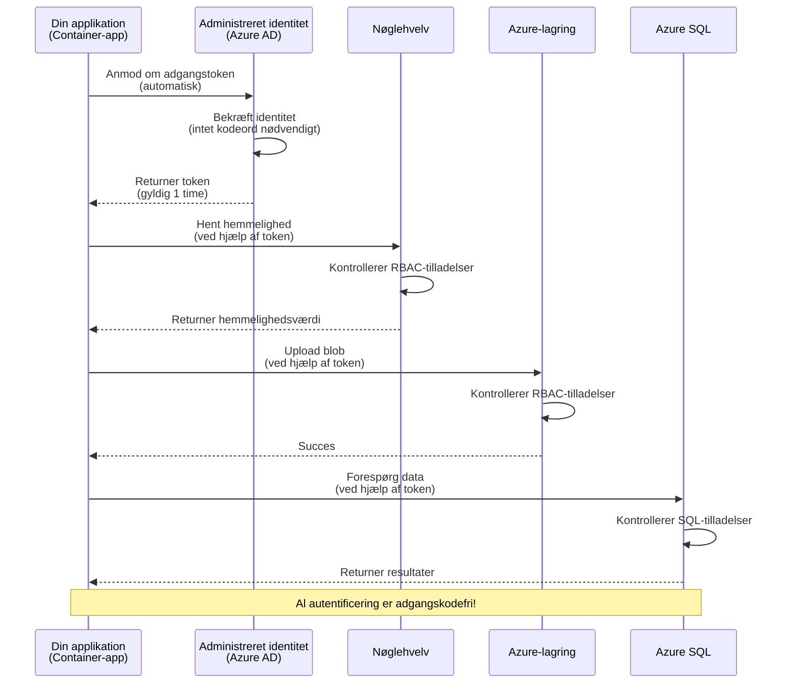
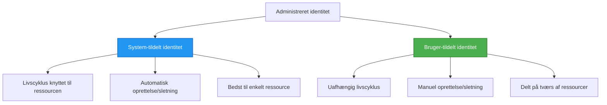

# Authentication Patterns and Managed Identity

⏱️ **Estimated Time**: 45-60 minutes | 💰 **Cost Impact**: Free (no additional charges) | ⭐ **Complexity**: Intermediate

**📚 Learning Path:**
- ← Forrige: [Konfigurationsstyring](configuration.md) - Håndtering af miljøvariabler og hemmeligheder
- 🎯 **Du er her**: Autentificering & Sikkerhed (Managed Identity, Key Vault, sikre mønstre)
- → Næste: [Første projekt](first-project.md) - Byg din første AZD-applikation
- 🏠 [Kursusforside](../../README.md)

---

## Hvad du vil lære

Ved at gennemføre denne lektion vil du:
- Forstå Azure-autentificeringsmønstre (nøgler, connection strings, managed identity)
- Implementere **Managed Identity** for passwordless autentificering
- Sikre hemmeligheder med **Azure Key Vault**-integration
- Konfigurere **rollebaseret adgangskontrol (RBAC)** til AZD-udrulninger
- Anvende sikkerhedsbest practices i Container Apps og Azure-tjenester
- Migrere fra nøglebaseret til identitetsbaseret autentificering

## Hvorfor Managed Identity er vigtig

### Problemet: Traditionel autentificering

**Før Managed Identity:**
```javascript
// ❌ SIKKERHEDSRISIKO: Hardkodede hemmeligheder i koden
const connectionString = "Server=mydb.database.windows.net;User=admin;Password=P@ssw0rd123";
const storageKey = "xK7mN9pQ2wR5tY8uI0oP3aS6dF1gH4jK...";
const cosmosKey = "C2x7B9n4M1p8Q5w3E6r0T2y5U8i1O4p7...";
```

**Problemer:**
- 🔴 **Eksponerede hemmeligheder** i kode, konfigurationsfiler, miljøvariabler
- 🔴 **Credential rotation** kræver kodeændringer og genudrulning
- 🔴 **Audit-mareridt** - hvem tilgik hvad, hvornår?
- 🔴 **Sprawl** - hemmeligheder spredt over flere systemer
- 🔴 **Compliance-risici** - fejler sikkerhedsrevisioner

### Løsningen: Managed Identity

**Efter Managed Identity:**
```javascript
// ✅ SIKKER: Ingen hemmeligheder i koden
const credential = new DefaultAzureCredential();
const client = new BlobServiceClient(
  "https://mystorageaccount.blob.core.windows.net",
  credential  // Azure håndterer autentificering automatisk
);
```

**Fordele:**
- ✅ **Ingen hemmeligheder** i kode eller konfiguration
- ✅ **Automatisk rotation** - Azure håndterer det
- ✅ **Fuld audit-trail** i Azure AD logs
- ✅ **Centraliseret sikkerhed** - håndteres i Azure Portal
- ✅ **Klar til compliance** - opfylder sikkerhedsstandarder

**Analogi**: Traditionel autentificering er som at bære flere fysiske nøgler til forskellige døre. Managed Identity er som at have et sikkerhedsbadge, der automatisk giver adgang baseret på hvem du er—ingen nøgler at miste, kopiere eller rotere.

---

## Arkitekturoversigt

### Autentificeringsflow med Managed Identity


### Typer af Managed Identities


| Feature | System-Assigned | User-Assigned |
|---------|----------------|---------------|
| **Lifecycle** | Tied to resource | Independent |
| **Creation** | Automatic with resource | Manual creation |
| **Deletion** | Deleted with resource | Persists after resource deletion |
| **Sharing** | One resource only | Multiple resources |
| **Use Case** | Simple scenarios | Complex multi-resource scenarios |
| **AZD Default** | ✅ Recommended | Optional |

---

## Forudsætninger

### Påkrævede værktøjer

Du bør allerede have disse installeret fra tidligere lektioner:

```bash
# Bekræft Azure Developer CLI
azd version
# ✅ Forventet: azd version 1.0.0 eller højere

# Bekræft Azure CLI
az --version
# ✅ Forventet: azure-cli 2.50.0 eller højere
```

### Azure-krav

- Aktivt Azure-abonnement
- Tilladelser til:
  - Oprette managed identities
  - Tildele RBAC-roller
  - Oprette Key Vault-ressourcer
  - Udrulle Container Apps

### Krav til viden

Du bør have gennemført:
- [Installation Guide](installation.md) - AZD setup
- [AZD Basics](azd-basics.md) - Kernekoncepter
- [Configuration Management](configuration.md) - Miljøvariabler

---

## Lektion 1: Forstå autentificeringsmønstre

### Mønster 1: Connection Strings (Gammelt - Undgå)

**Hvordan det virker:**
```bash
# Forbindelsesstreng indeholder legitimationsoplysninger
STORAGE_CONNECTION_STRING="DefaultEndpointsProtocol=https;AccountName=myaccount;AccountKey=xK7mN9pQ2wR5..."
COSMOS_CONNECTION_STRING="AccountEndpoint=https://myaccount.documents.azure.com:443/;AccountKey=C2x7..."
SQL_CONNECTION_STRING="Server=myserver.database.windows.net;User=admin;Password=P@ssw0rd..."
```

**Problemer:**
- ❌ Hemmeligheder synlige i miljøvariabler
- ❌ Logget i udrulningssystemer
- ❌ Svært at rotere
- ❌ Ingen audit-trail for adgang

**Hvornår man skal bruge:** Kun til lokal udvikling, aldrig i produktion.

---

### Mønster 2: Key Vault-referencer (Bedre)

**Hvordan det virker:**
```bicep
// Store secret in Key Vault
resource keyVault 'Microsoft.KeyVault/vaults@2023-02-01' = {
  name: 'mykv'
  properties: {
    enableRbacAuthorization: true
  }
}

// Reference in Container App
env: [
  {
    name: 'STORAGE_KEY'
    secretRef: 'storage-key'  // References Key Vault
  }
]
```

**Fordele:**
- ✅ Hemmeligheder gemt sikkert i Key Vault
- ✅ Centraliseret hemmelighedsstyring
- ✅ Rotation uden kodeændringer

**Begrænsninger:**
- ⚠️ Bruger stadig nøgler/adgangskoder
- ⚠️ Skal administrere Key Vault-adgang

**Hvornår man skal bruge:** Overgangstrin fra connection strings til managed identity.

---

### Mønster 3: Managed Identity (Bedste praksis)

**Hvordan det virker:**
```bicep
// Enable managed identity
resource containerApp 'Microsoft.App/containerApps@2023-05-01' = {
  name: 'myapp'
  identity: {
    type: 'SystemAssigned'  // Automatically creates identity
  }
}

// Grant permissions
resource roleAssignment 'Microsoft.Authorization/roleAssignments@2022-04-01' = {
  scope: storageAccount
  properties: {
    roleDefinitionId: storageBlobDataContributorRole
    principalId: containerApp.identity.principalId
  }
}
```

**Applikationskode:**
```javascript
// Ingen hemmeligheder nødvendige!
const { DefaultAzureCredential } = require('@azure/identity');
const { BlobServiceClient } = require('@azure/storage-blob');

const credential = new DefaultAzureCredential();
const blobServiceClient = new BlobServiceClient(
  'https://mystorageaccount.blob.core.windows.net',
  credential
);
```

**Fordele:**
- ✅ Ingen hemmeligheder i kode/konfiguration
- ✅ Automatisk credential-rotation
- ✅ Fuld audit-trail
- ✅ RBAC-baserede tilladelser
- ✅ Klar til compliance

**Hvornår man skal bruge:** Altid, til produktionsapplikationer.

---

## Lektion 2: Implementering af Managed Identity med AZD

### Trin-for-trin implementering

Lad os bygge en sikker Container App, der bruger managed identity til at få adgang til Azure Storage og Key Vault.

### Projektstruktur

```
secure-app/
├── azure.yaml                 # AZD configuration
├── infra/
│   ├── main.bicep            # Main infrastructure
│   ├── core/
│   │   ├── identity.bicep    # Managed identity setup
│   │   ├── keyvault.bicep    # Key Vault configuration
│   │   └── storage.bicep     # Storage with RBAC
│   └── app/
│       └── container-app.bicep
└── src/
    ├── app.js                # Application code
    ├── package.json
    └── Dockerfile
```

### 1. Konfigurer AZD (azure.yaml)

```yaml
name: secure-app
metadata:
  template: secure-app@1.0.0

services:
  api:
    project: ./src
    language: js
    host: containerapp

# Enable managed identity (AZD handles this automatically)
```

### 2. Infrastruktur: Slå Managed Identity til

**Fil: `infra/main.bicep`**

```bicep
targetScope = 'subscription'

param environmentName string
param location string = 'eastus'

var tags = { 'azd-env-name': environmentName }

// Resource group
resource rg 'Microsoft.Resources/resourceGroups@2021-04-01' = {
  name: 'rg-${environmentName}'
  location: location
  tags: tags
}

// Storage Account
module storage './core/storage.bicep' = {
  name: 'storage'
  scope: rg
  params: {
    name: 'st${uniqueString(rg.id)}'
    location: location
    tags: tags
  }
}

// Key Vault
module keyVault './core/keyvault.bicep' = {
  name: 'keyvault'
  scope: rg
  params: {
    name: 'kv-${uniqueString(rg.id)}'
    location: location
    tags: tags
  }
}

// Container App with Managed Identity
module containerApp './app/container-app.bicep' = {
  name: 'container-app'
  scope: rg
  params: {
    name: 'ca-${environmentName}'
    location: location
    tags: tags
    storageAccountName: storage.outputs.name
    keyVaultName: keyVault.outputs.name
  }
}

// Grant Container App access to Storage
module storageRoleAssignment './core/role-assignment.bicep' = {
  name: 'storage-role'
  scope: rg
  params: {
    principalId: containerApp.outputs.identityPrincipalId
    roleDefinitionId: 'ba92f5b4-2d11-453d-a403-e96b0029c9fe'  // Storage Blob Data Contributor
    targetResourceId: storage.outputs.id
  }
}

// Grant Container App access to Key Vault
module kvRoleAssignment './core/role-assignment.bicep' = {
  name: 'kv-role'
  scope: rg
  params: {
    principalId: containerApp.outputs.identityPrincipalId
    roleDefinitionId: '4633458b-17de-408a-b874-0445c86b69e6'  // Key Vault Secrets User
    targetResourceId: keyVault.outputs.id
  }
}

// Outputs
output AZURE_STORAGE_ACCOUNT_NAME string = storage.outputs.name
output AZURE_KEY_VAULT_NAME string = keyVault.outputs.name
output APP_URL string = containerApp.outputs.url
```

### 3. Container App med system-tildelt identitet

**Fil: `infra/app/container-app.bicep`**

```bicep
param name string
param location string
param tags object = {}
param storageAccountName string
param keyVaultName string

resource containerApp 'Microsoft.App/containerApps@2023-05-01' = {
  name: name
  location: location
  tags: tags
  identity: {
    type: 'SystemAssigned'  // 🔑 Enable managed identity
  }
  properties: {
    configuration: {
      ingress: {
        external: true
        targetPort: 3000
      }
    }
    template: {
      containers: [
        {
          name: 'api'
          image: 'myregistry.azurecr.io/api:latest'
          resources: {
            cpu: json('0.5')
            memory: '1Gi'
          }
          env: [
            {
              name: 'AZURE_STORAGE_ACCOUNT_NAME'
              value: storageAccountName
            }
            {
              name: 'AZURE_KEY_VAULT_NAME'
              value: keyVaultName
            }
            // 🔑 No secrets - managed identity handles authentication!
          ]
        }
      ]
    }
  }
}

// Output the identity for RBAC assignments
output identityPrincipalId string = containerApp.identity.principalId
output id string = containerApp.id
output url string = 'https://${containerApp.properties.configuration.ingress.fqdn}'
```

### 4. RBAC rolle-tildelingsmodul

**Fil: `infra/core/role-assignment.bicep`**

```bicep
param principalId string
param roleDefinitionId string  // Azure built-in role ID
param targetResourceId string

resource roleAssignment 'Microsoft.Authorization/roleAssignments@2022-04-01' = {
  name: guid(principalId, roleDefinitionId, targetResourceId)
  scope: resourceId('Microsoft.Resources/resourceGroups', resourceGroup().name)
  properties: {
    roleDefinitionId: subscriptionResourceId('Microsoft.Authorization/roleDefinitions', roleDefinitionId)
    principalId: principalId
    principalType: 'ServicePrincipal'
  }
}

output id string = roleAssignment.id
```

### 5. Applikationskode med Managed Identity

**Fil: `src/app.js`**

```javascript
const express = require('express');
const { DefaultAzureCredential } = require('@azure/identity');
const { BlobServiceClient } = require('@azure/storage-blob');
const { SecretClient } = require('@azure/keyvault-secrets');

const app = express();
const PORT = process.env.PORT || 3000;

// 🔑 Initialiser legitimationsoplysninger (virker automatisk med administreret identitet)
const credential = new DefaultAzureCredential();

// Opsætning af Azure Storage
const storageAccountName = process.env.AZURE_STORAGE_ACCOUNT_NAME;
const blobServiceClient = new BlobServiceClient(
  `https://${storageAccountName}.blob.core.windows.net`,
  credential  // Ingen nøgler kræves!
);

// Opsætning af Key Vault
const keyVaultName = process.env.AZURE_KEY_VAULT_NAME;
const secretClient = new SecretClient(
  `https://${keyVaultName}.vault.azure.net`,
  credential  // Ingen nøgler kræves!
);

// Sundhedstjek
app.get('/health', (req, res) => {
  res.json({ status: 'healthy', authentication: 'managed-identity' });
});

// Upload fil til blob storage
app.post('/upload', async (req, res) => {
  try {
    const containerClient = blobServiceClient.getContainerClient('uploads');
    await containerClient.createIfNotExists();
    
    const blobName = `file-${Date.now()}.txt`;
    const blockBlobClient = containerClient.getBlockBlobClient(blobName);
    
    await blockBlobClient.upload('Hello from managed identity!', 30);
    
    res.json({
      success: true,
      blobName: blobName,
      message: 'File uploaded using managed identity!'
    });
  } catch (error) {
    console.error('Upload error:', error);
    res.status(500).json({ error: error.message });
  }
});

// Hent hemmelighed fra Key Vault
app.get('/secret/:name', async (req, res) => {
  try {
    const secretName = req.params.name;
    const secret = await secretClient.getSecret(secretName);
    
    res.json({
      name: secretName,
      value: secret.value,
      message: 'Secret retrieved using managed identity!'
    });
  } catch (error) {
    console.error('Secret error:', error);
    res.status(500).json({ error: error.message });
  }
});

// List blob-containere (demonstrerer læseadgang)
app.get('/containers', async (req, res) => {
  try {
    const containers = [];
    for await (const container of blobServiceClient.listContainers()) {
      containers.push(container.name);
    }
    
    res.json({
      containers: containers,
      count: containers.length,
      message: 'Containers listed using managed identity!'
    });
  } catch (error) {
    console.error('List error:', error);
    res.status(500).json({ error: error.message });
  }
});

app.listen(PORT, () => {
  console.log(`Secure API listening on port ${PORT}`);
  console.log('Authentication: Managed Identity (passwordless)');
});
```

**Fil: `src/package.json`**

```json
{
  "name": "secure-app",
  "version": "1.0.0",
  "dependencies": {
    "express": "^4.18.2",
    "@azure/identity": "^4.0.0",
    "@azure/storage-blob": "^12.17.0",
    "@azure/keyvault-secrets": "^4.7.0"
  },
  "scripts": {
    "start": "node app.js"
  }
}
```

### 6. Deploy og test

```bash
# Initialiser AZD-miljøet
azd init

# Udrul infrastrukturen og applikationen
azd up

# Hent appens URL
APP_URL=$(azd env get-values | grep APP_URL | cut -d '=' -f2 | tr -d '"')

# Test sundhedstjekket
curl $APP_URL/health
```

**✅ Forventet output:**
```json
{
  "status": "healthy",
  "authentication": "managed-identity"
}
```

**Test blob-upload:**
```bash
curl -X POST $APP_URL/upload
```

**✅ Forventet output:**
```json
{
  "success": true,
  "blobName": "file-1700404800000.txt",
  "message": "File uploaded using managed identity!"
}
```

**Test container-oversigt:**
```bash
curl $APP_URL/containers
```

**✅ Forventet output:**
```json
{
  "containers": ["uploads"],
  "count": 1,
  "message": "Containers listed using managed identity!"
}
```

---

## Almindelige Azure RBAC-roller

### Indbyggede rolle-ID'er for Managed Identity

| Service | Role Name | Role ID | Permissions |
|---------|-----------|---------|-------------|
| **Storage** | Storage Blob Data Reader | `2a2b9908-6b94-4a3d-8e5a-a7d8f8cc8a12` | Read blobs and containers |
| **Storage** | Storage Blob Data Contributor | `ba92f5b4-2d11-453d-a403-e96b0029c9fe` | Read, write, delete blobs |
| **Storage** | Storage Queue Data Contributor | `974c5e8b-45b9-4653-ba55-5f855dd0fb88` | Read, write, delete queue messages |
| **Key Vault** | Key Vault Secrets User | `4633458b-17de-408a-b874-0445c86b69e6` | Read secrets |
| **Key Vault** | Key Vault Secrets Officer | `b86a8fe4-44ce-4948-aee5-eccb2c155cd7` | Read, write, delete secrets |
| **Cosmos DB** | Cosmos DB Built-in Data Reader | `00000000-0000-0000-0000-000000000001` | Read Cosmos DB data |
| **Cosmos DB** | Cosmos DB Built-in Data Contributor | `00000000-0000-0000-0000-000000000002` | Read, write Cosmos DB data |
| **SQL Database** | SQL DB Contributor | `9b7fa17d-e63e-47b0-bb0a-15c516ac86ec` | Manage SQL databases |
| **Service Bus** | Azure Service Bus Data Owner | `090c5cfd-751d-490a-894a-3ce6f1109419` | Send, receive, manage messages |

### Sådan finder du rolle-ID'er

```bash
# Vis alle indbyggede roller
az role definition list --query "[].{Name:roleName, ID:name}" --output table

# Søg efter en bestemt rolle
az role definition list --query "[?contains(roleName, 'Storage Blob')].{Name:roleName, ID:name}" --output table

# Hent detaljer om rollen
az role definition list --name "Storage Blob Data Contributor"
```

---

## Praktiske øvelser

### Øvelse 1: Aktiver Managed Identity for eksisterende app ⭐⭐ (Mellem)

**Mål**: Tilføj managed identity til en eksisterende Container App-udrulning

**Scenario**: Du har en Container App, der bruger connection strings. Konverter den til managed identity.

**Udgangspunkt**: Container App med denne konfiguration:

```bicep
// ❌ Current: Using connection string
env: [
  {
    name: 'STORAGE_CONNECTION_STRING'
    secretRef: 'storage-connection'
  }
]
```

**Trin**:

1. **Aktivér managed identity i Bicep:**

```bicep
resource containerApp 'Microsoft.App/containerApps@2023-05-01' = {
  name: 'myapp'
  identity: {
    type: 'SystemAssigned'  // Add this
  }
  // ... rest of configuration
}
```

2. **Giv adgang til Storage:**

```bicep
// Get storage account reference
resource storageAccount 'Microsoft.Storage/storageAccounts@2023-01-01' existing = {
  name: storageAccountName
}

// Assign role
resource roleAssignment 'Microsoft.Authorization/roleAssignments@2022-04-01' = {
  name: guid(containerApp.id, 'ba92f5b4-2d11-453d-a403-e96b0029c9fe', storageAccount.id)
  scope: storageAccount
  properties: {
    roleDefinitionId: subscriptionResourceId('Microsoft.Authorization/roleDefinitions', 'ba92f5b4-2d11-453d-a403-e96b0029c9fe')
    principalId: containerApp.identity.principalId
    principalType: 'ServicePrincipal'
  }
}
```

3. **Opdater applikationskode:**

**Før (connection string):**
```javascript
const { BlobServiceClient } = require('@azure/storage-blob');

const blobServiceClient = BlobServiceClient.fromConnectionString(
  process.env.STORAGE_CONNECTION_STRING
);
```

**Efter (managed identity):**
```javascript
const { DefaultAzureCredential } = require('@azure/identity');
const { BlobServiceClient } = require('@azure/storage-blob');

const credential = new DefaultAzureCredential();
const blobServiceClient = new BlobServiceClient(
  `https://${process.env.STORAGE_ACCOUNT_NAME}.blob.core.windows.net`,
  credential
);
```

4. **Opdater miljøvariabler:**

```bicep
env: [
  {
    name: 'STORAGE_ACCOUNT_NAME'
    value: storageAccountName  // Just the name, no secrets!
  }
  // Remove STORAGE_CONNECTION_STRING
]
```

5. **Deploy og test:**

```bash
# Genudrul
azd up

# Test, at det stadig virker
curl https://myapp.azurecontainerapps.io/upload
```

**✅ Succeskriterier:**
- ✅ Applikationen udrulles uden fejl
- ✅ Storage-operationer fungerer (upload, list, download)
- ✅ Ingen connection strings i miljøvariabler
- ✅ Identitet synlig i Azure Portal under fanen "Identity"

**Verifikation:**

```bash
# Kontroller, at administreret identitet er aktiveret
az containerapp show \
  --name myapp \
  --resource-group rg-myapp \
  --query "identity.type"
# ✅ Forventet: "SystemAssigned"

# Kontroller rolletildeling
az role assignment list \
  --assignee $(az containerapp show --name myapp --resource-group rg-myapp --query "identity.principalId" -o tsv) \
  --scope /subscriptions/{sub-id}/resourceGroups/rg-myapp/providers/Microsoft.Storage/storageAccounts/mystorageaccount
# ✅ Forventet: Viser rollen "Storage Blob Data Contributor"
```

**Tid**: 20-30 minutter

---

### Øvelse 2: Fler-service adgang med bruger-tildelt identitet ⭐⭐⭐ (Avanceret)

**Mål**: Opret en bruger-tildelt identitet, der deles mellem flere Container Apps

**Scenario**: Du har 3 mikroservices, som alle har brug for adgang til den samme Storage-konto og Key Vault.

**Trin**:

1. **Opret bruger-tildelt identitet:**

**Fil: `infra/core/identity.bicep`**

```bicep
param name string
param location string
param tags object = {}

resource userAssignedIdentity 'Microsoft.ManagedIdentity/userAssignedIdentities@2023-01-31' = {
  name: name
  location: location
  tags: tags
}

output id string = userAssignedIdentity.id
output principalId string = userAssignedIdentity.properties.principalId
output clientId string = userAssignedIdentity.properties.clientId
```

2. **Tildel roller til bruger-tildelt identitet:**

```bicep
// In main.bicep
module userIdentity './core/identity.bicep' = {
  name: 'user-identity'
  scope: rg
  params: {
    name: 'id-${environmentName}'
    location: location
    tags: tags
  }
}

// Grant Storage access
resource storageRoleAssignment 'Microsoft.Authorization/roleAssignments@2022-04-01' = {
  name: guid(userIdentity.outputs.principalId, 'storage-contributor')
  scope: storageAccount
  properties: {
    roleDefinitionId: subscriptionResourceId('Microsoft.Authorization/roleDefinitions', 'ba92f5b4-2d11-453d-a403-e96b0029c9fe')
    principalId: userIdentity.outputs.principalId
    principalType: 'ServicePrincipal'
  }
}

// Grant Key Vault access
resource kvRoleAssignment 'Microsoft.Authorization/roleAssignments@2022-04-01' = {
  name: guid(userIdentity.outputs.principalId, 'kv-secrets-user')
  scope: keyVault
  properties: {
    roleDefinitionId: subscriptionResourceId('Microsoft.Authorization/roleDefinitions', '4633458b-17de-408a-b874-0445c86b69e6')
    principalId: userIdentity.outputs.principalId
    principalType: 'ServicePrincipal'
  }
}
```

3. **Tildel identitet til flere Container Apps:**

```bicep
resource apiGateway 'Microsoft.App/containerApps@2023-05-01' = {
  name: 'api-gateway'
  identity: {
    type: 'UserAssigned'
    userAssignedIdentities: {
      '${userIdentity.outputs.id}': {}
    }
  }
  // ... rest of config
}

resource productService 'Microsoft.App/containerApps@2023-05-01' = {
  name: 'product-service'
  identity: {
    type: 'UserAssigned'
    userAssignedIdentities: {
      '${userIdentity.outputs.id}': {}
    }
  }
  // ... rest of config
}

resource orderService 'Microsoft.App/containerApps@2023-05-01' = {
  name: 'order-service'
  identity: {
    type: 'UserAssigned'
    userAssignedIdentities: {
      '${userIdentity.outputs.id}': {}
    }
  }
  // ... rest of config
}
```

4. **Applikationskode (alle services bruger samme mønster):**

```javascript
const { DefaultAzureCredential, ManagedIdentityCredential } = require('@azure/identity');

// For bruger-tildelt identitet, angiv klient-id
const credential = new ManagedIdentityCredential(
  process.env.AZURE_CLIENT_ID  // Klient-id for bruger-tildelt identitet
);

// Eller brug DefaultAzureCredential (opdager automatisk)
const credential = new DefaultAzureCredential();

const blobServiceClient = new BlobServiceClient(
  `https://${process.env.STORAGE_ACCOUNT_NAME}.blob.core.windows.net`,
  credential
);
```

5. **Deploy og verificer:**

```bash
azd up

# Test at alle tjenester kan få adgang til lageret
curl https://api-gateway.azurecontainerapps.io/upload
curl https://product-service.azurecontainerapps.io/upload
curl https://order-service.azurecontainerapps.io/upload
```

**✅ Succeskriterier:**
- ✅ Én identitet deles mellem 3 services
- ✅ Alle services kan få adgang til Storage og Key Vault
- ✅ Identiteten bevares, hvis du sletter en service
- ✅ Centraliseret tilladelsesstyring

**Fordele ved bruger-tildelt identitet:**
- Én identitet at administrere
- Konsistente tilladelser på tværs af services
- Overlever sletning af services
- Bedre til komplekse arkitekturer

**Tid**: 30-40 minutter

---

### Øvelse 3: Implementér Key Vault secret rotation ⭐⭐⭐ (Avanceret)

**Mål**: Gem tredjeparts API-nøgler i Key Vault og få adgang til dem via managed identity

**Scenario**: Din app skal kalde en ekstern API (OpenAI, Stripe, SendGrid), som kræver API-nøgler.

**Trin**:

1. **Opret Key Vault med RBAC:**

**Fil: `infra/core/keyvault.bicep`**

```bicep
param name string
param location string
param tags object = {}

resource keyVault 'Microsoft.KeyVault/vaults@2023-02-01' = {
  name: name
  location: location
  tags: tags
  properties: {
    enableRbacAuthorization: true  // Use RBAC instead of access policies
    sku: {
      family: 'A'
      name: 'standard'
    }
    tenantId: subscription().tenantId
    enableSoftDelete: true
    softDeleteRetentionInDays: 90
  }
}

// Allow Container App to read secrets
output id string = keyVault.id
output name string = keyVault.name
output uri string = keyVault.properties.vaultUri
```

2. **Gem hemmeligheder i Key Vault:**

```bash
# Hent navnet på Key Vault
KV_NAME=$(azd env get-values | grep AZURE_KEY_VAULT_NAME | cut -d '=' -f2 | tr -d '"')

# Gem tredjeparts-API-nøgler
az keyvault secret set \
  --vault-name $KV_NAME \
  --name "OpenAI-ApiKey" \
  --value "sk-proj-xxxxxxxxxxxxx"

az keyvault secret set \
  --vault-name $KV_NAME \
  --name "Stripe-ApiKey" \
  --value "sk_live_xxxxxxxxxxxxx"

az keyvault secret set \
  --vault-name $KV_NAME \
  --name "SendGrid-ApiKey" \
  --value "SG.xxxxxxxxxxxxx"
```

3. **Applikationskode til at hente hemmeligheder:**

**Fil: `src/config.js`**

```javascript
const { DefaultAzureCredential } = require('@azure/identity');
const { SecretClient } = require('@azure/keyvault-secrets');

class Config {
  constructor() {
    this.credential = new DefaultAzureCredential();
    this.secretClient = new SecretClient(
      `https://${process.env.AZURE_KEY_VAULT_NAME}.vault.azure.net`,
      this.credential
    );
    this.cache = {};
  }

  async getSecret(secretName) {
    // Tjek cachen først
    if (this.cache[secretName]) {
      return this.cache[secretName];
    }

    try {
      const secret = await this.secretClient.getSecret(secretName);
      this.cache[secretName] = secret.value;
      console.log(`✅ Retrieved secret: ${secretName}`);
      return secret.value;
    } catch (error) {
      console.error(`❌ Failed to get secret ${secretName}:`, error.message);
      throw error;
    }
  }

  async getOpenAIKey() {
    return this.getSecret('OpenAI-ApiKey');
  }

  async getStripeKey() {
    return this.getSecret('Stripe-ApiKey');
  }

  async getSendGridKey() {
    return this.getSecret('SendGrid-ApiKey');
  }
}

module.exports = new Config();
```

4. **Brug hemmeligheder i applikationen:**

**Fil: `src/app.js`**

```javascript
const express = require('express');
const config = require('./config');
const { OpenAI } = require('openai');

const app = express();

// Initialiser OpenAI med nøglen fra Key Vault
let openaiClient;

async function initializeServices() {
  const openaiKey = await config.getOpenAIKey();
  openaiClient = new OpenAI({ apiKey: openaiKey });
  console.log('✅ Services initialized with secrets from Key Vault');
}

// Kaldes ved opstart
initializeServices().catch(console.error);

app.post('/chat', async (req, res) => {
  try {
    const completion = await openaiClient.chat.completions.create({
      model: 'gpt-4.1',
      messages: [{ role: 'user', content: 'Hello!' }]
    });
    
    res.json({
      response: completion.choices[0].message.content,
      authentication: 'Key from Key Vault via Managed Identity'
    });
  } catch (error) {
    res.status(500).json({ error: error.message });
  }
});

app.listen(3000, () => {
  console.log('Secure API with Key Vault integration running');
});
```

5. **Deploy og test:**

```bash
azd up

# Test, at API-nøgler fungerer
curl -X POST https://myapp.azurecontainerapps.io/chat \
  -H "Content-Type: application/json" \
  -d '{"message":"Hello AI"}'
```

**✅ Succeskriterier:**
- ✅ Ingen API-nøgler i kode eller miljøvariabler
- ✅ Applikationen henter nøgler fra Key Vault
- ✅ Tredjeparts-API'er fungerer korrekt
- ✅ Kan rotere nøgler uden kodeændringer

**Roter en hemmelighed:**

```bash
# Opdater hemmelighed i Key Vault
az keyvault secret set \
  --vault-name $KV_NAME \
  --name "OpenAI-ApiKey" \
  --value "sk-proj-NEW_KEY_HERE"

# Genstart appen for at hente den nye nøgle
az containerapp revision restart \
  --name myapp \
  --resource-group rg-myapp
```

**Tid**: 25-35 minutter

---

## Videnskontrolpunkt

### 1. Autentificeringsmønstre ✓

Test din forståelse:

- [ ] **Q1**: Hvad er de tre hoved-autentificeringsmønstre? 
  - **A**: Connection strings (gammelt), Key Vault-referencer (transition), Managed Identity (bedst)

- [ ] **Q2**: Hvorfor er managed identity bedre end connection strings?
  - **A**: Ingen hemmeligheder i kode, automatisk rotation, fuld audit-trail, RBAC-tilladelser

- [ ] **Q3**: Hvornår vil du bruge bruger-tildelt identitet i stedet for system-tildelt?
  - **A**: Når identiteten skal deles mellem flere ressourcer, eller når identitetslivscyklussen er uafhængig af ressourcens livscyklus

**Hands-On Verification:**
```bash
# Kontroller hvilken type identitet din app bruger
az containerapp show \
  --name myapp \
  --resource-group rg-myapp \
  --query "identity.type"

# Vis alle rolle-tildelinger for identiteten
az role assignment list \
  --assignee $(az containerapp show --name myapp --resource-group rg-myapp --query "identity.principalId" -o tsv)
```

---

### 2. RBAC og tilladelser ✓

Test din forståelse:

- [ ] **Q1**: Hvad er rolle-ID'et for "Storage Blob Data Contributor"?
  - **A**: `ba92f5b4-2d11-453d-a403-e96b0029c9fe`

- [ ] **Q2**: Hvilke tilladelser giver "Key Vault Secrets User"?
  - **A**: Skrivebeskyttet adgang til hemmeligheder (kan ikke oprette, opdatere eller slette)

- [ ] **Q3**: Hvordan giver du en Container App adgang til Azure SQL?
  - **A**: Tildel "SQL DB Contributor"-rollen eller konfigurer Azure AD-autentificering for SQL

**Hands-On Verification:**
```bash
# Find en bestemt rolle
az role definition list --name "Storage Blob Data Contributor"

# Tjek hvilke roller der er tildelt din identitet
PRINCIPAL_ID=$(az containerapp show --name myapp --resource-group rg-myapp --query "identity.principalId" -o tsv)
az role assignment list --assignee $PRINCIPAL_ID --output table
```

---

### 3. Key Vault-integration ✓

Test din forståelse:
- [ ] **Q1**: Hvordan aktiverer du RBAC for Key Vault i stedet for adgangspolitikker?
  - **A**: Sæt `enableRbacAuthorization: true` i Bicep

- [ ] **Q2**: Hvilket Azure SDK-bibliotek håndterer autentificering med administreret identitet?
  - **A**: `@azure/identity` med klassen `DefaultAzureCredential`

- [ ] **Q3**: Hvor længe forbliver Key Vault-hemmeligheder i cachen?
  - **A**: Afhænger af applikationen; implementer din egen cachingstrategi

**Praktisk verifikation:**
```bash
# Test adgang til Key Vault
az keyvault secret show \
  --vault-name $KV_NAME \
  --name "OpenAI-ApiKey" \
  --query "value"

# Kontroller, at RBAC er aktiveret
az keyvault show \
  --name $KV_NAME \
  --query "properties.enableRbacAuthorization"
# ✅ Forventet: sand
```

---

## Bedste sikkerhedspraksis

### ✅ GØR:

1. **Brug altid administreret identitet i produktion**
   ```bicep
   identity: {
     type: 'SystemAssigned'
   }
   ```

2. **Brug mindst-privilegierede RBAC-roller**
   - Brug "Reader" roller når det er muligt
   - Undgå "Owner" eller "Contributor", medmindre det er nødvendigt

3. **Opbevar tredjepartsnøgler i Key Vault**
   ```javascript
   const apiKey = await secretClient.getSecret('ThirdPartyApiKey');
   ```

4. **Aktivér revisionslogning**
   ```bicep
   diagnosticSettings: {
     logs: [{ category: 'AuditEvent', enabled: true }]
   }
   ```

5. **Brug forskellige identiteter til dev/staging/prod**
   ```bash
   azd env new dev
   azd env new staging
   azd env new prod
   ```

6. **Roter hemmeligheder regelmæssigt**
   - Sæt udløbsdatoer på Key Vault-hemmeligheder
   - Automatisér rotation med Azure Functions

### ❌ GØR IKKE:

1. **Indkod aldrig hemmeligheder**
   ```javascript
   // ❌ DÅRLIG
   const apiKey = "sk-proj-xxxxxxxxxxxxx";
   ```

2. **Brug ikke connection strings i produktion**
   ```javascript
   // ❌ DÅRLIG
   BlobServiceClient.fromConnectionString(process.env.STORAGE_CONNECTION_STRING)
   ```

3. **Giv ikke overdrevne tilladelser**
   ```bicep
   // ❌ BAD - too much access
   roleDefinitionId: 'Owner'
   
   // ✅ GOOD - least privilege
   roleDefinitionId: 'Storage Blob Data Reader'
   ```

4. **Log ikke hemmeligheder**
   ```javascript
   // ❌ DÅRLIG
   console.log('API Key:', apiKey);
   
   // ✅ GOD
   console.log('API Key retrieved successfully');
   ```

5. **Del ikke produktionsidentiteter på tværs af miljøer**
   ```bicep
   // ❌ BAD - same identity for dev and prod
   // ✅ GOOD - separate identities per environment
   ```

---

## Fejlfinding

### Problem: "Unauthorized" ved adgang til Azure Storage

**Symptomer:**
```
Error: Unauthorized (403)
AuthorizationPermissionMismatch: This request is not authorized to perform this operation
```

**Diagnose:**

```bash
# Kontroller om administreret identitet er aktiveret
az containerapp show \
  --name myapp \
  --resource-group rg-myapp \
  --query "identity.type"
# ✅ Forventet: "SystemAssigned" eller "UserAssigned"

# Kontroller rolletildelinger
PRINCIPAL_ID=$(az containerapp show --name myapp --resource-group rg-myapp --query "identity.principalId" -o tsv)
az role assignment list --assignee $PRINCIPAL_ID

# Forventet: Bør se "Storage Blob Data Contributor" eller en lignende rolle
```

**Løsninger:**

1. **Tildel korrekt RBAC-rolle:**
```bash
STORAGE_ID=$(az storage account show --name mystorageaccount --resource-group rg-myapp --query "id" -o tsv)
az role assignment create \
  --assignee $PRINCIPAL_ID \
  --role "Storage Blob Data Contributor" \
  --scope $STORAGE_ID
```

2. **Vent på udbredelse (kan tage 5-10 minutter):**
```bash
# Kontroller status for rolletildeling
az role assignment list --assignee $PRINCIPAL_ID --scope $STORAGE_ID
```

3. **Bekræft at applikationskoden bruger korrekte legitimationsoplysninger:**
```javascript
// Sørg for, at du bruger DefaultAzureCredential
const credential = new DefaultAzureCredential();
```

---

### Problem: Adgang til Key Vault nægtet

**Symptomer:**
```
Error: Forbidden (403)
The user, group or application does not have secrets get permission
```

**Diagnose:**

```bash
# Kontroller, at Key Vault RBAC er aktiveret
az keyvault show \
  --name $KV_NAME \
  --query "properties.enableRbacAuthorization"
# ✅ Forventet: true

# Kontroller rolletildelinger
az role assignment list \
  --assignee $PRINCIPAL_ID \
  --scope /subscriptions/{sub-id}/resourceGroups/rg-myapp/providers/Microsoft.KeyVault/vaults/$KV_NAME
```

**Løsninger:**

1. **Aktivér RBAC på Key Vault:**
```bash
az keyvault update \
  --name $KV_NAME \
  --enable-rbac-authorization true
```

2. **Tildel rollen Key Vault Secrets User:**
```bash
KV_ID=$(az keyvault show --name $KV_NAME --query "id" -o tsv)
az role assignment create \
  --assignee $PRINCIPAL_ID \
  --role "Key Vault Secrets User" \
  --scope $KV_ID
```

---

### Problem: DefaultAzureCredential fejler lokalt

**Symptomer:**
```
Error: DefaultAzureCredential failed to retrieve a token
CredentialUnavailableError: No credential available
```

**Diagnose:**

```bash
# Kontroller, om du er logget ind
az account show

# Kontroller Azure CLI-autentificering
az ad signed-in-user show
```

**Løsninger:**

1. **Log ind på Azure CLI:**
```bash
az login
```

2. **Angiv Azure-abonnement:**
```bash
az account set --subscription "Your Subscription Name"
```

3. **Til lokal udvikling, brug miljøvariabler:**
```bash
export AZURE_TENANT_ID="your-tenant-id"
export AZURE_CLIENT_ID="your-client-id"
export AZURE_CLIENT_SECRET="your-client-secret"
```

4. **Eller brug en anden legitimationsmetode lokalt:**
```javascript
const { DefaultAzureCredential, AzureCliCredential } = require('@azure/identity');

// Brug AzureCliCredential til lokal udvikling
const credential = process.env.NODE_ENV === 'production' 
  ? new DefaultAzureCredential()
  : new AzureCliCredential();
```

---

### Problem: Rolle-tildeling tager for lang tid at blive udbredt

**Symptomer:**
- Rollen blev tildelt succesfuldt
- Får stadig 403-fejl
- Intermitterende adgang (nogle gange virker det, nogle gange ikke)

**Forklaring:**
Ændringer i Azure RBAC kan tage 5-10 minutter at udbrede globalt.

**Løsning:**

```bash
# Vent og prøv igen
echo "Waiting for RBAC propagation..."
sleep 300  # Vent 5 minutter

# Test adgang
curl https://myapp.azurecontainerapps.io/upload

# Hvis det stadig fejler, genstart appen
az containerapp revision restart \
  --name myapp \
  --resource-group rg-myapp
```

---

## Omkostningsovervejelser

### Omkostninger ved administreret identitet

| Ressource | Omkostning |
|----------|------|
| **Administreret identitet** | 🆓 **GRATIS** - Ingen omkostning |
| **RBAC-rolle-tildelinger** | 🆓 **GRATIS** - Ingen omkostning |
| **Azure AD-tokenanmodninger** | 🆓 **GRATIS** - Inkluderet |
| **Key Vault-operationer** | $0.03 per 10,000 operationer |
| **Key Vault-lagring** | $0.024 pr. hemmelighed pr. måned |

**Administreret identitet sparer penge ved at:**
- ✅ Eliminere Key Vault-operationer for service-til-service-autentificering
- ✅ Reducere sikkerhedshændelser (ingen lækkede legitimationsoplysninger)
- ✅ Mindske driftmæssig belastning (ingen manuel rotation)

**Eksempel på omkostningssammenligning (månedligt):**

| Scenario | Connection strings | Administreret identitet | Besparelse |
|----------|-------------------|-----------------|---------|
| Lille app (1M requests) | ~$50 (Key Vault + ops) | ~$0 | $50/måned |
| Mellemstor app (10M requests) | ~$200 | ~$0 | $200/måned |
| Stor app (100M requests) | ~$1,500 | ~$0 | $1,500/måned |

---

## Læs mere

### Officiel dokumentation
- [Azure administrerede identiteter](https://learn.microsoft.com/entra/identity/managed-identities-azure-resources/overview)
- [Azure RBAC](https://learn.microsoft.com/azure/role-based-access-control/overview)
- [Azure Key Vault](https://learn.microsoft.com/azure/key-vault/general/overview)
- [DefaultAzureCredential](https://learn.microsoft.com/dotnet/api/azure.identity.defaultazurecredential)

### SDK-dokumentation
- [@azure/identity (Node.js)](https://www.npmjs.com/package/@azure/identity)
- [Azure.Identity (C#)](https://www.nuget.org/packages/Azure.Identity/)
- [azure-identity (Python)](https://pypi.org/project/azure-identity/)

### Næste skridt i dette kursus
- ← Forrige: [Konfigurationsstyring](configuration.md)
- → Næste: [Første projekt](first-project.md)
- 🏠 [Kursusforside](../../README.md)

### Relaterede eksempler
- [Microsoft Foundry Models Chat-eksempel](../../../../examples/azure-openai-chat) - Bruger administreret identitet for Microsoft Foundry Models
- [Microservices-eksempel](../../../../examples/microservices) - Multiservice-autentificeringsmønstre

---

## Resumé

**Du har lært:**
- ✅ Tre autentificeringsmønstre (connection strings, Key Vault, administreret identitet)
- ✅ Hvordan man aktiverer og konfigurerer administreret identitet i AZD
- ✅ RBAC-rolle-tildelinger for Azure-tjenester
- ✅ Key Vault-integration for tredjepartshemmeligheder
- ✅ Bruger-tildelte vs system-tildelte identiteter
- ✅ Bedste sikkerhedspraksis og fejlfinding

**Vigtige pointer:**
1. **Brug altid administreret identitet i produktion** - Ingen hemmeligheder, automatisk rotation
2. **Brug mindst-privilegierede RBAC-roller** - Giv kun nødvendige tilladelser
3. **Opbevar tredjepartsnøgler i Key Vault** - Centraliseret hemmelighedshåndtering
4. **Adskil identiteter pr. miljø** - Dev, staging, prod isolation
5. **Aktivér revisionslogning** - Spor hvem der tilgik hvad

**Næste skridt:**
1. Fuldfør de praktiske øvelser ovenfor
2. Migrer en eksisterende app fra connection strings til administreret identitet
3. Byg dit første AZD-projekt med sikkerhed fra dag ét: [Første projekt](first-project.md)

---

<!-- CO-OP TRANSLATOR DISCLAIMER START -->
**Disclaimer**:
Dette dokument er blevet oversat ved hjælp af AI-oversættelsestjenesten [Co-op Translator](https://github.com/Azure/co-op-translator). Selvom vi bestræber os på nøjagtighed, skal du være opmærksom på, at automatiske oversættelser kan indeholde fejl eller unøjagtigheder. Det oprindelige dokument i dets originalsprog bør betragtes som den autoritative kilde. For kritisk information anbefales professionel, menneskelig oversættelse. Vi er ikke ansvarlige for eventuelle misforståelser eller fejltolkninger, der opstår som følge af brugen af denne oversættelse.
<!-- CO-OP TRANSLATOR DISCLAIMER END -->