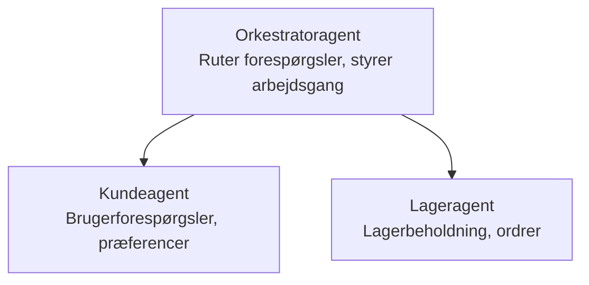

# Chapter 5: Multi-Agent AI Solutions

**📚 Kursus**: [AZD for begyndere](../../README.md) | **⏱️ Varighed**: 2-3 hours | **⭐ Kompleksitet**: Advanced

---

## Oversigt

This chapter covers advanced multi-agent architecture patterns, agent orchestration, and production-ready AI deployments for complex scenarios.

> Valideret mod `azd 1.23.12` i marts 2026.

## Læringsmål

By completing this chapter, you will:
- Forstå multi-agent arkitekturmønstre
- Udrulle koordinerede AI-agent systemer
- Implementere agent-til-agent kommunikation
- Bygge produktionsklare multi-agent løsninger

---

## 📚 Lektioner

| # | Lektion | Beskrivelse | Tid |
|---|--------|-------------|------|
| 1 | [Multi-agent-løsning til detailhandel](../../examples/retail-scenario.md) | Fuld implementeringsgennemgang | 90 min |
| 2 | [Koordinationsmønstre](../chapter-06-pre-deployment/coordination-patterns.md) | Strategier for agentorkestrering | 30 min |
| 3 | [ARM Template Deployment](../../examples/retail-multiagent-arm-template/README.md) | Én-klik-udrulning | 30 min |

---

## 🚀 Hurtig start

```bash
# Mulighed 1: Udrul fra en skabelon
azd init --template agent-openai-python-prompty
azd up

# Mulighed 2: Udrul fra et agentmanifest (kræver azure.ai.agents-udvidelse)
azd extension install azure.ai.agents
azd ai agent init -m agent-manifest.yaml
azd up
```

> **Hvilken tilgang?** Brug `azd init --template` for at starte fra et fungerende eksempel. Brug `azd ai agent init` når du har din egen agent-manifest. Se [AZD AI CLI reference](../chapter-08-production/production-ai-practices.md#azd-ai-cli-commands-and-extensions) for fulde detaljer.

---

## 🤖 Multi-agentarkitektur


---

## 🎯 Fremhævet løsning: Multi-agent til detailhandel

Løsningen [Multi-agent-løsning til detailhandel](../../examples/retail-scenario.md) demonstrerer:

- **Kundeagent**: Håndterer brugerinteraktioner og præferencer
- **Lageragent**: Styrer lager og ordrebehandling
- **Orkestrator**: Koordinerer mellem agenter
- **Delt hukommelse**: Håndtering af kontekst på tværs af agenter

### Brugte tjenester

| Tjeneste | Formål |
|---------|---------|
| Microsoft Foundry Models | Sprogforståelse |
| Azure AI Search | Produktkatalog |
| Cosmos DB | Agenttilstand og hukommelse |
| Container Apps | Hosting af agenter |
| Application Insights | Overvågning |

---

## 🔗 Navigation

| Retning | Kapitel |
|-----------|---------|
| **Forrige** | [Kapitel 4: Infrastruktur](../chapter-04-infrastructure/README.md) |
| **Næste** | [Kapitel 6: Forud-implementering](../chapter-06-pre-deployment/README.md) |

---

## 📖 Relaterede ressourcer

- [Guide til AI-agenter](../chapter-02-ai-development/agents.md)
- [Produktionspraksis for AI](../chapter-08-production/production-ai-practices.md)
- [AI-fejlfinding](../chapter-07-troubleshooting/ai-troubleshooting.md)

---

<!-- CO-OP TRANSLATOR DISCLAIMER START -->
**Ansvarsfraskrivelse**:
Dette dokument er blevet oversat ved hjælp af AI-oversættelsestjenesten [Co-op Translator](https://github.com/Azure/co-op-translator). Selvom vi bestræber os på nøjagtighed, bedes du være opmærksom på, at automatiske oversættelser kan indeholde fejl eller unøjagtigheder. Det oprindelige dokument på originalsproget bør betragtes som den autoritative kilde. For kritisk information anbefales en professionel, menneskelig oversættelse. Vi er ikke ansvarlige for eventuelle misforståelser eller fejltolkninger, der opstår som følge af brugen af denne oversættelse.
<!-- CO-OP TRANSLATOR DISCLAIMER END -->