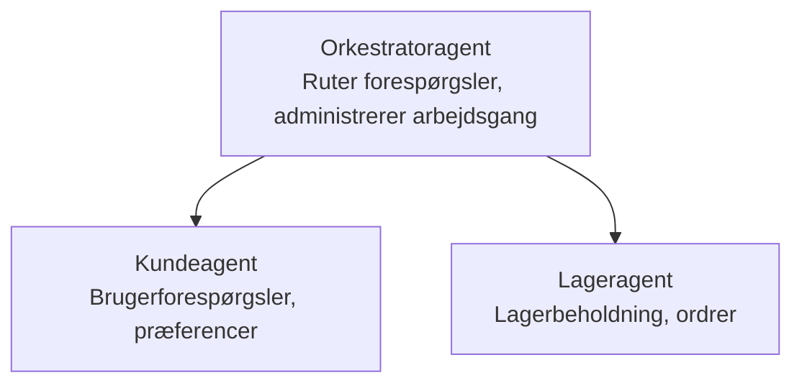

# Kapitel 5: Multi-agent AI-løsninger

**📚 Kursus**: [AZD for begyndere](../../README.md) | **⏱️ Varighed**: 2-3 timer | **⭐ Kompleksitet**: Avanceret

---

## Oversigt

Dette kapitel dækker avancerede multi-agent arkitekturmønstre, agentorkestrering og produktionsklare AI-implementeringer til komplekse scenarier.

> Valideret mod `azd 1.25.6` i juni 2026.

## Læringsmål

Ved at gennemføre dette kapitel vil du:
- Forstå multi-agent arkitekturmønstre
- Udrulle koordinerede AI-agent-systemer
- Implementere agent-til-agent kommunikation
- Opbygge produktionsklare multi-agent løsninger

---

## 📚 Lektioner

| # | Lektion | Beskrivelse | Tid |
|---|--------|-------------|------|
| 1 | [Multi-Agent Basics](multi-agent-basics.md) | Hands-on: udrul en fungerende multi-agent-app med `azd up` | 45 min |
| 2 | [Coordination Patterns](../chapter-06-pre-deployment/coordination-patterns.md) | Strategier for agentorkestrering (fortsætter i Kapitel 6) | 30 min |
| 3 | [ARM Template Deployment](../../examples/retail-multiagent-arm-template/README.md) | Eksempel på ét-klik-udrulning | 30 min |

> **Start med Lektion 1.** Det er den eneste fuldt praktiske, udrulningsklare lektion i dette kapitel. Lektion 2 findes i Kapitel 6 (den deles med forudrulningsplanlægning), og [Retail Multi-Agent Solution](../../examples/retail-scenario.md) er et arkitekturblåtryk — en designreference, ikke en ét-kommando-skabelon.

---

## 🚀 Hurtig start

```bash
# Mulighed 1: Udrul fra en skabelon
azd init --template agent-openai-python-prompty
azd up

# Mulighed 2: Udrul fra et agentmanifest (kræver azure.ai.agents-udvidelse)
azd extension install azure.ai.agents
azd ai agent init -m agent-manifest.yaml
azd up
```

> **Hvilken tilgang?** Use `azd init --template` to start from a working sample. Use `azd ai agent init` when you have your own agent manifest. See the [AZD AI CLI reference](../chapter-08-production/production-ai-practices.md#azd-ai-cli-commands-and-extensions) for fuldstændige oplysninger.

---

## 🤖 Multi-agent arkitektur



---

## 🎯 Fremhævet løsning: Detailhandels Multi-Agent

The [Retail Multi-Agent Solution](../../examples/retail-scenario.md) demonstrerer:

- **Customer Agent**: Håndterer brugerinteraktioner og præferencer
- **Inventory Agent**: Administrerer lager og ordrebehandling
- **Orchestrator**: Koordinerer mellem agenter
- **Shared Memory**: Tvær-agent kontekststyring

### Anvendte tjenester

| Service | Formål |
|---------|---------|
| Microsoft Foundry Models | Sprogforståelse |
| Azure AI Search | Produktkatalog |
| Cosmos DB | Agenttilstand og hukommelse |
| Container Apps | Hosting af agenter |
| Application Insights | Overvågning |

---

## 🔗 Navigation

| Retning | Kapitel |
|-----------|---------|
| **Forrige** | [Kapitel 4: Infrastruktur](../chapter-04-infrastructure/README.md) |
| **Næste** | [Kapitel 6: Forudrulning](../chapter-06-pre-deployment/README.md) |

---

## 📖 Relaterede ressourcer

- [Guide til AI-agenter](../chapter-02-ai-development/agents.md)
- [Produktionspraksis for AI](../chapter-08-production/production-ai-practices.md)
- [AI-fejlfinding](../chapter-07-troubleshooting/ai-troubleshooting.md)

---

<!-- CO-OP TRANSLATOR DISCLAIMER START -->
**Ansvarsfraskrivelse**:
Dette dokument er blevet oversat ved hjælp af AI-oversættelsestjenesten [Co-op Translator](https://github.com/Azure/co-op-translator). Selvom vi bestræber os på nøjagtighed, skal du være opmærksom på, at automatiserede oversættelser kan indeholde fejl eller unøjagtigheder. Det originale dokument på dets oprindelige sprog bør betragtes som den autoritative kilde. For kritisk information anbefales professionel menneskelig oversættelse. Vi påtager os intet ansvar for misforståelser eller fejltolkninger, der opstår som følge af brugen af denne oversættelse.
<!-- CO-OP TRANSLATOR DISCLAIMER END -->