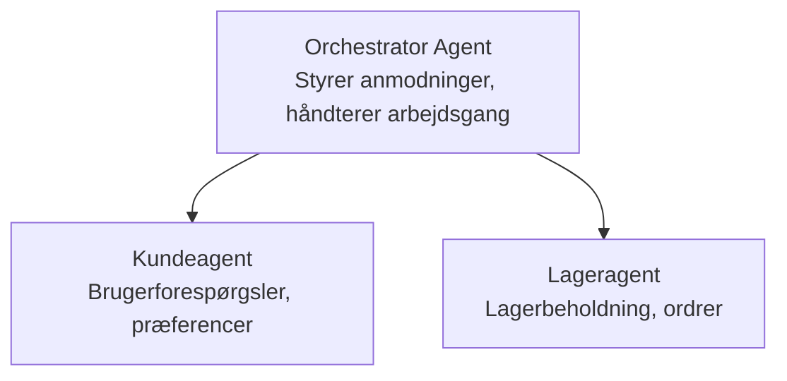

# Kapitel 5: Multi-Agent AI Løsninger

**📚 Kursus**: [AZD For Begyndere](../../README.md) | **⏱️ Varighed**: 2-3 timer | **⭐ Kompleksitet**: Avanceret

---

## Oversigt

Dette kapitel dækker avancerede multi-agent arkitektur mønstre, agent orkestrering og produktionsklare AI-implementeringer til komplekse scenarier.

> Valideret mod `azd 1.27.1` i juli 2026.

## Læringsmål

Ved at gennemføre dette kapitel vil du:
- Forstå multi-agent arkitektur mønstre
- Implementere koordinerede AI agent systemer
- Implementere agent-til-agent kommunikation
- Bygge produktionsklare multi-agent løsninger

---

## 📚 Lektioner

| # | Lektion | Beskrivelse | Tid |
|---|--------|-------------|------|
| 1 | [Multi-Agent Grundlæggende](multi-agent-basics.md) | Praktisk: implementer en fungerende multi-agent app med `azd up` | 45 min |
| 2 | [Koordinationsmønstre](../chapter-06-pre-deployment/coordination-patterns.md) | Agent orkestreringsstrategier (fortsætter i Kapitel 6) | 30 min |
| 3 | [ARM Skabelon Implementering](../../examples/retail-multiagent-arm-template/README.md) | Eksempel på implementering med ét klik | 30 min |

> **Start med Lektion 1.** Det er den eneste fuldt praktiske, deployerbare lektion i dette kapitel. Lektion 2 findes i Kapitel 6 (den deles med præ-implementeringsplanlægning), og [Retail Multi-Agent Løsningen](../../examples/retail-scenario.md) er en arkitektur blueprint—en design reference, ikke en ét-kommando skabelon.

---

## 🚀 Hurtig Start

```bash
# Mulighed 1: Udrul fra en skabelon
azd init --template agent-openai-python-prompty
azd up

# Mulighed 2: Udrul fra en agentmanifest (kræver azure.ai.agents-udvidelse)
azd extension install azure.ai.agents
azd ai agent init -m agent-manifest.yaml
azd up
```

> **Hvilken tilgang?** Brug `azd init --template` for at starte fra et fungerende eksempel. Brug `azd ai agent init` når du har dit eget agent manifest. Se [AZD AI CLI referencen](../chapter-08-production/production-ai-practices.md#azd-ai-cli-commands-and-extensions) for fulde detaljer.

---

## 🤖 Multi-Agent Arkitektur



---

## 🎯 Fremhævet Løsning: Retail Multi-Agent

[Retail Multi-Agent Løsningen](../../examples/retail-scenario.md) demonstrerer:

- **Kunde Agent**: Håndterer brugerinteraktioner og præferencer
- **Lager Agent**: Styrer lager og ordrebehandling
- **Orkestrator**: Koordinerer mellem agenter
- **Delt Hukommelse**: Kryds-agent kontekststyring

### Anvendte Tjenester

| Tjeneste | Formål |
|---------|---------|
| Microsoft Foundry Modeller | Sprogforståelse |
| Azure AI Search | Produktkatalog |
| Cosmos DB | Agent status og hukommelse |
| Container Apps | Agent hosting |
| Application Insights | Overvågning |

---

## 🔗 Navigation

| Retning | Kapitel |
|-----------|---------|
| **Forrige** | [Kapitel 4: Infrastruktur](../chapter-04-infrastructure/README.md) |
| **Næste** | [Kapitel 6: Præ-Implementering](../chapter-06-pre-deployment/README.md) |

---

## 📖 Relaterede Ressourcer

- [AI Agent Guide](../chapter-02-ai-development/agents.md)
- [Produktions AI Praksis](../chapter-08-production/production-ai-practices.md)
- [AI Fejlfinding](../chapter-07-troubleshooting/ai-troubleshooting.md)

---

<!-- CO-OP TRANSLATOR DISCLAIMER START -->
**Ansvarsfraskrivelse**:
Dette dokument er blevet oversat ved hjælp af AI-oversættelsestjenesten [Co-op Translator](https://github.com/Azure/co-op-translator). Selvom vi bestræber os på nøjagtighed, skal du være opmærksom på, at automatiserede oversættelser kan indeholde fejl eller unøjagtigheder. Det originale dokument på dets oprindelige sprog bør betragtes som den autoritative kilde. For kritisk information anbefales professionel menneskelig oversættelse. Vi påtager os intet ansvar for misforståelser eller fejltolkninger, der opstår som følge af brugen af denne oversættelse.
<!-- CO-OP TRANSLATOR DISCLAIMER END -->