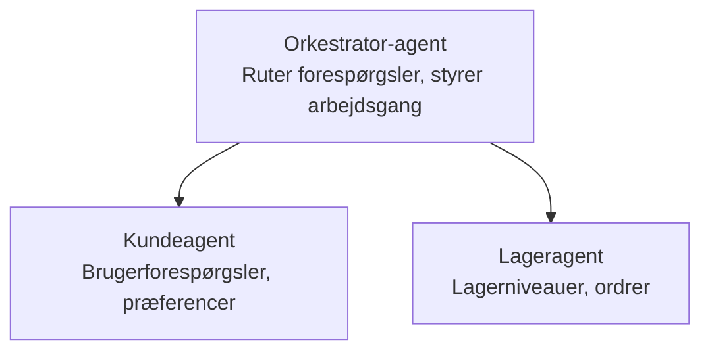

# Kapitel 5: Multi-Agent AI-løsninger

**📚 Kursus**: [AZD for begyndere](../../README.md) | **⏱️ Varighed**: 2-3 timer | **⭐ Kompleksitet**: Avanceret

---

## Oversigt

Dette kapitel dækker avancerede multi-agent arkitekturmønstre, agentorkestrering og produktionsklare AI-implementeringer til komplekse scenarier.

## Læringsmål

Efter at have gennemført dette kapitel vil du:
- Forstå multi-agent arkitekturmønstre
- Udrulle koordinerede AI-agent-systemer
- Implementere agent-til-agent kommunikation
- Bygge produktionsklare multi-agent-løsninger

---

## 📚 Lektioner

| # | Lektion | Beskrivelse | Tid |
|---|--------|-------------|------|
| 1 | [Retail Multi-Agent-løsning](../../examples/retail-scenario.md) | Fuld implementeringsgennemgang | 90 min |
| 2 | [Koordinationsmønstre](../chapter-06-pre-deployment/coordination-patterns.md) | Agentorkestreringsstrategier | 30 min |
| 3 | [ARM-skabelonimplementering](../../examples/retail-multiagent-arm-template/README.md) | Én-klik-udrulning | 30 min |

---

## 🚀 Hurtig start

```bash
# Mulighed 1: Udrul fra en skabelon
azd init --template agent-openai-python-prompty
azd up

# Mulighed 2: Udrul fra et agent-manifest (kræver azure.ai.agents-udvidelsen)
azd extension install azure.ai.agents
azd ai agent init -m agent-manifest.yaml
azd up
```

> **Hvilken tilgang?** Brug `azd init --template` for at starte fra et fungerende eksempel. Brug `azd ai agent init`, når du har dit eget agent-manifest. Se [AZD AI CLI-reference](../chapter-08-production/production-ai-practices.md#azd-ai-cli-commands-and-extensions) for fulde detaljer.

---

## 🤖 Multi-agent arkitektur


---

## 🎯 Fremhævet løsning: Retail Multi-Agent

Løsningen [Retail Multi-Agent-løsning](../../examples/retail-scenario.md) demonstrerer:

- **Kundeagent**: Håndterer brugerinteraktioner og præferencer
- **Lageragent**: Styrer lager og ordrebehandling
- **Orkestrator**: Koordinerer mellem agenterne
- **Delt hukommelse**: Håndtering af kontekst på tværs af agenter

### Benyttede tjenester

| Tjeneste | Formål |
|---------|---------|
| Microsoft Foundry Models | Sprogforståelse |
| Azure AI Search | Produktkatalog |
| Cosmos DB | Agenttilstand og hukommelse |
| Container Apps | Agent-hosting |
| Application Insights | Overvågning |

---

## 🔗 Navigation

| Retning | Kapitel |
|-----------|---------|
| **Forrige** | [Kapitel 4: Infrastruktur](../chapter-04-infrastructure/README.md) |
| **Næste** | [Kapitel 6: Forud-udrulning](../chapter-06-pre-deployment/README.md) |

---

## 📖 Relaterede ressourcer

- [Guide til AI-agenter](../chapter-02-ai-development/agents.md)
- [Produktions-AI-praksis](../chapter-08-production/production-ai-practices.md)
- [AI-fejlsøgning](../chapter-07-troubleshooting/ai-troubleshooting.md)

---

<!-- CO-OP TRANSLATOR DISCLAIMER START -->
**Disclaimer**:
Dette dokument er blevet oversat ved hjælp af AI-oversættelsestjenesten [Co-op Translator](https://github.com/Azure/co-op-translator). Selvom vi stræber efter nøjagtighed, bedes du være opmærksom på, at automatiske oversættelser kan indeholde fejl eller unøjagtigheder. Det oprindelige dokument på originalsproget bør betragtes som den autoritative kilde. For kritiske oplysninger anbefales en professionel menneskelig oversættelse. Vi er ikke ansvarlige for eventuelle misforståelser eller fejltolkninger, der måtte opstå som følge af brugen af denne oversættelse.
<!-- CO-OP TRANSLATOR DISCLAIMER END -->