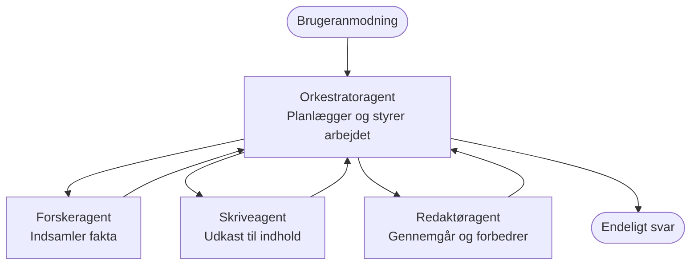

# Grundlæggende om Multi-Agent - Udrul dit første koordinerede AI-system

**Kapitelnavigation:**
- **📚 Kursus Forside**: [AZD For Beginners](../../README.md)
- **📖 Nuværende Kapitlet**: Kapitel 5 - Multi-Agent AI-løsninger
- **⬅️ Forrige**: [Kapitel 4: Infrastruktur](../chapter-04-infrastructure/README.md)
- **➡️ Næste**: [Koordineringsmønstre](../chapter-06-pre-deployment/coordination-patterns.md)

> Valideret mod `azd 1.27.1` i juli 2026.

## Introduktion

I de tidligere kapitler implementerede du en enkelt applikation—og i Kapitel 2 implementerede du en enkelt AI-agent. Denne lektion tager det næste skridt: udrulning af et **multi-agent system**, hvor flere specialiserede agenter arbejder sammen om at løse et problem, som ingen enkelt agent kunne klare godt på egen hånd.

Den gode nyhed for begyndere: **du behøver ikke nye kommandoer.** En multi-agent løsning er stadig et azd-projekt. Du vil `azd init`, `azd up`, teste og `azd down`—præcis den workflow, du allerede kender. Det, der ændrer sig, er *formen* på appen indeni.

## Læringsmål

Ved slutningen af denne lektion vil du:
- Forstå, hvad "multi-agent" betyder, og hvornår det er værd den ekstra kompleksitet
- Genkende de almindelige roller i et multi-agent system (orkestrator + specialister)
- Udrulle en ægte, fungerende multi-agent skabelon med `azd up`
- Forstå de Azure-ressourcer, der understøtter en multi-agent app
- Vide, hvordan du verificerer, tilpasser og nedlægger løsningen sikkert

## Læringsudbytte

Efter at have gennemført denne lektion vil du kunne:
- Forklare forskellen mellem en enkelt agent og et multi-agent system
- Vælge mellem en enkelt agent med værktøjer og et ægte multi-agent design
- Udrulle og teste en multi-agent skabelon fra ende til anden med azd
- Identificere, hvor hver agent kører, og hvordan de kommunikerer
- Rydde op i alle ressourcer for at undgå løbende omkostninger

---

## Hvad er et Multi-Agent System?

En enkelt AI-agent er en model med et sæt instruktioner og (valgfrit) nogle værktøjer. Det fungerer godt til fokuserede opgaver. Men efterhånden som en opgave vokser—forskning, så skrivning, derefter redigering og faktatjek—gør en alt-i-en prompt agenten langsommere, mindre pålidelig, og sværere at fejlsøge.

Et **multi-agent system** deler arbejdet op i specialister, der hver udfører én opgave godt, koordineret af en orkestrator:



### De to roller du altid vil se

| Rolle | Opgave | Eksempel |
|------|---------|---------|
| **Orkestrator** | Beslutter *hvad der sker næste* og dirigerer arbejde mellem agenter | "Først research, så skriv, så rediger" |
| **Specialist** | Udfører en fokuseret opgave og returnerer et resultat | En "forsker" der kun indsamler fakta |

### Har du virkelig brug for flere agenter?

Start enkelt. Gå efter multi-agent **kun** hvis en af disse er sand:

- ✅ Opgaven har **tydelige faser**, som drager fordel af forskellige instruktioner (forskning vs. skrive vs. gennemgang)
- ✅ Du vil have specialister til at køre **parallelt** for at spare tid
- ✅ Forskellige trin kræver **forskellige værktøjer eller datakilder**
- ✅ Du har brug for, at hvert trin er **uafhængigt testbart og fejlfinderbart**

Hvis din opgave er et enkelt spørgsmål-og-svar eller et simpelt værktøjskald, er en **enkelt agent med værktøjer** (Kapitel 2) enklere, billigere og lettere at betjene.

> **Begynder-tips:** "Flere agenter" er ikke nødvendigvis "bedre." Hver agent tilføjer ventetid, omkostninger og et nyt element at overvåge. Tilføj agenter kun, når problemet tydeligt opdeles i dele.

---

## To måder at bygge multi-agent i Azure

| Tilgang | Hvad det er | Bedst til |
|----------|------------|----------|
| **Enkelt agent + værktøjer** | Én Foundry-agent, der kalder funktioner/værktøjer | Enkle workflows, at komme i gang |
| **Flere koordinerede agenter** | Flere agenter med en orkestrator | Tydelige faser, parallel arbejde, specialisering |

Denne lektion fokuserer på den anden tilgang ved hjælp af en **færdiglavet skabelon**, så du kan se et rigtigt multi-agent system køre, før du bygger dit eget.

---

## Praktisk: Udrul en fungerende Multi-Agent App

Vi vil udrulle **Contoso Creative Writer**, et officielt Azure-eksempel, der bruger flere agenter (forsker, forfatter, redaktør) koordineret til at producere en artikel. Det er en fantastisk første multi-agent app, da rollerne er lette at forstå.

### Trin 1: Initialiser skabelonen

```bash
# Opret en arbejdsmappe
mkdir creative-writer && cd creative-writer

# Initialiser fra den officielle multi-agent skabelon
azd init --template contoso-creative-writer
```

> Find flere multi-agent skabeloner når som helst i [Awesome AZD AI-galleriet](https://azure.github.io/awesome-azd/?tags=ai). Andre begynder-venlige muligheder inkluderer `get-started-with-ai-agents` og `azure-ai-travel-agents`.

### Trin 2: Autentificer

```bash
# Påkrævet for azd arbejdsgange
azd auth login
```

### Trin 3: Opret et miljø

```bash
azd env new dev
```

### Trin 4: Forhåndsvis, så udrul

```bash
# Se hvad der vil blive oprettet, før du bruger noget (anbefales)
azd provision --preview

# Provisioner infrastruktur og implementer alle agenter i ét trin
azd up
```

`azd up` vil bede om et abonnement og en region, derefter oprette Azure-ressourcerne og udrulle applikationen. AI-udrulninger kan tage længere tid end en simpel webapp—hvis du udruller større modeller, kan du forlænge udrulnings timeout:

```bash
azd deploy --timeout 1800
```

> **Bemærk om omkostninger og kapacitet:** Multi-agent apps udruller AI-modeller, der forbruger kvote og medfører omkostninger. Hvis `azd up` fejler på modelkvote, se [AI Fejlfinding](../chapter-07-troubleshooting/ai-troubleshooting.md) for region- og kvoteløsninger, og Kapitel 6 [Kapacitetsplanlægning](../chapter-06-pre-deployment/capacity-planning.md).

---

## Forstå, hvad du har udrullet

En typisk multi-agent app som denne opretter et sæt Azure-ressourcer, der direkte afspejler ansvarene i diagrammet ovenfor:

| Ressource | Hvorfor den er der |
|----------|------------------|
| **Microsoft Foundry / Modeller** | Host for de sprogmodeller, som hver agent bruger |
| **Azure AI Search** | Giver forsker-agenten forankret data at søge i |
| **Container Apps** (eller App Service) | Host for orkestrator og agent-kode |
| **Cosmos DB** (i nogle eksempler) | Gemmer delt tilstand/hukommelse, der deles mellem agenter |
| **Application Insights** | Sporer forespørgsler *på tværs af* agenter, så du kan fejlsøge flowet |

### Hvordan agenterne kommunikerer med hinanden

I de fleste azd multi-agent eksempler kører **orkestratoren i din applikationskode** (for eksempel ved brug af et framework som Semantic Kernel eller Microsoft Agent Framework). Orkestratoren kalder hver specialistagent efter tur, viderebringer resultaterne og samler det endelige svar. Agenterne deler kontekst via:

- **Funktion-/værktøjsopkald** — orkestratoren påkalder en specialist og får et resultat tilbage
- **Delt hukommelse** — en database (ofte Cosmos DB) indeholder tilstand, som begge agenter kan læse
- **Beskeder/begivenheder** — til løsere kobling kommunikerer agenter via en kø eller Service Bus

> **Hvorfor det er vigtigt for fejlsøgning:** fordi hvert trin er separat, viser Application Insights dig *hvilken* agent der var langsom eller fejlede. Det er en hovedårsag til at opdele arbejde på tværs af agenter fra starten.

---

## Verificer udrulningen

Bekræft at systemet rent faktisk fungerer, før du går videre:

```bash
# Vis de implementerede endpoints
azd show

# Åbn appens overvågningsdashboard
azd monitor

# Følg logfilerne, hvis noget ser forkert ud
azd monitor --logs
```

Åbn derefter app-URL'en fra `azd show` og prøv en forespørgsel, som involverer alle agenterne (for Creative Writer, bed den skrive en kort artikel om et emne). I Application Insights **transaction search** skal du kunne se forespørgslen spredes ud over forsker-, forfatter- og redigeringstrinnene.

**Succes kriterier:**
- ✅ `azd show` viser en tilgængelig endpoint
- ✅ En forespørgsel producerer et resultat, der tydeligt gik gennem flere faser
- ✅ Application Insights viser spor for mere end ét agenttrin

---

## Tilpas: Tilføj eller juster en agent

Fordi hver agent blot er instruktioner plus værktøjer, er tilpasning overkommelig:

1. **Find agentdefinitionerne** i skabelonen (ofte et sæt filer `prompts/`, `agents/` eller `*.prompty`).
2. **Justér en agents instruktioner** — for eksempel, fortæl redaktør-agenten at håndhæve en bestemt tone eller ordantal.
3. **Udrul kun koden igen** (infrastrukturen ændres ikke):

   ```bash
   azd deploy
   ```

For at gå videre og bygge agenter fra dit *egen* manifest, brug agent-udvidelsen og dens fulde livscyklus:

```bash
azd extension install azure.ai.agents
azd ai agent init -m agent-manifest.yaml
azd up
azd ai agent invoke      # test, med svartid
```

Se [Kapitel 2: Agenter](../chapter-02-ai-development/agents.md) og [AZD AI CLI reference](../chapter-08-production/production-ai-practices.md#azd-ai-cli-commands-and-extensions) for den komplette agentlivscyklus (`invoke`, `eval generate`, `optimize`, `delete`).

---

## Ryd Op

Multi-agent apps kører flere fakturerbare tjenester. Nedlæg alt, når du er færdig:

```bash
azd down --force --purge
```

Flaget `--purge` fjerner også blødt slettede AI-ressourcer (som Foundry/Azure AI Services-konti), så de ikke blokerer for en fremtidig udrulning eller fortsætter med at påløbe omkostninger.

---

## En note om produktions multi-agent systemer

[Retail Multi-Agent Solution](../../examples/retail-scenario.md) i dette repo er en **arkitekturplan**, ikke en one-command skabelon—den dokumenterer, hvordan et produktionsdetailhandelsystem *ville* blive bygget (og det understreges, at en fuld implementering er en omfattende indsats). Brug den som designreference *efter* du har udrullet et fungerende eksempel her. For produktionshensyn (modstandsdygtighed, omkostninger, overvågning, styring) fortsæt til [Kapitel 8: Produktions AI-praksis](../chapter-08-production/production-ai-practices.md).

---

## Resumé

- Et multi-agent system deler arbejde på tværs af specialister koordineret af en orkestrator.
- Brug det kun, når opgaven har tydelige faser, parallelisme eller forskellige værktøjer pr. trin—ellers foretræk en enkelt agent.
- Azd workflowet er uændret: `azd init` → `azd up` → test → `azd down`.
- En rigtig skabelon som `contoso-creative-writer` lader dig se og tilpasse en fungerende multi-agent app i dag.
- Application Insights sporing på tværs af agenter er en af de største praktiske fordele ved multi-agent designet.

---

## 🔗 Navigation

| Retning | Lektion |
|-----------|--------|
| **Forrige** | [Kapitel 4: Infrastruktur](../chapter-04-infrastructure/README.md) |
| **Næste** | [Koordineringsmønstre](../chapter-06-pre-deployment/coordination-patterns.md) |

## 📖 Relaterede Ressourcer

- [AI Agent Guide](../chapter-02-ai-development/agents.md)
- [Koordineringsmønstre](../chapter-06-pre-deployment/coordination-patterns.md)
- [Produktions AI-praksis](../chapter-08-production/production-ai-practices.md)
- [AI fejlfinding](../chapter-07-troubleshooting/ai-troubleshooting.md)

---

<!-- CO-OP TRANSLATOR DISCLAIMER START -->
**Ansvarsfraskrivelse**:
Dette dokument er blevet oversat ved hjælp af AI-oversættelsestjenesten [Co-op Translator](https://github.com/Azure/co-op-translator). Selvom vi bestræber os på nøjagtighed, skal du være opmærksom på, at automatiserede oversættelser kan indeholde fejl eller unøjagtigheder. Det originale dokument på dets oprindelige sprog bør betragtes som den autoritative kilde. For kritisk information anbefales professionel menneskelig oversættelse. Vi påtager os intet ansvar for misforståelser eller fejltolkninger, der opstår som følge af brugen af denne oversættelse.
<!-- CO-OP TRANSLATOR DISCLAIMER END -->