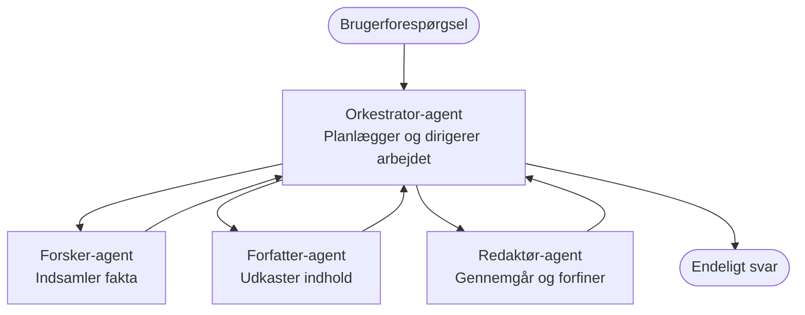

# Multi-agent grundlæggende - Udrul dit første koordinerede AI-system

**Kapitelnavigation:**
- **📚 Kursusforside**: [AZD for begyndere](../../README.md)
- **📖 Aktuelt kapitel**: Kapitel 5 - Multi-agent AI-løsninger
- **⬅️ Forrige**: [Kapitel 4: Infrastruktur](../chapter-04-infrastructure/README.md)
- **➡️ Næste**: [Koordinationsmønstre](../chapter-06-pre-deployment/coordination-patterns.md)

> Valideret mod `azd 1.25.6` i juni 2026.

## Introduktion

I de tidligere kapitler udrullede du en enkelt applikation—og i Kapitel 2 udrullede du en enkelt AI-agent. Denne lektion tager næste skridt: udrulning af et **multi-agent system**, hvor flere specialiserede agenter arbejder sammen for at løse et problem, som ingen enkelt agent ville håndtere særlig godt alene.

Den gode nyhed for begyndere: **du behøver ikke nye kommandoer.** En multi-agent løsning er stadig et azd-projekt. Du vil `azd init`, `azd up`, teste og `azd down`—præcis den workflow du allerede kender. Det, der ændrer sig, er *formen* af appen indeni.

## Læringsmål

Når du er færdig med denne lektion, vil du:
- Forstå hvad "multi-agent" betyder og hvornår det er værd at tage den ekstra kompleksitet
- Genkende de almindelige roller i et multi-agent system (orkestrator + specialister)
- Udrulle en rigtig, fungerende multi-agent skabelon med `azd up`
- Forstå de Azure-ressourcer, der understøtter en multi-agent app
- Vide hvordan du verificerer, tilpasser og rydder løsningen sikkert ned

## Læringsudbytte

Efter at have gennemført denne lektion vil du kunne:
- Forklare forskellen mellem en enkelt agent og et multi-agent system
- Vælge mellem en enkelt agent med værktøjer og et ægte multi-agent design
- Udrulle og teste en multi-agent skabelon end-to-end med azd
- Identificere hvor hver agent kører og hvordan de kommunikerer
- Rydde op i alle ressourcer for at undgå løbende omkostninger

---

## Hvad er et multi-agent system?

En enkelt AI-agent er én model med et sæt instruktioner og (valgfrit) nogle værktøjer. Det fungerer godt til fokuserede opgaver. Men efterhånden som en opgave vokser—research, så skrivning, så redigering, så faktatjek—bliver det at proppe alt ind i ét prompt med til at gøre agenten langsommere, mindre pålidelig og sværere at debugge.

Et **multi-agent system** deler arbejdet op i specialister, der hver gør én ting godt, koordineret af en orkestrator:



### De to roller, du altid vil se

| Rolle | Opgave | Eksempel |
|------|-----|---------|
| **Orchestrator** | Beslutter *hvad der sker næste* og dirigerer arbejdet mellem agenter | "Først research, så skriv, så redigér" |
| **Specialist** | Udfører én fokuseret opgave og returnerer et resultat | En "researcher", der kun indsamler fakta |

### Har du virkelig brug for flere agenter?

Start enkelt. Gå efter multi-agent **kun** når en af disse er sand:

- ✅ Opgaven har **forskellige faser**, der har gavn af forskellig instruktion (research vs. skriv vs. review)
- ✅ Du vil have specialister til at køre **parallelt** for at spare tid
- ✅ Forskellige trin har brug for **forskellige værktøjer eller datakilder**
- ✅ Du har brug for, at hvert trin er **uafhængigt testbart og debuggable**

Hvis din opgave er et enkelt spørgsmål-og-svar eller et enkelt værktøjskald, er en **enkelt agent med værktøjer** (Kapitel 2) enklere, billigere og lettere at drive.

> **Begynder-tip:** "Flere agenter" er ikke det samme som "bedre." Hver agent tilføjer ventetid, omkostninger og et nyt element at overvåge. Tilføj agenter kun når problemet klart kan deles op i dele.

---

## To måder til at bygge multi-agent-løsninger på Azure

| Tilgang | Hvad det er | Bedst til |
|----------|-----------|----------|
| **Single agent + tools** | En enkelt Foundry-agent, der kalder funktioner/værktøjer | Enkle workflows, komme i gang |
| **Multiple coordinated agents** | Flere agenter med en orkestrator | Forskellige faser, parallelt arbejde, specialisering |

Denne lektion fokuserer på den anden tilgang ved at bruge en **færdigskåret skabelon**, så du kan se et rigtigt multi-agent system køre, før du bygger dit eget.

---

## Praktisk: Udrul en fungerende multi-agent-app

Vi vil udrulle **Contoso Creative Writer**, et officielt Azure-eksempel, der bruger flere agenter (researcher, writer, editor) koordineret til at producere en artikel. Det er en fremragende første multi-agent-app, fordi rollerne er nemme at forstå.

### Trin 1: Initialiser templaten

```bash
# Opret en arbejdsmappe
mkdir creative-writer && cd creative-writer

# Initialiser fra den officielle multi-agent-skabelon
azd init --template contoso-creative-writer
```

> Gennemse flere multi-agent-skabeloner når som helst i [Awesome AZD AI-galleri](https://azure.github.io/awesome-azd/?tags=ai). Andre begynder-venlige muligheder inkluderer `get-started-with-ai-agents` og `azure-ai-travel-agents`.

### Trin 2: Autentificer

```bash
# Nødvendigt for azd-arbejdsgange
azd auth login
```

### Trin 3: Opret et miljø

```bash
azd env new dev
```

### Trin 4: Forhåndsvis, og udrul derefter

```bash
# Se hvad der vil blive oprettet, før du bruger noget (anbefales)
azd provision --preview

# Tilvejebring infrastrukturen og udrul alle agenter i ét trin
azd up
```

`azd up` vil bede om en abonnement og region, så provisionerer den Azure-ressourcerne og udruller applikationen. AI-udrulninger kan tage længere tid end en simpel webapp—hvis du udruller større modeller, kan du forlænge deploy-timeouten:

```bash
azd deploy --timeout 1800
```

> **Bemærk om omkostninger og kapacitet:** Multi-agent-apps udruller AI-modeller, der forbruger kvoter og medfører omkostninger. Hvis `azd up` fejler på modelkvote, se [AI-fejlfinding](../chapter-07-troubleshooting/ai-troubleshooting.md) for region- og kvotafix, og Kapitel 6 [Kapacitetsplanlægning](../chapter-06-pre-deployment/capacity-planning.md).

---

## Forstå, hvad du har udrullet

En typisk multi-agent-app som denne provisionerer et sæt Azure-ressourcer, der kortlægger direkte til ansvarene i diagrammet ovenfor:

| Ressource | Hvorfor den er der |
|----------|----------------|
| **Microsoft Foundry / Models** | Vært for sprogmodellerne, som hver agent bruger |
| **Azure AI Search** | Giver researcher-agenten forankrede data at søge i |
| **Container Apps** (or App Service) | Vært for orkestratoren og agentkoden |
| **Cosmos DB** (in some samples) | Gemmer delt state/hukommelse, som sendes mellem agenter |
| **Application Insights** | Sporer forespørgsler *på tværs af* agenter, så du kan debugge flowet |

### Hvordan agenterne taler sammen

I de fleste azd multi-agent-eksempler kører **orkestratoren i din applikationskode** (for eksempel ved brug af et framework som Semantic Kernel eller Microsoft Agent Framework). Orkestratoren kalder hver specialistagent efter tur, sender resultaterne videre og samler det endelige svar. Agenternes kontekst deles gennem:

- **Function/tool calls** — orkestratoren kalder en specialist og får et resultat tilbage
- **Shared memory** — en database (ofte Cosmos DB) holder state, som begge agenter kan læse
- **Messages/events** — for løsere kobling kommunikerer agenter via en queue eller Service Bus

> **Hvorfor det er vigtigt for fejlfinding:** fordi hvert trin er adskilt, viser Application Insights dig *hvilken* agent var langsom eller fejlede. Det er en væsentlig grund til at splitte arbejde på tværs af agenter.

---

## Bekræft udrulningen

Bekræft at systemet faktisk fungerer, før du går videre:

```bash
# Vis de udrullede endpoints
azd show

# Åbn appens overvågningsdashboard
azd monitor

# Følg logfilerne, hvis noget ser forkert ud
azd monitor --logs
```

Åbn derefter app-URL'en fra `azd show` og prøv en forespørgsel, der aktiverer alle agenterne (for Creative Writer, bed den skrive en kort artikel om et emne). I Application Insights' **transaction search** bør du se forespørgslen forgrene sig over researcher-, writer- og editor-trinene.

**Succes-kriterier:**
- ✅ `azd show` viser en tilgængelig endpoint
- ✅ En forespørgsel producerer et resultat, der tydeligt er gået igennem flere trin
- ✅ Application Insights viser traces for mere end ét agent-trin

---

## Tilpas: Tilføj eller juster en agent

Fordi hver agent blot er instruktioner plus værktøjer, er tilpasning håndterbar:

1. **Find agentdefinitionerne** i templaten (ofte et sæt filer som `prompts/`, `agents/` eller `*.prompty`).
2. **Finjustér en agents instruktioner** — fx bed editor-agenten håndhæve en bestemt tone eller ordantal.
3. **Udrul kun koden igen** (infrastrukturen er uændret):

   ```bash
   azd deploy
   ```

For at gå videre og bygge agenter ud fra dit *egne* manifest, brug agent-udvidelsen og dens fulde livscyklus:

```bash
azd extension install azure.ai.agents
azd ai agent init -m agent-manifest.yaml
azd up
azd ai agent invoke      # test, med responstid
```

Se [Kapitel 2: Agenter](../chapter-02-ai-development/agents.md) og [AZD AI CLI-reference](../chapter-08-production/production-ai-practices.md#azd-ai-cli-commands-and-extensions) for den komplette agent-livscyklus (`invoke`, `eval generate`, `optimize`, `delete`).

---

## Oprydning

Multi-agent-apps kører flere afregnede services. Ryd alt ned, når du er færdig:

```bash
azd down --force --purge
```

Flaget `--purge` fjerner også soft-slettede AI-ressourcer (som Foundry/Azure AI Services-konti), så de ikke blokerer en fremtidig genudrulning eller fortsætter med at påløbe omkostninger.

---

## En bemærkning om multi-agent systemer i produktion

The [Retail Multi-Agent Solution](../../examples/retail-scenario.md) i dette repo er et **arkitekturblåtryk**, ikke en ét-kommando-skabelon—det dokumenterer hvordan et produktions-retailsystem *ville* blive bygget (og gør klart, at en fuld bygning er en betydelig indsats). Brug det som en designreference *efter* du har udrullet et fungerende eksempel her. For produktionshensyn (resiliens, omkostninger, overvågning, governance), fortsæt til [Kapitel 8: AI i produktion - bedste praksis](../chapter-08-production/production-ai-practices.md).

---

## Resumé

- Et multi-agent system deler arbejdet mellem specialister koordineret af en orkestrator.
- Brug det kun når opgaven har forskellige faser, parallelisme eller forskellige værktøjer per trin—ellers foretræk en enkelt agent.
- azd-workflowet er uændret: `azd init` → `azd up` → test → `azd down`.
- En rigtig skabelon som `contoso-creative-writer` lader dig se og tilpasse en fungerende multi-agent-app i dag.
- Application Insights-tracing på tværs af agenter er en af de største praktiske fordele ved multi-agent-designet.

---

## 🔗 Navigation

| Retning | Lektion |
|-----------|--------|
| **Forrige** | [Kapitel 4: Infrastruktur](../chapter-04-infrastructure/README.md) |
| **Næste** | [Koordinationsmønstre](../chapter-06-pre-deployment/coordination-patterns.md) |

## 📖 Relaterede ressourcer

- [Guide til AI-agenter](../chapter-02-ai-development/agents.md)
- [Koordinationsmønstre](../chapter-06-pre-deployment/coordination-patterns.md)
- [AI i produktion - bedste praksis](../chapter-08-production/production-ai-practices.md)
- [AI-fejlfinding](../chapter-07-troubleshooting/ai-troubleshooting.md)

---

<!-- CO-OP TRANSLATOR DISCLAIMER START -->
**Ansvarsfraskrivelse**:
Dette dokument er blevet oversat ved hjælp af AI-oversættelsestjenesten [Co-op Translator](https://github.com/Azure/co-op-translator). Selvom vi bestræber os på nøjagtighed, skal du være opmærksom på, at automatiserede oversættelser kan indeholde fejl eller unøjagtigheder. Det originale dokument på dets oprindelige sprog bør betragtes som den autoritative kilde. For kritisk information anbefales professionel menneskelig oversættelse. Vi påtager os intet ansvar for misforståelser eller fejltolkninger, der opstår som følge af brugen af denne oversættelse.
<!-- CO-OP TRANSLATOR DISCLAIMER END -->