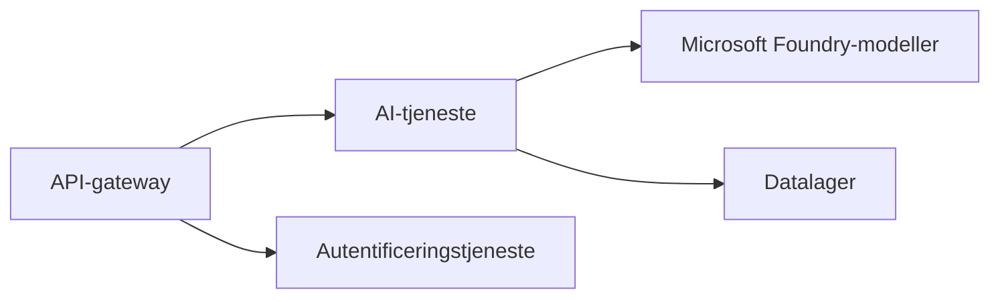

# Kapitel 8: Produktion & Enterprise-mønstre

**📚 Kursus**: [AZD for begyndere](../../README.md) | **⏱️ Varighed**: 2-3 timer | **⭐ Kompleksitet**: Avanceret

---

## Oversigt

Dette kapitel dækker enterprise-klar udrulningsmønstre, sikkerhedshærdning, overvågning og omkostningsoptimering for produktions-AI-workloads.

## Læringsmål

Ved at gennemføre dette kapitel vil du:
- Udrulle modstandsdygtige applikationer på tværs af flere regioner
- Implementere enterprise-sikkerhedsmønstre
- Konfigurere omfattende overvågning
- Optimere omkostninger i stor skala
- Opsætte CI/CD-pipelines med AZD

---

## 📚 Lektioner

| # | Lektion | Beskrivelse | Tid |
|---|--------|-------------|------|
| 1 | [Produktions-AI-praksis](production-ai-practices.md) | Enterprise-udrulningsmønstre | 90 min |

---

## 🚀 Produktionscheckliste

- [ ] Udrulning i flere regioner for modstandsdygtighed
- [ ] Administreret identitet til autentificering (ingen nøgler)
- [ ] Application Insights til overvågning
- [ ] Omkostningsbudgetter og advarsler konfigureret
- [ ] Sikkerhedsscanning aktiveret
- [ ] Integration af CI/CD-pipeline
- [ ] Katastrofegenopretningsplan

---

## 🏗️ Arkitekturmønstre

### Mønster 1: Microservices-AI


### Mønster 2: Event-drevet AI


---

## 🔐 Bedste sikkerhedspraksis

```bicep
// Use managed identity
identity: {
  type: 'SystemAssigned'
}

// Private endpoints for AI services
properties: {
  publicNetworkAccess: 'Disabled'
  networkAcls: {
    defaultAction: 'Deny'
  }
}
```

---

## 💰 Omkostningsoptimering

| Strategi | Besparelser |
|----------|---------|
| Skalér ned til nul (Container Apps) | 60-80% |
| Brug forbrugsniveauer til udvikling | 50-70% |
| Planlagt skalering | 30-50% |
| Reserveret kapacitet | 20-40% |

```bash
# Indstil budgetalarmer
az consumption budget create \
  --budget-name "AI-Budget" \
  --amount 500 \
  --category Cost \
  --time-grain Monthly
```

---

## 📊 Overvågningsopsætning

```bash
# Streaming af logfiler
azd monitor --logs

# Kontroller Application Insights
azd monitor

# Vis målinger
az monitor metrics list --resource <resource-id>
```

---

## 🔗 Navigation

| Retning | Kapitel |
|-----------|---------|
| **Forrige** | [Kapitel 7: Fejlfinding](../chapter-07-troubleshooting/README.md) |
| **Kursus fuldført** | [Kursusforside](../../README.md) |

---

## 📖 Relaterede ressourcer

- [Guide til AI-agenter](../chapter-02-ai-development/agents.md)
- [Application Insights](../chapter-06-pre-deployment/application-insights.md)
- [Løsninger med flere agenter](../chapter-05-multi-agent/README.md)
- [Microservices-eksempel](../../examples/microservices/README.md)

---

<!-- CO-OP TRANSLATOR DISCLAIMER START -->
**Disclaimer**:
Dette dokument er blevet oversat ved hjælp af AI-oversættelsestjenesten [Co-op Translator](https://github.com/Azure/co-op-translator). Selvom vi bestræber os på nøjagtighed, skal du være opmærksom på, at automatiske oversættelser kan indeholde fejl eller unøjagtigheder. Det oprindelige dokument på dets originalsprog bør betragtes som den autoritative kilde. For kritiske oplysninger anbefales professionel menneskelig oversættelse. Vi er ikke ansvarlige for eventuelle misforståelser eller fejltolkninger, der måtte opstå som følge af brugen af denne oversættelse.
<!-- CO-OP TRANSLATOR DISCLAIMER END -->