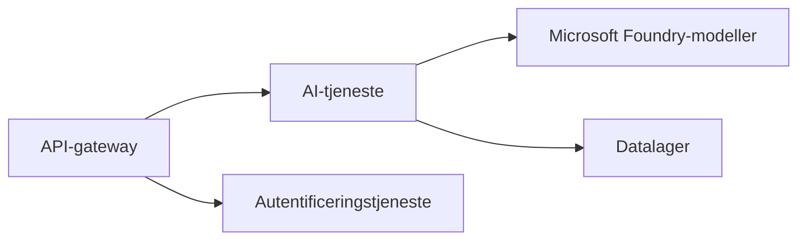

# Kapitel 8: Produktion & Virksomhedsmønstre

**📚 Kursus**: [AZD For Beginners](../../README.md) | **⏱️ Varighed**: 2-3 timer | **⭐ Kompleksitet**: Avanceret

---

## Oversigt

Dette kapitel dækker virksomhedsklare udrulningsmønstre, sikkerhedshærdning, overvågning og omkostningsoptimering for produktions-AI-arbejdsmængder.

> Valideret mod `azd 1.25.6` i juni 2026.

## Læringsmål

Ved at gennemføre dette kapitel vil du:
- Udrulle modstandsdygtige applikationer på tværs af flere regioner
- Implementere sikkerhedsmønstre for virksomheder
- Konfigurere omfattende overvågning
- Optimere omkostninger i stor skala
- Opsætte CI/CD-pipelines med AZD

---

## 📚 Lektioner

| # | Lektion | Beskrivelse | Tid |
|---|--------|-------------|------|
| 1 | [Produktions-AI-praksis](production-ai-practices.md) | Virksomhedsudrulningsmønstre | 90 min |

---

## 🚀 Produktionscheckliste

- [ ] Udrulning på tværs af flere regioner for robusthed
- [ ] Administreret identitet til autentificering (ingen nøgler)
- [ ] Application Insights til overvågning
- [ ] Omkostningsbudgetter og advarsler konfigureret
- [ ] Sikkerhedsscanning aktiveret
- [ ] Integration af CI/CD-pipeline
- [ ] Plan for genopretning efter katastrofe

---

## 🏗️ Arkitekturmønstre

### Mønster 1: Mikrotjenester AI



### Mønster 2: Event-drevet AI


---

## 🔐 Bedste sikkerhedspraksis

```bicep
// Use managed identity
identity: {
  type: 'SystemAssigned'
}

// Private endpoints for AI services
properties: {
  publicNetworkAccess: 'Disabled'
  networkAcls: {
    defaultAction: 'Deny'
  }
}
```

---

## 💰 Omkostningsoptimering

| Strategi | Besparelser |
|----------|---------|
| Skalér til nul (Container Apps) | 60-80% |
| Brug forbrugsniveauer til udvikling | 50-70% |
| Planlagt skalering | 30-50% |
| Reserveret kapacitet | 20-40% |

```bash
# Indstil budgetadvarsler
az consumption budget create \
  --budget-name "AI-Budget" \
  --amount 500 \
  --category Cost \
  --time-grain Monthly
```

---

## 📊 Overvågningsopsætning

```bash
# Stream logfiler
azd monitor --logs

# Kontroller Application Insights
azd monitor --overview

# Vis målinger
az monitor metrics list --resource <resource-id>
```

---

## 🔗 Navigation

| Retning | Kapitel |
|-----------|---------|
| **Forrige** | [Kapitel 7: Fejlfinding](../chapter-07-troubleshooting/README.md) |
| **Kursus fuldført** | [Kursusforside](../../README.md) |

---

## 📖 Relaterede ressourcer

- [Guide til AI-agenter](../chapter-02-ai-development/agents.md)
- [Application Insights](../chapter-06-pre-deployment/application-insights.md)
- [Multi-agentløsninger](../chapter-05-multi-agent/README.md)
- [Mikrotjenester-eksempel](../../examples/microservices/README.md)

---

<!-- CO-OP TRANSLATOR DISCLAIMER START -->
**Ansvarsfraskrivelse**:
Dette dokument er blevet oversat ved hjælp af AI-oversættelsestjenesten [Co-op Translator](https://github.com/Azure/co-op-translator). Selvom vi bestræber os på nøjagtighed, skal du være opmærksom på, at automatiserede oversættelser kan indeholde fejl eller unøjagtigheder. Det originale dokument på dets oprindelige sprog bør betragtes som den autoritative kilde. For kritisk information anbefales professionel menneskelig oversættelse. Vi påtager os intet ansvar for misforståelser eller fejltolkninger, der opstår som følge af brugen af denne oversættelse.
<!-- CO-OP TRANSLATOR DISCLAIMER END -->