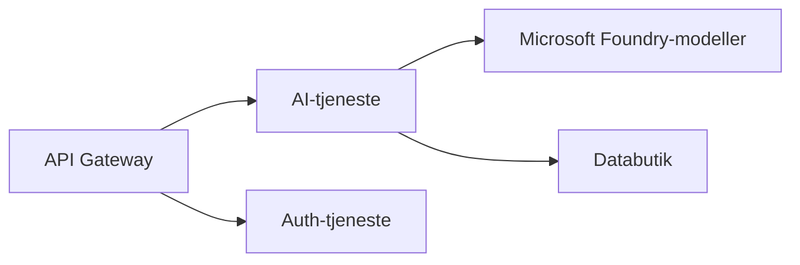

# Kapitel 8: Produktions- & Erhvervsmønstre

**📚 Kursus**: [AZD For Beginners](../../README.md) | **⏱️ Varighed**: 2-3 timer | **⭐ Kompleksitet**: Avanceret

---

## Oversigt

Dette kapitel omfatter produktionsklare udrulningsmønstre, sikkerhedsstyrkelse, overvågning og omkostningsoptimering for AI-opgaver i produktion.

> Valideret med `azd 1.27.1` i juli 2026.

## Læringsmål

Ved at gennemføre dette kapitel vil du:
- Udrulle multi-region robuste applikationer
- Implementere erhvervssikkerhedsmønstre
- Konfigurere omfattende overvågning
- Optimere omkostninger i stor skala
- Opsætte CI/CD pipelines med AZD

---

## 📚 Lektioner

| # | Lektion | Beskrivelse | Tid |
|---|--------|-------------|------|
| 1 | [Produktions-AI praksis](production-ai-practices.md) | Erhvervsudrulningsmønstre | 90 min |

---

## 🚀 Produktionscheckliste

- [ ] Multi-region udrulning for robusthed
- [ ] Administreret identitet til autentificering (ingen nøgler)
- [ ] Application Insights til overvågning
- [ ] Omkostningsbudgetter og alarmer konfigureret
- [ ] Sikkerhedsscanning aktiveret
- [ ] CI/CD pipeline integration
- [ ] Katastrofeberedskabsplan

---

## 🏗️ Arkitekturmønstre

### Mønster 1: Microservices AI



### Mønster 2: Event-Drevet AI


---

## 🔐 Bedste sikkerhedspraksis

```bicep
// Use managed identity
identity: {
  type: 'SystemAssigned'
}

// Private endpoints for AI services
properties: {
  publicNetworkAccess: 'Disabled'
  networkAcls: {
    defaultAction: 'Deny'
  }
}
```

---

## 💰 Omkostningsoptimering

| Strategi | Besparelser |
|----------|-------------|
| Skaler til nul (Container Apps) | 60-80% |
| Brug forbrugsniveauer til udvikling | 50-70% |
| Planlagt skalering | 30-50% |
| Reserveret kapacitet | 20-40% |

```bash
# Indstil budgetalarmer
az consumption budget create \
  --budget-name "AI-Budget" \
  --amount 500 \
  --category Cost \
  --time-grain Monthly
```

---

## 📊 Overvågningsopsætning

```bash
# Stream logs
azd monitor --logs

# Tjek Application Insights
azd monitor --overview

# Se målinger
az monitor metrics list --resource <resource-id>
```

---

## 🔗 Navigation

| Retning | Kapitel |
|-----------|---------|
| **Forrige** | [Kapitel 7: Fejlfinding](../chapter-07-troubleshooting/README.md) |
| **Kursus færdig** | [Kursus Forside](../../README.md) |

---

## 📖 Relaterede ressourcer

- [AI Agent Guide](../chapter-02-ai-development/agents.md)
- [Application Insights](../chapter-06-pre-deployment/application-insights.md)
- [Multi-Agent løsninger](../chapter-05-multi-agent/README.md)
- [Microservices eksempel](../../examples/microservices/README.md)

---

<!-- CO-OP TRANSLATOR DISCLAIMER START -->
**Ansvarsfraskrivelse**:
Dette dokument er blevet oversat ved hjælp af AI-oversættelsestjenesten [Co-op Translator](https://github.com/Azure/co-op-translator). Selvom vi bestræber os på nøjagtighed, skal du være opmærksom på, at automatiserede oversættelser kan indeholde fejl eller unøjagtigheder. Det originale dokument på dets oprindelige sprog bør betragtes som den autoritative kilde. For kritisk information anbefales professionel menneskelig oversættelse. Vi påtager os intet ansvar for misforståelser eller fejltolkninger, der opstår som følge af brugen af denne oversættelse.
<!-- CO-OP TRANSLATOR DISCLAIMER END -->