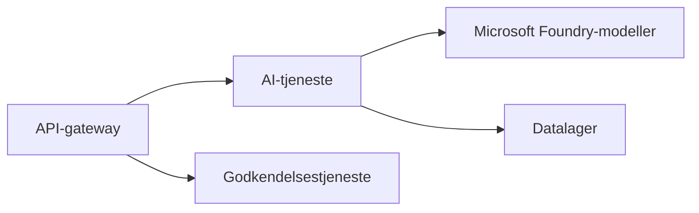

# Kapitel 8: Produktion & virksomhedsmønstre

**📚 Kursus**: [AZD for begyndere](../../README.md) | **⏱️ Varighed**: 2-3 hours | **⭐ Kompleksitet**: Avanceret

---

## Oversigt

Dette kapitel dækker virksomhedsklare udrulningsmønstre, sikkerhedshærdning, overvågning og omkostningsoptimering for produktions-AI-workloads.

> Valideret mod `azd 1.23.12` i marts 2026.

## Læringsmål

Ved at gennemføre dette kapitel vil du:
- Udrulle robuste applikationer i flere regioner
- Implementere sikkerhedsmønstre til virksomheder
- Konfigurere omfattende overvågning
- Optimere omkostninger i stor skala
- Opsætte CI/CD-pipelines med AZD

---

## 📚 Lektioner

| # | Lektion | Beskrivelse | Tid |
|---|--------|-------------|------|
| 1 | [Produktions-AI-praksis](production-ai-practices.md) | Udrulningsmønstre til virksomheder | 90 min |

---

## 🚀 Produktionscheckliste

- [ ] Udrulning i flere regioner for robusthed
- [ ] Administreret identitet til autentificering (ingen nøgler)
- [ ] Application Insights til overvågning
- [ ] Omkostningsbudgetter og alarmer konfigureret
- [ ] Sikkerhedsscanning aktiveret
- [ ] CI/CD-pipelineintegration
- [ ] Katastrofegendannelsesplan

---

## 🏗️ Arkitekturmønstre

### Mønster 1: Mikrotjenester-AI


### Mønster 2: Begivenhedsdrevet AI


---

## 🔐 Bedste sikkerhedspraksis

```bicep
// Use managed identity
identity: {
  type: 'SystemAssigned'
}

// Private endpoints for AI services
properties: {
  publicNetworkAccess: 'Disabled'
  networkAcls: {
    defaultAction: 'Deny'
  }
}
```

---

## 💰 Omkostningsoptimering

| Strategi | Besparelser |
|----------|-------------|
| Skaler til nul (Container Apps) | 60-80% |
| Brug forbrugsniveauer til udvikling | 50-70% |
| Planlagt skalering | 30-50% |
| Reserveret kapacitet | 20-40% |

```bash
# Indstil budgetalarmer
az consumption budget create \
  --budget-name "AI-Budget" \
  --amount 500 \
  --category Cost \
  --time-grain Monthly
```

---

## 📊 Overvågningsopsætning

```bash
# Streaming af logfiler
azd monitor --logs

# Tjek Application Insights
azd monitor --overview

# Vis metrikker
az monitor metrics list --resource <resource-id>
```

---

## 🔗 Navigation

| Retning | Kapitel |
|-----------|---------|
| **Forrige** | [Kapitel 7: Fejlfinding](../chapter-07-troubleshooting/README.md) |
| **Kursus fuldført** | [Kursusforside](../../README.md) |

---

## 📖 Relaterede ressourcer

- [Guide til AI-agenter](../chapter-02-ai-development/agents.md)
- [Application Insights](../chapter-06-pre-deployment/application-insights.md)
- [Multi-agent-løsninger](../chapter-05-multi-agent/README.md)
- [Mikrotjenester-eksempel](../../examples/microservices/README.md)

---

<!-- CO-OP TRANSLATOR DISCLAIMER START -->
**Ansvarsfraskrivelse**:
Dette dokument er blevet oversat ved hjælp af AI-oversættelsestjenesten [Co-op Translator](https://github.com/Azure/co-op-translator). Selvom vi bestræber os på nøjagtighed, skal du være opmærksom på, at automatiske oversættelser kan indeholde fejl eller unøjagtigheder. Det oprindelige dokument på originalsproget bør betragtes som den autoritative kilde. For kritisk information anbefales en professionel menneskelig oversættelse. Vi er ikke ansvarlige for misforståelser eller fejlfortolkninger, der måtte opstå som følge af brugen af denne oversættelse.
<!-- CO-OP TRANSLATOR DISCLAIMER END -->