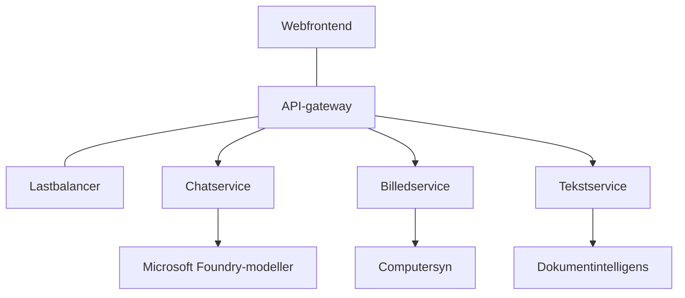

# Bedste praksis for produktions-AI-arbejdsbelastninger med AZD

**Kapitelnavigation:**
- **📚 Kursusforside**: [AZD for begyndere](../../README.md)
- **📖 Nuværende kapitel**: Kapitel 8 - Produktion & Enterprise-mønstre
- **⬅️ Forrige kapitel**: [Kapitel 7: Fejlfinding](../chapter-07-troubleshooting/debugging.md)
- **⬅️ Også relateret**: [AI Workshop-lab](ai-workshop-lab.md)
- **🎯 Kursus fuldført**: [AZD for begyndere](../../README.md)

## Oversigt

Denne vejledning giver omfattende bedste praksis til udrulning af produktionsklare AI-arbejdsbelastninger ved hjælp af Azure Developer CLI (AZD). Baseret på feedback fra Microsoft Foundry Discord-fællesskabet og virkelige kundedeplyeringer adresserer disse praksisser de mest almindelige udfordringer i produktions-AI-systemer.

## Vigtige udfordringer

Baseret på vores fællesskabsafstemning er dette de største udfordringer, udviklere står overfor:

- **45%** har problemer med multi-service AI-udrulninger
- **38%** har problemer med legitimations- og hemmelighedshåndtering  
- **35%** finder produktionsparathed og skalering vanskeligt
- **32%** har brug for bedre omkostningsoptimeringsstrategier
- **29%** kræver forbedret overvågning og fejlfinding

## Arkitekturmønstre for produktions-AI

### Mønster 1: Mikrotjenester AI-arkitektur

**Hvornår det skal bruges**: Komplekse AI-applikationer med flere funktioner


**AZD-implementering**:

```yaml
# azure.yaml
name: enterprise-ai-platform
services:
  web:
    project: ./web
    host: staticwebapp
  api-gateway:
    project: ./api-gateway
    host: containerapp
  chat-service:
    project: ./services/chat
    host: containerapp
  vision-service:
    project: ./services/vision
    host: containerapp
  text-service:
    project: ./services/text
    host: containerapp
```

### Mønster 2: Begivenhedsdrevet AI-behandling

**Hvornår det skal bruges**: Batchbehandling, dokumentanalyse, asynkrone arbejdsgange

```bicep
// Event Hub for AI processing pipeline
resource eventHub 'Microsoft.EventHub/namespaces@2023-01-01-preview' = {
  name: eventHubNamespaceName
  location: location
  sku: {
    name: 'Standard'
    tier: 'Standard'
    capacity: 1
  }
}

// Service Bus for reliable message processing
resource serviceBus 'Microsoft.ServiceBus/namespaces@2022-10-01-preview' = {
  name: serviceBusNamespaceName
  location: location
  sku: {
    name: 'Premium'
    tier: 'Premium'
    capacity: 1
  }
}

// Function App for processing
resource functionApp 'Microsoft.Web/sites@2023-01-01' = {
  name: functionAppName
  location: location
  kind: 'functionapp,linux'
  properties: {
    siteConfig: {
      appSettings: [
        {
          name: 'FUNCTIONS_EXTENSION_VERSION'
          value: '~4'
        }
        {
          name: 'AZURE_OPENAI_ENDPOINT'
          value: '@Microsoft.KeyVault(VaultName=${keyVault.name};SecretName=openai-endpoint)'
        }
      ]
    }
  }
}
```

## Overvej AI-agentens sundhed

Når en traditionel webapp bryder sammen, er symptomerne velkendte: en side indlæses ikke, et API returnerer en fejl, eller en udrulning fejler. AI-drevne applikationer kan gå i stykker på alle de samme måder—men de kan også opføre sig forkert på mere subtile måder, der ikke giver åbenlyse fejlmeddelelser.

Dette afsnit hjælper dig med at bygge en mental model for overvågning af AI-arbejdsbelastninger, så du ved, hvor du skal kigge, når tingene ikke virker som forventet.

### Hvordan agentens sundhed adskiller sig fra traditionel app-sundhed

En traditionel app virker enten eller den gør ikke. En AI-agent kan se ud til at virke, men levere dårlige resultater. Tænk på agentens sundhed i to lag:

| Lag | Hvad du skal overvåge | Hvor du skal kigge |
|-------|--------------|---------------|
| **Infrastrukturens sundhed** | Kører tjenesten? Er ressourcer provisioneret? Er endpoints tilgængelige? | `azd monitor`, Azure Portal resource health, container/app logs |
| **Adfærdssundhed** | Reagerer agenten nøjagtigt? Er svarene rettidige? Bliver modellen kaldt korrekt? | Application Insights traces, model call latency metrics, response quality logs |

Infrastrukturens sundhed er velkendt—det er det samme for enhver azd-app. Adfærdssundhed er det nye lag, som AI-arbejdsbelastninger introducerer.

### Hvor du skal kigge, når AI-apps ikke opfører sig som forventet

Hvis din AI-applikation ikke producerer de resultater, du forventer, er her en konceptuel tjekliste:

1. **Start med det grundlæggende.** Kører appen? Kan den nå sine afhængigheder? Tjek `azd monitor` og resource health, ligesom du ville for enhver app.
2. **Kontroller modelforbindelsen.** Kalder din applikation med succes AI-modellen? Mislykkede eller timeoutede modelkald er den mest almindelige årsag til problemer med AI-apps og vil fremgå af dine applikationslogs.
3. **Se på, hvad modellen modtog.** AI-svar afhænger af input (prompten og eventuel hentet kontekst). Hvis output er forkert, er input normalt forkert. Tjek, om din applikation sender de rigtige data til modellen.
4. **Gennemgå svartid.** AI-modelkald er langsommere end typiske API-kald. Hvis din app føles langsom, tjek om modelresponstiderne er steget—det kan indikere throttling, kapacitetsbegrænsninger eller regionsniveau-kongestion.
5. **Hold øje med omkostningssignaler.** Uventede stigninger i tokenforbrug eller API-kald kan indikere en løkke, en forkert konfigureret prompt eller overdreven retry-logik.

Du behøver ikke mestre observabilitetsværktøjer med det samme. Hovedkonklusionen er, at AI-applikationer har et ekstra adfærdslag at overvåge, og azd's indbyggede overvågning (`azd monitor`) giver dig et udgangspunkt for at undersøge begge lag.

---

## Sikkerheds bedste fremgangsmåder

### 1. Zero-Trust-sikkerhedsmodel

**Implementeringsstrategi**:
- Ingen service-til-service-kommunikation uden autentifikation
- Alle API-kald bruger administrerede identiteter
- Netværksisolation med private slutpunkter
- Adgangskontrol med mindst privilegium

```bicep
// Managed Identity for each service
resource chatServiceIdentity 'Microsoft.ManagedIdentity/userAssignedIdentities@2023-01-31' = {
  name: 'chat-service-identity'
  location: location
}

// Role assignments with minimal permissions
resource openAIUserRole 'Microsoft.Authorization/roleAssignments@2022-04-01' = {
  scope: openAIAccount
  name: guid(openAIAccount.id, chatServiceIdentity.id, openAIUserRoleDefinitionId)
  properties: {
    roleDefinitionId: subscriptionResourceId('Microsoft.Authorization/roleDefinitions', '5e0bd9bd-7b93-4f28-af87-19fc36ad61bd')
    principalId: chatServiceIdentity.properties.principalId
    principalType: 'ServicePrincipal'
  }
}
```

### 2. Sikker hemmelighedshåndtering

**Key Vault-integrationsmønster**:

```bicep
// Key Vault with proper access policies
resource keyVault 'Microsoft.KeyVault/vaults@2023-02-01' = {
  name: keyVaultName
  location: location
  properties: {
    tenantId: tenant().tenantId
    sku: {
      family: 'A'
      name: 'premium'  // Use premium for production
    }
    enableRbacAuthorization: true  // Use RBAC instead of access policies
    enablePurgeProtection: true    // Prevent accidental deletion
    enableSoftDelete: true
    softDeleteRetentionInDays: 90
  }
}

// Store all AI service credentials
resource openAIKeySecret 'Microsoft.KeyVault/vaults/secrets@2023-02-01' = {
  parent: keyVault
  name: 'openai-api-key'
  properties: {
    value: openAIAccount.listKeys().key1
    attributes: {
      enabled: true
    }
  }
}
```

### 3. Netværkssikkerhed

**Konfiguration af private endpoints**:

```bicep
// Virtual Network for AI services
resource virtualNetwork 'Microsoft.Network/virtualNetworks@2023-04-01' = {
  name: vnetName
  location: location
  properties: {
    addressSpace: {
      addressPrefixes: ['10.0.0.0/16']
    }
    subnets: [
      {
        name: 'ai-services-subnet'
        properties: {
          addressPrefix: '10.0.1.0/24'
          privateEndpointNetworkPolicies: 'Disabled'
        }
      }
      {
        name: 'app-services-subnet'
        properties: {
          addressPrefix: '10.0.2.0/24'
          delegations: [
            {
              name: 'Microsoft.Web/serverFarms'
              properties: {
                serviceName: 'Microsoft.Web/serverFarms'
              }
            }
          ]
        }
      }
    ]
  }
}

// Private endpoints for all AI services
resource openAIPrivateEndpoint 'Microsoft.Network/privateEndpoints@2023-04-01' = {
  name: '${openAIAccountName}-pe'
  location: location
  properties: {
    subnet: {
      id: virtualNetwork.properties.subnets[0].id
    }
    privateLinkServiceConnections: [
      {
        name: 'openai-connection'
        properties: {
          privateLinkServiceId: openAIAccount.id
          groupIds: ['account']
        }
      }
    ]
  }
}
```

## Ydeevne og skalering

### 1. Strategier for autoskalering

**Autoskalering af Container Apps**:

```bicep
resource containerApp 'Microsoft.App/containerApps@2023-05-01' = {
  name: containerAppName
  location: location
  properties: {
    configuration: {
      ingress: {
        external: true
        targetPort: 8000
        transport: 'http'
      }
    }
    template: {
      scale: {
        minReplicas: 2  // Always have 2 instances minimum
        maxReplicas: 50 // Scale up to 50 for high load
        rules: [
          {
            name: 'http-scaling'
            http: {
              metadata: {
                concurrentRequests: '20'  // Scale when >20 concurrent requests
              }
            }
          }
          {
            name: 'cpu-scaling'
            custom: {
              type: 'cpu'
              metadata: {
                type: 'Utilization'
                value: '70'  // Scale when CPU >70%
              }
            }
          }
        ]
      }
    }
  }
}
```

### 2. Cachingstrategier

**Redis-cache til AI-responser**:

```bicep
// Redis Premium for production workloads
resource redisCache 'Microsoft.Cache/redis@2023-04-01' = {
  name: redisCacheName
  location: location
  properties: {
    sku: {
      name: 'Premium'
      family: 'P'
      capacity: 1
    }
    enableNonSslPort: false
    minimumTlsVersion: '1.2'
    redisConfiguration: {
      'maxmemory-policy': 'allkeys-lru'
    }
    // Enable clustering for high availability
    redisVersion: '6.0'
    shardCount: 2
  }
}

// Cache configuration in application
var cacheConnectionString = '${redisCache.properties.hostName}:6380,password=${redisCache.listKeys().primaryKey},ssl=True,abortConnect=False'
```

### 3. Belastningsfordeling og trafikstyring

**Application Gateway med WAF**:

```bicep
// Application Gateway with Web Application Firewall
resource applicationGateway 'Microsoft.Network/applicationGateways@2023-04-01' = {
  name: appGatewayName
  location: location
  properties: {
    sku: {
      name: 'WAF_v2'
      tier: 'WAF_v2'
      capacity: 2
    }
    webApplicationFirewallConfiguration: {
      enabled: true
      firewallMode: 'Prevention'
      ruleSetType: 'OWASP'
      ruleSetVersion: '3.2'
    }
    // Backend pools for AI services
    backendAddressPools: [
      {
        name: 'ai-services-pool'
        properties: {
          backendAddresses: [
            {
              fqdn: '${containerApp.properties.configuration.ingress.fqdn}'
            }
          ]
        }
      }
    ]
  }
}
```

## 💰 Omkostningsoptimering

### 1. Korrekt dimensionering af ressourcer

**Miljøspecifikke konfigurationer**:

```bash
# Udviklingsmiljø
azd env new development
azd env set AZURE_OPENAI_SKU "S0"
azd env set AZURE_OPENAI_CAPACITY 10
azd env set AZURE_SEARCH_SKU "basic"
azd env set CONTAINER_CPU 0.5
azd env set CONTAINER_MEMORY 1.0

# Produktionsmiljø
azd env new production
azd env set AZURE_OPENAI_SKU "S0"
azd env set AZURE_OPENAI_CAPACITY 100
azd env set AZURE_SEARCH_SKU "standard"
azd env set CONTAINER_CPU 2.0
azd env set CONTAINER_MEMORY 4.0
```

### 2. Omkostningsovervågning og budgetter

```bicep
// Cost management and budgets
resource budget 'Microsoft.Consumption/budgets@2023-05-01' = {
  name: 'ai-workload-budget'
  properties: {
    timePeriod: {
      startDate: '2024-01-01'
      endDate: '2024-12-31'
    }
    timeGrain: 'Monthly'
    amount: 2000  // $2000 monthly budget
    category: 'Cost'
    notifications: {
      warning: {
        enabled: true
        operator: 'GreaterThan'
        threshold: 80
        contactEmails: [
          'finance@company.com'
          'engineering@company.com'
        ]
        contactRoles: [
          'Owner'
          'Contributor'
        ]
      }
      critical: {
        enabled: true
        operator: 'GreaterThan'
        threshold: 95
        contactEmails: [
          'cto@company.com'
        ]
      }
    }
  }
}
```

### 3. Optimering af tokenforbrug

**OpenAI Cost Management**:

```typescript
// Optimering af tokens på applikationsniveau
class TokenOptimizer {
  private readonly maxTokens = 4000;
  private readonly reserveTokens = 500;
  
  optimizePrompt(userInput: string, context: string): string {
    const availableTokens = this.maxTokens - this.reserveTokens;
    const estimatedTokens = this.estimateTokens(userInput + context);
    
    if (estimatedTokens > availableTokens) {
      // Forkort konteksten, ikke brugerinput
      context = this.truncateContext(context, availableTokens - this.estimateTokens(userInput));
    }
    
    return `${context}\n\nUser: ${userInput}`;
  }
  
  private estimateTokens(text: string): number {
    // Omtrentlig estimering: 1 token ≈ 4 tegn
    return Math.ceil(text.length / 4);
  }
}
```

## Overvågning og Observabilitet

### 1. Omfattende Application Insights

```bicep
// Application Insights with advanced features
resource applicationInsights 'Microsoft.Insights/components@2020-02-02' = {
  name: applicationInsightsName
  location: location
  kind: 'web'
  properties: {
    Application_Type: 'web'
    WorkspaceResourceId: logAnalyticsWorkspace.id
    SamplingPercentage: 100  // Full sampling for AI apps
    DisableIpMasking: false  // Enable for security
  }
}

// Custom metrics for AI operations
resource aiMetricAlerts 'Microsoft.Insights/metricAlerts@2018-03-01' = {
  name: 'ai-high-error-rate'
  location: 'global'
  properties: {
    description: 'Alert when AI service error rate is high'
    severity: 2
    enabled: true
    scopes: [
      applicationInsights.id
    ]
    evaluationFrequency: 'PT1M'
    windowSize: 'PT5M'
    criteria: {
      'odata.type': 'Microsoft.Azure.Monitor.SingleResourceMultipleMetricCriteria'
      allOf: [
        {
          name: 'high-error-rate'
          metricName: 'requests/failed'
          operator: 'GreaterThan'
          threshold: 10
          timeAggregation: 'Count'
        }
      ]
    }
  }
}
```

### 2. AI-specifik overvågning

**Tilpassede dashboards til AI-metrikker**:

```json
// Dashboard configuration for AI workloads
{
  "dashboard": {
    "name": "AI Application Monitoring",
    "tiles": [
      {
        "name": "OpenAI Request Volume",
        "query": "requests | where name contains 'openai' | summarize count() by bin(timestamp, 5m)"
      },
      {
        "name": "AI Response Latency",
        "query": "requests | where name contains 'openai' | summarize avg(duration) by bin(timestamp, 5m)"
      },
      {
        "name": "Token Usage",
        "query": "customMetrics | where name == 'openai_tokens_used' | summarize sum(value) by bin(timestamp, 1h)"
      },
      {
        "name": "Cost per Hour",
        "query": "customMetrics | where name == 'openai_cost' | summarize sum(value) by bin(timestamp, 1h)"
      }
    ]
  }
}
```

### 3. Sundhedstjek og oppetidsovervågning

```bicep
// Application Insights availability tests
resource availabilityTest 'Microsoft.Insights/webtests@2022-06-15' = {
  name: 'ai-app-availability-test'
  location: location
  tags: {
    'hidden-link:${applicationInsights.id}': 'Resource'
  }
  properties: {
    SyntheticMonitorId: 'ai-app-availability-test'
    Name: 'AI Application Availability Test'
    Description: 'Tests AI application endpoints'
    Enabled: true
    Frequency: 300  // 5 minutes
    Timeout: 120    // 2 minutes
    Kind: 'ping'
    Locations: [
      {
        Id: 'us-east-2-azr'
      }
      {
        Id: 'us-west-2-azr'
      }
    ]
    Configuration: {
      WebTest: '''
        <WebTest Name="AI Health Check" 
                 Id="8d2de8d2-a2b0-4c2e-9a0d-8f9c9a0b8c8d" 
                 Enabled="True" 
                 CssProjectStructure="" 
                 CssIteration="" 
                 Timeout="120" 
                 WorkItemIds="" 
                 xmlns="http://microsoft.com/schemas/VisualStudio/TeamTest/2010" 
                 Description="" 
                 CredentialUserName="" 
                 CredentialPassword="" 
                 PreAuthenticate="True" 
                 Proxy="default" 
                 StopOnError="False" 
                 RecordedResultFile="" 
                 ResultsLocale="">
          <Items>
            <Request Method="GET" 
                     Guid="a5f10126-e4cd-570d-961c-cea43999a200" 
                     Version="1.1" 
                     Url="${webApp.properties.defaultHostName}/health" 
                     ThinkTime="0" 
                     Timeout="120" 
                     ParseDependentRequests="True" 
                     FollowRedirects="True" 
                     RecordResult="True" 
                     Cache="False" 
                     ResponseTimeGoal="0" 
                     Encoding="utf-8" 
                     ExpectedHttpStatusCode="200" 
                     ExpectedResponseUrl="" 
                     ReportingName="" 
                     IgnoreHttpStatusCode="False" />
          </Items>
        </WebTest>
      '''
    }
  }
}
```

## Katastrofegendannelse og høj tilgængelighed

### 1. Udrulning i flere regioner

```yaml
# azure.yaml - Multi-region configuration
name: ai-app-multiregion
services:
  api-primary:
    project: ./api
    host: containerapp
    env:
      - AZURE_REGION=eastus
  api-secondary:
    project: ./api
    host: containerapp
    env:
      - AZURE_REGION=westus2
```

```bicep
// Traffic Manager for global load balancing
resource trafficManager 'Microsoft.Network/trafficManagerProfiles@2022-04-01' = {
  name: trafficManagerProfileName
  location: 'global'
  properties: {
    profileStatus: 'Enabled'
    trafficRoutingMethod: 'Priority'
    dnsConfig: {
      relativeName: trafficManagerProfileName
      ttl: 30
    }
    monitorConfig: {
      protocol: 'HTTPS'
      port: 443
      path: '/health'
      intervalInSeconds: 30
      toleratedNumberOfFailures: 3
      timeoutInSeconds: 10
    }
    endpoints: [
      {
        name: 'primary-endpoint'
        type: 'Microsoft.Network/trafficManagerProfiles/azureEndpoints'
        properties: {
          targetResourceId: primaryAppService.id
          endpointStatus: 'Enabled'
          priority: 1
        }
      }
      {
        name: 'secondary-endpoint'
        type: 'Microsoft.Network/trafficManagerProfiles/azureEndpoints'
        properties: {
          targetResourceId: secondaryAppService.id
          endpointStatus: 'Enabled'
          priority: 2
        }
      }
    ]
  }
}
```

### 2. Sikkerhedskopiering og gendannelse af data

```bicep
// Backup configuration for critical data
resource backupVault 'Microsoft.DataProtection/backupVaults@2023-05-01' = {
  name: backupVaultName
  location: location
  identity: {
    type: 'SystemAssigned'
  }
  properties: {
    storageSettings: [
      {
        datastoreType: 'VaultStore'
        type: 'LocallyRedundant'
      }
    ]
  }
}

// Backup policy for AI models and data
resource backupPolicy 'Microsoft.DataProtection/backupVaults/backupPolicies@2023-05-01' = {
  parent: backupVault
  name: 'ai-data-backup-policy'
  properties: {
    policyRules: [
      {
        backupParameters: {
          backupType: 'Full'
          objectType: 'AzureBackupParams'
        }
        trigger: {
          schedule: {
            repeatingTimeIntervals: [
              'R/2024-01-01T02:00:00+00:00/P1D'  // Daily at 2 AM
            ]
          }
          objectType: 'ScheduleBasedTriggerContext'
        }
        dataStore: {
          datastoreType: 'VaultStore'
          objectType: 'DataStoreInfoBase'
        }
        name: 'BackupDaily'
        objectType: 'AzureBackupRule'
      }
    ]
  }
}
```

## DevOps og CI/CD-integration

### 1. GitHub Actions-arbejdsgang

```yaml
# .github/workflows/deploy-ai-app.yml
name: Deploy AI Application

on:
  push:
    branches: [main]
  pull_request:
    branches: [main]

jobs:
  test:
    runs-on: ubuntu-latest
    steps:
      - uses: actions/checkout@v4
      
      - name: Setup Python
        uses: actions/setup-python@v4
        with:
          python-version: '3.11'
          
      - name: Install dependencies
        run: |
          pip install -r requirements.txt
          pip install pytest
          
      - name: Run tests
        run: pytest tests/
        
      - name: AI Safety Tests
        run: |
          python scripts/test_ai_safety.py
          python scripts/validate_prompts.py

  deploy-staging:
    needs: test
    if: github.event_name == 'pull_request'
    runs-on: ubuntu-latest
    steps:
      - uses: actions/checkout@v4
      
      - name: Setup AZD
        uses: Azure/setup-azd@v1.0.0
        
      - name: Login to Azure
        uses: azure/login@v1
        with:
          creds: ${{ secrets.AZURE_CREDENTIALS }}
          
      - name: Deploy to Staging
        run: |
          azd env select staging
          azd deploy

  deploy-production:
    needs: test
    if: github.ref == 'refs/heads/main'
    runs-on: ubuntu-latest
    steps:
      - uses: actions/checkout@v4
      
      - name: Setup AZD
        uses: Azure/setup-azd@v1.0.0
        
      - name: Login to Azure
        uses: azure/login@v1
        with:
          creds: ${{ secrets.AZURE_CREDENTIALS }}
          
      - name: Deploy to Production
        run: |
          azd env select production
          azd deploy
          
      - name: Run Production Health Checks
        run: |
          python scripts/health_check.py --env production
```

### 2. Infrastrukturvalidering

```bash
# scripts/validate_infrastructure.sh
#!/bin/bash

echo "Validating AI infrastructure deployment..."

# Kontroller, om alle nødvendige tjenester kører
services=("openai" "search" "storage" "keyvault")
for service in "${services[@]}"; do
    echo "Checking $service..."
    if ! az resource list --resource-type "Microsoft.CognitiveServices/accounts" --query "[?contains(name, '$service')]" -o tsv; then
        echo "ERROR: $service not found"
        exit 1
    fi
done

# Valider udrulninger af OpenAI-modeller
echo "Validating OpenAI model deployments..."
models=$(az cognitiveservices account deployment list --name $AZURE_OPENAI_NAME --resource-group $AZURE_RESOURCE_GROUP --query "[].name" -o tsv)
if [[ ! $models == *"gpt-35-turbo"* ]]; then
    echo "ERROR: Required model gpt-35-turbo not deployed"
    exit 1
fi

# Test forbindelsen til AI-tjenesten
echo "Testing AI service connectivity..."
python scripts/test_connectivity.py

echo "Infrastructure validation completed successfully!"
```

## Tjekliste for produktionsparathed

### Sikkerhed ✅
- [ ] Alle tjenester bruger administrerede identiteter
- [ ] Hemmeligheder gemt i Key Vault
- [ ] Private slutpunkter konfigureret
- [ ] Network security groups implementeret
- [ ] RBAC med mindst privilegium
- [ ] WAF aktiveret på offentlige endpoints

### Ydeevne ✅
- [ ] Autoskalering konfigureret
- [ ] Caching implementeret
- [ ] Belastningsfordeling opsat
- [ ] CDN til statisk indhold
- [ ] Databaseforbindelsespooling
- [ ] Optimering af tokenforbrug

### Overvågning ✅
- [ ] Application Insights konfigureret
- [ ] Tilpassede metrics defineret
- [ ] Alerting-regler opsat
- [ ] Dashboard oprettet
- [ ] Sundhedstjek implementeret
- [ ] Politik for logopbevaring

### Pålidelighed ✅
- [ ] Udrulning i flere regioner
- [ ] Backup- og gendannelsesplan
- [ ] Circuit breakers implementeret
- [ ] Retry-politikker konfigureret
- [ ] Graciøs degradering
- [ ] Sundhedstjek-endpoints

### Omkostningsstyring ✅
- [ ] Budgetalarmer konfigureret
- [ ] Korrekt dimensionering af ressourcer
- [ ] Dev/test-rabatter anvendt
- [ ] Reserved instances købt
- [ ] Omkostningsovervågningsdashboard
- [ ] Regelmæssige omkostningsgennemgange

### Overholdelse ✅
- [ ] Dataresidenskrav opfyldt
- [ ] Auditlogning aktiveret
- [ ] Overholdelsespolitikker anvendt
- [ ] Sikkerhedsbaseline implementeret
- [ ] Regelmæssige sikkerhedsvurderinger
- [ ] Incident response-plan

## Ydeevnebenchmarks

### Typiske produktionsmålinger

| Måling | Mål | Overvågning |
|--------|--------|------------|
| **Responstid** | < 2 sekunder | Application Insights |
| **Tilgængelighed** | 99.9% | Uptime monitoring |
| **Fejlrate** | < 0.1% | Applikationslogs |
| **Tokenforbrug** | < $500/month | Cost management |
| **Samtidige brugere** | 1000+ | Load testing |
| **Gendannelsestid** | < 1 time | Disaster recovery tests |

### Belastningstest

```bash
# Script til belastningstest af AI-applikationer
python scripts/load_test.py \
  --endpoint https://your-ai-app.azurewebsites.net \
  --concurrent-users 100 \
  --duration 300 \
  --ramp-up 60
```

## 🤝 Fællesskabets bedste praksis

Baseret på feedback fra Microsoft Foundry Discord-fællesskabet:

### Topanbefalinger fra fællesskabet:

1. **Start småt, skaler gradvist**: Begynd med grundlæggende SKUs og skaler op baseret på faktisk forbrug
2. **Overvåg alt**: Opsæt omfattende overvågning fra dag ét
3. **Automatiser sikkerhed**: Brug infrastructure as code for konsistent sikkerhed
4. **Test grundigt**: Inkluder AI-specifik test i din pipeline
5. **Planlæg for omkostninger**: Overvåg tokenforbrug og sæt budgetalarmer tidligt

### Almindelige faldgruber at undgå:

- ❌ Hardcoding af API-nøgler i koden
- ❌ Ikke at opsætte korrekt overvågning
- ❌ Ignorere omkostningsoptimering
- ❌ Ikke at teste fejlsituationer
- ❌ Udrulning uden sundhedstjek

## AZD AI-CLI-kommandoer og udvidelser

AZD inkluderer et voksende sæt AI-specifikke kommandoer og udvidelser, der strømliner produktions-AI-workflows. Disse værktøjer bygger bro mellem lokal udvikling og produktionsudrulning for AI-arbejdsbelastninger.

### AZD-udvidelser til AI

AZD bruger et udvidelsessystem til at tilføje AI-specifik funktionalitet. Installer og administrer udvidelser med:

```bash
# Vis alle tilgængelige udvidelser (inklusive AI)
azd extension list

# Installer Foundry Agents-udvidelsen
azd extension install azure.ai.agents

# Installer finjusteringsudvidelsen
azd extension install azure.ai.finetune

# Installer udvidelsen til brugerdefinerede modeller
azd extension install azure.ai.models

# Opgrader alle installerede udvidelser
azd extension upgrade --all
```

**Tilgængelige AI-udvidelser:**

| Udvidelse | Formål | Status |
|-----------|---------|--------|
| `azure.ai.agents` | Foundry Agent Service-administration | Forhåndsvisning |
| `azure.ai.finetune` | Fine-tuning af Foundry-modeller | Forhåndsvisning |
| `azure.ai.models` | Foundry-tilpassede modeller | Forhåndsvisning |
| `azure.coding-agent` | Konfiguration af coding-agent | Tilgængelig |

### Initialisering af agentprojekter med `azd ai agent init`

Kommandoen `azd ai agent init` scaffolder et produktionsklart AI-agentprojekt integreret med Microsoft Foundry Agent Service:

```bash
# Initialiser et nyt agentprojekt ud fra et agentmanifest
azd ai agent init -m <manifest-path-or-uri>

# Initialiser og målret mod et specifikt Foundry-projekt
azd ai agent init -m agent-manifest.yaml --project-id <foundry-project-id>

# Initialiser med en brugerdefineret kildemappe
azd ai agent init -m agent-manifest.yaml --src ./agents/my-agent

# Målret Container Apps som vært
azd ai agent init -m agent-manifest.yaml --host containerapp
```

**Vigtige flag:**

| Flag | Beskrivelse |
|------|-------------|
| `-m, --manifest` | Sti eller URI til et agentmanifest, der skal tilføjes til dit projekt |
| `-p, --project-id` | Eksisterende Microsoft Foundry Project ID for dit azd-miljø |
| `-s, --src` | Bibliotek til at downloade agentdefinitionen (standard er `src/<agent-id>`) |
| `--host` | Overskriv standardhosten (f.eks. `containerapp`) |
| `-e, --environment` | Det azd-miljø, der skal bruges |

**Produktions-tip**: Brug `--project-id` for at forbinde direkte til et eksisterende Foundry-projekt, så din agentkode og cloud-ressourcer er knyttet fra starten.

### Model Context Protocol (MCP) med `azd mcp`

AZD inkluderer indbygget MCP-serverunderstøttelse (Alpha), hvilket gør det muligt for AI-agenter og værktøjer at interagere med dine Azure-ressourcer gennem en standardiseret protokol:

```bash
# Start MCP-serveren for dit projekt
azd mcp start

# Administrer værktøjssamtykke til MCP-operationer
azd mcp consent
```

MCP-serveren eksponerer din azd-projektkontekst—miljøer, tjenester og Azure-ressourcer—for AI-drevne udviklingsværktøjer. Dette muliggør:

- **AI-assisteret udrulning**: Lad coding-agenter forespørge din projektstatus og udløse udrulninger
- **Ressourcediscovery**: AI-værktøjer kan opdage, hvilke Azure-ressourcer dit projekt bruger
- **Miljøstyring**: Agenter kan skifte mellem dev/staging/production-miljøer

### Infrastrukturgenerering med `azd infra generate`

For produktions-AI-arbejdsbelastninger kan du generere og tilpasse Infrastructure as Code i stedet for at stole på automatisk provisioning:

```bash
# Generer Bicep/Terraform-filer fra din projektdefinition
azd infra generate
```

Dette skriver IaC til disk, så du kan:
- Gennemgå og revidere infrastruktur før udrulning
- Tilføje brugerdefinerede sikkerhedspolitikker (netværksregler, private endpoints)
- Integrere med eksisterende IaC-gennemgangsprocesser
- Versionsstyre infrastrukturændringer separat fra applikationskoden

### Produktionslivscyklus-hooks

AZD-hooks lader dig injicere brugerdefineret logik på hvert trin i udrulningslivscyklussen—kritisk for produktions-AI-workflows:

```yaml
# azure.yaml - Production hooks example
name: ai-production-app
hooks:
  preprovision:
    shell: sh
    run: scripts/validate-quotas.sh    # Check AI model quota before provisioning
  postprovision:
    shell: sh
    run: scripts/configure-networking.sh  # Set up private endpoints
  predeploy:
    shell: sh
    run: scripts/run-ai-safety-tests.sh  # Run prompt safety checks
  postdeploy:
    shell: sh
    run: scripts/smoke-test.sh           # Verify agent responses post-deploy
services:
  agent-api:
    project: ./src/agent
    host: containerapp
    hooks:
      predeploy:
        shell: sh
        run: scripts/validate-model-access.sh  # Per-service hook
```

```bash
# Kør en specifik hook manuelt under udvikling
azd hooks run predeploy
```

**Anbefalede produktionshooks for AI-arbejdsbelastninger:**

| Hook | Anvendelsestilfælde |
|------|----------|
| `preprovision` | Validér abonnementskvoter for AI-modelkapacitet |
| `postprovision` | Konfigurer private endpoints, deploy model weights |
| `predeploy` | Kør AI-sikkerhedstests, validér promptskabeloner |
| `postdeploy` | Smoke-test agentresponser, verificér modelforbindelse |

### CI/CD-pipelinekonfiguration

Brug `azd pipeline config` til at forbinde dit projekt til GitHub Actions eller Azure Pipelines med sikker Azure-autentifikation:

```bash
# Konfigurer CI/CD-pipeline (interaktiv)
azd pipeline config

# Konfigurer med en specifik udbyder
azd pipeline config --provider github
```

Denne kommando:
- Opretter en serviceprincipal med mindst mulige rettigheder
- Konfigurerer federerede legitimationsoplysninger (ingen gemte hemmeligheder)
- Genererer eller opdaterer din pipeline-definitionsfil
- Sætter nødvendige miljøvariabler i dit CI/CD-system

**Produktionsarbejdsgang med pipelinekonfiguration:**

```bash
# 1. Opsæt produktionsmiljø
azd env new production
azd env set AZURE_OPENAI_CAPACITY 100

# 2. Konfigurer pipelinen
azd pipeline config --provider github

# 3. Pipelinen kører azd deploy ved hver push til main
```

### Tilføjelse af komponenter med `azd add`

Tilføj gradvist Azure-tjenester til et eksisterende projekt:

```bash
# Tilføj en ny servicekomponent interaktivt
azd add
```

Dette er særligt nyttigt til at udvide produktions-AI-applikationer—for eksempel at tilføje en vektorsøgningstjeneste, et nyt agent-endpoint eller en overvågningskomponent til en eksisterende udrulning.

## Yderligere ressourcer
- **Azure Well-Architected Framework**: [Vejledning til AI-arbejdsbelastninger](https://learn.microsoft.com/azure/well-architected/ai/)
- **Microsoft Foundry Documentation**: [Officielle dokumenter](https://learn.microsoft.com/azure/ai-studio/)
- **Community Templates**: [Azure-eksempler](https://github.com/Azure-Samples)
- **Discord Community**: [#Azure-kanal](https://discord.gg/microsoft-azure)
- **Agent Skills for Azure**: [microsoft/github-copilot-for-azure på skills.sh](https://skills.sh/microsoft/github-copilot-for-azure) - 37 åbne agentfærdigheder til Azure AI, Foundry, implementering, omkostningsoptimering og diagnosticering. Installer i din editor:
  ```bash
  npx skills add microsoft/github-copilot-for-azure
  ```

---

**Kapitelnavigation:**
- **📚 Kursusforside**: [AZD For Beginners](../../README.md)
- **📖 Current Chapter**: Kapitel 8 - Produktion & virksomhedsmønstre
- **⬅️ Forrige kapitel**: [Kapitel 7: Fejlfinding](../chapter-07-troubleshooting/debugging.md)
- **⬅️ Også relateret**: [AI Workshop Lab](ai-workshop-lab.md)
- **� Kursus fuldført**: [AZD For Beginners](../../README.md)

**Husk**: Produktions-AI-arbejdsbelastninger kræver omhyggelig planlægning, overvågning og løbende optimering. Start med disse mønstre og tilpas dem til dine specifikke krav.

---

<!-- CO-OP TRANSLATOR DISCLAIMER START -->
**Ansvarsfraskrivelse**:
Dette dokument er blevet oversat ved hjælp af AI-oversættelsestjenesten [Co-op Translator](https://github.com/Azure/co-op-translator). Selvom vi bestræber os på nøjagtighed, skal du være opmærksom på, at automatiske oversættelser kan indeholde fejl eller unøjagtigheder. Det oprindelige dokument på dets oprindelige sprog bør betragtes som den autoritative kilde. For kritisk information anbefales en professionel menneskelig oversættelse. Vi er ikke ansvarlige for eventuelle misforståelser eller fejltolkninger som følge af brugen af denne oversættelse.
<!-- CO-OP TRANSLATOR DISCLAIMER END -->