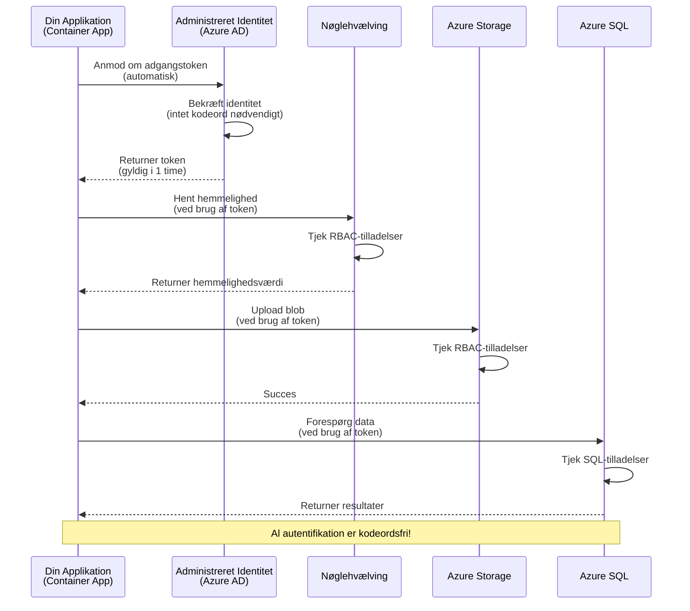
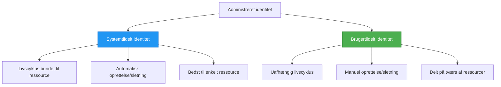

# Autentifikationsmønstre og Managed Identity

⏱️ **Estimeret tid**: 45-60 minutter | 💰 **Omkostningspåvirkning**: Gratis (ingen ekstra omkostninger) | ⭐ **Kompleksitet**: Mellem

**📚 Læringssti:**
- ← Forrige: [Konfigurationsstyring](configuration.md) - Håndtering af miljøvariabler og hemmeligheder
- 🎯 **Du er her**: Autentifikation & Sikkerhed (Managed Identity, Key Vault, sikre mønstre)
- → Næste: [Første projekt](first-project.md) - Byg din første AZD-applikation
- 🏠 [Kursusoversigt](../../README.md)

---

## Hvad du vil lære

Ved at gennemføre denne lektion vil du:
- Forstå Azure-autentifikationsmønstre (nøgler, forbindelsesstrenge, managed identity)
- Implementere **Managed Identity** for adgang uden adgangskoder
- Sikre hemmeligheder med **Azure Key Vault**-integration
- Konfigurere **rollebaseret adgangskontrol (RBAC)** for AZD-implementeringer
- Anvende sikkerhedsbedste praksis i Container Apps og Azure-tjenester
- Migrere fra nøglebaseret til identitetsbaseret autentifikation

## Hvorfor Managed Identity er vigtigt

### Problemet: Traditionel autentifikation

**Før Managed Identity:**
```javascript
// ❌ SIKKERHEDSRISIKO: Hardkodede hemmeligheder i kode
const connectionString = "Server=mydb.database.windows.net;User=admin;Password=P@ssw0rd123";
const storageKey = "xK7mN9pQ2wR5tY8uI0oP3aS6dF1gH4jK...";
const cosmosKey = "C2x7B9n4M1p8Q5w3E6r0T2y5U8i1O4p7...";
```

**Problemer:**
- 🔴 **Eksponerede hemmeligheder** i kode, konfigurationsfiler, miljøvariabler
- 🔴 **Credential rotation** kræver kodeændringer og genimplementering
- 🔴 **Audit-mareridt** - hvem har adgang til hvad, hvornår?
- 🔴 **Spredning** - hemmeligheder spredt over flere systemer
- 🔴 **Compliance-risici** - fejler sikkerhedsrevisioner

### Løsningen: Managed Identity

**Efter Managed Identity:**
```javascript
// ✅ SIKKER: Ingen hemmeligheder i koden
const credential = new DefaultAzureCredential();
const client = new BlobServiceClient(
  "https://mystorageaccount.blob.core.windows.net",
  credential  // Azure håndterer automatisk autentifikation
);
```

**Fordele:**
- ✅ **Ingen hemmeligheder** i kode eller konfiguration
- ✅ **Automatisk rotation** - Azure håndterer det
- ✅ **Fuld audit trail** i Azure AD-logfiler
- ✅ **Centraliseret sikkerhed** - administrer i Azure Portal
- ✅ **Compliance-klar** - opfylder sikkerhedsstandarder

**Analogi**: Traditionel autentifikation er som at bære flere fysiske nøgler til forskellige døre. Managed Identity er som at have et sikkerhedsbadge, der automatisk giver adgang baseret på, hvem du er—ingen nøgler at miste, kopiere eller rotere.

---

## Arkitekturoversigt

### Autentifikationsflow med Managed Identity


### Typer af Managed Identities


| Funktion | Systemtildelt | Brugertildelt |
|----------|---------------|---------------|
| **Livscyklus** | Bundet til ressource | Uafhængig |
| **Oprettelse** | Automatisk med ressource | Manuel oprettelse |
| **Sletning** | Slettet med ressource | Består efter ressourcens sletning |
| **Deling** | Kun én ressource | Flere ressourcer |
| **Brugsscenarie** | Enkle scenarier | Komplekse multi-resource scenarier |
| **AZD-standard** | ✅ Anbefalet | Valgfri |

---

## Forudsætninger

### Nødvendige værktøjer

Du bør allerede have disse installeret fra tidligere lektioner:

```bash
# Bekræft Azure Developer CLI
azd version
# ✅ Forventet: azd version 1.0.0 eller højere

# Bekræft Azure CLI
az --version
# ✅ Forventet: azure-cli 2.50.0 eller højere
```

### Azure-krav

- Aktiv Azure-abonnement
- Tilladelser til:
  - Oprette managed identities
  - Tildele RBAC-roller
  - Oprette Key Vault-ressourcer
  - Implementere Container Apps

### Vidensforudsætninger

Du bør have gennemført:
- [Installationsguide](installation.md) - AZD-opsætning
- [AZD-grundlæggende](azd-basics.md) - Kernekoncepter
- [Konfigurationsstyring](configuration.md) - Miljøvariabler

---

## Lektion 1: Forstå autentifikationsmønstre

### Mønster 1: Forbindelsesstrenge (Legacy - Undgå)

**Sådan fungerer det:**
```bash
# Forbindelsesstreng indeholder legitimationsoplysninger
STORAGE_CONNECTION_STRING="DefaultEndpointsProtocol=https;AccountName=myaccount;AccountKey=xK7mN9pQ2wR5..."
COSMOS_CONNECTION_STRING="AccountEndpoint=https://myaccount.documents.azure.com:443/;AccountKey=C2x7..."
SQL_CONNECTION_STRING="Server=myserver.database.windows.net;User=admin;Password=P@ssw0rd..."
```

**Problemer:**
- ❌ Hemmeligheder synlige i miljøvariabler
- ❌ Logget i implementeringssystemer
- ❌ Svært at rotere
- ❌ Ingen audit trail for adgang

**Hvornår skal det bruges:** Kun til lokal udvikling, aldrig produktion.

---

### Mønster 2: Key Vault-referencer (Bedre)

**Sådan fungerer det:**
```bicep
// Store secret in Key Vault
resource keyVault 'Microsoft.KeyVault/vaults@2023-02-01' = {
  name: 'mykv'
  properties: {
    enableRbacAuthorization: true
  }
}

// Reference in Container App
env: [
  {
    name: 'STORAGE_KEY'
    secretRef: 'storage-key'  // References Key Vault
  }
]
```

**Fordele:**
- ✅ Hemmeligheder opbevaret sikkert i Key Vault
- ✅ Centraliseret hemmelighedsstyring
- ✅ Rotation uden kodeændringer

**Begrænsninger:**
- ⚠️ Stadig brug af nøgler/adgangskoder
- ⚠️ Skal administrere Key Vault-adgang

**Hvornår skal det bruges:** Overgangstrin fra forbindelsesstrenge til managed identity.

---

### Mønster 3: Managed Identity (Bedste praksis)

**Sådan fungerer det:**
```bicep
// Enable managed identity
resource containerApp 'Microsoft.App/containerApps@2023-05-01' = {
  name: 'myapp'
  identity: {
    type: 'SystemAssigned'  // Automatically creates identity
  }
}

// Grant permissions
resource roleAssignment 'Microsoft.Authorization/roleAssignments@2022-04-01' = {
  scope: storageAccount
  properties: {
    roleDefinitionId: storageBlobDataContributorRole
    principalId: containerApp.identity.principalId
  }
}
```

**Applikationskode:**
```javascript
// Ingen hemmeligheder nødvendige!
const { DefaultAzureCredential } = require('@azure/identity');
const { BlobServiceClient } = require('@azure/storage-blob');

const credential = new DefaultAzureCredential();
const blobServiceClient = new BlobServiceClient(
  'https://mystorageaccount.blob.core.windows.net',
  credential
);
```

**Fordele:**
- ✅ Ingen hemmeligheder i kode/konfiguration
- ✅ Automatisk credential rotation
- ✅ Fuld audit trail
- ✅ RBAC-baserede tilladelser
- ✅ Compliance-klar

**Hvornår skal det bruges:** Altid, til produktionsapplikationer.

---

## Lektion 2: Implementering af Managed Identity med AZD

### Trin-for-trin implementering

Lad os bygge en sikker Container App, der bruger managed identity til at få adgang til Azure Storage og Key Vault.

### Projektstruktur

```
secure-app/
├── azure.yaml                 # AZD configuration
├── infra/
│   ├── main.bicep            # Main infrastructure
│   ├── core/
│   │   ├── identity.bicep    # Managed identity setup
│   │   ├── keyvault.bicep    # Key Vault configuration
│   │   └── storage.bicep     # Storage with RBAC
│   └── app/
│       └── container-app.bicep
└── src/
    ├── app.js                # Application code
    ├── package.json
    └── Dockerfile
```

### 1. Konfigurer AZD (azure.yaml)

```yaml
name: secure-app
metadata:
  template: secure-app@1.0.0

services:
  api:
    project: ./src
    language: js
    host: containerapp

# Enable managed identity (AZD handles this automatically)
```

### 2. Infrastruktur: Aktiver Managed Identity

**Fil: `infra/main.bicep`**

```bicep
targetScope = 'subscription'

param environmentName string
param location string = 'eastus'

var tags = { 'azd-env-name': environmentName }

// Resource group
resource rg 'Microsoft.Resources/resourceGroups@2021-04-01' = {
  name: 'rg-${environmentName}'
  location: location
  tags: tags
}

// Storage Account
module storage './core/storage.bicep' = {
  name: 'storage'
  scope: rg
  params: {
    name: 'st${uniqueString(rg.id)}'
    location: location
    tags: tags
  }
}

// Key Vault
module keyVault './core/keyvault.bicep' = {
  name: 'keyvault'
  scope: rg
  params: {
    name: 'kv-${uniqueString(rg.id)}'
    location: location
    tags: tags
  }
}

// Container App with Managed Identity
module containerApp './app/container-app.bicep' = {
  name: 'container-app'
  scope: rg
  params: {
    name: 'ca-${environmentName}'
    location: location
    tags: tags
    storageAccountName: storage.outputs.name
    keyVaultName: keyVault.outputs.name
  }
}

// Grant Container App access to Storage
module storageRoleAssignment './core/role-assignment.bicep' = {
  name: 'storage-role'
  scope: rg
  params: {
    principalId: containerApp.outputs.identityPrincipalId
    roleDefinitionId: 'ba92f5b4-2d11-453d-a403-e96b0029c9fe'  // Storage Blob Data Contributor
    targetResourceId: storage.outputs.id
  }
}

// Grant Container App access to Key Vault
module kvRoleAssignment './core/role-assignment.bicep' = {
  name: 'kv-role'
  scope: rg
  params: {
    principalId: containerApp.outputs.identityPrincipalId
    roleDefinitionId: '4633458b-17de-408a-b874-0445c86b69e6'  // Key Vault Secrets User
    targetResourceId: keyVault.outputs.id
  }
}

// Outputs
output AZURE_STORAGE_ACCOUNT_NAME string = storage.outputs.name
output AZURE_KEY_VAULT_NAME string = keyVault.outputs.name
output APP_URL string = containerApp.outputs.url
```

### 3. Container App med systemtildelt identitet

**Fil: `infra/app/container-app.bicep`**

```bicep
param name string
param location string
param tags object = {}
param storageAccountName string
param keyVaultName string

resource containerApp 'Microsoft.App/containerApps@2023-05-01' = {
  name: name
  location: location
  tags: tags
  identity: {
    type: 'SystemAssigned'  // 🔑 Enable managed identity
  }
  properties: {
    configuration: {
      ingress: {
        external: true
        targetPort: 3000
      }
    }
    template: {
      containers: [
        {
          name: 'api'
          image: 'myregistry.azurecr.io/api:latest'
          resources: {
            cpu: json('0.5')
            memory: '1Gi'
          }
          env: [
            {
              name: 'AZURE_STORAGE_ACCOUNT_NAME'
              value: storageAccountName
            }
            {
              name: 'AZURE_KEY_VAULT_NAME'
              value: keyVaultName
            }
            // 🔑 No secrets - managed identity handles authentication!
          ]
        }
      ]
    }
  }
}

// Output the identity for RBAC assignments
output identityPrincipalId string = containerApp.identity.principalId
output id string = containerApp.id
output url string = 'https://${containerApp.properties.configuration.ingress.fqdn}'
```

### 4. RBAC-rolle tildelingsmodul

**Fil: `infra/core/role-assignment.bicep`**

```bicep
param principalId string
param roleDefinitionId string  // Azure built-in role ID
param targetResourceId string

resource roleAssignment 'Microsoft.Authorization/roleAssignments@2022-04-01' = {
  name: guid(principalId, roleDefinitionId, targetResourceId)
  scope: resourceId('Microsoft.Resources/resourceGroups', resourceGroup().name)
  properties: {
    roleDefinitionId: subscriptionResourceId('Microsoft.Authorization/roleDefinitions', roleDefinitionId)
    principalId: principalId
    principalType: 'ServicePrincipal'
  }
}

output id string = roleAssignment.id
```

### 5. Applikationskode med Managed Identity

**Fil: `src/app.js`**

```javascript
const express = require('express');
const { DefaultAzureCredential } = require('@azure/identity');
const { BlobServiceClient } = require('@azure/storage-blob');
const { SecretClient } = require('@azure/keyvault-secrets');

const app = express();
const PORT = process.env.PORT || 3000;

// 🔑 Initialiser legitimationsoplysninger (fungerer automatisk med administreret identitet)
const credential = new DefaultAzureCredential();

// Azure Storage opsætning
const storageAccountName = process.env.AZURE_STORAGE_ACCOUNT_NAME;
const blobServiceClient = new BlobServiceClient(
  `https://${storageAccountName}.blob.core.windows.net`,
  credential  // Ingen nøgler nødvendige!
);

// Key Vault opsætning
const keyVaultName = process.env.AZURE_KEY_VAULT_NAME;
const secretClient = new SecretClient(
  `https://${keyVaultName}.vault.azure.net`,
  credential  // Ingen nøgler nødvendige!
);

// Sundhedstjek
app.get('/health', (req, res) => {
  res.json({ status: 'healthy', authentication: 'managed-identity' });
});

// Upload fil til blob-lager
app.post('/upload', async (req, res) => {
  try {
    const containerClient = blobServiceClient.getContainerClient('uploads');
    await containerClient.createIfNotExists();
    
    const blobName = `file-${Date.now()}.txt`;
    const blockBlobClient = containerClient.getBlockBlobClient(blobName);
    
    await blockBlobClient.upload('Hello from managed identity!', 30);
    
    res.json({
      success: true,
      blobName: blobName,
      message: 'File uploaded using managed identity!'
    });
  } catch (error) {
    console.error('Upload error:', error);
    res.status(500).json({ error: error.message });
  }
});

// Hent hemmelighed fra Key Vault
app.get('/secret/:name', async (req, res) => {
  try {
    const secretName = req.params.name;
    const secret = await secretClient.getSecret(secretName);
    
    res.json({
      name: secretName,
      value: secret.value,
      message: 'Secret retrieved using managed identity!'
    });
  } catch (error) {
    console.error('Secret error:', error);
    res.status(500).json({ error: error.message });
  }
});

// Liste blob-containere (demonstrerer læseadgang)
app.get('/containers', async (req, res) => {
  try {
    const containers = [];
    for await (const container of blobServiceClient.listContainers()) {
      containers.push(container.name);
    }
    
    res.json({
      containers: containers,
      count: containers.length,
      message: 'Containers listed using managed identity!'
    });
  } catch (error) {
    console.error('List error:', error);
    res.status(500).json({ error: error.message });
  }
});

app.listen(PORT, () => {
  console.log(`Secure API listening on port ${PORT}`);
  console.log('Authentication: Managed Identity (passwordless)');
});
```

**Fil: `src/package.json`**

```json
{
  "name": "secure-app",
  "version": "1.0.0",
  "dependencies": {
    "express": "^4.18.2",
    "@azure/identity": "^4.0.0",
    "@azure/storage-blob": "^12.17.0",
    "@azure/keyvault-secrets": "^4.7.0"
  },
  "scripts": {
    "start": "node app.js"
  }
}
```

### 6. Implementer og test

```bash
# Initialiser AZD-miljø
azd init

# Udrul infrastruktur og applikation
azd up

# Hent app-URL
APP_URL=$(azd env get-values | grep APP_URL | cut -d '=' -f2 | tr -d '"')

# Test sundhedstjek
curl $APP_URL/health
```

**✅ Forventet output:**
```json
{
  "status": "healthy",
  "authentication": "managed-identity"
}
```

**Test blob-upload:**
```bash
curl -X POST $APP_URL/upload
```

**✅ Forventet output:**
```json
{
  "success": true,
  "blobName": "file-1700404800000.txt",
  "message": "File uploaded using managed identity!"
}
```

**Test container-liste:**
```bash
curl $APP_URL/containers
```

**✅ Forventet output:**
```json
{
  "containers": ["uploads"],
  "count": 1,
  "message": "Containers listed using managed identity!"
}
```

---

## Almindelige Azure RBAC-roller

### Indbyggede rolle-ID'er for Managed Identity

| Tjeneste | Rollenavn | Rolle-ID | Tilladelser |
|----------|-----------|----------|-------------|
| **Storage** | Storage Blob Data Reader | `2a2b9908-6b94-4a3d-8e5a-a7d8f8cc8a12` | Læs blobs og containere |
| **Storage** | Storage Blob Data Contributor | `ba92f5b4-2d11-453d-a403-e96b0029c9fe` | Læs, skriv, slet blobs |
| **Storage** | Storage Queue Data Contributor | `974c5e8b-45b9-4653-ba55-5f855dd0fb88` | Læs, skriv, slet købeskeder |
| **Key Vault** | Key Vault Secrets User | `4633458b-17de-408a-b874-0445c86b69e6` | Læs hemmeligheder |
| **Key Vault** | Key Vault Secrets Officer | `b86a8fe4-44ce-4948-aee5-eccb2c155cd7` | Læs, skriv, slet hemmeligheder |
| **Cosmos DB** | Cosmos DB Built-in Data Reader | `00000000-0000-0000-0000-000000000001` | Læs Cosmos DB-data |
| **Cosmos DB** | Cosmos DB Built-in Data Contributor | `00000000-0000-0000-0000-000000000002` | Læs, skriv Cosmos DB-data |
| **SQL Database** | SQL DB Contributor | `9b7fa17d-e63e-47b0-bb0a-15c516ac86ec` | Administrer SQL-databaser |
| **Service Bus** | Azure Service Bus Data Owner | `090c5cfd-751d-490a-894a-3ce6f1109419` | Send, modtag, administrer beskeder |

### Sådan finder du rolle-ID'er

```bash
# Liste alle indbyggede roller
az role definition list --query "[].{Name:roleName, ID:name}" --output table

# Søg efter specifik rolle
az role definition list --query "[?contains(roleName, 'Storage Blob')].{Name:roleName, ID:name}" --output table

# Hent rolledetaljer
az role definition list --name "Storage Blob Data Contributor"
```

---

## Praktiske øvelser

### Øvelse 1: Aktiver Managed Identity for eksisterende app ⭐⭐ (Mellem)

**Mål**: Tilføj managed identity til en eksisterende Container App-implementering

**Scenarie**: Du har en Container App, der bruger forbindelsesstrenge. Konverter den til managed identity.

**Udgangspunkt**: Container App med denne konfiguration:

```bicep
// ❌ Current: Using connection string
env: [
  {
    name: 'STORAGE_CONNECTION_STRING'
    secretRef: 'storage-connection'
  }
]
```

**Trin**:

1. **Aktiver managed identity i Bicep:**

```bicep
resource containerApp 'Microsoft.App/containerApps@2023-05-01' = {
  name: 'myapp'
  identity: {
    type: 'SystemAssigned'  // Add this
  }
  // ... rest of configuration
}
```

2. **Tildel Storage-adgang:**

```bicep
// Get storage account reference
resource storageAccount 'Microsoft.Storage/storageAccounts@2023-01-01' existing = {
  name: storageAccountName
}

// Assign role
resource roleAssignment 'Microsoft.Authorization/roleAssignments@2022-04-01' = {
  name: guid(containerApp.id, 'ba92f5b4-2d11-453d-a403-e96b0029c9fe', storageAccount.id)
  scope: storageAccount
  properties: {
    roleDefinitionId: subscriptionResourceId('Microsoft.Authorization/roleDefinitions', 'ba92f5b4-2d11-453d-a403-e96b0029c9fe')
    principalId: containerApp.identity.principalId
    principalType: 'ServicePrincipal'
  }
}
```

3. **Opdater applikationskode:**

**Før (forbindelsesstreng):**
```javascript
const { BlobServiceClient } = require('@azure/storage-blob');

const blobServiceClient = BlobServiceClient.fromConnectionString(
  process.env.STORAGE_CONNECTION_STRING
);
```

**Efter (managed identity):**
```javascript
const { DefaultAzureCredential } = require('@azure/identity');
const { BlobServiceClient } = require('@azure/storage-blob');

const credential = new DefaultAzureCredential();
const blobServiceClient = new BlobServiceClient(
  `https://${process.env.STORAGE_ACCOUNT_NAME}.blob.core.windows.net`,
  credential
);
```

4. **Opdater miljøvariabler:**

```bicep
env: [
  {
    name: 'STORAGE_ACCOUNT_NAME'
    value: storageAccountName  // Just the name, no secrets!
  }
  // Remove STORAGE_CONNECTION_STRING
]
```

5. **Implementer og test:**

```bash
# Genudrul
azd up

# Test, at det stadig virker
curl https://myapp.azurecontainerapps.io/upload
```

**✅ Succeskriterier:**
- ✅ Applikationen implementeres uden fejl
- ✅ Storage-operationer fungerer (upload, liste, download)
- ✅ Ingen forbindelsesstrenge i miljøvariabler
- ✅ Identitet synlig i Azure Portal under "Identity"-bladet

**Verifikation:**

```bash
# Kontroller, at administreret identitet er aktiveret
az containerapp show \
  --name myapp \
  --resource-group rg-myapp \
  --query "identity.type"
# ✅ Forventet: "SystemAssigned"

# Kontroller rolle tildeling
az role assignment list \
  --assignee $(az containerapp show --name myapp --resource-group rg-myapp --query "identity.principalId" -o tsv) \
  --scope /subscriptions/{sub-id}/resourceGroups/rg-myapp/providers/Microsoft.Storage/storageAccounts/mystorageaccount
# ✅ Forventet: Viser rollen "Storage Blob Data Contributor"
```

**Tid**: 20-30 minutter

---

### Øvelse 2: Multi-service adgang med brugertildelt identitet ⭐⭐⭐ (Avanceret)

**Mål**: Opret en brugertildelt identitet, der deles mellem flere Container Apps

**Scenarie**: Du har 3 mikrotjenester, der alle skal have adgang til den samme Storage-konto og Key Vault.

**Trin**:

1. **Opret brugertildelt identitet:**

**Fil: `infra/core/identity.bicep`**

```bicep
param name string
param location string
param tags object = {}

resource userAssignedIdentity 'Microsoft.ManagedIdentity/userAssignedIdentities@2023-01-31' = {
  name: name
  location: location
  tags: tags
}

output id string = userAssignedIdentity.id
output principalId string = userAssignedIdentity.properties.principalId
output clientId string = userAssignedIdentity.properties.clientId
```

2. **Tildel roller til brugertildelt identitet:**

```bicep
// In main.bicep
module userIdentity './core/identity.bicep' = {
  name: 'user-identity'
  scope: rg
  params: {
    name: 'id-${environmentName}'
    location: location
    tags: tags
  }
}

// Grant Storage access
resource storageRoleAssignment 'Microsoft.Authorization/roleAssignments@2022-04-01' = {
  name: guid(userIdentity.outputs.principalId, 'storage-contributor')
  scope: storageAccount
  properties: {
    roleDefinitionId: subscriptionResourceId('Microsoft.Authorization/roleDefinitions', 'ba92f5b4-2d11-453d-a403-e96b0029c9fe')
    principalId: userIdentity.outputs.principalId
    principalType: 'ServicePrincipal'
  }
}

// Grant Key Vault access
resource kvRoleAssignment 'Microsoft.Authorization/roleAssignments@2022-04-01' = {
  name: guid(userIdentity.outputs.principalId, 'kv-secrets-user')
  scope: keyVault
  properties: {
    roleDefinitionId: subscriptionResourceId('Microsoft.Authorization/roleDefinitions', '4633458b-17de-408a-b874-0445c86b69e6')
    principalId: userIdentity.outputs.principalId
    principalType: 'ServicePrincipal'
  }
}
```

3. **Tildel identitet til flere Container Apps:**

```bicep
resource apiGateway 'Microsoft.App/containerApps@2023-05-01' = {
  name: 'api-gateway'
  identity: {
    type: 'UserAssigned'
    userAssignedIdentities: {
      '${userIdentity.outputs.id}': {}
    }
  }
  // ... rest of config
}

resource productService 'Microsoft.App/containerApps@2023-05-01' = {
  name: 'product-service'
  identity: {
    type: 'UserAssigned'
    userAssignedIdentities: {
      '${userIdentity.outputs.id}': {}
    }
  }
  // ... rest of config
}

resource orderService 'Microsoft.App/containerApps@2023-05-01' = {
  name: 'order-service'
  identity: {
    type: 'UserAssigned'
    userAssignedIdentities: {
      '${userIdentity.outputs.id}': {}
    }
  }
  // ... rest of config
}
```

4. **Applikationskode (alle tjenester bruger samme mønster):**

```javascript
const { DefaultAzureCredential, ManagedIdentityCredential } = require('@azure/identity');

// For bruger-tildelt identitet, angiv klient-ID
const credential = new ManagedIdentityCredential(
  process.env.AZURE_CLIENT_ID  // Klient-ID for bruger-tildelt identitet
);

// Eller brug DefaultAzureCredential (auto-detekterer)
const credential = new DefaultAzureCredential();

const blobServiceClient = new BlobServiceClient(
  `https://${process.env.STORAGE_ACCOUNT_NAME}.blob.core.windows.net`,
  credential
);
```

5. **Implementer og verificer:**

```bash
azd up

# Test alle tjenester kan få adgang til lager
curl https://api-gateway.azurecontainerapps.io/upload
curl https://product-service.azurecontainerapps.io/upload
curl https://order-service.azurecontainerapps.io/upload
```

**✅ Succeskriterier:**
- ✅ Én identitet delt mellem 3 tjenester
- ✅ Alle tjenester kan få adgang til Storage og Key Vault
- ✅ Identitet består, hvis du sletter én tjeneste
- ✅ Centraliseret tilladelsesstyring

**Fordele ved brugertildelt identitet:**
- Én identitet at administrere
- Konsistente tilladelser på tværs af tjenester
- Overlever tjenestesletning
- Bedre til komplekse arkitekturer

**Tid**: 30-40 minutter

---

### Øvelse 3: Implementer Key Vault hemmelighedsrotation ⭐⭐⭐ (Avanceret)

**Mål**: Opbevar tredjeparts API-nøgler i Key Vault og få adgang til dem ved hjælp af managed identity

**Scenarie**: Din app skal kalde en ekstern API (OpenAI, Stripe, SendGrid), der kræver API-nøgler.

**Trin**:

1. **Opret Key Vault med RBAC:**

**Fil: `infra/core/keyvault.bicep`**

```bicep
param name string
param location string
param tags object = {}

resource keyVault 'Microsoft.KeyVault/vaults@2023-02-01' = {
  name: name
  location: location
  tags: tags
  properties: {
    enableRbacAuthorization: true  // Use RBAC instead of access policies
    sku: {
      family: 'A'
      name: 'standard'
    }
    tenantId: subscription().tenantId
    enableSoftDelete: true
    softDeleteRetentionInDays: 90
  }
}

// Allow Container App to read secrets
output id string = keyVault.id
output name string = keyVault.name
output uri string = keyVault.properties.vaultUri
```

2. **Opbevar hemmeligheder i Key Vault:**

```bash
# Få Key Vault navn
KV_NAME=$(azd env get-values | grep AZURE_KEY_VAULT_NAME | cut -d '=' -f2 | tr -d '"')

# Gem tredjeparts API-nøgler
az keyvault secret set \
  --vault-name $KV_NAME \
  --name "OpenAI-ApiKey" \
  --value "sk-proj-xxxxxxxxxxxxx"

az keyvault secret set \
  --vault-name $KV_NAME \
  --name "Stripe-ApiKey" \
  --value "sk_live_xxxxxxxxxxxxx"

az keyvault secret set \
  --vault-name $KV_NAME \
  --name "SendGrid-ApiKey" \
  --value "SG.xxxxxxxxxxxxx"
```

3. **Applikationskode til at hente hemmeligheder:**

**Fil: `src/config.js`**

```javascript
const { DefaultAzureCredential } = require('@azure/identity');
const { SecretClient } = require('@azure/keyvault-secrets');

class Config {
  constructor() {
    this.credential = new DefaultAzureCredential();
    this.secretClient = new SecretClient(
      `https://${process.env.AZURE_KEY_VAULT_NAME}.vault.azure.net`,
      this.credential
    );
    this.cache = {};
  }

  async getSecret(secretName) {
    // Tjek cache først
    if (this.cache[secretName]) {
      return this.cache[secretName];
    }

    try {
      const secret = await this.secretClient.getSecret(secretName);
      this.cache[secretName] = secret.value;
      console.log(`✅ Retrieved secret: ${secretName}`);
      return secret.value;
    } catch (error) {
      console.error(`❌ Failed to get secret ${secretName}:`, error.message);
      throw error;
    }
  }

  async getOpenAIKey() {
    return this.getSecret('OpenAI-ApiKey');
  }

  async getStripeKey() {
    return this.getSecret('Stripe-ApiKey');
  }

  async getSendGridKey() {
    return this.getSecret('SendGrid-ApiKey');
  }
}

module.exports = new Config();
```

4. **Brug hemmeligheder i applikationen:**

**Fil: `src/app.js`**

```javascript
const express = require('express');
const config = require('./config');
const { OpenAI } = require('openai');

const app = express();

// Initialiser OpenAI med nøgle fra Key Vault
let openaiClient;

async function initializeServices() {
  const openaiKey = await config.getOpenAIKey();
  openaiClient = new OpenAI({ apiKey: openaiKey });
  console.log('✅ Services initialized with secrets from Key Vault');
}

// Kald ved opstart
initializeServices().catch(console.error);

app.post('/chat', async (req, res) => {
  try {
    const completion = await openaiClient.chat.completions.create({
      model: 'gpt-4',
      messages: [{ role: 'user', content: 'Hello!' }]
    });
    
    res.json({
      response: completion.choices[0].message.content,
      authentication: 'Key from Key Vault via Managed Identity'
    });
  } catch (error) {
    res.status(500).json({ error: error.message });
  }
});

app.listen(3000, () => {
  console.log('Secure API with Key Vault integration running');
});
```

5. **Implementer og test:**

```bash
azd up

# Test at API-nøgler fungerer
curl -X POST https://myapp.azurecontainerapps.io/chat \
  -H "Content-Type: application/json" \
  -d '{"message":"Hello AI"}'
```

**✅ Succeskriterier:**
- ✅ Ingen API-nøgler i kode eller miljøvariabler
- ✅ Applikationen henter nøgler fra Key Vault
- ✅ Tredjeparts-API'er fungerer korrekt
- ✅ Kan rotere nøgler uden kodeændringer

**Rotér en hemmelighed:**

```bash
# Opdater hemmelighed i Key Vault
az keyvault secret set \
  --vault-name $KV_NAME \
  --name "OpenAI-ApiKey" \
  --value "sk-proj-NEW_KEY_HERE"

# Genstart appen for at hente den nye nøgle
az containerapp revision restart \
  --name myapp \
  --resource-group rg-myapp
```

**Tid**: 25-35 minutter

---

## Videnscheckpoint

### 1. Autentifikationsmønstre ✓

Test din forståelse:

- [ ] **Q1**: Hvad er de tre hovedautentifikationsmønstre? 
  - **A**: Forbindelsesstrenge (legacy), Key Vault-referencer (overgang), Managed Identity (bedst)

- [ ] **Q2**: Hvorfor er managed identity bedre end forbindelsesstrenge?
  - **A**: Ingen hemmeligheder i kode, automatisk rotation, fuld audit trail, RBAC-tilladelser

- [ ] **Q3**: Hvornår ville du bruge brugertildelt identitet i stedet for systemtildelt?
  - **A**: Når identiteten deles mellem flere ressourcer eller når identitetens livscyklus er uafhængig af ressourcens livscyklus

**Hands-on verifikation:**
```bash
# Kontroller hvilken type identitet din app bruger
az containerapp show \
  --name myapp \
  --resource-group rg-myapp \
  --query "identity.type"

# List alle rolleopgaver for identiteten
az role assignment list \
  --assignee $(az containerapp show --name myapp --resource-group rg-myapp --query "identity.principalId" -o tsv)
```

---

### 2. RBAC og tilladelser ✓

Test din forståelse:

- [ ] **Q1**: Hvad er rolle-ID'et for "Storage Blob Data Contributor"?
  - **A**: `ba92f5b4-2d11-453d-a403-e96b0029c9fe`

- [ ] **Q2**: Hvilke tilladelser giver "Key Vault Secrets User"?
  - **A**: Læseadgang til hemmeligheder (kan ikke oprette, opdatere eller slette)

- [ ] **Q3**: Hvordan giver du en Container App adgang til Azure SQL?
  - **A**: Tildel "SQL DB Contributor"-rollen eller konfigurer Azure AD-autentifikation for SQL

**Hands-on verifikation:**
```bash
# Find specifik rolle
az role definition list --name "Storage Blob Data Contributor"

# Kontroller hvilke roller der er tildelt din identitet
PRINCIPAL_ID=$(az containerapp show --name myapp --resource-group rg-myapp --query "identity.principalId" -o tsv)
az role assignment list --assignee $PRINCIPAL_ID --output table
```

---

### 3. Key Vault-integration ✓

Test din forståelse:
- [ ] **Q1**: Hvordan aktiverer du RBAC for Key Vault i stedet for adgangspolitikker?
  - **A**: Sæt `enableRbacAuthorization: true` i Bicep

- [ ] **Q2**: Hvilket Azure SDK-bibliotek håndterer Managed Identity-godkendelse?
  - **A**: `@azure/identity` med klassen `DefaultAzureCredential`

- [ ] **Q3**: Hvor længe forbliver Key Vault-secrets i cache?
  - **A**: Afhænger af applikationen; implementér din egen caching-strategi

**Praktisk Verifikation:**
```bash
# Test adgang til Key Vault
az keyvault secret show \
  --vault-name $KV_NAME \
  --name "OpenAI-ApiKey" \
  --query "value"

# Kontroller, at RBAC er aktiveret
az keyvault show \
  --name $KV_NAME \
  --query "properties.enableRbacAuthorization"
# ✅ Forventet: sand
```

---

## Sikkerhedsbedste Praksis

### ✅ GØR:

1. **Brug altid Managed Identity i produktion**
   ```bicep
   identity: {
     type: 'SystemAssigned'
   }
   ```

2. **Brug mindst privilegerede RBAC-roller**
   - Brug "Reader"-roller, når det er muligt
   - Undgå "Owner" eller "Contributor", medmindre det er nødvendigt

3. **Gem tredjepartsnøgler i Key Vault**
   ```javascript
   const apiKey = await secretClient.getSecret('ThirdPartyApiKey');
   ```

4. **Aktivér audit-logning**
   ```bicep
   diagnosticSettings: {
     logs: [{ category: 'AuditEvent', enabled: true }]
   }
   ```

5. **Brug forskellige identiteter til dev/staging/prod**
   ```bash
   azd env new dev
   azd env new staging
   azd env new prod
   ```

6. **Rotér secrets regelmæssigt**
   - Sæt udløbsdatoer på Key Vault-secrets
   - Automatisér rotation med Azure Functions

### ❌ GØR IKKE:

1. **Hardkod aldrig secrets**
   ```javascript
   // ❌ DÅRLIG
   const apiKey = "sk-proj-xxxxxxxxxxxxx";
   ```

2. **Brug ikke forbindelsesstrenge i produktion**
   ```javascript
   // ❌ DÅRLIG
   BlobServiceClient.fromConnectionString(process.env.STORAGE_CONNECTION_STRING)
   ```

3. **Tildel ikke overdrevne tilladelser**
   ```bicep
   // ❌ BAD - too much access
   roleDefinitionId: 'Owner'
   
   // ✅ GOOD - least privilege
   roleDefinitionId: 'Storage Blob Data Reader'
   ```

4. **Log ikke secrets**
   ```javascript
   // ❌ DÅRLIGT
   console.log('API Key:', apiKey);
   
   // ✅ GODT
   console.log('API Key retrieved successfully');
   ```

5. **Del ikke produktionsidentiteter på tværs af miljøer**
   ```bicep
   // ❌ BAD - same identity for dev and prod
   // ✅ GOOD - separate identities per environment
   ```

---

## Fejlfinding

### Problem: "Unauthorized" ved adgang til Azure Storage

**Symptomer:**
```
Error: Unauthorized (403)
AuthorizationPermissionMismatch: This request is not authorized to perform this operation
```

**Diagnose:**

```bash
# Kontroller, om administreret identitet er aktiveret
az containerapp show \
  --name myapp \
  --resource-group rg-myapp \
  --query "identity.type"
# ✅ Forventet: "SystemAssigned" eller "UserAssigned"

# Kontroller rolle tildelinger
PRINCIPAL_ID=$(az containerapp show --name myapp --resource-group rg-myapp --query "identity.principalId" -o tsv)
az role assignment list --assignee $PRINCIPAL_ID

# Forventet: Skal se "Storage Blob Data Contributor" eller lignende rolle
```

**Løsninger:**

1. **Tildel korrekt RBAC-rolle:**
```bash
STORAGE_ID=$(az storage account show --name mystorageaccount --resource-group rg-myapp --query "id" -o tsv)
az role assignment create \
  --assignee $PRINCIPAL_ID \
  --role "Storage Blob Data Contributor" \
  --scope $STORAGE_ID
```

2. **Vent på udbredelse (kan tage 5-10 minutter):**
```bash
# Kontroller status for rolle tildeling
az role assignment list --assignee $PRINCIPAL_ID --scope $STORAGE_ID
```

3. **Bekræft, at applikationskoden bruger korrekt credential:**
```javascript
// Sørg for, at du bruger DefaultAzureCredential
const credential = new DefaultAzureCredential();
```

---

### Problem: Adgang til Key Vault nægtet

**Symptomer:**
```
Error: Forbidden (403)
The user, group or application does not have secrets get permission
```

**Diagnose:**

```bash
# Kontroller, at Key Vault RBAC er aktiveret
az keyvault show \
  --name $KV_NAME \
  --query "properties.enableRbacAuthorization"
# ✅ Forventet: sand

# Kontroller rolle tildelinger
az role assignment list \
  --assignee $PRINCIPAL_ID \
  --scope /subscriptions/{sub-id}/resourceGroups/rg-myapp/providers/Microsoft.KeyVault/vaults/$KV_NAME
```

**Løsninger:**

1. **Aktivér RBAC på Key Vault:**
```bash
az keyvault update \
  --name $KV_NAME \
  --enable-rbac-authorization true
```

2. **Tildel Key Vault Secrets User-rollen:**
```bash
KV_ID=$(az keyvault show --name $KV_NAME --query "id" -o tsv)
az role assignment create \
  --assignee $PRINCIPAL_ID \
  --role "Key Vault Secrets User" \
  --scope $KV_ID
```

---

### Problem: DefaultAzureCredential fejler lokalt

**Symptomer:**
```
Error: DefaultAzureCredential failed to retrieve a token
CredentialUnavailableError: No credential available
```

**Diagnose:**

```bash
# Kontroller om du er logget ind
az account show

# Kontroller Azure CLI-godkendelse
az ad signed-in-user show
```

**Løsninger:**

1. **Log ind på Azure CLI:**
```bash
az login
```

2. **Sæt Azure-abonnement:**
```bash
az account set --subscription "Your Subscription Name"
```

3. **Til lokal udvikling, brug miljøvariabler:**
```bash
export AZURE_TENANT_ID="your-tenant-id"
export AZURE_CLIENT_ID="your-client-id"
export AZURE_CLIENT_SECRET="your-client-secret"
```

4. **Eller brug en anden credential lokalt:**
```javascript
const { DefaultAzureCredential, AzureCliCredential } = require('@azure/identity');

// Brug AzureCliCredential til lokal udvikling
const credential = process.env.NODE_ENV === 'production' 
  ? new DefaultAzureCredential()
  : new AzureCliCredential();
```

---

### Problem: Rolle-tildeling tager for lang tid at udbrede

**Symptomer:**
- Rolle tildelt med succes
- Får stadig 403-fejl
- Intermitterende adgang (virker nogle gange, andre gange ikke)

**Forklaring:**
Azure RBAC-ændringer kan tage 5-10 minutter at udbrede globalt.

**Løsning:**

```bash
# Vent og prøv igen
echo "Waiting for RBAC propagation..."
sleep 300  # Vent 5 minutter

# Test adgang
curl https://myapp.azurecontainerapps.io/upload

# Hvis det stadig fejler, genstart appen
az containerapp revision restart \
  --name myapp \
  --resource-group rg-myapp
```

---

## Omkostningsovervejelser

### Omkostninger ved Managed Identity

| Ressource | Omkostning |
|-----------|------------|
| **Managed Identity** | 🆓 **GRATIS** - Ingen omkostninger |
| **RBAC-rolle-tildelinger** | 🆓 **GRATIS** - Ingen omkostninger |
| **Azure AD-tokenanmodninger** | 🆓 **GRATIS** - Inkluderet |
| **Key Vault-operationer** | $0.03 pr. 10.000 operationer |
| **Key Vault-lagring** | $0.024 pr. secret pr. måned |

**Managed Identity sparer penge ved at:**
- ✅ Eliminere Key Vault-operationer for service-til-service-godkendelse
- ✅ Reducere sikkerhedshændelser (ingen lækkede credentials)
- ✅ Mindske driftsomkostninger (ingen manuel rotation)

**Eksempel på omkostningssammenligning (månedligt):**

| Scenario | Forbindelsesstrenge | Managed Identity | Besparelser |
|----------|---------------------|------------------|-------------|
| Lille app (1M anmodninger) | ~$50 (Key Vault + operationer) | ~$0 | $50/måned |
| Mellemstor app (10M anmodninger) | ~$200 | ~$0 | $200/måned |
| Stor app (100M anmodninger) | ~$1.500 | ~$0 | $1.500/måned |

---

## Lær Mere

### Officiel Dokumentation
- [Azure Managed Identity](https://learn.microsoft.com/entra/identity/managed-identities-azure-resources/overview)
- [Azure RBAC](https://learn.microsoft.com/azure/role-based-access-control/overview)
- [Azure Key Vault](https://learn.microsoft.com/azure/key-vault/general/overview)
- [DefaultAzureCredential](https://learn.microsoft.com/dotnet/api/azure.identity.defaultazurecredential)

### SDK Dokumentation
- [@azure/identity (Node.js)](https://www.npmjs.com/package/@azure/identity)
- [Azure.Identity (C#)](https://www.nuget.org/packages/Azure.Identity/)
- [azure-identity (Python)](https://pypi.org/project/azure-identity/)

### Næste Trin i Dette Kursus
- ← Forrige: [Konfigurationsstyring](configuration.md)
- → Næste: [Første Projekt](first-project.md)
- 🏠 [Kursusoversigt](../../README.md)

### Relaterede Eksempler
- [Azure OpenAI Chat Eksempel](../../../../examples/azure-openai-chat) - Bruger Managed Identity til Azure OpenAI
- [Microservices Eksempel](../../../../examples/microservices) - Multi-service-godkendelsesmønstre

---

## Opsummering

**Du har lært:**
- ✅ Tre godkendelsesmønstre (forbindelsesstrenge, Key Vault, Managed Identity)
- ✅ Hvordan man aktiverer og konfigurerer Managed Identity i AZD
- ✅ RBAC-rolle-tildelinger for Azure-tjenester
- ✅ Key Vault-integration til tredjepartssecrets
- ✅ Bruger-tildelte vs system-tildelte identiteter
- ✅ Sikkerhedsbedste praksis og fejlfinding

**Vigtige Pointer:**
1. **Brug altid Managed Identity i produktion** - Ingen secrets, automatisk rotation
2. **Brug mindst-privilegerede RBAC-roller** - Tildel kun nødvendige tilladelser
3. **Gem tredjepartsnøgler i Key Vault** - Centraliseret secret-håndtering
4. **Adskil identiteter pr. miljø** - Isolation af dev, staging, prod
5. **Aktivér audit-logning** - Spor, hvem der har adgang til hvad

**Næste Trin:**
1. Gennemfør de praktiske øvelser ovenfor
2. Migrér en eksisterende app fra forbindelsesstrenge til Managed Identity
3. Byg dit første AZD-projekt med sikkerhed fra dag ét: [Første Projekt](first-project.md)

---

<!-- CO-OP TRANSLATOR DISCLAIMER START -->
**Ansvarsfraskrivelse**:  
Dette dokument er blevet oversat ved hjælp af AI-oversættelsestjenesten [Co-op Translator](https://github.com/Azure/co-op-translator). Selvom vi bestræber os på nøjagtighed, skal det bemærkes, at automatiserede oversættelser kan indeholde fejl eller unøjagtigheder. Det originale dokument på dets oprindelige sprog bør betragtes som den autoritative kilde. For kritisk information anbefales professionel menneskelig oversættelse. Vi er ikke ansvarlige for eventuelle misforståelser eller fejltolkninger, der opstår som følge af brugen af denne oversættelse.
<!-- CO-OP TRANSLATOR DISCLAIMER END -->