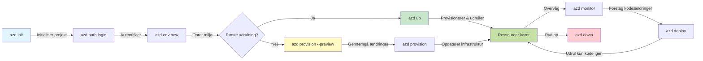
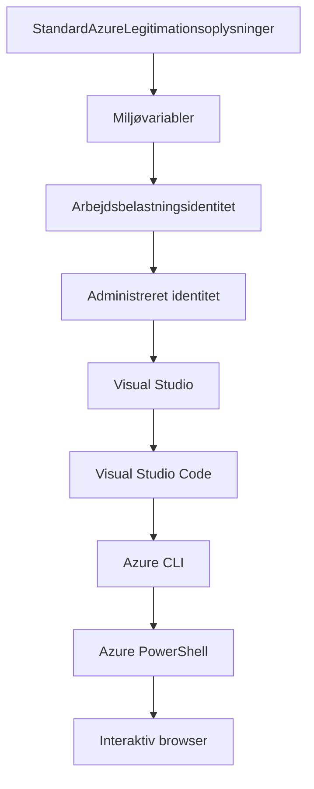

# AZD Grundlæggende - Forstå Azure Developer CLI

# AZD Grundlæggende - Kernekoncepter og Grundprincipper

**Kapiteloversigt:**
- **📚 Kursushjem**: [AZD For Begyndere](../../README.md)
- **📖 Nuværende Kapitel**: Kapitel 1 - Fundament & Hurtig Start
- **⬅️ Forrige**: [Kursusoversigt](../../README.md#-chapter-1-foundation--quick-start)
- **➡️ Næste**: [Installation & Opsætning](installation.md)
- **🚀 Næste Kapitel**: [Kapitel 2: AI-First Udvikling](../microsoft-foundry/microsoft-foundry-integration.md)

## Introduktion

Denne lektion introducerer dig til Azure Developer CLI (azd), et kraftfuldt kommandolinjeværktøj, der fremskynder din rejse fra lokal udvikling til Azure-udrulning. Du vil lære de grundlæggende koncepter, kernefunktioner og forstå, hvordan azd forenkler udrulning af cloud-native applikationer.

## Læringsmål

Ved slutningen af denne lektion vil du:
- Forstå, hvad Azure Developer CLI er, og dets primære formål
- Lære kernekoncepterne om skabeloner, miljøer og tjenester
- Udforske nøglefunktioner som skabelonbaseret udvikling og Infrastructure as Code
- Forstå azd-projektstrukturen og arbejdsgangen
- Være klar til at installere og konfigurere azd til dit udviklingsmiljø

## Læringsresultater

Efter at have gennemført denne lektion vil du kunne:
- Forklare azd's rolle i moderne cloud-udviklingsarbejdsgange
- Identificere komponenterne i en azd-projektstruktur
- Beskrive, hvordan skabeloner, miljøer og tjenester arbejder sammen
- Forstå fordelene ved Infrastructure as Code med azd
- Genkende forskellige azd-kommandoer og deres formål

## Hvad er Azure Developer CLI (azd)?

Azure Developer CLI (azd) er et kommandolinjeværktøj designet til at fremskynde din rejse fra lokal udvikling til Azure-udrulning. Det forenkler processen med at bygge, udrulle og administrere cloud-native applikationer på Azure.

### 🎯 Hvorfor bruge AZD? En praktisk sammenligning

Lad os sammenligne udrulning af en simpel webapp med database:

#### ❌ UDEN AZD: Manuel Azure-udrulning (30+ minutter)

```bash
# Trin 1: Opret ressourcegruppe
az group create --name myapp-rg --location eastus

# Trin 2: Opret App Service Plan
az appservice plan create --name myapp-plan \
  --resource-group myapp-rg \
  --sku B1 --is-linux

# Trin 3: Opret Web App
az webapp create --name myapp-web-unique123 \
  --resource-group myapp-rg \
  --plan myapp-plan \
  --runtime "NODE:18-lts"

# Trin 4: Opret Cosmos DB-konto (10-15 minutter)
az cosmosdb create --name myapp-cosmos-unique123 \
  --resource-group myapp-rg \
  --kind MongoDB

# Trin 5: Opret database
az cosmosdb mongodb database create \
  --account-name myapp-cosmos-unique123 \
  --resource-group myapp-rg \
  --name tododb

# Trin 6: Opret samling
az cosmosdb mongodb collection create \
  --account-name myapp-cosmos-unique123 \
  --resource-group myapp-rg \
  --database-name tododb \
  --name todos

# Trin 7: Hent forbindelsesstreng
CONN_STR=$(az cosmosdb keys list \
  --name myapp-cosmos-unique123 \
  --resource-group myapp-rg \
  --type connection-strings \
  --query "connectionStrings[0].connectionString" -o tsv)

# Trin 8: Konfigurer appindstillinger
az webapp config appsettings set \
  --name myapp-web-unique123 \
  --resource-group myapp-rg \
  --settings MONGODB_URI="$CONN_STR"

# Trin 9: Aktiver logning
az webapp log config --name myapp-web-unique123 \
  --resource-group myapp-rg \
  --application-logging filesystem \
  --detailed-error-messages true

# Trin 10: Opsæt Application Insights
az monitor app-insights component create \
  --app myapp-insights \
  --location eastus \
  --resource-group myapp-rg

# Trin 11: Link App Insights til Web App
INSTRUMENTATION_KEY=$(az monitor app-insights component show \
  --app myapp-insights \
  --resource-group myapp-rg \
  --query "instrumentationKey" -o tsv)

az webapp config appsettings set \
  --name myapp-web-unique123 \
  --resource-group myapp-rg \
  --settings APPINSIGHTS_INSTRUMENTATIONKEY="$INSTRUMENTATION_KEY"

# Trin 12: Byg applikation lokalt
npm install
npm run build

# Trin 13: Opret deploymentspakke
zip -r app.zip . -x "*.git*" "node_modules/*"

# Trin 14: Udrul applikation
az webapp deployment source config-zip \
  --resource-group myapp-rg \
  --name myapp-web-unique123 \
  --src app.zip

# Trin 15: Vent og bed til, at det virker 🙏
# (Ingen automatiseret validering, manuel testning påkrævet)
```

**Problemer:**
- ❌ 15+ kommandoer at huske og udføre i rækkefølge
- ❌ 30-45 minutters manuelt arbejde
- ❌ Let at lave fejl (tastefejl, forkerte parametre)
- ❌ Forbindelsesstrenge eksponeret i terminalhistorik
- ❌ Ingen automatisk rollback, hvis noget fejler
- ❌ Svært at replikere for teammedlemmer
- ❌ Forskelligt hver gang (ikke reproducerbart)

#### ✅ MED AZD: Automatiseret udrulning (5 kommandoer, 10-15 minutter)

```bash
# Trin 1: Initialiser fra skabelon
azd init --template todo-nodejs-mongo

# Trin 2: Godkend
azd auth login

# Trin 3: Opret miljø
azd env new dev

# Trin 4: Forhåndsvis ændringer (valgfrit, men anbefales)
azd provision --preview

# Trin 5: Udrul alt
azd up

# ✨ Færdig! Alt er udrullet, konfigureret og overvåget
```

**Fordele:**
- ✅ **5 kommandoer** vs. 15+ manuelle trin
- ✅ **10-15 minutter** samlet tid (mest ventetid på Azure)
- ✅ **Ingen fejl** - automatiseret og testet
- ✅ **Hemmeligheder håndteres sikkert** via Key Vault
- ✅ **Automatisk rollback** ved fejl
- ✅ **Fuldstændig reproducerbart** - samme resultat hver gang
- ✅ **Team-klar** - alle kan udrulle med samme kommandoer
- ✅ **Infrastructure as Code** - versionskontrollerede Bicep-skabeloner
- ✅ **Indbygget overvågning** - Application Insights konfigureret automatisk

### 📊 Tids- og Fejlreduktion

| Metrik | Manuel Udrulning | AZD Udrulning | Forbedring |
|:-------|:------------------|:---------------|:------------|
| **Kommandoer** | 15+ | 5 | 67% færre |
| **Tid** | 30-45 min | 10-15 min | 60% hurtigere |
| **Fejlrater** | ~40% | <5% | 88% reduktion |
| **Konsistens** | Lav (manuel) | 100% (automatiseret) | Perfekt |
| **Team Onboarding** | 2-4 timer | 30 minutter | 75% hurtigere |
| **Rollback Tid** | 30+ min (manuel) | 2 min (automatiseret) | 93% hurtigere |

## Kernekoncepter

### Skabeloner
Skabeloner er fundamentet for azd. De indeholder:
- **Applikationskode** - Din kildekode og afhængigheder
- **Infrastrukturdefinitioner** - Azure-ressourcer defineret i Bicep eller Terraform
- **Konfigurationsfiler** - Indstillinger og miljøvariabler
- **Udrulningsscripts** - Automatiserede udrulningsarbejdsgange

### Miljøer
Miljøer repræsenterer forskellige udrulningsmål:
- **Udvikling** - Til test og udvikling
- **Staging** - Pre-produktionsmiljø
- **Produktion** - Live produktionsmiljø

Hvert miljø opretholder sin egen:
- Azure-ressourcegruppe
- Konfigurationsindstillinger
- Udrulningstilstand

### Tjenester
Tjenester er byggestenene i din applikation:
- **Frontend** - Webapplikationer, SPAs
- **Backend** - API'er, mikrotjenester
- **Database** - Databaseløsninger
- **Lagring** - Fil- og bloblagring

## Nøglefunktioner

### 1. Skabelonbaseret Udvikling
```bash
# Gennemse tilgængelige skabeloner
azd template list

# Initialiser fra en skabelon
azd init --template <template-name>
```

### 2. Infrastructure as Code
- **Bicep** - Azures domænespecifikke sprog
- **Terraform** - Multi-cloud infrastrukturværktøj
- **ARM Templates** - Azure Resource Manager-skabeloner

### 3. Integrerede Arbejdsgange
```bash
# Fuldfør implementeringsarbejdsgang
azd up            # Klargør + Implementer dette er håndfri ved første opsætning

# 🧪 NYT: Forhåndsvis ændringer i infrastrukturen før implementering (SIKKER)
azd provision --preview    # Simuler implementering af infrastruktur uden at foretage ændringer

azd provision     # Opret Azure-ressourcer, hvis du opdaterer infrastrukturen, brug dette
azd deploy        # Implementer applikationskode eller genimplementer applikationskode efter opdatering
azd down          # Ryd op i ressourcer
```

#### 🛡️ Sikker Infrastrukturplanlægning med Preview
Kommandoen `azd provision --preview` er en game-changer for sikre udrulninger:
- **Tørkørselsanalyse** - Viser, hvad der vil blive oprettet, ændret eller slettet
- **Ingen risiko** - Ingen faktiske ændringer foretages i dit Azure-miljø
- **Team-samarbejde** - Del preview-resultater før udrulning
- **Omkostningsestimering** - Forstå ressourceomkostninger før forpligtelse

```bash
# Eksempel på forhåndsvisningsarbejdsgang
azd provision --preview           # Se hvad der vil ændre sig
# Gennemgå output, diskuter med teamet
azd provision                     # Anvend ændringer med tillid
```

### 📊 Visualisering: AZD Udviklingsarbejdsgang


**Forklaring af arbejdsgang:**
1. **Init** - Start med skabelon eller nyt projekt
2. **Auth** - Godkend med Azure
3. **Miljø** - Opret isoleret udrulningsmiljø
4. **Preview** - 🆕 Forhåndsvis altid infrastrukturændringer først (sikker praksis)
5. **Provision** - Opret/opdater Azure-ressourcer
6. **Deploy** - Skub din applikationskode
7. **Monitor** - Overvåg applikationsydelse
8. **Iterate** - Foretag ændringer og genudrul kode
9. **Cleanup** - Fjern ressourcer, når du er færdig

### 4. Miljøhåndtering
```bash
# Opret og administrer miljøer
azd env new <environment-name>
azd env select <environment-name>
azd env list
```

## 📁 Projektstruktur

En typisk azd-projektstruktur:
```
my-app/
├── .azd/                    # azd configuration
│   └── config.json
├── .azure/                  # Azure deployment artifacts
├── .devcontainer/          # Development container config
├── .github/workflows/      # GitHub Actions
├── .vscode/               # VS Code settings
├── infra/                 # Infrastructure code
│   ├── main.bicep        # Main infrastructure template
│   ├── main.parameters.json
│   └── modules/          # Reusable modules
├── src/                  # Application source code
│   ├── api/             # Backend services
│   └── web/             # Frontend application
├── azure.yaml           # azd project configuration
└── README.md
```

## 🔧 Konfigurationsfiler

### azure.yaml
Den primære projektkonfigurationsfil:
```yaml
name: my-awesome-app
metadata:
  template: my-template@1.0.0

services:
  web:
    project: ./src/web
    language: js
    host: appservice
  api:
    project: ./src/api
    language: js
    host: appservice

hooks:
  preprovision:
    shell: pwsh
    run: echo "Preparing to provision..."
```

### .azure/config.json
Miljøspecifik konfiguration:
```json
{
  "version": 1,
  "defaultEnvironment": "dev",
  "environments": {
    "dev": {
      "subscriptionId": "your-subscription-id",
      "location": "eastus"
    }
  }
}
```

## 🎪 Almindelige Arbejdsgange med Praktiske Øvelser

> **💡 Læringstip:** Følg disse øvelser i rækkefølge for gradvist at opbygge dine AZD-færdigheder.

### 🎯 Øvelse 1: Initialiser Dit Første Projekt

**Mål:** Opret et AZD-projekt og udforsk dets struktur

**Trin:**
```bash
# Brug en velprøvet skabelon
azd init --template todo-nodejs-mongo

# Udforsk de genererede filer
ls -la  # Se alle filer, inklusive skjulte

# Nøglefiler oprettet:
# - azure.yaml (hovedkonfiguration)
# - infra/ (infrastrukturkode)
# - src/ (applikationskode)
```

**✅ Succes:** Du har azure.yaml, infra/ og src/ mapper

---

### 🎯 Øvelse 2: Udrul til Azure

**Mål:** Fuldfør en end-to-end udrulning

**Trin:**
```bash
# 1. Godkend
az login && azd auth login

# 2. Opret miljø
azd env new dev
azd env set AZURE_LOCATION eastus

# 3. Forhåndsvis ændringer (ANBEFALET)
azd provision --preview

# 4. Udrul alt
azd up

# 5. Bekræft udrulning
azd show    # Se din app-URL
```

**Forventet Tid:** 10-15 minutter  
**✅ Succes:** Applikations-URL åbner i browseren

---

### 🎯 Øvelse 3: Flere Miljøer

**Mål:** Udrul til dev og staging

**Trin:**
```bash
# Har allerede udvikling, opret staging
azd env new staging
azd env set AZURE_LOCATION westus2
azd up

# Skift mellem dem
azd env list
azd env select dev
```

**✅ Succes:** To separate ressourcegrupper i Azure Portal

---

### 🛡️ Ren Start: `azd down --force --purge`

Når du har brug for at nulstille fuldstændigt:

```bash
azd down --force --purge
```

**Hvad det gør:**
- `--force`: Ingen bekræftelsesprompter
- `--purge`: Sletter al lokal tilstand og Azure-ressourcer

**Brug når:**
- Udrulning fejlede midtvejs
- Skift af projekter
- Behov for en frisk start

---

## 🎪 Original Arbejdsgangsreference

### Start af Nyt Projekt
```bash
# Metode 1: Brug eksisterende skabelon
azd init --template todo-nodejs-mongo

# Metode 2: Start fra bunden
azd init

# Metode 3: Brug nuværende mappe
azd init .
```

### Udviklingscyklus
```bash
# Opsæt udviklingsmiljø
azd auth login
azd env new dev
azd env select dev

# Udrul alt
azd up

# Foretag ændringer og udrul igen
azd deploy

# Ryd op, når du er færdig
azd down --force --purge # kommandoen i Azure Developer CLI er en **hård nulstilling** af dit miljø—særligt nyttig, når du fejlfinder mislykkede udrulninger, rydder op i forladte ressourcer eller forbereder en ny udrulning.
```

## Forståelse af `azd down --force --purge`
Kommandoen `azd down --force --purge` er en kraftfuld måde at fuldstændigt nedlægge dit azd-miljø og alle tilknyttede ressourcer. Her er en oversigt over, hvad hver flag gør:
```
--force
```
- Spring bekræftelsesprompter over.
- Nyttig til automatisering eller scripts, hvor manuel input ikke er muligt.
- Sikrer, at nedlæggelsen fortsætter uden afbrydelse, selv hvis CLI'en opdager uoverensstemmelser.

```
--purge
```
Sletter **al tilknyttet metadata**, inklusive:
Miljøtilstand
Lokal `.azure` mappe
Cachelagret udrulningsinfo
Forhindrer azd i at "huske" tidligere udrulninger, hvilket kan forårsage problemer som uoverensstemmende ressourcegrupper eller forældede registreringsreferencer.

### Hvorfor bruge begge?
Når du er stødt på problemer med `azd up` på grund af resterende tilstand eller delvise udrulninger, sikrer denne kombination en **ren start**.

Det er især nyttigt efter manuelle ressource-sletninger i Azure-portalen eller ved skift af skabeloner, miljøer eller ressourcegruppe-navnekonventioner.

### Håndtering af Flere Miljøer
```bash
# Opret staging-miljø
azd env new staging
azd env select staging
azd up

# Skift tilbage til udvikling
azd env select dev

# Sammenlign miljøer
azd env list
```

## 🔐 Godkendelse og Legitimation

At forstå godkendelse er afgørende for succesfulde azd-udrulninger. Azure bruger flere godkendelsesmetoder, og azd udnytter den samme credential chain, som bruges af andre Azure-værktøjer.

### Azure CLI Godkendelse (`az login`)

Før du bruger azd, skal du godkende med Azure. Den mest almindelige metode er ved hjælp af Azure CLI:

```bash
# Interaktiv login (åbner browser)
az login

# Login med specifik lejer
az login --tenant <tenant-id>

# Login med servicehoved
az login --service-principal -u <app-id> -p <password> --tenant <tenant-id>

# Kontroller nuværende loginstatus
az account show

# List tilgængelige abonnementer
az account list --output table

# Indstil standardabonnement
az account set --subscription <subscription-id>
```

### Godkendelsesflow
1. **Interaktiv Login**: Åbner din standardbrowser til godkendelse
2. **Enhedskodeflow**: Til miljøer uden browseradgang
3. **Service Principal**: Til automatisering og CI/CD-scenarier
4. **Managed Identity**: Til Azure-hostede applikationer

### DefaultAzureCredential Chain

`DefaultAzureCredential` er en credential-type, der giver en forenklet godkendelsesoplevelse ved automatisk at prøve flere credential-kilder i en specifik rækkefølge:

#### Credential Chain Rækkefølge

#### 1. Miljøvariabler
```bash
# Indstil miljøvariabler for serviceprincipal
export AZURE_CLIENT_ID="<app-id>"
export AZURE_CLIENT_SECRET="<password>"
export AZURE_TENANT_ID="<tenant-id>"
```

#### 2. Workload Identity (Kubernetes/GitHub Actions)
Bruges automatisk i:
- Azure Kubernetes Service (AKS) med Workload Identity
- GitHub Actions med OIDC-federation
- Andre federerede identitetsscenarier

#### 3. Managed Identity
Til Azure-ressourcer som:
- Virtuelle Maskiner
- App Service
- Azure Functions
- Container Instances

```bash
# Kontroller, om der køres på Azure-ressource med administreret identitet
az account show --query "user.type" --output tsv
# Returnerer: "servicePrincipal", hvis der bruges administreret identitet
```

#### 4. Integration med Udviklerværktøjer
- **Visual Studio**: Bruger automatisk den indloggede konto
- **VS Code**: Bruger Azure Account-udvidelsens legitimationsoplysninger
- **Azure CLI**: Bruger `az login` legitimationsoplysninger (mest almindeligt til lokal udvikling)

### AZD Godkendelsesopsætning

```bash
# Metode 1: Brug Azure CLI (Anbefales til udvikling)
az login
azd auth login  # Bruger eksisterende Azure CLI legitimationsoplysninger

# Metode 2: Direkte azd-autentificering
azd auth login --use-device-code  # Til headless-miljøer

# Metode 3: Kontroller autentificeringsstatus
azd auth login --check-status

# Metode 4: Log ud og autentificer igen
azd auth logout
azd auth login
```

### Godkendelsesbedste Praksis

#### Til Lokal Udvikling
```bash
# 1. Log ind med Azure CLI
az login

# 2. Bekræft korrekt abonnement
az account show
az account set --subscription "Your Subscription Name"

# 3. Brug azd med eksisterende legitimationsoplysninger
azd auth login
```

#### Til CI/CD Pipelines
```yaml
# GitHub Actions example
- name: Azure Login
  uses: azure/login@v1
  with:
    creds: ${{ secrets.AZURE_CREDENTIALS }}

- name: Deploy with azd
  run: |
    azd auth login --client-id ${{ secrets.AZURE_CLIENT_ID }} \
                    --client-secret ${{ secrets.AZURE_CLIENT_SECRET }} \
                    --tenant-id ${{ secrets.AZURE_TENANT_ID }}
    azd up --no-prompt
```

#### Til Produktionsmiljøer
- Brug **Managed Identity**, når du kører på Azure-ressourcer
- Brug **Service Principal** til automatiseringsscenarier
- Undgå at gemme legitimationsoplysninger i kode eller konfigurationsfiler
- Brug **Azure Key Vault** til følsom konfiguration

### Almindelige Godkendelsesproblemer og Løsninger

#### Problem: "Ingen abonnement fundet"
```bash
# Løsning: Indstil standardabonnement
az account list --output table
az account set --subscription "<subscription-id>"
azd env set AZURE_SUBSCRIPTION_ID "<subscription-id>"
```

#### Problem: "Utilstrækkelige tilladelser"
```bash
# Løsning: Kontroller og tildel nødvendige roller
az role assignment list --assignee $(az account show --query user.name --output tsv)

# Almindelige nødvendige roller:
# - Bidragyder (til ressourcehåndtering)
# - Brugeradgangsadministrator (til rolletildelinger)
```

#### Problem: "Token udløbet"
```bash
# Løsning: Re-autentificer
az logout
az login
azd auth logout
azd auth login
```

### Godkendelse i Forskellige Scenarier

#### Lokal Udvikling
```bash
# Personlig udviklingskonto
az login
azd auth login
```

#### Teamudvikling
```bash
# Brug specifik lejer til organisation
az login --tenant contoso.onmicrosoft.com
azd auth login
```

#### Multi-tenant Scenarier
```bash
# Skift mellem lejere
az login --tenant tenant1.onmicrosoft.com
# Udrul til lejer 1
azd up

az login --tenant tenant2.onmicrosoft.com  
# Udrul til lejer 2
azd up
```

### Sikkerhedsovervejelser

1. **Credential Opbevaring**: Gem aldrig credentials i kildekode
2. **Begrænsning af Omfang**: Brug mindst-privilegium-princippet for service principals
3. **Token Rotation**: Roter regelmæssigt service principal hemmeligheder
4. **Audit Trail**: Overvåg godkendelses- og udrulningsaktiviteter
5. **Netværkssikkerhed**: Brug private endpoints, når det er muligt

### Fejlfinding af Godkendelse

```bash
# Fejlfind godkendelsesproblemer
azd auth login --check-status
az account show
az account get-access-token

# Almindelige diagnostiske kommandoer
whoami                          # Aktuel brugerkontekst
az ad signed-in-user show      # Azure AD-brugeroplysninger
az group list                  # Test ressourceadgang
```

## Forståelse af `azd down --force --purge`

### Opdagelse
```bash
azd template list              # Gennemse skabeloner
azd template show <template>   # Skabelondetaljer
azd init --help               # Initialiseringsmuligheder
```

### Projektstyring
```bash
azd show                     # Projektoversigt
azd env show                 # Nuværende miljø
azd config list             # Konfigurationsindstillinger
```

### Overvågning
```bash
azd monitor                  # Åbn Azure-portalen
azd pipeline config          # Opsæt CI/CD
azd logs                     # Vis applikationslogfiler
```

## Bedste Praksis

### 1. Brug Meningsfulde Navne
```bash
# God
azd env new production-east
azd init --template web-app-secure

# Undgå
azd env new env1
azd init --template template1
```

### 2. Udnyt Skabeloner
- Start med eksisterende skabeloner
- Tilpas til dine behov
- Opret genanvendelige skabeloner til din organisation

### 3. Miljøisolering
- Brug separate miljøer til dev/staging/prod
- Udrul aldrig direkte til produktion fra lokal maskine
- Brug CI/CD pipelines til produktionsudrulninger

### 4. Konfigurationsstyring
- Brug miljøvariabler til følsomme data
- Hold konfiguration i versionskontrol
- Dokumenter miljøspecifikke indstillinger

## Læringsprogression

### Begynder (Uge 1-2)
1. Installer azd og godkend
2. Udrul en simpel skabelon
3. Forstå projektstruktur
4. Lær grundlæggende kommandoer (up, down, deploy)

### Mellemstadie (Uge 3-4)
1. Tilpas skabeloner
2. Administrer flere miljøer
3. Forstå infrastrukturkode
4. Opsæt CI/CD pipelines

### Avanceret (Uge 5+)
1. Opret brugerdefinerede skabeloner
2. Avancerede infrastrukturmønstre
3. Multi-region udrulninger
4. Konfigurationer på virksomhedsniveau

## Næste Skridt

**📖 Fortsæt Kapitel 1 Læring:**
- [Installation & Opsætning](installation.md) - Få azd installeret og konfigureret
- [Dit Første Projekt](first-project.md) - Komplet praktisk tutorial
- [Konfigurationsguide](configuration.md) - Avancerede konfigurationsmuligheder

**🎯 Klar til Næste Kapitel?**
- [Kapitel 2: AI-First Udvikling](../microsoft-foundry/microsoft-foundry-integration.md) - Begynd at bygge AI-applikationer

## Yderligere Ressourcer

- [Azure Developer CLI Oversigt](https://learn.microsoft.com/en-us/azure/developer/azure-developer-cli/)
- [Template Galleri](https://azure.github.io/awesome-azd/)
- [Community Eksempler](https://github.com/Azure-Samples)

---

## 🙋 Ofte Stillede Spørgsmål

### Generelle Spørgsmål

**Q: Hvad er forskellen mellem AZD og Azure CLI?**

A: Azure CLI (`az`) bruges til at administrere individuelle Azure-ressourcer. AZD (`azd`) bruges til at administrere hele applikationer:

```bash
# Azure CLI - Ressourcehåndtering på lavt niveau
az webapp create --name myapp --resource-group rg
az sql server create --name myserver --resource-group rg
# ...mange flere kommandoer nødvendige

# AZD - Applikationsniveauhåndtering
azd up  # Udruller hele appen med alle ressourcer
```

**Tænk på det sådan her:**
- `az` = Arbejde med individuelle Lego-klodser
- `azd` = Arbejde med komplette Lego-sæt

---

**Q: Skal jeg kende til Bicep eller Terraform for at bruge AZD?**

A: Nej! Start med templates:
```bash
# Brug eksisterende skabelon - ingen IaC-viden nødvendig
azd init --template todo-nodejs-mongo
azd up
```

Du kan lære Bicep senere for at tilpasse infrastrukturen. Templates giver fungerende eksempler at lære fra.

---

**Q: Hvor meget koster det at køre AZD templates?**

A: Omkostninger varierer afhængigt af template. De fleste udviklingstemplates koster $50-150/måned:

```bash
# Forhåndsvis omkostninger før implementering
azd provision --preview

# Ryd altid op, når det ikke bruges
azd down --force --purge  # Fjerner alle ressourcer
```

**Pro tip:** Brug gratis niveauer, hvor det er muligt:
- App Service: F1 (Gratis) niveau
- Azure OpenAI: 50.000 tokens/måned gratis
- Cosmos DB: 1000 RU/s gratis niveau

---

**Q: Kan jeg bruge AZD med eksisterende Azure-ressourcer?**

A: Ja, men det er nemmere at starte fra bunden. AZD fungerer bedst, når det administrerer hele livscyklussen. For eksisterende ressourcer:

```bash
# Mulighed 1: Importer eksisterende ressourcer (avanceret)
azd init
# Rediger derefter infra/ for at referere til eksisterende ressourcer

# Mulighed 2: Start fra bunden (anbefalet)
azd init --template matching-your-stack
azd up  # Opretter nyt miljø
```

---

**Q: Hvordan deler jeg mit projekt med teammedlemmer?**

A: Commit AZD-projektet til Git (men IKKE .azure-mappen):

```bash
# Allerede i .gitignore som standard
.azure/        # Indeholder hemmeligheder og miljødata
*.env          # Miljøvariabler

# Holdmedlemmer dengang:
git clone <your-repo>
azd auth login
azd env new <their-name>-dev
azd up
```

Alle får identisk infrastruktur fra de samme templates.

---

### Fejlfinding Spørgsmål

**Q: "azd up" fejlede halvvejs. Hvad gør jeg?**

A: Tjek fejlen, ret den, og prøv igen:

```bash
# Se detaljerede logfiler
azd show

# Almindelige løsninger:

# 1. Hvis kvoten er overskredet:
azd env set AZURE_LOCATION "westus2"  # Prøv en anden region

# 2. Hvis ressource-navnekonflikt:
azd down --force --purge  # Ryd op
azd up  # Prøv igen

# 3. Hvis godkendelse er udløbet:
az login
azd auth login
azd up
```

**Mest almindelige problem:** Forkert Azure-abonnement valgt
```bash
az account list --output table
az account set --subscription "<correct-subscription>"
```

---

**Q: Hvordan deployer jeg kun kodeændringer uden at reprovisionere?**

A: Brug `azd deploy` i stedet for `azd up`:

```bash
azd up          # Første gang: klargør + deployer (langsomt)

# Foretag kodeændringer...

azd deploy      # Efterfølgende gange: kun deployer (hurtigt)
```

Hastighedssammenligning:
- `azd up`: 10-15 minutter (provisionerer infrastruktur)
- `azd deploy`: 2-5 minutter (kun kode)

---

**Q: Kan jeg tilpasse infrastrukturen templates?**

A: Ja! Rediger Bicep-filerne i `infra/`:

```bash
# Efter azd init
cd infra/
code main.bicep  # Rediger i VS Code

# Forhåndsvis ændringer
azd provision --preview

# Anvend ændringer
azd provision
```

**Tip:** Start småt - ændr SKUs først:
```bicep
// infra/main.bicep
sku: {
  name: 'B1'  // Change to 'P1V2' for production
}
```

---

**Q: Hvordan sletter jeg alt, hvad AZD har oprettet?**

A: Én kommando fjerner alle ressourcer:

```bash
azd down --force --purge

# Dette sletter:
# - Alle Azure-ressourcer
# - Ressourcegruppe
# - Lokal miljøtilstand
# - Cachede implementeringsdata
```

**Kør altid dette når:**
- Du er færdig med at teste en template
- Skifter til et andet projekt
- Vil starte forfra

**Omkostningsbesparelser:** Sletning af ubrugte ressourcer = $0 omkostninger

---

**Q: Hvad hvis jeg ved et uheld har slettet ressourcer i Azure Portal?**

A: AZD-tilstanden kan komme ud af sync. Brug en ren start:

```bash
# 1. Fjern lokal tilstand
azd down --force --purge

# 2. Start forfra
azd up

# Alternativ: Lad AZD opdage og rette
azd provision  # Vil oprette manglende ressourcer
```

---

### Avancerede Spørgsmål

**Q: Kan jeg bruge AZD i CI/CD pipelines?**

A: Ja! GitHub Actions eksempel:

```yaml
# .github/workflows/deploy.yml
name: Deploy with AZD

on:
  push:
    branches: [main]

jobs:
  deploy:
    runs-on: ubuntu-latest
    steps:
      - uses: actions/checkout@v2
      
      - name: Install azd
        run: curl -fsSL https://aka.ms/install-azd.sh | bash
      
      - name: Azure Login
        run: |
          azd auth login \
            --client-id ${{ secrets.AZURE_CLIENT_ID }} \
            --client-secret ${{ secrets.AZURE_CLIENT_SECRET }} \
            --tenant-id ${{ secrets.AZURE_TENANT_ID }}
      
      - name: Deploy
        run: azd up --no-prompt
```

---

**Q: Hvordan håndterer jeg hemmeligheder og følsomme data?**

A: AZD integrerer automatisk med Azure Key Vault:

```bash
# Hemmeligheder gemmes i Key Vault, ikke i kode
azd env set DATABASE_PASSWORD "$(openssl rand -base64 32)"

# AZD automatisk:
# 1. Opretter Key Vault
# 2. Gemmer hemmelighed
# 3. Giver app adgang via Managed Identity
# 4. Indsprøjter ved runtime
```

**Aldrig commit:**
- `.azure/` mappe (indeholder miljødata)
- `.env` filer (lokale hemmeligheder)
- Forbindelsesstrenge

---

**Q: Kan jeg deploye til flere regioner?**

A: Ja, opret miljø pr. region:

```bash
# Øst USA miljø
azd env new prod-eastus
azd env set AZURE_LOCATION eastus
azd up

# Vest Europa miljø
azd env new prod-westeurope
azd env set AZURE_LOCATION westeurope
azd up

# Hvert miljø er uafhængigt
azd env list
```

For ægte multi-region apps, tilpas Bicep templates til at deploye til flere regioner samtidig.

---

**Q: Hvor kan jeg få hjælp, hvis jeg sidder fast?**

1. **AZD Dokumentation:** https://learn.microsoft.com/azure/developer/azure-developer-cli/
2. **GitHub Issues:** https://github.com/Azure/azure-dev/issues
3. **Discord:** [Azure Discord](https://discord.gg/microsoft-azure) - #azure-developer-cli kanal
4. **Stack Overflow:** Tag `azure-developer-cli`
5. **Denne Kursus:** [Fejlfindingsguide](../troubleshooting/common-issues.md)

**Pro tip:** Før du spørger, kør:
```bash
azd show       # Viser nuværende tilstand
azd version    # Viser din version
```
Inkluder denne info i dit spørgsmål for hurtigere hjælp.

---

## 🎓 Hvad er Næste?

Du forstår nu AZD-grundprincipperne. Vælg din vej:

### 🎯 For Begyndere:
1. **Næste:** [Installation & Opsætning](installation.md) - Installer AZD på din maskine
2. **Derefter:** [Dit Første Projekt](first-project.md) - Deploy din første app
3. **Øv:** Fuldfør alle 3 øvelser i denne lektion

### 🚀 For AI Udviklere:
1. **Spring til:** [Kapitel 2: AI-First Udvikling](../microsoft-foundry/microsoft-foundry-integration.md)
2. **Deploy:** Start med `azd init --template get-started-with-ai-chat`
3. **Lær:** Byg mens du deployer

### 🏗️ For Erfarne Udviklere:
1. **Gennemgå:** [Konfigurationsguide](configuration.md) - Avancerede indstillinger
2. **Udforsk:** [Infrastructure as Code](../deployment/provisioning.md) - Bicep dybdegående
3. **Byg:** Opret brugerdefinerede templates til din stack

---

**Kapitel Navigation:**
- **📚 Kursus Hjem**: [AZD For Begyndere](../../README.md)
- **📖 Nuværende Kapitel**: Kapitel 1 - Fundament & Hurtig Start  
- **⬅️ Forrige**: [Kursusoversigt](../../README.md#-chapter-1-foundation--quick-start)
- **➡️ Næste**: [Installation & Opsætning](installation.md)
- **🚀 Næste Kapitel**: [Kapitel 2: AI-First Udvikling](../microsoft-foundry/microsoft-foundry-integration.md)

---

<!-- CO-OP TRANSLATOR DISCLAIMER START -->
**Ansvarsfraskrivelse**:  
Dette dokument er blevet oversat ved hjælp af AI-oversættelsestjenesten [Co-op Translator](https://github.com/Azure/co-op-translator). Selvom vi bestræber os på nøjagtighed, skal det bemærkes, at automatiserede oversættelser kan indeholde fejl eller unøjagtigheder. Det originale dokument på dets oprindelige sprog bør betragtes som den autoritative kilde. For kritisk information anbefales professionel menneskelig oversættelse. Vi er ikke ansvarlige for eventuelle misforståelser eller fejltolkninger, der opstår som følge af brugen af denne oversættelse.
<!-- CO-OP TRANSLATOR DISCLAIMER END -->