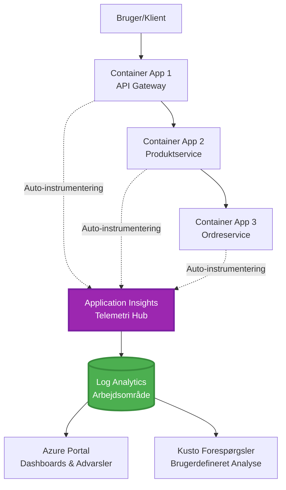
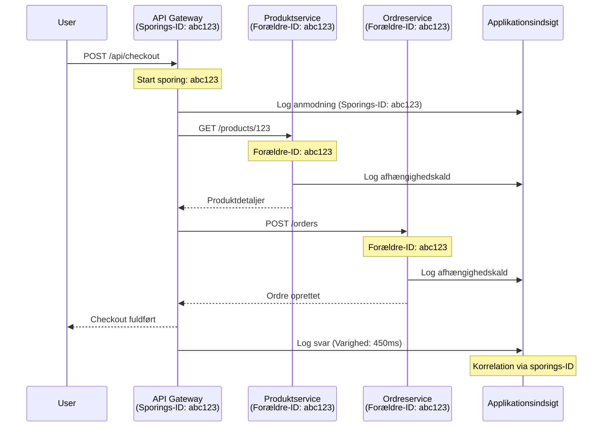

# Integration af Application Insights med AZD

⏱️ **Estimeret tid**: 40-50 minutter | 💰 **Omkostningspåvirkning**: ~$5-15/måned | ⭐ **Kompleksitet**: Mellem

**📚 Læringssti:**
- ← Forrige: [Preflight Checks](preflight-checks.md) - Validering før implementering
- 🎯 **Du er her**: Integration af Application Insights (Overvågning, telemetri, fejlfinding)
- → Næste: [Deployment Guide](../deployment/deployment-guide.md) - Implementering til Azure
- 🏠 [Kursusoversigt](../../README.md)

---

## Hvad du vil lære

Ved at gennemføre denne lektion vil du:
- Integrere **Application Insights** automatisk i AZD-projekter
- Konfigurere **distribueret sporing** for mikrotjenester
- Implementere **tilpasset telemetri** (målinger, begivenheder, afhængigheder)
- Opsætte **live metrics** til overvågning i realtid
- Oprette **alarmer og dashboards** fra AZD-implementeringer
- Fejlsøge produktionsproblemer med **telemetri-forespørgsler**
- Optimere **omkostninger og samplingstrategier**
- Overvåge **AI/LLM-applikationer** (tokens, latenstid, omkostninger)

## Hvorfor Application Insights med AZD er vigtigt

### Udfordringen: Observabilitet i produktion

**Uden Application Insights:**
```
❌ No visibility into production behavior
❌ Manual log aggregation across services
❌ Reactive debugging (wait for customer complaints)
❌ No performance metrics
❌ Cannot trace requests across services
❌ Unknown failure rates and bottlenecks
```

**Med Application Insights + AZD:**
```
✅ Automatic telemetry collection
✅ Centralized logs from all services
✅ Proactive issue detection
✅ End-to-end request tracing
✅ Performance metrics and insights
✅ Real-time dashboards
✅ AZD provisions everything automatically
```

**Analogi**: Application Insights er som at have en "sort boks" flyoptager + cockpit-dashboard til din applikation. Du ser alt, hvad der sker i realtid, og kan afspille enhver hændelse.

---

## Arkitekturoversigt

### Application Insights i AZD-arkitektur


### Hvad der overvåges automatisk

| Telemetritype | Hvad det registrerer | Anvendelse |
|---------------|----------------------|------------|
| **Requests** | HTTP-anmodninger, statuskoder, varighed | Overvågning af API-ydeevne |
| **Dependencies** | Eksterne kald (DB, API'er, lager) | Identificer flaskehalse |
| **Exceptions** | Ubehandlede fejl med stack traces | Fejlsøgning af fejl |
| **Custom Events** | Forretningsbegivenheder (tilmelding, køb) | Analyse og funnels |
| **Metrics** | Ydeevnetællere, tilpassede målinger | Kapacitetsplanlægning |
| **Traces** | Logbeskeder med alvorlighed | Fejlsøgning og revision |
| **Availability** | Oppetid og svartidstests | SLA-overvågning |

---

## Forudsætninger

### Nødvendige værktøjer

```bash
# Bekræft Azure Developer CLI
azd version
# ✅ Forventet: azd version 1.0.0 eller højere

# Bekræft Azure CLI
az --version
# ✅ Forventet: azure-cli 2.50.0 eller højere
```

### Azure-krav

- Aktiv Azure-abonnement
- Tilladelser til at oprette:
  - Application Insights-ressourcer
  - Log Analytics-arbejdsområder
  - Container Apps
  - Ressourcegrupper

### Videnforudsætninger

Du bør have gennemført:
- [AZD Basics](../getting-started/azd-basics.md) - Grundlæggende AZD-koncept
- [Configuration](../getting-started/configuration.md) - Opsætning af miljø
- [First Project](../getting-started/first-project.md) - Grundlæggende implementering

---

## Lektion 1: Automatisk Application Insights med AZD

### Hvordan AZD opretter Application Insights

AZD opretter og konfigurerer automatisk Application Insights, når du implementerer. Lad os se, hvordan det fungerer.

### Projektstruktur

```
monitored-app/
├── azure.yaml                     # AZD configuration
├── infra/
│   ├── main.bicep                # Main infrastructure
│   ├── core/
│   │   └── monitoring.bicep      # Application Insights + Log Analytics
│   └── app/
│       └── api.bicep             # Container App with monitoring
└── src/
    ├── app.py                    # Application with telemetry
    ├── requirements.txt
    └── Dockerfile
```

---

### Trin 1: Konfigurer AZD (azure.yaml)

**Fil: `azure.yaml`**

```yaml
name: monitored-app
metadata:
  template: monitored-app@1.0.0

services:
  api:
    project: ./src
    language: python
    host: containerapp

# AZD automatically provisions monitoring!
```

**Det er det!** AZD opretter Application Insights som standard. Ingen ekstra konfiguration nødvendig for grundlæggende overvågning.

---

### Trin 2: Overvågningsinfrastruktur (Bicep)

**Fil: `infra/core/monitoring.bicep`**

```bicep
param logAnalyticsName string
param applicationInsightsName string
param location string = resourceGroup().location
param tags object = {}

// Log Analytics Workspace (required for Application Insights)
resource logAnalytics 'Microsoft.OperationalInsights/workspaces@2022-10-01' = {
  name: logAnalyticsName
  location: location
  tags: tags
  properties: {
    sku: {
      name: 'PerGB2018'  // Pay-as-you-go pricing
    }
    retentionInDays: 30  // Keep logs for 30 days
    features: {
      enableLogAccessUsingOnlyResourcePermissions: true
    }
  }
}

// Application Insights
resource applicationInsights 'Microsoft.Insights/components@2020-02-02' = {
  name: applicationInsightsName
  location: location
  tags: tags
  kind: 'web'
  properties: {
    Application_Type: 'web'
    WorkspaceResourceId: logAnalytics.id
    IngestionMode: 'LogAnalytics'
    publicNetworkAccessForIngestion: 'Enabled'
    publicNetworkAccessForQuery: 'Enabled'
  }
}

// Outputs for Container Apps
output logAnalyticsWorkspaceId string = logAnalytics.id
output logAnalyticsWorkspaceName string = logAnalytics.name
output applicationInsightsConnectionString string = applicationInsights.properties.ConnectionString
output applicationInsightsInstrumentationKey string = applicationInsights.properties.InstrumentationKey
output applicationInsightsName string = applicationInsights.name
```

---

### Trin 3: Forbind Container App til Application Insights

**Fil: `infra/app/api.bicep`**

```bicep
param name string
param location string
param tags object = {}
param containerAppsEnvironmentName string
param applicationInsightsConnectionString string

resource containerApp 'Microsoft.App/containerApps@2023-05-01' = {
  name: name
  location: location
  tags: tags
  properties: {
    configuration: {
      ingress: {
        external: true
        targetPort: 8000
      }
      secrets: [
        {
          name: 'appinsights-connection-string'
          value: applicationInsightsConnectionString
        }
      ]
    }
    template: {
      containers: [
        {
          name: 'api'
          image: 'myregistry.azurecr.io/api:latest'
          resources: {
            cpu: json('0.5')
            memory: '1Gi'
          }
          env: [
            {
              name: 'APPLICATIONINSIGHTS_CONNECTION_STRING'
              secretRef: 'appinsights-connection-string'
            }
            {
              name: 'APPLICATIONINSIGHTS_ENABLED'
              value: 'true'
            }
          ]
        }
      ]
    }
  }
}

output uri string = 'https://${containerApp.properties.configuration.ingress.fqdn}'
```

---

### Trin 4: Applikationskode med telemetri

**Fil: `src/app.py`**

```python
from flask import Flask, request, jsonify
from opencensus.ext.azure.log_exporter import AzureLogHandler
from opencensus.ext.azure.trace_exporter import AzureExporter
from opencensus.ext.flask.flask_middleware import FlaskMiddleware
from opencensus.trace.samplers import ProbabilitySampler
import logging
import os

app = Flask(__name__)

# Hent Application Insights forbindelsesstreng
connection_string = os.environ.get('APPLICATIONINSIGHTS_CONNECTION_STRING')

if connection_string:
    # Konfigurer distribueret sporing
    middleware = FlaskMiddleware(
        app,
        exporter=AzureExporter(connection_string=connection_string),
        sampler=ProbabilitySampler(rate=1.0)  # 100% sampling for udvikling
    )
    
    # Konfigurer logning
    logger = logging.getLogger(__name__)
    logger.addHandler(AzureLogHandler(connection_string=connection_string))
    logger.setLevel(logging.INFO)
    
    print("✅ Application Insights enabled")
else:
    logger = logging.getLogger(__name__)
    logger.setLevel(logging.INFO)
    print("⚠️ Application Insights not configured")

@app.route('/health')
def health():
    logger.info('Health check endpoint called')
    return jsonify({'status': 'healthy', 'monitoring': 'enabled'})

@app.route('/api/products')
def get_products():
    logger.info('Fetching products')
    
    # Simuler databasekald (automatisk sporet som afhængighed)
    products = [
        {'id': 1, 'name': 'Laptop', 'price': 999.99},
        {'id': 2, 'name': 'Mouse', 'price': 29.99},
        {'id': 3, 'name': 'Keyboard', 'price': 79.99}
    ]
    
    logger.info(f'Returned {len(products)} products')
    return jsonify(products)

@app.route('/api/error-test')
def error_test():
    """Test error tracking"""
    logger.error('Testing error tracking')
    try:
        raise ValueError('This is a test exception')
    except Exception as e:
        logger.exception('Exception occurred in error-test endpoint')
        return jsonify({'error': str(e)}), 500

@app.route('/api/slow')
def slow_endpoint():
    """Test performance tracking"""
    import time
    logger.info('Slow endpoint called')
    time.sleep(3)  # Simuler langsom operation
    logger.warning('Endpoint took 3 seconds to respond')
    return jsonify({'message': 'Slow operation completed'})

if __name__ == '__main__':
    app.run(host='0.0.0.0', port=8000)
```

**Fil: `src/requirements.txt`**

```txt
Flask==3.0.0
opencensus-ext-azure==1.1.13
opencensus-ext-flask==0.8.1
gunicorn==21.2.0
```

---

### Trin 5: Implementer og verificer

```bash
# Initialiser AZD
azd init

# Udrul (opretter automatisk Application Insights)
azd up

# Hent app-URL
APP_URL=$(azd env get-values | grep API_URL | cut -d '=' -f2 | tr -d '"')

# Generer telemetri
curl $APP_URL/health
curl $APP_URL/api/products
curl $APP_URL/api/error-test
curl $APP_URL/api/slow
```

**✅ Forventet output:**
```json
{
  "status": "healthy",
  "monitoring": "enabled"
}
```

---

### Trin 6: Se telemetri i Azure Portal

```bash
# Hent Application Insights detaljer
azd env get-values | grep APPLICATIONINSIGHTS

# Åbn i Azure Portal
az monitor app-insights component show \
  --app $(azd env get-values | grep APPLICATIONINSIGHTS_NAME | cut -d '=' -f2 | tr -d '"') \
  --resource-group $(azd env get-values | grep AZURE_RESOURCE_GROUP | cut -d '=' -f2 | tr -d '"') \
  --query "appId" -o tsv
```

**Naviger til Azure Portal → Application Insights → Transaction Search**

Du bør se:
- ✅ HTTP-anmodninger med statuskoder
- ✅ Anmodningsvarighed (3+ sekunder for `/api/slow`)
- ✅ Fejldetaljer fra `/api/error-test`
- ✅ Tilpassede logbeskeder

---

## Lektion 2: Tilpasset telemetri og begivenheder

### Spor forretningsbegivenheder

Lad os tilføje tilpasset telemetri for forretningskritiske begivenheder.

**Fil: `src/telemetry.py`**

```python
from opencensus.ext.azure import metrics_exporter
from opencensus.stats import aggregation as aggregation_module
from opencensus.stats import measure as measure_module
from opencensus.stats import stats as stats_module
from opencensus.stats import view as view_module
from opencensus.tags import tag_map as tag_map_module
from opencensus.ext.azure.log_exporter import AzureLogHandler
from opencensus.ext.azure.trace_exporter import AzureExporter
from opencensus.trace import tracer as tracer_module
import logging
import os

class TelemetryClient:
    """Custom telemetry client for Application Insights"""
    
    def __init__(self, connection_string=None):
        self.connection_string = connection_string or os.environ.get('APPLICATIONINSIGHTS_CONNECTION_STRING')
        
        if not self.connection_string:
            print("⚠️ Application Insights connection string not found")
            return
        
        # Opsæt logger
        self.logger = logging.getLogger(__name__)
        self.logger.addHandler(AzureLogHandler(connection_string=self.connection_string))
        self.logger.setLevel(logging.INFO)
        
        # Opsæt metrics eksportør
        self.stats = stats_module.stats
        self.view_manager = self.stats.view_manager
        self.stats_recorder = self.stats.stats_recorder
        
        exporter = metrics_exporter.new_metrics_exporter(
            connection_string=self.connection_string
        )
        self.view_manager.register_exporter(exporter)
        
        # Opsæt tracer
        self.tracer = tracer_module.Tracer(
            exporter=AzureExporter(connection_string=self.connection_string)
        )
        
        print("✅ Custom telemetry client initialized")
    
    def track_event(self, event_name: str, properties: dict = None):
        """Track custom business event"""
        properties = properties or {}
        self.logger.info(
            f"CustomEvent: {event_name}",
            extra={
                'custom_dimensions': {
                    'event_name': event_name,
                    **properties
                }
            }
        )
    
    def track_metric(self, metric_name: str, value: float, properties: dict = None):
        """Track custom metric"""
        properties = properties or {}
        self.logger.info(
            f"CustomMetric: {metric_name} = {value}",
            extra={
                'custom_dimensions': {
                    'metric_name': metric_name,
                    'value': value,
                    **properties
                }
            }
        )
    
    def track_dependency(self, name: str, dependency_type: str, duration: float, success: bool):
        """Track external dependency call"""
        with self.tracer.span(name=name) as span:
            span.add_attribute('dependency.type', dependency_type)
            span.add_attribute('duration', duration)
            span.add_attribute('success', success)

# Global telemetriklient
telemetry = TelemetryClient()
```

### Opdater applikationen med tilpassede begivenheder

**Fil: `src/app.py` (forbedret)**

```python
from flask import Flask, request, jsonify
from telemetry import telemetry
import time
import random

app = Flask(__name__)

@app.route('/api/purchase', methods=['POST'])
def purchase():
    """Track purchase event with custom telemetry"""
    data = request.json
    product_id = data.get('product_id')
    quantity = data.get('quantity', 1)
    price = data.get('price', 0)
    
    # Spor forretningsbegivenhed
    telemetry.track_event('Purchase', {
        'product_id': product_id,
        'quantity': quantity,
        'total_amount': price * quantity,
        'user_id': request.headers.get('X-User-Id', 'anonymous')
    })
    
    # Spor omsætningsmetrik
    telemetry.track_metric('Revenue', price * quantity, {
        'product_id': product_id,
        'currency': 'USD'
    })
    
    return jsonify({
        'order_id': f'ORD-{random.randint(1000, 9999)}',
        'status': 'confirmed',
        'total': price * quantity
    })

@app.route('/api/search')
def search():
    """Track search queries"""
    query = request.args.get('q', '')
    
    start_time = time.time()
    
    # Simuler søgning (ville være en rigtig databaseforespørgsel)
    results = [{'id': 1, 'name': f'Result for {query}'}]
    
    duration = (time.time() - start_time) * 1000  # Konverter til ms
    
    # Spor søgebegivenhed
    telemetry.track_event('Search', {
        'query': query,
        'results_count': len(results),
        'duration_ms': duration
    })
    
    # Spor søgepræstationsmetrik
    telemetry.track_metric('SearchDuration', duration, {
        'query_length': len(query)
    })
    
    return jsonify({'results': results, 'count': len(results)})

@app.route('/api/external-call')
def external_call():
    """Track external API dependency"""
    import requests
    
    start_time = time.time()
    success = True
    
    try:
        # Simuler ekstern API-opkald
        response = requests.get('https://api.example.com/data', timeout=5)
        result = response.json()
    except Exception as e:
        success = False
        result = {'error': str(e)}
    
    duration = (time.time() - start_time) * 1000
    
    # Spor afhængighed
    telemetry.track_dependency(
        name='ExternalAPI',
        dependency_type='HTTP',
        duration=duration,
        success=success
    )
    
    return jsonify(result)

if __name__ == '__main__':
    app.run(host='0.0.0.0', port=8000)
```

### Test tilpasset telemetri

```bash
# Spor købshændelse
curl -X POST $APP_URL/api/purchase \
  -H "Content-Type: application/json" \
  -H "X-User-Id: user123" \
  -d '{"product_id": 1, "quantity": 2, "price": 29.99}'

# Spor søgehændelse
curl "$APP_URL/api/search?q=laptop"

# Spor ekstern afhængighed
curl $APP_URL/api/external-call
```

**Se i Azure Portal:**

Naviger til Application Insights → Logs, og kør:

```kusto
// View purchase events
traces
| where customDimensions.event_name == "Purchase"
| project 
    timestamp,
    product_id = tostring(customDimensions.product_id),
    total_amount = todouble(customDimensions.total_amount),
    user_id = tostring(customDimensions.user_id)
| order by timestamp desc

// View revenue metrics
traces
| where customDimensions.metric_name == "Revenue"
| summarize TotalRevenue = sum(todouble(customDimensions.value)) by bin(timestamp, 1h)
| render timechart

// View search performance
traces
| where customDimensions.event_name == "Search"
| summarize 
    AvgDuration = avg(todouble(customDimensions.duration_ms)),
    SearchCount = count()
  by bin(timestamp, 5m)
| render timechart
```

---

## Lektion 3: Distribueret sporing for mikrotjenester

### Aktiver sporing på tværs af tjenester

For mikrotjenester korrelerer Application Insights automatisk anmodninger på tværs af tjenester.

**Fil: `infra/main.bicep`**

```bicep
targetScope = 'subscription'

param environmentName string
param location string = 'eastus'

var tags = { 'azd-env-name': environmentName }

resource rg 'Microsoft.Resources/resourceGroups@2021-04-01' = {
  name: 'rg-${environmentName}'
  location: location
  tags: tags
}

// Monitoring (shared by all services)
module monitoring './core/monitoring.bicep' = {
  name: 'monitoring'
  scope: rg
  params: {
    logAnalyticsName: 'log-${environmentName}'
    applicationInsightsName: 'appi-${environmentName}'
    location: location
    tags: tags
  }
}

// API Gateway
module apiGateway './app/api-gateway.bicep' = {
  name: 'api-gateway'
  scope: rg
  params: {
    name: 'ca-gateway-${environmentName}'
    location: location
    tags: union(tags, { 'azd-service-name': 'gateway' })
    applicationInsightsConnectionString: monitoring.outputs.applicationInsightsConnectionString
  }
}

// Product Service
module productService './app/product-service.bicep' = {
  name: 'product-service'
  scope: rg
  params: {
    name: 'ca-products-${environmentName}'
    location: location
    tags: union(tags, { 'azd-service-name': 'products' })
    applicationInsightsConnectionString: monitoring.outputs.applicationInsightsConnectionString
  }
}

// Order Service
module orderService './app/order-service.bicep' = {
  name: 'order-service'
  scope: rg
  params: {
    name: 'ca-orders-${environmentName}'
    location: location
    tags: union(tags, { 'azd-service-name': 'orders' })
    applicationInsightsConnectionString: monitoring.outputs.applicationInsightsConnectionString
  }
}

output APPLICATIONINSIGHTS_CONNECTION_STRING string = monitoring.outputs.applicationInsightsConnectionString
output GATEWAY_URL string = apiGateway.outputs.uri
```

### Se end-to-end transaktion


**Forespørg end-to-end sporing:**

```kusto
// Find complete request flow
let traceId = "abc123...";  // Get from response header
dependencies
| union requests
| where operation_Id == traceId
| project 
    timestamp,
    type = itemType,
    name,
    duration,
    success,
    cloud_RoleName
| order by timestamp asc
```

---

## Lektion 4: Live Metrics og overvågning i realtid

### Aktiver Live Metrics Stream

Live Metrics giver telemetri i realtid med <1 sekunds latenstid.

**Adgang til Live Metrics:**

```bash
# Get Application Insights resource
APPI_NAME=$(azd env get-values | grep APPLICATIONINSIGHTS_NAME | cut -d '=' -f2 | tr -d '"')

# Get resource group
RG_NAME=$(azd env get-values | grep AZURE_RESOURCE_GROUP | cut -d '=' -f2 | tr -d '"')

echo "Navigate to: Azure Portal → Resource Groups → $RG_NAME → $APPI_NAME → Live Metrics"
```

**Hvad du ser i realtid:**
- ✅ Indgående anmodningsrate (anmodninger/sek)
- ✅ Udgående afhængighedskald
- ✅ Fejlantal
- ✅ CPU- og hukommelsesforbrug
- ✅ Aktiv serverantal
- ✅ Eksempeltelemetri

### Generer belastning til test

```bash
# Generer belastning for at se live-metrics
for i in {1..100}; do
  curl $APP_URL/api/products &
  curl $APP_URL/api/search?q=test$i &
done

# Se live-metrics i Azure Portal
# Du bør se en stigning i anmodningshastigheden
```

---

## Praktiske øvelser

### Øvelse 1: Opsæt alarmer ⭐⭐ (Mellem)

**Mål**: Opret alarmer for høje fejlrater og langsomme svar.

**Trin:**

1. **Opret alarm for fejlrate:**

```bash
# Hent Application Insights ressource-ID
APPI_ID=$(az monitor app-insights component show \
  --app $APPI_NAME \
  --resource-group $RG_NAME \
  --query "id" -o tsv)

# Opret metrisk alarm for mislykkede forespørgsler
az monitor metrics alert create \
  --name "High-Error-Rate" \
  --resource-group $RG_NAME \
  --scopes $APPI_ID \
  --condition "count requests/failed > 10" \
  --window-size 5m \
  --evaluation-frequency 1m \
  --description "Alert when error rate exceeds 10 per 5 minutes"
```

2. **Opret alarm for langsomme svar:**

```bash
az monitor metrics alert create \
  --name "Slow-Responses" \
  --resource-group $RG_NAME \
  --scopes $APPI_ID \
  --condition "avg requests/duration > 3000" \
  --window-size 5m \
  --evaluation-frequency 1m \
  --description "Alert when average response time exceeds 3 seconds"
```

3. **Opret alarm via Bicep (foretrukket for AZD):**

**Fil: `infra/core/alerts.bicep`**

```bicep
param applicationInsightsId string
param actionGroupId string = ''
param location string = resourceGroup().location

// High error rate alert
resource errorRateAlert 'Microsoft.Insights/metricAlerts@2018-03-01' = {
  name: 'high-error-rate'
  location: 'global'
  properties: {
    description: 'Alert when error rate exceeds threshold'
    severity: 2
    enabled: true
    scopes: [
      applicationInsightsId
    ]
    evaluationFrequency: 'PT1M'
    windowSize: 'PT5M'
    criteria: {
      'odata.type': 'Microsoft.Azure.Monitor.SingleResourceMultipleMetricCriteria'
      allOf: [
        {
          name: 'Error rate'
          metricName: 'requests/failed'
          operator: 'GreaterThan'
          threshold: 10
          timeAggregation: 'Count'
        }
      ]
    }
    actions: actionGroupId != '' ? [
      {
        actionGroupId: actionGroupId
      }
    ] : []
  }
}

// Slow response alert
resource slowResponseAlert 'Microsoft.Insights/metricAlerts@2018-03-01' = {
  name: 'slow-responses'
  location: 'global'
  properties: {
    description: 'Alert when response time is too high'
    severity: 3
    enabled: true
    scopes: [
      applicationInsightsId
    ]
    evaluationFrequency: 'PT1M'
    windowSize: 'PT5M'
    criteria: {
      'odata.type': 'Microsoft.Azure.Monitor.SingleResourceMultipleMetricCriteria'
      allOf: [
        {
          name: 'Response duration'
          metricName: 'requests/duration'
          operator: 'GreaterThan'
          threshold: 3000
          timeAggregation: 'Average'
        }
      ]
    }
  }
}

output errorAlertId string = errorRateAlert.id
output slowResponseAlertId string = slowResponseAlert.id
```

4. **Test alarmer:**

```bash
# Generer fejl
for i in {1..20}; do
  curl $APP_URL/api/error-test
done

# Generer langsomme svar
for i in {1..10}; do
  curl $APP_URL/api/slow
done

# Kontroller alarmstatus (vent 5-10 minutter)
az monitor metrics alert list \
  --resource-group $RG_NAME \
  --query "[].{Name:name, Enabled:enabled, State:properties.enabled}" \
  --output table
```

**✅ Succeskriterier:**
- ✅ Alarmer oprettet med succes
- ✅ Alarmer aktiveres, når tærskler overskrides
- ✅ Kan se alarmhistorik i Azure Portal
- ✅ Integreret med AZD-implementering

**Tid**: 20-25 minutter

---

### Øvelse 2: Opret tilpasset dashboard ⭐⭐ (Mellem)

**Mål**: Byg et dashboard, der viser nøgleapplikationsmålinger.

**Trin:**

1. **Opret dashboard via Azure Portal:**

Naviger til: Azure Portal → Dashboards → Nyt Dashboard

2. **Tilføj fliser for nøglemålinger:**

- Anmodningsantal (sidste 24 timer)
- Gennemsnitlig svartid
- Fejlrate
- Top 5 langsomste operationer
- Geografisk fordeling af brugere

3. **Opret dashboard via Bicep:**

**Fil: `infra/core/dashboard.bicep`**

```bicep
param dashboardName string
param applicationInsightsId string
param location string = resourceGroup().location

resource dashboard 'Microsoft.Portal/dashboards@2020-09-01-preview' = {
  name: dashboardName
  location: location
  properties: {
    lenses: [
      {
        order: 0
        parts: [
          // Request count
          {
            position: { x: 0, y: 0, rowSpan: 4, colSpan: 6 }
            metadata: {
              type: 'Extension/Microsoft_OperationsManagementSuite_Workspace/PartType/LogsDashboardPart'
              inputs: [
                {
                  name: 'resourceId'
                  value: applicationInsightsId
                }
                {
                  name: 'query'
                  value: '''
                    requests
                    | summarize RequestCount = count() by bin(timestamp, 1h)
                    | render timechart
                  '''
                }
              ]
            }
          }
          // Error rate
          {
            position: { x: 6, y: 0, rowSpan: 4, colSpan: 6 }
            metadata: {
              type: 'Extension/Microsoft_OperationsManagementSuite_Workspace/PartType/LogsDashboardPart'
              inputs: [
                {
                  name: 'resourceId'
                  value: applicationInsightsId
                }
                {
                  name: 'query'
                  value: '''
                    requests
                    | summarize 
                        Total = count(),
                        Failed = countif(success == false)
                    | extend ErrorRate = (Failed * 100.0) / Total
                    | project ErrorRate
                  '''
                }
              ]
            }
          }
        ]
      }
    ]
  }
}

output dashboardId string = dashboard.id
```

4. **Implementer dashboard:**

```bash
# Tilføj til main.bicep
module dashboard './core/dashboard.bicep' = {
  name: 'dashboard'
  scope: rg
  params: {
    dashboardName: 'dashboard-${environmentName}'
    applicationInsightsId: monitoring.outputs.applicationInsightsId
    location: location
  }
}

# Udrul
azd up
```

**✅ Succeskriterier:**
- ✅ Dashboard viser nøglemålinger
- ✅ Kan fastgøres til Azure Portal-hjem
- ✅ Opdateres i realtid
- ✅ Kan implementeres via AZD

**Tid**: 25-30 minutter

---

### Øvelse 3: Overvåg AI/LLM-applikation ⭐⭐⭐ (Avanceret)

**Mål**: Spor Azure OpenAI-brug (tokens, omkostninger, latenstid).

**Trin:**

1. **Opret AI-overvågningswrapper:**

**Fil: `src/ai_telemetry.py`**

```python
from telemetry import telemetry
from openai import AzureOpenAI
import time

class MonitoredAzureOpenAI:
    """Azure OpenAI client with automatic telemetry"""
    
    def __init__(self, api_key, endpoint, api_version="2024-02-01"):
        self.client = AzureOpenAI(
            api_key=api_key,
            api_version=api_version,
            azure_endpoint=endpoint
        )
    
    def chat_completion(self, model: str, messages: list, **kwargs):
        """Track chat completion with telemetry"""
        start_time = time.time()
        
        try:
            # Kald Azure OpenAI
            response = self.client.chat.completions.create(
                model=model,
                messages=messages,
                **kwargs
            )
            
            duration = (time.time() - start_time) * 1000  # ms
            
            # Uddrag brug
            usage = response.usage
            prompt_tokens = usage.prompt_tokens
            completion_tokens = usage.completion_tokens
            total_tokens = usage.total_tokens
            
            # Beregn omkostninger (GPT-4 prissætning)
            prompt_cost = (prompt_tokens / 1000) * 0.03  # $0.03 pr. 1K tokens
            completion_cost = (completion_tokens / 1000) * 0.06  # $0.06 pr. 1K tokens
            total_cost = prompt_cost + completion_cost
            
            # Spor brugerdefineret hændelse
            telemetry.track_event('OpenAI_Request', {
                'model': model,
                'prompt_tokens': prompt_tokens,
                'completion_tokens': completion_tokens,
                'total_tokens': total_tokens,
                'duration_ms': duration,
                'cost_usd': total_cost,
                'success': True
            })
            
            # Spor målinger
            telemetry.track_metric('OpenAI_Tokens', total_tokens, {
                'model': model,
                'type': 'total'
            })
            
            telemetry.track_metric('OpenAI_Cost', total_cost, {
                'model': model,
                'currency': 'USD'
            })
            
            telemetry.track_metric('OpenAI_Duration', duration, {
                'model': model
            })
            
            return response
            
        except Exception as e:
            duration = (time.time() - start_time) * 1000
            
            telemetry.track_event('OpenAI_Request', {
                'model': model,
                'duration_ms': duration,
                'success': False,
                'error': str(e)
            })
            
            raise
```

2. **Brug overvåget klient:**

```python
from flask import Flask, request, jsonify
from ai_telemetry import MonitoredAzureOpenAI
import os

app = Flask(__name__)

# Initialiser overvåget OpenAI-klient
openai_client = MonitoredAzureOpenAI(
    api_key=os.environ['AZURE_OPENAI_API_KEY'],
    endpoint=os.environ['AZURE_OPENAI_ENDPOINT']
)

@app.route('/api/chat', methods=['POST'])
def chat():
    data = request.json
    user_message = data.get('message')
    
    # Kald med automatisk overvågning
    response = openai_client.chat_completion(
        model='gpt-4',
        messages=[
            {'role': 'user', 'content': user_message}
        ]
    )
    
    return jsonify({
        'response': response.choices[0].message.content,
        'tokens': response.usage.total_tokens
    })
```

3. **Forespørg AI-målinger:**

```kusto
// Total AI spend over time
traces
| where customDimensions.event_name == "OpenAI_Request"
| where customDimensions.success == "True"
| summarize TotalCost = sum(todouble(customDimensions.cost_usd)) by bin(timestamp, 1h)
| render timechart

// Token usage by model
traces
| where customDimensions.event_name == "OpenAI_Request"
| summarize 
    TotalTokens = sum(toint(customDimensions.total_tokens)),
    RequestCount = count()
  by Model = tostring(customDimensions.model)

// Average latency
traces
| where customDimensions.event_name == "OpenAI_Request"
| summarize AvgDuration = avg(todouble(customDimensions.duration_ms))
| project AvgDurationSeconds = AvgDuration / 1000

// Cost per request
traces
| where customDimensions.event_name == "OpenAI_Request"
| extend Cost = todouble(customDimensions.cost_usd)
| summarize 
    TotalCost = sum(Cost),
    RequestCount = count(),
    AvgCostPerRequest = avg(Cost)
```

**✅ Succeskriterier:**
- ✅ Hvert OpenAI-kald spores automatisk
- ✅ Tokenbrug og omkostninger synlige
- ✅ Latenstid overvåget
- ✅ Kan opsætte budgetalarmer

**Tid**: 35-45 minutter

---

## Omkostningsoptimering

### Samplingstrategier

Kontroller omkostninger ved at sample telemetri:

```python
from opencensus.trace.samplers import ProbabilitySampler

# Udvikling: 100% prøvetagning
sampler = ProbabilitySampler(rate=1.0)

# Produktion: 10% prøvetagning (reducer omkostningerne med 90%)
sampler = ProbabilitySampler(rate=0.1)

# Adaptiv prøvetagning (justerer automatisk)
from opencensus.trace.samplers import AdaptiveSampler
sampler = AdaptiveSampler()
```

**I Bicep:**

```bicep
resource applicationInsights 'Microsoft.Insights/components@2020-02-02' = {
  name: applicationInsightsName
  properties: {
    SamplingPercentage: 10  // 10% sampling
  }
}
```

### Dataopbevaring

```bicep
resource logAnalytics 'Microsoft.OperationalInsights/workspaces@2022-10-01' = {
  name: logAnalyticsName
  properties: {
    retentionInDays: 30  // Minimum (cheapest)
    // Options: 30, 31, 60, 90, 120, 180, 270, 365, 550, 730
  }
}
```

### Månedlige omkostningsestimater

| Datamængde | Opbevaring | Månedlige omkostninger |
|------------|------------|------------------------|
| 1 GB/måned | 30 dage | ~$2-5 |
| 5 GB/måned | 30 dage | ~$10-15 |
| 10 GB/måned | 90 dage | ~$25-40 |
| 50 GB/måned | 90 dage | ~$100-150 |

**Gratis niveau**: 5 GB/måned inkluderet

---

## Videnscheckpoint

### 1. Grundlæggende integration ✓

Test din forståelse:

- [ ] **Q1**: Hvordan opretter AZD Application Insights?
  - **A**: Automatisk via Bicep-skabeloner i `infra/core/monitoring.bicep`

- [ ] **Q2**: Hvilken miljøvariabel aktiverer Application Insights?
  - **A**: `APPLICATIONINSIGHTS_CONNECTION_STRING`

- [ ] **Q3**: Hvad er de tre hovedtyper af telemetri?
  - **A**: Requests (HTTP-kald), Dependencies (eksterne kald), Exceptions (fejl)

**Praktisk verifikation:**
```bash
# Kontroller, om Application Insights er konfigureret
azd env get-values | grep APPLICATIONINSIGHTS

# Bekræft, at telemetri fungerer
az monitor app-insights metrics show \
  --app $APPI_NAME \
  --resource-group $RG_NAME \
  --metric "requests/count"
```

---

### 2. Tilpasset telemetri ✓

Test din forståelse:

- [ ] **Q1**: Hvordan sporer du tilpassede forretningsbegivenheder?
  - **A**: Brug logger med `custom_dimensions` eller `TelemetryClient.track_event()`

- [ ] **Q2**: Hvad er forskellen mellem begivenheder og målinger?
  - **A**: Begivenheder er diskrete hændelser, målinger er numeriske målinger

- [ ] **Q3**: Hvordan korrelerer du telemetri på tværs af tjenester?
  - **A**: Application Insights bruger automatisk `operation_Id` til korrelation

**Praktisk verifikation:**
```kusto
// Verify custom events
traces
| where customDimensions.event_name != ""
| summarize count() by tostring(customDimensions.event_name)
```

---

### 3. Overvågning i produktion ✓

Test din forståelse:

- [ ] **Q1**: Hvad er sampling, og hvorfor bruge det?
  - **A**: Sampling reducerer datamængden (og omkostningerne) ved kun at registrere en procentdel af telemetri

- [ ] **Q2**: Hvordan opsætter du alarmer?
  - **A**: Brug metricalarmer i Bicep eller Azure Portal baseret på Application Insights-målinger

- [ ] **Q3**: Hvad er forskellen mellem Log Analytics og Application Insights?
  - **A**: Application Insights gemmer data i Log Analytics-arbejdsområde; App Insights giver applikationsspecifikke visninger

**Praktisk verifikation:**
```bash
# Kontroller prøveudtagningskonfiguration
az monitor app-insights component show \
  --app $APPI_NAME \
  --resource-group $RG_NAME \
  --query "properties.SamplingPercentage"
```

---

## Bedste praksis

### ✅ GØR:

1. **Brug korrelations-ID'er**
   ```python
   logger.info('Processing order', extra={
       'custom_dimensions': {
           'order_id': order_id,
           'user_id': user_id
       }
   })
   ```

2. **Opsæt alarmer for kritiske målinger**
   ```bicep
   // Error rate, slow responses, availability
   ```

3. **Brug struktureret logning**
   ```python
   # ✅ GODT: Struktureret
   logger.info('User signup', extra={'custom_dimensions': {'user_id': 123}})
   
   # ❌ DÅRLIGT: Ustruktureret
   logger.info(f'User 123 signed up')
   ```

4. **Overvåg afhængigheder**
   ```python
   # Automatisk spore databasekald, HTTP-anmodninger osv.
   ```

5. **Brug Live Metrics under implementeringer**

### ❌ GØR IKKE:

1. **Log ikke følsomme data**
   ```python
   # ❌ DÅRLIGT
   logger.info(f'Login: {username}:{password}')
   
   # ✅ GODT
   logger.info('Login attempt', extra={'custom_dimensions': {'username': username}})
   ```

2. **Brug ikke 100% sampling i produktion**
   ```python
   # ❌ Dyrt
   sampler = ProbabilitySampler(rate=1.0)
   
   # ✅ Omkostningseffektivt
   sampler = ProbabilitySampler(rate=0.1)
   ```

3. **Ignorer ikke dead letter queues**

4. **Glem ikke at sætte grænser for dataopbevaring**

---

## Fejlfinding

### Problem: Ingen telemetri vises

**Diagnose:**
```bash
# Kontroller, at forbindelsesstrengen er indstillet
azd env get-values | grep APPLICATIONINSIGHTS

# Kontroller applikationslogfiler
azd logs api --tail 50
```

**Løsning:**
```bash
# Bekræft forbindelsesstreng i Container App
az containerapp show \
  --name $APP_NAME \
  --resource-group $RG_NAME \
  --query "properties.template.containers[0].env" \
  | grep -i applicationinsights
```

---

### Problem: Høje omkostninger

**Diagnose:**
```bash
# Kontroller dataindtagelse
az monitor app-insights metrics show \
  --app $APPI_NAME \
  --resource-group $RG_NAME \
  --metric "availabilityResults/count"
```

**Løsning:**
- Reducer samplingrate
- Forkort opbevaringsperiode
- Fjern detaljeret logning

---

## Lær mere

### Officiel dokumentation
- [Application Insights Overview](https://learn.microsoft.com/azure/azure-monitor/app/app-insights-overview)
- [Application Insights for Python](https://learn.microsoft.com/azure/azure-monitor/app/opencensus-python)
- [Kusto Query Language](https://learn.microsoft.com/azure/data-explorer/kusto/query/)
- [AZD Monitoring](https://learn.microsoft.com/azure/developer/azure-developer-cli/monitor-your-app)

### Næste trin i dette kursus
- ← Forrige: [Preflight Checks](preflight-checks.md)
- → Næste: [Deployment Guide](../deployment/deployment-guide.md)
- 🏠 [Kursusoversigt](../../README.md)

### Relaterede eksempler
- [Azure OpenAI Example](../../../../examples/azure-openai-chat) - AI-telemetri
- [Microservices Example](../../../../examples/microservices) - Distribueret sporing

---

## Opsummering

**Du har lært:**
- ✅ Automatisk Application Insights-oprettelse med AZD
- ✅ Tilpasset telemetri (begivenheder, målinger, afhængigheder)
- ✅ Distribueret sporing på tværs af mikrotjenester
- ✅ Live metrics og overvågning i realtid
- ✅ Alarmer og dashboards
- ✅ Overvågning af AI/LLM-applikationer
- ✅ Strategier for omkostningsoptimering

**Vigtige pointer:**
1. **AZD opsætter overvågning automatisk** - Ingen manuel opsætning nødvendig
2. **Brug struktureret logning** - Gør forespørgsler nemmere
3. **Spor forretningsbegivenheder** - Ikke kun tekniske målinger
4. **Overvåg AI-omkostninger** - Hold øje med tokens og forbrug
5. **Opsæt advarsler** - Vær proaktiv, ikke reaktiv
6. **Optimer omkostninger** - Brug sampling og grænser for opbevaring

**Næste skridt:**
1. Gennemfør de praktiske øvelser
2. Tilføj Application Insights til dine AZD-projekter
3. Opret brugerdefinerede dashboards til dit team
4. Lær [Deploymentsguide](../deployment/deployment-guide.md)

---

<!-- CO-OP TRANSLATOR DISCLAIMER START -->
**Ansvarsfraskrivelse**:  
Dette dokument er blevet oversat ved hjælp af AI-oversættelsestjenesten [Co-op Translator](https://github.com/Azure/co-op-translator). Selvom vi bestræber os på nøjagtighed, skal du være opmærksom på, at automatiserede oversættelser kan indeholde fejl eller unøjagtigheder. Det originale dokument på dets oprindelige sprog bør betragtes som den autoritative kilde. For kritisk information anbefales professionel menneskelig oversættelse. Vi er ikke ansvarlige for eventuelle misforståelser eller fejltolkninger, der opstår som følge af brugen af denne oversættelse.
<!-- CO-OP TRANSLATOR DISCLAIMER END -->