<!--
CO_OP_TRANSLATOR_METADATA:
{
  "original_hash": "bcefbd5d0107691ef3e6e33ba694d6f4",
  "translation_date": "2025-11-21T10:53:13+00:00",
  "source_file": "docs/pre-deployment/coordination-patterns.md",
  "language_code": "da"
}
-->
# Multi-Agent Koordinationsmønstre

⏱️ **Estimeret tid**: 60-75 minutter | 💰 **Estimeret omkostning**: ~$100-300/måned | ⭐ **Kompleksitet**: Avanceret

**📚 Læringssti:**
- ← Forrige: [Kapacitetsplanlægning](capacity-planning.md) - Strategier for ressourceallokering og skalering
- 🎯 **Du er her**: Multi-Agent Koordinationsmønstre (Orkestrering, kommunikation, tilstandshåndtering)
- → Næste: [SKU-udvælgelse](sku-selection.md) - Valg af de rette Azure-tjenester
- 🏠 [Kursusoversigt](../../README.md)

---

## Hvad du vil lære

Ved at gennemføre denne lektion vil du:
- Forstå **multi-agent arkitektur** mønstre og hvornår de skal bruges
- Implementere **orkestreringsmønstre** (centraliseret, decentraliseret, hierarkisk)
- Designe **agentkommunikationsstrategier** (synkron, asynkron, hændelsesdrevet)
- Håndtere **delt tilstand** på tværs af distribuerede agenter
- Udrulle **multi-agent systemer** på Azure med AZD
- Anvende **koordinationsmønstre** til virkelige AI-scenarier
- Overvåge og fejlfinde distribuerede agentsystemer

## Hvorfor Multi-Agent Koordination er vigtigt

### Udviklingen: Fra enkelt agent til multi-agent

**Enkelt agent (simpel):**
```
User → Agent → Response
```
- ✅ Let at forstå og implementere
- ✅ Hurtig til simple opgaver
- ❌ Begrænset af én models kapacitet
- ❌ Kan ikke parallelisere komplekse opgaver
- ❌ Ingen specialisering

**Multi-agent system (avanceret):**
```
           ┌─────────────┐
           │ Orchestrator│
           └──────┬──────┘
        ┌─────────┼─────────┐
        │         │         │
    ┌───▼──┐  ┌──▼───┐  ┌──▼────┐
    │Agent1│  │Agent2│  │Agent3 │
    │(Plan)│  │(Code)│  │(Review)│
    └──────┘  └──────┘  └───────┘
```
- ✅ Specialiserede agenter til specifikke opgaver
- ✅ Parallel udførelse for hastighed
- ✅ Modulært og vedligeholdelsesvenligt
- ✅ Bedre til komplekse arbejdsgange
- ⚠️ Kræver koordinationslogik

**Analogi**: En enkelt agent er som én person, der udfører alle opgaver. Et multi-agent system er som et team, hvor hvert medlem har specialiserede færdigheder (forsker, programmør, korrekturlæser, skribent), der arbejder sammen.

---

## Centrale Koordinationsmønstre

### Mønster 1: Sekventiel Koordination (Ansvarskæde)

**Hvornår bruges det**: Opgaver skal udføres i en bestemt rækkefølge, hvor hver agent bygger videre på den forrige output.

```mermaid
sequenceDiagram
    participant User
    participant Orchestrator
    participant Agent1 as Forskningsagent
    participant Agent2 as Skriveagent
    participant Agent3 as Redigeringsagent
    
    User->>Orchestrator: "Skriv artikel om AI"
    Orchestrator->>Agent1: Undersøg emne
    Agent1-->>Orchestrator: Forskningsresultater
    Orchestrator->>Agent2: Skriv udkast (ved hjælp af forskning)
    Agent2-->>Orchestrator: Udkast til artikel
    Orchestrator->>Agent3: Rediger og forbedr
    Agent3-->>Orchestrator: Endelig artikel
    Orchestrator-->>User: Poleret artikel
    
    Note over User,Agent3: Sekventiel: Hvert trin venter på det forrige
```


**Fordele:**
- ✅ Klar dataflow
- ✅ Let at fejlfinde
- ✅ Forudsigelig udførelsesrækkefølge

**Begrænsninger:**
- ❌ Langsommere (ingen parallelitet)
- ❌ Én fejl blokerer hele kæden
- ❌ Kan ikke håndtere indbyrdes afhængige opgaver

**Eksempler på brugsscenarier:**
- Indholdsskabelsespipeline (forskning → skrivning → redigering → publicering)
- Kodegenerering (planlægning → implementering → test → udrulning)
- Rapportgenerering (datainhentning → analyse → visualisering → opsummering)

---

### Mønster 2: Parallel Koordination (Fan-Out/Fan-In)

**Hvornår bruges det**: Uafhængige opgaver kan køre samtidig, og resultaterne kombineres til sidst.


**Fordele:**
- ✅ Hurtigt (parallel udførelse)
- ✅ Fejltolerant (delvise resultater er acceptable)
- ✅ Skalerer horisontalt

**Begrænsninger:**
- ⚠️ Resultater kan ankomme i uorden
- ⚠️ Kræver aggregeringslogik
- ⚠️ Kompleks tilstandshåndtering

**Eksempler på brugsscenarier:**
- Dataindsamling fra flere kilder (API'er + databaser + web scraping)
- Konkurrenceanalyse (flere modeller genererer løsninger, den bedste vælges)
- Oversættelsestjenester (oversæt til flere sprog samtidig)

---

### Mønster 3: Hierarkisk Koordination (Manager-Worker)

**Hvornår bruges det**: Komplekse arbejdsgange med delopgaver, hvor delegation er nødvendig.

```mermaid
graph TB
    Master[Master Orkestrator]
    Manager1[Forskningsleder]
    Manager2[Indholdsleder]
    W1[Web Skraber]
    W2[Papir Analysator]
    W3[Skribent]
    W4[Redaktør]
    
    Master --> Manager1
    Master --> Manager2
    Manager1 --> W1
    Manager1 --> W2
    Manager2 --> W3
    Manager2 --> W4
    
    style Master fill:#FF9800,stroke:#F57C00,stroke-width:3px,color:#fff
    style Manager1 fill:#2196F3,stroke:#1976D2,stroke-width:2px,color:#fff
    style Manager2 fill:#2196F3,stroke:#1976D2,stroke-width:2px,color:#fff
```


**Fordele:**
- ✅ Håndterer komplekse arbejdsgange
- ✅ Modulært og vedligeholdelsesvenligt
- ✅ Klare ansvarsområder

**Begrænsninger:**
- ⚠️ Mere kompleks arkitektur
- ⚠️ Højere latenstid (flere koordinationslag)
- ⚠️ Kræver sofistikeret orkestrering

**Eksempler på brugsscenarier:**
- Dokumentbehandling i virksomheder (klassificer → videresend → behandl → arkiver)
- Flertrins datapipelines (indsamling → rensning → transformation → analyse → rapportering)
- Komplekse automatiseringsarbejdsgange (planlægning → ressourceallokering → udførelse → overvågning)

---

### Mønster 4: Hændelsesdrevet Koordination (Publish-Subscribe)

**Hvornår bruges det**: Agenter skal reagere på hændelser, og løs kobling ønskes.

```mermaid
sequenceDiagram
    participant Agent1 as Dataindsamler
    participant EventBus as Azure Service Bus
    participant Agent2 as Analysator
    participant Agent3 as Notifikator
    participant Agent4 as Arkiver
    
    Agent1->>EventBus: Udgiv "DataModtaget" begivenhed
    EventBus->>Agent2: Abonner: Analyser data
    EventBus->>Agent3: Abonner: Send notifikation
    EventBus->>Agent4: Abonner: Arkiver data
    
    Note over Agent1,Agent4: Alle abonnenter behandler uafhængigt
    
    Agent2->>EventBus: Udgiv "AnalyseFærdig" begivenhed
    EventBus->>Agent3: Abonner: Send analysenotat
```


**Fordele:**
- ✅ Løs kobling mellem agenter
- ✅ Let at tilføje nye agenter (bare abonnér)
- ✅ Asynkron behandling
- ✅ Robust (beskedpersistens)

**Begrænsninger:**
- ⚠️ Eventuel konsistens
- ⚠️ Kompleks fejlretning
- ⚠️ Udfordringer med beskedrækkefølge

**Eksempler på brugsscenarier:**
- Realtidsovervågningssystemer (alarmer, dashboards, logs)
- Multikanalnotifikationer (e-mail, SMS, push, Slack)
- Databehandlingspipelines (flere forbrugere af samme data)

---

### Mønster 5: Konsensusbaseret Koordination (Afstemning/Quorum)

**Hvornår bruges det**: Kræver enighed fra flere agenter, før der fortsættes.


**Fordele:**
- ✅ Højere nøjagtighed (flere meninger)
- ✅ Fejltolerant (mindre fejl er acceptable)
- ✅ Indbygget kvalitetskontrol

**Begrænsninger:**
- ❌ Dyrt (flere modelkald)
- ❌ Langsommere (venter på alle agenter)
- ⚠️ Konfliktløsning nødvendig

**Eksempler på brugsscenarier:**
- Indholdsmoderation (flere modeller gennemgår indhold)
- Kodegennemgang (flere linters/analyzere)
- Medicinsk diagnose (flere AI-modeller, ekspertvalidering)

---

## Arkitekturoversigt

### Komplet Multi-Agent System på Azure


**Nøglekomponenter:**

| Komponent | Formål | Azure-tjeneste |
|-----------|--------|----------------|
| **API Gateway** | Indgangspunkt, ratebegrænsning, auth | API Management |
| **Orkestrator** | Koordinerer agentarbejdsgange | Container Apps |
| **Beskedkø** | Asynkron kommunikation | Service Bus / Event Hubs |
| **Agenter** | Specialiserede AI-arbejdere | Container Apps / Functions |
| **Tilstandslager** | Delt tilstand, opgavetracking | Cosmos DB |
| **Artefaktlager** | Dokumenter, resultater, logs | Blob Storage |
| **Overvågning** | Distribueret sporing, logs | Application Insights |

---

## Forudsætninger

### Påkrævede værktøjer

```bash
# Bekræft Azure Developer CLI
azd version
# ✅ Forventet: azd version 1.0.0 eller højere

# Bekræft Azure CLI
az --version
# ✅ Forventet: azure-cli 2.50.0 eller højere

# Bekræft Docker (til lokal testning)
docker --version
# ✅ Forventet: Docker version 20.10 eller højere
```

### Azure-krav

- Aktiv Azure-abonnement
- Tilladelser til at oprette:
  - Container Apps
  - Service Bus namespaces
  - Cosmos DB-konti
  - Storage-konti
  - Application Insights

### Vidensforudsætninger

Du bør have gennemført:
- [Konfigurationsstyring](../getting-started/configuration.md)
- [Autentifikation & Sikkerhed](../getting-started/authsecurity.md)
- [Mikrotjenesteeksempel](../../../../examples/microservices)

---

## Implementeringsvejledning

### Projektstruktur

```
multi-agent-system/
├── azure.yaml                    # AZD configuration
├── infra/
│   ├── main.bicep               # Main infrastructure
│   ├── core/
│   │   ├── servicebus.bicep     # Message queue
│   │   ├── cosmos.bicep         # State store
│   │   ├── storage.bicep        # Artifact storage
│   │   └── monitoring.bicep     # Application Insights
│   └── app/
│       ├── orchestrator.bicep   # Orchestrator service
│       └── agent.bicep          # Agent template
└── src/
    ├── orchestrator/            # Orchestration logic
    │   ├── app.py
    │   ├── workflows.py
    │   └── Dockerfile
    ├── agents/
    │   ├── research/            # Research agent
    │   ├── writer/              # Writer agent
    │   ├── analyst/             # Analyst agent
    │   └── reviewer/            # Reviewer agent
    └── shared/
        ├── state_manager.py     # Shared state logic
        └── message_handler.py   # Message handling
```

---

## Lektion 1: Sekventielt Koordinationsmønster

### Implementering: Indholdsskabelsespipeline

Lad os bygge en sekventiel pipeline: Forskning → Skrivning → Redigering → Publicering

### 1. AZD-konfiguration

**Fil: `azure.yaml`**

```yaml
name: content-pipeline
metadata:
  template: multi-agent-sequential@1.0.0

services:
  orchestrator:
    project: ./src/orchestrator
    language: python
    host: containerapp
  
  research-agent:
    project: ./src/agents/research
    language: python
    host: containerapp
  
  writer-agent:
    project: ./src/agents/writer
    language: python
    host: containerapp
  
  editor-agent:
    project: ./src/agents/editor
    language: python
    host: containerapp
```

### 2. Infrastruktur: Service Bus til Koordination

**Fil: `infra/core/servicebus.bicep`**

```bicep
param name string
param location string
param tags object = {}

resource serviceBusNamespace 'Microsoft.ServiceBus/namespaces@2022-10-01-preview' = {
  name: name
  location: location
  tags: tags
  sku: {
    name: 'Standard'
    tier: 'Standard'
  }
  properties: {
    minimumTlsVersion: '1.2'
  }
}

// Queue for orchestrator → research agent
resource researchQueue 'Microsoft.ServiceBus/namespaces/queues@2022-10-01-preview' = {
  parent: serviceBusNamespace
  name: 'research-tasks'
  properties: {
    maxDeliveryCount: 3
    lockDuration: 'PT5M'
    deadLetteringOnMessageExpiration: true
  }
}

// Queue for research agent → writer agent
resource writerQueue 'Microsoft.ServiceBus/namespaces/queues@2022-10-01-preview' = {
  parent: serviceBusNamespace
  name: 'writer-tasks'
  properties: {
    maxDeliveryCount: 3
    lockDuration: 'PT5M'
  }
}

// Queue for writer agent → editor agent
resource editorQueue 'Microsoft.ServiceBus/namespaces/queues@2022-10-01-preview' = {
  parent: serviceBusNamespace
  name: 'editor-tasks'
  properties: {
    maxDeliveryCount: 3
    lockDuration: 'PT5M'
  }
}

output namespace string = serviceBusNamespace.name
output connectionString string = listKeys('${serviceBusNamespace.id}/AuthorizationRules/RootManageSharedAccessKey', serviceBusNamespace.apiVersion).primaryConnectionString
```

### 3. Delt Tilstandsmanager

**Fil: `src/shared/state_manager.py`**

```python
from azure.cosmos import CosmosClient, PartitionKey
from datetime import datetime
import os

class StateManager:
    """Manages shared state across agents using Cosmos DB"""
    
    def __init__(self):
        endpoint = os.environ['COSMOS_ENDPOINT']
        key = os.environ['COSMOS_KEY']
        
        self.client = CosmosClient(endpoint, key)
        self.database = self.client.get_database_client('agent-state')
        self.container = self.database.get_container_client('tasks')
    
    def create_task(self, task_id: str, task_type: str, input_data: dict):
        """Create a new task"""
        task = {
            'id': task_id,
            'type': task_type,
            'status': 'pending',
            'input': input_data,
            'created_at': datetime.utcnow().isoformat(),
            'steps': []
        }
        self.container.create_item(task)
        return task
    
    def update_task_step(self, task_id: str, step_name: str, result: dict):
        """Update task with completed step"""
        task = self.container.read_item(task_id, partition_key=task_id)
        
        task['steps'].append({
            'name': step_name,
            'completed_at': datetime.utcnow().isoformat(),
            'result': result
        })
        
        self.container.replace_item(task_id, task)
        return task
    
    def complete_task(self, task_id: str, final_result: dict):
        """Mark task as complete"""
        task = self.container.read_item(task_id, partition_key=task_id)
        task['status'] = 'completed'
        task['result'] = final_result
        task['completed_at'] = datetime.utcnow().isoformat()
        self.container.replace_item(task_id, task)
        return task
    
    def get_task(self, task_id: str):
        """Retrieve task state"""
        return self.container.read_item(task_id, partition_key=task_id)
```

### 4. Orkestrator-tjeneste

**Fil: `src/orchestrator/app.py`**

```python
from flask import Flask, request, jsonify
from azure.servicebus import ServiceBusClient, ServiceBusMessage
import json
import uuid
import os
from shared.state_manager import StateManager

app = Flask(__name__)
state_manager = StateManager()

# Service Bus-forbindelse
servicebus_connection_str = os.environ['SERVICEBUS_CONNECTION_STRING']
servicebus_client = ServiceBusClient.from_connection_string(servicebus_connection_str)

@app.route('/health', methods=['GET'])
def health():
    return jsonify({'status': 'healthy', 'service': 'orchestrator'})

@app.route('/create-content', methods=['POST'])
def create_content():
    """
    Sequential workflow: Research → Write → Edit → Publish
    """
    data = request.json
    topic = data.get('topic')
    
    if not topic:
        return jsonify({'error': 'Topic required'}), 400
    
    # Opret opgave i tilstandsbutik
    task_id = str(uuid.uuid4())
    task = state_manager.create_task(
        task_id=task_id,
        task_type='content_creation',
        input_data={'topic': topic}
    )
    
    # Send besked til forskningsagent (første trin)
    sender = servicebus_client.get_queue_sender('research-tasks')
    message = ServiceBusMessage(
        body=json.dumps({
            'task_id': task_id,
            'topic': topic,
            'next_queue': 'writer-tasks'  # Hvor resultater skal sendes
        }),
        content_type='application/json'
    )
    
    with sender:
        sender.send_messages(message)
    
    return jsonify({
        'task_id': task_id,
        'status': 'started',
        'workflow': 'sequential',
        'steps': ['research', 'write', 'edit', 'publish'],
        'message': 'Content creation pipeline initiated'
    }), 202

@app.route('/task/<task_id>', methods=['GET'])
def get_task_status(task_id):
    """Check task status"""
    try:
        task = state_manager.get_task(task_id)
        return jsonify(task)
    except Exception as e:
        return jsonify({'error': str(e)}), 404

if __name__ == '__main__':
    app.run(host='0.0.0.0', port=8080)
```

### 5. Forskningsagent

**Fil: `src/agents/research/app.py`**

```python
from azure.servicebus import ServiceBusClient, ServiceBusMessage
from openai import AzureOpenAI
import json
import os
import time
from shared.state_manager import StateManager

# Initialiser klienter
state_manager = StateManager()
servicebus_client = ServiceBusClient.from_connection_string(
    os.environ['SERVICEBUS_CONNECTION_STRING']
)

openai_client = AzureOpenAI(
    api_key=os.environ['AZURE_OPENAI_API_KEY'],
    api_version="2024-02-01",
    azure_endpoint=os.environ['AZURE_OPENAI_ENDPOINT']
)

def process_research_task(message_data):
    """Process research request and pass to writer"""
    task_id = message_data['task_id']
    topic = message_data['topic']
    next_queue = message_data['next_queue']
    
    print(f"🔬 Researching: {topic}")
    
    # Ring til Azure OpenAI for forskning
    response = openai_client.chat.completions.create(
        model="gpt-4",
        messages=[
            {"role": "system", "content": "You are a research assistant. Provide comprehensive research on the given topic."},
            {"role": "user", "content": f"Research this topic thoroughly: {topic}"}
        ],
        max_tokens=1500
    )
    
    research_results = response.choices[0].message.content
    
    # Opdater tilstand
    state_manager.update_task_step(
        task_id=task_id,
        step_name='research',
        result={'research': research_results}
    )
    
    # Send til næste agent (forfatter)
    sender = servicebus_client.get_queue_sender(next_queue)
    message = ServiceBusMessage(
        body=json.dumps({
            'task_id': task_id,
            'topic': topic,
            'research': research_results,
            'next_queue': 'editor-tasks'
        }),
        content_type='application/json'
    )
    
    with sender:
        sender.send_messages(message)
    
    print(f"✅ Research complete for task {task_id}")

def main():
    """Listen to research queue"""
    receiver = servicebus_client.get_queue_receiver('research-tasks')
    
    print("🔬 Research Agent started, listening for tasks...")
    
    with receiver:
        while True:
            messages = receiver.receive_messages(max_wait_time=5)
            for message in messages:
                try:
                    message_data = json.loads(str(message))
                    process_research_task(message_data)
                    receiver.complete_message(message)
                except Exception as e:
                    print(f"❌ Error processing message: {e}")
                    receiver.abandon_message(message)

if __name__ == '__main__':
    main()
```

### 6. Skriveagent

**Fil: `src/agents/writer/app.py`**

```python
from azure.servicebus import ServiceBusClient, ServiceBusMessage
from openai import AzureOpenAI
import json
import os
from shared.state_manager import StateManager

state_manager = StateManager()
servicebus_client = ServiceBusClient.from_connection_string(
    os.environ['SERVICEBUS_CONNECTION_STRING']
)

openai_client = AzureOpenAI(
    api_key=os.environ['AZURE_OPENAI_API_KEY'],
    api_version="2024-02-01",
    azure_endpoint=os.environ['AZURE_OPENAI_ENDPOINT']
)

def process_writing_task(message_data):
    """Write article based on research"""
    task_id = message_data['task_id']
    topic = message_data['topic']
    research = message_data['research']
    next_queue = message_data['next_queue']
    
    print(f"✍️ Writing article: {topic}")
    
    # Ring til Azure OpenAI for at skrive artikel
    response = openai_client.chat.completions.create(
        model="gpt-4",
        messages=[
            {"role": "system", "content": "You are a professional writer. Write engaging, well-structured articles."},
            {"role": "user", "content": f"Based on this research:\n\n{research}\n\nWrite a comprehensive article about: {topic}"}
        ],
        max_tokens=2000
    )
    
    article_draft = response.choices[0].message.content
    
    # Opdater tilstand
    state_manager.update_task_step(
        task_id=task_id,
        step_name='writing',
        result={'draft': article_draft}
    )
    
    # Send til redaktør
    sender = servicebus_client.get_queue_sender(next_queue)
    message = ServiceBusMessage(
        body=json.dumps({
            'task_id': task_id,
            'topic': topic,
            'draft': article_draft
        }),
        content_type='application/json'
    )
    
    with sender:
        sender.send_messages(message)
    
    print(f"✅ Article draft complete for task {task_id}")

def main():
    """Listen to writer queue"""
    receiver = servicebus_client.get_queue_receiver('writer-tasks')
    
    print("✍️ Writer Agent started, listening for tasks...")
    
    with receiver:
        while True:
            messages = receiver.receive_messages(max_wait_time=5)
            for message in messages:
                try:
                    message_data = json.loads(str(message))
                    process_writing_task(message_data)
                    receiver.complete_message(message)
                except Exception as e:
                    print(f"❌ Error: {e}")
                    receiver.abandon_message(message)

if __name__ == '__main__':
    main()
```

### 7. Redigeringsagent

**Fil: `src/agents/editor/app.py`**

```python
from azure.servicebus import ServiceBusClient
from openai import AzureOpenAI
import json
import os
from shared.state_manager import StateManager

state_manager = StateManager()
servicebus_client = ServiceBusClient.from_connection_string(
    os.environ['SERVICEBUS_CONNECTION_STRING']
)

openai_client = AzureOpenAI(
    api_key=os.environ['AZURE_OPENAI_API_KEY'],
    api_version="2024-02-01",
    azure_endpoint=os.environ['AZURE_OPENAI_ENDPOINT']
)

def process_editing_task(message_data):
    """Edit and finalize article"""
    task_id = message_data['task_id']
    topic = message_data['topic']
    draft = message_data['draft']
    
    print(f"📝 Editing article: {topic}")
    
    # Ring til Azure OpenAI for at redigere
    response = openai_client.chat.completions.create(
        model="gpt-4",
        messages=[
            {"role": "system", "content": "You are an expert editor. Improve grammar, clarity, and structure."},
            {"role": "user", "content": f"Edit and improve this article:\n\n{draft}"}
        ],
        max_tokens=2000
    )
    
    final_article = response.choices[0].message.content
    
    # Marker opgaven som fuldført
    state_manager.complete_task(
        task_id=task_id,
        final_result={
            'topic': topic,
            'final_article': final_article,
            'word_count': len(final_article.split())
        }
    )
    
    print(f"✅ Article finalized for task {task_id}")

def main():
    """Listen to editor queue"""
    receiver = servicebus_client.get_queue_receiver('editor-tasks')
    
    print("📝 Editor Agent started, listening for tasks...")
    
    with receiver:
        while True:
            messages = receiver.receive_messages(max_wait_time=5)
            for message in messages:
                try:
                    message_data = json.loads(str(message))
                    process_editing_task(message_data)
                    receiver.complete_message(message)
                except Exception as e:
                    print(f"❌ Error: {e}")
                    receiver.abandon_message(message)

if __name__ == '__main__':
    main()
```

### 8. Udrul og test

```bash
# Initialiser og implementer
azd init
azd up

# Hent orkestrator-URL
ORCHESTRATOR_URL=$(azd env get-values | grep ORCHESTRATOR_URL | cut -d '=' -f2 | tr -d '"')

# Opret indhold
curl -X POST $ORCHESTRATOR_URL/create-content \
  -H "Content-Type: application/json" \
  -d '{"topic": "The Future of AI in Healthcare"}'
```

**✅ Forventet output:**
```json
{
  "task_id": "a1b2c3d4-e5f6-7890-abcd-ef1234567890",
  "status": "started",
  "workflow": "sequential",
  "steps": ["research", "write", "edit", "publish"],
  "message": "Content creation pipeline initiated"
}
```

**Tjek opgavefremskridt:**
```bash
TASK_ID="a1b2c3d4-e5f6-7890-abcd-ef1234567890"
curl $ORCHESTRATOR_URL/task/$TASK_ID
```

**✅ Forventet output (fuldført):**
```json
{
  "id": "a1b2c3d4-e5f6-7890-abcd-ef1234567890",
  "type": "content_creation",
  "status": "completed",
  "steps": [
    {
      "name": "research",
      "completed_at": "2025-11-19T10:30:00Z",
      "result": {"research": "..."}
    },
    {
      "name": "writing",
      "completed_at": "2025-11-19T10:32:00Z",
      "result": {"draft": "..."}
    }
  ],
  "result": {
    "topic": "The Future of AI in Healthcare",
    "final_article": "...",
    "word_count": 1500
  }
}
```

---

## Lektion 2: Parallel Koordinationsmønster

### Implementering: Multi-kilde Forskningsaggregator

Lad os bygge et parallelt system, der indsamler information fra flere kilder samtidig.

### Parallel Orkestrator

**Fil: `src/orchestrator/parallel_workflow.py`**

```python
from flask import Flask, request, jsonify
from azure.servicebus import ServiceBusClient, ServiceBusMessage
import json
import uuid
import os
from shared.state_manager import StateManager

app = Flask(__name__)
state_manager = StateManager()

servicebus_client = ServiceBusClient.from_connection_string(
    os.environ['SERVICEBUS_CONNECTION_STRING']
)

@app.route('/research-parallel', methods=['POST'])
def research_parallel():
    """
    Parallel workflow: Multiple agents work simultaneously
    """
    data = request.json
    query = data.get('query')
    
    task_id = str(uuid.uuid4())
    task = state_manager.create_task(
        task_id=task_id,
        task_type='parallel_research',
        input_data={
            'query': query,
            'agents': ['web', 'academic', 'news', 'social']
        }
    )
    
    # Fan-out: Send til alle agenter samtidigt
    agents = [
        ('web-research-queue', 'web'),
        ('academic-research-queue', 'academic'),
        ('news-research-queue', 'news'),
        ('social-research-queue', 'social')
    ]
    
    for queue_name, agent_type in agents:
        sender = servicebus_client.get_queue_sender(queue_name)
        message = ServiceBusMessage(
            body=json.dumps({
                'task_id': task_id,
                'query': query,
                'agent_type': agent_type,
                'result_queue': 'aggregation-queue'
            }),
            content_type='application/json'
        )
        
        with sender:
            sender.send_messages(message)
    
    return jsonify({
        'task_id': task_id,
        'status': 'started',
        'workflow': 'parallel',
        'agents_dispatched': 4,
        'message': 'Parallel research initiated'
    }), 202

if __name__ == '__main__':
    app.run(host='0.0.0.0', port=8080)
```

### Aggregeringslogik

**Fil: `src/agents/aggregator/app.py`**

```python
from azure.servicebus import ServiceBusClient
import json
import os
from collections import defaultdict
from shared.state_manager import StateManager

state_manager = StateManager()
servicebus_client = ServiceBusClient.from_connection_string(
    os.environ['SERVICEBUS_CONNECTION_STRING']
)

# Spor resultater pr. opgave
task_results = defaultdict(list)
expected_agents = 4  # web, akademisk, nyheder, sociale

def process_result(message_data):
    """Aggregate results from parallel agents"""
    task_id = message_data['task_id']
    agent_type = message_data['agent_type']
    result = message_data['result']
    
    # Gem resultat
    task_results[task_id].append({
        'agent': agent_type,
        'data': result
    })
    
    print(f"📊 Received result from {agent_type} agent ({len(task_results[task_id])}/{expected_agents})")
    
    # Tjek om alle agenter er færdige (fan-in)
    if len(task_results[task_id]) == expected_agents:
        print(f"✅ All agents completed for task {task_id}. Aggregating...")
        
        # Kombiner resultater
        aggregated = {
            'query': message_data['query'],
            'sources': task_results[task_id],
            'summary': generate_summary(task_results[task_id])
        }
        
        # Markér som fuldført
        state_manager.complete_task(task_id, aggregated)
        
        # Ryd op
        del task_results[task_id]
        
        print(f"✅ Aggregation complete for task {task_id}")

def generate_summary(results):
    """Generate summary from all sources"""
    summaries = [r['data'].get('summary', '') for r in results]
    return '\n\n'.join(summaries)

def main():
    """Listen to aggregation queue"""
    receiver = servicebus_client.get_queue_receiver('aggregation-queue')
    
    print("📊 Aggregator started, listening for results...")
    
    with receiver:
        while True:
            messages = receiver.receive_messages(max_wait_time=5)
            for message in messages:
                try:
                    message_data = json.loads(str(message))
                    process_result(message_data)
                    receiver.complete_message(message)
                except Exception as e:
                    print(f"❌ Error: {e}")
                    receiver.abandon_message(message)

if __name__ == '__main__':
    main()
```

**Fordele ved Parallelmønster:**
- ⚡ **4x hurtigere** (agenter kører samtidig)
- 🔄 **Fejltolerant** (delvise resultater acceptable)
- 📈 **Skalerbart** (tilføj flere agenter nemt)

---

## Praktiske Øvelser

### Øvelse 1: Tilføj Timeout Håndtering ⭐⭐ (Middel)

**Mål**: Implementer timeout-logik, så aggregator ikke venter for evigt på langsomme agenter.

**Trin**:

1. **Tilføj timeout-tracking til aggregator:**

```python
from datetime import datetime, timedelta

task_timeouts = {}  # task_id -> udløbstid

def process_result(message_data):
    task_id = message_data['task_id']
    
    # Indstil timeout på første resultat
    if task_id not in task_timeouts:
        task_timeouts[task_id] = datetime.utcnow() + timedelta(seconds=30)
    
    task_results[task_id].append({
        'agent': message_data['agent_type'],
        'data': message_data['result']
    })
    
    # Kontroller om fuldført ELLER tidsudløbet
    if len(task_results[task_id]) == expected_agents or \
       datetime.utcnow() > task_timeouts[task_id]:
        
        print(f"📊 Aggregating with {len(task_results[task_id])}/{expected_agents} results")
        
        aggregated = {
            'query': message_data['query'],
            'sources': task_results[task_id],
            'completed_agents': len(task_results[task_id]),
            'timed_out': len(task_results[task_id]) < expected_agents
        }
        
        state_manager.complete_task(task_id, aggregated)
        
        # Ryd op
        del task_results[task_id]
        del task_timeouts[task_id]
```

2. **Test med kunstige forsinkelser:**

```python
# I en agent, tilføj forsinkelse for at simulere langsom behandling
import time
time.sleep(35)  # Overskrider 30-sekunders timeout
```

3. **Udrul og verificer:**

```bash
azd deploy aggregator

# Indsend opgave
curl -X POST $ORCHESTRATOR_URL/research-parallel \
  -H "Content-Type: application/json" \
  -d '{"query": "AI safety research"}'

# Tjek resultater efter 30 sekunder
curl $ORCHESTRATOR_URL/task/$TASK_ID
```

**✅ Succeskriterier:**
- ✅ Opgaven afsluttes efter 30 sekunder, selv hvis agenter ikke er færdige
- ✅ Respons indikerer delvise resultater (`"timed_out": true`)
- ✅ Tilgængelige resultater returneres (3 ud af 4 agenter)

**Tid**: 20-25 minutter

---

### Øvelse 2: Implementer Retry Logik ⭐⭐⭐ (Avanceret)

**Mål**: Forsøg automatisk at genkøre fejlede agentopgaver, før de opgives.

**Trin**:

1. **Tilføj retry-tracking til orkestrator:**

```python
from dataclasses import dataclass
from typing import Dict

@dataclass
class RetryConfig:
    max_retries: int = 3
    backoff_seconds: int = 5

retry_counts: Dict[str, int] = {}  # message_id -> genforsøg tæller

def send_with_retry(queue_name: str, message_data: dict, retry_config: RetryConfig):
    """Send message with retry metadata"""
    message_id = message_data.get('message_id', str(uuid.uuid4()))
    message_data['message_id'] = message_id
    message_data['retry_count'] = retry_counts.get(message_id, 0)
    message_data['max_retries'] = retry_config.max_retries
    
    sender = servicebus_client.get_queue_sender(queue_name)
    message = ServiceBusMessage(
        body=json.dumps(message_data),
        content_type='application/json',
        message_id=message_id
    )
    
    with sender:
        sender.send_messages(message)
```

2. **Tilføj retry-handler til agenter:**

```python
def process_with_retry(message, receiver, process_func):
    """Process message with automatic retry on failure"""
    try:
        message_data = json.loads(str(message))
        
        # Behandl beskeden
        process_func(message_data)
        
        # Succes - fuldført
        receiver.complete_message(message)
        
    except Exception as e:
        message_id = message.message_id
        retry_count = message_data.get('retry_count', 0)
        max_retries = message_data.get('max_retries', 3)
        
        if retry_count < max_retries:
            # Forsøg igen: opgiv og genkø med øget tælling
            print(f"⚠️ Retry {retry_count + 1}/{max_retries} for message {message_id}")
            
            message_data['retry_count'] = retry_count + 1
            
            # Send tilbage til samme kø med forsinkelse
            time.sleep(5 * (retry_count + 1))  # Eksponentiel tilbagegang
            send_with_retry(queue_name, message_data, RetryConfig())
            
            receiver.complete_message(message)  # Fjern originalen
        else:
            # Maksimalt antal forsøg overskredet - flyt til dødbrevkø
            print(f"❌ Max retries exceeded for message {message_id}")
            receiver.dead_letter_message(
                message,
                reason="MaxRetriesExceeded",
                error_description=str(e)
            )
```

3. **Overvåg dead letter-kø:**

```python
def monitor_dead_letters():
    """Check dead letter queue for failed messages"""
    receiver = servicebus_client.get_queue_receiver(
        'research-queue',
        sub_queue='deadletter'
    )
    
    with receiver:
        messages = receiver.receive_messages(max_wait_time=5)
        for message in messages:
            print(f"☠️ Dead letter: {message.message_id}")
            print(f"Reason: {message.dead_letter_reason}")
            print(f"Description: {message.dead_letter_error_description}")
```

**✅ Succeskriterier:**
- ✅ Fejlede opgaver genkøres automatisk (op til 3 gange)
- ✅ Eksponentiel backoff mellem forsøg (5s, 10s, 15s)
- ✅ Efter maksimale forsøg går beskeder til dead letter-kø
- ✅ Dead letter-kø kan overvåges og genafspilles

**Tid**: 30-40 minutter

---

### Øvelse 3: Implementer Circuit Breaker ⭐⭐⭐ (Avanceret)

**Mål**: Forhindre kaskadefejl ved at stoppe forespørgsler til fejlede agenter.

**Trin**:

1. **Opret circuit breaker-klasse:**

```python
from enum import Enum
from datetime import datetime, timedelta

class CircuitState(Enum):
    CLOSED = "closed"      # Normal drift
    OPEN = "open"          # Fejl, afvis anmodninger
    HALF_OPEN = "half_open"  # Tester om genoprettet

class CircuitBreaker:
    def __init__(self, failure_threshold=5, timeout_seconds=60):
        self.failure_threshold = failure_threshold
        self.timeout_seconds = timeout_seconds
        self.failure_count = 0
        self.last_failure_time = None
        self.state = CircuitState.CLOSED
    
    def call(self, func):
        """Execute function with circuit breaker protection"""
        if self.state == CircuitState.OPEN:
            # Kontroller om timeout er udløbet
            if datetime.utcnow() - self.last_failure_time > timedelta(seconds=self.timeout_seconds):
                self.state = CircuitState.HALF_OPEN
                print("🔄 Circuit breaker: HALF_OPEN (testing)")
            else:
                raise Exception(f"Circuit breaker OPEN for agent. Try again in {self.timeout_seconds}s")
        
        try:
            result = func()
            
            # Succes
            if self.state == CircuitState.HALF_OPEN:
                self.state = CircuitState.CLOSED
                self.failure_count = 0
                print("✅ Circuit breaker: CLOSED (recovered)")
            
            return result
            
        except Exception as e:
            self.failure_count += 1
            self.last_failure_time = datetime.utcnow()
            
            if self.failure_count >= self.failure_threshold:
                self.state = CircuitState.OPEN
                print(f"🔴 Circuit breaker: OPEN (too many failures)")
            
            raise e
```

2. **Anvend på agentkald:**

```python
# I orkestrator
agent_circuits = {
    'web': CircuitBreaker(failure_threshold=5, timeout_seconds=60),
    'academic': CircuitBreaker(failure_threshold=5, timeout_seconds=60),
    'news': CircuitBreaker(failure_threshold=5, timeout_seconds=60),
    'social': CircuitBreaker(failure_threshold=5, timeout_seconds=60)
}

def send_to_agent(agent_type, message_data):
    """Send with circuit breaker protection"""
    circuit = agent_circuits[agent_type]
    
    try:
        circuit.call(lambda: send_message(agent_type, message_data))
    except Exception as e:
        print(f"⚠️ Skipping {agent_type} agent: {e}")
        # Fortsæt med andre agenter
```

3. **Test circuit breaker:**

```bash
# Simuler gentagne fejl (stop en agent)
az containerapp stop --name web-research-agent --resource-group rg-agents

# Send flere forespørgsler
for i in {1..10}; do
  curl -X POST $ORCHESTRATOR_URL/research-parallel \
    -H "Content-Type: application/json" \
    -d '{"query": "test query '$i'"}'
  sleep 2
done

# Kontroller logfiler - bør vise kredsløb åbent efter 5 fejl
azd logs orchestrator --tail 50
```

**✅ Succeskriterier:**
- ✅ Efter 5 fejl åbner kredsløbet (afviser forespørgsler)
- ✅ Efter 60 sekunder går kredsløbet halvåbent (tester genopretning)
- ✅ Andre agenter fortsætter med at arbejde normalt
- ✅ Kredsløbet lukker automatisk, når agenten genoprettes

**Tid**: 40-50 minutter

---

## Overvågning og Fejlfinding

### Distribueret Sporing med Application Insights

**Fil: `src/shared/tracing.py`**

```python
from opencensus.ext.azure.log_exporter import AzureLogHandler
from opencensus.ext.azure.trace_exporter import AzureExporter
from opencensus.trace import config_integration
from opencensus.trace.tracer import Tracer
from opencensus.trace.samplers import AlwaysOnSampler
import logging
import os

# Konfigurer sporing
config_integration.trace_integrations(['requests', 'logging'])

connection_string = os.environ.get('APPLICATIONINSIGHTS_CONNECTION_STRING')

# Opret sporingsværktøj
tracer = Tracer(
    exporter=AzureExporter(connection_string=connection_string),
    sampler=AlwaysOnSampler()
)

# Konfigurer logning
logger = logging.getLogger(__name__)
logger.addHandler(AzureLogHandler(connection_string=connection_string))
logger.setLevel(logging.INFO)

def trace_agent_call(agent_name, task_id, operation):
    """Trace agent operations"""
    with tracer.span(name=f'{agent_name}.{operation}') as span:
        span.add_attribute('agent', agent_name)
        span.add_attribute('task_id', task_id)
        span.add_attribute('operation', operation)
        
        try:
            result = operation()
            span.add_attribute('status', 'success')
            return result
        except Exception as e:
            span.add_attribute('status', 'error')
            span.add_attribute('error', str(e))
            raise
```

### Application Insights Forespørgsler

**Spor multi-agent arbejdsgange:**

```kusto
// Trace complete workflow for a task
traces
| where customDimensions.task_id == "a1b2c3d4-..."
| project timestamp, message, customDimensions.agent, customDimensions.operation
| order by timestamp asc
```

**Sammenligning af agentpræstation:**

```kusto
// Compare agent execution times
dependencies
| where name contains "agent"
| summarize 
    avg_duration = avg(duration),
    p95_duration = percentile(duration, 95),
    count = count()
  by agent = tostring(customDimensions.agent)
| order by avg_duration desc
```

**Fejlanalyse:**

```kusto
// Find which agents fail most
exceptions
| where customDimensions.agent != ""
| summarize 
    failure_count = count(),
    unique_errors = dcount(outerMessage)
  by agent = tostring(customDimensions.agent)
| order by failure_count desc
```

---

## Omkostningsanalyse

### Omkostninger for Multi-Agent System (Månedlige Estimater)

| Komponent | Konfiguration | Omkostning |
|-----------|---------------|------------|
| **Orkestrator** | 1 Container App (1 vCPU, 2GB) | $30-50 |
| **4 Agenter** | 4 Container Apps (0.5 vCPU, 1GB hver) | $60-120 |
| **Service Bus** | Standard tier, 10M beskeder | $10-20 |
| **Cosmos DB** | Serverless, 5GB lager, 1M RUs | $25-50 |
| **Blob Storage** | 10GB lager, 100K operationer | $5-10 |
| **Application Insights** | 5GB ingestion | $10-15 |
| **Azure OpenAI** | GPT-4, 10M tokens | $100-300 |
| **Total** | | **$240-565/måned** |

### Strategier til Omkostningsoptimering

1. **Brug serverless, hvor det er muligt:**
   ```bicep
   // Cosmos DB serverless (no minimum cost)
   properties: {
     databaseAccountOfferType: 'Standard'
     capabilities: [{ name: 'EnableServerless' }]
   }
   ```

2. **Skalér agenter til nul, når de er inaktive:**
   ```bicep
   scale: {
     minReplicas: 0  // Scale to zero when no messages
     maxReplicas: 10
   }
   ```

3. **Brug batching til Service Bus:**
   ```python
   # Send beskeder i batches (billigere)
   sender.send_messages([message1, message2, message3])
   ```

4. **Cache ofte brugte resultater:**
   ```python
   # Brug Azure Cache for Redis
   if cache.exists(query_hash):
       return cache.get(query_hash)
   ```

---

## Bedste Praksis

### ✅ GØR:

1. **Brug idempotente operationer**
   ```python
   # Agent kan sikkert behandle samme besked flere gange
   def process_task(task_id):
       if state_manager.task_exists(task_id):
           print(f"Task {task_id} already processed, skipping")
           return
       # Behandler opgave...
   ```

2. **Implementer omfattende logning**
   ```python
   logger.info(f"Agent: {agent_name}, Task: {task_id}, Action: {action}")
   ```

3. **Brug korrelations-ID'er**
   ```python
   # Send task_id gennem hele arbejdsgangen
   message_data = {
       'task_id': task_id,  # Korrelations-ID
       'timestamp': datetime.utcnow().isoformat()
   }
   ```

4. **Indstil besked-TTL (time-to-live)**
   ```bicep
   properties: {
     defaultMessageTimeToLive: 'PT1H'  // 1 hour max
   }
   ```

5. **Overvåg dead letter-køer**
   ```python
   # Regelmæssig overvågning af mislykkede beskeder
   monitor_dead_letters()
   ```

### ❌ GØR IKKE:

1. **Skab ikke cirkulære afhængigheder**
   ```python
   # ❌ DÅRLIGT: Agent A → Agent B → Agent A (uendelig løkke)
   # ✅ GODT: Definer klart rettet acyklisk graf (DAG)
   ```

2. **Bloker ikke agenttråde**
   ```python
   # ❌ DÅRLIGT: Synkron ventetid
   while not task_complete:
       time.sleep(1)
   
   # ✅ GODT: Brug beskedkøens tilbagekald
   ```

3. **Ignorér ikke delvise fejl**
   ```python
   # ❌ DÅRLIGT: Fejl i hele arbejdsgangen, hvis én agent fejler
   # ✅ GODT: Returner delvise resultater med fejlindikatorer
   ```

4. **Brug ikke uendelige retries**
   ```python
   # ❌ DÅRLIGT: prøv igen for evigt
   # ✅ GODT: max_retries = 3, derefter dødt brev
   ```

---
## Fejlfindingsguide

### Problem: Beskeder sidder fast i køen

**Symptomer:**
- Beskeder ophober sig i køen
- Agenter behandler ikke
- Opgavestatus sidder fast på "afventer"

**Diagnose:**
```bash
# Kontroller kødybde
az servicebus queue show \
  --namespace-name mybus \
  --name research-tasks \
  --query "countDetails"

# Kontroller agentens tilstand
azd logs research-agent --tail 50
```

**Løsninger:**

1. **Øg antallet af agent-replikaer:**
   ```bash
   az containerapp update \
     --name research-agent \
     --min-replicas 3 \
     --max-replicas 10
   ```

2. **Tjek dead letter-køen:**
   ```bash
   az servicebus queue show \
     --namespace-name mybus \
     --name research-tasks \
     --query "countDetails.deadLetterMessageCount"
   ```

---

### Problem: Opgave timeout/fuldføres aldrig

**Symptomer:**
- Opgavestatus forbliver "in_progress"
- Nogle agenter fuldfører, andre gør ikke
- Ingen fejlmeddelelser

**Diagnose:**
```bash
# Kontroller opgavens tilstand
curl $ORCHESTRATOR_URL/task/$TASK_ID

# Kontroller Application Insights
# Kør forespørgsel: traces | where customDimensions.task_id == "..."
```

**Løsninger:**

1. **Implementer timeout i aggregator (Øvelse 1)**

2. **Tjek for agentfejl:**
   ```bash
   azd logs --follow | grep "ERROR\|FAIL"
   ```

3. **Bekræft, at alle agenter kører:**
   ```bash
   az containerapp list \
     --resource-group rg-agents \
     --query "[].{name:name, status:properties.runningStatus}"
   ```

---

## Lær mere

### Officiel dokumentation
- [Azure Service Bus](https://learn.microsoft.com/azure/service-bus-messaging/service-bus-messaging-overview)
- [Cosmos DB](https://learn.microsoft.com/azure/cosmos-db/introduction)
- [Container Apps DAPR](https://learn.microsoft.com/azure/container-apps/dapr-overview)
- [Multi-Agent Design Patterns](https://learn.microsoft.com/azure/architecture/guide/ai/multi-agent-systems)

### Næste trin i dette kursus
- ← Forrige: [Kapacitetsplanlægning](capacity-planning.md)
- → Næste: [SKU-udvælgelse](sku-selection.md)
- 🏠 [Kursusoversigt](../../README.md)

### Relaterede eksempler
- [Microservices Eksempel](../../../../examples/microservices) - Servicekommunikationsmønstre
- [Azure OpenAI Eksempel](../../../../examples/azure-openai-chat) - AI-integration

---

## Resumé

**Du har lært:**
- ✅ Fem koordinationsmønstre (sekventiel, parallel, hierarkisk, hændelsesdrevet, konsensus)
- ✅ Multi-agent arkitektur på Azure (Service Bus, Cosmos DB, Container Apps)
- ✅ Tilstandsadministration på tværs af distribuerede agenter
- ✅ Timeout-håndtering, genforsøg og kredsløbsafbrydere
- ✅ Overvågning og fejlfinding af distribuerede systemer
- ✅ Strategier til omkostningsoptimering

**Vigtige pointer:**
1. **Vælg det rigtige mønster** - Sekventiel til ordnede arbejdsgange, parallel for hastighed, hændelsesdrevet for fleksibilitet
2. **Administrer tilstand omhyggeligt** - Brug Cosmos DB eller lignende til delt tilstand
3. **Håndter fejl elegant** - Timeouts, genforsøg, kredsløbsafbrydere, dead letter-køer
4. **Overvåg alt** - Distribueret sporing er afgørende for fejlfinding
5. **Optimer omkostninger** - Skaler til nul, brug serverless, implementer caching

**Næste trin:**
1. Gennemfør de praktiske øvelser
2. Byg et multi-agent system til din brugssag
3. Studér [SKU-udvælgelse](sku-selection.md) for at optimere ydeevne og omkostninger

---

<!-- CO-OP TRANSLATOR DISCLAIMER START -->
**Ansvarsfraskrivelse**:  
Dette dokument er blevet oversat ved hjælp af AI-oversættelsestjenesten [Co-op Translator](https://github.com/Azure/co-op-translator). Selvom vi bestræber os på nøjagtighed, skal du være opmærksom på, at automatiserede oversættelser kan indeholde fejl eller unøjagtigheder. Det originale dokument på dets oprindelige sprog bør betragtes som den autoritative kilde. For kritisk information anbefales professionel menneskelig oversættelse. Vi er ikke ansvarlige for eventuelle misforståelser eller fejltolkninger, der opstår som følge af brugen af denne oversættelse.
<!-- CO-OP TRANSLATOR DISCLAIMER END -->