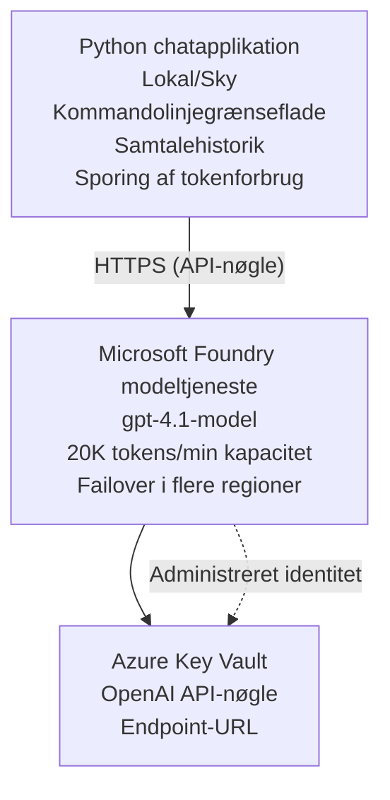

# Microsoft Foundry Models Chat-applikation

**Læringssti:** Mellem ⭐⭐ | **Tid:** 35-45 minutter | **Pris:** $50-200/måned

En komplet Microsoft Foundry Models chat-applikation udrullet ved hjælp af Azure Developer CLI (azd). Dette eksempel demonstrerer gpt-4.1-udrulning, sikker API-adgang og en enkel chatgrænseflade.

## 🎯 Hvad du lærer

- Udrul Microsoft Foundry Models-tjenesten med gpt-4.1-modellen
- Sikre OpenAI API-nøgler med Key Vault
- Byg en enkel chatgrænseflade med Python
- Overvåg tokenforbrug og omkostninger
- Implementer ratebegrænsning og fejlbehandling

## 📦 Hvad er inkluderet

✅ **Microsoft Foundry Models Service** - udrulning af gpt-4.1-modellen  
✅ **Python Chat App** - Enkel kommandolinje-chatgrænseflade  
✅ **Key Vault Integration** - Sikker opbevaring af API-nøgler  
✅ **ARM Templates** - Fuld infrastruktur som kode  
✅ **Cost Monitoring** - Overvågning af tokenforbrug  
✅ **Rate Limiting** - Forhindre udtømning af kvoter  

## Architecture



## Forudsætninger

### Påkrævet

- **Azure Developer CLI (azd)** - [Installationsvejledning](https://learn.microsoft.com/azure/developer/azure-developer-cli/install-azd)
- **Azure-abonnement** med OpenAI-adgang - [Anmod om adgang](https://aka.ms/oai/access)
- **Python 3.9+** - [Installer Python](https://www.python.org/downloads/)

### Bekræft forudsætninger

```bash
# Kontroller azd-version (kræver 1.5.0 eller nyere)
azd version

# Bekræft Azure-login
azd auth login

# Kontroller Python-version
python --version  # eller python3 --version

# Bekræft OpenAI-adgang (tjek i Azure-portalen)
az cognitiveservices account list-skus \
  --kind OpenAI \
  --location eastus
```

> **⚠️ Vigtigt:** Microsoft Foundry Models kræver godkendelse af ansøgning. Hvis du ikke har ansøgt, besøg [aka.ms/oai/access](https://aka.ms/oai/access). Godkendelse tager typisk 1-2 hverdage.

## ⏱️ Udrulningstidslinje

| Fase | Varighed | Hvad sker der |
|-------|----------|--------------|
| Kontrol af forudsætninger | 2-3 minutter | Bekræft tilgængelighed af OpenAI-kvote |
| Udrul infrastruktur | 8-12 minutter | Opret OpenAI, Key Vault, modeludrulning |
| Konfigurer applikation | 2-3 minutter | Opsæt miljø og afhængigheder |
| **Total** | **12-18 minutter** | Klar til chat med gpt-4.1 |

**Bemærk:** Første udrulning af OpenAI kan tage længere tid på grund af modelprovisionering.

## Hurtig start

```bash
# Naviger til eksemplet
cd examples/azure-openai-chat

# Initialiser miljøet
azd env new myopenai

# Udrul alt (infrastruktur + konfiguration)
azd up
# Du vil blive bedt om at:
# 1. Vælg Azure-abonnement
# 2. Vælg en lokation med OpenAI-tilgængelighed (f.eks. eastus, eastus2, westus)
# 3. Vent 12-18 minutter på udrulningen

# Installer Python-afhængigheder
pip install -r requirements.txt

# Begynd at chatte!
python chat.py
```

**Forventet output:**
```
🤖 Microsoft Foundry Models Chat Application
Connected to: gpt-4.1 (eastus)
Type your message (or 'quit' to exit)

You: Hello! Tell me about Microsoft Foundry Models.
Assistant: Microsoft Foundry Models Service provides REST API access to OpenAI's powerful language models including gpt-4.1, GPT-3.5-Turbo, and Embeddings...

[Tokens used: 145 | Estimated cost: $0.0044]
```

## ✅ Bekræft udrulning

### Trin 1: Tjek Azure-ressourcer

```bash
# Vis implementerede ressourcer
azd show

# Forventet output viser:
# - OpenAI-tjeneste: (ressourcens navn)
# - Key Vault: (ressourcens navn)
# - Udrulning: gpt-4.1
# - Placering: eastus (eller din valgte region)
```

### Trin 2: Test OpenAI API

```bash
# Hent OpenAI-endpoint og nøgle
OPENAI_ENDPOINT=$(azd env get-value AZURE_OPENAI_ENDPOINT)
OPENAI_KEY=$(azd env get-value AZURE_OPENAI_API_KEY)

# Test API-opkald
curl "$OPENAI_ENDPOINT/openai/deployments/gpt-4.1/chat/completions?api-version=2024-08-01-preview" \
  -H "Content-Type: application/json" \
  -H "api-key: $OPENAI_KEY" \
  -d '{
    "messages": [{"role": "user", "content": "Say hello!"}],
    "max_tokens": 50
  }'
```

**Forventet respons:**
```json
{
  "choices": [
    {
      "message": {
        "role": "assistant",
        "content": "Hello! How can I assist you today?"
      }
    }
  ],
  "usage": {
    "prompt_tokens": 8,
    "completion_tokens": 9,
    "total_tokens": 17
  }
}
```

### Trin 3: Bekræft Key Vault-adgang

```bash
# Vis hemmeligheder i Key Vault
KV_NAME=$(azd env get-value AZURE_KEY_VAULT_NAME)

az keyvault secret list \
  --vault-name $KV_NAME \
  --query "[].name" \
  --output table
```

**Forventede hemmeligheder:**
- `openai-api-key`
- `openai-endpoint`

Kriterier for succes:
- ✅ OpenAI-tjeneste udrullet med gpt-4.1
- ✅ API-kald returnerer gyldigt svar
- ✅ Hemmeligheder gemt i Key Vault
- ✅ Overvågning af tokenforbrug fungerer

## Projektstruktur

```
azure-openai-chat/
├── README.md                   ✅ This guide
├── azure.yaml                  ✅ AZD configuration
├── infra/                      ✅ Infrastructure as Code
│   ├── main.bicep             ✅ Main Bicep template
│   ├── main.parameters.json   ✅ Parameters
│   └── openai.bicep           ✅ OpenAI resource definition
├── src/                        ✅ Application code
│   ├── chat.py                ✅ Chat interface
│   ├── config.py              ✅ Configuration loader
│   └── requirements.txt       ✅ Python dependencies
└── .gitignore                  ✅ Git ignore rules
```

## Applikationsfunktioner

### Chatgrænseflade (`chat.py`)

Chatapplikationen inkluderer:

- **Samtalehistorik** - Bevarer kontekst på tværs af beskeder
- **Tælling af tokens** - Sporer forbrug og estimerer omkostninger
- **Fejlbehandling** - Håndterer ratebegrænsning og API-fejl elegant
- **Omkostningsestimering** - Real-time omkostningsberegning per besked
- **Streaming-understøttelse** - Valgfrie streamede svar

### Kommandoer

Under chat kan du bruge:
- `quit` or `exit` - Afslut sessionen
- `clear` - Ryd samtalehistorik
- `tokens` - Vis samlet tokenforbrug
- `cost` - Vis estimerede samlede omkostninger

### Konfiguration (`config.py`)

Indlæser konfiguration fra miljøvariabler:
```python
AZURE_OPENAI_ENDPOINT  # Fra Key Vault
AZURE_OPENAI_API_KEY   # Fra Key Vault
AZURE_OPENAI_MODEL     # Standard: gpt-4.1
AZURE_OPENAI_MAX_TOKENS # Standard: 800
```

## Brugseksempler

### Basis chat

```bash
python chat.py
```

### Chat med brugerdefineret model

```bash
export AZURE_OPENAI_MODEL=gpt-35-turbo
python chat.py
```

### Chat med streaming

```bash
python chat.py --stream
```

### Eksempel på samtale

```
You: Explain Microsoft Foundry Models Service in 3 sentences.
Assistant: Microsoft Foundry Models Service is Microsoft Azure's cloud platform offering 
that provides access to OpenAI's powerful language models. It enables developers 
to integrate capabilities like gpt-4.1 into their applications with enterprise-grade 
security and compliance. The service includes features for content filtering, 
abuse monitoring, and responsible AI practices.

[Tokens used: 89 | Estimated cost: $0.0027]

You: What models are available?
Assistant: Microsoft Foundry Models Service offers several model families including gpt-4.1 
(most capable), GPT-3.5-Turbo (faster and cost-effective), and Embeddings models 
for vector search. Each model has different capabilities, pricing, and token limits.

[Tokens used: 67 | Estimated cost: $0.0020]

Total session: 156 tokens | $0.0047
```

## Omkostningsstyring

### Tokenpriser (gpt-4.1)

| Model | Input (pr. 1K tokens) | Output (pr. 1K tokens) |
|-------|----------------------|------------------------|
| gpt-4.1 | $0.03 | $0.06 |
| GPT-3.5-Turbo | $0.0015 | $0.002 |

### Estimerede månedlige omkostninger

Baseret på brugsmønstre:

| Brugerniveau | Beskeder/dag | Tokens/dag | Månedlig omkostning |
|-------------|--------------|------------|--------------|
| **Let** | 20 beskeder | 3.000 tokens | $3-5 |
| **Moderat** | 100 beskeder | 15.000 tokens | $15-25 |
| **Høj** | 500 beskeder | 75.000 tokens | $75-125 |

**Grundlæggende infrastrukturomkostning:** $1-2/måned (Key Vault + minimal compute)

### Tips til omkostningsoptimering

```bash
# 1. Brug GPT-3.5-Turbo til enklere opgaver (20x billigere)
export AZURE_OPENAI_MODEL=gpt-35-turbo

# 2. Reducer maks. tokens for kortere svar
export AZURE_OPENAI_MAX_TOKENS=400

# 3. Overvåg tokenforbruget
python chat.py --show-tokens

# 4. Opsæt budgetalarmer
az consumption budget create \
  --budget-name "openai-budget" \
  --amount 50 \
  --time-grain Monthly
```

## Overvågning

### Se tokenforbrug

```bash
# I Azure-portalen:
# OpenAI-ressource → Målinger → Vælg "Token Transaction"

# Eller via Azure CLI:
az monitor metrics list \
  --resource $(azd env get-value AZURE_OPENAI_RESOURCE_ID) \
  --metric "TokenTransaction" \
  --start-time $(date -u -d '1 hour ago' '+%Y-%m-%dT%H:%M:%S') \
  --interval PT1M
```

### Se API-logs

```bash
# Streame diagnostiske logfiler
az monitor diagnostic-settings create \
  --resource $(azd env get-value AZURE_OPENAI_RESOURCE_ID) \
  --name openai-logs \
  --logs '[{"category": "Audit", "enabled": true}]' \
  --workspace $(azd env get-value LOG_ANALYTICS_WORKSPACE_ID)

# Forespørgselslogfiler
az monitor log-analytics query \
  --workspace $(azd env get-value LOG_ANALYTICS_WORKSPACE_ID) \
  --analytics-query "AzureDiagnostics | where Category == 'Audit' | top 10 by TimeGenerated"
```

## Fejlfinding

### Problem: "Access Denied" fejl

**Symptomer:** 403 Forbidden ved kald til API

**Løsninger:**
```bash
# 1. Bekræft, at OpenAI-adgang er godkendt
az cognitiveservices account show \
  --name $(azd env get-value AZURE_OPENAI_NAME) \
  --resource-group $(azd env get-value AZURE_RESOURCE_GROUP)

# 2. Kontroller, at API-nøglen er korrekt
azd env get-value AZURE_OPENAI_API_KEY

# 3. Bekræft endpoint-URL'ens format
azd env get-value AZURE_OPENAI_ENDPOINT
# Skal være: https://[name].openai.azure.com/
```

### Problem: "Rate Limit Exceeded"

**Symptomer:** 429 Too Many Requests

**Løsninger:**
```bash
# 1. Kontroller den aktuelle kvote
az cognitiveservices account deployment show \
  --name $(azd env get-value AZURE_OPENAI_NAME) \
  --resource-group $(azd env get-value AZURE_RESOURCE_GROUP) \
  --deployment-name gpt-4.1

# 2. Anmod om forøgelse af kvoten (hvis nødvendigt)
# Gå til Azure-portalen → OpenAI-ressource → Kvoter → Anmod om forøgelse

# 3. Implementer genforsøgslogik (allerede i chat.py)
# Applikationen forsøger automatisk igen med eksponentiel backoff
```

### Problem: "Model Not Found"

**Symptomer:** 404 error for deployment

**Løsninger:**
```bash
# 1. Vis tilgængelige udrulninger
az cognitiveservices account deployment list \
  --name $(azd env get-value AZURE_OPENAI_NAME) \
  --resource-group $(azd env get-value AZURE_RESOURCE_GROUP)

# 2. Bekræft modelnavn i miljøet
echo $AZURE_OPENAI_MODEL

# 3. Opdater til det korrekte udrulningsnavn
export AZURE_OPENAI_MODEL=gpt-4.1  # eller gpt-35-turbo
```

### Problem: Høj latenstid

**Symptomer:** Langsomme svartider (>5 sekunder)

**Løsninger:**
```bash
# 1. Kontroller regional latenstid
# Udrul til den region, der er tættest på brugerne

# 2. Reducer max_tokens for hurtigere svar
export AZURE_OPENAI_MAX_TOKENS=400

# 3. Brug streaming for en bedre brugeroplevelse
python chat.py --stream
```

## Sikkerhedspraksis

### 1. Beskyt API-nøgler

```bash
# Tjek aldrig nøgler ind i versionskontrollen
# Brug Key Vault (allerede konfigureret)

# Roter nøgler regelmæssigt
az cognitiveservices account keys regenerate \
  --name $(azd env get-value AZURE_OPENAI_NAME) \
  --resource-group $(azd env get-value AZURE_RESOURCE_GROUP) \
  --key-name key1
```

### 2. Implementer indholdsfiltrering

```python
# Microsoft Foundry-modeller inkluderer indbygget indholdsfiltrering
# Konfigurer i Azure-portalen:
# OpenAI-ressource → Indholdsfiltre → Opret brugerdefineret filter

# Kategorier: Had, Seksuelt indhold, Vold, Selvskade
# Niveauer: Lav, Mellem, Høj filtrering
```

### 3. Brug Managed Identity (produktion)

```bash
# Ved produktionsudrulninger skal du bruge administreret identitet
# i stedet for API-nøgler (kræver, at appen hostes på Azure)

# Opdater infra/openai.bicep for at inkludere:
# identity: { type: 'SystemAssigned' }
```

## Udvikling

### Kør lokalt

```bash
# Installer afhængigheder
pip install -r src/requirements.txt

# Indstil miljøvariabler
export AZURE_OPENAI_ENDPOINT="https://[name].openai.azure.com/"
export AZURE_OPENAI_API_KEY="your-api-key"
export AZURE_OPENAI_MODEL="gpt-4.1"

# Kør applikationen
python src/chat.py
```

### Kør tests

```bash
# Installer testafhængigheder
pip install pytest pytest-cov

# Kør tests
pytest tests/ -v

# Med testdækning
pytest tests/ --cov=src --cov-report=html
```

### Opdater modeludrulning

```bash
# Udrul en anden modelversion
az cognitiveservices account deployment create \
  --name $(azd env get-value AZURE_OPENAI_NAME) \
  --resource-group $(azd env get-value AZURE_RESOURCE_GROUP) \
  --deployment-name gpt-35-turbo \
  --model-name gpt-35-turbo \
  --model-version "0613" \
  --model-format OpenAI \
  --sku-capacity 20 \
  --sku-name "Standard"
```

## Ryd op

```bash
# Slet alle Azure-ressourcer
azd down --force --purge

# Dette fjerner:
# - OpenAI-tjeneste
# - Key Vault (med 90-dages blød sletning)
# - Ressourcegruppe
# - Alle udrulninger og konfigurationer
```

## Næste trin

### Udvid dette eksempel

1. **Tilføj webgrænseflade** - Byg React/Vue frontend
   ```bash
   # Tilføj frontend-tjeneste til azure.yaml
   # Udrul til Azure Static Web Apps
   ```

2. **Implementer RAG** - Tilføj dokumentsøgning med Azure AI Search
   ```python
   # Integrer Azure AI Search
   # Upload dokumenter og opret vektorindeks
   ```

3. **Tilføj funktionsopkald** - Aktivér brug af værktøjer
   ```python
   # Definer funktioner i chat.py
   # Lad gpt-4.1 kalde eksterne API'er
   ```

4. **Understøttelse af flere modeller** - Udrul flere modeller
   ```bash
   # Tilføj gpt-35-turbo og embeddings-modeller
   # Implementer logik til routing af modeller
   ```

### Relaterede eksempler

- **[Retail Multi-Agent](../retail-scenario.md)** - Avanceret multi-agent-arkitektur
- **[Database App](../../../../examples/database-app)** - Tilføj vedvarende lagring
- **[Container Apps](../../../../examples/container-app)** - Udrul som containeriseret service

### Læringsressourcer

- 📚 [AZD For Beginners Course](../../README.md) - Kursusets hovedside
- 📚 [Microsoft Foundry Models Documentation](https://learn.microsoft.com/azure/ai-services/openai/) - Officiel dokumentation
- 📚 [OpenAI API Reference](https://platform.openai.com/docs/api-reference) - API-detaljer
- 📚 [Responsible AI](https://www.microsoft.com/ai/responsible-ai) - Bedste praksis

## Yderligere ressourcer

### Dokumentation
- **[Microsoft Foundry Models Service](https://learn.microsoft.com/azure/ai-services/openai/)** - Fuld guide
- **[gpt-4.1 Models](https://learn.microsoft.com/azure/ai-services/openai/concepts/models)** - Modelfunktioner
- **[Content Filtering](https://learn.microsoft.com/azure/ai-services/openai/concepts/content-filter)** - Sikkerhedsfunktioner
- **[Azure Developer CLI](https://learn.microsoft.com/azure/developer/azure-developer-cli/)** - azd-reference

### Vejledninger
- **[OpenAI Quickstart](https://learn.microsoft.com/azure/ai-services/openai/quickstart)** - Første udrulning
- **[Chat Completions](https://learn.microsoft.com/azure/ai-services/openai/how-to/chatgpt)** - Byg chatapplikationer
- **[Function Calling](https://learn.microsoft.com/azure/ai-services/openai/how-to/function-calling)** - Avancerede funktioner

### Værktøjer
- **[Microsoft Foundry Models Studio](https://oai.azure.com/)** - Web-baseret legeplads
- **[Prompt Engineering Guide](https://platform.openai.com/docs/guides/prompt-engineering)** - Skriv bedre prompts
- **[Token Calculator](https://platform.openai.com/tokenizer)** - Estimér tokenforbrug

### Fællesskab
- **[Azure AI Discord](https://discord.gg/azure)** - Få hjælp fra fællesskabet
- **[GitHub Discussions](https://github.com/Azure-Samples/openai/discussions)** - Q&A-forum
- **[Azure Blog](https://azure.microsoft.com/blog/tag/azure-openai-service/)** - Seneste opdateringer

---

**🎉 Succes!** Du har udrullet Microsoft Foundry Models og bygget en fungerende chatapplikation. Begynd at udforske gpt-4.1's muligheder og eksperimenter med forskellige prompts og anvendelsestilfælde.

**Spørgsmål?** [Opret et issue](https://github.com/microsoft/AZD-for-beginners/issues) eller se [FAQ](../../resources/faq.md)

**Omkostningsadvarsel:** Husk at køre `azd down`, når du er færdig med testning, for at undgå løbende omkostninger (~$50-100/måned ved aktiv brug).

---

<!-- CO-OP TRANSLATOR DISCLAIMER START -->
**Ansvarsfraskrivelse**:
Dette dokument er blevet oversat ved hjælp af AI-oversættelsestjenesten [Co-op Translator](https://github.com/Azure/co-op-translator). Selvom vi bestræber os på nøjagtighed, skal du være opmærksom på, at automatiserede oversættelser kan indeholde fejl eller unøjagtigheder. Det originale dokument på dets oprindelige sprog bør betragtes som den autoritative kilde. For kritisk information anbefales professionel menneskelig oversættelse. Vi påtager os intet ansvar for misforståelser eller fejltolkninger, der opstår som følge af brugen af denne oversættelse.
<!-- CO-OP TRANSLATOR DISCLAIMER END -->