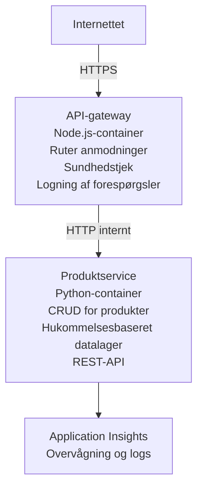

# Microservices-arkitektur - Container App-eksempel

⏱️ **Anslået tid**: 25-35 minutter | 💰 **Anslået pris**: ~$50-100/month | ⭐ **Kompleksitet**: Avanceret

En **forenklet men funktionel** microservices-arkitektur udrullet til Azure Container Apps ved hjælp af AZD CLI. Dette eksempel demonstrerer tjeneste-til-tjeneste-kommunikation, containerorkestrering og overvågning med en praktisk opsætning med 2 tjenester.

> **📚 Læringsmetode**: Dette eksempel starter med en minimal 2-tjeneste-arkitektur (API Gateway + Backend Service), som du rent faktisk kan udrulle og lære af. Efter at have mestret dette fundament giver vi vejledning til at udvide til et fuldt microservices-økosystem.

## Hvad du vil lære

Ved at gennemføre dette eksempel vil du:
- Udrulle flere containere til Azure Container Apps
- Implementere tjeneste-til-tjeneste-kommunikation med intern netværkning
- Konfigurere miljøbaseret skalering og helbredstjek
- Overvåge distribuerede applikationer med Application Insights
- Forstå udrulningsmønstre og bedste praksis for mikrotjenester
- Lære progressiv udvidelse fra simple til komplekse arkitekturer

## Arkitektur

### Fase 1: Hvad vi bygger (inkluderet i dette eksempel)


**Hvorfor starte enkelt?**
- ✅ Udrul og forstå hurtigt (25-35 minutter)
- ✅ Lær kerneprincipper for mikrotjenestemønstre uden kompleksitet
- ✅ Arbejdende kode, som du kan ændre og eksperimentere med
- ✅ Lavere omkostninger til læring (~$50-100/month vs $300-1400/month)
- ✅ Opbyg selvtillid før du tilføjer databaser og message queues

**Analogi**: Tænk på det som at lære at køre bil. Du starter på en tom parkeringsplads (2 tjenester), mestrer det grundlæggende, og går derefter videre til bytrafik (5+ tjenester med databaser).

### Fase 2: Fremtidig udvidelse (referencearkitektur)

Når du har mestret 2-tjeneste-arkitekturen, kan du udvide til:

```
Full Architecture (Not Included - For Reference)
├── API Gateway (✅ Included)
├── Product Service (✅ Included)
├── Order Service (🔜 Add next)
├── User Service (🔜 Add next)
├── Notification Service (🔜 Add last)
├── Azure Service Bus (🔜 For async communication)
├── Cosmos DB (🔜 For product persistence)
├── Azure SQL (🔜 For order management)
└── Azure Storage (🔜 For file storage)
```

Se sektionen "Expansion Guide" i slutningen for trin-for-trin instruktioner.

## Inkluderede funktioner

✅ **Service Discovery**: Automatisk DNS-baseret opdagelse mellem containere  
✅ **Load Balancing**: Indbygget load balancing på tværs af replikaer  
✅ **Auto-scaling**: Uafhængig skalering pr. tjeneste baseret på HTTP-forespørgsler  
✅ **Helbredsmonitorering**: Liveness og readiness probes for begge tjenester  
✅ **Distribueret logning**: Centraliseret logning med Application Insights  
✅ **Intern netværkning**: Sikker tjeneste-til-tjeneste-kommunikation  
✅ **Containerorkestrering**: Automatisk udrulning og skalering  
✅ **Opdateringer uden nedetid**: Rolling updates med revisionsstyring  

## Forudsætninger

### Nødvendige værktøjer

Før du går i gang, verificer at du har disse værktøjer installeret:

1. **[Azure Developer CLI (azd)](https://learn.microsoft.com/azure/developer/azure-developer-cli/install-azd)** (version 1.0.0 eller nyere)  
   ```bash
   azd version
   # Forventet output: azd version 1.0.0 eller højere
   ```

2. **[Azure CLI](https://learn.microsoft.com/cli/azure/install-azure-cli)** (version 2.50.0 eller nyere)  
   ```bash
   az --version
   # Forventet output: azure-cli 2.50.0 eller højere
   ```

3. **[Docker](https://www.docker.com/get-started)** (til lokal udvikling/test - valgfrit)  
   ```bash
   docker --version
   # Forventet output: Docker-version 20.10 eller nyere
   ```

### Azure-krav

- Et aktivt **Azure-abonnement** ([opret en gratis konto](https://azure.microsoft.com/free/))  
- Tilladelser til at oprette ressourcer i dit abonnement  
- **Contributor**-rollen på abonnementet eller ressourcegruppen

### Forudgående viden

Dette er et eksempel på **avanceret niveau**. Du bør have:
- Gennemført [Simple Flask API-eksempel](../../../../../examples/container-app/simple-flask-api)  
- Grundlæggende forståelse af mikrotjenestearkitektur  
- Kendskab til REST API'er og HTTP  
- Forståelse af containerkoncepter

**Ny til Container Apps?** Start med [Simple Flask API-eksemplet](../../../../../examples/container-app/simple-flask-api) først for at lære det grundlæggende.

## Hurtigstart (trin for trin)

### Trin 1: Klon og naviger

```bash
git clone https://github.com/microsoft/AZD-for-beginners.git
cd AZD-for-beginners/examples/container-app/microservices
```

**✓ Succescheck**: Bekræft at du ser `azure.yaml`:
```bash
ls
# Forventet: README.md, azure.yaml, infra/, src/
```

### Trin 2: Autentificer med Azure

```bash
azd auth login
```

Dette åbner din browser for Azure-autentificering. Log ind med dine Azure-legitimationsoplysninger.

**✓ Succescheck**: Du bør se:
```
Logged in to Azure.
```

### Trin 3: Initialiser miljøet

```bash
azd init
```

**De prompts, du vil se**:
- **Miljønavn**: Indtast et kort navn (f.eks. `microservices-dev`)
- **Azure-abonnement**: Vælg dit abonnement
- **Azure-lokation**: Vælg en region (f.eks. `eastus`, `westeurope`)

**✓ Succescheck**: Du bør se:
```
SUCCESS: New project initialized!
```

### Trin 4: Udrul infrastruktur og tjenester

```bash
azd up
```

**Hvad sker der** (tager 8-12 minutter):
1. Opretter Container Apps-miljø
2. Opretter Application Insights til overvågning
3. Bygger API Gateway-container (Node.js)
4. Bygger Product Service-container (Python)
5. Udruller begge containere til Azure
6. Konfigurerer netværk og helbredstjek
7. Opsætter overvågning og logning

**✓ Succescheck**: Du bør se:
```
SUCCESS: Your application was deployed to Azure in X minutes Y seconds.
Endpoint: https://api-gateway-<unique-id>.azurecontainerapps.io
```

**⏱️ Tid**: 8-12 minutter

### Trin 5: Test udrulningen

```bash
# Hent gateway-endepunktet
GATEWAY_URL=$(azd env get-values | grep API_GATEWAY_URL | cut -d '=' -f2 | tr -d '"')

# Test API-gatewayens sundhed
curl $GATEWAY_URL/health

# Forventet output:
# {"status":"healthy","service":"api-gateway","timestamp":"2025-11-19T10:30:00Z"}
```

**Test produktservice via gateway**:
```bash
# Vis produkter
curl $GATEWAY_URL/api/products

# Forventet output:
# [
#   {"id":1,"name":"Laptop","price":999.99,"stock":50},
#   {"id":2,"name":"Mouse","price":29.99,"stock":200},
#   {"id":3,"name":"Keyboard","price":79.99,"stock":150}
# ]
```

**✓ Succescheck**: Begge endpoints returnerer JSON-data uden fejl.

---

**🎉 Tillykke!** Du har udrullet en mikrotjenestearkitektur til Azure!

## Projektstruktur

Alle implementeringsfiler er inkluderet—dette er et komplet, fungerende eksempel:

```
microservices/
│
├── README.md                         # This file
├── azure.yaml                        # AZD configuration
├── .gitignore                        # Git ignore patterns
│
├── infra/                           # Infrastructure as Code (Bicep)
│   ├── main.bicep                   # Main orchestration
│   ├── abbreviations.json           # Naming conventions
│   ├── core/                        # Shared infrastructure
│   │   ├── container-apps-environment.bicep  # Container environment + registry
│   │   └── monitor.bicep            # Application Insights + Log Analytics
│   └── app/                         # Service definitions
│       ├── api-gateway.bicep        # API Gateway container app
│       └── product-service.bicep    # Product Service container app
│
└── src/                             # Application source code
    ├── api-gateway/                 # Node.js API Gateway
    │   ├── app.js                   # Express server with routing
    │   ├── package.json             # Node dependencies
    │   └── Dockerfile               # Container definition
    └── product-service/             # Python Product Service
        ├── main.py                  # Flask API with product data
        ├── requirements.txt         # Python dependencies
        └── Dockerfile               # Container definition
```

**Hvad hver komponent gør:**

**Infrastruktur (infra/)**:
- `main.bicep`: Orkestrerer alle Azure-ressourcer og deres afhængigheder
- `core/container-apps-environment.bicep`: Opretter Container Apps-miljøet og Azure Container Registry
- `core/monitor.bicep`: Opsætter Application Insights til distribueret logning
- `app/*.bicep`: Individuelle container app-definitioner med skalering og helbredstjek

**API Gateway (src/api-gateway/)**:
- Offentlig tjeneste, der ruter forespørgsler til backend-tjenester
- Implementerer logning, fejlhåndtering og videresendelse af forespørgsler
- Demonstrerer HTTP-kommunikation mellem tjenester

**Produktservice (src/product-service/)**:
- Intern tjeneste med produktkatalog (i hukommelsen for enkelhed)
- REST API med helbredstjek
- Eksempel på backend-mikrotjenestemønster

## Oversigt over tjenester

### API Gateway (Node.js/Express)

**Port**: 8080  
**Adgang**: Offentlig (ekstern ingress)  
**Formål**: Ruter indkommende forespørgsler til relevante backend-tjenester  

**Endpoints**:
- `GET /` - Tjenesteinformation
- `GET /health` - Helbredstjek-endpoint
- `GET /api/products` - Videresend til produktservice (liste alle)
- `GET /api/products/:id` - Videresend til produktservice (hent efter ID)

**Nøglefunktioner**:
- Forespørgselsrouting med axios
- Centraliseret logning
- Fejlhåndtering og timeout-styring
- Service discovery via miljøvariabler
- Application Insights-integration

**Kodeuddrag** (`src/api-gateway/app.js`):
```javascript
// Intern tjenestekommunikation
app.get('/api/products', async (req, res) => {
  const response = await axios.get(`${PRODUCT_SERVICE_URL}/products`);
  res.json(response.data);
});
```

### Produktservice (Python/Flask)

**Port**: 8000  
**Adgang**: Kun intern (ingen ekstern ingress)  
**Formål**: Håndterer produktkatalog med data i hukommelsen  

**Endpoints**:
- `GET /` - Tjenesteinformation
- `GET /health` - Helbredstjek-endpoint
- `GET /products` - List alle produkter
- `GET /products/<id>` - Hent produkt efter ID

**Nøglefunktioner**:
- RESTful API med Flask
- Produktlager i hukommelsen (enkelt, ingen database nødvendig)
- Helbredsmonitorering med probes
- Struktureret logning
- Application Insights-integration

**Datamodel**:
```python
{
  "id": 1,
  "name": "Laptop",
  "description": "High-performance laptop",
  "price": 999.99,
  "stock": 50
}
```

**Hvorfor kun intern?**
Produktservicen er ikke eksponeret offentligt. Alle forespørgsler skal gå gennem API Gateway, som giver:
- Sikkerhed: Kontrolleret adgangspunkt
- Fleksibilitet: Kan ændre backend uden at påvirke klienter
- Overvågning: Centraliseret forespørgselslogning

## Forståelse af tjenestekommunikation

### Hvordan tjenester kommunikerer med hinanden

I dette eksempel kommunikerer API Gateway med Produktservicen ved hjælp af **interne HTTP-kald**:

```javascript
// API-gateway (src/api-gateway/app.js)
const PRODUCT_SERVICE_URL = process.env.PRODUCT_SERVICE_URL;

// Foretag intern HTTP-anmodning
const response = await axios.get(`${PRODUCT_SERVICE_URL}/products`);
```

**Vigtige punkter**:

1. **DNS-baseret opdagelse**: Container Apps leverer automatisk DNS for interne tjenester
   - Produktservice FQDN: `product-service.internal.<environment>.azurecontainerapps.io`
   - Forenklet som: `http://product-service` (Container Apps løser det)

2. **Ingen offentlig eksponering**: Produktservice har `external: false` i Bicep
   - Kun tilgængelig inden for Container Apps-miljøet
   - Kan ikke nås fra internettet

3. **Miljøvariabler**: Tjeneste-URL'er indsættes ved udrulningstidspunktet
   - Bicep sender den interne FQDN til gatewayen
   - Ingen hardcodede URL'er i applikationskoden

**Analogi**: Tænk på det som kontorværelser. API Gateway er receptionen (offentlig), og Produktservicen er et kontor (kun internt). Besøgende skal gå gennem receptionen for at nå et kontor.

## Udrulningsmuligheder

### Fuld udrulning (anbefalet)

```bash
# Udrul infrastruktur og begge tjenester
azd up
```

Dette udruller:
1. Container Apps-miljø
2. Application Insights
3. Container Registry
4. API Gateway-container
5. Produktservice-container

**Tid**: 8-12 minutter

### Udrul individuel tjeneste

```bash
# Udrul kun én tjeneste (efter den indledende azd up)
azd deploy api-gateway

# Eller udrul produkttjenesten
azd deploy product-service
```

**Brugstilfælde**: Når du har opdateret kode i én tjeneste og kun vil udrulle den tjeneste.

### Opdater konfiguration

```bash
# Ændr skaleringsparametre
azd env set GATEWAY_MAX_REPLICAS 30

# Udrul igen med ny konfiguration
azd up
```

## Konfiguration

### Skaleringskonfiguration

Begge tjenester er konfigureret med HTTP-baseret autoskalering i deres Bicep-filer:

**API Gateway**:
- Min replikaer: 2 (altid mindst 2 for tilgængelighed)
- Max replikaer: 20
- Scale trigger: 50 samtidige forespørgsler pr. replika

**Produktservice**:
- Min replikaer: 1 (kan skaleres til nul hvis nødvendigt)
- Max replikaer: 10
- Scale trigger: 100 samtidige forespørgsler pr. replika

**Tilpas skalering** (i `infra/app/*.bicep`):
```bicep
scale: {
  minReplicas: 1
  maxReplicas: 10
  rules: [
    {
      name: 'http-scale-rule'
      http: {
        metadata: {
          concurrentRequests: '100'  // Adjust this
        }
      }
    }
  ]
}
```

### Ressourceallokering

**API Gateway**:
- CPU: 1.0 vCPU
- Hukommelse: 2 GiB
- Årsag: Håndterer al ekstern trafik

**Produktservice**:
- CPU: 0.5 vCPU
- Hukommelse: 1 GiB
- Årsag: Letvægts in-memory-operationer

### Helbredstjek

Begge tjenester inkluderer liveness og readiness probes:

```bicep
probes: [
  {
    type: 'Liveness'
    httpGet: {
      path: '/health'
      port: 8080
    }
    initialDelaySeconds: 10
    periodSeconds: 30
  }
  {
    type: 'Readiness'
    httpGet: {
      path: '/health'
      port: 8080
    }
    initialDelaySeconds: 5
    periodSeconds: 10
  }
]
```

**Hvad dette betyder**:
- **Liveness**: Hvis helbredstjek fejler, genstarter Container Apps containeren
- **Readiness**: Hvis ikke klar, stopper Container Apps med at rute trafik til den replikaen


## Overvågning og observerbarhed

### Vis tjenestelogfiler

```bash
# Vis logfiler ved hjælp af azd monitor
azd monitor --logs

# Eller brug Azure CLI for specifikke Container Apps:
# Stream logfiler fra API-gateway
az containerapp logs show --name api-gateway --resource-group $RG_NAME --follow

# Vis nylige logfiler for produktservicen
az containerapp logs show --name product-service --resource-group $RG_NAME --tail 100
```

**Forventet output**:
```
[api-gateway] API Gateway listening on port 8080
[api-gateway] Product Service URL: http://product-service
[api-gateway] GET /api/products 200 - 45ms
[product-service] Retrieved 5 products
```

### Application Insights-forespørgsler

Få adgang til Application Insights i Azure Portal, og kør derefter disse forespørgsler:

**Find langsomme forespørgsler**:
```kusto
requests
| where timestamp > ago(1h)
| where duration > 1000  // Requests taking >1 second
| summarize count() by name, cloud_RoleName
| order by count_ desc
```

**Spor tjeneste-til-tjeneste-kald**:
```kusto
dependencies
| where timestamp > ago(1h)
| where type == "Http"
| project timestamp, name, target, duration, success
| order by timestamp desc
```

**Fejlrate efter tjeneste**:
```kusto
exceptions
| where timestamp > ago(24h)
| summarize errorCount = count() by cloud_RoleName, type
| order by errorCount desc
```

**Forespørgselsvolumen over tid**:
```kusto
requests
| where timestamp > ago(1h)
| summarize requestCount = count() by bin(timestamp, 5m), cloud_RoleName
| render timechart
```

### Adgang til overvågningsdashboard

```bash
# Hent Application Insights-detaljer
azd env get-values | grep APPLICATIONINSIGHTS

# Åbn overvågning i Azure-portalen
az monitor app-insights component show \
  --app $(azd env get-values | grep APPLICATIONINSIGHTS_CONNECTION_STRING | cut -d '=' -f2) \
  --resource-group $(azd env get-values | grep AZURE_RESOURCE_GROUP | cut -d '=' -f2) \
  --query "appId" -o tsv
```

### Live-metrikker

1. Naviger til Application Insights i Azure Portal
2. Klik på "Live Metrics"
3. Se realtidsforespørgsler, fejl og ydeevne
4. Test ved at køre: `curl $(azd env get-values | grep API_GATEWAY_URL | cut -d '=' -f2 | tr -d '"')/api/products`

## Praktiske øvelser

[Note: Se de fulde øvelser ovenfor i sektionen "Practical Exercises" for detaljerede trin-for-trin øvelser inklusive verifikation af udrulning, dataændring, autoscaling-tests, fejlhåndtering og tilføjelse af en tredje tjeneste.]

## Omkostningsanalyse

### Anslåede månedlige omkostninger (for dette 2-tjeneste-eksempel)

| Resource | Configuration | Estimated Cost |
|----------|--------------|----------------|
| API Gateway | 2-20 replicas, 1 vCPU, 2GB RAM | $30-150 |
| Product Service | 1-10 replicas, 0.5 vCPU, 1GB RAM | $15-75 |
| Container Registry | Basic tier | $5 |
| Application Insights | 1-2 GB/month | $5-10 |
| Log Analytics | 1 GB/month | $3 |
| **Total** | | **$58-243/month** |

**Omkostningsfordeling efter brug**:
- **Lav trafik** (test/læring): ~$60/month
- **Mellem trafik** (lille produktion): ~$120/month
- **Høj trafik** (travle perioder): ~$240/month

### Tips til omkostningsoptimering

1. **Skaler til nul for udvikling**:
   ```bicep
   scale: {
     minReplicas: 0  // Save $30-40/month when not in use
     maxReplicas: 10
   }
   ```

2. **Brug Consumption Plan for Cosmos DB** (når du tilføjer det):
   - Betal kun for hvad du bruger
   - Ingen minimumsafgift

3. **Indstil sampling i Application Insights**:
   ```javascript
   appInsights.defaultClient.config.samplingPercentage = 50; // Udtag 50% af forespørgslerne
   ```

4. **Ryd op når det ikke er nødvendigt**:
   ```bash
   azd down
   ```

### Muligheder i gratisniveau

For læring/test overvej:
- Brug Azure gratis kredit (de første 30 dage)
- Hold antallet af replikaer på et minimum
- Slet efter test (ingen løbende omkostninger)

---

## Oprydning

For at undgå løbende omkostninger, slet alle ressourcer:

```bash
azd down --force --purge
```

**Bekræftelsesprompt**:
```
? Total resources to delete: 6, are you sure you want to continue? (y/N)
```

Skriv `y` for at bekræfte.

**Hvad bliver slettet**:
- Container Apps Environment
- Begge Container Apps (gateway & product service)
- Container Registry
- Application Insights
- Log Analytics Workspace
- Resource Group

**✓ Bekræft oprydning**:
```bash
az group list --query "[?starts_with(name,'rg-microservices')]" --output table
```

Bør returnere tomt.

---

## Udvidelsesvejledning: Fra 2 til 5+ tjenester

Når du har mestret denne 2-tjenesters arkitektur, er her hvordan du udvider:

### Fase 1: Tilføj databasepersistens (næste trin)

**Tilføj Cosmos DB til product service**:

1. Opret `infra/core/cosmos.bicep`:
   ```bicep
   resource cosmosAccount 'Microsoft.DocumentDB/databaseAccounts@2023-04-15' = {
     name: name
     location: location
     kind: 'GlobalDocumentDB'
     properties: {
       databaseAccountOfferType: 'Standard'
       locations: [{ locationName: location, failoverPriority: 0 }]
     }
   }
   ```

2. Opdater product service til at bruge Cosmos DB i stedet for in-memory-data

3. Anslået ekstra omkostning: ~$25/måned (serverløs)

### Fase 2: Tilføj en tredje tjeneste (ordrehåndtering)

**Opret Order Service**:

1. Ny mappe: `src/order-service/` (Python/Node.js/C#)
2. Ny Bicep: `infra/app/order-service.bicep`
3. Opdater API-gateway til at rute `/api/orders`
4. Tilføj Azure SQL Database til ordrepersistens

**Arkitekturen bliver**:
```
API Gateway → Product Service (Cosmos DB)
           → Order Service (Azure SQL)
```

### Fase 3: Tilføj asynkron kommunikation (Service Bus)

**Implementer begivenhedsdrevet arkitektur**:

1. Tilføj Azure Service Bus: `infra/core/servicebus.bicep`
2. Product Service publicerer "ProductCreated"-hændelser
3. Order Service abonnerer på produktevents
4. Tilføj Notification Service til at behandle begivenheder

**Mønster**: Request/Response (HTTP) + Begivenhedsdrevet (Service Bus)

### Fase 4: Tilføj brugerautentificering

**Implementer User Service**:

1. Opret `src/user-service/` (Go/Node.js)
2. Tilføj Azure AD B2C eller brugerdefineret JWT-autentificering
3. API-gateway validerer tokens
4. Services kontrollerer brugerrettigheder

### Fase 5: Produktionsparathed

**Tilføj disse komponenter**:
- Azure Front Door (global load-balancering)
- Azure Key Vault (hemmelighedshåndtering)
- Azure Monitor Workbooks (tilpassede dashboards)
- CI/CD-pipeline (GitHub Actions)
- Blue-Green-implementeringer
- Managed Identity for alle services

**Total omkostning for fuld produktionsarkitektur**: ~$300-1,400/måned

---

## Lær mere

### Relateret dokumentation
- [Azure Container Apps-dokumentation](https://learn.microsoft.com/azure/container-apps/)
- [Guide til microservices-arkitektur](https://learn.microsoft.com/azure/architecture/guide/architecture-styles/microservices)
- [Application Insights til distribueret tracing](https://learn.microsoft.com/azure/azure-monitor/app/distributed-tracing)
- [Azure Developer CLI-dokumentation](https://learn.microsoft.com/azure/developer/azure-developer-cli/)

### Næste trin i dette kursus
- ← Forrige: [Simple Flask API](../../../../../examples/container-app/simple-flask-api) - Begynder eksempel med enkelt container
- → Næste: [AI Integrationsguide](../../../../../examples/docs/ai-foundry) - Tilføj AI-funktioner
- 🏠 [Kursusforside](../../README.md)

### Sammenligning: Hvornår skal man bruge hvad

**Single Container App** (Simple Flask API-eksempel):
- ✅ Enkle applikationer
- ✅ Monolitisk arkitektur
- ✅ Hurtig at udrulle
- ❌ Begrænset skalerbarhed
- **Omkostning**: ~$15-50/måned

**Microservices** (Dette eksempel):
- ✅ Komplekse applikationer
- ✅ Uafhængig skalering per tjeneste
- ✅ Teamautonomi (forskellige services, forskellige teams)
- ❌ Mere komplekst at administrere
- **Omkostning**: ~$60-250/måned

**Kubernetes (AKS)**:
- ✅ Maksimal kontrol og fleksibilitet
- ✅ Multicloud-portabilitet
- ✅ Avanceret netværk
- ❌ Kræver Kubernetes-ekspertise
- **Omkostning**: ~$150-500/måned minimum

**Anbefaling**: Start med Container Apps (dette eksempel), skift til AKS kun hvis du har brug for Kubernetes-specifikke funktioner.

---

## Ofte stillede spørgsmål

**Q: Hvorfor kun 2 tjenester i stedet for 5+?**  
A: Uddannelsesmæssig progression. Mestér grundlæggende principper (servicekommunikation, overvågning, skalering) med et simpelt eksempel, før du tilføjer kompleksitet. De mønstre, du lærer her, gælder for arkitekturer med 100 tjenester.

**Q: Kan jeg selv tilføje flere tjenester?**  
A: Absolut! Følg udvidelsesvejledningen ovenfor. Hver ny tjeneste følger samme mønster: opret src-mappe, opret Bicep-fil, opdater azure.yaml, deploy.

**Q: Er dette klar til produktion?**  
A: Det er et solidt fundament. Til produktion skal du tilføje: managed identity, Key Vault, persistente databaser, CI/CD-pipeline, overvågningsalarmer og backup-strategi.

**Q: Hvorfor ikke bruge Dapr eller andre service-mesh?**  
A: Hold det simpelt for læring. Når du forstår det indbyggede Container Apps-netværk, kan du tilføje Dapr for avancerede scenarier.

**Q: Hvordan debugger jeg lokalt?**  
A: Kør tjenester lokalt med Docker:
```bash
cd src/api-gateway
docker build -t local-gateway .
docker run -p 8080:8080 -e PRODUCT_SERVICE_URL=http://localhost:8000 local-gateway
```

**Q: Kan jeg bruge forskellige programmeringssprog?**  
A: Ja! Dette eksempel viser Node.js (gateway) + Python (product service). Du kan blande alle sprog, der kan køre i containere.

**Q: Hvad hvis jeg ikke har Azure-kredit?**  
A: Brug Azure gratis kredit (de første 30 dage for nye konti) eller udrul til korte testperioder og slet med det samme.

---

> **🎓 Læringsoversigt**: Du har lært at udrulle en flertjenestearkitektur med automatisk skalering, internt netværk, centraliseret overvågning og produktionsparate mønstre. Dette fundament forbereder dig til komplekse distribuerede systemer og virksomheds-microservices-arkitekturer.

**📚 Kursusnavigation:**
- ← Forrige: [Simple Flask API](../../../../../examples/container-app/simple-flask-api)
- → Næste: [Database Integration Example](../../../../../examples/database-app) - Tilføj AI-funktioner
- 🏠 [Kursusforside](../../../README.md)
- 📖 [Container Apps bedste praksis](../../../docs/chapter-04-infrastructure/deployment-guide.md)

---

<!-- CO-OP TRANSLATOR DISCLAIMER START -->
**Disclaimer**:
Dette dokument er blevet oversat ved hjælp af AI-oversættelsestjenesten [Co-op Translator](https://github.com/Azure/co-op-translator). Selvom vi bestræber os på nøjagtighed, skal du være opmærksom på, at automatiske oversættelser kan indeholde fejl eller unøjagtigheder. Det oprindelige dokument på dets originalsprog bør betragtes som den autoritative kilde. For kritiske oplysninger anbefales professionel menneskelig oversættelse. Vi er ikke ansvarlige for eventuelle misforståelser eller fejltolkninger, der opstår som følge af brugen af denne oversættelse.
<!-- CO-OP TRANSLATOR DISCLAIMER END -->