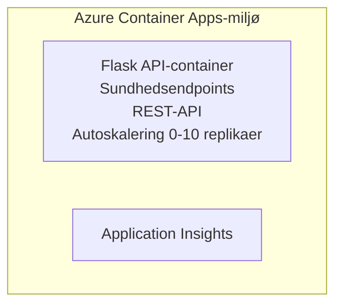

# Simpel Flask-API - Container App-eksempel

**Læringssti:** Begynder ⭐ | **Tid:** 25-35 minutter | **Pris:** $0-15/måned

En komplet, fungerende Python Flask REST API udrullet til Azure Container Apps ved hjælp af Azure Developer CLI (azd). Dette eksempel demonstrerer containerudrulning, autoskalering og grundlæggende overvågning.

## 🎯 Hvad du vil lære

- Udrul en containeriseret Python-applikation til Azure
- Konfigurer autoskalering med scale-to-zero
- Implementér health probes og readiness checks
- Overvåg applikationslogs og metrics
- Brug Azure Developer CLI til hurtig udrulning

## 📦 Hvad der er inkluderet

✅ **Flask-applikation** - Færdig REST-API med CRUD-operationer (`src/app.py`)  
✅ **Dockerfile** - Produktionsklar containerkonfiguration  
✅ **Bicep-infrastruktur** - Container Apps-miljø og API-udrulning  
✅ **AZD-konfiguration** - Udrulning med én kommando  
✅ **Health Probes** - Liveness- og readiness-checks konfigureret  
✅ **Auto-skalering** - 0-10 replikaer baseret på HTTP-belastning  

## Arkitektur


## Forudsætninger

### Krævet
- **Azure Developer CLI (azd)** - [Installationsvejledning](https://learn.microsoft.com/azure/developer/azure-developer-cli/install-azd)
- **Azure-abonnement** - [Gratis konto](https://azure.microsoft.com/free/)
- **Docker Desktop** - [Installer Docker](https://www.docker.com/products/docker-desktop/) (til lokal test)

### Bekræft forudsætninger

```bash
# Kontroller azd-version (kræver 1.5.0 eller højere)
azd version

# Bekræft Azure-login
azd auth login

# Kontroller Docker (valgfrit, til lokal test)
docker --version
```

## ⏱️ Udrulningstidslinje

| Fase | Varighed | Hvad sker der |
|-------|----------|--------------||
| Opsætning af miljø | 30 sekunder | Opret azd-miljø |
| Byg container | 2-3 minutter | Docker bygger Flask-app |
| Provisionér infrastruktur | 3-5 minutter | Opret Container Apps, containerregister, overvågning |
| Udrul applikation | 2-3 minutter | Push billedet og udrul til Container Apps |
| **I alt** | **8-12 minutter** | Udrulning fuldført |

## Kom godt i gang

```bash
# Naviger til eksemplet
cd examples/container-app/simple-flask-api

# Initialiser miljøet (vælg et unikt navn)
azd env new myflaskapi

# Udrul alt (infrastruktur + applikation)
azd up
# Du vil blive bedt om at:
# 1. Vælg Azure-abonnement
# 2. Vælg placering (f.eks. eastus2)
# 3. Vent 8-12 minutter på udrulningen

# Hent dit API-endepunkt
azd env get-values

# Test API'en
curl $(azd env get-value API_ENDPOINT)/health
```

**Forventet resultat:**
```json
{
  "status": "healthy",
  "timestamp": "2025-11-19T10:30:00Z",
  "service": "simple-flask-api",
  "version": "1.0.0"
}
```

## ✅ Bekræft udrulning

### Trin 1: Tjek udrulningsstatus

```bash
# Vis udrullede tjenester
azd show

# Forventet output viser:
# - Tjeneste: api
# - Endepunkt: https://ca-api-[env].xxx.azurecontainerapps.io
# - Status: Kører
```

### Trin 2: Test API-endepunkter

```bash
# Hent API-endepunkt
API_URL=$(azd env get-value API_ENDPOINT)

# Sundhedstjek
curl $API_URL/health

# Test rodendepunkt
curl $API_URL/

# Opret et element
curl -X POST $API_URL/api/items \
  -H "Content-Type: application/json" \
  -d '{"name": "Test Item", "description": "My first item"}'

# Hent alle elementer
curl $API_URL/api/items
```

**Succes-kriterier:**
- ✅ Health-endpoint returnerer HTTP 200
- ✅ Root-endpoint viser API-information
- ✅ POST opretter element og returnerer HTTP 201
- ✅ GET returnerer oprettede elementer

### Trin 3: Se logfiler

```bash
# Stream live-logfiler via azd monitor
azd monitor --logs

# Eller brug Azure CLI:
az containerapp logs show --name api --resource-group $RG_NAME --follow

# Du bør se:
# - Opstartsmeddelelser fra Gunicorn
# - HTTP-anmodningslogfiler
# - Applikationsinformationslogfiler
```

## Projektstruktur

```
simple-flask-api/
├── azure.yaml              # AZD configuration
├── infra/
│   ├── main.bicep         # Main infrastructure
│   ├── main.parameters.json
│   └── app/
│       ├── container-env.bicep
│       └── api.bicep
└── src/
    ├── app.py             # Flask application
    ├── requirements.txt
    └── Dockerfile
```

## API-endepunkter

| Endpoint | Metode | Beskrivelse |
|----------|--------|-------------|
| `/health` | GET | Sundhedstjek |
| `/api/items` | GET | List alle elementer |
| `/api/items` | POST | Opret nyt element |
| `/api/items/{id}` | GET | Hent specifikt element |
| `/api/items/{id}` | PUT | Opdater element |
| `/api/items/{id}` | DELETE | Slet element |

## Konfiguration

### Miljøvariabler

```bash
# Indstil brugerdefineret konfiguration
azd env set PORT 8000
azd env set LOG_LEVEL info
azd env set MAX_REPLICAS 20
```

### Skaleringskonfiguration

API'en skalerer automatisk baseret på HTTP-trafik:
- **Min. replikaer**: 0 (skalerer til nul når inaktiv)
- **Maks. replikaer**: 10
- **Samtidige anmodninger pr. replika**: 50

## Udvikling

### Kør lokalt

```bash
# Installer afhængigheder
cd src
pip install -r requirements.txt

# Kør appen
python app.py

# Test lokalt
curl http://localhost:8000/health
```

### Byg og test container

```bash
# Byg Docker-billede
docker build -t flask-api:local ./src

# Kør container lokalt
docker run -p 8000:8000 flask-api:local

# Test containeren
curl http://localhost:8000/health
```

## Udrulning

### Fuld udrulning

```bash
# Udrul infrastruktur og applikation
azd up
```

### Udrulning (kun kode)

```bash
# Udrul kun applikationskode (infrastrukturen uændret)
azd deploy api
```

### Opdater konfiguration

```bash
# Opdater miljøvariabler
azd env set API_KEY "new-api-key"

# Genudrul med ny konfiguration
azd deploy api
```

## Overvågning

### Se logfiler

```bash
# Strøm live-logfiler ved hjælp af azd monitor
azd monitor --logs

# Eller brug Azure CLI til Container Apps:
az containerapp logs show --name api --resource-group $RG_NAME --follow

# Vis de sidste 100 linjer
az containerapp logs show --name api --resource-group $RG_NAME --tail 100
```

### Overvåg metrics

```bash
# Åbn Azure Monitor-dashboard
azd monitor --overview

# Vis specifikke målinger
az monitor metrics list \
  --resource $(azd show --output json | jq -r '.services.api.resourceId') \
  --metric "Requests,ResponseTime"
```

## Test

### Sundhedstjek

```bash
curl $(azd show --output json | jq -r '.services.api.endpoint')/health
```

Forventet svar:
```json
{
  "status": "healthy",
  "timestamp": "2025-11-19T10:30:00Z"
}
```

### Opret element

```bash
curl -X POST $(azd show --output json | jq -r '.services.api.endpoint')/api/items \
  -H "Content-Type: application/json" \
  -d '{"name": "Test Item", "description": "A test item"}'
```

### Hent alle elementer

```bash
curl $(azd show --output json | jq -r '.services.api.endpoint')/api/items
```

## Omkostningsoptimering

Denne udrulning bruger scale-to-zero, så du betaler kun, når API'en behandler anmodninger:

- **Inaktiv omkostning**: ~$0/måned (skaleret til nul)
- **Aktiv omkostning**: ~$0.000024/sekund pr. replika
- **Forventet månedlig omkostning** (let brug): $5-15

### Reducer omkostninger yderligere

```bash
# Skaler ned det maksimale antal replikaer til udvikling
azd env set MAX_REPLICAS 3

# Brug kortere timeout ved inaktivitet
azd env set SCALE_TO_ZERO_TIMEOUT 300  # 5 minutter
```

## Fejlfinding

### Container starter ikke

```bash
# Kontrollér containerlogs med Azure CLI
az containerapp logs show --name api --resource-group $RG_NAME --tail 100

# Bekræft, at Docker-billedet bygges lokalt
docker build -t test ./src
```

### API ikke tilgængelig

```bash
# Bekræft, at ingress er ekstern
az containerapp show --name api --resource-group rg-simple-flask-api \
  --query properties.configuration.ingress.external
```

### Høje svartider

```bash
# Kontroller CPU-/hukommelsesforbrug
az monitor metrics list \
  --resource $(azd show --output json | jq -r '.services.api.resourceId') \
  --metric "CPUPercentage,MemoryPercentage"

# Skaler ressourcerne op efter behov
az containerapp update --name api --resource-group rg-simple-flask-api \
  --cpu 1.0 --memory 2Gi
```

## Oprydning

```bash
# Slet alle ressourcer
azd down --force --purge
```

## Næste skridt

### Udvid dette eksempel

1. **Tilføj database** - Integrer Azure Cosmos DB eller SQL Database
   ```bash
   # Tilføj Cosmos DB-modul til infra/main.bicep
   # Opdater app.py med databaseforbindelse
   ```

2. **Tilføj autentificering** - Implementér Azure AD eller API-nøgler
   ```python
   # Tilføj autentificeringsmiddleware til app.py
   from functools import wraps
   ```

3. **Opsæt CI/CD** - GitHub Actions workflow
   ```yaml
   # Create .github/workflows/deploy.yml
   name: Deploy to Azure
   on: [push]
   ```

4. **Tilføj Managed Identity** - Sikr adgang til Azure-tjenester
   ```bicep
   # Update infra/app/api.bicep
   identity: { type: 'SystemAssigned' }
   ```

### Relaterede eksempler

- **[Database-app](../../../../../examples/database-app)** - Færdigt eksempel med SQL Database
- **[Mikrotjenester](../../../../../examples/container-app/microservices)** - Arkitektur med flere services
- **[Container Apps Masterguide](../README.md)** - Alle containermønstre

### Læringsressourcer

- 📚 [AZD for Beginners Course](../../../README.md) - Hovedsiden for kurset
- 📚 [Container Apps-mønstre](../README.md) - Flere udrulningsmønstre
- 📚 [AZD Templates Gallery](https://azure.github.io/awesome-azd/) - Fællesskabsskabeloner

## Yderligere ressourcer

### Dokumentation
- **[Flask-dokumentation](https://flask.palletsprojects.com/)** - Guide til Flask-rammeværket
- **[Azure Container Apps](https://learn.microsoft.com/azure/container-apps/)** - Officiel Azure-dokumentation
- **[Azure Developer CLI](https://learn.microsoft.com/azure/developer/azure-developer-cli/)** - azd kommando-reference

### Vejledninger
- **[Container Apps Quickstart](https://learn.microsoft.com/azure/container-apps/quickstart-portal)** - Udrul din første app
- **[Python on Azure](https://learn.microsoft.com/azure/developer/python/)** - Guide til Python-udvikling
- **[Bicep Language](https://learn.microsoft.com/azure/azure-resource-manager/bicep/)** - Infrastruktur som kode

### Værktøjer
- **[Azure Portal](https://portal.azure.com)** - Administrer ressourcer visuelt
- **[VS Code Azure Extension](https://marketplace.visualstudio.com/items?itemName=ms-azuretools.vscode-azurecontainerapps)** - IDE-integration

---

**🎉 Tillykke!** Du har udrullet en produktionsklar Flask-API til Azure Container Apps med auto-skalering og overvågning.

**Spørgsmål?** [Opret en issue](https://github.com/microsoft/AZD-for-beginners/issues) eller se [FAQ](../../../resources/faq.md)

---

<!-- CO-OP TRANSLATOR DISCLAIMER START -->
**Ansvarsfraskrivelse**:
Dette dokument er blevet oversat ved hjælp af AI-oversættelsestjenesten [Co-op Translator](https://github.com/Azure/co-op-translator). Selvom vi bestræber os på nøjagtighed, bedes du være opmærksom på, at automatiske oversættelser kan indeholde fejl eller unøjagtigheder. Det oprindelige dokument på originalsproget bør betragtes som den autoritative kilde. For kritisk information anbefales en professionel, menneskelig oversættelse. Vi er ikke ansvarlige for misforståelser eller fejltolkninger, der opstår som følge af brugen af denne oversættelse.
<!-- CO-OP TRANSLATOR DISCLAIMER END -->