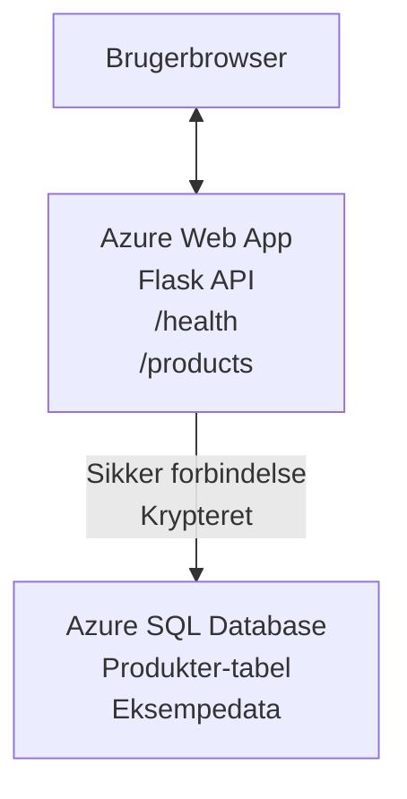

# Udrulning af en Microsoft SQL-database og webapp med AZD

⏱️ **Anslået tid**: 20-30 minutter | 💰 **Anslået pris**: ~$15-25/måned | ⭐ **Kompleksitet**: Mellem

Dette **komplette, fungerende eksempel** viser, hvordan du bruger [Azure Developer CLI (azd)](https://learn.microsoft.com/azure/developer/azure-developer-cli/) til at udrulle en Python Flask-webapplikation med en Microsoft SQL-database til Azure. Al kode er inkluderet og testet—ingen eksterne afhængigheder påkrævet.

## Hvad du vil lære

Ved at gennemføre dette eksempel vil du:
- Udrulle en flerlaget applikation (webapp + database) ved hjælp af infrastruktur-som-kode
- Konfigurere sikre databaseforbindelser uden at hardkode hemmeligheder
- Overvåge applikationens tilstand med Application Insights
- Administrere Azure-ressourcer effektivt med AZD CLI
- Følge Azures bedste praksis for sikkerhed, omkostningsoptimering og observerbarhed

## Scenarieoversigt
- **Web App**: Python Flask REST-API med databaseforbindelse
- **Database**: Azure SQL Database med eksempeldata
- **Infrastructure**: Udrullet ved hjælp af Bicep (modulære, genanvendelige skabeloner)
- **Deployment**: Fuldt automatiseret med `azd`-kommandoer
- **Monitoring**: Application Insights til logs og telemetri

## Forudsætninger

### Påkrævede værktøjer

Før du går i gang, bekræft at du har disse værktøjer installeret:

1. **[Azure CLI](https://learn.microsoft.com/cli/azure/install-azure-cli)** (version 2.50.0 eller nyere)
   ```sh
   az --version
   # Forventet output: azure-cli 2.50.0 eller nyere
   ```

2. **[Azure Developer CLI (azd)](https://learn.microsoft.com/azure/developer/azure-developer-cli/install-azd)** (version 1.0.0 eller nyere)
   ```sh
   azd version
   # Forventet output: azd version 1.0.0 eller højere
   ```

3. **[Python 3.8+](https://www.python.org/downloads/)** (til lokal udvikling)
   ```sh
   python --version
   # Forventet output: Python 3.8 eller nyere
   ```

4. **[Docker](https://www.docker.com/get-started)** (valgfrit, til lokal containerudvikling)
   ```sh
   docker --version
   # Forventet output: Docker-version 20.10 eller højere
   ```

### Azure-krav

- Et aktivt **Azure-abonnement** ([opret en gratis konto](https://azure.microsoft.com/free/))
- Tilladelser til at oprette ressourcer i dit abonnement
- **Owner** eller **Contributor**-rolle på abonnementet eller ressourcegruppen

### Forudgående viden

Dette er et eksempel på mellemniveau. Du bør være fortrolig med:
- Grundlæggende kommandolinjeoperationer
- Fundamentale cloud-koncept (ressourcer, resource groups)
- Grundlæggende forståelse af webapplikationer og databaser

**Ny til AZD?** Start med [Kom godt i gang-guiden](../../docs/chapter-01-foundation/azd-basics.md) først.

## Arkitektur

Dette eksempel udruller en to-lags arkitektur med en webapplikation og en SQL-database:


**Resource Deployment:**
- **Resource Group**: Beholder for alle ressourcer
- **App Service Plan**: Linux-baseret hosting (B1-tier for omkostningseffektivitet)
- **Web App**: Python 3.11-runtime med Flask-applikation
- **SQL Server**: Administreret databaseserver med minimum TLS 1.2
- **SQL Database**: Basic-tier (2GB, egnet til udvikling/test)
- **Application Insights**: Overvågning og logging
- **Log Analytics Workspace**: Centraliseret loglager

**Analogy**: Forestil dig dette som en restaurant (webapp) med et kølerum (database). Kunder bestiller fra menuen (API-endpoints), og køkkenet (Flask-app'en) henter ingredienserne (data) fra fryseren. Restaurationslederen (Application Insights) holder styr på alt, hvad der sker.

## Mappestruktur

Alle filer er inkluderet i dette eksempel—ingen eksterne afhængigheder påkrævet:

```
examples/database-app/
│
├── README.md                    # This file
├── azure.yaml                   # AZD configuration file
├── .env.sample                  # Sample environment variables
├── .gitignore                   # Git ignore patterns
│
├── infra/                       # Infrastructure as Code (Bicep)
│   ├── main.bicep              # Main orchestration template
│   ├── abbreviations.json      # Azure naming conventions
│   └── resources/              # Modular resource templates
│       ├── sql-server.bicep    # SQL Server configuration
│       ├── sql-database.bicep  # Database configuration
│       ├── app-service-plan.bicep  # Hosting plan
│       ├── app-insights.bicep  # Monitoring setup
│       └── web-app.bicep       # Web application
│
└── src/
    └── web/                    # Application source code
        ├── app.py              # Flask REST API
        ├── requirements.txt    # Python dependencies
        └── Dockerfile          # Container definition
```

**Hvad hver fil gør:**
- **azure.yaml**: Fortæller AZD, hvad der skal udrulles og hvor
- **infra/main.bicep**: Orkestrerer alle Azure-ressourcer
- **infra/resources/*.bicep**: Individuelle ressource-definitioner (modulære til genbrug)
- **src/web/app.py**: Flask-applikation med databaselogik
- **requirements.txt**: Python-pakkeafhængigheder
- **Dockerfile**: Containeriseringsinstruktioner til udrulning

## Hurtigstart (trin for trin)

### Trin 1: Klon og naviger

```sh
git clone https://github.com/microsoft/AZD-for-beginners.git
cd AZD-for-beginners/examples/database-app
```

**✓ Succescheck**: Bekræft, at du kan se `azure.yaml` og infra/ mappen:
```sh
ls
# Forventet: README.md, azure.yaml, infra/, src/
```

### Trin 2: Autentificer med Azure

```sh
azd auth login
```

Dette åbner din browser til Azure-autentificering. Log ind med dine Azure-legitimationsoplysninger.

**✓ Succescheck**: Du bør se:
```
Logged in to Azure.
```

### Trin 3: Initialiser miljøet

```sh
azd init
```

**Hvad sker der**: AZD opretter en lokal konfiguration til din udrulning.

**Prompter du vil se**:
- **Miljønavn**: Indtast et kort navn (f.eks. `dev`, `myapp`)
- **Azure-abonnement**: Vælg dit abonnement fra listen
- **Azure-lokation**: Vælg en region (f.eks. `eastus`, `westeurope`)

**✓ Succescheck**: Du bør se:
```
SUCCESS: New project initialized!
```

### Trin 4: Provisionér Azure-ressourcer

```sh
azd provision
```

**Hvad sker der**: AZD udruller al infrastruktur (tager 5-8 minutter):
1. Opretter resource group
2. Opretter SQL Server og Database
3. Opretter App Service Plan
4. Opretter Web App
5. Opretter Application Insights
6. Konfigurerer netværk og sikkerhed

**Du bliver bedt om**:
- **SQL-adminbrugernavn**: Indtast et brugernavn (f.eks. `sqladmin`)
- **SQL-adminadgangskode**: Angiv et stærkt kodeord (gem dette!)

**✓ Succescheck**: Du bør se:
```
SUCCESS: Your application was provisioned in Azure in X minutes Y seconds.
You can view the resources created under the resource group rg-<env-name> in Azure Portal:
https://portal.azure.com/#@/resource/subscriptions/.../resourceGroups/rg-<env-name>
```

**⏱️ Tid**: 5-8 minutter

### Trin 5: Udrul applikationen

```sh
azd deploy
```

**Hvad sker der**: AZD bygger og udruller din Flask-applikation:
1. Pakker Python-applikationen
2. Bygger Docker-containeren
3. Skubber til Azure Web App
4. Initialiserer databasen med eksempeldata
5. Starter applikationen

**✓ Succescheck**: Du bør se:
```
SUCCESS: Your application was deployed to Azure in X minutes Y seconds.
You can view the resources created under the resource group rg-<env-name> in Azure Portal:
https://portal.azure.com/#@/resource/subscriptions/.../resourceGroups/rg-<env-name>
```

**⏱️ Tid**: 3-5 minutter

### Trin 6: Gennemse applikationen

```sh
azd browse
```

Dette åbner din udrullede webapp i browseren på `https://app-<unique-id>.azurewebsites.net`

**✓ Succescheck**: Du bør se JSON-output:
```json
{
  "message": "Welcome to the Database App API",
  "endpoints": {
    "/": "This help message",
    "/health": "Health check endpoint",
    "/products": "List all products",
    "/products/<id>": "Get product by ID"
  }
}
```

### Trin 7: Test API-endpoints

**Sundhedstjek** (verificer databaseforbindelsen):
```sh
curl https://app-<your-id>.azurewebsites.net/health
```

**Forventet svar**:
```json
{
  "status": "healthy",
  "database": "connected"
}
```

**Liste over produkter** (eksempeldata):
```sh
curl https://app-<your-id>.azurewebsites.net/products
```

**Forventet svar**:
```json
[
  {
    "id": 1,
    "name": "Laptop",
    "description": "High-performance laptop",
    "price": 1299.99,
    "created_at": "2025-11-19T10:30:00"
  },
  ...
]
```

**Hent enkeltprodukt**:
```sh
curl https://app-<your-id>.azurewebsites.net/products/1
```

**✓ Succescheck**: Alle endpoints returnerer JSON-data uden fejl.

---

**🎉 Tillykke!** Du har med succes udrullet en webapplikation med en database til Azure ved hjælp af AZD.

## Detaljeret konfigurationsgennemgang

### Miljøvariabler

Hemmeligheder håndteres sikkert via Azure App Service-konfiguration — **aldrig hardkodet i kildekoden**.

**Konfigureres automatisk af AZD**:
- `SQL_CONNECTION_STRING`: Databaseforbindelse med krypterede legitimationsoplysninger
- `APPLICATIONINSIGHTS_CONNECTION_STRING`: Overvågnings- og telemetri-endepunkt
- `SCM_DO_BUILD_DURING_DEPLOYMENT`: Aktiverer automatisk installation af afhængigheder

**Hvor hemmeligheder gemmes**:
1. Under `azd provision` angiver du SQL-legitimationsoplysninger via sikre prompts
2. AZD gemmer disse i din lokale `.azure/<env-name>/.env`-fil (git-ignored)
3. AZD injicerer dem i Azure App Service-konfigurationen (krypteret i hvile)
4. Applikationen læser dem via `os.getenv()` ved kørselstid

### Lokal udvikling

For lokal test, opret en `.env`-fil ud fra eksemplet:

```sh
cp .env.sample .env
# Rediger .env med din lokale databaseforbindelse
```

**Arbejdsgang for lokal udvikling**:
```sh
# Installer afhængigheder
cd src/web
pip install -r requirements.txt

# Indstil miljøvariabler
export SQL_CONNECTION_STRING="your-local-connection-string"

# Kør applikationen
python app.py
```

**Test lokalt**:
```sh
curl http://localhost:8000/health
# Forventet: {"status": "sund", "database": "tilsluttet"}
```

### Infrastruktur som kode

Alle Azure-ressourcer er defineret i **Bicep-skabeloner** (`infra/`-mappen):

- **Modulært design**: Hver ressource-type har sin egen fil for genanvendelighed
- **Parametriseret**: Tilpas SKUs, regioner, navngivningskonventioner
- **Bedste praksis**: Følger Azures navngivningsstandarder og sikkerhedsstandarder
- **Versionskontrolleret**: Infrastrukturændringer spores i Git

**Tilpasningseksempel**:
For at ændre databaseniveauet, rediger `infra/resources/sql-database.bicep`:
```bicep
sku: {
  name: 'Standard'  // Changed from 'Basic'
  tier: 'Standard'
  capacity: 10
}
```

## Bedste sikkerhedspraksis

Dette eksempel følger Azures bedste sikkerhedspraksis:

### 1. **Ingen hemmeligheder i kildekoden**
- ✅ Legitimationsoplysninger gemt i Azure App Service-konfiguration (krypteret)
- ✅ `.env`-filer ekskluderes fra Git via `.gitignore`
- ✅ Hemmeligheder overføres via sikre parametre under provisioning

### 2. **Krypterede forbindelser**
- ✅ TLS 1.2 som minimum for SQL Server
- ✅ Kun HTTPS håndhæves for Web App
- ✅ Databaseforbindelser bruger krypterede kanaler

### 3. **Netværkssikkerhed**
- ✅ SQL Server-firewall konfigureret til kun at tillade Azure-tjenester
- ✅ Offentlig netværksadgang begrænset (kan yderligere låses med Private Endpoints)
- ✅ FTPS deaktiveret på Web App

### 4. **Autentificering og autorisation**
- ⚠️ **Aktuelt**: SQL-godkendelse (brugernavn/kodeord)
- ✅ **Anbefaling til produktion**: Brug Azure Managed Identity for adgangskodefri autentificering

**For at opgradere til Managed Identity** (til produktion):
1. Aktiver managed identity på Web App
2. Tildel identiteten SQL-tilladelser
3. Opdater forbindelsesstrengen til at bruge managed identity
4. Fjern adgangskodebaseret godkendelse

### 5. **Revision og compliance**
- ✅ Application Insights logger alle forespørgsler og fejl
- ✅ Revision af SQL Database aktiveret (kan konfigureres for compliance)
- ✅ Alle ressourcer tagget til governance

**Sikkerhedstjekliste inden produktion**:
- [ ] Aktivér Azure Defender for SQL
- [ ] Konfigurer Private Endpoints for SQL Database
- [ ] Aktivér Web Application Firewall (WAF)
- [ ] Implementér Azure Key Vault til rotation af hemmeligheder
- [ ] Konfigurer Azure AD-godkendelse
- [ ] Aktivér diagnostisk logging for alle ressourcer

## Omkostningsoptimering

**Anslåede månedlige omkostninger** (pr. november 2025):

| Ressource | SKU/Niveau | Anslåede omkostninger |
|----------|----------|----------------|
| App Service Plan | B1 (Basic) | ~$13/måned |
| SQL Database | Basic (2GB) | ~$5/måned |
| Application Insights | Pay-as-you-go | ~$2/måned (low traffic) |
| **I alt** | | **~$20/måned** |

**💡 Tips til omkostningsbesparelse**:

1. **Brug gratis niveau til læring**:
   - App Service: F1-tier (gratis, begrænsede timer)
   - SQL Database: Brug Azure SQL Database serverless
   - Application Insights: 5GB/måned gratis ingestion

2. **Stop ressourcer, når de ikke er i brug**:
   ```sh
   # Stop webappen (databasen opkræver stadig gebyrer)
   az webapp stop --name <app-name> --resource-group <rg-name>
   
   # Genstart efter behov
   az webapp start --name <app-name> --resource-group <rg-name>
   ```

3. **Slet alt efter test**:
   ```sh
   azd down
   ```
   Dette fjerner ALLE ressourcer og stopper opkrævningerne.

4. **Udvikling vs. produktion SKUs**:
   - **Udvikling**: Basic-tier (bruges i dette eksempel)
   - **Produktion**: Standard/Premium-tier med redundans

**Omkostningsovervågning**:
- Se omkostninger i [Azure Cost Management](https://portal.azure.com/#view/Microsoft_Azure_CostManagement)
- Opsæt omkostningsalarmer for at undgå overraskelser
- Tag alle ressourcer med `azd-env-name` til sporing

**Alternativ med gratis niveau**:
Til læringsformål kan du ændre `infra/resources/app-service-plan.bicep`:
```bicep
sku: {
  name: 'F1'  // Free tier
  tier: 'Free'
}
```
**Bemærk**: Gratisniveauet har begrænsninger (60 min/dag CPU, ingen always-on).

## Overvågning og observerbarhed

### Application Insights-integration

Dette eksempel inkluderer **Application Insights** til omfattende overvågning:

**Hvad overvåges**:
- ✅ HTTP-forespørgsler (latenstid, statuskoder, endpoints)
- ✅ Applikationsfejl og undtagelser
- ✅ Egen logging fra Flask-app'en
- ✅ Databaseforbindelsens sundhed
- ✅ Ydeevnemålinger (CPU, hukommelse)

**Få adgang til Application Insights**:
1. Åbn [Azure Portal](https://portal.azure.com)
2. Naviger til din resource group (`rg-<env-name>`)
3. Klik på Application Insights-ressourcen (`appi-<unique-id>`)

**Nyttige forespørgsler** (Application Insights → Logs):

**Se alle forespørgsler**:
```kusto
requests
| where timestamp > ago(1h)
| order by timestamp desc
| project timestamp, name, url, resultCode, duration
```

**Find fejl**:
```kusto
exceptions
| where timestamp > ago(24h)
| order by timestamp desc
| project timestamp, type, outerMessage, operation_Name
```

**Tjek sundheds-endpoint**:
```kusto
requests
| where name contains "health"
| summarize count() by resultCode, bin(timestamp, 1h)
```

### Revision af SQL-database

**Revision af SQL Database er aktiveret** for at spore:
- Adgangsmønstre til databasen
- Mislykkede loginforsøg
- Skemaændringer
- Dataadgang (til compliance)

**Få adgang til revisionslogfiler**:
1. Azure Portal → SQL Database → Auditing
2. Se logfiler i Log Analytics-workspace

### Real-time-overvågning

**Se live-metrics**:
1. Application Insights → Live Metrics
2. Se forespørgsler, fejl og ydeevne i realtid

**Opsæt alarmer**:
Opret alarmer for kritiske hændelser:
- HTTP 500-fejl > 5 på 5 minutter
- Fejl i databaseforbindelser
- Høje svartider (>2 sekunder)

**Eksempel på oprettelse af alarm**:
```sh
az monitor metrics alert create \
  --name "High-Response-Time" \
  --resource-group <rg-name> \
  --scopes <app-insights-resource-id> \
  --condition "avg requests/duration > 2000" \
  --description "Alert when response time exceeds 2 seconds"
```

## Fejlretning
### Almindelige problemer og løsninger

#### 1. `azd provision` fejler med "Location not available"

**Symptom**:
```
Error: The subscription is not registered for the resource type 'components' in the location 'centralus'.
```

**Løsning**:
Vælg en anden Azure-region eller registrer ressourceudbyderen:
```sh
az provider register --namespace Microsoft.Insights
```

#### 2. SQL-forbindelse fejler under udrulning

**Symptom**:
```
pyodbc.OperationalError: ('08001', '[08001] [Microsoft][ODBC Driver 18 for SQL Server]TCP Provider...')
```

**Løsning**:
- Bekræft, at SQL Server-firewallen tillader Azure-tjenester (konfigureres automatisk)
- Kontroller, at SQL-administratoradgangskoden blev indtastet korrekt under `azd provision`
- Sørg for, at SQL Server er fuldt provisioneret (kan tage 2-3 minutter)

**Bekræft forbindelse**:
```sh
# Fra Azure-portalen, gå til SQL-database → Forespørgselseditor
# Prøv at oprette forbindelse med dine legitimationsoplysninger
```

#### 3. Webapp viser "Application Error"

**Symptom**:
Browseren viser en generisk fejlside.

**Løsning**:
Kontroller applikationslogfiler:
```sh
# Vis seneste logfiler
az webapp log tail --name <app-name> --resource-group <rg-name>
```

**Almindelige årsager**:
- Manglende miljøvariabler (tjek App Service → Konfiguration)
- Installation af Python-pakker mislykkedes (tjek implementeringslogfiler)
- Fejl ved databaseinitialisering (tjek SQL-forbindelsen)

#### 4. `azd deploy` fejler med "Build Error"

**Symptom**:
```
Error: Failed to build project
```

**Løsning**:
- Sørg for, at `requirements.txt` ikke har syntaksfejl
- Kontroller, at Python 3.11 er angivet i `infra/resources/web-app.bicep`
- Bekræft, at Dockerfile har korrekt basebillede

**Fejlret lokalt**:
```sh
cd src/web
docker build -t test-app .
docker run -p 8000:8000 test-app
```

#### 5. "Unauthorized" ved kørsel af AZD-kommandoer

**Symptom**:
```
ERROR: (Unauthorized) The client '<id>' with object id '<id>' does not have authorization
```

**Løsning**:
Log ind igen hos Azure:
```sh
# Påkrævet for AZD-arbejdsgange
azd auth login

# Valgfrit, hvis du også bruger Azure CLI-kommandoer direkte
az login
```

Bekræft, at du har de korrekte rettigheder (Contributor-rollen) på abonnementet.

#### 6. Høje databaseomkostninger

**Symptom**:
Uventet Azure-regning.

**Løsning**:
- Tjek, om du glemte at køre `azd down` efter test
- Bekræft, at SQL Database bruger Basic-tier (ikke Premium)
- Gennemgå omkostninger i Azure Cost Management
- Opret omkostningsalarmer

### Få hjælp

**Vis alle AZD-miljøvariabler**:
```sh
azd env get-values
```

**Tjek implementeringsstatus**:
```sh
az webapp show --name <app-name> --resource-group <rg-name> --query state
```

**Få adgang til applikationslogfiler**:
```sh
az webapp log download --name <app-name> --resource-group <rg-name> --log-file app-logs.zip
```

**Brug for mere hjælp?**
- [AZD-fejlfindingguide](../../docs/chapter-07-troubleshooting/common-issues.md)
- [Fejlfinding for Azure App Service](https://learn.microsoft.com/azure/app-service/troubleshoot-diagnostic-logs)
- [Fejlfinding for Azure SQL](https://learn.microsoft.com/azure/azure-sql/database/troubleshoot-common-errors-issues)

## Praktiske øvelser

### Øvelse 1: Bekræft din udrulning (Begynder)

**Mål**: Bekræft, at alle ressourcer er udrullet, og at applikationen fungerer.

**Trin**:
1. List alle ressourcer i din ressourcegruppe:
   ```sh
   az resource list --resource-group rg-<env-name> --output table
   ```
   **Forventet**: 6-7 ressourcer (Web App, SQL Server, SQL Database, App Service Plan, Application Insights, Log Analytics)

2. Test alle API-endpoints:
   ```sh
   curl https://app-<your-id>.azurewebsites.net/
   curl https://app-<your-id>.azurewebsites.net/health
   curl https://app-<your-id>.azurewebsites.net/products
   curl https://app-<your-id>.azurewebsites.net/products/1
   ```
   **Forventet**: Alle returnerer gyldig JSON uden fejl

3. Check Application Insights:
   - Gå til Application Insights i Azure-portalen
   - Gå til "Live Metrics"
   - Opdater din browser på webappen
   **Forventet**: Se forespørgsler vises i realtid

**Succeskriterier**: Alle 6-7 ressourcer findes, alle endpoints returnerer data, Live Metrics viser aktivitet.

---

### Øvelse 2: Tilføj et nyt API-endpoint (Mellem)

**Mål**: Udvid Flask-applikationen med et nyt endpoint.

**Starterkode**: Aktuelle endpoints i `src/web/app.py`

**Trin**:
1. Rediger `src/web/app.py` og tilføj et nyt endpoint efter `get_product()`-funktionen:
   ```python
   @app.route('/products/search/<keyword>')
   def search_products(keyword):
       """Search products by name or description."""
       try:
           conn = get_db_connection()
           cursor = conn.cursor()
           cursor.execute(
               "SELECT id, name, description, price, created_at FROM products WHERE name LIKE ? OR description LIKE ?",
               (f'%{keyword}%', f'%{keyword}%')
           )
           
           products = []
           for row in cursor.fetchall():
               products.append({
                   'id': row[0],
                   'name': row[1],
                   'description': row[2],
                   'price': float(row[3]) if row[3] else None,
                   'created_at': row[4].isoformat() if row[4] else None
               })
           
           cursor.close()
           conn.close()
           
           logger.info(f"Search for '{keyword}' returned {len(products)} results")
           return jsonify(products), 200
           
       except Exception as e:
           logger.error(f"Error searching products: {str(e)}")
           return jsonify({'error': str(e)}), 500
   ```

2. Udrul den opdaterede applikation:
   ```sh
   azd deploy
   ```

3. Test det nye endpoint:
   ```sh
   curl https://app-<your-id>.azurewebsites.net/products/search/laptop
   ```
   **Forventet**: Returnerer produkter, der matcher "laptop"

**Succeskriterier**: Det nye endpoint virker, returnerer filtrerede resultater, vises i Application Insights-loggene.

---

### Øvelse 3: Tilføj overvågning og alarmer (Avanceret)

**Mål**: Opsæt proaktiv overvågning med alarmer.

**Trin**:
1. Opret en alarm for HTTP 500-fejl:
   ```sh
   # Hent Application Insights-ressource-id
   AI_ID=$(az monitor app-insights component show \
     --app appi-<your-id> \
     --resource-group rg-<env-name> \
     --query id -o tsv)
   
   # Opret alarm
   az monitor metrics alert create \
     --name "High-Error-Rate" \
     --resource-group rg-<env-name> \
     --scopes $AI_ID \
     --condition "count requests/failed > 5" \
     --window-size 5m \
     --evaluation-frequency 1m \
     --description "Alert when >5 failed requests in 5 minutes"
   ```

2. Udløs alarmen ved at forårsage fejl:
   ```sh
   # Anmod om et ikke-eksisterende produkt
   for i in {1..10}; do curl https://app-<your-id>.azurewebsites.net/products/999; done
   ```

3. Tjek om alarmen udløste:
   - Azure Portal → Alarmer → Alarmregler
   - Tjek din e-mail (hvis konfigureret)

**Succeskriterier**: Alarmregel er oprettet, udløses ved fejl, underretninger modtages.

---

### Øvelse 4: Ændringer i databaseskemaet (Avanceret)

**Mål**: Tilføj en ny tabel og ændr applikationen til at bruge den.

**Trin**:
1. Forbind til SQL Database via Azure Portal Query Editor

2. Opret en ny tabel `categories`:
   ```sql
   CREATE TABLE categories (
       id INT PRIMARY KEY IDENTITY(1,1),
       name NVARCHAR(50) NOT NULL,
       description NVARCHAR(200)
   );
   
   INSERT INTO categories (name, description) VALUES
   ('Electronics', 'Electronic devices and accessories'),
   ('Office Supplies', 'Office equipment and supplies');
   
   -- Add category to products table
   ALTER TABLE products ADD category_id INT;
   UPDATE products SET category_id = 1; -- Set all to Electronics
   ```

3. Opdater `src/web/app.py` for at inkludere kategorioplysninger i svarene

4. Udrul og test

**Succeskriterier**: Ny tabel findes, produkter viser kategorioplysninger, applikationen fungerer stadig.

---

### Øvelse 5: Implementer caching (Ekspert)

**Mål**: Tilføj Azure Redis Cache for at forbedre ydeevnen.

**Trin**:
1. Tilføj Redis Cache til `infra/main.bicep`
2. Opdater `src/web/app.py` til at cache produktforespørgsler
3. Mål performanceforbedring med Application Insights
4. Sammenlign svartider før/efter caching

**Succeskriterier**: Redis er udrullet, caching virker, svartider forbedres med >50%.

**Tip**: Start med [Azure Cache for Redis-dokumentation](https://learn.microsoft.com/azure/azure-cache-for-redis/).

---

## Oprydning

For at undgå løbende omkostninger skal du slette alle ressourcer, når du er færdig:

```sh
azd down
```

**Bekræftelsesprompt**:
```
? Total resources to delete: 7, are you sure you want to continue? (y/N)
```

Skriv `y` for at bekræfte.

**✓ Succescheck**: 
- Alle ressourcer er slettet fra Azure-portalen
- Ingen løbende omkostninger
- Den lokale `.azure/<env-name>`-mappe kan slettes

**Alternativ** (behold infrastrukturen, slet data):
```sh
# Slet kun ressourcegruppen (behold AZD-konfiguration)
az group delete --name rg-<env-name> --yes
```
## Læs mere

### Relateret dokumentation
- [Azure Developer CLI-dokumentation](https://learn.microsoft.com/azure/developer/azure-developer-cli/)
- [Azure SQL Database-dokumentation](https://learn.microsoft.com/azure/azure-sql/database/)
- [Azure App Service-dokumentation](https://learn.microsoft.com/azure/app-service/)
- [Application Insights-dokumentation](https://learn.microsoft.com/azure/azure-monitor/app/app-insights-overview)
- [Bicep-sprogreference](https://learn.microsoft.com/azure/azure-resource-manager/bicep/)

### Næste skridt i dette kursus
- **[Container Apps-eksempel](../../../../examples/container-app)**: Udrul mikrotjenester med Azure Container Apps
- **[AI-integrationsvejledning](../../../../docs/ai-foundry)**: Tilføj AI-funktioner til din app
- **[Bedste praksis for udrulning](../../docs/chapter-04-infrastructure/deployment-guide.md)**: Produktionsudrulningsmønstre

### Avancerede emner
- **Managed Identity**: Fjern adgangskoder og brug Azure AD-autentificering
- **Private Endpoints**: Sikr databaseforbindelser inden for et virtuelt netværk
- **CI/CD-integration**: Automatiser udrulninger med GitHub Actions eller Azure DevOps
- **Multi-miljø**: Opsæt dev-, staging- og produktionsmiljøer
- **Database-migrationer**: Brug Alembic eller Entity Framework til versionsstyring af skema

### Sammenligning med andre tilgange

**AZD vs. ARM-skabeloner**:
- ✅ AZD: Højere abstraktion, enklere kommandoer
- ⚠️ ARM: Mere omfangsrig, mere granulær kontrol

**AZD vs. Terraform**:
- ✅ AZD: Azure-native, integreret med Azure-tjenester
- ⚠️ Terraform: Multi-cloud-understøttelse, større økosystem

**AZD vs. Azure-portalen**:
- ✅ AZD: Reproducerbar, versionsstyret, automatiserbar
- ⚠️ Portalen: Manuelle klik, svær at reproducere

Tænk på AZD som: Docker Compose for Azure—forenklet konfiguration til komplekse udrulninger.

---

## Ofte stillede spørgsmål

**Q: Kan jeg bruge et andet programmeringssprog?**  
A: Ja! Erstat `src/web/` med Node.js, C#, Go eller et andet sprog. Opdater `azure.yaml` og Bicep tilsvarende.

**Q: Hvordan tilføjer jeg flere databaser?**  
A: Tilføj en anden SQL Database-modul i `infra/main.bicep` eller brug PostgreSQL/MySQL fra Azure Database services.

**Q: Kan jeg bruge dette til produktion?**  
A: Dette er et udgangspunkt. Til produktion skal du tilføje: managed identity, private endpoints, redundans, backup-strategi, WAF og forbedret overvågning.

**Q: Hvad hvis jeg vil bruge containere i stedet for kodeudrulning?**  
A: Se [Container Apps-eksempel](../../../../examples/container-app), som bruger Docker-containere gennemgående.

**Q: Hvordan opretter jeg forbindelse til databasen fra min lokale maskine?**  
A: Tilføj din IP til SQL Server-firewallen:
```sh
az sql server firewall-rule create \
  --resource-group rg-<env-name> \
  --server sql-<unique-id> \
  --name AllowMyIP \
  --start-ip-address <your-ip> \
  --end-ip-address <your-ip>
```

**Q: Kan jeg bruge en eksisterende database i stedet for at oprette en ny?**  
A: Ja, ændr `infra/main.bicep` til at referere til en eksisterende SQL Server og opdater forbindelsesstrengparametrene.

---

> **Bemærk:** Dette eksempel demonstrerer bedste praksis for udrulning af en webapp med en database ved hjælp af AZD. Det indeholder fungerende kode, omfattende dokumentation og praktiske øvelser for at styrke læringen. For produktionsudrulninger bør du gennemgå sikkerhed, skalering, overholdelse og omkostningskrav, der er specifikke for din organisation.

**📚 Kursusnavigation:**
- ← Forrige: [Container Apps-eksempel](../../../../examples/container-app)
- → Næste: [AI-integrationsvejledning](../../../../docs/ai-foundry)
- 🏠 [Kursusforside](../../README.md)

---

<!-- CO-OP TRANSLATOR DISCLAIMER START -->
**Disclaimer**:
Dette dokument er blevet oversat ved hjælp af AI-oversættelsestjenesten [Co-op Translator](https://github.com/Azure/co-op-translator). Selvom vi bestræber os på nøjagtighed, bedes du være opmærksom på, at automatiske oversættelser kan indeholde fejl eller unøjagtigheder. Det originale dokument på dets oprindelige sprog bør betragtes som den autoritative kilde. For kritiske oplysninger anbefales professionel menneskelig oversættelse. Vi er ikke ansvarlige for misforståelser eller fejltolkninger, der opstår som følge af brugen af denne oversættelse.
<!-- CO-OP TRANSLATOR DISCLAIMER END -->