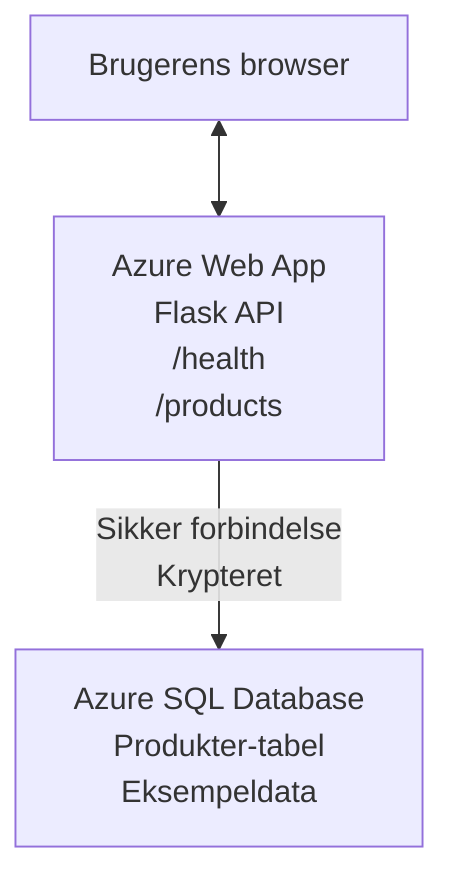

# Deploying a Microsoft SQL Database and Web App with AZD

⏱️ **Anslået tid**: 20-30 minutter | 💰 **Anslået pris**: ~$15-25/måned | ⭐ **Kompleksitet**: Mellem

Dette **fuldstændige, fungerende eksempel** viser, hvordan du bruger [Azure Developer CLI (azd)](https://learn.microsoft.com/azure/developer/azure-developer-cli/) til at deploye en Python Flask webapplikation med en Microsoft SQL-database til Azure. Al kode er inkluderet og testet—ingen eksterne afhængigheder kræves.

## Hvad du lærer

Ved at gennemføre dette eksempel vil du:
- Deploye en multi-tier applikation (webapp + database) ved hjælp af infrastructure-as-code
- Konfigurere sikre databaseforbindelser uden at hardkode hemmeligheder
- Overvåge applikationens sundhed med Application Insights
- Administrere Azure-ressourcer effektivt med AZD CLI
- Følge Azures bedste praksis for sikkerhed, omkostningsoptimering og observability

## Scenarieoversigt
- **Web App**: Python Flask REST API med databaseforbindelse
- **Database**: Azure SQL Database med eksempeldata
- **Infrastruktur**: Provisioneret ved hjælp af Bicep (modulært, genanvendelige skabeloner)
- **Deployment**: Fuldautomatisk med `azd`-kommandoer
- **Overvågning**: Application Insights til logs og telemetri

## Forudsætninger

### Påkrævede værktøjer

Før du går i gang, bekræft at du har disse værktøjer installeret:

1. **[Azure CLI](https://learn.microsoft.com/cli/azure/install-azure-cli)** (version 2.50.0 eller nyere)
   ```sh
   az --version
   # Forventet output: azure-cli 2.50.0 eller nyere
   ```

2. **[Azure Developer CLI (azd)](https://learn.microsoft.com/azure/developer/azure-developer-cli/install-azd)** (version 1.0.0 eller nyere)
   ```sh
   azd version
   # Forventet output: azd version 1.0.0 eller højere
   ```

3. **[Python 3.8+](https://www.python.org/downloads/)** (til lokal udvikling)
   ```sh
   python --version
   # Forventet output: Python 3.8 eller nyere
   ```

4. **[Docker](https://www.docker.com/get-started)** (valgfrit, til lokal containeriseret udvikling)
   ```sh
   docker --version
   # Forventet output: Docker-version 20.10 eller nyere
   ```

### Azure-krav

- En aktiv **Azure-abonnement** ([create a free account](https://azure.microsoft.com/free/))
- Rettigheder til at oprette ressourcer i dit abonnement
- **Owner** eller **Contributor** rolle på abonnementet eller ressourcegruppen

### Forudgående viden

Dette er et **mellem-niveau** eksempel. Du bør være fortrolig med:
- Grundlæggende kommando-linje operationer
- Grundlæggende cloud-koncepter (ressourcer, ressourcegrupper)
- Grundlæggende forståelse af webapplikationer og databaser

**Ny til AZD?** Start med [Getting Started guide](../../docs/chapter-01-foundation/azd-basics.md) først.

## Arkitektur

Dette eksempel deployer en to-tier arkitektur med en webapplikation og SQL-database:



**Ressource-udrulning:**
- **Resource Group**: Beholder for alle ressourcer
- **App Service Plan**: Linux-baseret hosting (B1-tier for omkostningseffektivitet)
- **Web App**: Python 3.11 runtime med Flask-applikation
- **SQL Server**: Administreret databaseserver med TLS 1.2 som minimum
- **SQL Database**: Basic tier (2GB, egnet til udvikling/test)
- **Application Insights**: Overvågning og logging
- **Log Analytics Workspace**: Centraliseret loglagring

**Analogi**: Tænk på dette som en restaurant (webapp) med et fryserum (database). Kunder bestiller fra menuen (API-endpoints), og køkkenet (Flask-app) henter ingredienserne (data) fra fryserummet. Restaurantchefen (Application Insights) holder øje med alt, hvad der sker.

## Mappestruktur

Alle filer er inkluderet i dette eksempel—ingen eksterne afhængigheder kræves:

```
examples/database-app/
│
├── README.md                    # This file
├── azure.yaml                   # AZD configuration file
├── .env.sample                  # Sample environment variables
├── .gitignore                   # Git ignore patterns
│
├── infra/                       # Infrastructure as Code (Bicep)
│   ├── main.bicep              # Main orchestration template
│   ├── abbreviations.json      # Azure naming conventions
│   └── resources/              # Modular resource templates
│       ├── sql-server.bicep    # SQL Server configuration
│       ├── sql-database.bicep  # Database configuration
│       ├── app-service-plan.bicep  # Hosting plan
│       ├── app-insights.bicep  # Monitoring setup
│       └── web-app.bicep       # Web application
│
└── src/
    └── web/                    # Application source code
        ├── app.py              # Flask REST API
        ├── requirements.txt    # Python dependencies
        └── Dockerfile          # Container definition
```

**Hvad hver fil gør:**
- **azure.yaml**: Fortæller AZD hvad der skal deployes og hvor
- **infra/main.bicep**: Orkestrerer alle Azure-ressourcer
- **infra/resources/*.bicep**: Individuelle ressource-definitioner (modulære til genbrug)
- **src/web/app.py**: Flask-applikation med databaselogik
- **requirements.txt**: Python pakkebehov
- **Dockerfile**: Containeriseringsinstruktioner til deployment

## Quickstart (trin-for-trin)

### Trin 1: Clone og naviger

```sh
git clone https://github.com/microsoft/AZD-for-beginners.git
cd AZD-for-beginners/examples/database-app
```

**✓ Succes‑kontrol**: Bekræft at du ser `azure.yaml` og mappen `infra/`:
```sh
ls
# Forventet: README.md, azure.yaml, infra/, src/
```

### Trin 2: Autentificer med Azure

```sh
azd auth login
```

Dette åbner din browser for Azure-autentificering. Log ind med dine Azure-legitimationsoplysninger.

**✓ Succes‑kontrol**: Du bør se:
```
Logged in to Azure.
```

### Trin 3: Initialiser miljøet

```sh
azd init
```

**Hvad sker der**: AZD opretter en lokal konfiguration til din deployment.

**Prompter du vil se**:
- **Environment name**: Indtast et kort navn (f.eks. `dev`, `myapp`)
- **Azure subscription**: Vælg dit abonnement fra listen
- **Azure location**: Vælg en region (f.eks. `eastus`, `westeurope`)

**✓ Succes‑kontrol**: Du bør se:
```
SUCCESS: New project initialized!
```

### Trin 4: Provisioner Azure-ressourcer

```sh
azd provision
```

**Hvad sker der**: AZD deployer al infrastruktur (tager 5-8 minutter):
1. Opretter ressourcegruppe
2. Opretter SQL Server og Database
3. Opretter App Service Plan
4. Opretter Web App
5. Opretter Application Insights
6. Konfigurerer netværk og sikkerhed

**Du vil blive prompted for**:
- **SQL admin username**: Indtast et brugernavn (f.eks. `sqladmin`)
- **SQL admin password**: Indtast et stærkt password (gem dette!)

**✓ Succes‑kontrol**: Du bør se:
```
SUCCESS: Your application was provisioned in Azure in X minutes Y seconds.
You can view the resources created under the resource group rg-<env-name> in Azure Portal:
https://portal.azure.com/#@/resource/subscriptions/.../resourceGroups/rg-<env-name>
```

**⏱️ Tid**: 5-8 minutter

### Trin 5: Deploy applikationen

```sh
azd deploy
```

**Hvad sker der**: AZD bygger og deployer din Flask-applikation:
1. Pakker Python-applikationen
2. Bygger Docker-containeren
3. Pusher til Azure Web App
4. Initialiserer databasen med eksemplerdata
5. Starter applikationen

**✓ Succes‑kontrol**: Du bør se:
```
SUCCESS: Your application was deployed to Azure in X minutes Y seconds.
You can view the resources created under the resource group rg-<env-name> in Azure Portal:
https://portal.azure.com/#@/resource/subscriptions/.../resourceGroups/rg-<env-name>
```

**⏱️ Tid**: 3-5 minutter

### Trin 6: Gennemse applikationen

```sh
azd browse
```

Dette åbner din deployede webapp i browseren på `https://app-<unique-id>.azurewebsites.net`

**✓ Succes‑kontrol**: Du bør se JSON-output:
```json
{
  "message": "Welcome to the Database App API",
  "endpoints": {
    "/": "This help message",
    "/health": "Health check endpoint",
    "/products": "List all products",
    "/products/<id>": "Get product by ID"
  }
}
```

### Trin 7: Test API-endpoints

**Health Check** (bekræft databaseforbindelse):
```sh
curl https://app-<your-id>.azurewebsites.net/health
```

**Forventet svar**:
```json
{
  "status": "healthy",
  "database": "connected"
}
```

**List Products** (eksempeldata):
```sh
curl https://app-<your-id>.azurewebsites.net/products
```

**Forventet svar**:
```json
[
  {
    "id": 1,
    "name": "Laptop",
    "description": "High-performance laptop",
    "price": 1299.99,
    "created_at": "2025-11-19T10:30:00"
  },
  ...
]
```

**Get Single Product**:
```sh
curl https://app-<your-id>.azurewebsites.net/products/1
```

**✓ Succes‑kontrol**: Alle endpoints returnerer JSON-data uden fejl.

---

**🎉 Tillykke!** Du har med succes deployet en webapplikation med en database til Azure ved hjælp af AZD.

## Konfigurationsdetaljer

### Miljøvariabler

Hemmeligheder håndteres sikkert via Azure App Service konfiguration—**aldrig hardcodet i kildekoden**.

**Konfigureret automatisk af AZD**:
- `SQL_CONNECTION_STRING`: Databaseforbindelse med krypterede legitimationsoplysninger
- `APPLICATIONINSIGHTS_CONNECTION_STRING`: Overvågnings-telemetri endpoint
- `SCM_DO_BUILD_DURING_DEPLOYMENT`: Muliggør automatisk installation af afhængigheder

**Hvor hemmeligheder gemmes**:
1. Under `azd provision` angiver du SQL-legitimationsoplysninger via sikre prompts
2. AZD gemmer disse i din lokale `.azure/<env-name>/.env` fil (git-ignored)
3. AZD injicerer dem i Azure App Service konfiguration (krypteret i hvile)
4. Applikationen læser dem via `os.getenv()` ved runtime

### Lokal udvikling

Til lokal test, opret en `.env` fil fra eksemplet:

```sh
cp .env.sample .env
# Rediger .env med din lokale databaseforbindelse
```

**Lokal udviklingsworkflow**:
```sh
# Installer afhængigheder
cd src/web
pip install -r requirements.txt

# Indstil miljøvariabler
export SQL_CONNECTION_STRING="your-local-connection-string"

# Kør applikationen
python app.py
```

**Test lokalt**:
```sh
curl http://localhost:8000/health
# Forventet: {"status": "healthy", "database": "connected"}
```

### Infrastruktur som kode

Alle Azure-ressourcer er defineret i **Bicep-skabeloner** (`infra/` mappe):

- **Modulært design**: Hver ressource-type har sin egen fil for genanvendelighed
- **Parameteriseret**: Tilpas SKUs, regioner, navngivningskonventioner
- **Bedste praksis**: Følger Azures navngivningsstandarder og sikkerhedsstandarder
- **Versionsstyret**: Infrastrukturændringer spores i Git

**Tilpasningseksempel**:
For at ændre databasetier, rediger `infra/resources/sql-database.bicep`:
```bicep
sku: {
  name: 'Standard'  // Changed from 'Basic'
  tier: 'Standard'
  capacity: 10
}
```

## Sikkerheds bedste praksis

Dette eksempel følger Azures sikkerheds bedste praksis:

### 1. **Ingen hemmeligheder i kildekoden**
- ✅ Legitimationsoplysninger gemmes i Azure App Service konfiguration (krypteret)
- ✅ `.env` filer ekskluderes fra Git via `.gitignore`
- ✅ Hemmeligheder sendes via sikre parametre under provisioning

### 2. **Krypterede forbindelser**
- ✅ TLS 1.2 som minimum for SQL Server
- ✅ HTTPS-only håndhævet for Web App
- ✅ Databaseforbindelser bruger krypterede kanaler

### 3. **Netværkssikkerhed**
- ✅ SQL Server firewall konfigureret til kun at tillade Azure-tjenester
- ✅ Offentlig netværksadgang begrænset (kan yderligere låses med Private Endpoints)
- ✅ FTPS deaktiveret på Web App

### 4. **Autentificering & Autorisation**
- ⚠️ **Aktuelt**: SQL-autentificering (brugernavn/password)
- ✅ **Produktion anbefaling**: Brug Azure Managed Identity for passwordless autentificering

**For at opgradere til Managed Identity** (til produktion):
1. Aktiver managed identity på Web App
2. Giv identity SQL-tilladelser
3. Opdater forbindelsesstrengen til at bruge managed identity
4. Fjern password-baseret autentificering

### 5. **Revision & Compliance**
- ✅ Application Insights logger alle forespørgsler og fejl
- ✅ SQL Database auditing aktiveret (kan konfigureres for compliance)
- ✅ Alle ressourcer tagget til governance

**Sikkerhedscheckliste før produktion**:
- [ ] Aktiver Azure Defender for SQL
- [ ] Konfigurer Private Endpoints for SQL Database
- [ ] Aktiver Web Application Firewall (WAF)
- [ ] Implementer Azure Key Vault til rotation af hemmeligheder
- [ ] Konfigurer Microsoft Entra ID-autentificering
- [ ] Aktiver diagnostisk logging for alle ressourcer

## Omkostningsoptimering

**Anslåede månedlige omkostninger** (pr. november 2025):

| Resource | SKU/Tier | Estimated Cost |
|----------|----------|----------------|
| App Service Plan | B1 (Basic) | ~$13/month |
| SQL Database | Basic (2GB) | ~$5/month |
| Application Insights | Pay-as-you-go | ~$2/month (lav trafik) |
| **Total** | | **~$20/month** |

**💡 Sparetips**:

1. **Brug gratis tier til læring**:
   - App Service: F1 tier (gratis, begrænsede timer)
   - SQL Database: Brug Azure SQL Database serverless
   - Application Insights: 5GB/måned gratis ingestion

2. **Stop ressourcer når de ikke er i brug**:
   ```sh
   # Stop webappen (databasen opkræver stadig gebyrer)
   az webapp stop --name <app-name> --resource-group <rg-name>
   
   # Genstart ved behov
   az webapp start --name <app-name> --resource-group <rg-name>
   ```

3. **Slet alt efter test**:
   ```sh
   azd down
   ```
   Dette fjerner ALLE ressourcer og stopper omkostninger.

4. **Udvikling vs. Produktion SKUs**:
   - **Udvikling**: Basic tier (brugt i dette eksempel)
   - **Produktion**: Standard/Premium tier med redundans

**Omkostningsovervågning**:
- Se omkostninger i [Azure Cost Management](https://portal.azure.com/#view/Microsoft_Azure_CostManagement)
- Opsæt omkostningsalarmer for at undgå overraskelser
- Tag alle ressourcer med `azd-env-name` for sporing

**Gratis tier-alternativ**:
Til læringsformål kan du ændre `infra/resources/app-service-plan.bicep`:
```bicep
sku: {
  name: 'F1'  // Free tier
  tier: 'Free'
}
```
**Bemærk**: Gratis tier har begrænsninger (60 min/dag CPU, ingen always-on).

## Overvågning & Observability

### Application Insights-integration

Dette eksempel inkluderer **Application Insights** for omfattende overvågning:

**Hvad der overvåges**:
- ✅ HTTP-forespørgsler (latens, statuskoder, endpoints)
- ✅ Applikationsfejl og undtagelser
- ✅ Egen logging fra Flask-app
- ✅ Databaseforbindelsessundhed
- ✅ Performance-metrikker (CPU, hukommelse)

**Få adgang til Application Insights**:
1. Åbn [Azure Portal](https://portal.azure.com)
2. Naviger til din ressourcegruppe (`rg-<env-name>`)
3. Klik på Application Insights-ressourcen (`appi-<unique-id>`)

**Nyttige forespørgsler** (Application Insights → Logs):

**Vis alle forespørgsler**:
```kusto
requests
| where timestamp > ago(1h)
| order by timestamp desc
| project timestamp, name, url, resultCode, duration
```

**Find fejl**:
```kusto
exceptions
| where timestamp > ago(24h)
| order by timestamp desc
| project timestamp, type, outerMessage, operation_Name
```

**Tjek health endpoint**:
```kusto
requests
| where name contains "health"
| summarize count() by resultCode, bin(timestamp, 1h)
```

### SQL Database-auditing

**SQL Database auditing er aktiveret** for at spore:
- Databaseadgangsmønstre
- Mislykkede loginforsøg
- Skemændringer
- Dataadgang (til compliance)

**Få adgang til audit logs**:
1. Azure Portal → SQL Database → Auditing
2. Se logs i Log Analytics workspace

### Realtids-overvågning

**Se live-metrikker**:
1. Application Insights → Live Metrics
2. Se forespørgsler, fejl og performance i realtid

**Opsæt alarmer**:
Opret advarsler for kritiske hændelser:
- HTTP 500-fejl > 5 på 5 minutter
- Databaseforbindelsesfejl
- Høje svartider (>2 sekunder)

**Eksempel på oprettelse af alarm**:
```sh
az monitor metrics alert create \
  --name "High-Response-Time" \
  --resource-group <rg-name> \
  --scopes <app-insights-resource-id> \
  --condition "avg requests/duration > 2000" \
  --description "Alert when response time exceeds 2 seconds"
```

## Fejlfinding
### Almindelige problemer og løsninger

#### 1. `azd provision` fejler med "Location not available"

**Symptom**:
```
Error: The subscription is not registered for the resource type 'components' in the location 'centralus'.
```

**Løsning**:
Vælg en anden Azure-region eller registrer resource provideren:
```sh
az provider register --namespace Microsoft.Insights
```

#### 2. SQL-forbindelse fejler under udrulning

**Symptom**:
```
pyodbc.OperationalError: ('08001', '[08001] [Microsoft][ODBC Driver 18 for SQL Server]TCP Provider...')
```

**Løsning**:
- Bekræft at SQL Server-firewallen tillader Azure-tjenester (konfigureres automatisk)
- Tjek at SQL-admin-adgangskoden blev indtastet korrekt under `azd provision`
- Sørg for at SQL Server er fuldt provisioneret (kan tage 2-3 minutter)

**Bekræft forbindelse**:
```sh
# Fra Azure-portalen skal du gå til SQL Database → Forespørgselseditor
# Prøv at oprette forbindelse med dine legitimationsoplysninger
```

#### 3. Webapp viser "Application Error"

**Symptom**:
Browseren viser en generisk fejlside.

**Løsning**:
Tjek applikationslogs:
```sh
# Vis nylige logfiler
az webapp log tail --name <app-name> --resource-group <rg-name>
```

**Almindelige årsager**:
- Manglende miljøvariabler (tjek App Service → Configuration)
- Installation af Python-pakker mislykkedes (tjek udrulningslogs)
- Fejl ved databaseinitialisering (tjek SQL-forbindelsen)

#### 4. `azd deploy` fejler med "Build Error"

**Symptom**:
```
Error: Failed to build project
```

**Løsning**:
- Sørg for at `requirements.txt` ikke har syntaksfejl
- Tjek at Python 3.11 er angivet i `infra/resources/web-app.bicep`
- Bekræft at Dockerfile har korrekt base image

**Debug lokalt**:
```sh
cd src/web
docker build -t test-app .
docker run -p 8000:8000 test-app
```

#### 5. "Unauthorized" når du kører AZD-kommandoer

**Symptom**:
```
ERROR: (Unauthorized) The client '<id>' with object id '<id>' does not have authorization
```

**Løsning**:
Re-autentificer med Azure:
```sh
# Påkrævet for AZD-arbejdsgange
azd auth login

# Valgfrit, hvis du også bruger Azure CLI-kommandoer direkte
az login
```

Bekræft at du har de korrekte rettigheder (Contributor-rollen) på abonnementet.

#### 6. Høje databaseomkostninger

**Symptom**:
Uventet Azure-regning.

**Løsning**:
- Tjek om du glemte at køre `azd down` efter test
- Bekræft at SQL Database bruger Basic-tier (ikke Premium)
- Gennemse omkostninger i Azure Cost Management
- Opsæt omkostningsalarmer

### Få hjælp

**Vis alle AZD-miljøvariabler**:
```sh
azd env get-values
```

**Tjek udrulningsstatus**:
```sh
az webapp show --name <app-name> --resource-group <rg-name> --query state
```

**Adgang til applikationslogs**:
```sh
az webapp log download --name <app-name> --resource-group <rg-name> --log-file app-logs.zip
```

**Brug for mere hjælp?**
- [AZD-fejlfinding guide](../../docs/chapter-07-troubleshooting/common-issues.md)
- [Azure App Service fejlfinding](https://learn.microsoft.com/azure/app-service/troubleshoot-diagnostic-logs)
- [Azure SQL fejlfinding](https://learn.microsoft.com/azure/azure-sql/database/troubleshoot-common-errors-issues)

## Praktiske øvelser

### Øvelse 1: Bekræft din udrulning (Begynder)

**Mål**: Bekræft at alle ressourcer er udrullet og at applikationen fungerer.

**Trin**:
1. List alle ressourcer i din resource group:
   ```sh
   az resource list --resource-group rg-<env-name> --output table
   ```
   **Forventet**: 6-7 ressourcer (Web App, SQL Server, SQL Database, App Service Plan, Application Insights, Log Analytics)

2. Test alle API-endpoints:
   ```sh
   curl https://app-<your-id>.azurewebsites.net/
   curl https://app-<your-id>.azurewebsites.net/health
   curl https://app-<your-id>.azurewebsites.net/products
   curl https://app-<your-id>.azurewebsites.net/products/1
   ```
   **Forventet**: Alle returnerer gyldig JSON uden fejl

3. Tjek Application Insights:
   - Naviger til Application Insights i Azure Portal
   - Gå til "Live Metrics"
   - Opdater din browser på webappen
   **Forventet**: Se requests der dukker op i realtid

**Succeskriterier**: Alle 6-7 ressourcer eksisterer, alle endpoints returnerer data, Live Metrics viser aktivitet.

---

### Øvelse 2: Tilføj et nyt API-endpoint (Mellem)

**Mål**: Udvid Flask-applikationen med et nyt endpoint.

**Startkode**: Nuværende endpoints i `src/web/app.py`

**Trin**:
1. Rediger `src/web/app.py` og tilføj et nyt endpoint efter `get_product()`-funktionen:
   ```python
   @app.route('/products/search/<keyword>')
   def search_products(keyword):
       """Search products by name or description."""
       try:
           conn = get_db_connection()
           cursor = conn.cursor()
           cursor.execute(
               "SELECT id, name, description, price, created_at FROM products WHERE name LIKE ? OR description LIKE ?",
               (f'%{keyword}%', f'%{keyword}%')
           )
           
           products = []
           for row in cursor.fetchall():
               products.append({
                   'id': row[0],
                   'name': row[1],
                   'description': row[2],
                   'price': float(row[3]) if row[3] else None,
                   'created_at': row[4].isoformat() if row[4] else None
               })
           
           cursor.close()
           conn.close()
           
           logger.info(f"Search for '{keyword}' returned {len(products)} results")
           return jsonify(products), 200
           
       except Exception as e:
           logger.error(f"Error searching products: {str(e)}")
           return jsonify({'error': str(e)}), 500
   ```

2. Deploy den opdaterede applikation:
   ```sh
   azd deploy
   ```

3. Test det nye endpoint:
   ```sh
   curl https://app-<your-id>.azurewebsites.net/products/search/laptop
   ```
   **Forventet**: Returnerer produkter der matcher "laptop"

**Succeskriterier**: Nyt endpoint virker, returnerer filtrerede resultater, vises i Application Insights-logs.

---

### Øvelse 3: Tilføj overvågning og alarmer (Avanceret)

**Mål**: Opsæt proaktiv overvågning med alarmer.

**Trin**:
1. Opret en alarm for HTTP 500-fejl:
   ```sh
   # Hent Application Insights-ressource-id
   AI_ID=$(az monitor app-insights component show \
     --app appi-<your-id> \
     --resource-group rg-<env-name> \
     --query id -o tsv)
   
   # Opret alarm
   az monitor metrics alert create \
     --name "High-Error-Rate" \
     --resource-group rg-<env-name> \
     --scopes $AI_ID \
     --condition "count requests/failed > 5" \
     --window-size 5m \
     --evaluation-frequency 1m \
     --description "Alert when >5 failed requests in 5 minutes"
   ```

2. Trigger alarmen ved at fremkalde fejl:
   ```sh
   # Anmod om et ikke-eksisterende produkt
   for i in {1..10}; do curl https://app-<your-id>.azurewebsites.net/products/999; done
   ```

3. Tjek om alarmen udløste:
   - Azure Portal → Alerts → Alert Rules
   - Tjek din e-mail (hvis konfigureret)

**Succeskriterier**: Alarmregel er oprettet, udløser ved fejl, notifikationer modtages.

---

### Øvelse 4: Ændringer i databaseskema (Avanceret)

**Mål**: Tilføj en ny tabel og opdater applikationen til at bruge den.

**Trin**:
1. Forbind til SQL Database via Query Editor i Azure Portal

2. Opret en ny `categories`-tabel:
   ```sql
   CREATE TABLE categories (
       id INT PRIMARY KEY IDENTITY(1,1),
       name NVARCHAR(50) NOT NULL,
       description NVARCHAR(200)
   );
   
   INSERT INTO categories (name, description) VALUES
   ('Electronics', 'Electronic devices and accessories'),
   ('Office Supplies', 'Office equipment and supplies');
   
   -- Add category to products table
   ALTER TABLE products ADD category_id INT;
   UPDATE products SET category_id = 1; -- Set all to Electronics
   ```

3. Opdater `src/web/app.py` for at inkludere kategorioplysninger i svarene

4. Deploy og test

**Succeskriterier**: Ny tabel eksisterer, produkter viser kategorioplysninger, applikationen virker stadig.

---

### Øvelse 5: Implementer caching (Ekspert)

**Mål**: Tilføj Azure Redis Cache for at forbedre ydeevnen.

**Trin**:
1. Tilføj Redis Cache til `infra/main.bicep`
2. Opdater `src/web/app.py` til at cache produktforespørgsler
3. Mål forbedring i ydeevne med Application Insights
4. Sammenlign svartider før/efter caching

**Succeskriterier**: Redis er udrullet, caching virker, svartider forbedres med >50%.

**Tip**: Start med [Azure Cache for Redis documentation](https://learn.microsoft.com/azure/azure-cache-for-redis/).

---

## Oprydning

For at undgå løbende omkostninger, slet alle ressourcer når du er færdig:

```sh
azd down
```

**Bekræftelsesprompt**:
```
? Total resources to delete: 7, are you sure you want to continue? (y/N)
```

Skriv `y` for at bekræfte.

**✓ Succeskontrol**: 
- Alle ressourcer er slettet fra Azure Portal
- Ingen løbende omkostninger
- Lokal `.azure/<env-name>`-mappe kan slettes

**Alternativ** (behold infrastruktur, slet data):
```sh
# Slet kun ressourcegruppen (behold AZD-konfigurationen)
az group delete --name rg-<env-name> --yes
```
## Lær mere

### Relateret dokumentation
- [Azure Developer CLI Documentation](https://learn.microsoft.com/azure/developer/azure-developer-cli/)
- [Azure SQL Database Documentation](https://learn.microsoft.com/azure/azure-sql/database/)
- [Azure App Service Documentation](https://learn.microsoft.com/azure/app-service/)
- [Application Insights Documentation](https://learn.microsoft.com/azure/azure-monitor/app/app-insights-overview)
- [Bicep Language Reference](https://learn.microsoft.com/azure/azure-resource-manager/bicep/)

### Næste trin i dette kursus
- **[Container Apps Example](../../../../examples/container-app)**: Deploy microservices med Azure Container Apps
- **[AI Integration Guide](../../../../docs/ai-foundry)**: Tilføj AI-funktioner til din app
- **[Deployment Best Practices](../../docs/chapter-04-infrastructure/deployment-guide.md)**: Produktionsudrulningsmønstre

### Avancerede emner
- **Managed Identity**: Fjern passwords og brug Microsoft Entra ID-godkendelse
- **Private Endpoints**: Sikr databaseforbindelser inden for et virtuelt netværk
- **CI/CD-integration**: Automatiser udrulninger med GitHub Actions eller Azure DevOps
- **Multi-Environment**: Opsæt dev, staging og production miljøer
- **Database-migrationer**: Brug Alembic eller Entity Framework til versionsstyring af skema

### Sammenligning med andre tilgange

**AZD vs. ARM Templates**:
- ✅ AZD: Abstraktion på højere niveau, simplere kommandoer
- ⚠️ ARM: Mere ordrigt, detaljeret kontrol

**AZD vs. Terraform**:
- ✅ AZD: Azure-native, integreret med Azure-tjenester
- ⚠️ Terraform: Multi-cloud support, større økosystem

**AZD vs. Azure Portal**:
- ✅ AZD: Gentagelig, versionsstyret, automatiserbar
- ⚠️ Portal: Manuelle klik, svært at reproducere

**Tænk på AZD som**: Docker Compose for Azure—forenklet konfiguration til komplekse udrulninger.

---

## Ofte stillede spørgsmål

**Spørgsmål: Kan jeg bruge et andet programmeringssprog?**  
**Svar:** Ja! Erstat `src/web/` med Node.js, C#, Go eller et andet sprog. Opdater `azure.yaml` og Bicep tilsvarende.

**Spørgsmål: Hvordan tilføjer jeg flere databaser?**  
**Svar:** Tilføj en ekstra SQL Database-module i `infra/main.bicep` eller brug PostgreSQL/MySQL fra Azure Database-tjenester.

**Spørgsmål: Kan jeg bruge dette til produktion?**  
**Svar:** Dette er et udgangspunkt. Til produktion tilføj: managed identity, private endpoints, redundans, backup-strategi, WAF, og forbedret overvågning.

**Spørgsmål: Hvad hvis jeg vil bruge containere i stedet for kodeudrulning?**  
**Svar:** Se [Container Apps Example](../../../../examples/container-app), som bruger Docker-containere gennemgående.

**Spørgsmål: Hvordan forbinder jeg til databasen fra min lokale maskine?**  
**Svar:** Tilføj din IP til SQL Server-firewallen:
```sh
az sql server firewall-rule create \
  --resource-group rg-<env-name> \
  --server sql-<unique-id> \
  --name AllowMyIP \
  --start-ip-address <your-ip> \
  --end-ip-address <your-ip>
```

**Spørgsmål: Kan jeg bruge en eksisterende database i stedet for at oprette en ny?**  
**Svar:** Ja, modificer `infra/main.bicep` til at referere en eksisterende SQL Server og opdater connection string-parametrene.

---

> **Bemærk:** Dette eksempel demonstrerer bedste praksis for at udrulle en webapp med en database ved hjælp af AZD. Det inkluderer fungerende kode, omfattende dokumentation og praktiske øvelser til at styrke læringen. Til produktionsudrulninger, gennemgå sikkerhed, skalering, compliance og omkostningskrav specifikke for din organisation.

**📚 Kursusnavigation:**
- ← Forrige: [Container Apps Example](../../../../examples/container-app)
- → Næste: [AI Integration Guide](../../../../docs/ai-foundry)
- 🏠 [Kursusforside](../../README.md)

---

<!-- CO-OP TRANSLATOR DISCLAIMER START -->
**Ansvarsfraskrivelse**:
Dette dokument er blevet oversat ved hjælp af AI-oversættelsestjenesten [Co-op Translator](https://github.com/Azure/co-op-translator). Selvom vi bestræber os på nøjagtighed, skal du være opmærksom på, at automatiserede oversættelser kan indeholde fejl eller unøjagtigheder. Det originale dokument på dets oprindelige sprog bør betragtes som den autoritative kilde. For kritisk information anbefales professionel menneskelig oversættelse. Vi påtager os intet ansvar for misforståelser eller fejltolkninger, der opstår som følge af brugen af denne oversættelse.
<!-- CO-OP TRANSLATOR DISCLAIMER END -->