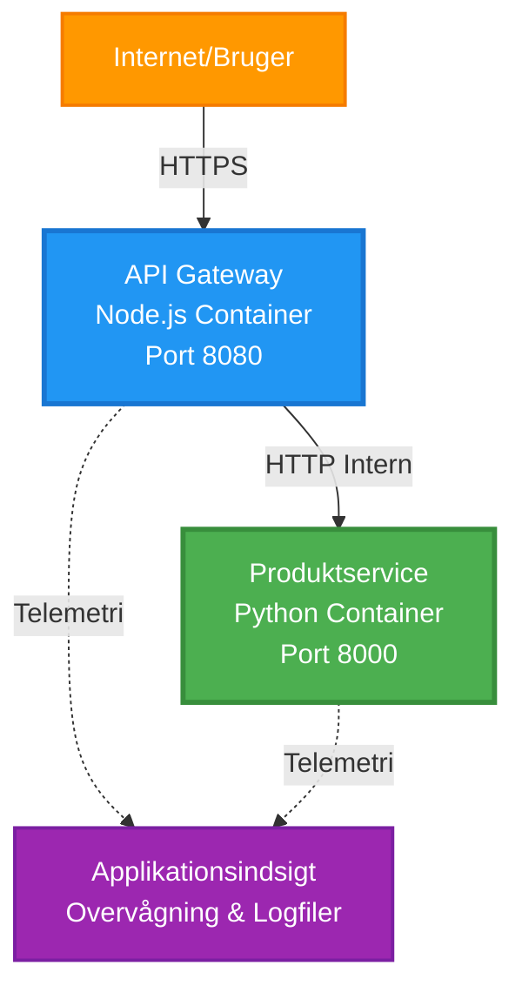
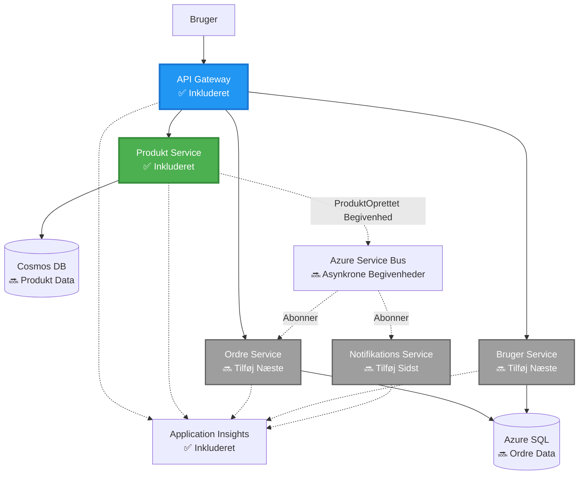
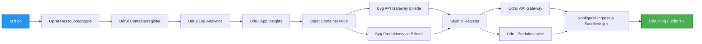
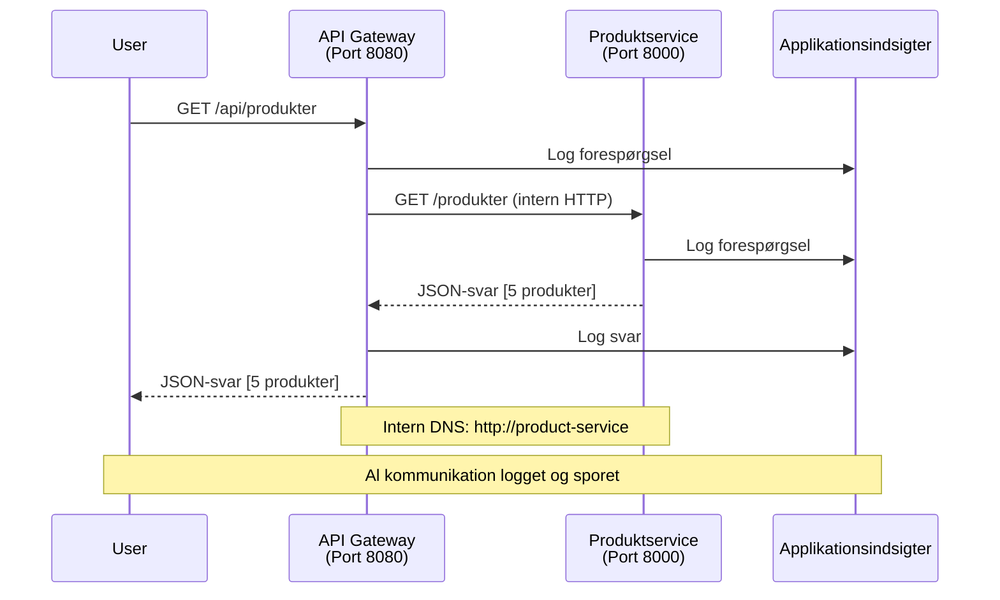

# Microservices Arkitektur - Eksempel på Container App

⏱️ **Estimeret Tid**: 25-35 minutter | 💰 **Estimeret Omkostning**: ~$50-100/måned | ⭐ **Kompleksitet**: Avanceret

**📚 Læringssti:**
- ← Forrige: [Simple Flask API](../../../../examples/container-app/simple-flask-api) - Grundlæggende om enkelt container
- 🎯 **Du Er Her**: Microservices Arkitektur (2-service fundament)
- → Næste: [AI Integration](../../../../docs/ai-foundry) - Tilføj intelligens til dine services
- 🏠 [Kursus Hjem](../../README.md)

---

En **forenklet men funktionel** microservices arkitektur implementeret i Azure Container Apps ved brug af AZD CLI. Dette eksempel demonstrerer service-til-service kommunikation, container orkestrering og overvågning med en praktisk 2-service opsætning.

> **📚 Læringsmetode**: Dette eksempel starter med en minimal 2-service arkitektur (API Gateway + Backend Service), som du faktisk kan implementere og lære fra. Når du har mestret dette fundament, giver vi vejledning til at udvide til et fuldt microservices økosystem.

## Hvad Du Vil Lære

Ved at gennemføre dette eksempel vil du:
- Implementere flere containere i Azure Container Apps
- Implementere service-til-service kommunikation med intern netværk
- Konfigurere miljøbaseret skalering og sundhedstjek
- Overvåge distribuerede applikationer med Application Insights
- Forstå implementeringsmønstre og bedste praksis for microservices
- Lære progressiv udvidelse fra simple til komplekse arkitekturer

## Arkitektur

### Fase 1: Hvad Vi Bygger (Inkluderet i Dette Eksempel)


**Komponentdetaljer:**

| Komponent | Formål | Adgang | Ressourcer |
|-----------|--------|--------|------------|
| **API Gateway** | Ruter eksterne forespørgsler til backend services | Offentlig (HTTPS) | 1 vCPU, 2GB RAM, 2-20 replikaer |
| **Produktservice** | Håndterer produktkatalog med in-memory data | Kun intern | 0.5 vCPU, 1GB RAM, 1-10 replikaer |
| **Application Insights** | Centraliseret logning og distribueret sporing | Azure Portal | 1-2 GB/måned dataindtagelse |

**Hvorfor Starte Simpelt?**
- ✅ Implementer og forstå hurtigt (25-35 minutter)
- ✅ Lær kerne microservices mønstre uden kompleksitet
- ✅ Arbejdskode, du kan ændre og eksperimentere med
- ✅ Lavere omkostninger til læring (~$50-100/måned vs $300-1400/måned)
- ✅ Opbyg selvtillid før tilføjelse af databaser og meddelelseskøer

**Analogi**: Tænk på dette som at lære at køre bil. Du starter på en tom parkeringsplads (2 services), mestrer det grundlæggende, og går derefter videre til bytrafik (5+ services med databaser).

### Fase 2: Fremtidig Udvidelse (Referencearkitektur)

Når du har mestret 2-service arkitekturen, kan du udvide til:


Se afsnittet "Udvidelsesguide" i slutningen for trin-for-trin instruktioner.

## Inkluderede Funktioner

✅ **Service Discovery**: Automatisk DNS-baseret opdagelse mellem containere  
✅ **Load Balancing**: Indbygget load balancing på tværs af replikaer  
✅ **Auto-skalering**: Uafhængig skalering pr. service baseret på HTTP-forespørgsler  
✅ **Sundhedsovervågning**: Liveness og readiness probes for begge services  
✅ **Distribueret Logning**: Centraliseret logning med Application Insights  
✅ **Intern Netværk**: Sikker service-til-service kommunikation  
✅ **Container Orkestrering**: Automatisk implementering og skalering  
✅ **Zero-Downtime Updates**: Rullende opdateringer med revisionsstyring  

## Forudsætninger

### Påkrævede Værktøjer

Før du starter, skal du sikre dig, at du har disse værktøjer installeret:

1. **[Azure Developer CLI (azd)](https://learn.microsoft.com/azure/developer/azure-developer-cli/install-azd)** (version 1.0.0 eller højere)
   ```bash
   azd version
   # Forventet output: azd version 1.0.0 eller højere
   ```

2. **[Azure CLI](https://learn.microsoft.com/cli/azure/install-azure-cli)** (version 2.50.0 eller højere)
   ```bash
   az --version
   # Forventet output: azure-cli 2.50.0 eller højere
   ```

3. **[Docker](https://www.docker.com/get-started)** (til lokal udvikling/test - valgfrit)
   ```bash
   docker --version
   # Forventet output: Docker version 20.10 eller højere
   ```

### Bekræft Dit Setup

Kør disse kommandoer for at bekræfte, at du er klar:

```bash
# Tjek Azure Developer CLI
azd version
# ✅ Forventet: azd version 1.0.0 eller højere

# Tjek Azure CLI
az --version
# ✅ Forventet: azure-cli 2.50.0 eller højere

# Tjek Docker (valgfrit)
docker --version
# ✅ Forventet: Docker version 20.10 eller højere
```

**Succes Kriterier**: Alle kommandoer returnerer versionsnumre, der matcher eller overstiger minimumskravene.

### Azure Krav

- Et aktivt **Azure abonnement** ([opret en gratis konto](https://azure.microsoft.com/free/))
- Tilladelser til at oprette ressourcer i dit abonnement
- **Contributor** rolle på abonnementet eller ressourcegruppen

### Vidensforudsætninger

Dette er et eksempel på **avanceret niveau**. Du bør have:
- Gennemført [Simple Flask API eksemplet](../../../../examples/container-app/simple-flask-api) 
- Grundlæggende forståelse af microservices arkitektur
- Kendskab til REST APIs og HTTP
- Forståelse af container begreber

**Ny til Container Apps?** Start med [Simple Flask API eksemplet](../../../../examples/container-app/simple-flask-api) først for at lære det grundlæggende.

## Hurtig Start (Trin-for-Trin)

### Trin 1: Klon og Naviger

```bash
git clone https://github.com/microsoft/AZD-for-beginners.git
cd AZD-for-beginners/examples/microservices
```

**✓ Succes Tjek**: Bekræft, at du ser `azure.yaml`:
```bash
ls
# Forventet: README.md, azure.yaml, infra/, src/
```

### Trin 2: Godkend med Azure

```bash
azd auth login
```

Dette åbner din browser til Azure-godkendelse. Log ind med dine Azure-legitimationsoplysninger.

**✓ Succes Tjek**: Du bør se:
```
Logged in to Azure.
```

### Trin 3: Initialiser Miljøet

```bash
azd init
```

**Prompter, du vil se**:
- **Miljønavn**: Indtast et kort navn (f.eks. `microservices-dev`)
- **Azure abonnement**: Vælg dit abonnement
- **Azure placering**: Vælg en region (f.eks. `eastus`, `westeurope`)

**✓ Succes Tjek**: Du bør se:
```
SUCCESS: New project initialized!
```

### Trin 4: Implementer Infrastruktur og Services

```bash
azd up
```

**Hvad der sker** (tager 8-12 minutter):


**✓ Succes Tjek**: Du bør se:
```
SUCCESS: Your application was deployed to Azure in X minutes Y seconds.
Endpoint: https://api-gateway-<unique-id>.azurecontainerapps.io
```

**⏱️ Tid**: 8-12 minutter

### Trin 5: Test Implementeringen

```bash
# Hent gateway-endpointen
GATEWAY_URL=$(azd env get-values | grep API_GATEWAY_URL | cut -d '=' -f2 | tr -d '"')

# Test API Gateway-sundhed
curl $GATEWAY_URL/health
```

**✅ Forventet output:**
```json
{
  "status": "healthy",
  "service": "api-gateway",
  "timestamp": "2025-11-19T10:30:00Z"
}
```

**Test produktservice gennem gateway**:
```bash
# Liste produkter
curl $GATEWAY_URL/api/products
```

**✅ Forventet output:**
```json
[
  {"id":1,"name":"Laptop","price":999.99,"stock":50},
  {"id":2,"name":"Mouse","price":29.99,"stock":200},
  {"id":3,"name":"Keyboard","price":79.99,"stock":150}
]
```

**✓ Succes Tjek**: Begge endpoints returnerer JSON-data uden fejl.

---

**🎉 Tillykke!** Du har implementeret en microservices arkitektur i Azure!

## Projektstruktur

Alle implementeringsfiler er inkluderet—dette er et komplet, fungerende eksempel:

```
microservices/
│
├── README.md                         # This file
├── azure.yaml                        # AZD configuration
├── .gitignore                        # Git ignore patterns
│
├── infra/                           # Infrastructure as Code (Bicep)
│   ├── main.bicep                   # Main orchestration
│   ├── abbreviations.json           # Naming conventions
│   ├── core/                        # Shared infrastructure
│   │   ├── container-apps-environment.bicep  # Container environment + registry
│   │   └── monitor.bicep            # Application Insights + Log Analytics
│   └── app/                         # Service definitions
│       ├── api-gateway.bicep        # API Gateway container app
│       └── product-service.bicep    # Product Service container app
│
└── src/                             # Application source code
    ├── api-gateway/                 # Node.js API Gateway
    │   ├── app.js                   # Express server with routing
    │   ├── package.json             # Node dependencies
    │   └── Dockerfile               # Container definition
    └── product-service/             # Python Product Service
        ├── main.py                  # Flask API with product data
        ├── requirements.txt         # Python dependencies
        └── Dockerfile               # Container definition
```

**Hvad Hver Komponent Gør:**

**Infrastruktur (infra/)**:
- `main.bicep`: Orkestrerer alle Azure-ressourcer og deres afhængigheder
- `core/container-apps-environment.bicep`: Opretter Container Apps miljøet og Azure Container Registry
- `core/monitor.bicep`: Opsætter Application Insights til distribueret logning
- `app/*.bicep`: Individuelle container app definitioner med skalering og sundhedstjek

**API Gateway (src/api-gateway/)**:
- Offentligt tilgængelig service, der ruter forespørgsler til backend services
- Implementerer logning, fejlhåndtering og forespørgselsvideresendelse
- Demonstrerer service-til-service HTTP kommunikation

**Produktservice (src/product-service/)**:
- Intern service med produktkatalog (in-memory for enkelhed)
- REST API med sundhedstjek
- Eksempel på backend microservice mønster

## Services Oversigt

### API Gateway (Node.js/Express)

**Port**: 8080  
**Adgang**: Offentlig (ekstern adgang)  
**Formål**: Ruter indkommende forespørgsler til passende backend services  

**Endpoints**:
- `GET /` - Serviceinformation
- `GET /health` - Sundhedstjek endpoint
- `GET /api/products` - Videresend til produktservice (list alle)
- `GET /api/products/:id` - Videresend til produktservice (hent efter ID)

**Nøglefunktioner**:
- Forespørgselsruting med axios
- Centraliseret logning
- Fejlhåndtering og timeout management
- Service discovery via miljøvariabler
- Application Insights integration

**Kode Uddrag** (`src/api-gateway/app.js`):
```javascript
// Intern tjenestekommunikation
app.get('/api/products', async (req, res) => {
  const response = await axios.get(`${PRODUCT_SERVICE_URL}/products`, {
    timeout: 5000
  });
  res.json(response.data);
});
```

### Produktservice (Python/Flask)

**Port**: 8000  
**Adgang**: Kun intern (ingen ekstern adgang)  
**Formål**: Håndterer produktkatalog med in-memory data  

**Endpoints**:
- `GET /` - Serviceinformation
- `GET /health` - Sundhedstjek endpoint
- `GET /products` - List alle produkter
- `GET /products/<id>` - Hent produkt efter ID

**Nøglefunktioner**:
- RESTful API med Flask
- In-memory produktlager (simpelt, ingen database nødvendig)
- Sundhedsovervågning med probes
- Struktureret logning
- Application Insights integration

**Datamodel**:
```python
{
  "id": 1,
  "name": "Laptop",
  "description": "High-performance laptop",
  "price": 999.99,
  "stock": 50
}
```

**Hvorfor Kun Intern?**
Produktservicen er ikke offentligt eksponeret. Alle forespørgsler skal gå gennem API Gateway, som giver:
- Sikkerhed: Kontrolleret adgangspunkt
- Fleksibilitet: Kan ændre backend uden at påvirke klienter
- Overvågning: Centraliseret forespørgselslogning

## Forståelse af Service Kommunikation

### Hvordan Services Kommunikerer


I dette eksempel kommunikerer API Gateway med Produktservice ved brug af **interne HTTP-kald**:

```javascript
// API Gateway (src/api-gateway/app.js)
const PRODUCT_SERVICE_URL = process.env.PRODUCT_SERVICE_URL;

// Foretag intern HTTP-anmodning
const response = await axios.get(`${PRODUCT_SERVICE_URL}/products`);
```

**Nøglepunkter**:

1. **DNS-Baseret Opdagelse**: Container Apps leverer automatisk DNS til interne services
   - Produktservice FQDN: `product-service.internal.<environment>.azurecontainerapps.io`
   - Forenklet som: `http://product-service` (Container Apps løser det)

2. **Ingen Offentlig Eksponering**: Produktservice har `external: false` i Bicep
   - Kun tilgængelig inden for Container Apps miljøet
   - Kan ikke nås fra internettet

3. **Miljøvariabler**: Service URLs injiceres ved implementering
   - Bicep sender den interne FQDN til gatewayen
   - Ingen hardkodede URLs i applikationskoden

**Analogi**: Tænk på dette som kontorlokaler. API Gateway er receptionen (offentligt tilgængelig), og Produktservice er et kontor (kun internt). Besøgende skal gå gennem receptionen for at nå ethvert kontor.

## Implementeringsmuligheder

### Fuld Implementering (Anbefalet)

```bash
# Udrul infrastruktur og begge tjenester
azd up
```

Dette implementerer:
1. Container Apps miljø
2. Application Insights
3. Container Registry
4. API Gateway container
5. Produktservice container

**Tid**: 8-12 minutter

### Implementer Individuel Service

```bash
# Udrul kun én tjeneste (efter initial azd op)
azd deploy api-gateway

# Eller udrul produkttjeneste
azd deploy product-service
```

**Brugstilfælde**: Når du har opdateret kode i én service og vil genimplementere kun den service.

### Opdater Konfiguration

```bash
# Ændr skaleringsparametre
azd env set GATEWAY_MAX_REPLICAS 30

# Genudrul med ny konfiguration
azd up
```

## Konfiguration

### Skalering Konfiguration

Begge services er konfigureret med HTTP-baseret autoskalering i deres Bicep-filer:

**API Gateway**:
- Min replikaer: 2 (altid mindst 2 for tilgængelighed)
- Max replikaer: 20
- Skaleringstrigger: 50 samtidige forespørgsler pr. replika

**Produktservice**:
- Min replikaer: 1 (kan skaleres til nul, hvis nødvendigt)
- Max replikaer: 10
- Skaleringstrigger: 100 samtidige forespørgsler pr. replika

**Tilpas Skalering** (i `infra/app/*.bicep`):
```bicep
scale: {
  minReplicas: 1
  maxReplicas: 10
  rules: [
    {
      name: 'http-scale-rule'
      http: {
        metadata: {
          concurrentRequests: '100'  // Adjust this
        }
      }
    }
  ]
}
```

### Ressourceallokering

**API Gateway**:
- CPU: 1.0 vCPU
- Hukommelse: 2 GiB
- Årsag: Håndterer al ekstern trafik

**Produktservice**:
- CPU: 0.5 vCPU
- Hukommelse: 1 GiB
- Årsag: Letvægts in-memory operationer

### Sundhedstjek

Begge services inkluderer liveness og readiness probes:

```bicep
probes: [
  {
    type: 'Liveness'
    httpGet: {
      path: '/health'
      port: 8080
    }
    initialDelaySeconds: 10
    periodSeconds: 30
  }
  {
    type: 'Readiness'
    httpGet: {
      path: '/health'
      port: 8080
    }
    initialDelaySeconds: 5
    periodSeconds: 10
  }
]
```

**Hvad Dette Betyder**:
- **Liveness**: Hvis sundhedstjek fejler, genstarter Container Apps containeren
- **Readiness**: Hvis ikke klar, stopper Container Apps med at rute trafik til den replika

## Overvågning & Observabilitet

### Se Service Logs

```bash
# Stream logfiler fra API Gateway
azd logs api-gateway --follow

# Se nylige produktservice logfiler
azd logs product-service --tail 100

# Se alle logfiler fra begge tjenester
azd logs --follow
```

**Forventet Output**:
```
[api-gateway] API Gateway listening on port 8080
[api-gateway] Product Service URL: http://product-service
[api-gateway] GET /api/products 200 - 45ms
[product-service] Retrieved 5 products
```

### Application Insights Forespørgsler

Få adgang til Application Insights i Azure Portal, og kør disse forespørgsler:

**Find Langsomme Forespørgsler**:
```kusto
requests
| where timestamp > ago(1h)
| where duration > 1000  // Requests taking >1 second
| summarize count() by name, cloud_RoleName
| order by count_ desc
```

**Spor Service-til-Service Kald**:
```kusto
dependencies
| where timestamp > ago(1h)
| where type == "Http"
| project timestamp, name, target, duration, success
| order by timestamp desc
```

**Fejlrate pr. Service**:
```kusto
exceptions
| where timestamp > ago(24h)
| summarize errorCount = count() by cloud_RoleName, type
| order by errorCount desc
```

**Forespørgselsvolumen Over Tid**:
```kusto
requests
| where timestamp > ago(1h)
| summarize requestCount = count() by bin(timestamp, 5m), cloud_RoleName
| render timechart
```

### Få Adgang til Overvågningsdashboard

```bash
# Hent Application Insights detaljer
azd env get-values | grep APPLICATIONINSIGHTS

# Åbn Azure Portal overvågning
az monitor app-insights component show \
  --app $(azd env get-values | grep APPLICATIONINSIGHTS_CONNECTION_STRING | cut -d '=' -f2) \
  --resource-group $(azd env get-values | grep AZURE_RESOURCE_GROUP | cut -d '=' -f2) \
  --query "appId" -o tsv
```

### Live Metrics

1. Naviger til Application Insights i Azure Portal
2. Klik på "Live Metrics"
3. Se realtids forespørgsler, fejl og ydeevne
4. Test ved at køre: `curl $(azd env get-values | grep API_GATEWAY_URL | cut -d '=' -f2 | tr -d '"')/api/products`

## Praktiske Øvelser

### Øvelse 1: Tilføj en Ny Produkt Endpoint ⭐ (Let)

**Mål**: Tilføj en POST endpoint for at oprette nye produkter

**Udgangspunkt**: `src/product-service/main.py`

**Trin**:

1. Tilføj denne endpoint efter `get_product` funktionen i `main.py`:

```python
@app.route('/products', methods=['POST'])
def create_product():
    """Create a new product"""
    data = request.get_json()
    
    # Valider påkrævede felter
    if not data or 'name' not in data or 'price' not in data:
        return jsonify({'error': 'Missing required fields: name, price'}), 400
    
    new_id = max(p['id'] for p in products) + 1
    new_product = {
        'id': new_id,
        'name': data['name'],
        'description': data.get('description', ''),
        'price': float(data['price']),
        'stock': int(data.get('stock', 0))
    }
    products.append(new_product)
    logger.info(f"Created product {new_id}")
    return jsonify(new_product), 201
```

2. Tilføj POST rute til API Gateway (`src/api-gateway/app.js`):

```javascript
// Tilføj dette efter GET /api/products ruten
app.post('/api/products', async (req, res) => {
  try {
    console.log(`Forwarding POST request to ${PRODUCT_SERVICE_URL}/products`);
    const response = await axios.post(`${PRODUCT_SERVICE_URL}/products`, req.body, {
      timeout: 5000
    });
    res.status(201).json(response.data);
  } catch (error) {
    console.error('Error calling product service:', error.message);
    res.status(503).json({
      error: 'Product service unavailable',
      message: error.message
    });
  }
});
```

3. Genudrul begge tjenester:

```bash
azd deploy product-service
azd deploy api-gateway
```

4. Test det nye endpoint:

```bash
GATEWAY_URL=$(azd env get-values | grep API_GATEWAY_URL | cut -d '=' -f2 | tr -d '"')

# Opret et nyt produkt
curl -X POST $GATEWAY_URL/api/products \
  -H "Content-Type: application/json" \
  -d '{"name":"USB Cable","price":9.99,"stock":500}'
```

**✅ Forventet output:**
```json
{"id":6,"name":"USB Cable","description":"","price":9.99,"stock":500}
```

5. Bekræft, at det vises på listen:

```bash
curl $GATEWAY_URL/api/products
# Skal nu vise 6 produkter inklusive det nye USB-kabel
```

**Succeskriterier**:
- ✅ POST-anmodning returnerer HTTP 201
- ✅ Nyt produkt vises i GET /api/products listen
- ✅ Produktet har auto-inkrementeret ID

**Tid**: 10-15 minutter

---

### Øvelse 2: Ændr Autoskalering Regler ⭐⭐ (Mellem)

**Mål**: Ændr Product Service til at skalere mere aggressivt

**Udgangspunkt**: `infra/app/product-service.bicep`

**Trin**:

1. Åbn `infra/app/product-service.bicep` og find `scale` blokken (omkring linje 95)

2. Ændr fra:
```bicep
scale: {
  minReplicas: 1
  maxReplicas: 10
  rules: [
    {
      name: 'http-scale-rule'
      http: {
        metadata: {
          concurrentRequests: '100'  // OLD
        }
      }
    }
  ]
}
```

Til:
```bicep
scale: {
  minReplicas: 2  // Always have 2 running
  maxReplicas: 20  // Allow more scaling
  rules: [
    {
      name: 'http-scale-rule'
      http: {
        metadata: {
          concurrentRequests: '20'  // Scale at lower threshold
        }
      }
    }
  ]
}
```

3. Genudrul infrastrukturen:

```bash
azd up
```

4. Bekræft den nye skalering-konfiguration:

```bash
az containerapp show \
  --name $(azd env get-values | grep PRODUCT_SERVICE | head -1 | cut -d '/' -f5) \
  --resource-group $(azd env get-values | grep AZURE_RESOURCE_GROUP | cut -d '=' -f2 | tr -d '"') \
  --query "properties.template.scale" -o json
```

**✅ Forventet output:**
```json
{
  "minReplicas": 2,
  "maxReplicas": 20,
  "rules": [...]
}
```

5. Test autoskalering med belastning:

```bash
# Generer samtidige anmodninger
for i in {1..500}; do curl $GATEWAY_URL/api/products & done

# Se skalering ske
azd logs product-service --follow
# Kig efter: Container Apps skalering begivenheder
```

**Succeskriterier**:
- ✅ Product Service kører altid mindst 2 replikaer
- ✅ Under belastning skalerer til mere end 2 replikaer
- ✅ Azure Portal viser de nye skalering regler

**Tid**: 15-20 minutter

---

### Øvelse 3: Tilføj Brugerdefineret Overvågningsforespørgsel ⭐⭐ (Mellem)

**Mål**: Opret en brugerdefineret Application Insights forespørgsel for at spore produkt API's ydeevne

**Trin**:

1. Naviger til Application Insights i Azure Portal:
   - Gå til Azure Portal
   - Find din resourcegruppe (rg-microservices-*)
   - Klik på Application Insights ressource

2. Klik på "Logs" i venstre menu

3. Opret denne forespørgsel:

```kusto
requests
| where timestamp > ago(1h)
| where name contains "products"
| summarize 
    RequestCount = count(),
    AvgDuration = avg(duration),
    P95Duration = percentile(duration, 95),
    SuccessRate = 100.0 * countif(success == true) / count()
  by bin(timestamp, 5m)
| render timechart
```

4. Klik på "Run" for at udføre forespørgslen

5. Gem forespørgslen:
   - Klik på "Save"
   - Navn: "Product API Performance"
   - Kategori: "Performance"

6. Generer testtrafik:

```bash
for i in {1..100}; do curl $GATEWAY_URL/api/products; sleep 1; done
```

7. Opdater forespørgslen for at se data

**✅ Forventet output:**
- Diagram, der viser anmodningstællinger over tid
- Gennemsnitlig varighed < 500ms
- Succesrate = 100%
- Tidsintervaller på 5 minutter

**Succeskriterier**:
- ✅ Forespørgslen viser 100+ anmodninger
- ✅ Succesrate er 100%
- ✅ Gennemsnitlig varighed < 500ms
- ✅ Diagram viser 5-minutters tidsintervaller

**Læringsmål**: Forstå, hvordan man overvåger serviceydelse med brugerdefinerede forespørgsler

**Tid**: 10-15 minutter

---

### Øvelse 4: Implementer Retry Logik ⭐⭐⭐ (Avanceret)

**Mål**: Tilføj retry logik til API Gateway, når Product Service midlertidigt er utilgængelig

**Udgangspunkt**: `src/api-gateway/app.js`

**Trin**:

1. Installer retry bibliotek:

```bash
cd src/api-gateway
npm install axios-retry --save
cd ../..
```

2. Opdater `src/api-gateway/app.js` (tilføj efter axios import):

```javascript
const axiosRetry = require('axios-retry');

// Konfigurer genforsøgslogik
axiosRetry(axios, {
  retries: 3,
  retryDelay: (retryCount) => {
    return retryCount * 1000; // 1s, 2s, 3s
  },
  retryCondition: (error) => {
    // Forsøg igen ved netværksfejl eller 5xx-svar
    return axiosRetry.isNetworkOrIdempotentRequestError(error) ||
           (error.response && error.response.status >= 500);
  }
});

console.log('Retry logic configured: 3 retries with exponential backoff');
```

3. Genudrul API Gateway:

```bash
azd deploy api-gateway
```

4. Test retry adfærd ved at simulere servicefejl:

```bash
# Skaler produktservice til 0 (simuler fejl)
az containerapp update \
  --name $(azd env get-values | grep PRODUCT_SERVICE | head -1 | cut -d '/' -f5) \
  --resource-group $(azd env get-values | grep AZURE_RESOURCE_GROUP | cut -d '=' -f2 | tr -d '"') \
  --min-replicas 0 \
  --max-replicas 0

# Prøv at få adgang til produkter (vil forsøge igen 3 gange)
time curl -v $GATEWAY_URL/api/products
# Observer: Respons tager ~6 sekunder (1s + 2s + 3s forsøg)

# Gendan produktservice
az containerapp update \
  --name $(azd env get-values | grep PRODUCT_SERVICE | head -1 | cut -d '/' -f5) \
  --resource-group $(azd env get-values | grep AZURE_RESOURCE_GROUP | cut -d '=' -f2 | tr -d '"') \
  --min-replicas 1 \
  --max-replicas 10
```

5. Se retry logs:

```bash
azd logs api-gateway --tail 50
# Kig efter: Forsøg på genforsøg meddelelser
```

**✅ Forventet adfærd:**
- Anmodninger prøver igen 3 gange før fejl
- Hver retry venter længere (1s, 2s, 3s)
- Succesfulde anmodninger efter service genstarter
- Logs viser retry forsøg

**Succeskriterier**:
- ✅ Anmodninger prøver igen 3 gange før fejl
- ✅ Hver retry venter længere (eksponentiel backoff)
- ✅ Succesfulde anmodninger efter service genstarter
- ✅ Logs viser retry forsøg

**Læringsmål**: Forstå modstandsdygtighedsmønstre i mikrotjenester (circuit breakers, retries, timeouts)

**Tid**: 20-25 minutter

---

## Videnskontrol

Efter at have gennemført dette eksempel, verificer din forståelse:

### 1. Servicekommunikation ✓

Test din viden:
- [ ] Kan du forklare, hvordan API Gateway opdager Product Service? (DNS-baseret serviceopdagelse)
- [ ] Hvad sker der, hvis Product Service er nede? (Gateway returnerer 503 fejl)
- [ ] Hvordan ville du tilføje en tredje service? (Opret ny Bicep-fil, tilføj til main.bicep, opret src-mappe)

**Praktisk Verifikation:**
```bash
# Simuler tjenestefejl
az containerapp update --name <product-service-name> --min-replicas 0 --max-replicas 0
curl $GATEWAY_URL/api/products
# ✅ Forventet: 503 Service Utilgængelig

# Gendan tjeneste
az containerapp update --name <product-service-name> --min-replicas 1 --max-replicas 10
```

### 2. Overvågning & Observabilitet ✓

Test din viden:
- [ ] Hvor ser du distribuerede logs? (Application Insights i Azure Portal)
- [ ] Hvordan sporer du langsomme anmodninger? (Kusto forespørgsel: `requests | where duration > 1000`)
- [ ] Kan du identificere, hvilken service der forårsagede en fejl? (Tjek `cloud_RoleName` feltet i logs)

**Praktisk Verifikation:**
```bash
# Generer en langsom forespørgselssimulering
curl "$GATEWAY_URL/api/products?delay=2000"

# Forespørg Application Insights for langsomme forespørgsler
# Naviger til Azure Portal → Application Insights → Logs
# Kør: requests | where duration > 1000 | project timestamp, name, duration, cloud_RoleName
```

### 3. Skalering & Ydeevne ✓

Test din viden:
- [ ] Hvad udløser autoskalering? (HTTP samtidige anmodningsregler: 50 for gateway, 100 for produkt)
- [ ] Hvor mange replikaer kører nu? (Tjek med `az containerapp revision list`)
- [ ] Hvordan ville du skalere Product Service til 5 replikaer? (Opdater minReplicas i Bicep)

**Praktisk Verifikation:**
```bash
# Generer belastning for at teste autoskalering
for i in {1..1000}; do curl $GATEWAY_URL/api/products & done

# Se replikaer øges
azd logs api-gateway --follow
# ✅ Forventet: Se skaleringsevents i logfiler
```

**Succeskriterier**: Du kan besvare alle spørgsmål og verificere med praktiske kommandoer.

---

## Omkostningsanalyse

### Estimerede Månedlige Omkostninger (For Dette 2-Service Eksempel)

| Ressource | Konfiguration | Estimeret Omkostning |
|-----------|---------------|----------------------|
| API Gateway | 2-20 replikaer, 1 vCPU, 2GB RAM | $30-150 |
| Product Service | 1-10 replikaer, 0.5 vCPU, 1GB RAM | $15-75 |
| Container Registry | Basisniveau | $5 |
| Application Insights | 1-2 GB/måned | $5-10 |
| Log Analytics | 1 GB/måned | $3 |
| **Total** | | **$58-243/måned** |

### Omkostningsfordeling efter Brug

**Let trafik** (test/læring): ~$60/måned
- API Gateway: 2 replikaer × 24/7 = $30
- Product Service: 1 replika × 24/7 = $15
- Overvågning + Registry = $13

**Moderat trafik** (lille produktion): ~$120/måned
- API Gateway: 5 gennemsnitlige replikaer = $75
- Product Service: 3 gennemsnitlige replikaer = $45
- Overvågning + Registry = $13

**Høj trafik** (travle perioder): ~$240/måned
- API Gateway: 15 gennemsnitlige replikaer = $225
- Product Service: 8 gennemsnitlige replikaer = $120
- Overvågning + Registry = $13

### Tips til Omkostningsoptimering

1. **Skaler til nul for udvikling**:
   ```bicep
   scale: {
     minReplicas: 0  // Save $30-40/month when not in use
     maxReplicas: 10
   }
   ```

2. **Brug Forbrugsplan for Cosmos DB** (når du tilføjer det):
   - Betal kun for det, du bruger
   - Ingen minimumsgebyr

3. **Indstil Application Insights Sampling**:
   ```javascript
   appInsights.defaultClient.config.samplingPercentage = 50; // Udtag 50% af forespørgsler
   ```

4. **Ryd op, når det ikke er nødvendigt**:
   ```bash
   azd down --force --purge
   ```

### Gratis Niveau Muligheder

Til læring/test, overvej:
- ✅ Brug Azure gratis kreditter ($200 for de første 30 dage med nye konti)
- ✅ Hold til minimum replikaer (sparer ~50% omkostninger)
- ✅ Slet efter test (ingen løbende gebyrer)
- ✅ Skaler til nul mellem læringssessioner

**Eksempel**: Kør dette eksempel i 2 timer/dag × 30 dage = ~$5/måned i stedet for $60/måned

---

## Fejlfinding Hurtig Reference

### Problem: `azd up` fejler med "Subscription not found"

**Løsning**:
```bash
# Log ind igen med eksplicit abonnement
az account set --subscription <your-subscription-id>
azd env set AZURE_SUBSCRIPTION_ID <your-subscription-id>
azd up
```

### Problem: API Gateway returnerer 503 "Product service unavailable"

**Diagnose**:
```bash
# Kontroller produktservicelogfiler
azd logs product-service --tail 50

# Kontroller produktservice sundhed
az containerapp show \
  --name $(azd env get-values | grep PRODUCT_SERVICE | head -1 | cut -d '/' -f5) \
  --resource-group $(azd env get-values | grep AZURE_RESOURCE_GROUP | cut -d '=' -f2 | tr -d '"') \
  --query "properties.runningStatus"
```

**Almindelige Årsager**:
1. Product service startede ikke (tjek logs for Python fejl)
2. Sundhedstjek fejler (bekræft `/health` endpoint fungerer)
3. Container image build fejlede (tjek registry for image)

### Problem: Autoskalering virker ikke

**Diagnose**:
```bash
# Kontroller nuværende replikaantal
az containerapp revision list \
  --name $(azd env get-values | grep API_GATEWAY | head -1 | cut -d '/' -f5) \
  --resource-group $(azd env get-values | grep AZURE_RESOURCE_GROUP | cut -d '=' -f2 | tr -d '"') \
  --query "[].properties.replicas"

# Generer belastning til test
for i in {1..1000}; do curl $GATEWAY_URL/api/products & done

# Overvåg skaleringsevents
azd logs api-gateway --follow | grep -i scale
```

**Almindelige Årsager**:
1. Belastning ikke høj nok til at udløse skalering regel (kræver >50 samtidige anmodninger)
2. Maksimale replikaer allerede nået (tjek Bicep konfiguration)
3. Skalering regel forkert konfigureret i Bicep (bekræft concurrentRequests værdi)

### Problem: Application Insights viser ikke logs

**Diagnose**:
```bash
# Bekræft, at forbindelsesstrengen er indstillet
azd env get-values | grep APPLICATIONINSIGHTS

# Kontroller, om tjenester sender telemetri
az monitor app-insights component show \
  --app $(azd env get-values | grep APPLICATIONINSIGHTS_NAME | cut -d '=' -f2 | tr -d '"') \
  --resource-group $(azd env get-values | grep AZURE_RESOURCE_GROUP | cut -d '=' -f2 | tr -d '"') \
  --query "properties.InstrumentationKey"
```

**Almindelige Årsager**:
1. Forbindelsesstreng ikke sendt til container (tjek miljøvariabler)
2. Application Insights SDK ikke konfigureret (bekræft imports i kode)
3. Firewall blokerer telemetri (sjældent, tjek netværksregler)

### Problem: Docker build fejler lokalt

**Diagnose**:
```bash
# Test API Gateway bygning
cd src/api-gateway
docker build -t test-gateway .

# Test Product Service bygning
cd ../product-service
docker build -t test-product .
```

**Almindelige Årsager**:
1. Manglende afhængigheder i package.json/requirements.txt
2. Dockerfile syntaksfejl
3. Netværksproblemer ved download af afhængigheder

**Stadig Fastlåst?** Se [Common Issues Guide](../../docs/troubleshooting/common-issues.md) eller [Azure Container Apps Troubleshooting](https://learn.microsoft.com/azure/container-apps/troubleshooting)

---

## Oprydning

For at undgå løbende omkostninger, slet alle ressourcer:

```bash
azd down --force --purge
```

**Bekræftelsesprompt**:
```
? Total resources to delete: 6, are you sure you want to continue? (y/N)
```

Skriv `y` for at bekræfte.

**Hvad Bliver Slettet**:
- Container Apps Miljø
- Begge Container Apps (gateway & product service)
- Container Registry
- Application Insights
- Log Analytics Workspace
- Resourcegruppe

**✓ Bekræft Oprydning**:
```bash
az group list --query "[?starts_with(name,'rg-microservices')]" --output table
```

Skal returnere tomt.

---

## Udvidelsesguide: Fra 2 til 5+ Tjenester

Når du har mestret denne 2-service arkitektur, her er hvordan du udvider:

### Fase 1: Tilføj Database Persistens (Næste Skridt)

**Tilføj Cosmos DB til Product Service**:

1. Opret `infra/core/cosmos.bicep`:
   ```bicep
   resource cosmosAccount 'Microsoft.DocumentDB/databaseAccounts@2023-04-15' = {
     name: name
     location: location
     kind: 'GlobalDocumentDB'
     properties: {
       databaseAccountOfferType: 'Standard'
       consistencyPolicy: { defaultConsistencyLevel: 'Session' }
       locations: [{ locationName: location, failoverPriority: 0 }]
     }
   }
   ```

2. Opdater produktservice til at bruge Azure Cosmos DB Python SDK i stedet for in-memory data

3. Estimeret ekstra omkostning: ~$25/måned (serverless)

### Fase 2: Tilføj Tredje Service (Ordrehåndtering)

**Opret Order Service**:

1. Ny mappe: `src/order-service/` (Python/Node.js/C#)
2. Ny Bicep: `infra/app/order-service.bicep`
3. Opdater API Gateway til at rute `/api/orders`
4. Tilføj Azure SQL Database til ordre persistens

**Arkitekturen bliver**:
```
API Gateway → Product Service (Cosmos DB)
           → Order Service (Azure SQL)
```

### Fase 3: Tilføj Asynkron Kommunikation (Service Bus)

**Implementer Event-Driven Arkitektur**:

1. Tilføj Azure Service Bus: `infra/core/servicebus.bicep`
2. Product Service publicerer "ProductCreated" events
3. Order Service abonnerer på produkt events
4. Tilføj Notification Service til at behandle events

**Mønster**: Request/Response (HTTP) + Event-Driven (Service Bus)

### Fase 4: Tilføj Brugerautentifikation

**Implementer User Service**:

1. Opret `src/user-service/` (Go/Node.js)
2. Tilføj Azure AD B2C eller brugerdefineret JWT autentifikation
3. API Gateway validerer tokens før routing
4. Tjenester tjekker brugerrettigheder

### Fase 5: Produktionsklarhed

**Tilføj Disse Komponenter**:
- ✅ Azure Front Door (global load balancing)
- ✅ Azure Key Vault (hemmelighedshåndtering)
- ✅ Azure Monitor Workbooks (brugerdefinerede dashboards)
- ✅ CI/CD Pipeline (GitHub Actions)
- ✅ Blue-Green Deployments
- ✅ Managed Identity for alle tjenester

**Fuld Produktionsarkitektur Omkostning**: ~$300-1,400/måned

---

## Lær Mere

### Relateret Dokumentation
- [Azure Container Apps Dokumentation](https://learn.microsoft.com/azure/container-apps/)
- [Mikrotjenester Arkitektur Guide](https://learn.microsoft.com/azure/architecture/guide/architecture-styles/microservices)
- [Application Insights for Distribueret Sporing](https://learn.microsoft.com/azure/azure-monitor/app/distributed-tracing)
- [Azure Developer CLI Dokumentation](https://learn.microsoft.com/azure/developer/azure-developer-cli/)

### Næste Skridt i Denne Kursus
- ← Forrige: [Simple Flask API](../../../../examples/container-app/simple-flask-api) - Begynder enkelt-container eksempel
- → Næste: [AI Integration Guide](../../../../docs/ai-foundry) - Tilføj AI kapaciteter
- 🏠 [Kursus Hjem](../../README.md)

### Sammenligning: Hvornår Skal Man Bruge Hvad

| Funktion | Enkelt Container | Mikrotjenester (Dette) | Kubernetes (AKS) |
|----------|------------------|-----------------------|------------------|
| **Brugsscenarie** | Simple apps | Komplekse apps | Enterprise apps |
| **Skalerbarhed** | Enkelt service | Per-service skalering | Maksimal fleksibilitet |
| **Kompleksitet** | Lav | Medium | Høj |
| **Teamstørrelse** | 1-3 udviklere | 3-10 udviklere | 10+ udviklere |
| **Omkostning** | ~$15-50/måned | ~$60-250/måned | ~$150-500/måned |
| **Implementeringstid** | 5-10 minutter | 8-12 minutter | 15-30 minutter |
| **Bedst til** | MVP'er, prototyper | Produktionsapps | Multi-cloud, avanceret netværk |

**Anbefaling**: Start med Container Apps (dette eksempel), skift til AKS kun hvis du har brug for Kubernetes-specifikke funktioner.

---

## Ofte stillede spørgsmål

**Q: Hvorfor kun 2 tjenester i stedet for 5+?**  
A: Pædagogisk progression. Mest fundamentet (tjenestekommunikation, overvågning, skalering) med et simpelt eksempel, før du tilføjer kompleksitet. De mønstre, du lærer her, gælder også for arkitekturer med 100 tjenester.

**Q: Kan jeg selv tilføje flere tjenester?**  
A: Absolut! Følg udvidelsesguiden ovenfor. Hver ny tjeneste følger samme mønster: opret src-mappe, opret Bicep-fil, opdater azure.yaml, deploy.

**Q: Er dette klar til produktion?**  
A: Det er et solidt fundament. Til produktion skal du tilføje: managed identity, Key Vault, persistente databaser, CI/CD-pipeline, overvågningsalarmer og backup-strategi.

**Q: Hvorfor ikke bruge Dapr eller andre service mesh?**  
A: Hold det simpelt for læringens skyld. Når du forstår native Container Apps-netværk, kan du tilføje Dapr til avancerede scenarier (tilstandshåndtering, pub/sub, bindings).

**Q: Hvordan debugger jeg lokalt?**  
A: Kør tjenester lokalt med Docker:  
```bash
cd src/api-gateway
docker build -t local-gateway .
docker run -p 8080:8080 -e PRODUCT_SERVICE_URL=http://localhost:8000 local-gateway
```
  
**Q: Kan jeg bruge forskellige programmeringssprog?**  
A: Ja! Dette eksempel viser Node.js (gateway) + Python (produktservice). Du kan blande alle sprog, der kan køre i containere: C#, Go, Java, Ruby, PHP osv.

**Q: Hvad hvis jeg ikke har Azure-kreditter?**  
A: Brug Azure gratis niveau (de første 30 dage med nye konti får $200 kreditter) eller deploy til korte testperioder og slet straks. Dette eksempel koster ca. $2/dag.

**Q: Hvordan adskiller dette sig fra Azure Kubernetes Service (AKS)?**  
A: Container Apps er enklere (ingen Kubernetes-viden nødvendig) men mindre fleksibel. AKS giver dig fuld Kubernetes-kontrol, men kræver mere ekspertise. Start med Container Apps, og skift til AKS, hvis nødvendigt.

**Q: Kan jeg bruge dette med eksisterende Azure-tjenester?**  
A: Ja! Du kan forbinde til eksisterende databaser, storage-konti, Service Bus osv. Opdater Bicep-filer for at referere til eksisterende ressourcer i stedet for at oprette nye.

---

> **🎓 Opsummering af læringssti**: Du har lært at deploye en multi-service arkitektur med automatisk skalering, internt netværk, centraliseret overvågning og produktionsklare mønstre. Dette fundament forbereder dig på komplekse distribuerede systemer og enterprise-mikrotjenestearkitekturer.

**📚 Kursusnavigation:**
- ← Forrige: [Simple Flask API](../../../../examples/container-app/simple-flask-api)
- → Næste: [Database Integration Example](../../../../database-app)
- 🏠 [Kursus Hjem](../../README.md)
- 📖 [Container Apps Best Practices](../../docs/deployment/deployment-guide.md)

---

**✨ Tillykke!** Du har gennemført mikrotjenesteeksemplet. Du forstår nu, hvordan man bygger, deployer og overvåger distribuerede applikationer på Azure Container Apps. Klar til at tilføje AI-funktioner? Tjek [AI Integration Guide](../../../../docs/ai-foundry)!

---

<!-- CO-OP TRANSLATOR DISCLAIMER START -->
**Ansvarsfraskrivelse**:  
Dette dokument er blevet oversat ved hjælp af AI-oversættelsestjenesten [Co-op Translator](https://github.com/Azure/co-op-translator). Selvom vi bestræber os på nøjagtighed, skal det bemærkes, at automatiserede oversættelser kan indeholde fejl eller unøjagtigheder. Det originale dokument på dets oprindelige sprog bør betragtes som den autoritative kilde. For kritisk information anbefales professionel menneskelig oversættelse. Vi er ikke ansvarlige for eventuelle misforståelser eller fejltolkninger, der opstår som følge af brugen af denne oversættelse.
<!-- CO-OP TRANSLATOR DISCLAIMER END -->