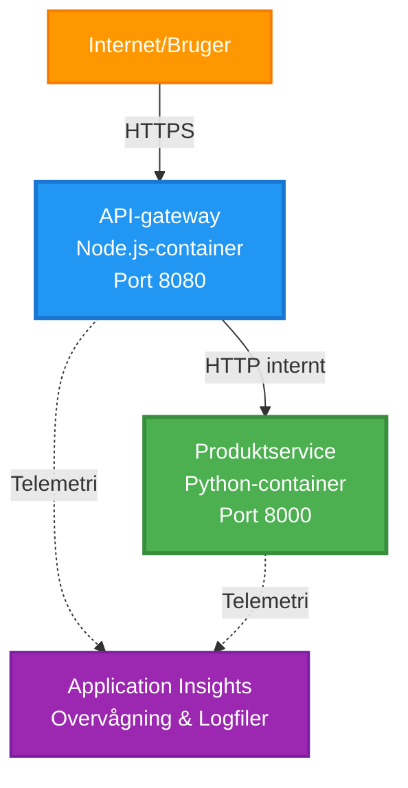
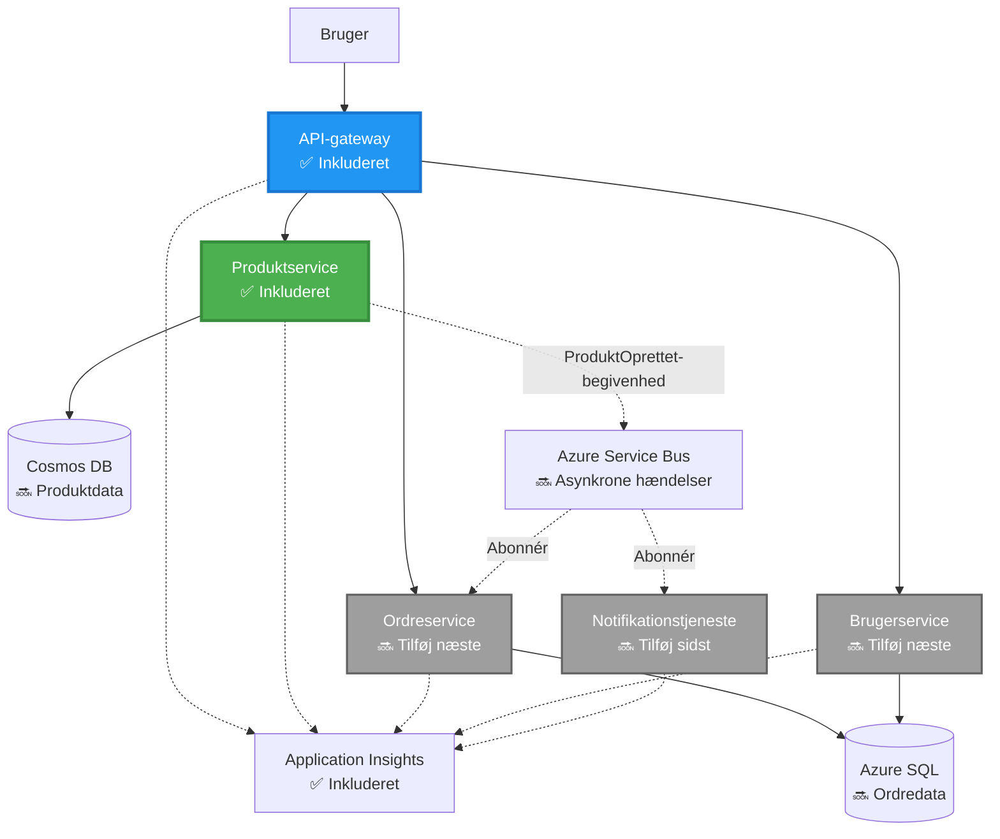
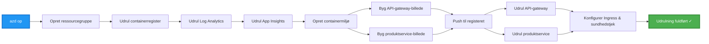
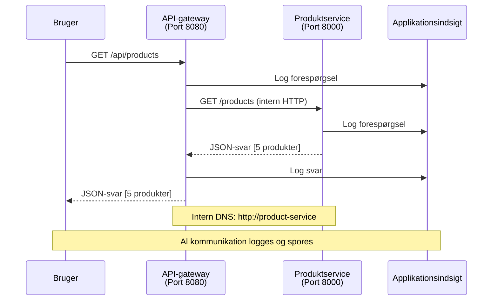

# Mikrotjenestearkitektur - Container App-eksempel

⏱️ **Anslået tid**: 25-35 minutter | 💰 **Anslået pris**: ~$50-100/måned | ⭐ **Kompleksitet**: Avanceret

**📚 Læringssti:**
- ← Forrige: [Simple Flask API](../../../../examples/container-app/simple-flask-api) - Grundlæggende for enkelt container
- 🎯 **Du er her**: Mikrotjenestearkitektur (2-tjenesters fundament)
- → Næste: [AI Integration](../../../../docs/ai-foundry) - Tilføj intelligens til dine tjenester
- 🏠 [Kursusforside](../../README.md)

---

En **forenklet men funktionel** mikrotjenestearkitektur udrullet til Azure Container Apps ved hjælp af AZD CLI. Dette eksempel demonstrerer service-til-service-kommunikation, containerorkestrering og overvågning med en praktisk 2-tjenesters opsætning.

> **📚 Læringsmetode**: Dette eksempel starter med en minimal 2-tjenesters arkitektur (API Gateway + Backend Service), som du rent faktisk kan udrulle og lære fra. Når du mestrer dette fundament, giver vi vejledning til at udvide til et fuldt mikrotjeneste-økosystem.

## Hvad du vil lære

Ved at fuldføre dette eksempel vil du:
- Udrulle flere containere til Azure Container Apps
- Implementere service-til-service-kommunikation med internt netværk
- Konfigurere miljøbaseret skalering og helbredstjek
- Overvåge distribuerede applikationer med Application Insights
- Forstå udrulningsmønstre og bedste praksis for mikrotjenester
- Lære progressiv udvidelse fra simpel til kompleks arkitektur

## Arkitektur

### Fase 1: Hvad vi bygger (inkluderet i dette eksempel)


```mermaid
graph TB
    Internet[Internet/Bruger]
    Gateway[API-gateway<br/>Node.js-container<br/>Port 8080]
    Product[Produktservice<br/>Python-container<br/>Port 8000]
    AppInsights[Application Insights<br/>Overvågning & Logfiler]
    
    Internet -->|HTTPS| Gateway
    Gateway -->|HTTP internt| Product
    Gateway -.->|Telemetri| AppInsights
    Product -.->|Telemetri| AppInsights
    
    style Gateway fill:#2196F3,stroke:#1976D2,stroke-width:3px,color:#fff
    style Product fill:#4CAF50,stroke:#388E3C,stroke-width:3px,color:#fff
    style Internet fill:#FF9800,stroke:#F57C00,stroke-width:2px,color:#fff
    style AppInsights fill:#9C27B0,stroke:#7B1FA2,stroke-width:2px,color:#fff
```
**Komponentdetaljer:**

| Komponent | Formål | Adgang | Ressourcer |
|-----------|--------|--------|-----------|
| **API Gateway** | Ruter eksterne anmodninger til backend-tjenester | Offentlig (HTTPS) | 1 vCPU, 2GB RAM, 2-20 replicas |
| **Product Service** | Håndterer produktkatalog med data i hukommelsen | Kun intern | 0.5 vCPU, 1GB RAM, 1-10 replicas |
| **Application Insights** | Centraliseret logning og distribueret tracing | Azure Portal | 1-2 GB/måned dataindtag |

**Hvorfor starte simpelt?**
- ✅ Udrul og forstå hurtigt (25-35 minutter)
- ✅ Lær kerne-mikrotjenestemønstre uden kompleksitet
- ✅ Fungerende kode, som du kan ændre og eksperimentere med
- ✅ Lavere omkostninger til læring (~$50-100/måned vs $300-1400/måned)
- ✅ Opbyg selvtillid før du tilføjer databaser og beskedkøer

**Analogi**: Tænk på dette som at lære at køre bil. Du starter på en tom parkeringsplads (2 tjenester), mestrer det grundlæggende, og går så videre til bytrafik (5+ tjenester med databaser).

### Fase 2: Fremtidig udvidelse (referencearkitektur)

Når du mestrer 2-tjenesters arkitekturen, kan du udvide til:


```mermaid
graph TB
    User[Bruger]
    Gateway[API-gateway<br/>✅ Inkluderet]
    Product[Produktservice<br/>✅ Inkluderet]
    Order[Ordreservice<br/>🔜 Tilføj næste]
    UserSvc[Brugerservice<br/>🔜 Tilføj næste]
    Notify[Notifikationstjeneste<br/>🔜 Tilføj sidst]
    
    CosmosDB[(Cosmos DB<br/>🔜 Produktdata)]
    AzureSQL[(Azure SQL<br/>🔜 Ordredata)]
    ServiceBus[Azure Service Bus<br/>🔜 Asynkrone hændelser]
    AppInsights[Application Insights<br/>✅ Inkluderet]
    
    User --> Gateway
    Gateway --> Product
    Gateway --> Order
    Gateway --> UserSvc
    
    Product --> CosmosDB
    Order --> AzureSQL
    UserSvc --> AzureSQL
    
    Product -.->|ProduktOprettet-begivenhed| ServiceBus
    ServiceBus -.->|Abonnér| Notify
    ServiceBus -.->|Abonnér| Order
    
    Gateway -.-> AppInsights
    Product -.-> AppInsights
    Order -.-> AppInsights
    UserSvc -.-> AppInsights
    Notify -.-> AppInsights
    
    style Product fill:#4CAF50,stroke:#388E3C,stroke-width:3px,color:#fff
    style Gateway fill:#2196F3,stroke:#1976D2,stroke-width:3px,color:#fff
    style Order fill:#9E9E9E,stroke:#616161,stroke-width:2px,color:#fff
    style UserSvc fill:#9E9E9E,stroke:#616161,stroke-width:2px,color:#fff
    style Notify fill:#9E9E9E,stroke:#616161,stroke-width:2px,color:#fff
```
Se afsnittet "Udvidelsesguide" til sidst for trin-for-trin instruktioner.

## Inkluderede funktioner

✅ **Tjenesteopdagelse**: Automatisk DNS-baseret opdagelse mellem containere  
✅ **Load-balancering**: Indbygget load-balancering på tværs af replikaer  
✅ **Autoskalering**: Uafhængig skalering pr. tjeneste baseret på HTTP-forespørgsler  
✅ **Sundhedsovervågning**: Liveness- og readiness-prober for begge tjenester  
✅ **Distribueret logning**: Centraliseret logning med Application Insights  
✅ **Internt netværk**: Sikker service-til-service-kommunikation  
✅ **Containerorkestrering**: Automatisk udrulning og skalering  
✅ **Opdateringer uden nedetid**: Rolling updates med revisionsstyring  

## Forudsætninger

### Krævede værktøjer

Før du går i gang, bekræft at du har disse værktøjer installeret:

1. **[Azure Developer CLI (azd)](https://learn.microsoft.com/azure/developer/azure-developer-cli/install-azd)** (version 1.0.0 eller højere)
   ```bash
   azd version
   # Forventet output: azd version 1.0.0 eller nyere
   ```

2. **[Azure CLI](https://learn.microsoft.com/cli/azure/install-azure-cli)** (version 2.50.0 eller højere)
   ```bash
   az --version
   # Forventet output: azure-cli 2.50.0 eller nyere
   ```

3. **[Docker](https://www.docker.com/get-started)** (til lokal udvikling/test - valgfrit)
   ```bash
   docker --version
   # Forventet output: Docker version 20.10 eller højere
   ```

### Bekræft din opsætning

Kør disse kommandoer for at bekræfte, at du er klar:

```bash
# Tjek Azure Developer CLI
azd version
# ✅ Forventet: azd version 1.0.0 eller nyere

# Tjek Azure CLI
az --version
# ✅ Forventet: azure-cli 2.50.0 eller nyere

# Tjek Docker (valgfri)
docker --version
# ✅ Forventet: Docker version 20.10 eller nyere
```

**Succeskriterier**: Alle kommandoer returnerer versionsnumre, der matcher eller overstiger minimumskravene.

### Azure-krav

- Et aktivt **Azure-abonnement** ([opret en gratis konto](https://azure.microsoft.com/free/))
- Tilladelser til at oprette ressourcer i dit abonnement
- Contributor-rollen på abonnementet eller ressourcegruppen

### Forudgående viden

Dette er et avanceret eksempel. Du bør have:
- Gennemført [Simple Flask API](../../../../examples/container-app/simple-flask-api) 
- Grundlæggende forståelse af mikrotjenestearkitektur
- Kendskab til REST API'er og HTTP
- Forståelse af containerkoncepter

**Ny til Container Apps?** Start med [Simple Flask API](../../../../examples/container-app/simple-flask-api) først for at lære det grundlæggende.

## Hurtigstart (trin for trin)

### Trin 1: Klon og naviger

```bash
git clone https://github.com/microsoft/AZD-for-beginners.git
cd AZD-for-beginners/examples/microservices
```

**✓ Tjek for succes**: Bekræft, at du ser `azure.yaml`:
```bash
ls
# Forventet: README.md, azure.yaml, infra/, src/
```

### Trin 2: Godkend med Azure

```bash
azd auth login
```

Dette åbner din browser for Azure-godkendelse. Log ind med dine Azure-legitimationsoplysninger.

**✓ Tjek for succes**: Du bør se:
```
Logged in to Azure.
```

### Trin 3: Initialiser miljøet

```bash
azd init
```

**Forespørgsler, du vil blive mødt med**:
- **Miljønavn**: Indtast et kort navn (f.eks. `microservices-dev`)
- **Azure-abonnement**: Vælg dit abonnement
- **Azure-region**: Vælg en region (f.eks. `eastus`, `westeurope`)

**✓ Tjek for succes**: Du bør se:
```
SUCCESS: New project initialized!
```

### Trin 4: Udrul infrastruktur og tjenester

```bash
azd up
```

**Hvad sker der** (tager 8-12 minutter):


```mermaid
graph LR
    A[azd op] --> B[Opret ressourcegruppe]
    B --> C[Udrul containerregister]
    C --> D[Udrul Log Analytics]
    D --> E[Udrul App Insights]
    E --> F[Opret containermiljø]
    F --> G[Byg API-gateway-billede]
    F --> H[Byg produktservice-billede]
    G --> I[Push til registeret]
    H --> I
    I --> J[Udrul API-gateway]
    I --> K[Udrul produktservice]
    J --> L[Konfigurer Ingress & sundhedstjek]
    K --> L
    L --> M[Udrulning fuldført ✓]
    
    style A fill:#2196F3,stroke:#1976D2,stroke-width:3px,color:#fff
    style M fill:#4CAF50,stroke:#388E3C,stroke-width:3px,color:#fff
```
**✓ Tjek for succes**: Du bør se:
```
SUCCESS: Your application was deployed to Azure in X minutes Y seconds.
Endpoint: https://api-gateway-<unique-id>.azurecontainerapps.io
```

**⏱️ Tid**: 8-12 minutter

### Trin 5: Test udrulningen

```bash
# Hent gateway-endpointet
GATEWAY_URL=$(azd env get-values | grep API_GATEWAY_URL | cut -d '=' -f2 | tr -d '"')

# Test API Gateways sundhed
curl $GATEWAY_URL/health
```

**✅ Forventet output:**
```json
{
  "status": "healthy",
  "service": "api-gateway",
  "timestamp": "2025-11-19T10:30:00Z"
}
```

**Test produktservice via gateway**:
```bash
# Vis produkter
curl $GATEWAY_URL/api/products
```

**✅ Forventet output:**
```json
[
  {"id":1,"name":"Laptop","price":999.99,"stock":50},
  {"id":2,"name":"Mouse","price":29.99,"stock":200},
  {"id":3,"name":"Keyboard","price":79.99,"stock":150}
]
```

**✓ Tjek for succes**: Begge endpoints returnerer JSON-data uden fejl.

---

**🎉 Tillykke!** Du har udrullet en mikrotjenestearkitektur til Azure!

## Projektstruktur

Alle implementeringsfiler er inkluderet—dette er et komplet, fungerende eksempel:

```
microservices/
│
├── README.md                         # This file
├── azure.yaml                        # AZD configuration
├── .gitignore                        # Git ignore patterns
│
├── infra/                           # Infrastructure as Code (Bicep)
│   ├── main.bicep                   # Main orchestration
│   ├── abbreviations.json           # Naming conventions
│   ├── core/                        # Shared infrastructure
│   │   ├── container-apps-environment.bicep  # Container environment + registry
│   │   └── monitor.bicep            # Application Insights + Log Analytics
│   └── app/                         # Service definitions
│       ├── api-gateway.bicep        # API Gateway container app
│       └── product-service.bicep    # Product Service container app
│
└── src/                             # Application source code
    ├── api-gateway/                 # Node.js API Gateway
    │   ├── app.js                   # Express server with routing
    │   ├── package.json             # Node dependencies
    │   └── Dockerfile               # Container definition
    └── product-service/             # Python Product Service
        ├── main.py                  # Flask API with product data
        ├── requirements.txt         # Python dependencies
        └── Dockerfile               # Container definition
```

**Hvad hver komponent gør:**

**Infrastruktur (infra/)**:
- `main.bicep`: Orkestrerer alle Azure-ressourcer og deres afhængigheder
- `core/container-apps-environment.bicep`: Opretter Container Apps-miljøet og Azure Container Registry
- `core/monitor.bicep`: Opsætter Application Insights til distribueret logning
- `app/*.bicep`: Individuelle container-app-definitioner med skalering og helbredstjek

**API Gateway (src/api-gateway/)**:
- Offentlig service, der ruter anmodninger til backend-tjenester
- Implementerer logning, fejlhåndtering og videresendelse af forespørgsler
- Demonstrerer service-til-service HTTP-kommunikation

**Product Service (src/product-service/)**:
- Intern service med produktkatalog (i hukommelsen for enkelhedens skyld)
- REST API med helbredstjek
- Eksempel på backend-mikrotjenestemønster

## Oversigt over tjenester

### API Gateway (Node.js/Express)

**Port**: 8080  
**Adgang**: Offentlig (ekstern ingress)  
**Formål**: Ruter indkommende anmodninger til passende backend-tjenester  

**Endpoints**:
- `GET /` - Service information
- `GET /health` - Helbredstjek-endpoint
- `GET /api/products` - Videresend til product service (list alle)
- `GET /api/products/:id` - Videresend til product service (hent efter ID)

**Nøglefunktioner**:
- Forespørgselsrouting med axios
- Centraliseret logning
- Fejlhåndtering og timeout-styring
- Tjenesteopdagelse via miljøvariabler
- Integration med Application Insights

**Kodeuddrag** (`src/api-gateway/app.js`):
```javascript
// Intern tjenestekommunikation
app.get('/api/products', async (req, res) => {
  const response = await axios.get(`${PRODUCT_SERVICE_URL}/products`, {
    timeout: 5000
  });
  res.json(response.data);
});
```

### Product Service (Python/Flask)

**Port**: 8000  
**Adgang**: Kun intern (ingen ekstern ingress)  
**Formål**: Håndterer produktkatalog med data i hukommelsen  

**Endpoints**:
- `GET /` - Service information
- `GET /health` - Helbredstjek-endpoint
- `GET /products` - List alle produkter
- `GET /products/<id>` - Hent produkt efter ID

**Nøglefunktioner**:
- RESTful API med Flask
- Produktlager i hukommelsen (simpelt, ingen database nødvendig)
- Helbredsmonitorering med prober
- Struktureret logning
- Integration med Application Insights

**Datamodel**:
```python
{
  "id": 1,
  "name": "Laptop",
  "description": "High-performance laptop",
  "price": 999.99,
  "stock": 50
}
```

**Hvorfor kun internt?**
Product Service er ikke eksponeret offentligt. Alle anmodninger skal gå gennem API Gateway, som giver:
- Sikkerhed: Kontrolleret adgangspunkt
- Fleksibilitet: Kan ændre backend uden at påvirke klienter
- Overvågning: Centraliseret logning af forespørgsler

## Forstå servicekommunikation

### Hvordan tjenester kommunikerer med hinanden


```mermaid
sequenceDiagram
    participant User as Bruger
    participant Gateway as API-gateway<br/>(Port 8080)
    participant Product as Produktservice<br/>(Port 8000)
    participant AI as Applikationsindsigt
    
    User->>Gateway: GET /api/products
    Gateway->>AI: Log forespørgsel
    Gateway->>Product: GET /products (intern HTTP)
    Product->>AI: Log forespørgsel
    Product-->>Gateway: JSON-svar [5 produkter]
    Gateway->>AI: Log svar
    Gateway-->>User: JSON-svar [5 produkter]
    
    Note over Gateway,Product: Intern DNS: http://product-service
    Note over User,AI: Al kommunikation logges og spores
```
I dette eksempel kommunikerer API Gateway med Product Service ved hjælp af **interne HTTP-opkald**:

```javascript
// API-gateway (src/api-gateway/app.js)
const PRODUCT_SERVICE_URL = process.env.PRODUCT_SERVICE_URL;

// Foretag intern HTTP-forespørgsel
const response = await axios.get(`${PRODUCT_SERVICE_URL}/products`);
```

**Nøglepunkter**:

1. **DNS-baseret opdagelse**: Container Apps leverer automatisk DNS for interne tjenester
   - Product Service FQDN: `product-service.internal.<environment>.azurecontainerapps.io`
   - Forenklet som: `http://product-service` (Container Apps løser den)

2. **Ingen offentlig eksponering**: Product Service har `external: false` i Bicep
   - Kun tilgængelig inden for Container Apps-miljøet
   - Kan ikke nås fra internettet

3. **Miljøvariabler**: Tjeneste-URL'er indsættes ved deployment-tidspunktet
   - Bicep videregiver den interne FQDN til gateway'en
   - Ingen hardkodede URL'er i applikationskoden

**Analogi**: Tænk på dette som kontorrum. API Gateway er receptionen (offentlig), og Product Service er et kontor (kun internt). Besøgende skal gå gennem receptionen for at komme til et kontor.

## Udrulningsmuligheder

### Fuld udrulning (anbefalet)

```bash
# Udrul infrastruktur og begge tjenester
azd up
```

Dette udruller:
1. Container Apps-miljø
2. Application Insights
3. Container Registry
4. API Gateway-container
5. Product Service-container

**Tid**: 8-12 minutter

### Udrul individuel tjeneste

```bash
# Udrul kun én tjeneste (efter den indledende azd up)
azd deploy api-gateway

# Eller udrul produkttjeneste
azd deploy product-service
```

**Brugstilfælde**: Når du har opdateret kode i én tjeneste og kun vil genudrulle den tjeneste.

### Opdater konfiguration

```bash
# Ændr skaleringsparametre
azd env set GATEWAY_MAX_REPLICAS 30

# Genudrul med ny konfiguration
azd up
```

## Konfiguration

### Skaleringskonfiguration

Begge tjenester er konfigureret med HTTP-baseret autoskalering i deres Bicep-filer:

**API Gateway**:
- Min replikarer: 2 (altid mindst 2 for tilgængelighed)
- Maks. replikarer: 20
- Skaleringsudløser: 50 samtidige forespørgsler pr. replika

**Product Service**:
- Min replikarer: 1 (kan skaleres til nul om nødvendigt)
- Maks. replikarer: 10
- Skaleringsudløser: 100 samtidige forespørgsler pr. replika

**Tilpas skalering** (i `infra/app/*.bicep`):
```bicep
scale: {
  minReplicas: 1
  maxReplicas: 10
  rules: [
    {
      name: 'http-scale-rule'
      http: {
        metadata: {
          concurrentRequests: '100'  // Adjust this
        }
      }
    }
  ]
}
```

### Ressourcetildeling

**API Gateway**:
- CPU: 1.0 vCPU
- Hukommelse: 2 GiB
- Årsag: Håndterer al ekstern trafik

**Product Service**:
- CPU: 0.5 vCPU
- Hukommelse: 1 GiB
- Årsag: Letvægts in-memory operationer

### Helbredstjek

Begge tjenester inkluderer liveness- og readiness-prober:

```bicep
probes: [
  {
    type: 'Liveness'
    httpGet: {
      path: '/health'
      port: 8080
    }
    initialDelaySeconds: 10
    periodSeconds: 30
  }
  {
    type: 'Readiness'
    httpGet: {
      path: '/health'
      port: 8080
    }
    initialDelaySeconds: 5
    periodSeconds: 10
  }
]
```

**Hvad dette betyder**:
- **Liveness**: Hvis helbredstjek fejler, genstarter Container Apps containeren
- **Readiness**: Hvis ikke klar, stopper Container Apps med at sende trafik til den replika

## Overvågning og observerbarhed

### Se tjenestelogfiler

```bash
# Vis logfiler med azd monitor
azd monitor --logs

# Eller brug Azure CLI til specifikke Container Apps:
# Stream logfiler fra API Gateway
az containerapp logs show --name api-gateway --resource-group $RG_NAME --follow

# Se nyere logfiler fra produktservicen
az containerapp logs show --name product-service --resource-group $RG_NAME --tail 100
```

**Forventet output**:
```
[api-gateway] API Gateway listening on port 8080
[api-gateway] Product Service URL: http://product-service
[api-gateway] GET /api/products 200 - 45ms
[product-service] Retrieved 5 products
```

### Application Insights-forespørgsler

Åbn Application Insights i Azure-portalen, og kør derefter disse forespørgsler:

**Find langsomme forespørgsler**:
```kusto
requests
| where timestamp > ago(1h)
| where duration > 1000  // Requests taking >1 second
| summarize count() by name, cloud_RoleName
| order by count_ desc
```

**Spor service-til-service-opkald**:
```kusto
dependencies
| where timestamp > ago(1h)
| where type == "Http"
| project timestamp, name, target, duration, success
| order by timestamp desc
```

**Fejlrate pr. tjeneste**:
```kusto
exceptions
| where timestamp > ago(24h)
| summarize errorCount = count() by cloud_RoleName, type
| order by errorCount desc
```

**Forespørgselsvolumen over tid**:
```kusto
requests
| where timestamp > ago(1h)
| summarize requestCount = count() by bin(timestamp, 5m), cloud_RoleName
| render timechart
```

### Adgang til overvågningsdashboard

```bash
# Hent oplysninger om Application Insights
azd env get-values | grep APPLICATIONINSIGHTS

# Åbn overvågning i Azure-portalen
az monitor app-insights component show \
  --app $(azd env get-values | grep APPLICATIONINSIGHTS_CONNECTION_STRING | cut -d '=' -f2) \
  --resource-group $(azd env get-values | grep AZURE_RESOURCE_GROUP | cut -d '=' -f2) \
  --query "appId" -o tsv
```

### Live-metrikker

1. Naviger til Application Insights i Azure-portalen
2. Klik på "Live Metrics"
3. Se realtidsanmodninger, fejl og ydeevne
4. Test ved at køre: `curl $(azd env get-values | grep API_GATEWAY_URL | cut -d '=' -f2 | tr -d '"')/api/products`

## Praktiske øvelser

### Øvelse 1: Tilføj et nyt produkt-endpoint ⭐ (Let)

**Mål**: Tilføj et POST-endpoint til at oprette nye produkter

**Startpunkt**: `src/product-service/main.py`

**Trin**:

1. Tilføj dette endpoint efter `get_product`-funktionen i `main.py`:

```python
@app.route('/products', methods=['POST'])
def create_product():
    """Create a new product"""
    data = request.get_json()
    
    # Valider påkrævede felter
    if not data or 'name' not in data or 'price' not in data:
        return jsonify({'error': 'Missing required fields: name, price'}), 400
    
    new_id = max(p['id'] for p in products) + 1
    new_product = {
        'id': new_id,
        'name': data['name'],
        'description': data.get('description', ''),
        'price': float(data['price']),
        'stock': int(data.get('stock', 0))
    }
    products.append(new_product)
    logger.info(f"Created product {new_id}")
    return jsonify(new_product), 201
```

2. Tilføj POST-rute til API Gateway (`src/api-gateway/app.js`):

```javascript
// Tilføj dette efter GET /api/products-ruten
app.post('/api/products', async (req, res) => {
  try {
    console.log(`Forwarding POST request to ${PRODUCT_SERVICE_URL}/products`);
    const response = await axios.post(`${PRODUCT_SERVICE_URL}/products`, req.body, {
      timeout: 5000
    });
    res.status(201).json(response.data);
  } catch (error) {
    console.error('Error calling product service:', error.message);
    res.status(503).json({
      error: 'Product service unavailable',
      message: error.message
    });
  }
});
```

3. Udrul begge tjenester igen:

```bash
azd deploy product-service
azd deploy api-gateway
```

4. Test det nye endepunkt:

```bash
GATEWAY_URL=$(azd env get-values | grep API_GATEWAY_URL | cut -d '=' -f2 | tr -d '"')

# Opret et nyt produkt
curl -X POST $GATEWAY_URL/api/products \
  -H "Content-Type: application/json" \
  -d '{"name":"USB Cable","price":9.99,"stock":500}'
```

**✅ Forventet output:**
```json
{"id":6,"name":"USB Cable","description":"","price":9.99,"stock":500}
```

5. Bekræft, at det vises på listen:

```bash
curl $GATEWAY_URL/api/products
# Skal nu vise 6 produkter inklusive det nye USB-kabel
```

**Succeskriterier**:
- ✅ POST-anmodning returnerer HTTP 201
- ✅ Nyt produkt vises i GET /api/products-listen
- ✅ Produktet har et auto-inkrementeret ID

**Tid**: 10-15 minutter

---

### Øvelse 2: Ændr autoscaleringsregler ⭐⭐ (Medium)

**Mål**: Få Product Service til at skalere mere aggressivt

**Udgangspunkt**: `infra/app/product-service.bicep`

**Trin**:

1. Åbn `infra/app/product-service.bicep` og find `scale`-blokken (omkring linje 95)

2. Skift fra:
```bicep
scale: {
  minReplicas: 1
  maxReplicas: 10
  rules: [
    {
      name: 'http-scale-rule'
      http: {
        metadata: {
          concurrentRequests: '100'  // OLD
        }
      }
    }
  ]
}
```

Til:
```bicep
scale: {
  minReplicas: 2  // Always have 2 running
  maxReplicas: 20  // Allow more scaling
  rules: [
    {
      name: 'http-scale-rule'
      http: {
        metadata: {
          concurrentRequests: '20'  // Scale at lower threshold
        }
      }
    }
  ]
}
```

3. Genudrul infrastrukturen:

```bash
azd up
```

4. Bekræft den nye skaleringskonfiguration:

```bash
az containerapp show \
  --name $(azd env get-values | grep PRODUCT_SERVICE | head -1 | cut -d '/' -f5) \
  --resource-group $(azd env get-values | grep AZURE_RESOURCE_GROUP | cut -d '=' -f2 | tr -d '"') \
  --query "properties.template.scale" -o json
```

**✅ Forventet output:**
```json
{
  "minReplicas": 2,
  "maxReplicas": 20,
  "rules": [...]
}
```

5. Test autoskalering med belastning:

```bash
# Generer samtidige forespørgsler
for i in {1..500}; do curl $GATEWAY_URL/api/products & done

# Se skalering ske ved hjælp af Azure CLI
az containerapp logs show --name product-service --resource-group $RG_NAME --follow
# Se efter: skaleringshændelser for Container Apps
```

**Succeskriterier**:
- ✅ Product Service kører altid mindst 2 replikaer
- ✅ Under belastning skalerer den til mere end 2 replikaer
- ✅ Azure-portalen viser de nye skaleringsregler

**Tid**: 15-20 minutter

---

### Øvelse 3: Tilføj brugerdefineret overvågningsforespørgsel ⭐⭐ (Medium)

**Mål**: Opret en brugerdefineret Application Insights-forespørgsel til at spore Product API's ydeevne

**Trin**:

1. Gå til Application Insights i Azure Portal:
   - Gå til Azure Portal
   - Find din ressourcegruppe (rg-microservices-*)
   - Klik på Application Insights-ressourcen

2. Klik på "Logs" i venstre menu

3. Opret denne forespørgsel:

```kusto
requests
| where timestamp > ago(1h)
| where name contains "products"
| summarize 
    RequestCount = count(),
    AvgDuration = avg(duration),
    P95Duration = percentile(duration, 95),
    SuccessRate = 100.0 * countif(success == true) / count()
  by bin(timestamp, 5m)
| render timechart
```

4. Klik på "Run" for at køre forespørgslen

5. Gem forespørgslen:
   - Klik på "Save"
   - Navn: "Product API Performance"
   - Kategori: "Performance"

6. Generer testtrafik:

```bash
for i in {1..100}; do curl $GATEWAY_URL/api/products; sleep 1; done
```

7. Opdater forespørgslen for at se data

**✅ Forventet output:**
- Diagram, der viser antallet af forespørgsler over tid
- Gennemsnitlig varighed < 500ms
- Succesrate = 100%
- Tidsintervaller på 5 minutter

**Succeskriterier**:
- ✅ Forespørgslen viser 100+ forespørgsler
- ✅ Succesraten er 100%
- ✅ Gennemsnitlig varighed < 500ms
- ✅ Diagrammet viser 5-minutters tidsintervaller

**Læringsudbytte**: Forstå, hvordan man overvåger tjenesteydeevne med brugerdefinerede forespørgsler

**Tid**: 10-15 minutter

---

### Øvelse 4: Implementer retry-logik ⭐⭐⭐ (Avanceret)

**Mål**: Tilføj retry-logik til API Gateway, når Product Service midlertidigt er utilgængelig

**Udgangspunkt**: `src/api-gateway/app.js`

**Trin**:

1. Installer retry-biblioteket:

```bash
cd src/api-gateway
npm install axios-retry --save
cd ../..
```

2. Opdater `src/api-gateway/app.js` (tilføj efter axios-importen):

```javascript
const axiosRetry = require('axios-retry');

// Konfigurer genforsøgslogik
axiosRetry(axios, {
  retries: 3,
  retryDelay: (retryCount) => {
    return retryCount * 1000; // 1s, 2s, 3s
  },
  retryCondition: (error) => {
    // Genforsøg ved netværksfejl eller 5xx-svar
    return axiosRetry.isNetworkOrIdempotentRequestError(error) ||
           (error.response && error.response.status >= 500);
  }
});

console.log('Retry logic configured: 3 retries with exponential backoff');
```

3. Genudrul API Gateway:

```bash
azd deploy api-gateway
```

4. Test retry-adfærden ved at simulere servicefejl:

```bash
# Skaler produktservicen til 0 (simuler fejl)
az containerapp update \
  --name $(azd env get-values | grep PRODUCT_SERVICE | head -1 | cut -d '/' -f5) \
  --resource-group $(azd env get-values | grep AZURE_RESOURCE_GROUP | cut -d '=' -f2 | tr -d '"') \
  --min-replicas 0 \
  --max-replicas 0

# Forsøg at få adgang til produkterne (vil prøve igen 3 gange)
time curl -v $GATEWAY_URL/api/products
# Observer: Svaret tager ~6 sekunder (1s + 2s + 3s genforsøg)

# Gendan produktservicen
az containerapp update \
  --name $(azd env get-values | grep PRODUCT_SERVICE | head -1 | cut -d '/' -f5) \
  --resource-group $(azd env get-values | grep AZURE_RESOURCE_GROUP | cut -d '=' -f2 | tr -d '"') \
  --min-replicas 1 \
  --max-replicas 10
```

5. Se retry-logs:

```bash
az containerapp logs show --name api-gateway --resource-group $RG_NAME --tail 50
# Se efter: beskeder om genforsøg
```

**✅ Forventet adfærd:**
- Anmodninger genforsøges 3 gange, før de fejler
- Hvert genforsøg venter længere (1s, 2s, 3s)
- Vellykkede anmodninger efter servicen genstartes
- Loggene viser genforsøg

**Succeskriterier**:
- ✅ Anmodninger genforsøges 3 gange, før de fejler
- ✅ Hvert genforsøg venter længere (eksponentiel backoff)
- ✅ Vellykkede anmodninger efter servicegenstart
- ✅ Logfiler viser genforsøg

**Læringsudbytte**: Forstå robusthedsmønstre i mikrotjenester (circuit breakers, retries, timeouts)

**Tid**: 20-25 minutter

---

## Videnstjek

Efter at have gennemført dette eksempel, bekræft din forståelse:

### 1. Tjenestekommunikation ✓

Test din viden:
- [ ] Kan du forklare, hvordan API Gateway opdager Product Service? (DNS-baseret serviceopdagelse)
- [ ] Hvad sker der, hvis Product Service er nede? (Gateway returnerer 503-fejl)
- [ ] Hvordan ville du tilføje en tredje tjeneste? (Opret ny Bicep-fil, tilføj til main.bicep, opret src-mappe)

**Hands-on verifikation:**
```bash
# Simuler tjenestesvigt
az containerapp update --name <product-service-name> --min-replicas 0 --max-replicas 0
curl $GATEWAY_URL/api/products
# ✅ Forventet: 503 Tjeneste utilgængelig

# Gendan tjenesten
az containerapp update --name <product-service-name> --min-replicas 1 --max-replicas 10
```

### 2. Overvågning og observerbarhed ✓

Test din viden:
- [ ] Hvor ser du distribuerede logs? (Application Insights i Azure Portal)
- [ ] Hvordan sporer du langsomme anmodninger? (Kusto-forespørgsel: `requests | where duration > 1000`)
- [ ] Kan du identificere, hvilken tjeneste forårsagede en fejl? (Tjek feltet `cloud_RoleName` i loggene)

**Hands-on verifikation:**
```bash
# Generer en simulering af en langsom anmodning
curl "$GATEWAY_URL/api/products?delay=2000"

# Forespørg Application Insights efter langsomme anmodninger
# Gå til Azure-portalen → Application Insights → Logs
# Kør: requests | where duration > 1000 | project timestamp, name, duration, cloud_RoleName
```

### 3. Skalering og ydeevne ✓

Test din viden:
- [ ] Hvad udløser autoskalering? (HTTP-regler for samtidige anmodninger: 50 for gateway, 100 for product)
- [ ] Hvor mange replikaer kører nu? (Tjek med `az containerapp revision list`)
- [ ] Hvordan ville du skalere Product Service til 5 replikaer? (Opdater minReplicas i Bicep)

**Hands-on verifikation:**
```bash
# Generer belastning for at teste autoskalering
for i in {1..1000}; do curl $GATEWAY_URL/api/products & done

# Se replikaer stige ved hjælp af Azure CLI
az containerapp logs show --name api-gateway --resource-group $RG_NAME --follow
# ✅ Forventet: Se skaleringshændelser i loggene
```

**Succeskriterier**: Du kan besvare alle spørgsmålene og verificere dem med praktiske kommandoer.

---

## Omkostningsanalyse

### Anslåede månedlige omkostninger (for dette 2-tjeneste-eksempel)

| Ressource | Konfiguration | Anslået omkostning |
|----------|--------------|----------------|
| API Gateway | 2-20 replikaer, 1 vCPU, 2GB RAM | $30-150 |
| Product Service | 1-10 replikaer, 0.5 vCPU, 1GB RAM | $15-75 |
| Container Registry | Basisniveau | $5 |
| Application Insights | 1-2 GB/måned | $5-10 |
| Log Analytics | 1 GB/måned | $3 |
| **I alt** | | **$58-243/måned** |

### Omkostningsfordeling efter forbrug

**Lav trafik** (test/indlæring): ~$60/måned
- API Gateway: 2 replikaer × 24/7 = $30
- Product Service: 1 replika × 24/7 = $15
- Overvågning + Registry = $13

**Middel trafik** (lille produktion): ~$120/måned
- API Gateway: 5 gennemsnitlige replikaer = $75
- Product Service: 3 gennemsnitlige replikaer = $45
- Overvågning + Registry = $13

**Høj trafik** (travle perioder): ~$240/måned
- API Gateway: 15 gennemsnitlige replikaer = $225
- Product Service: 8 gennemsnitlige replikaer = $120
- Overvågning + Registry = $13

### Tips til omkostningsoptimering

1. **Skaler til nul for udvikling**:
   ```bicep
   scale: {
     minReplicas: 0  // Save $30-40/month when not in use
     maxReplicas: 10
   }
   ```

2. **Brug Consumption-planen for Cosmos DB** (når du tilføjer det):
   - Betal kun for det, du bruger
   - Ingen minimumsafgift

3. **Indstil sampling i Application Insights**:
   ```javascript
   appInsights.defaultClient.config.samplingPercentage = 50; // Udtag stikprøve af 50 % af forespørgslerne
   ```

4. **Ryd op, når det ikke er nødvendigt**:
   ```bash
   azd down --force --purge
   ```

### Gratismuligheder

Til læring/test overvej:
- ✅ Brug Azures gratiskredit ($200 de første 30 dage for nye konti)
- ✅ Hold dig til minimum antal replikaer (spar ~50% af omkostningerne)
- ✅ Slet efter test (ingen løbende udgifter)
- ✅ Skaler til nul mellem læringssessioner

**Eksempel**: At køre dette eksempel 2 timer/dag × 30 dage = ~$5/måned i stedet for $60/måned

---

## Hurtig fejlfinding

### Problem: `azd up` fejler med "Subscription not found"

**Løsning**:
```bash
# Log ind igen med eksplicit abonnement
az account set --subscription <your-subscription-id>
azd env set AZURE_SUBSCRIPTION_ID <your-subscription-id>
azd up
```

### Problem: API Gateway returnerer 503 "Product service unavailable"

**Diagnose**:
```bash
# Kontroller produktservicelogfiler ved hjælp af Azure CLI
az containerapp logs show --name product-service --resource-group $RG_NAME --tail 50

# Kontroller produktservicens tilstand
az containerapp show \
  --name $(azd env get-values | grep PRODUCT_SERVICE | head -1 | cut -d '/' -f5) \
  --resource-group $(azd env get-values | grep AZURE_RESOURCE_GROUP | cut -d '=' -f2 | tr -d '"') \
  --query "properties.runningStatus"
```

**Almindelige årsager**:
1. Product-service startede ikke (tjek logs for Python-fejl)
2. Health check fejler (verificer, at `/health`-endepunktet fungerer)
3. Container-image build fejlede (tjek registry for billedet)

### Problem: Autoskalering virker ikke

**Diagnose**:
```bash
# Kontroller det aktuelle antal replikaer
az containerapp revision list \
  --name $(azd env get-values | grep API_GATEWAY | head -1 | cut -d '/' -f5) \
  --resource-group $(azd env get-values | grep AZURE_RESOURCE_GROUP | cut -d '=' -f2 | tr -d '"') \
  --query "[].properties.replicas"

# Generer belastning til test
for i in {1..1000}; do curl $GATEWAY_URL/api/products & done

# Overvåg skaleringhændelser ved hjælp af Azure CLI
az containerapp logs show --name api-gateway --resource-group $RG_NAME --follow | grep -i scale
```

**Almindelige årsager**:
1. Belastningen er ikke høj nok til at udløse skaleringsreglen (kræver >50 samtidige anmodninger)
2. Maksimalt antal replikaer er allerede nået (tjek Bicep-konfigurationen)
3. Skaleringsregel er forkert konfigureret i Bicep (verificer concurrentRequests-værdien)

### Problem: Application Insights viser ikke logs

**Diagnose**:
```bash
# Bekræft, at forbindelsesstrengen er indstillet
azd env get-values | grep APPLICATIONINSIGHTS

# Kontroller, om tjenesterne sender telemetri
az monitor app-insights component show \
  --app $(azd env get-values | grep APPLICATIONINSIGHTS_NAME | cut -d '=' -f2 | tr -d '"') \
  --resource-group $(azd env get-values | grep AZURE_RESOURCE_GROUP | cut -d '=' -f2 | tr -d '"') \
  --query "properties.InstrumentationKey"
```

**Almindelige årsager**:
1. Connection string er ikke sendt til containeren (tjek miljøvariablerne)
2. Application Insights SDK er ikke konfigureret (verificer imports i koden)
3. Firewall blokerer telemetri (sjældent, tjek netværksregler)

### Problem: Docker build fejler lokalt

**Diagnose**:
```bash
# Test af API Gateway-opbygning
cd src/api-gateway
docker build -t test-gateway .

# Test af Product Service-opbygning
cd ../product-service
docker build -t test-product .
```

**Almindelige årsager**:
1. Manglende afhængigheder i package.json/requirements.txt
2. Dockerfile-syntaksfejl
3. Netværksproblemer ved download af afhængigheder

**Er du stadig fastlåst?** Se [Vejledning til almindelige problemer](../../docs/chapter-07-troubleshooting/common-issues.md) eller [Fejlfinding for Azure Container Apps](https://learn.microsoft.com/azure/container-apps/troubleshooting)

---

## Oprydning

For at undgå løbende omkostninger, slet alle ressourcer:

```bash
azd down --force --purge
```

**Bekræftelsesprompt**:
```
? Total resources to delete: 6, are you sure you want to continue? (y/N)
```

Skriv `y` for at bekræfte.

**Hvad slettes**:
- Container Apps-miljøet
- Begge Container Apps (gateway & product service)
- Container Registry
- Application Insights
- Log Analytics Workspace
- Ressourcegruppe

**✓ Bekræft oprydning**:
```bash
az group list --query "[?starts_with(name,'rg-microservices')]" --output table
```

Bør returnere tomt.

---

## Udvidelsesguide: Fra 2 til 5+ tjenester

Når du har mestret denne 2-tjeneste-arkitektur, er her hvordan du udvider:

### Fase 1: Tilføj databasepersistens (næste skridt)

**Tilføj Cosmos DB til Product Service**:

1. Opret `infra/core/cosmos.bicep`:
   ```bicep
   resource cosmosAccount 'Microsoft.DocumentDB/databaseAccounts@2023-04-15' = {
     name: name
     location: location
     kind: 'GlobalDocumentDB'
     properties: {
       databaseAccountOfferType: 'Standard'
       consistencyPolicy: { defaultConsistencyLevel: 'Session' }
       locations: [{ locationName: location, failoverPriority: 0 }]
     }
   }
   ```

2. Opdater product service til at bruge Azure Cosmos DB Python SDK i stedet for in-memory-data

3. Anslået ekstra omkostning: ~$25/måned (serverløs)

### Fase 2: Tilføj tredje tjeneste (ordrebehandling)

**Opret Order Service**:

1. Ny mappe: `src/order-service/` (Python/Node.js/C#)
2. Ny Bicep: `infra/app/order-service.bicep`
3. Opdater API Gateway til at rute `/api/orders`
4. Tilføj Azure SQL Database til ordre-persistens

**Arkitektur bliver**:
```
API Gateway → Product Service (Cosmos DB)
           → Order Service (Azure SQL)
```

### Fase 3: Tilføj asynkron kommunikation (Service Bus)

**Implementer event-drevet arkitektur**:

1. Tilføj Azure Service Bus: `infra/core/servicebus.bicep`
2. Product Service publicerer "ProductCreated"-events
3. Order Service abonnerer på produktevents
4. Tilføj Notification Service til at behandle events

**Mønster**: Request/Response (HTTP) + Event-Driven (Service Bus)

### Fase 4: Tilføj brugerautentificering

**Implementer User Service**:

1. Opret `src/user-service/` (Go/Node.js)
2. Tilføj Azure AD B2C eller brugerdefineret JWT-autentificering
3. API Gateway validerer tokens før routing
4. Services tjekker brugerrettigheder

### Fase 5: Produktionsparathed

**Tilføj disse komponenter**:
- ✅ Azure Front Door (global belastningsfordeling)
- ✅ Azure Key Vault (håndtering af hemmeligheder)
- ✅ Azure Monitor Workbooks (tilpassede dashboards)
- ✅ CI/CD-pipeline (GitHub Actions)
- ✅ Blue-Green-udruleringer
- ✅ Managed Identity for alle services

**Omkostning for fuld produktionsarkitektur**: ~$300-1,400/måned

---

## Læs mere

### Relateret dokumentation
- [Azure Container Apps-dokumentation](https://learn.microsoft.com/azure/container-apps/)
- [Microservices-arkitekturguide](https://learn.microsoft.com/azure/architecture/guide/architecture-styles/microservices)
- [Application Insights til distribueret tracing](https://learn.microsoft.com/azure/azure-monitor/app/distributed-tracing)
- [Azure Developer CLI-dokumentation](https://learn.microsoft.com/azure/developer/azure-developer-cli/)

### Næste skridt i dette kursus
- ← Forrige: [Simple Flask API](../../../../examples/container-app/simple-flask-api) - Begynder single-container-eksempel
- → Næste: [AI-integrationsvejledning](../../../../docs/ai-foundry) - Tilføj AI-funktionalitet
- 🏠 [Kursusoversigt](../../README.md)

### Sammenligning: Hvornår skal man bruge hvad

| Funktion | Enkelt container | Mikrotjenester (dette) | Kubernetes (AKS) |
|---------|-----------------|---------------------|------------------|
| **Anvendelsestilfælde** | Enkle apps | Komplekse apps | Enterprise-apps |
| **Skalerbarhed** | Enkel tjeneste | Skaler pr. tjeneste | Maksimal fleksibilitet |
| **Kompleksitet** | Lav | Middel | Høj |
| **Holdstørrelse** | 1-3 udviklere | 3-10 udviklere | 10+ udviklere |
| **Omkostninger** | ~$15-50/måned | ~$60-250/måned | ~$150-500/måned |
| **Udrulningstid** | 5-10 minutter | 8-12 minutter | 15-30 minutter |
| **Bedst til** | MVP'er, prototyper | Produktionsapps | Multi-cloud, avanceret netværk |

**Anbefaling**: Start med Container Apps (dette eksempel), skift til AKS kun hvis du har brug for Kubernetes-specifikke funktioner.

---

## Ofte Stillede Spørgsmål

**Sp: Hvorfor kun 2 tjenester i stedet for 5+?**  
Sv: Pædagogisk progression. Mestring af grundlæggende principper (tjenestekommunikation, overvågning, skalering) med et enkelt eksempel, før du tilføjer kompleksitet. De mønstre, du lærer her, gælder for arkitekturer med 100 tjenester.

**Sp: Kan jeg tilføje flere tjenester selv?**  
Sv: Absolut! Følg udvidelsesguiden ovenfor. Hver ny tjeneste følger samme mønster: opret src-mappe, opret Bicep-fil, opdater azure.yaml, udrul.

**Sp: Er dette produktionsklart?**  
Sv: Det er et solidt fundament. Til produktion, tilføj: managed identity, Key Vault, persistente databaser, CI/CD-pipeline, overvågningsalarmer og backup-strategi.

**Sp: Hvorfor ikke bruge Dapr eller anden service mesh?**  
Sv: Hold det enkelt for læring. Når du forstår native Container Apps-netværk, kan du tilføje Dapr for avancerede scenarier (state management, pub/sub, bindings).

**Sp: Hvordan fejlsøger jeg lokalt?**  
Sv: Kør tjenester lokalt med Docker:
```bash
cd src/api-gateway
docker build -t local-gateway .
docker run -p 8080:8080 -e PRODUCT_SERVICE_URL=http://localhost:8000 local-gateway
```

**Sp: Kan jeg bruge forskellige programmeringssprog?**  
Sv: Ja! Dette eksempel viser Node.js (gateway) + Python (produktservice). Du kan blande alle sprog, der kører i containere: C#, Go, Java, Ruby, PHP osv.

**Sp: Hvad hvis jeg ikke har Azure-kreditter?**  
Sv: Brug Azure's gratisniveau (de første 30 dage får nye konti $200 i kreditter) eller udrul i korte testperioder og slet med det samme. Dette eksempel koster ~$2/dag.

**Sp: Hvordan adskiller dette sig fra Azure Kubernetes Service (AKS)?**  
Sv: Container Apps er enklere (ingen Kubernetes-viden nødvendig) men mindre fleksibel. AKS giver dig fuld Kubernetes-kontrol, men kræver mere ekspertise. Start med Container Apps, og skift til AKS hvis nødvendigt.

**Sp: Kan jeg bruge dette med eksisterende Azure-tjenester?**  
Sv: Ja! Du kan forbinde til eksisterende databaser, storage accounts, Service Bus osv. Opdater Bicep-filerne til at referere til eksisterende ressourcer i stedet for at oprette nye.

---

> **🎓 Oversigt over lærestien**: Du har lært at udrulle en arkitektur med flere tjenester med automatisk skalering, intern netværksforbindelse, centraliseret overvågning og produktionsparate mønstre. Dette fundament forbereder dig på komplekse distribuerede systemer og enterprise-mikrotjenestearkitekturer.

**📚 Kursusnavigation:**
- ← Forrige: [Simpel Flask API](../../../../examples/container-app/simple-flask-api)
- → Næste: [Eksempel på databaseintegration](../../../../database-app)
- 🏠 [Kursusforside](../../README.md)
- 📖 [Bedste praksis for Container Apps](../../docs/chapter-04-infrastructure/deployment-guide.md)

---

**✨ Tillykke!** Du har gennemført mikroservice-eksemplet. Du forstår nu, hvordan du bygger, udruller og overvåger distribuerede applikationer på Azure Container Apps. Klar til at tilføje AI-funktioner? Se [AI-integrationsvejledningen](../../../../docs/ai-foundry)!

---

<!-- CO-OP TRANSLATOR DISCLAIMER START -->
Ansvarsfraskrivelse:
Dette dokument er blevet oversat ved hjælp af AI-oversættelsestjenesten Co-op Translator (https://github.com/Azure/co-op-translator). Selvom vi bestræber os på nøjagtighed, bedes du være opmærksom på, at automatiske oversættelser kan indeholde fejl eller unøjagtigheder. Det oprindelige dokument på dets originalsprog bør betragtes som den autoritative kilde. For kritisk information anbefales professionel menneskelig oversættelse. Vi er ikke ansvarlige for eventuelle misforståelser eller fejltolkninger, der opstår som følge af brugen af denne oversættelse.
<!-- CO-OP TRANSLATOR DISCLAIMER END -->