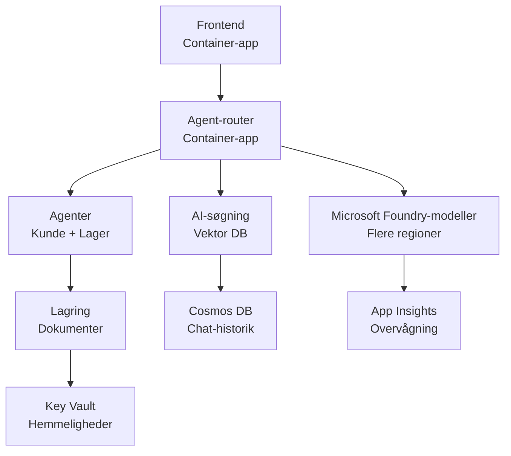

# Retail Multi-Agent-løsning - Infrastrukturskabelon

**Kapitel 5: Produktionsudrulningspakke**
- **📚 Kursusforside**: [AZD For Beginners](../../README.md)
- **📖 Relateret kapitel**: [Kapitel 5: Multi-Agent AI Solutions](../../README.md#-chapter-5-multi-agent-ai-solutions-advanced)
- **📝 Scenarieguide**: [Complete Architecture](../retail-scenario.md)
- **🎯 Hurtig udrulning**: [One-Click Deployment](#-quick-deployment)

> **⚠️ KUN INFRASTRUKTURSKABELON**  
> Denne ARM-skabelon udruller **Azure-ressourcer** til et multi-agent-system.  
>  
> **Hvad der bliver udrullet (15-25 minutter):**
> - ✅ Microsoft Foundry Models (gpt-4.1, gpt-4.1-mini, embeddings på tværs af 3 regioner)
> - ✅ AI Search-tjeneste (tom, klar til oprettelse af indeks)
> - ✅ Container Apps (pladsholder-billeder, klar til din kode)
> - ✅ Storage, Cosmos DB, Key Vault, Application Insights
>  
> **Hvad der IKKE er inkluderet (kræver udvikling):**
> - ❌ Agentimplementeringskode (Customer Agent, Inventory Agent)
> - ❌ Routinglogik og API-endpoints
> - ❌ Frontend chat UI
> - ❌ Search-indeksskemaer og datapipelines
> - ❌ **Anslået udviklingsindsats: 80-120 timer**
>  
> **Brug denne skabelon hvis:**
> - ✅ Du vil provisionere Azure-infrastruktur til et multi-agent-projekt
> - ✅ Du planlægger at udvikle agentimplementering separat
> - ✅ Du har brug for en produktionsklar infrastrukturbaseline
>  
> **Brug ikke hvis:**
> - ❌ Du forventer en fungerende multi-agent-demo med det samme
> - ❌ Du søger komplette eksempler på applikationskode

## Oversigt

Denne mappe indeholder en omfattende Azure Resource Manager (ARM) skabelon til udrulning af **infrastrukturgrundlaget** for et multi-agent kundesupportsystem. Skabelonen provisionerer alle nødvendige Azure-tjenester, korrekt konfigureret og sammenkoblet, klar til din applikationsudvikling.

**Efter udrulning får du:** Produktionsklar Azure-infrastruktur  
**For at fuldføre systemet har du brug for:** Agentkode, frontend UI og datakonfiguration (se [Architecture Guide](../retail-scenario.md))

## 🎯 Hvad udrulles

### Kerneinfrastruktur (status efter udrulning)

✅ **Microsoft Foundry Models-tjenester** (Klar til API-opkald)
  - Primær region: gpt-4.1-udrulning (20K TPM kapacitet)
  - Sekundær region: gpt-4.1-mini-udrulning (10K TPM kapacitet)
  - Tertiær region: Tekst embeddings-model (30K TPM kapacitet)
  - Evalueringsregion: gpt-4.1 grader-model (15K TPM kapacitet)
  - **Status:** Fuld funktionsdygtig - kan foretage API-opkald med det samme

✅ **Azure AI Search** (Tom - klar til konfiguration)
  - Vektor-søgning aktiveret
  - Standardniveau med 1 partition, 1 replika
  - **Status:** Tjeneste kører, men kræver oprettelse af indeks
  - **Handling nødvendig:** Opret søgeindeks med dit skema

✅ **Azure Storage Account** (Tom - klar til upload)
  - Blob-containere: `documents`, `uploads`
  - Sikker konfiguration (kun HTTPS, ingen offentlig adgang)
  - **Status:** Klar til at modtage filer
  - **Handling nødvendig:** Upload dine produktdata og dokumenter

⚠️ **Container Apps Environment** (Pladsholder-billeder udrullet)
  - Agentrouter-app (nginx standardimage)
  - Frontend-app (nginx standardimage)
  - Autoskalering konfigureret (0-10 instanser)
  - **Status:** Kører pladsholder-containere
  - **Handling nødvendig:** Byg og udrul dine agentapplikationer

✅ **Azure Cosmos DB** (Tom - klar til data)
  - Database og container forudkonfigureret
  - Optimeret til lav latenstid
  - TTL aktiveret for automatisk oprydning
  - **Status:** Klar til at gemme chat-historik

✅ **Azure Key Vault** (Valgfri - klar til hemmeligheder)
  - Soft delete aktiveret
  - RBAC konfigureret for administrerede identiteter
  - **Status:** Klar til at gemme API-nøgler og forbindelsesstrenge

✅ **Application Insights** (Valgfri - overvågning aktiv)
  - Forbundet til Log Analytics-arbejdsområde
  - Brugerdefinerede metrikker og alarmer konfigureret
  - **Status:** Klar til at modtage telemetri fra dine apps

✅ **Document Intelligence** (Klar til API-opkald)
  - S0-niveau til produktionsarbejdsmængder
  - **Status:** Klar til at behandle uploadede dokumenter

✅ **Bing Search API** (Klar til API-opkald)
  - S1-niveau til realtidssøgninger
  - **Status:** Klar til web-søgninger

### Udrulningsmodi

| Mode | OpenAI Capacity | Container Instances | Search Tier | Storage Redundancy | Best For |
|------|-----------------|---------------------|-------------|-------------------|----------|
| **Minimal** | 10K-20K TPM | 0-2 replicas | Basic | LRS (Local) | Dev/test, learning, proof-of-concept |
| **Standard** | 30K-60K TPM | 2-5 replicas | Standard | ZRS (Zone) | Production, moderate traffic (<10K users) |
| **Premium** | 80K-150K TPM | 5-10 replicas, zone-redundant | Premium | GRS (Geo) | Enterprise, high traffic (>10K users), 99.99% SLA |

**Omkostningspåvirkning:**
- **Minimal → Standard:** ~4x omkostningsstigning ($100-370/mo → $420-1,450/mo)
- **Standard → Premium:** ~3x omkostningsstigning ($420-1,450/mo → $1,150-3,500/mo)
- **Vælg baseret på:** Forventet belastning, SLA-krav, budgetbegrænsninger

**Kapacitetsplanlægning:**
- **TPM (Tokens Per Minute):** Total på tværs af alle modeludrulninger
- **Container Instances:** Autoskalering interval (min-max replikaer)
- **Search Tier:** Påvirker forespørgselsydelse og indeksstørrelsesgrænser

## 📋 Forudsætninger

### Nødvendige værktøjer
1. **Azure CLI** (version 2.50.0 eller nyere)
   ```bash
   az --version  # Kontroller version
   az login      # Autentificer
   ```

2. **Aktivt Azure-abonnement** med Owner- eller Contributor-adgang
   ```bash
   az account show  # Bekræft abonnement
   ```

### Påkrævede Azure-kvoter

Før udrulning skal du verificere tilstrækkelige kvoter i dine målregioner:

```bash
# Kontroller tilgængeligheden af Microsoft Foundry-modeller i din region
az cognitiveservices account list-skus \
  --kind OpenAI \
  --location eastus2

# Bekræft OpenAI-kvote (eksempel for gpt-4.1)
az cognitiveservices usage list \
  --location eastus2 \
  --query "[?name.value=='OpenAI.Standard.gpt-4.1']"

# Kontroller Container Apps-kvote
az provider show \
  --namespace Microsoft.App \
  --query "resourceTypes[?resourceType=='managedEnvironments'].locations"
```

**Minimum krævede kvoter:**
- **Microsoft Foundry Models:** 3-4 modeludrulninger på tværs af regioner
  - gpt-4.1: 20K TPM (Tokens Per Minute)
  - gpt-4.1-mini: 10K TPM
  - text-embedding-ada-002: 30K TPM
  - **Bemærk:** gpt-4.1 kan have venteliste i nogle regioner - tjek [model availability](https://learn.microsoft.com/azure/ai-services/openai/concepts/models)
- **Container Apps:** Managed environment + 2-10 containerinstanser
- **AI Search:** Standardniveau (Basic er utilstrækkeligt til vektor-søgning)
- **Cosmos DB:** Standard provisioned throughput

**Hvis kvoten er utilstrækkelig:**
1. Gå til Azure Portal → Quotas → Request increase
2. Eller brug Azure CLI:
   ```bash
   az support tickets create \
     --ticket-name "OpenAI-Quota-Increase" \
     --severity "minimal" \
     --description "Request quota increase for Microsoft Foundry Models gpt-4.1 in eastus2"
   ```
3. Overvej alternative regioner med tilgængelighed

## 🚀 Hurtig udrulning

### Mulighed 1: Brug af Azure CLI

```bash
# Klon eller download skabelonfilerne
git clone <repository-url>
cd examples/retail-multiagent-arm-template

# Gør implementeringsscriptet eksekverbart
chmod +x deploy.sh

# Udrul med standardindstillinger
./deploy.sh -g myResourceGroup

# Udrul til produktion med premiumfunktioner
./deploy.sh -g myProdRG -e prod -m premium -l eastus2
```

### Mulighed 2: Brug af Azure Portal

[](https://portal.azure.com/#create/Microsoft.Template/uri/https%3A%2F%2Fraw.githubusercontent.com%2Fmicrosoft%2Fazd-for-beginners%2Fmain%2Fexamples%2Fretail-multiagent-arm-template%2Fazuredeploy.json)

### Mulighed 3: Brug Azure CLI direkte

```bash
# Opret ressourcegruppe
az group create --name myResourceGroup --location eastus2

# Udrul skabelon
az deployment group create \
  --resource-group myResourceGroup \
  --template-file azuredeploy.json \
  --parameters azuredeploy.parameters.json
```

## ⏱️ Udrulningstidslinje

### Hvad du kan forvente

| Phase | Duration | What Happens |
|-------|----------|--------------||
| **Template Validation** | 30-60 seconds | Azure validerer ARM-skabelonens syntaks og parametre |
| **Resource Group Setup** | 10-20 seconds | Opretter resource group (hvis nødvendigt) |
| **OpenAI Provisioning** | 5-8 minutes | Opretter 3-4 OpenAI-konti og udruller modeller |
| **Container Apps** | 3-5 minutes | Opretter miljø og udruller pladsholder-containere |
| **Search & Storage** | 2-4 minutes | Provisonerer AI Search-tjeneste og storage-konti |
| **Cosmos DB** | 2-3 minutes | Opretter database og konfigurerer containere |
| **Monitoring Setup** | 2-3 minutes | Opsætter Application Insights og Log Analytics |
| **RBAC Configuration** | 1-2 minutes | Konfigurerer administrerede identiteter og tilladelser |
| **Total Deployment** | **15-25 minutes** | Færdig infrastruktur klar |

**Efter udrulning:**
- ✅ **Infrastruktur klar:** Alle Azure-tjenester provisioneret og kørende
- ⏱️ **Applikationsudvikling:** 80-120 timer (dit ansvar)
- ⏱️ **Indeks-konfiguration:** 15-30 minutter (kræver dit skema)
- ⏱️ **Dataupload:** Varierer efter datasætstørrelse
- ⏱️ **Test & validering:** 2-4 timer

---

## ✅ Bekræft udrulningssucces

### Trin 1: Tjek ressourceprovisionering (2 minutter)

```bash
# Bekræft, at alle ressourcer blev udrullet med succes
az resource list \
  --resource-group myResourceGroup \
  --query "[?provisioningState!='Succeeded'].{Name:name, Status:provisioningState, Type:type}" \
  --output table
```

**Forventet:** Tom tabel (alle ressourcer viser "Succeeded" status)

### Trin 2: Bekræft Microsoft Foundry Models-udrulninger (3 minutter)

```bash
# Vis alle OpenAI-konti
az cognitiveservices account list \
  --resource-group myResourceGroup \
  --query "[?kind=='OpenAI'].{Name:name, Location:location, Status:properties.provisioningState}" \
  --output table

# Kontroller modeludrulninger i den primære region
OPENAI_NAME=$(az cognitiveservices account list \
  --resource-group myResourceGroup \
  --query "[?kind=='OpenAI'] | [0].name" -o tsv)

az cognitiveservices account deployment list \
  --name $OPENAI_NAME \
  --resource-group myResourceGroup \
  --output table
```

**Forventet:** 
- 3-4 OpenAI-konti (primær, sekundær, tertiær, evalueringsregioner)
- 1-2 modeludrulninger pr. konto (gpt-4.1, gpt-4.1-mini, text-embedding-ada-002)

### Trin 3: Test infrastrukturendepunkter (5 minutter)

```bash
# Hent Container App-URL'er
az containerapp list \
  --resource-group myResourceGroup \
  --query "[].{Name:name, URL:properties.configuration.ingress.fqdn, Status:properties.runningStatus}" \
  --output table

# Test router-endepunkt (et pladsholderbillede vil blive returneret)
ROUTER_URL=$(az containerapp show \
  --name retail-router \
  --resource-group myResourceGroup \
  --query "properties.configuration.ingress.fqdn" -o tsv)

echo "Testing: https://$ROUTER_URL"
curl -I https://$ROUTER_URL || echo "Container running (placeholder image - expected)"
```

**Forventet:** 
- Container Apps viser "Running" status
- Pladsholder nginx svarer med HTTP 200 eller 404 (ingen applikationskode endnu)

### Trin 4: Bekræft Microsoft Foundry Models API-adgang (3 minutter)

```bash
# Hent OpenAI-endpoint og nøgle
OPENAI_ENDPOINT=$(az cognitiveservices account show \
  --name $OPENAI_NAME \
  --resource-group myResourceGroup \
  --query "properties.endpoint" -o tsv)

OPENAI_KEY=$(az cognitiveservices account keys list \
  --name $OPENAI_NAME \
  --resource-group myResourceGroup \
  --query "key1" -o tsv)

# Test gpt-4.1-udrulning
curl "${OPENAI_ENDPOINT}openai/deployments/gpt-4.1/chat/completions?api-version=2024-08-01-preview" \
  -H "Content-Type: application/json" \
  -H "api-key: $OPENAI_KEY" \
  -d '{
    "messages": [{"role": "user", "content": "Say hello"}],
    "max_tokens": 10
  }'
```

**Forventet:** JSON-respons med chat completion (bekræfter, at OpenAI fungerer)

### Hvad virker vs. hvad fungerer ikke

**✅ Fungerer efter udrulning:**
- Microsoft Foundry Models- modeller udrullet og accepterer API-opkald
- AI Search-tjeneste kører (tom, ingen indekser endnu)
- Container Apps kører (pladsholder nginx-billeder)
- Storage-konti tilgængelige og klar til uploads
- Cosmos DB klar til dataoperationer
- Application Insights indsamler infrastrukturtelemetri
- Key Vault klar til hemmelighedslagring

**❌ Fungerer ikke endnu (kræver udvikling):**
- Agentendpoints (ingen applikationskode udrullet)
- Chatfunktionalitet (kræver frontend + backend-implementering)
- Søgninger (intet søgeindeks oprettet endnu)
- Dokumentbehandlingspipeline (ingen data uploadet)
- Brugerdefineret telemetri (kræver applikationsinstrumentering)

**Næste skridt:** Se [Post-Deployment Configuration](#-post-deployment-next-steps) for at udvikle og udrulle din applikation

---

## ⚙️ Konfigurationsmuligheder

### Skabelonparametre

| Parameter | Type | Default | Description |
|-----------|------|---------|-------------|
| `projectName` | string | "retail" | Prefix for alle ressourcenavne |
| `location` | string | Resource group location | Primær udrulningsregion |
| `secondaryLocation` | string | "westus2" | Sekundær region til multi-region udrulning |
| `tertiaryLocation` | string | "francecentral" | Region til embeddings-model |
| `environmentName` | string | "dev" | Miljøbetegnelse (dev/staging/prod) |
| `deploymentMode` | string | "standard" | Udrulningskonfiguration (minimal/standard/premium) |
| `enableMultiRegion` | bool | true | Aktiver multi-region udrulning |
| `enableMonitoring` | bool | true | Aktiver Application Insights og logging |
| `enableSecurity` | bool | true | Aktiver Key Vault og forbedret sikkerhed |

### Tilpasning af parametre

Rediger `azuredeploy.parameters.json`:

```json
{
  "$schema": "https://schema.management.azure.com/schemas/2019-04-01/deploymentParameters.json#",
  "contentVersion": "1.0.0.0",
  "parameters": {
    "projectName": {
      "value": "mycompany"
    },
    "environmentName": {
      "value": "prod"
    },
    "deploymentMode": {
      "value": "premium"
    },
    "location": {
      "value": "eastus2"
    }
  }
}
```

## 🏗️ Arkitekturoversigt


## 📖 Brug af udrulningsscript

Scriptet `deploy.sh` giver en interaktiv udrulningsoplevelse:

```bash
# Vis hjælp
./deploy.sh --help

# Grundlæggende udrulning
./deploy.sh -g myResourceGroup

# Avanceret udrulning med brugerdefinerede indstillinger
./deploy.sh \
  -g myProductionRG \
  -p companyname \
  -e prod \
  -m premium \
  -l eastus2

# Udviklingsudrulning uden flere regioner
./deploy.sh \
  -g myDevRG \
  -e dev \
  -m minimal \
  --no-multi-region \
  --no-security
```

### Scriptfunktioner

- ✅ **Validering af forudsætninger** (Azure CLI, login-status, skabelonfiler)
- ✅ **Håndtering af resource group** (opretter hvis den ikke findes)
- ✅ **Validering af skabelon** før udrulning
- ✅ **Overvågning af fremdrift** med farvet output
- ✅ **Udrulningsoutput** vises
- ✅ **Vejledning efter udrulning**

## 📊 Overvågning af udrulning

### Tjek udrulningsstatus

```bash
# Vis udrulninger
az deployment group list --resource-group myResourceGroup --output table

# Hent udrulningsdetaljer
az deployment group show \
  --resource-group myResourceGroup \
  --name retail-deployment-YYYYMMDD-HHMMSS

# Overvåg udrulningens fremdrift
az deployment group create \
  --resource-group myResourceGroup \
  --template-file azuredeploy.json \
  --parameters azuredeploy.parameters.json \
  --verbose
```

### Udrulningsoutput

Efter en vellykket udrulning er følgende outputs tilgængelige:

- **Frontend URL**: Offentligt endepunkt for webgrænsefladen
- **Router URL**: API-endepunkt for agentrouteren
- **OpenAI Endpoints**: Primære og sekundære OpenAI-tjenesteendepunkter
- **Search Service**: Azure AI Search-tjenesteendepunkt
- **Storage Account**: Navn på storage-kontoen til dokumenter
- **Key Vault**: Navn på Key Vault (hvis aktiveret)
- **Application Insights**: Navn på overvågningstjenesten (hvis aktiveret)

## 🔧 Efter udrulning: Næste skridt
> **📝 Vigtigt:** Infrastrukturen er udrullet, men du skal udvikle og implementere applikationskode.

### Fase 1: Udvikl agentapplikationer (dit ansvar)

The ARM template creates **empty Container Apps** with placeholder nginx images. You must:

**Required Development:**
1. **Agent Implementation** (30-40 hours)
   - Kundeserviceagent med gpt-4.1-integration
   - Lageragent med gpt-4.1-mini-integration
   - Routing-logik for agenter

2. **Frontend Development** (20-30 hours)
   - Chatgrænseflade UI (React/Vue/Angular)
   - Filupload-funktionalitet
   - Gengivelse og formatering af svar

3. **Backend Services** (12-16 hours)
   - FastAPI- eller Express-router
   - Autentificeringsmiddleware
   - Telemetriintegration

**Se:** [Arkitekturguide](../retail-scenario.md) for detaljerede implementeringsmønstre og kodeeksempler

### Fase 2: Konfigurer AI-søgeindeks (15-30 minutter)

Opret et søgeindeks, der matcher din datamodel:

```bash
# Hent detaljer om søgetjenesten
SEARCH_NAME=$(az search service list \
  --resource-group myResourceGroup \
  --query "[0].name" -o tsv)

SEARCH_KEY=$(az search admin-key show \
  --service-name $SEARCH_NAME \
  --resource-group myResourceGroup \
  --query "primaryKey" -o tsv)

# Opret indeks med dit skema (eksempel)
curl -X POST "https://${SEARCH_NAME}.search.windows.net/indexes?api-version=2023-11-01" \
  -H "Content-Type: application/json" \
  -H "api-key: ${SEARCH_KEY}" \
  -d '{
    "name": "products",
    "fields": [
      {"name": "id", "type": "Edm.String", "key": true},
      {"name": "title", "type": "Edm.String", "searchable": true},
      {"name": "content", "type": "Edm.String", "searchable": true},
      {"name": "category", "type": "Edm.String", "filterable": true},
      {"name": "content_vector", "type": "Collection(Edm.Single)", 
       "searchable": true, "dimensions": 1536, "vectorSearchProfile": "default"}
    ],
    "vectorSearch": {
      "algorithms": [{"name": "default", "kind": "hnsw"}],
      "profiles": [{"name": "default", "algorithm": "default"}]
    }
  }'
```

**Ressourcer:**
- [AI Search Index Schema Design](https://learn.microsoft.com/azure/search/search-what-is-an-index)
- [Vector Search Configuration](https://learn.microsoft.com/azure/search/vector-search-how-to-create-index)

### Fase 3: Upload dine data (tidsforbrug varierer)

Når du har produktdata og dokumenter:

```bash
# Hent lagerkontooplysninger
STORAGE_NAME=$(az storage account list \
  --resource-group myResourceGroup \
  --query "[0].name" -o tsv)

STORAGE_KEY=$(az storage account keys list \
  --account-name $STORAGE_NAME \
  --resource-group myResourceGroup \
  --query "[0].value" -o tsv)

# Upload dine dokumenter
az storage blob upload-batch \
  --destination documents \
  --source /path/to/your/product/docs \
  --account-name $STORAGE_NAME \
  --account-key $STORAGE_KEY

# Eksempel: Upload en enkelt fil
az storage blob upload \
  --container-name documents \
  --name "product-manual.pdf" \
  --file /path/to/product-manual.pdf \
  --account-name $STORAGE_NAME \
  --account-key $STORAGE_KEY
```

### Fase 4: Byg og implementer dine applikationer (8-12 timer)

Når du har udviklet din agentkode:

```bash
# 1. Opret Azure Container Registry (hvis nødvendigt)
az acr create \
  --name myregistry \
  --resource-group myResourceGroup \
  --sku Basic

# 2. Byg og push agent-router-billede
docker build -t myregistry.azurecr.io/agent-router:v1 /path/to/your/router/code
az acr login --name myregistry
docker push myregistry.azurecr.io/agent-router:v1

# 3. Byg og push frontend-billede
docker build -t myregistry.azurecr.io/frontend:v1 /path/to/your/frontend/code
docker push myregistry.azurecr.io/frontend:v1

# 4. Opdater Container Apps med dine billeder
az containerapp update \
  --name retail-router \
  --resource-group myResourceGroup \
  --image myregistry.azurecr.io/agent-router:v1

az containerapp update \
  --name retail-frontend \
  --resource-group myResourceGroup \
  --image myregistry.azurecr.io/frontend:v1

# 5. Konfigurer miljøvariabler
az containerapp update \
  --name retail-router \
  --resource-group myResourceGroup \
  --set-env-vars \
    OPENAI_ENDPOINT=secretref:openai-endpoint \
    OPENAI_KEY=secretref:openai-key \
    SEARCH_ENDPOINT=secretref:search-endpoint \
    SEARCH_KEY=secretref:search-key
```

### Fase 5: Test din applikation (2-4 timer)

```bash
# Hent din applikations-URL
ROUTER_URL=$(az containerapp show \
  --name retail-router \
  --resource-group myResourceGroup \
  --query "properties.configuration.ingress.fqdn" -o tsv)

# Test agent-endpointet (når din kode er udrullet)
curl -X POST "https://${ROUTER_URL}/chat" \
  -H "Content-Type: application/json" \
  -d '{
    "message": "Hello, I need help with my order",
    "agent": "customer"
  }'

# Tjek applikationslogs
az containerapp logs show \
  --name retail-router \
  --resource-group myResourceGroup \
  --follow
```

### Implementeringsressourcer

**Arkitektur & design:**
- 📖 [Komplet arkitekturguide](../retail-scenario.md) - Detaljerede implementeringsmønstre
- 📖 [Designmønstre for multi-agent-systemer](https://learn.microsoft.com/azure/architecture/ai-ml/guide/multi-agent-systems)

**Kodeeksempler:**
- 🔗 [Microsoft Foundry Models Chat Sample](https://github.com/Azure-Samples/azure-search-openai-demo) - RAG-mønster
- 🔗 [Semantic Kernel](https://github.com/microsoft/semantic-kernel) - Agent-framework (C#)
- 🔗 [LangChain Azure](https://github.com/langchain-ai/langchain) - Agentorkestrering (Python)
- 🔗 [AutoGen](https://github.com/microsoft/autogen) - Multi-agent-samtaler

**Estimeret samlet indsats:**
- Implementering af infrastruktur: 15-25 minutter (✅ Fuldført)
- Applikationsudvikling: 80-120 timer (🔨 Dit arbejde)
- Test og optimering: 15-25 timer (🔨 Dit arbejde)

## 🛠️ Fejlfinding

### Almindelige problemer

#### 1. Microsoft Foundry Models Quota Exceeded

```bash
# Kontroller aktuelt kvoteforbrug
az cognitiveservices usage list --location eastus2

# Anmod om forhøjelse af kvoten
az support tickets create \
  --ticket-name "OpenAI-Quota-Increase" \
  --severity "minimal" \
  --description "Request quota increase for Microsoft Foundry Models in region X"
```

#### 2. Container Apps Deployment Failed

```bash
# Kontroller container-app-logfiler
az containerapp logs show \
  --name retail-router \
  --resource-group myResourceGroup \
  --follow

# Genstart container-app
az containerapp revision restart \
  --name retail-router \
  --resource-group myResourceGroup
```

#### 3. Search Service Initialization

```bash
# Bekræft søgetjenestens status
az search service show \
  --name <search-service-name> \
  --resource-group myResourceGroup

# Test søgetjenestens forbindelse
curl -X GET "https://<search-service-name>.search.windows.net/indexes?api-version=2023-11-01" \
  -H "api-key: <search-admin-key>"
```

### Validering af implementering

```bash
# Kontroller, at alle ressourcer er oprettet
az resource list \
  --resource-group myResourceGroup \
  --output table

# Kontroller ressourcernes tilstand
az resource list \
  --resource-group myResourceGroup \
  --query "[?provisioningState!='Succeeded'].{Name:name, Status:provisioningState, Type:type}" \
  --output table
```

## 🔐 Sikkerhedshensyn

### Nøglehåndtering
- Alle hemmeligheder gemmes i Azure Key Vault (når aktiveret)
- Container-apps bruger managed identity til autentificering
- Storage-konti har sikre standardindstillinger (kun HTTPS, ingen offentlig adgang til blobs)

### Netværkssikkerhed
- Container-apps bruger intern netværksforbindelse, hvor det er muligt
- Søgetjeneste konfigureret med mulighed for private endpoints
- Cosmos DB konfigureret med minimale nødvendige tilladelser

### RBAC-konfiguration
```bash
# Tildel nødvendige roller til den administrerede identitet
az role assignment create \
  --assignee <container-app-managed-identity> \
  --role "Cognitive Services OpenAI User" \
  --scope <openai-resource-id>
```

## 💰 Omkostningsoptimering

### Omkostningsoverslag (månedligt, USD)

| Tilstand | OpenAI | Container Apps | Search | Storage | Samlet est. |
|------|--------|----------------|--------|---------|------------|
| Minimal | $50-200 | $20-50 | $25-100 | $5-20 | $100-370 |
| Standard | $200-800 | $100-300 | $100-300 | $20-50 | $420-1450 |
| Premium | $500-2000 | $300-800 | $300-600 | $50-100 | $1150-3500 |

### Omkostningsovervågning

```bash
# Opsæt budgetalarmer
az consumption budget create \
  --account-name <subscription-id> \
  --budget-name "retail-budget" \
  --amount 500 \
  --time-grain Monthly \
  --start-date 2024-01-01 \
  --end-date 2024-12-31
```

## 🔄 Opdateringer og vedligeholdelse

### Skabelonopdateringer
- Versionsstyring af ARM-skabelonfilerne
- Test ændringer i udviklingsmiljøet først
- Brug inkrementel implementeringstilstand til opdateringer

### Ressourceopdateringer
```bash
# Opdater med nye parametre
az deployment group create \
  --resource-group myResourceGroup \
  --template-file azuredeploy.json \
  --parameters azuredeploy.parameters.json \
  --mode Incremental
```

### Backup og gendannelse
- Cosmos DB automatisk sikkerhedskopiering aktiveret
- Key Vault soft delete aktiveret
- Container-app revisioner opretholdes for rollback

## 📞 Support

- **Skabelonproblemer**: [GitHub Issues](https://github.com/microsoft/azd-for-beginners/issues)
- **Azure Support**: [Azure Support Portal](https://portal.azure.com/#blade/Microsoft_Azure_Support/HelpAndSupportBlade)
- **Community**: [Azure AI Discord](https://discord.gg/microsoft-azure)

---

**⚡ Klar til at implementere din multi-agent-løsning?**

Start med: `./deploy.sh -g myResourceGroup`

---

<!-- CO-OP TRANSLATOR DISCLAIMER START -->
**Ansvarsfraskrivelse**:
Dette dokument er blevet oversat ved hjælp af AI-oversættelsestjenesten [Co-op Translator](https://github.com/Azure/co-op-translator). Selvom vi bestræber os på nøjagtighed, bedes du være opmærksom på, at automatiske oversættelser kan indeholde fejl eller unøjagtigheder. Det oprindelige dokument i dets oprindelige sprog bør betragtes som den autoritative kilde. For kritisk information anbefales professionel menneskelig oversættelse. Vi er ikke ansvarlige for eventuelle misforståelser eller fejltolkninger, der måtte opstå som følge af brugen af denne oversættelse.
<!-- CO-OP TRANSLATOR DISCLAIMER END -->