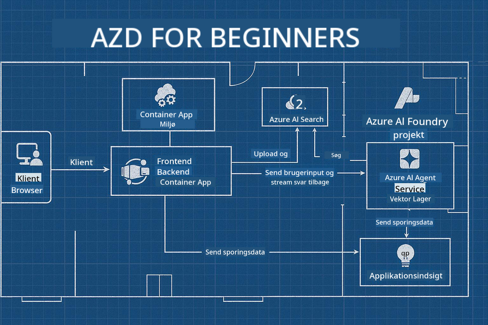

<!--
CO_OP_TRANSLATOR_METADATA:
{
  "original_hash": "245d24997bbcf2bae93bb2a503845d37",
  "translation_date": "2025-09-23T11:56:53+00:00",
  "source_file": "workshop/README.md",
  "language_code": "da"
}
-->
# AZD for AI-udviklere Workshop

## AZD Skabeloner

At bygge en AI-applikation i virksomhedsklasse til dit specifikke scenarie er meget som at bygge dit eget hjem. Du kan designe det selv, bygge det sten for sten og tage ansvaret for, at det opfylder alle styrings- og udviklingsretningslinjer.

**ELLER ....** 

Du kan arbejde med en arkitekt, der kan give dig en _blåkopi_ til et start-hjem og derefter arbejde med dig for at _tilpasse_ det, så det passer til dine behov. Dette giver dig mulighed for at fokusere på, hvad der gør **dit hjem** specielt, mens eksperterne tager sig af den underliggende el, VVS og andre afhængigheder.

**Dette er tilgangen bag [AI App Templates](https://ai.azure.com/templates)** - en række blåkopier til at bygge forskellige typer AI-applikations-"hjem" afhængigt af dine kernebehov og afhængigheder.

## Tilpasning af Skabeloner

Skabelonerne er designet til at fungere med [Azure AI Foundry](https://ai.azure.com). Tænk på denne platform som din "byggeentreprenør" med adgang til alle de ressourcer, værktøjer og ekspertise, du har brug for til at få arbejdet gjort!

Alt, hvad du skal gøre, er at vælge [dine startskabeloner](https://learn.microsoft.com/en-us/azure/ai-foundry/how-to/develop/ai-template-get-started). For eksempel vil vi fokusere på _Get Started with AI Agents_-skabelonen for at bygge dig et "Agentisk AI-hjem", der er klar til funktioner som AI-søgning, Red Teaming, evalueringer, sporing, overvågning og mere!



Alt, hvad du behøver, er at booke tid med arkitekten, som kan guide dig gennem tilpasningsprocessen. [GitHub Copilot for Azure](https://learn.microsoft.com/en-us/azure/developer/github-copilot-azure/get-started) kan være den guide. Bare "chat med det" for at:

- Lære om Azure-funktionerne i din skabelon
- Udrulle Azure-ressourcer
- Få information om din udrulning
- Diagnosticere og fejlfinde problemer!

I denne workshop lærer vi at _dekonstruere_ den eksisterende skabelon (for at forstå, hvad den tilbyder) og derefter _tilpasse_ den (for at opfylde vores krav) - trin for trin.

AI-skabeloner **får det til at fungere** - ved at gennemføre workshoppen lærer du at **gøre det til dit eget**

----

**Workshop Navigation**
- **📚 Kursushjem**: [AZD For Begyndere](../README.md)
- **📖 Relaterede kapitler**: Dækker [Kapitel 1](../README.md#-chapter-1-foundation--quick-start), [Kapitel 2](../README.md#-chapter-2-ai-first-development-recommended-for-ai-developers) og [Kapitel 5](../README.md#-chapter-5-multi-agent-ai-solutions-advanced)
- **🛠️ Praktisk Lab**: [AI Workshop Lab](../docs/ai-foundry/ai-workshop-lab.md)
- **🚀 Næste Skridt**: [Workshop Lab Moduler](../../../workshop)

Velkommen til den praktiske workshop for at lære Azure Developer CLI (AZD) med fokus på udrulning af AI-applikationer. Denne workshop er designet til at tage dig fra AZD-grundlæggende til udrulning af produktionsklare AI-løsninger.

## Workshop Oversigt

**Varighed:** 2-3 timer  
**Niveau:** Begynder til Mellem  
**Forudsætninger:** Grundlæggende kendskab til Azure, kommandolinjeværktøjer og AI-koncepter

### Hvad Du Vil Lære

- **AZD Grundlæggende**: Forståelse af Infrastructure as Code med AZD
- 🤖 **AI Service Integration**: Udrulning af Azure OpenAI, AI-søgning og andre AI-tjenester
- **Container Udrulning**: Brug af Azure Container Apps til AI-applikationer
- **Sikkerhedspraksis**: Implementering af Managed Identity og sikre konfigurationer
- **Overvågning & Observabilitet**: Opsætning af Application Insights til AI-arbejdsbelastninger
- **Produktionsmønstre**: Udrulningsstrategier klar til virksomheder

## Workshop Struktur

### Modul 1: AZD Grundlæggende (30 minutter)
- Installation og konfiguration af AZD
- Forståelse af AZD-projektstruktur
- Din første AZD-udrulning
- **Lab**: Udrul en simpel webapplikation

### Modul 2: Azure OpenAI Integration (45 minutter)
- Opsætning af Azure OpenAI-ressourcer
- Modeludrulningsstrategier
- Konfiguration af API-adgang og autentificering
- **Lab**: Udrul en chatapplikation med GPT-4

### Modul 3: RAG Applikationer (45 minutter)
- Integration af Azure AI-søgning
- Dokumentbehandling med Azure Document Intelligence
- Vektorindlejringer og semantisk søgning
- **Lab**: Byg et dokument Q&A-system

### Modul 4: Produktionsudrulning (30 minutter)
- Konfiguration af Container Apps
- Skalering og optimering af ydeevne
- Overvågning og logning
- **Lab**: Udrul til produktion med observabilitet

### Modul 5: Avancerede Mønstre (15 minutter)
- Udrulning i flere miljøer
- CI/CD-integration
- Omkostningsoptimeringsstrategier
- **Afslutning**: Produktionsklarhedstjekliste

## Forudsætninger

### Påkrævede Værktøjer

Installér venligst disse værktøjer før workshoppen:

```bash
# Azure Developer CLI
curl -fsSL https://aka.ms/install-azd.sh | bash

# Azure CLI
curl -sL https://aka.ms/InstallAzureCLIDeb | sudo bash

# Git
sudo apt-get install git

# Docker
curl -fsSL https://get.docker.com -o get-docker.sh
sudo sh get-docker.sh

# Python 3.10+
sudo apt-get install python3.10 python3.10-venv python3-pip
```

### Azure Kontoopsætning

1. **Azure Abonnement**: [Tilmeld dig gratis](https://azure.microsoft.com/free/)
2. **Azure OpenAI Adgang**: [Anmod om adgang](https://aka.ms/oai/access)
3. **Påkrævede Tilladelser**:
   - Contributor-rolle på abonnement eller ressourcegruppe
   - User Access Administrator (til RBAC-tildelinger)

### Verificér Forudsætninger

Kør dette script for at verificere din opsætning:

```bash
#!/bin/bash
echo "Verifying workshop prerequisites..."

# Check AZD installation
if command -v azd &> /dev/null; then
    echo "✅ Azure Developer CLI: $(azd --version)"
else
    echo "❌ Azure Developer CLI not found"
fi

# Check Azure CLI
if command -v az &> /dev/null; then
    echo "✅ Azure CLI: $(az --version | head -n1)"
else
    echo "❌ Azure CLI not found"
fi

# Check Docker
if command -v docker &> /dev/null; then
    echo "✅ Docker: $(docker --version)"
else
    echo "❌ Docker not found"
fi

# Check Python
if command -v python3 &> /dev/null; then
    echo "✅ Python: $(python3 --version)"
else
    echo "❌ Python 3 not found"
fi

# Check Azure login
if az account show &> /dev/null; then
    echo "✅ Azure: Logged in as $(az account show --query user.name -o tsv)"
else
    echo "❌ Azure: Not logged in (run 'az login')"
fi

echo "Setup verification complete!"
```

## Workshop Materialer

### Lab Øvelser

Hvert modul inkluderer praktiske labs med startkode og trin-for-trin instruktioner:

- **[lab-1-azd-basics/](../../../workshop/lab-1-azd-basics)** - Din første AZD-udrulning
- **[lab-2-openai-chat/](../../../workshop/lab-2-openai-chat)** - Chatapplikation med Azure OpenAI
- **[lab-3-rag-search/](../../../workshop/lab-3-rag-search)** - RAG-applikation med AI-søgning
- **[lab-4-production/](../../../workshop/lab-4-production)** - Produktionsudrulningsmønstre
- **[lab-5-advanced/](../../../workshop/lab-5-advanced)** - Avancerede udrulningsscenarier

### Reference Materialer

- **[AI Foundry Integration Guide](../docs/ai-foundry/azure-ai-foundry-integration.md)** - Omfattende integrationsmønstre
- **[AI Model Deployment Guide](../docs/ai-foundry/ai-model-deployment.md)** - Bedste praksis for modeludrulning
- **[Production AI Practices](../docs/ai-foundry/production-ai-practices.md)** - Udrulningsmønstre til virksomheder
- **[AI Troubleshooting Guide](../docs/troubleshooting/ai-troubleshooting.md)** - Almindelige problemer og løsninger

### Eksempel Skabeloner

Hurtigstart-skabeloner til almindelige AI-scenarier:

```
workshop/templates/
├── minimal-chat/          # Basic OpenAI chat app
├── rag-application/       # RAG with AI Search
├── multi-model/          # Multiple AI services
└── production-ready/     # Enterprise template
```

## Kom i Gang

### Mulighed 1: GitHub Codespaces (Anbefalet)

Den hurtigste måde at starte workshoppen på:

[](https://github.com/codespaces/new?hide_repo_select=true&ref=main&repo=YOUR_REPO_ID)

### Mulighed 2: Lokal Udvikling

1. **Klon workshop-repositoriet:**
```bash
git clone https://github.com/YOUR_ORG/AZD-for-beginners.git
cd AZD-for-beginners/workshop
```

2. **Log ind på Azure:**
```bash
az login
azd auth login
```

3. **Start med Lab 1:**
```bash
cd lab-1-azd-basics
cat README.md  # Follow the instructions
```

### Mulighed 3: Instruktørledet Workshop

Hvis du deltager i en instruktørledet session:

- 🎥 **Workshop Optagelse**: [Tilgængelig on-demand](https://aka.ms/azd-ai-workshop)
- 💬 **Discord Community**: [Deltag for live support](https://aka.ms/foundry/discord)
- **Workshop Feedback**: [Del din oplevelse](https://aka.ms/azd-workshop-feedback)

## Workshop Tidslinje

### Selvstyret Læring (3 timer)

```
⏰ 00:00 - 00:30  Module 1: AZD Foundations
⏰ 00:30 - 01:15  Module 2: Azure OpenAI Integration
⏰ 01:15 - 02:00  Module 3: RAG Applications
⏰ 02:00 - 02:30  Module 4: Production Deployment
⏰ 02:30 - 02:45  Module 5: Advanced Patterns
⏰ 02:45 - 03:00  Q&A and Next Steps
```

### Instruktørledet Session (2,5 timer)

```
⏰ 00:00 - 00:15  Welcome & Prerequisites Check
⏰ 00:15 - 00:40  Module 1: Live Demo + Lab
⏰ 00:40 - 01:20  Module 2: OpenAI Integration
⏰ 01:20 - 01:30  Break
⏰ 01:30 - 02:10  Module 3: RAG Applications
⏰ 02:10 - 02:30  Module 4: Production Patterns
⏰ 02:30 - 02:45  Module 5: Advanced Topics
⏰ 02:45 - 03:00  Q&A and Resources
```

## Succeskriterier

Ved slutningen af denne workshop vil du være i stand til at:

✅ **Udrulle AI-applikationer** ved hjælp af AZD-skabeloner  
✅ **Konfigurere Azure OpenAI**-tjenester med korrekt sikkerhed  
✅ **Bygge RAG-applikationer** med Azure AI-søgningsintegration  
✅ **Implementere produktionsmønstre** til AI-arbejdsbelastninger i virksomheder  
✅ **Overvåge og fejlfinde** AI-applikationsudrulninger  
✅ **Anvende omkostningsoptimering** strategier til AI-arbejdsbelastninger  

## Fællesskab & Support

### Under Workshoppen

- 🙋 **Spørgsmål**: Brug workshop-chatten eller ræk hånden op
- 🐛 **Problemer**: Tjek [fejlfindingsguiden](../docs/troubleshooting/ai-troubleshooting.md)
- **Tips**: Del opdagelser med andre deltagere

### Efter Workshoppen

- 💬 **Discord**: [Azure AI Foundry Community](https://aka.ms/foundry/discord)
- **GitHub Issues**: [Rapportér skabelonproblemer](https://github.com/YOUR_ORG/AZD-for-beginners/issues)
- 📧 **Feedback**: [Workshop evalueringsformular](https://aka.ms/azd-workshop-feedback)

## Næste Skridt

### Fortsæt Læringen

1. **Avancerede Scenarier**: Udforsk [multi-region udrulninger](../docs/ai-foundry/production-ai-practices.md#multi-region-deployment)
2. **CI/CD Integration**: Opsæt [GitHub Actions workflows](../docs/deployment/github-actions.md)
3. **Tilpassede Skabeloner**: Opret dine egne [AZD-skabeloner](../docs/getting-started/custom-templates.md)

### Anvend i Dine Projekter

1. **Vurdering**: Brug vores [klarhedstjekliste](./production-readiness-checklist.md)
2. **Skabeloner**: Start med vores [AI-specifikke skabeloner](../../../workshop/templates)
3. **Support**: Deltag i [Azure AI Foundry Discord](https://aka.ms/foundry/discord)

### Del Din Succes

- ⭐ **Stjernemærk repositoriet**, hvis denne workshop hjalp dig
- 🐦 **Del på sociale medier** med #AzureDeveloperCLI #AzureAI
- 📝 **Skriv et blogindlæg** om din AI-udrulningsrejse

---

## Workshop Feedback

Din feedback hjælper os med at forbedre workshopoplevelsen:

| Aspekt | Bedømmelse (1-5) | Kommentarer |
|--------|------------------|-------------|
| Indholdskvalitet | ⭐⭐⭐⭐⭐ | |
| Praktiske Labs | ⭐⭐⭐⭐⭐ | |
| Dokumentation | ⭐⭐⭐⭐⭐ | |
| Sværhedsgrad | ⭐⭐⭐⭐⭐ | |
| Samlet Oplevelse | ⭐⭐⭐⭐⭐ | |

**Indsend feedback**: [Workshop Evalueringsformular](https://aka.ms/azd-workshop-feedback)

---

**Forrige:** [AI Troubleshooting Guide](../docs/troubleshooting/ai-troubleshooting.md) | **Næste:** Start med [Lab 1: AZD Basics](../../../workshop/lab-1-azd-basics)

**Klar til at begynde at bygge AI-applikationer med AZD?**

[Start Lab 1: AZD Foundations →](./lab-1-azd-basics/README.md)

---

